# I&I Intelligence System Bible

## Engineering calculation, operational architecture, data lineage, dashboard, and decision standard

**Document identifier:** OWOS-IISB-001

**Version:** 0.1.0, integrated governed candidate

**Date:** July 28, 2026

**Owner:** Hardeep Anand

**Engineering volume:** `../white-paper.md`

**Operational architecture volume:** `white-paper.md`

**Formula authority:** `../formula-register.yaml` version 0.2.0

**Sample calculation:** `../sample-basin.yaml` and `../generated/sample-basin-results.json`

**Release state:** Not approved for production calculations, facility use, or public release

---

## Executive integration thesis

This document joins the engineering paper and the operational Architecture Bible into one controlled
explanation. The engineering volume establishes how I&I and pump-station consequences are calculated.
The architecture volume establishes how accepted evidence reaches those calculations, how results enter
PumpOS, how GraphDB and manuals supply context, how Droobi assists, and how accountable people approve
action.

The new operationalization parts remove the gap between the papers. They define every source class,
every formula's inputs and outputs, every downstream dependency, and every numbered sample dashboard
value.

## The one traceability rule

Every dashboard value must resolve backward and forward:

```text
source system and source record
  -> raw preserved value
  -> identity, unit, time, and boundary normalization
  -> data-quality acceptance or quarantine
  -> calculation input snapshot
  -> formula and method version
  -> calculation output
  -> numbered dashboard field
  -> finding or comparison
  -> recommendation or draft
  -> human approval
  -> action
  -> completion and outcome evidence
```

If any link is absent, PumpOS must show the gap. Droobi may explain the gap. Neither may invent the
missing link.

## Canonical object lifecycle


```mermaid
flowchart LR
    REQ["AnalysisRequest"]
    SELECT["MethodSelectionDecision"]
    RUN["CalculationRun"]
    RESULT["CalculationResult"]
    FIND["Finding"]
    REC["Recommendation"]
    DRAFT["DraftAction"]
    APPROVE["ApprovalDecision"]
    ACTION["AuthorizedAction"]
    OUTCOME["OutcomeVerification"]

    REQ --> SELECT --> RUN --> RESULT --> FIND --> REC --> DRAFT --> APPROVE --> ACTION --> OUTCOME
```

An `AnalysisRequest` states the decision purpose and boundary. A `MethodSelectionDecision` records
why a method may run. A `CalculationRun` freezes inputs and versions. A `CalculationResult` contains
outputs and uncertainty. A `Finding` applies a named comparison or rule. A `Recommendation` is advice.
A `DraftAction` is not yet authorized. An `ApprovalDecision` records human authority. An
`AuthorizedAction` may reach a controlled downstream system. `OutcomeVerification` tests what happened.

## How to read this integrated Bible

- Part I contains the complete PumpOS and I&I operational Architecture Bible.
- Part II contains the complete I&I engineering calculation paper.
- Part III explains the operational input contract across all method chains.
- Part IV explains all 39 registered formulas one by one.
- Part V explains every source class and its wrangling requirements.
- Part VI numbers the sample dashboard values and traces each to source, formula, output, and decision.

The two original volumes remain governed sources. This integrated file is rebuilt from them so their
contents do not drift through manual copying.

---
# Part I. PumpOS and I&I operational architecture

## PumpOS and I&I Intelligence Architecture Bible

### A development-grade companion to the Infiltration and Inflow Technical Manual

**Document identifier:** OWOS-AB-PUMPOS-II-001

**Version:** 0.1.0, governed internal candidate

**Date:** July 28, 2026

**Owner:** Hardeep Anand

**Product family:** APAS.AI Water Infrastructure Intelligence

**Primary application:** PumpOS

**Bounded analytical application:** I&I Intelligence

**Calculation authority:** `../formula-register.yaml`

**Evidence cutoff:** July 28, 2026

**Release state:** Not approved for production implementation or public release

---

### Document control

| Field | Current value | Meaning |
| --- | --- | --- |
| Architecture Bible version | 0.1.0 | First complete reconstruction and target-state proposal |
| PumpOS repository source | July 28, 2026 archive | Point-in-time current-state evidence |
| I&I calculation manual | Version 1.0 candidate | Companion engineering research and computational specification |
| I&I formula registry | Version 0.2.0 | Candidate machine-readable calculation authority |
| Architecture authority | Proposed | Requires formal PumpOS Constitution and specification amendment |
| AWS decision | Proposed from meeting | Not yet a ratified replacement for the pinned DigitalOcean plus RunPod architecture |
| Owner approval | Pending | Hardeep has not yet approved this exact document |
| Production use | Prohibited | Independent engineering, security, software, and operational reviews remain open |

#### Versioning rule

This Bible uses semantic versioning.

- A **patch version**, such as 0.1.1, corrects wording, diagram labels, or nonbinding examples without changing a contract.
- A **minor version**, such as 0.2.0, adds a bounded context, dashboard, interface, workflow, or decision while keeping the architectural thesis intact.
- A **major version**, such as 1.0.0 or 2.0.0, changes a load-bearing boundary such as the system of record, the Line Rule, the I&I ownership model, the deployment platform, tenant isolation, or the authority granted to agents.

No change to this paper automatically changes PumpOS. A load-bearing change must also amend the PumpOS Constitution, Product Requirements, Solution Architecture, Engineering Specification, interface contracts, tests, and deployment records.

---

### Reader orientation

#### What is this about?

This paper explains how PumpOS, the I&I calculation system, utility data, manuals, procedures, the knowledge graph, RegOS, dashboards, and Droobi agents should work together as one governed operating-intelligence system.

#### Who is this for?

It is written for four audiences at the same time:

1. **Executives**, who need to understand the investment, product boundary, risk, and utility value.
2. **Utility professionals and nontechnical readers**, who need to understand what the system does in ordinary language.
3. **Product managers and developers**, who need bounded contexts, interfaces, workflows, states, acceptance criteria, and implementation order.
4. **Technical reviewers**, who need provenance, data authority, calculation separation, failure behavior, security boundaries, version control, and unresolved decisions.

No prior knowledge of software architecture is assumed. Technical detail is introduced after the plain-English purpose is established.

#### Why does it matter?

A utility can own SCADA, rainfall data, pump records, GIS, manuals, work orders, and regulatory documents while still lacking a defensible answer to a simple question: What is happening, why does it matter, and what should we do next?

The failure is not a lack of screens. It is the broken path between evidence and decision. A sensor value lives in one place. The pump manual lives somewhere else. The upstream station relationship is known by one operator. A consent decree sits in a document library. A rainfall analysis lives in a consultant's spreadsheet. The dashboard shows a red tile, but the organization cannot reproduce why it turned red.

PumpOS and I&I Intelligence are intended to close that path without allowing an AI model to improvise engineering mathematics or regulatory conclusions.

#### What will the reader be able to do?

After reading this paper, the reader should be able to:

- Explain the difference between PumpOS, I&I Intelligence, the deterministic engines, the knowledge layer, RegOS, and Droobi.
- Explain why I&I should be independently governed but natively visible inside PumpOS.
- Follow a measurement from source through validation, calculation, dashboard, agent recommendation, human approval, and audit history.
- Explain how manuals become reviewed asset requirements rather than ungoverned AI summaries.
- Explain what GraphDB adds and what it must never replace.
- Identify every proposed dashboard and the decision it supports.
- Understand the eleven implementation workstreams and why they are ordered that way.
- Identify the unresolved constitutional, deployment, formula, security, and professional-review gates.

#### Reading time and scope

This is a deep architecture paper intended for staged reading. An executive can read the Executive Position and dashboard sections in about 25 minutes. A complete technical review may require several hours.

This paper does not approve an I&I formula, certify a pump station, determine compliance, replace a hydraulic model, authorize an AWS migration, or allow an agent to control equipment.

---

### In 30 seconds

PumpOS should be the unified operating experience for pump-station intelligence. I&I Intelligence should be an independent deterministic calculation service that PumpOS can call and display. Postgres remains the authority for structured operational records. GraphDB is a governed projection for relationships and multi-hop questions. Documents remain in versioned object storage and a retrieval index. RegOS supplies current, applicable regulatory evidence. Droobi sits above these systems, calls typed tools, explains verified results, and drafts actions. Humans approve consequential actions. Missing data produces a visible data gap, never a guessed number.

---

### Table of contents

1. Executive position
2. The central product thesis
3. Plain-English system model
4. Current state, meeting direction, and target state
5. Mega architecture
6. Product and bounded-context architecture
7. The Line Rule and authority model
8. Telemetry and operational-data pipeline
9. Knowledge ingestion workbench
10. Manuals and executable asset knowledge
11. GraphDB, Postgres, retrieval, and object storage
12. I&I placement and four-level analytical model
13. I&I calculation lifecycle and result contract
14. Directed topology without full hydraulic modeling
15. Agent design and human authority
16. PumpOS dashboard information architecture
17. Fleet Command Center mockup
18. Station Workspace mockup
19. Basin and I&I Workspace mockup
20. Asset and Manual Compliance mockup
21. Data Gap Center mockup
22. Action and Approval Center mockup
23. Deployment, security, and trust boundaries
24. Version control and change impact
25. The implementation program
26. Acceptance tests and definition of done
27. Risks, contradictions, and required decisions
28. Value model by role
29. Glossary and acronyms
30. Source and evidence map
31. White-paper quality score

---

## 1. Executive position

### 1.1 The decision

I&I must not become a collection of formulas hidden inside PumpOS pages. It must not become a free-standing chatbot that calculates from prompts. It must not become a disconnected engineering tool that cannot use PumpOS data or return its findings to utility operations.

The recommended product model is:

> **I&I Intelligence is an independently governed analytical application and deterministic engine. PumpOS is its primary operational host and consumer.**

This creates three usable product forms:

1. PumpOS customers receive I&I intelligence inside the PumpOS experience.
2. Utilities can license I&I Intelligence independently when they do not use PumpOS.
3. PipeOS, RegOS, planning systems, engineering applications, and approved third parties can call the same versioned I&I service through controlled APIs.

### 1.2 Why this arrangement creates value

Independent governance protects the calculation system. PumpOS can evolve its dashboards without changing formulas. The I&I team can add a verified method without modifying pump-station screens. A formula version can be tested once and used consistently across products. A failed I&I analysis can return a controlled data gap without destabilizing PumpOS operations.

Native PumpOS integration protects the user experience. Operators should not copy SCADA exports into another application, remember a second station identifier, or reconstruct a downstream relationship manually. A PumpOS user should open a station or basin and see approved I&I results in context.

### 1.3 The commercial reframe

The product is not “AI for pump stations.” The product is a controlled path from evidence to action:

```text
Trusted evidence
  -> repeatable calculation
  -> operational meaning
  -> recommended response
  -> accountable approval
  -> recorded outcome
  -> better future decision
```

The AI is useful because the evidence and calculation path already exist. It is not the authority that creates them.

### 1.4 What belongs together and what must remain separate

| Capability | User experience | Technical owner | Why |
| --- | --- | --- | --- |
| Pump operations | PumpOS | PumpOS operational domain | It owns live station context and operating findings. |
| I&I analysis | PumpOS and standalone I&I | I&I Intelligence | Methods, formulas, calibration, uncertainty, and event analysis need independent governance. |
| Regulatory context | PumpOS and I&I through citations | RegOS | Regulatory applicability and source freshness must not be embedded in formulas. |
| Documents and manuals | Shared intake workbench, consumed in PumpOS | Knowledge Intake and governance service | Curation is an administrative workflow, not an operator dashboard task. |
| Structured facts | Shared through controlled contracts | Postgres systems of record | Facts need transaction, tenancy, integrity, and audit controls. |
| Relationships | Shown throughout | GraphDB projection | Multi-hop relationships are useful, but the graph must not become an uncontrolled source of operational truth. |
| Explanations and drafts | Droobi within PumpOS and other APAS products | Bounded agent layer | Language and orchestration can vary while calculations remain fixed. |
| External action | Action Center | Accountable human and approved downstream system | Consequential work requires authority, not just model confidence. |

---

## 2. The central product thesis

### 2.1 The problem is fragmentation

The meeting described a utility reality in which:

- SCADA knows whether a pump is running.
- SmartCover knows a level or surcharge condition.
- GIS knows where assets are located.
- A manual knows the manufacturer's operating requirements.
- An SOP knows the utility's approved response.
- RegOS knows the applicable obligation or citation.
- A flow study knows rainfall response.
- A senior operator knows which downstream station will be affected.
- A work-order system knows whether anybody acted.

Each system may be correct within its own boundary. The utility still lacks a connected decision record.

### 2.2 The PumpOS answer

PumpOS should connect those records around a shared operational subject:

```text
Station
├── pumps and motors
├── wet well and controls
├── sensors and measurements
├── upstream basins and stations
├── downstream stations and facilities
├── manuals and procedures
├── permits and obligations
├── calculations and findings
├── actions and approvals
└── history and outcomes
```

The station is not the only organizing object. Basin, event, asset, document, requirement, finding, and action must also be first-class objects with stable identifiers.

### 2.3 Every dashboard value needs a job

A value earns space on a PumpOS screen only when it supports at least one of these jobs:

- Detect a developing condition.
- Diagnose likely contributors.
- Establish data sufficiency.
- Prioritize limited staff or capital.
- Compare stations, basins, events, or periods.
- Support an operating decision.
- Support a maintenance decision.
- Support a documented regulatory review.
- Trigger a controlled workflow.
- Verify whether an approved intervention worked.

A metric without a decision, consequence, or action path is a vanity metric.

### 2.4 The Decision Twin

The target is not merely a visual model of a station. A visual model shows the asset. A Decision Twin connects:

```text
current condition
+ operating context
+ design and manual limits
+ upstream and downstream consequence
+ regulatory and procedural context
+ available response
= a defensible next decision
```

The Decision Twin remains a governed decision-support record. It does not grant the system authority to operate the facility.

---

## 3. Plain-English system model

### 3.1 PumpOS

PumpOS is the utility-facing application for understanding and managing pump-station operations across one station or an entire fleet.

**Example:** An operator opens Station 17 and sees that two pumps are available, the wet-well level is rising, a sensor has questionable quality, the downstream station is already constrained, and a draft investigation is awaiting approval.

**What PumpOS does not establish:** PumpOS is not automatically the owner of every formula, regulation, document, or enterprise workflow shown inside it.

### 3.2 I&I Intelligence

I&I Intelligence is the analytical application that separates ordinary wastewater flow from unwanted groundwater and rainfall-related flow, then evaluates the operational and planning consequences.

**Example:** It compares observed flow during a storm with an accepted dry-weather baseline, calculates a rainfall-derived hydrograph, states uncertainty, and passes the result to PumpOS.

**What it does not establish:** A calculated rainfall response does not identify a physical defect or prove noncompliance.

### 3.3 Deterministic engine

A deterministic engine is tested software that gives the same result when it receives the same accepted inputs, configuration, and formula version.

**Example:** Given the same pump curve, system curve, and solver version, the engine returns the same operating point.

**What it does not establish:** Repeatability does not prove that the inputs or selected method fit the real system.

### 3.4 Agent

An agent is software that can select approved tools, gather evidence, organize a multi-step task, and write an explanation or draft.

**Example:** Droobi notices that an approved I&I finding and a downstream capacity finding affect the same station. It assembles the evidence and drafts an investigation request.

**What it does not establish:** The agent is not a licensed engineer, regulator, operator-in-charge, or autonomous control system.

### 3.5 System of record

A system of record is the controlled place where an authoritative business or operational record is maintained.

**Example:** The accepted pump asset record and its tenant ownership are stored in Postgres.

**What it does not establish:** Not every useful relationship or document paragraph belongs in the same database table.

### 3.6 Knowledge graph

A knowledge graph stores and queries relationships among identified things.

**Example:** Station A discharges to Station B, Pump P-102 is installed at Station A, Manual M-44 applies to Pump P-102, and Requirement R-9 was extracted from Manual M-44.

**What it does not establish:** A graph relationship is not trustworthy merely because it exists. It still needs provenance, review, and freshness.

### 3.7 Retrieval index

A retrieval index helps find passages by meaning or text.

**Example:** A user asks for the manual section about maximum starts per hour, and the index locates the relevant passage.

**What it does not establish:** Retrieval does not convert a passage into an approved operating requirement.

### 3.8 Bounded context

A bounded context is a part of the system with a clear job, vocabulary, owner, and set of rules.

**Example:** I&I Intelligence owns rainfall-event analysis. PumpOS owns the station operations view. Both use the same station identifier through a contract.

**What it does not establish:** A bounded context does not require a separate company, login, or visible application. It is first an ownership and software boundary.

---

## 4. Current state, meeting direction, and target state

### 4.1 Current PumpOS rules in the supplied repository

The supplied PumpOS Constitution and specifications state:

- PumpOS is the deterministic engine and system of record for pump-station data and compute.
- Droobi sits outside the engine.
- The engine computes and the agent composes.
- The API is the controlled bridge.
- Postgres is the structured system of record.
- GraphDB is a projection used for graph-shaped relationships and regulatory evidence.
- I&I is hibernated to Phase 2.
- DigitalOcean plus RunPod is the pinned infrastructure.
- A constitutional change must be explicitly ratified before subordinate specifications change.

These are current-state specification facts from the supplied archive, not recommendations in this Bible [AB-S6, AB-S7].

### 4.2 Direction expressed in the July 28 meeting

The meeting introduced or strengthened these positions:

- PumpOS was being moved to AWS first because it did not require the GPU path blocking other products.
- Secrets needed deliberate migration to AWS Secrets Manager.
- I&I was being developed deeply outside the original Phase 1 scope.
- I&I asset and station calculations could use PumpOS data.
- I&I also appeared as a layer or application above PumpOS.
- The PumpOS experience was described as the place where data, knowledge, graph relationships, deterministic findings, and agent actions come together.
- The knowledge-ingestion workbench was better treated as a separate governed environment.
- GraphDB, ontology 5.4, a company dictionary, public knowledge, and private tenant knowledge required clearer ownership.
- The system should create useful actions after deterministic findings, not stop at alerts.

These are owner and team directions captured from the meeting [AB-S1]. They are not yet all ratified in the PumpOS specification bundle.

### 4.3 Target-state proposal

This Bible reconciles those positions by separating experience from ownership:

- PumpOS is the unified operational experience.
- I&I Intelligence is a separate bounded analytical application.
- Knowledge Intake is a separate governance workbench.
- Postgres remains authoritative for structured operational records.
- GraphDB remains a governed projection for relationships.
- Object storage remains authoritative for original documents.
- The retrieval index supports passage discovery.
- RegOS owns regulatory source and applicability logic.
- Droobi operates through typed tools and never becomes a calculation authority.
- AWS may become the target platform only after formal amendment and migration design.

### 4.4 Required specification amendment

Before implementation, APAS must approve an amendment that answers:

1. Does AWS replace DigitalOcean plus RunPod, supplement it, or host only PumpOS?
2. Does I&I move from Phase 2 hibernation into an active bounded workstream?
3. Does “anything that computes lives inside PumpOS” mean inside the PumpOS codebase, or inside the broader deterministic APAS engine layer?
4. Which product owns the I&I formula registry and calculation service?
5. Which system owns document review and graph commit?
6. Which agent actions remain drafts, and which reversible actions may later be pre-authorized?
7. Which service owns the canonical concept registry and tenant dictionaries?

Until those questions are ratified, developers may prototype behind interfaces but should not silently redefine the specification.

---

## 5. Mega architecture

### 5.1 Complete target view

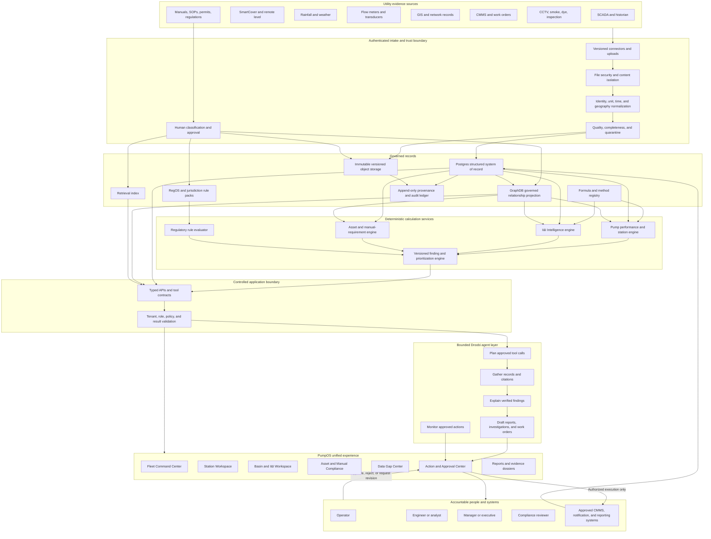
```mermaid
flowchart TB
    subgraph Utility["Utility evidence sources"]
        SCADA["SCADA and historian"]
        SMART["SmartCover and remote level"]
        RAIN["Rainfall and weather"]
        FLOW["Flow meters and transducers"]
        GIS["GIS and network records"]
        CMMS["CMMS and work orders"]
        TESTS["CCTV, smoke, dye, inspection"]
        DOCS["Manuals, SOPs, permits, regulations"]
    end

    subgraph Boundary["Authenticated intake and trust boundary"]
        CONN["Versioned connectors and uploads"]
        MAL["File security and content isolation"]
        NORMAL["Identity, unit, time, and geography normalization"]
        DQ["Quality, completeness, and quarantine"]
        REVIEW["Human classification and approval"]
    end

    subgraph Record["Governed records"]
        PG["Postgres structured system of record"]
        OBJ["Immutable versioned object storage"]
        RET["Retrieval index"]
        GRAPH["GraphDB governed relationship projection"]
        FORM["Formula and method registry"]
        RULE["RegOS and jurisdiction rule packs"]
        AUDIT["Append-only provenance and audit ledger"]
    end

    subgraph Engines["Deterministic calculation services"]
        PUMP["Pump performance and station engine"]
        II["I&I Intelligence engine"]
        ASSET["Asset and manual-requirement engine"]
        REG["Regulatory rule evaluator"]
        RISK["Versioned finding and prioritization engine"]
    end

    subgraph API["Controlled application boundary"]
        TOOLS["Typed APIs and tool contracts"]
        POLICY["Tenant, role, policy, and result validation"]
    end

    subgraph Experience["PumpOS unified experience"]
        FLEET["Fleet Command Center"]
        STATION["Station Workspace"]
        BASIN["Basin and I&I Workspace"]
        MANUAL["Asset and Manual Compliance"]
        GAP["Data Gap Center"]
        ACTION["Action and Approval Center"]
        REPORT["Reports and evidence dossiers"]
    end

    subgraph Agents["Bounded Droobi agent layer"]
        PLAN["Plan approved tool calls"]
        GATHER["Gather records and citations"]
        EXPLAIN["Explain verified findings"]
        DRAFT["Draft reports, investigations, and work orders"]
        WATCH["Monitor approved actions"]
    end

    subgraph People["Accountable people and systems"]
        OP["Operator"]
        ENG["Engineer or analyst"]
        MGR["Manager or executive"]
        COMPLY["Compliance reviewer"]
        DOWN["Approved CMMS, notification, and reporting systems"]
    end

    Utility --> CONN
    CONN --> MAL
    MAL --> NORMAL
    NORMAL --> DQ
    DQ --> PG
    DQ --> OBJ
    DOCS --> REVIEW
    REVIEW --> OBJ
    REVIEW --> RET
    REVIEW --> GRAPH
    REVIEW --> RULE
    PG --> GRAPH
    PG --> AUDIT
    OBJ --> AUDIT
    FORM --> II
    FORM --> PUMP
    PG --> PUMP
    PG --> II
    PG --> ASSET
    GRAPH --> PUMP
    GRAPH --> II
    GRAPH --> ASSET
    RULE --> REG
    PUMP --> RISK
    II --> RISK
    ASSET --> RISK
    REG --> RISK
    RISK --> TOOLS
    PG --> TOOLS
    GRAPH --> TOOLS
    RET --> TOOLS
    TOOLS --> POLICY
    POLICY --> Experience
    POLICY --> PLAN
    PLAN --> GATHER
    GATHER --> EXPLAIN
    EXPLAIN --> DRAFT
    DRAFT --> ACTION
    ACTION --> People
    People -->|Approve, reject, or request revision| ACTION
    ACTION -->|Authorized execution only| DOWN
    DOWN --> PG
    WATCH --> ACTION
```

**How to read the diagram:** Start at the top. Evidence enters through controlled intake. Accepted records are stored according to their type. Deterministic engines create reproducible results. Typed APIs expose those results. PumpOS displays them. Droobi can gather and explain them. A person controls consequential action.

**What to notice:** No arrow runs directly from a raw document or language model into an external action. No agent arrow bypasses the deterministic engines to create engineering numbers.

**What this diagram does not prove:** It is a target architecture. It does not claim that every connector, dashboard, engine, review workflow, or AWS control is implemented today.

### 5.2 Executive interpretation

The upper half protects trust. The lower half produces value. If APAS skips the upper half, the agent can produce confident language without a defensible record. If APAS builds only the upper half, it creates a well-governed data platform that still leaves the user to decide what to do.

### 5.3 Developer interpretation

The diagram defines service boundaries and permitted information flow:

- Raw external data enters through adapters.
- Boundary validation occurs before domain execution.
- Structured records and documents have different authorities.
- Graph writes occur through reviewed projection or intake paths.
- Engines do not call an LLM.
- The UI does not recalculate engine outputs.
- Agents call the same typed contracts available to the application.
- External writes require a policy and approval record.

### 5.4 Technical-review interpretation

Every arrow needs a contract containing:

- Producer and consumer
- Schema and semantic version
- Tenant and subject identity
- Authentication and authorization
- Units and time basis
- Idempotency behavior
- Data-quality state
- Provenance
- Failure behavior
- Retry and dead-letter behavior where applicable
- Retention and correction policy
- Observability and service-level objective

---

## 6. Product and bounded-context architecture

### 6.1 Sub-diagram: product map

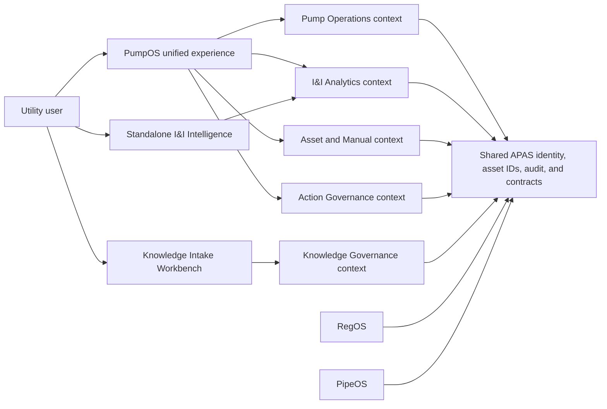
```mermaid
flowchart LR
    USER["Utility user"] --> PUMPOS["PumpOS unified experience"]
    USER --> IIAPP["Standalone I&I Intelligence"]
    USER --> INTAKE["Knowledge Intake Workbench"]

    PUMPOS --> PUMPCTX["Pump Operations context"]
    PUMPOS --> IICTX["I&I Analytics context"]
    PUMPOS --> ASSETCTX["Asset and Manual context"]
    PUMPOS --> ACTIONCTX["Action Governance context"]

    IIAPP --> IICTX
    INTAKE --> KNOWCTX["Knowledge Governance context"]

    PUMPCTX --> SHARED["Shared APAS identity, asset IDs, audit, and contracts"]
    IICTX --> SHARED
    ASSETCTX --> SHARED
    ACTIONCTX --> SHARED
    KNOWCTX --> SHARED
    REGOS["RegOS"] --> SHARED
    PIPEOS["PipeOS"] --> SHARED
```

**Plain English:** The user may enter through different doors, but the rooms share the same building rules. PumpOS is the main operating door. I&I can also have its own door. Knowledge administrators use a separate workbench because reviewing documents is not the same job as running a station.

**Developer meaning:** Separate bounded contexts can be packages or services. They must not share database tables casually. They exchange stable identifiers and versioned contracts.

**Value:** APAS can sell, deploy, test, and evolve capabilities independently while still giving the customer one connected experience.

### 6.2 Context ownership matrix

| Context | Owns | Reads | Must not own |
| --- | --- | --- | --- |
| Pump Operations | Live station state, operational settings, pump findings | Asset facts, I&I results, graph topology, regulatory citations | I&I method selection or regulatory source authority |
| I&I Analytics | Events, baselines, RDII models, uncertainty, I&I results | Flow, rainfall, basin, topology, pump consequence | Raw SCADA ownership or work-order execution |
| Asset and Manual | Asset applicability, approved requirements, task schedules, compliance findings | Asset records, documents, completed work | Unreviewed AI extraction as an approved requirement |
| Knowledge Governance | Document intake, classification, entity resolution, review, supersession | Asset registry, ontology, tenant dictionary | Operational readings or calculation authority |
| RegOS | Regulatory sources, applicability, obligation evidence, freshness | Jurisdiction, facility, event facts | Engineering calculations or legal determinations without review |
| Action Governance | Recommendation, draft, approval, dispatch, completion, rejection | Findings, people, downstream systems | Creation of underlying engineering facts |
| Droobi | Tool planning, evidence assembly, explanation, drafting | Approved read tools and permitted action tools | Arithmetic, silent defaults, autonomous facility control |

### 6.3 Why not one application codebase?

A single user interface can call several services. Putting every capability into one codebase creates hidden coupling:

- A manual-parser change can break station operations.
- A dashboard release can force formula revalidation.
- A graph migration can block telemetry ingestion.
- A regulatory content update can require redeploying engineering code.
- A customer wanting only I&I must deploy the whole PumpOS stack.

The target is not maximum service count. The target is clear authority. A modular monolith can be acceptable initially if the boundaries are enforced in code, tests, schemas, and dependency rules.

### 6.4 Minimum deployment shape

For an early implementation, the bounded contexts may be deployed as:

```text
apps/web                  PumpOS user experience
apps/api                  authenticated API gateway and policy
packages/pump-engine      pure pump and station calculations
packages/ii-engine        pure I&I calculations
packages/asset-engine     pure manual and maintenance rules
packages/shared-contracts versioned identifiers and result envelopes
packages/tools            typed agent tools
workers/ingestion         telemetry and document workers
workers/projection        Postgres-to-GraphDB projection
```

The code can later separate into services when scaling, security, release cadence, or product packaging requires it.

---

## 7. The Line Rule and authority model

### 7.1 Sub-diagram: one number from evidence to action

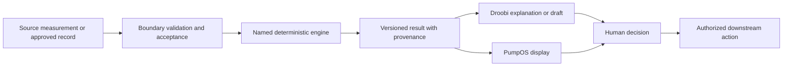
```mermaid
flowchart LR
    SOURCE["Source measurement or approved record"]
    ACCEPT["Boundary validation and acceptance"]
    ENGINE["Named deterministic engine"]
    RESULT["Versioned result with provenance"]
    UI["PumpOS display"]
    AGENT["Droobi explanation or draft"]
    HUMAN["Human decision"]
    ACTION["Authorized downstream action"]

    SOURCE --> ACCEPT --> ENGINE --> RESULT --> UI
    RESULT --> AGENT --> HUMAN --> ACTION
    UI --> HUMAN
```

**Plain English:** The number is worked out once, in the controlled engine. The screen displays it. The agent talks about it. The person decides what to do.

**Value:** A regulator, engineer, operator, or auditor can trace a sentence back to the exact calculation and source records.

### 7.2 Authority ladder

| Layer | May do | May not do |
| --- | --- | --- |
| Source adapter | Read and normalize declared source fields | Invent missing values or reinterpret the source |
| Data-quality layer | Accept, reject, quarantine, or qualify a record | Repair a material value without a governed correction |
| Deterministic engine | Apply approved formulas and rules | Choose an unsupported method or call an LLM |
| Finding engine | Evaluate a versioned criterion | Declare legal liability or physical causation without evidence |
| User interface | Display results and collect controlled input | Recalculate values in browser code |
| Agent | Select allowed tools, compare, explain, and draft | Perform hidden arithmetic or bypass policy |
| Human approver | Accept, reject, revise, or dispatch within authority | Change the underlying result without a correction record |
| Downstream system | Execute an approved, authorized action | Treat an unapproved draft as instruction |

### 7.3 Example: storm-related station finding

1. A flow meter reports values every five minutes.
2. The ingestion layer checks units, timestamp order, gaps, range, and meter status.
3. The I&I engine applies an approved dry-weather baseline and event method.
4. The pump engine evaluates the station consequence using accepted pump and wet-well data.
5. The finding engine creates a capacity-exposure finding with method and uncertainty.
6. PumpOS displays the finding.
7. Droobi gathers the calculation, upstream topology, manual limits, open work orders, and regulatory citations.
8. Droobi drafts an investigation plan.
9. An engineer or manager approves, revises, or rejects the draft.
10. The approved plan is sent to the work-order system.
11. Completion evidence returns to PumpOS.

At no point does Droobi create a new rainfall coefficient or change the pump capacity.

---

## 8. Telemetry and operational-data pipeline

### 8.1 Sub-diagram: sensor to finding

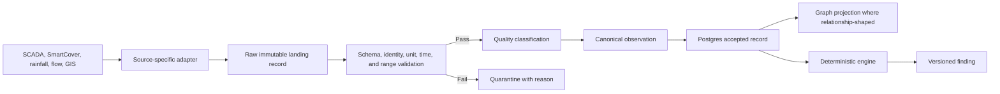
```mermaid
flowchart LR
    EXT["SCADA, SmartCover, rainfall, flow, GIS"]
    ADAPT["Source-specific adapter"]
    RAW["Raw immutable landing record"]
    VALID["Schema, identity, unit, time, and range validation"]
    QUAL["Quality classification"]
    NORM["Canonical observation"]
    STORE["Postgres accepted record"]
    PROJECT["Graph projection where relationship-shaped"]
    COMPUTE["Deterministic engine"]
    FIND["Versioned finding"]

    EXT --> ADAPT --> RAW --> VALID
    VALID -->|Pass| QUAL --> NORM --> STORE
    VALID -->|Fail| QUAR["Quarantine with reason"]
    STORE --> PROJECT
    STORE --> COMPUTE --> FIND
```

**What to notice:** The raw record is retained. Normalization does not erase what the source sent. Failed data remains visible with a reason.

**What the diagram does not establish:** A passed schema check does not prove field calibration or physical accuracy.

### 8.2 Required adapter contract

Every external adapter should declare:

- Source system and endpoint
- Tenant
- Credential reference
- Pull or push method
- Expected schema and version
- Source identifier mapping
- Unit mapping
- Time-zone and daylight-saving treatment
- Poll or event frequency
- Backfill window
- Idempotency key
- Retry limit
- Late-arrival policy
- Deletion or correction policy
- Quality checks
- Health telemetry
- Owner and support contact

### 8.3 Data-quality states

Recommended states are:

- `accepted`
- `accepted_with_warning`
- `provisional`
- `quarantined`
- `rejected`
- `superseded`
- `missing_expected`

Each state must carry a reason code. “Bad data” is not a sufficient reason.

Example reasons:

- Unit absent
- Timestamp outside allowed window
- Duplicate source event
- Sensor outside calibrated range
- Impossible rate of change
- Stuck value
- Gap exceeds method limit
- Station identity unresolved
- Meter under surcharge or backwater uncertainty
- Source correction received

### 8.4 Why the raw landing record matters

If a connector later maps gallons per minute as gallons per day, APAS must be able to:

1. Locate every affected normalized record.
2. Reproduce what the source originally sent.
3. Correct the mapping.
4. Rebuild affected calculations.
5. Supersede findings.
6. Notify reviewers of materially changed decisions.

Without the raw record, the system may know that a number is wrong but not know how it became wrong.

---

## 9. Knowledge ingestion workbench

### 9.1 Purpose

The Knowledge Intake Workbench is the controlled environment where documents and structured files become searchable, connected, and usable. It should not be the normal PumpOS operating dashboard because its users, risks, and review tasks differ.

Operators may upload or propose content. Knowledge stewards, utility subject-matter experts, engineers, and APAS reviewers govern what becomes an accepted fact, relationship, or executable rule.

### 9.2 Sub-diagram: governed document intake

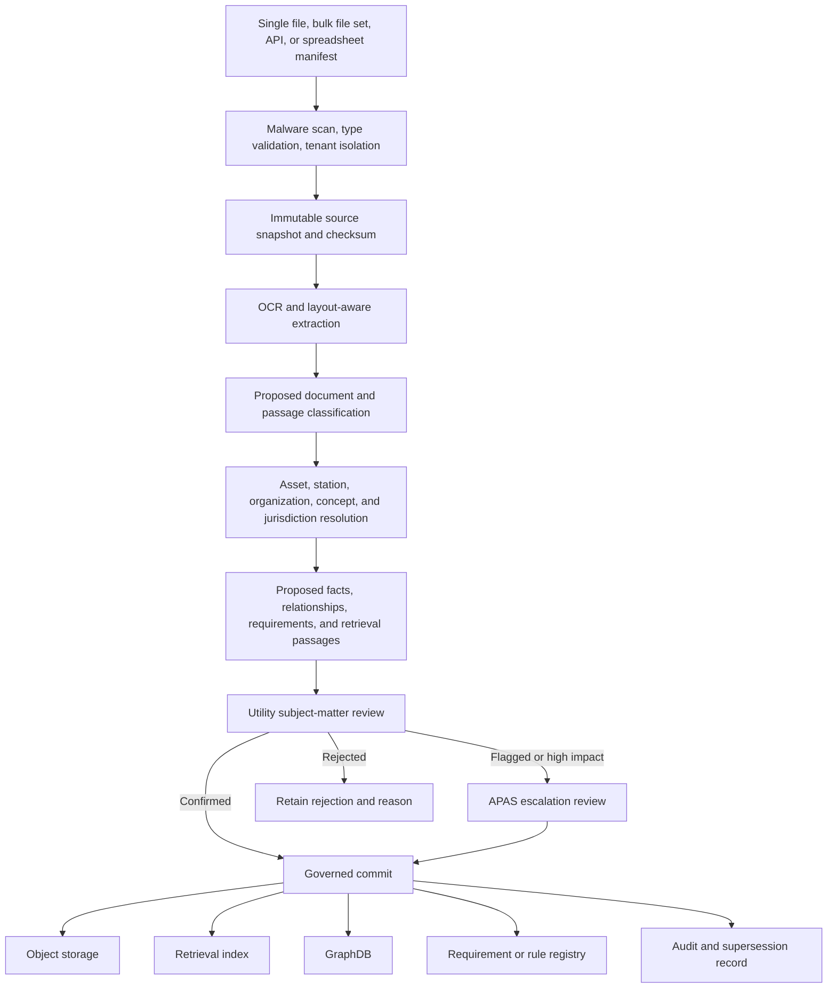
```mermaid
flowchart TB
    UP["Single file, bulk file set, API, or spreadsheet manifest"]
    SAFE["Malware scan, type validation, tenant isolation"]
    SNAP["Immutable source snapshot and checksum"]
    OCR["OCR and layout-aware extraction"]
    CLASS["Proposed document and passage classification"]
    RESOLVE["Asset, station, organization, concept, and jurisdiction resolution"]
    PROPOSE["Proposed facts, relationships, requirements, and retrieval passages"]
    UTILITY["Utility subject-matter review"]
    APAS["APAS escalation review"]
    COMMIT["Governed commit"]
    OBJECT["Object storage"]
    INDEX["Retrieval index"]
    GRAPH["GraphDB"]
    REQUIRE["Requirement or rule registry"]
    AUDIT["Audit and supersession record"]

    UP --> SAFE --> SNAP --> OCR --> CLASS --> RESOLVE --> PROPOSE --> UTILITY
    UTILITY -->|Confirmed| COMMIT
    UTILITY -->|Flagged or high impact| APAS --> COMMIT
    UTILITY -->|Rejected| REJECT["Retain rejection and reason"]
    COMMIT --> OBJECT
    COMMIT --> INDEX
    COMMIT --> GRAPH
    COMMIT --> REQUIRE
    COMMIT --> AUDIT
```

**Plain English:** AI may read and suggest. A qualified person decides what the organization accepts. The original document is always retained.

**Developer meaning:** Extraction objects and approved domain objects must use different schemas and states. A proposed relationship cannot be queried as if it were approved.

### 9.3 Classification model

A single manual or SOP can contain several passage types:

| Passage type | Example | Destination after approval |
| --- | --- | --- |
| Descriptive reference | “The pump uses a double mechanical seal.” | Retrieval index and asset fact |
| Procedure | “Close the isolation valve before removal.” | Procedure registry and retrieval |
| Maintenance requirement | “Inspect every 2,000 operating hours.” | Asset requirement registry |
| Operating limit | “Do not exceed the listed starts per hour.” | Deterministic rule candidate |
| Regulatory obligation | Permit reporting condition | RegOS governed obligation path |
| Definition | Manufacturer definition of a term | Dictionary with source scope |
| Relationship | Manual applies to models X and Y | Graph projection |
| Historical statement | Component replaced on a stated date | Asset history after verification |
| Unverified claim | Handwritten note with unknown author | Retained as unverified evidence |

### 9.4 Review-state machine

```text
uploaded
  -> extracted
  -> classified
  -> linked
  -> proposed
  -> utility_review
      -> approved
      -> rejected
      -> needs_revision
      -> escalated_to_APAS
  -> committed
  -> superseded or withdrawn
```

No state should be represented only by a user-interface label. It needs a stored event, actor, timestamp, version, and reason.

### 9.5 Customer control and APAS governance

The meeting contained both ideas:

- The customer must have the final say over its local facts and procedures.
- APAS must prevent unreviewed or contradictory content from polluting a shared graph.

The resolution is authority by evidence class:

- A utility approves its asset facts, naming, and local procedures.
- APAS administers schemas, quality rules, platform safety, and shared vocabulary.
- A qualified engineer approves extracted engineering requirements when needed.
- RegOS governance approves regulatory classification and applicability records.
- A shared public ontology or definition cannot be changed by one tenant's terminology.

### 9.6 Prompt-injection defense

Documents are untrusted content. A PDF may contain text that tells an AI to ignore its rules, reveal secrets, or perform an external action. All extracted text must enter model context as delimited data, never as instructions. File parsing should run with restricted permissions, no implicit network access, and limits on size, recursion, and embedded objects.

---

## 10. Manuals and executable asset knowledge

### 10.1 The reframe

A manual is not valuable merely because a chatbot can search it. Its deeper value is that it can describe what the utility must inspect, maintain, avoid, record, and verify for a specific asset.

### 10.2 Sub-diagram: manual to action


```mermaid
flowchart LR
    MAN["Versioned manufacturer manual"]
    MODEL["Manufacturer, model, revision, and applicability"]
    PASS["Source passage with page locator"]
    EXTRACT["Proposed requirement extraction"]
    REVIEW["Qualified human review"]
    REQ["Approved requirement object"]
    SCHED["Deterministic due-date or limit evaluation"]
    FIND["Finding when due, overdue, or violated"]
    DRAFT["Agent-drafted work order or explanation"]
    APPROVE["Human approval"]
    COMPLETE["Completion evidence"]
    HISTORY["Asset and warranty history"]

    MAN --> MODEL --> PASS --> EXTRACT --> REVIEW --> REQ --> SCHED --> FIND
    FIND --> DRAFT --> APPROVE --> COMPLETE --> HISTORY
    HISTORY --> SCHED
```

**What to notice:** The requirement includes an exact passage locator and asset applicability. The agent appears only after the deterministic finding.

**What this diagram does not prove:** A manufacturer statement is not automatically applicable to every installation or a substitute for utility procedures and professional judgment.

### 10.3 Approved requirement object

```yaml
requirement_id: stable_identifier
source_document_id: manual_identifier
source_version: manual_revision
source_locator: page_section_table_or_figure
requirement_type: inspection_maintenance_limit_safety_warranty
requirement_text: reviewed_normalized_statement
applies_to:
  manufacturer: value
  model: value
  serial_range: optional
  asset_ids: []
trigger:
  basis: calendar_runtime_starts_condition_event
  interval_or_limit: explicit_value
  unit: explicit_unit
conditions: []
exceptions: []
effective_date: date
review:
  state: approved
  reviewer: accountable_person
  reviewed_at: timestamp
supersession:
  replaces: optional_identifier
  replaced_by: optional_identifier
```

### 10.4 Asset replacement behavior

When a pump or motor is replaced, the system must:

1. End the old asset's active installation interval.
2. Preserve its manual, task, finding, and maintenance history.
3. Resolve the new asset's manufacturer and model.
4. Identify applicable manuals and revisions.
5. Propose a new maintenance schedule.
6. Require review before activating requirements.
7. Re-evaluate pump curves, controls, energy, cycling, and station capacity.
8. Record warranty terms and evidence requirements.

Reusing the old schedule without checking applicability is a data error.

### 10.5 Manual dashboard value

The dashboard converts a file cabinet into operational questions:

- Which installed assets lack an applicable manual?
- Which manuals have been superseded?
- Which required tasks are due or overdue?
- Which task was completed without required evidence?
- Which operating findings conflict with manufacturer limits?
- Which warranty may be exposed?
- Which station cannot be evaluated because model or serial data is missing?

---

## 11. GraphDB, Postgres, retrieval, and object storage

### 11.1 Four stores, four jobs

| Store | Primary job | Example | It must not become |
| --- | --- | --- | --- |
| Postgres | Authoritative structured transactions and state | Station, pump, finding, approval | A free-form document store or uncontrolled graph |
| Object storage | Preserve original files and versions | PDF manual revision C | A query engine for operational relationships |
| Retrieval index | Find relevant passages | Search “maximum starts per hour” | The authority that approves the answer |
| GraphDB | Query governed relationships | Which upstream assets and requirements affect Station B? | A replacement for Postgres or a place for unreviewed triples |

### 11.2 Sub-diagram: projection and query

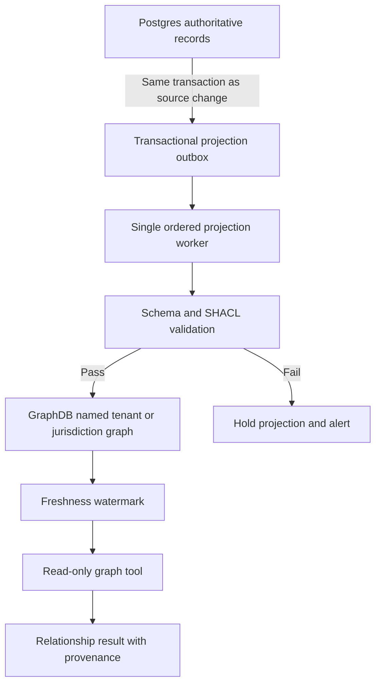
```mermaid
flowchart TB
    PG["Postgres authoritative records"]
    OUTBOX["Transactional projection outbox"]
    WORKER["Single ordered projection worker"]
    SHAPE["Schema and SHACL validation"]
    GRAPH["GraphDB named tenant or jurisdiction graph"]
    WATER["Freshness watermark"]
    TOOL["Read-only graph tool"]
    ANSWER["Relationship result with provenance"]

    PG -->|Same transaction as source change| OUTBOX
    OUTBOX --> WORKER --> SHAPE
    SHAPE -->|Pass| GRAPH --> WATER --> TOOL --> ANSWER
    SHAPE -->|Fail| HOLD["Hold projection and alert"]
```

**Plain English:** Postgres keeps the official record. A controlled worker creates a relationship view in GraphDB. A query can use the graph only when the projection is current enough.

**Current PumpOS alignment:** The supplied repository already specifies a transactional outbox, a single projection writer, SHACL validation, read-only SPARQL access, and freshness watermarks [AB-S7, AB-S8].

### 11.3 What GraphDB adds

GraphDB earns its place when the question requires several connected steps:

- Which basins feed a station?
- Which stations feed a downstream facility?
- Which manual applies to the installed pump model?
- Which approved requirement came from that manual revision?
- Which findings affect assets connected to a critical facility?
- Which regulation or procedure applies to this station and action?
- Which term used by this utility maps to the canonical concept?

A relational database can answer many of these questions. GraphDB becomes valuable when relationship depth, changing schemas, shared vocabulary, and cross-domain reasoning are frequent.

### 11.4 Example graph

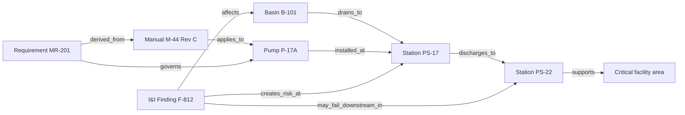
```mermaid
graph LR
    B1["Basin B-101"] -->|drains_to| S1["Station PS-17"]
    P1["Pump P-17A"] -->|installed_at| S1
    M1["Manual M-44 Rev C"] -->|applies_to| P1
    R1["Requirement MR-201"] -->|derived_from| M1
    R1 -->|governs| P1
    S1 -->|discharges_to| S2["Station PS-22"]
    S2 -->|supports| C1["Critical facility area"]
    F1["I&I Finding F-812"] -->|affects| B1
    F1 -->|creates_risk_at| S1
    F1 -->|may_fail_downstream_in| S2
```

**Reading guide:** Begin with Basin B-101. Its flow reaches PS-17. The installed pump has a specific manual and requirement. PS-17 discharges to PS-22. The I&I finding therefore has an operational path beyond its source basin.

**Truth boundary:** The edge `may_fail_downstream_in` is a governed risk relationship, not proof that a downstream failure will occur.

### 11.5 Vocabulary and dictionary architecture

Internally, the technical schema should separate:

1. OneWater upper ontology
2. PumpOS and I&I domain ontology
3. Canonical concept registry
4. Tenant dictionary
5. Operational instances

Example:

```text
Canonical concept: Wastewater pump station
Preferred public label: Pump station
Accepted synonym: Lift station
Tenant A label: LS
Tenant B legacy label: SPS
Instance: OPA-LS-07
```

A tenant may add a local label without changing the canonical meaning for every other customer.

### 11.6 Graph write policy

Graph writes should come only from:

- The controlled Postgres projection worker
- The governed knowledge-intake commit process
- An approved ontology or vocabulary publication process
- A controlled correction or supersession process

Droobi and ordinary read tools should not write directly to GraphDB.

---

## 12. I&I placement and four-level analytical model

### 12.1 Why I&I sits beside PumpOS, not inside the agent

I&I calculations need:

- Approved methods
- Formula versions
- Unit control
- Event selection
- Calibration
- Uncertainty
- Test vectors
- Numerical policies
- Field validation
- Qualified review

Those are deterministic application responsibilities. An agent can select among approved methods only through a policy tool that checks applicability. It cannot create or modify the mathematics from a prompt.

### 12.2 Sub-diagram: four levels

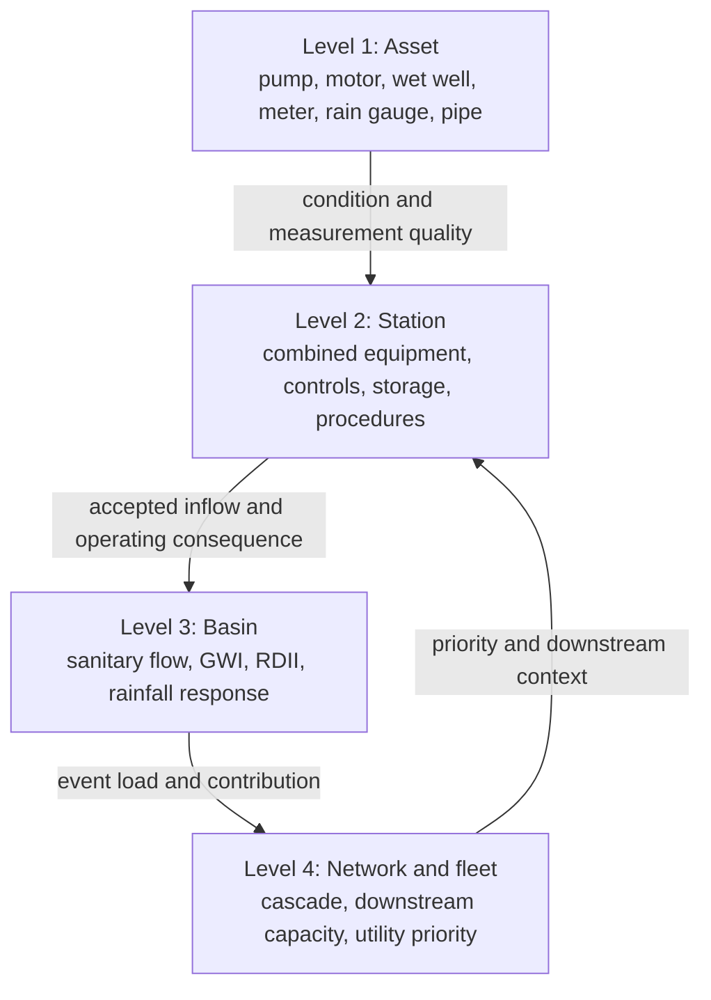
```mermaid
flowchart TB
    ASSET["Level 1: Asset\npump, motor, wet well, meter, rain gauge, pipe"]
    STATION["Level 2: Station\ncombined equipment, controls, storage, procedures"]
    BASIN["Level 3: Basin\nsanitary flow, GWI, RDII, rainfall response"]
    FLEET["Level 4: Network and fleet\ncascade, downstream capacity, utility priority"]

    ASSET -->|condition and measurement quality| STATION
    STATION -->|accepted inflow and operating consequence| BASIN
    BASIN -->|event load and contribution| FLEET
    FLEET -->|priority and downstream context| STATION
```

**Plain English:** A bad sensor can distort a station result. A station result affects the basin analysis. A basin response can threaten downstream stations. Fleet priority then changes which station receives attention first.

### 12.3 Level 1: asset

The asset level answers:

- Is the sensor acceptable?
- Does the pump curve exist?
- Is the pump operating inside an allowed region?
- Are start counts, runtime, cycling, or energy abnormal?
- Does the manual impose a limit?
- Is a force-main or wet-well characteristic missing?

Asset evidence prevents an I&I model from treating equipment behavior as rainfall response.

### 12.4 Level 2: station

The station level combines:

- Incoming flow
- Wet-well storage
- Pump availability
- Pump sequence
- Controls
- Power
- Discharge path
- Emergency contingency
- Applicable SOPs
- Manual requirements
- Current findings

The station is an operating boundary. It is not always a basin boundary.

### 12.5 Level 3: basin

The basin level decomposes observed flow:

\[
Q_{\mathrm{observed}}(t)
=
Q_{\mathrm{sanitary}}(t)
+
Q_{\mathrm{GWI}}(t)
+
Q_{\mathrm{RDII}}(t)
+
\epsilon(t)
\]

Where:

- \(Q_{\mathrm{sanitary}}\) is expected residential, commercial, industrial, and institutional wastewater within the declared boundary.
- \(Q_{\mathrm{GWI}}\) is groundwater infiltration under the selected method.
- \(Q_{\mathrm{RDII}}\) is rainfall-derived infiltration and inflow.
- \(\epsilon\) contains measurement error, model error, unrepresented operational effects, and other residuals.

The full definitions, formulas, applicability rules, and worked sample basin remain in the companion I&I technical manual [AB-S3, AB-S5].

### 12.6 Level 4: network and fleet

Fleet analysis asks:

- Which basin contributes the greatest verified wet-weather burden?
- Which station has the least margin under the event?
- Which upstream condition creates downstream exposure?
- Which critical service area is affected?
- Which data gap blocks the highest-value decision?
- Which intervention should receive investigation or capital priority?

The fleet layer may rank findings with a versioned policy. It must preserve the underlying dimensions so a single score does not hide uncertainty, equity, consequence, or regulatory context.

### 12.7 Many-to-many relationships

The model must not assume one basin equals one station.

Required relationships include:

- Basin contains subbasin
- Basin drains to meter
- Basin contributes to station
- Station receives from basin
- Station discharges to station, interceptor, or treatment facility
- Meter observes a boundary
- Flow transfer changes a boundary during a stated interval
- Station serves or affects a critical area

Every relationship should support effective dates because utility configurations change.

---

## 13. I&I calculation lifecycle and result contract

### 13.1 Sub-diagram: approved calculation path

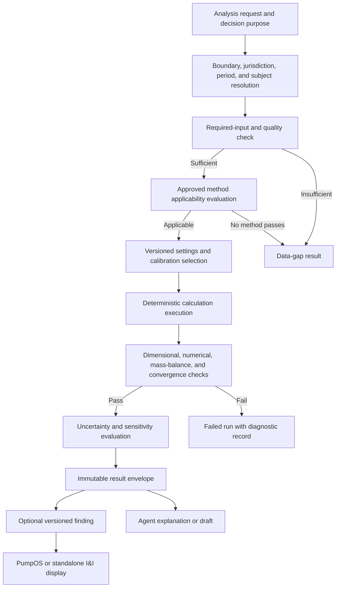
```mermaid
flowchart TB
    REQUEST["Analysis request and decision purpose"]
    BOUND["Boundary, jurisdiction, period, and subject resolution"]
    INPUT["Required-input and quality check"]
    METHOD["Approved method applicability evaluation"]
    CONFIG["Versioned settings and calibration selection"]
    RUN["Deterministic calculation execution"]
    VERIFY["Dimensional, numerical, mass-balance, and convergence checks"]
    UNCERT["Uncertainty and sensitivity evaluation"]
    RESULT["Immutable result envelope"]
    FIND["Optional versioned finding"]
    DISPLAY["PumpOS or standalone I&I display"]
    AGENT["Agent explanation or draft"]

    REQUEST --> BOUND --> INPUT
    INPUT -->|Sufficient| METHOD
    INPUT -->|Insufficient| GAP["Data-gap result"]
    METHOD -->|Applicable| CONFIG --> RUN --> VERIFY
    METHOD -->|No method passes| GAP
    VERIFY -->|Pass| UNCERT --> RESULT
    VERIFY -->|Fail| FAIL["Failed run with diagnostic record"]
    RESULT --> FIND --> DISPLAY
    RESULT --> AGENT
```

**Plain English:** Before the engine calculates, it confirms what is being analyzed, whether the necessary evidence exists, and whether an approved method fits. A failed or incomplete analysis is still a structured result.

**What to notice:** “Not calculable from the accepted record” is a valid result. It is safer and more useful than a guessed value because it tells the utility what evidence is missing.

### 13.2 Request contract

An analysis request should include:

```yaml
request_id: stable_identifier
tenant_id: utility_identifier
requested_by: actor_identifier
purpose: screening_diagnosis_planning_operations_compliance_support
subject:
  type: asset_station_basin_network
  id: canonical_identifier
period:
  start: timestamp
  end: timestamp
jurisdiction_context:
  geography: identifier
  rule_pack: optional_versioned_identifier
requested_outputs: []
prohibited_uses: []
```

Purpose matters. A method suitable for screening may not be suitable for design, compliance, or capital authorization.

### 13.3 Method-selection behavior

The selector should evaluate:

1. Whether the requested output is measured, calculated, modeled, diagnostic, or compliance-related.
2. Whether the flow, rainfall, asset, boundary, and dry-weather records are sufficient.
3. Whether the analysis is event-based or continuous.
4. Whether the method requires calibration.
5. Whether the calibration applies to the stated basin and conditions.
6. Whether groundwater, tides, canals, or antecedent moisture are material.
7. Whether the period includes operational changes.
8. Whether a local rule pack is active and applicable.
9. Whether uncertainty is adequate for the decision purpose.

The selector itself should be deterministic policy. An agent may request an evaluation and explain the result. It should not override a failed applicability check.

### 13.4 No silent defaults

The system may present a candidate default with source and consequence. It cannot silently apply one for:

- Dry-day definition
- Event separation
- Rainfall window
- Meter-gap treatment
- Time-zone handling
- Basin area
- Pipe inventory
- Groundwater baseline
- RTK parameters
- Roughness
- Pump derating
- Usable wet-well storage
- Discount rate
- Asset life
- Comparison storm
- Confidence level
- Regulatory threshold

An approved configuration can select a default for future runs. The result must retain the configuration version.

### 13.5 Sub-diagram: result and provenance envelope

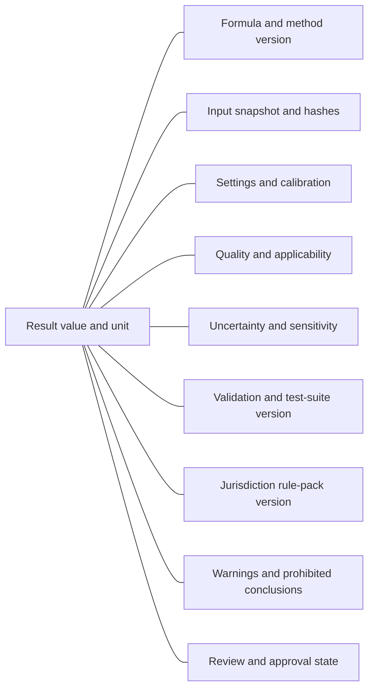
```mermaid
flowchart LR
    RESULT["Result value and unit"]
    METHOD["Formula and method version"]
    INPUTS["Input snapshot and hashes"]
    CONFIG["Settings and calibration"]
    QUALITY["Quality and applicability"]
    UNCERT["Uncertainty and sensitivity"]
    TESTS["Validation and test-suite version"]
    RULES["Jurisdiction rule-pack version"]
    LIMIT["Warnings and prohibited conclusions"]
    REVIEW["Review and approval state"]

    RESULT --- METHOD
    RESULT --- INPUTS
    RESULT --- CONFIG
    RESULT --- QUALITY
    RESULT --- UNCERT
    RESULT --- TESTS
    RESULT --- RULES
    RESULT --- LIMIT
    RESULT --- REVIEW
```

Every displayed engineering number must resolve to this envelope or to a raw accepted observation.

### 13.6 Result schema

```yaml
result_id: stable_unique_identifier
result_version: semantic_version
calculation_run_id: identifier
subject:
  type: basin_station_asset_network
  id: canonical_identifier
analysis_period: {}
method:
  formula_ids: []
  method_id: identifier
  formula_registry_version: version
  code_version: commit_or_release
inputs:
  snapshot_hash: sha256
  records: []
configuration:
  version: identifier
  assumptions: []
  calibration_record: optional_identifier
quality:
  status: accepted_provisional_failed
  applicability_checks: []
  missingness: []
outputs:
  values: []
uncertainty:
  method: identifier_or_unavailable_reason
  interval: optional
  sensitivity: []
validation:
  dimensional: pass_fail
  numerical: pass_fail
  mass_balance: optional
  convergence: optional
  suite_version: identifier
rules:
  jurisdiction_pack: optional_identifier
warnings: []
prohibited_conclusions: []
review:
  state: candidate_verified_approved_superseded
  reviewers: []
created_at: timestamp
supersedes: optional_result_identifier
```

### 13.7 Worked operational example

Illustrative sequence:

- A basin has an accepted rainfall event and flow record.
- The I&I engine calculates an RDII peak of 2,728 gallons per minute using the approved method and configuration from the synthetic sample basin.
- The pump engine evaluates a conservative two-pump operating point of 4,130 gallons per minute.
- The result does not merely state that the station “has capacity.” It records the event, assumed pump availability, maximum static-head case, operating-point solver, uncertainty, and excluded transient and cavitation analyses.
- A contingency screen shows that a derated one-pump case exceeds usable storage.
- PumpOS displays normal-condition margin and contingency shortfall separately.
- Droobi drafts an inspection and contingency-review request.

Transfer boundary: These values belong to the synthetic sample basin in the companion paper. They do not describe an actual Miami-Dade station.

---

## 14. Directed topology without full hydraulic modeling

### 14.1 The intended middle ground

The meeting rejected building a complete hydraulic-modeling platform. It still required PumpOS to understand that one station can affect another.

The minimum capability is a time-aware directed topology graph with operational capacity context.

### 14.2 Sub-diagram: arbitrary station connectivity

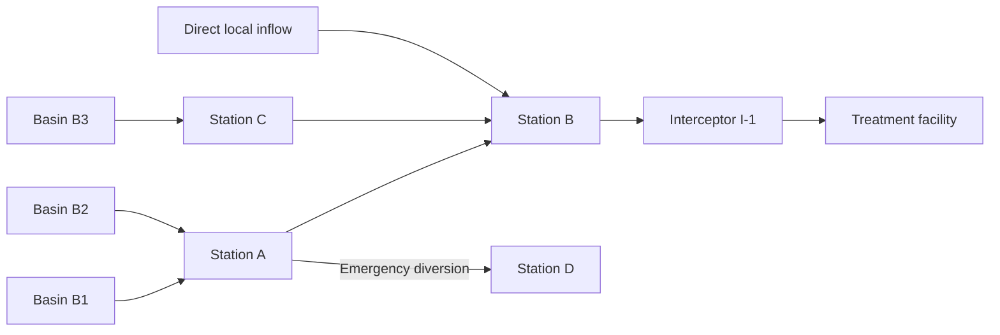
```mermaid
flowchart LR
    B1["Basin B1"] --> A["Station A"]
    B2["Basin B2"] --> A
    B3["Basin B3"] --> C["Station C"]
    A --> B["Station B"]
    C --> B
    B4["Direct local inflow"] --> B
    B --> I["Interceptor I-1"]
    I --> T["Treatment facility"]
    A -->|Emergency diversion| D["Station D"]
```

**What to notice:** Station B receives flow from more than one upstream station and from a local basin. Station A also has an emergency diversion. A compass-direction model cannot represent this safely.

**What this diagram does not prove:** The arrows do not calculate pressure, transient behavior, travel time, surcharge, or hydraulic grade line.

### 14.3 Required topology-edge fields

```yaml
edge_id: stable_identifier
from_asset_id: identifier
to_asset_id: identifier
relationship: discharges_to_receives_from_diverts_to_bypasses_to
effective_from: timestamp
effective_to: optional_timestamp
normal_or_contingency: normal_contingency
direction_basis: gis_record_drawing_operator_verified_model
capacity_context: optional_reference
travel_time_context: optional_reference
review_state: proposed_verified_superseded
provenance: []
```

### 14.4 Cascade reasoning

A cascade finding may combine:

- Upstream inflow forecast or measured event
- Upstream pump availability
- Downstream current loading
- Downstream pump availability
- Known local inflows
- Storage and contingency status
- Critical-service consequence
- Data uncertainty

The output should be framed as a risk or dependency finding unless a qualified hydraulic calculation supports a stronger conclusion.

### 14.5 When full hydraulic modeling becomes necessary

PumpOS should integrate with a hydraulic model when the decision requires:

- Pressure or hydraulic grade line
- Surcharge depth and duration
- Dynamic routing
- Travel time
- Force-main interactions
- Transients
- Control optimization
- Overflow volume and location under network dynamics
- Design certification

The architecture should accept versioned model outputs rather than reproduce every modeling capability internally.

---

## 15. Agent design and human authority

### 15.1 What makes the application agentic

A red dashboard tile is not agentic. A fixed alert is not agentic. The application becomes agentic when it can take a verified finding, assemble the right evidence across domains, propose a task plan, use approved tools, produce a reviewable work product, and monitor the approved response.

### 15.2 Sub-diagram: action ladder

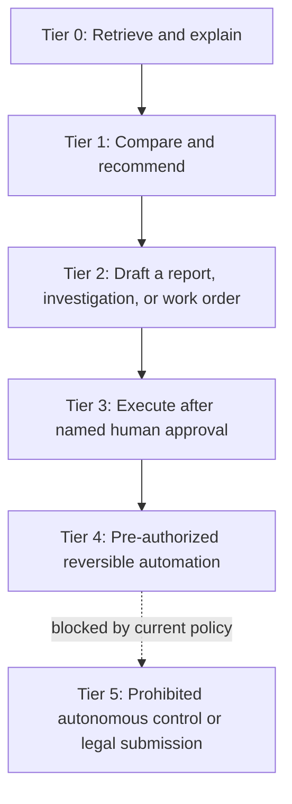
```mermaid
flowchart TB
    T0["Tier 0: Retrieve and explain"]
    T1["Tier 1: Compare and recommend"]
    T2["Tier 2: Draft a report, investigation, or work order"]
    T3["Tier 3: Execute after named human approval"]
    T4["Tier 4: Pre-authorized reversible automation"]
    T5["Tier 5: Prohibited autonomous control or legal submission"]

    T0 --> T1 --> T2 --> T3 --> T4
    T4 -. blocked by current policy .-> T5
```

### 15.3 Recommended starting authority

| Tier | Example | Initial policy |
| --- | --- | --- |
| 0 | Explain why a station finding exists and cite its records | Allowed through read-only tools |
| 1 | Recommend checking a flow meter before accepting an event | Allowed, clearly labeled recommendation |
| 2 | Draft a work order or weekly fleet report | Allowed, remains a draft |
| 3 | Send an approved work order to CMMS after a named person approves | Controlled implementation target |
| 4 | Reopen a reversible monitoring task under pre-approved policy | Future, requires separate governance |
| 5 | Change a pump control setpoint, declare compliance, or submit to a regulator independently | Prohibited |

### 15.4 Agent tool categories

Read tools:

- Get fleet overview
- Get station snapshot
- Get I&I result
- Get data gaps
- Get asset and manual requirements
- Get topology
- Search approved documents
- Search applicable regulations
- Get open work orders
- Get calculation lineage

Draft tools:

- Draft investigation
- Draft work order
- Draft management report
- Draft evidence dossier
- Draft data-request checklist

Controlled write tools:

- Submit draft for approval
- Record approval or rejection
- Dispatch approved work order
- Record completion reference

The agent should not have a generic database-write tool, arbitrary URL access, or a tool that executes free-form SQL or SPARQL.

### 15.5 Agent runtime


```mermaid
flowchart LR
    ASK["User question or finding event"]
    PLAN["Planner proposes bounded tool steps"]
    VALID["Policy validates tools, scopes, and parameters"]
    RUN["Typed tools execute"]
    GROUND["Grounding guard checks claims and citations"]
    COMPOSE["Agent composes explanation or draft"]
    REVIEW["Human review where required"]

    ASK --> PLAN --> VALID
    VALID -->|Allowed| RUN --> GROUND
    VALID -->|Denied| REFUSE["Refuse with reason"]
    GROUND -->|Grounded| COMPOSE --> REVIEW
    GROUND -->|Insufficient evidence| REFUSE
```

### 15.6 Required rails

1. Typed-tool allowlist
2. Tenant and role enforcement before tool execution
3. Composes, never computes
4. Cite or refuse
5. Drafts, never sends without approved workflow
6. No action on absent material data
7. Prompt-injection isolation
8. Step, time, token, and cost bounds
9. Durable, idempotent jobs for consequential tasks
10. Complete tool-run and approval audit

### 15.7 Agent response structure

An operational answer should separate:

- What was observed
- What was calculated
- What was modeled
- What was inferred
- What requirement or procedure applies
- What is missing
- What is recommended
- What the system is not claiming
- What approval is required

This prevents persuasive prose from collapsing evidence classes into one statement.

---

## 16. PumpOS dashboard information architecture

### 16.1 Sub-diagram: screen hierarchy

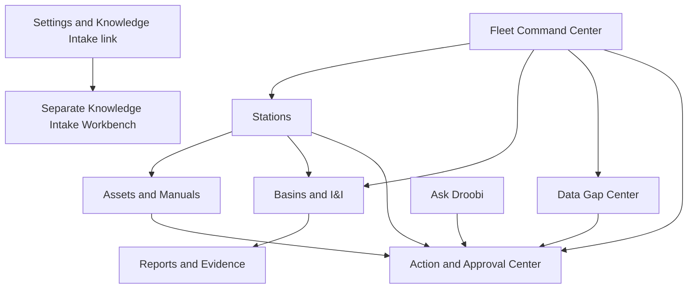
```mermaid
flowchart TB
    HOME["Fleet Command Center"]
    STATIONS["Stations"]
    BASINS["Basins and I&I"]
    ASSETS["Assets and Manuals"]
    GAPS["Data Gap Center"]
    ACTIONS["Action and Approval Center"]
    REPORTS["Reports and Evidence"]
    DROOBI["Ask Droobi"]
    ADMIN["Settings and Knowledge Intake link"]

    HOME --> STATIONS
    HOME --> BASINS
    HOME --> GAPS
    HOME --> ACTIONS
    STATIONS --> ASSETS
    STATIONS --> BASINS
    STATIONS --> ACTIONS
    BASINS --> REPORTS
    ASSETS --> ACTIONS
    GAPS --> ACTIONS
    DROOBI --> ACTIONS
    ADMIN --> WORKBENCH["Separate Knowledge Intake Workbench"]
```

### 16.2 Shared screen contract

Every operational page should show:

- Tenant and current scope
- As-of time
- Data-freshness state
- Calculation or finding version
- Evidence links
- Quality and uncertainty state
- User role
- Allowed actions
- Open approvals
- Last material change

Every engineering result should expose a “Why this number?” control that opens:

- Source records
- Formula or method
- Configuration
- Calculation time
- Quality checks
- Assumptions
- Uncertainty
- Warnings
- Superseded results

### 16.3 Shared visual semantics

- Blue: selected context, information flow, and active analysis
- Amber: caution, missing evidence, or consequence needing attention
- Green: verified favorable or stable state
- Red: critical or blocked state
- Gray: unavailable, inactive, or not applicable

Color must not be the only signal. Every state also needs text and an icon or shape.

### 16.4 Dashboard design rule

The dashboard should not maximize the number of tiles. It should lead the user through:

```text
What needs attention?
  -> What evidence supports it?
  -> What is the consequence?
  -> What can we do?
  -> Who must approve?
  -> Did the action work?
```

---

## 17. Fleet Command Center mockup

### 17.1 Wireframe

```text
┌────────────────────────────────────────────────────────────────────────────────────────────┐
│ PumpOS  | Utility: Example Utility | Fleet | As of 14:05 | Data freshness: 97% current    │
├────────────────────────────────────────────────────────────────────────────────────────────┤
│ FLEET CONDITION                                                                             │
│ [3 Critical] [8 Needs attention] [14 Data gaps] [5 Awaiting approval] [2 Event analyses]   │
├──────────────────────────────────────┬─────────────────────────────────────────────────────┤
│ PRIORITY QUEUE                       │ SYSTEM MAP AND CASCADE                               │
│ 1 PS-22 downstream exposure          │ Basin B1 → PS-17 ─┐                                 │
│   Evidence: event + pump finding     │ Basin B2 → PS-18 ─┼→ PS-22 → Interceptor → Plant    │
│   Action: contingency review         │ Local B4 ─────────┘                                 │
│ 2 PS-17 meter quality failed         │ [Select a station to inspect its dependency path]   │
│ 3 Basin B-101 RDII above baseline    │                                                     │
├──────────────────────────────────────┼─────────────────────────────────────────────────────┤
│ WET-WEATHER AND I&I                  │ ASSET AND MANUAL                                    │
│ Event under analysis: 3              │ 7 assets without applicable manual                  │
│ Basins with increasing response: 4   │ 4 overdue reviewed requirements                     │
│ Analyses blocked by data: 6          │ 2 warranty-risk findings                            │
├──────────────────────────────────────┼─────────────────────────────────────────────────────┤
│ ACTION STATUS                        │ DROOBI                                               │
│ Draft: 4 | Approval: 5 | Sent: 2     │ Ask: "Why is PS-22 first in the queue?"              │
│ Overdue: 3 | Completed this week: 9  │ [Answer must cite findings, topology, and evidence]  │
└──────────────────────────────────────┴─────────────────────────────────────────────────────┘
```

All values and states shown above are illustrative.

### 17.2 Executive reading

The executive sees risk, decision backlog, and system consequence. The page answers whether the organization is acting, not merely whether alarms exist.

### 17.3 Operator reading

The operator sees the current priority queue, affected stations, evidence status, and approved actions. The operator does not need to interpret a utility-wide score without its operational components.

### 17.4 Developer contract

Recommended endpoint:

```text
GET /v1/fleet/snapshot?as_of={timestamp}
```

Response sections:

- Scope and freshness
- Priority findings
- Cascade summaries
- I&I event summaries
- Asset and manual summaries
- Data-gap summaries
- Action-state summaries
- Citation and lineage references

The frontend may sort or filter returned records. It must not calculate risk scores or capacity values.

### 17.5 Value

- Places limited staff on the highest-consequence work
- Reveals whether data gaps are blocking decisions
- Connects basin behavior to station and downstream impact
- Shows whether findings are turning into completed work
- Gives executives an evidence-backed portfolio view

---

## 18. Station Workspace mockup


### 18.1 Wireframe

```text
┌────────────────────────────────────────────────────────────────────────────────────────────┐
│ PS-17 | Status: Needs attention | As of 14:05 | Last accepted reading: 14:00              │
├────────────────────────────────────────────────────────────────────────────────────────────┤
│ OPERATING STATE                                                                             │
│ Wet well 8.2 ft ↑ | Inflow 2,410 gpm | Discharge 2,780 gpm | Pumps 2 of 3 available       │
│ Power normal | Sensor quality: one provisional | Current event: EVT-2026-071               │
├──────────────────────────────────────┬─────────────────────────────────────────────────────┤
│ PUMP PERFORMANCE                     │ I&I AND BASIN CONTEXT                                │
│ P-17A Running | curve status normal  │ Basin B-101 current RDII peak: calculated result    │
│ P-17B Running | efficiency warning   │ Baseline: version DWF-14 | Uncertainty: visible      │
│ P-17C Unavailable | work order open  │ [Open full Basin and I&I Workspace]                 │
├──────────────────────────────────────┼─────────────────────────────────────────────────────┤
│ UPSTREAM AND DOWNSTREAM              │ STORAGE AND CONTINGENCY                              │
│ B-101 → PS-17 → PS-22                │ Normal case: acceptable screen                      │
│ B-104 ────────┘                      │ One-pump derating: shortfall                         │
│ [Show evidence and effective dates]  │ Full outage 30 min: shortfall                        │
├──────────────────────────────────────┼─────────────────────────────────────────────────────┤
│ MANUALS AND MAINTENANCE              │ FINDINGS AND ACTIONS                                 │
│ Applicable manuals: 5                │ 1 critical | 3 caution | 2 data gap                 │
│ Requirements due: 2 | overdue: 1     │ Draft contingency inspection [Review]               │
│ Missing model/serial fields: 1       │ Open work orders: 2 | Completed this month: 4       │
├──────────────────────────────────────┴─────────────────────────────────────────────────────┤
│ WHY THIS NUMBER? [Source] [Formula] [Settings] [Quality] [Uncertainty] [History]           │
└────────────────────────────────────────────────────────────────────────────────────────────┘
```

All values and states shown above are illustrative.

### 18.2 User job

The station page should let an operator or engineer answer:

- What is the station doing now?
- Are the readings trustworthy?
- Which equipment is available?
- Does the current inflow create a normal or contingency problem?
- What is happening upstream and downstream?
- Which procedures or manual requirements matter?
- What action is open, and who owns it?

### 18.3 Developer data aggregation

The Station Workspace is an application composition, not one database query. It may combine:

- Current accepted readings
- Pump and component state
- Latest active findings
- Current station settings
- Latest I&I result
- Topology projection
- Applicable manual requirements
- Data gaps
- Work orders and approvals

The API should return an as-of-consistent snapshot identifier so the page does not mix values from materially different times without showing it.

### 18.4 Value

The station page replaces the hunt across SCADA, spreadsheets, manuals, GIS, and email with one evidence-connected operating context.

---

## 19. Basin and I&I Workspace mockup

### 19.1 Wireframe

```text
┌────────────────────────────────────────────────────────────────────────────────────────────┐
│ Basin B-101 | Event EVT-2026-071 | Method RTK-Approved-v3 | State: Candidate result       │
├────────────────────────────────────────────────────────────────────────────────────────────┤
│ RAINFALL AND FLOW                                                                            │
│ Rainfall hyetograph:       ▁▃▇█▅▂▁                                                           │
│ Observed flow:             ▁▂▃▆█▇▅▃▂▁                                                       │
│ Expected dry weather:      ─────────────                                                    │
│ Estimated RDII:            ▁▁▂▅▇▆▄▂▁                                                        │
│ [Hover or focus to see accepted point, quality, and source]                                │
├──────────────────────────────────────┬─────────────────────────────────────────────────────┤
│ EVENT RESULTS                        │ DATA AND METHOD                                      │
│ Rainfall: 3.2 in                     │ Flow coverage: accepted with warnings                │
│ RDII volume: 1.780 MG                │ Rain gauges: 2 accepted, 1 excluded                  │
│ Peak total flow: 2,728 gpm           │ Dry-weather baseline: DWF-14                         │
│ Capture fraction: 3.2%               │ Calibration: synthetic example only                  │
│ Uncertainty: [visible interval]       │ Formula registry: 0.2.0                             │
├──────────────────────────────────────┼─────────────────────────────────────────────────────┤
│ STATION CONSEQUENCE                  │ COMPARISON                                           │
│ Receiving station: PS-17             │ Similar accepted events: 8                          │
│ Normal firm margin: 33.9%            │ Seasonal baseline: [select]                         │
│ Derated one-pump storage: shortfall  │ Before/after project: [not yet verified]             │
├──────────────────────────────────────┼─────────────────────────────────────────────────────┤
│ DATA GAPS                            │ ACTION                                               │
│ Groundwater record unavailable       │ Draft field investigation                           │
│ Pipe inventory review needed         │ Request meter validation                            │
│ Recession window partially limited   │ Prepare engineering review dossier                  │
├──────────────────────────────────────┴─────────────────────────────────────────────────────┤
│ WHAT THIS ESTABLISHES | WHAT IT DOES NOT ESTABLISH | FULL CALCULATION LINEAGE              │
└────────────────────────────────────────────────────────────────────────────────────────────┘
```

Illustrative values are drawn from the synthetic sample basin and are not an actual utility result.

### 19.2 Required analytical views

- Rainfall and observed-flow overlay
- Dry-weather baseline
- Estimated GWI and RDII components
- Event selection and exclusion
- Hydrograph and integrated volume
- Normalized metrics
- Method and calibration
- Uncertainty and sensitivity
- Station and network consequence
- Event comparison
- Rehabilitation comparison
- Data gaps
- Calculation lineage

### 19.3 Truth labels

Every result should visibly identify whether it is:

- Measured
- Calculated
- Modeled
- Inferred
- Regulatory
- Illustrative
- Unresolved

The UI should never present a modeled reduction as a measured gallon removed.

### 19.4 Value

This workspace gives engineers and managers one reproducible event record. It reduces arguments caused by different spreadsheets, baselines, event windows, units, and hidden assumptions.

---

## 20. Asset and Manual Compliance mockup

### 20.1 Wireframe

```text
┌────────────────────────────────────────────────────────────────────────────────────────────┐
│ Asset P-17A | Pump | Installed at PS-17 | Identity completeness: 92%                     │
├──────────────────────────────────────┬─────────────────────────────────────────────────────┤
│ ASSET IDENTITY                       │ APPLICABLE DOCUMENTS                                │
│ Manufacturer: Example Pump Co.       │ Manual M-44 Rev C | Approved applicable             │
│ Model: X300                          │ Installation bulletin IB-12 | Approved               │
│ Serial: 17A-004                      │ Superseded manual M-44 Rev B | Historical            │
│ Installed: 2022-04-16                │ Utility SOP PS-MAINT-08 | Approved                   │
│ Warranty through: 2027-04-16         │ [Open exact source and applicability review]         │
├──────────────────────────────────────┼─────────────────────────────────────────────────────┤
│ REQUIREMENTS                         │ OPERATING EVIDENCE                                  │
│ Inspect seal every 2,000 runtime hr  │ Runtime since inspection: 1,940 hr                  │
│ Lubricate every 6 months             │ Starts in last hour: 8                              │
│ Max starts per hour: reviewed limit  │ Vibration record: unavailable                       │
│ Minimum submergence: reviewed limit  │ Curve position: within selected envelope            │
├──────────────────────────────────────┼─────────────────────────────────────────────────────┤
│ FINDINGS                             │ WORK HISTORY                                        │
│ Seal inspection due in 60 hr         │ WO-440 completed 2026-05-10                         │
│ Vibration evidence missing           │ WO-319 completed 2025-11-02                         │
│ Warranty evidence at risk: none      │ Evidence attachments: 6                             │
├──────────────────────────────────────┴─────────────────────────────────────────────────────┤
│ [Draft work order] [Request missing data] [Review requirement] [View full history]         │
└────────────────────────────────────────────────────────────────────────────────────────────┘
```

All asset names and values shown above are illustrative.

### 20.2 Required states

Manual applicability:

- Proposed
- Approved
- Rejected
- Superseded
- Withdrawn
- Applicability unknown

Requirement state:

- Upcoming
- Due
- Overdue
- Completed with evidence
- Completed without required evidence
- Not applicable
- Suspended pending review

### 20.3 Value

- Protects asset life
- Reduces missed maintenance
- Preserves warranty evidence
- Connects operating behavior to manufacturer guidance
- Reveals missing asset identity
- Gives the agent trustworthy material for a work-order draft

---

## 21. Data Gap Center mockup

### 21.1 Wireframe

```text
┌────────────────────────────────────────────────────────────────────────────────────────────┐
│ Data Gap Center | 14 active | 6 block calculations | 3 block high-value decisions          │
├────┬──────────────────────────────┬──────────────────────┬───────────────┬──────────────────┤
│ ID │ Missing or unreliable input  │ Consequence          │ Priority      │ Recommended path │
├────┼──────────────────────────────┼──────────────────────┼───────────────┼──────────────────┤
│ 01 │ PS-17 pump curve             │ No operating point   │ High          │ Obtain vendor     │
│ 02 │ B-101 groundwater record     │ GWI uncertainty      │ Medium        │ Add monitoring     │
│ 03 │ Meter calibration expired    │ Event provisional    │ High          │ Field verification │
│ 04 │ P-17C model/serial absent    │ Manual unresolved    │ Medium        │ Asset inspection   │
│ 05 │ B-104 pipe inventory stale   │ Normalization weak   │ Medium        │ GIS reconciliation │
├────┴──────────────────────────────┴──────────────────────┴───────────────┴──────────────────┤
│ Selected gap: formulas affected | accepted substitutes | required frequency | owner | due  │
│ [Draft data request] [Assign investigation] [Mark resolved with evidence]                  │
└────────────────────────────────────────────────────────────────────────────────────────────┘
```

### 21.2 Gap object

```yaml
gap_id: identifier
subject_id: asset_station_basin_or_system
missing_requirement: field_or_evidence_identifier
reason: missing_stale_failed_quality_unresolved_identity
affected_outputs: []
decision_consequence: text
acceptable_sources: []
minimum_frequency: optional
minimum_quality: optional
recommended_acquisition: text
priority_basis: versioned_policy
owner: actor_or_team
status: open_in_progress_resolved_accepted_limitation
resolution_evidence: []
```

### 21.3 Value

The Data Gap Center converts “we cannot calculate this” into a work program. It also creates commercial clarity during onboarding because APAS can state:

- What can be delivered now
- What remains screening-only
- What additional data would improve value
- Which missing item matters most
- What it will take to close the gap

---

## 22. Action and Approval Center mockup

### 22.1 Wireframe

```text
┌────────────────────────────────────────────────────────────────────────────────────────────┐
│ Action Center | Draft 4 | Awaiting approval 5 | Approved 2 | Overdue 3 | Completed 9       │
├────────────────────────────────────────────────────────────────────────────────────────────┤
│ ACTION A-220: PS-17 contingency inspection                                                 │
│ Basis: Finding F-812 + storage screen R-992 + downstream relationship E-77                 │
│ Drafted by: Droobi | Requested by: Operations Manager | Risk: High                         │
│                                                                                            │
│ Proposed steps                                                                             │
│ 1. Verify P-17C unavailability and return-to-service estimate.                             │
│ 2. Confirm wet-well usable storage measurement.                                            │
│ 3. Validate high-flow meter performance.                                                   │
│ 4. Review temporary contingency response with PS-22 operator.                              │
│                                                                                            │
│ Evidence [8] | Assumptions [2] | Missing information [1] | Prohibited conclusions [3]     │
│                                                                                            │
│ [Approve and dispatch] [Request revision] [Reject with reason] [Open calculation lineage] │
├────────────────────────────────────────────────────────────────────────────────────────────┤
│ HISTORY: Drafted → Reviewed → Revised → Awaiting named approver                            │
└────────────────────────────────────────────────────────────────────────────────────────────┘
```

All identifiers and steps shown above are illustrative.

### 22.2 State machine

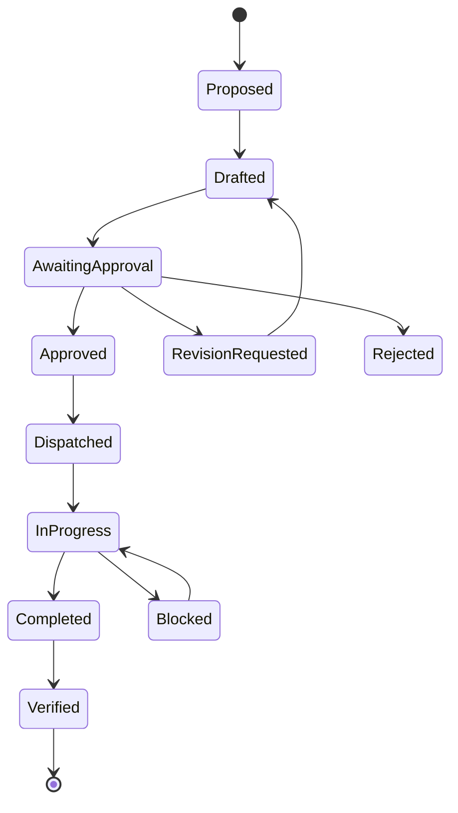
```mermaid
stateDiagram-v2
    [*] --> Proposed
    Proposed --> Drafted
    Drafted --> AwaitingApproval
    AwaitingApproval --> Approved
    AwaitingApproval --> RevisionRequested
    AwaitingApproval --> Rejected
    RevisionRequested --> Drafted
    Approved --> Dispatched
    Dispatched --> InProgress
    InProgress --> Completed
    InProgress --> Blocked
    Blocked --> InProgress
    Completed --> Verified
    Verified --> [*]
```

### 22.3 Approval policy fields

- Action type
- Consequence class
- Required role
- Separation-of-duty requirement
- Evidence minimum
- Expiration
- Allowed downstream destination
- Reversible or irreversible
- Required notification
- Completion evidence
- Verification requirement

### 22.4 Value

This screen is where PumpOS becomes more than a dashboard. It shows whether the organization acted, who approved the action, what evidence supported it, and whether the result was verified.

---

## 23. Deployment, security, and trust boundaries

### 23.1 The unresolved infrastructure decision

The supplied PumpOS Constitution pins DigitalOcean plus RunPod. The July 28 meeting described moving PumpOS to AWS and using AWS Secrets Manager. Those positions conflict.

This paper does not silently choose one. It proposes an AWS target pattern because that is the latest owner direction in the meeting, but implementation requires a formal architectural amendment.

### 23.2 Sub-diagram: proposed AWS target

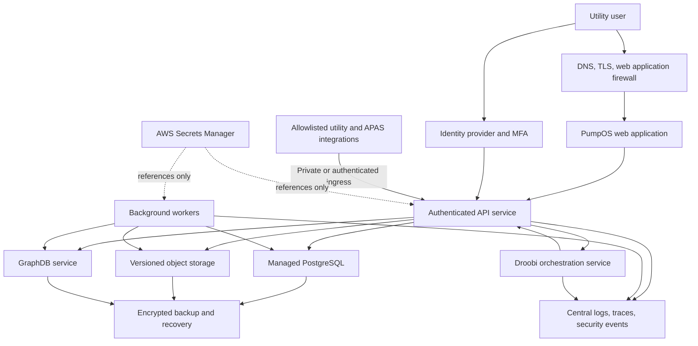
```mermaid
flowchart TB
    USER["Utility user"]
    EDGE["DNS, TLS, web application firewall"]
    IDP["Identity provider and MFA"]
    WEB["PumpOS web application"]
    API["Authenticated API service"]
    WORK["Background workers"]
    AGENT["Droobi orchestration service"]
    PG["Managed PostgreSQL"]
    OBJ["Versioned object storage"]
    GRAPH["GraphDB service"]
    SECRET["AWS Secrets Manager"]
    LOG["Central logs, traces, security events"]
    BACKUP["Encrypted backup and recovery"]
    EXT["Allowlisted utility and APAS integrations"]

    USER --> EDGE --> WEB
    USER --> IDP
    WEB --> API
    IDP --> API
    API --> PG
    API --> GRAPH
    API --> OBJ
    API --> AGENT
    WORK --> PG
    WORK --> GRAPH
    WORK --> OBJ
    AGENT --> API
    EXT -->|Private or authenticated ingress| API
    SECRET -. references only .-> API
    SECRET -. references only .-> WORK
    API --> LOG
    WORK --> LOG
    AGENT --> LOG
    PG --> BACKUP
    OBJ --> BACKUP
    GRAPH --> BACKUP
```

**What to notice:** Secrets are referenced at runtime. They are not stored in source code, documents, tool output, or agent prompts.

**What this diagram does not establish:** It does not select exact AWS services, network topology, regions, availability zones, instance sizes, or disaster-recovery regions.

### 23.3 Tenant isolation

Every operational record and action must be tenant-scoped. Recommended controls:

- Tenant identifier in every authoritative record key
- PostgreSQL row-level security forced for runtime roles
- Runtime roles without `BYPASSRLS`
- Tenant context established from verified identity, not request body
- Tenant-specific object-storage prefixes and policies
- Graph repository, named-graph, or equivalent isolation with explicit architecture review
- Per-tenant encryption and retention policy where required
- Cross-tenant tests that must return zero unauthorized records
- No facility-sensitive data in shared agent evaluation sets

### 23.4 Identity and access

Roles should be capability-based and deny by default.

Illustrative roles:

| Role | Primary access |
| --- | --- |
| Operator | Current operations, acknowledgement, inspections, approved action execution |
| Supervisor | Fleet priority, draft review, task assignment |
| Engineer or analyst | Calculation configuration review, event analysis, model and data-gap review |
| Asset manager | Asset identity, manuals, requirements, maintenance |
| Compliance reviewer | Regulatory evidence, reports, approval within authority |
| Executive | Read-only portfolio, risk, action, and value views |
| Knowledge steward | Intake, classification, dictionary, applicability review |
| APAS administrator | Platform administration without automatic customer factual authority |
| Regulator view | Explicitly scoped read-only access where authorized |

Role labels alone are insufficient. Every API operation must check an explicit capability.

### 23.5 Secrets

The meeting correctly identified environment-held secrets as a migration task. The production contract should require:

- Secrets stored in an approved secrets manager
- Short-lived credentials where possible
- Rotation policy
- Per-environment separation
- No secrets in repository, build artifact, browser bundle, logs, traces, screenshots, or agent context
- Secret-reference validation at boot
- Fail-closed startup for missing production secrets
- Emergency rotation procedure
- Audit of secret access

### 23.6 Network and egress controls

- Databases are not public.
- GraphDB administrative writes are not exposed through read endpoints.
- Agent tools use an allowlisted egress client.
- Callers cannot supply arbitrary URLs.
- Utility connectors use least-privilege credentials.
- Document processors run in isolated workers.
- Production and development networks remain separate.
- Direct model-provider access is controlled and logged.
- Personally identifiable and facility-sensitive content follows the approved model-hosting boundary.

### 23.7 Audit and tamper evidence

Audit events should include:

- Login and role changes
- Source ingestion
- Data rejection and correction
- Formula and configuration changes
- Calculation runs
- Finding creation and supersession
- Document review and graph commit
- Agent tool calls
- Draft creation
- Approval, rejection, dispatch, and completion
- Report generation and send
- Administrative access

Sent artifacts should retain a content hash and immutable evidence snapshot.

### 23.8 Resilience behavior

| Dependency failure | Required behavior |
| --- | --- |
| Postgres unavailable | Operational application fails safely because the system of record is unavailable |
| GraphDB unavailable | Graph-shaped features degrade; Postgres-backed operations may continue with visible limitation |
| Retrieval index unavailable | Document passage search is unavailable; no fabricated citation |
| RegOS unavailable | No regulatory claim or compliance draft requiring its evidence |
| Agent model unavailable | Deterministic dashboards and findings continue; explanation and drafting pause |
| I&I engine unavailable | Pump operations continue; I&I results show last accepted version and freshness |
| Source connector unavailable | Freshness degrades and a data-gap or connector-health finding appears |

---

## 24. Version control and change impact

### 24.1 Why product versioning is not enough

A software version such as “PumpOS 2.4” cannot by itself reproduce an engineering result. Reproduction may depend on:

- Source adapter version
- Input snapshot
- Unit mapping
- Formula registry version
- Calculation code version
- Method version
- Calibration record
- Configuration
- Jurisdiction rule pack
- Graph projection version
- Manual revision
- Agent prompt and model version
- Report template version

### 24.2 Sub-diagram: dependency chain

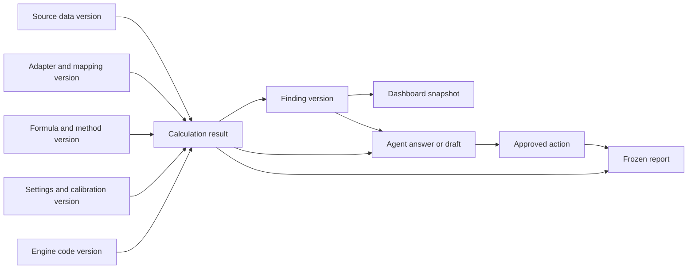
```mermaid
flowchart LR
    SOURCE["Source data version"]
    ADAPTER["Adapter and mapping version"]
    FORMULA["Formula and method version"]
    CONFIG["Settings and calibration version"]
    CODE["Engine code version"]
    RESULT["Calculation result"]
    FIND["Finding version"]
    DASH["Dashboard snapshot"]
    AGENT["Agent answer or draft"]
    ACTION["Approved action"]
    REPORT["Frozen report"]

    SOURCE --> RESULT
    ADAPTER --> RESULT
    FORMULA --> RESULT
    CONFIG --> RESULT
    CODE --> RESULT
    RESULT --> FIND --> DASH
    RESULT --> AGENT
    FIND --> AGENT
    AGENT --> ACTION
    ACTION --> REPORT
    RESULT --> REPORT
```

### 24.3 Change-impact rules

#### Formula change

Requires:

- Formula registry version increment
- Source and derivation review
- Unit and dimensional tests
- Numerical test rerun
- Golden-basin regression rerun
- Identification of affected prior results
- Decision on recomputation and notification

#### Source correction

Requires:

- Preserved original and correction
- New accepted source version
- Recalculation of affected results
- Supersession, never silent mutation, of actioned findings
- Review of reports and actions that relied on the old value

#### Manual revision

Requires:

- New document version
- Applicability review
- Difference review against prior requirements
- Activation, retirement, or amendment of affected schedules
- Notification for material requirement changes

#### Rule-pack change

Requires:

- Authority, jurisdiction, effective date, and applicability review
- New rule-pack version
- Separation from mathematical formulas
- Re-evaluation of affected findings
- Legal or qualified compliance review where required

#### Agent-model change

Requires:

- Grounding and refusal evaluations
- Tool-routing evaluation
- Citation accuracy evaluation
- Prompt-injection evaluation
- Draft-versus-send policy test
- No change to deterministic results

### 24.4 Configuration hierarchy

Recommended precedence:

```text
Universal engine policy
  -> approved method configuration
  -> jurisdiction rule pack
  -> utility configuration
  -> station or basin setting
  -> run-specific approved override
```

Every override must retain who changed it, why, when it became effective, and what results it affects. The agent may propose an override. It does not activate one.

---

## 25. The implementation program

The prior architecture assessment produced eleven workstreams, beginning with Priority 0. They are retained here because each closes a different failure mode. The order matters.

### 25.1 Program view

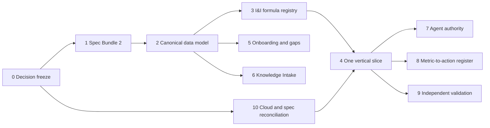
```mermaid
flowchart LR
    W0["0 Decision freeze"]
    W1["1 Spec Bundle 2"]
    W2["2 Canonical data model"]
    W3["3 I&I formula registry"]
    W4["4 One vertical slice"]
    W5["5 Onboarding and gaps"]
    W6["6 Knowledge Intake"]
    W7["7 Agent authority"]
    W8["8 Metric-to-action register"]
    W9["9 Independent validation"]
    W10["10 Cloud and spec reconciliation"]

    W0 --> W1
    W1 --> W2
    W2 --> W3
    W3 --> W4
    W2 --> W5
    W2 --> W6
    W4 --> W7
    W4 --> W8
    W4 --> W9
    W0 --> W10
    W10 --> W4
```

### 25.2 Workstream 0: Freeze the architectural decisions

#### Purpose

Convert meeting language into explicit decisions before several developers implement different meanings.

#### Required decisions

1. I&I ownership and commercial packaging
2. PumpOS experience boundary
3. Knowledge Intake Workbench boundary
4. Postgres, GraphDB, object-store, and retrieval authority
5. Agent autonomy
6. Vocabulary and ontology ownership
7. AWS versus DigitalOcean plus RunPod
8. RegOS and jurisdiction-rule ownership

#### Deliverables

- Architecture Decision Records
- PumpOS Constitution amendment
- Updated phase boundary
- Named owners
- Effective date
- Superseded decisions

#### Acceptance criteria

- No open contradiction among Constitution, PRD, Solution Architecture, Engineering Specification, and this Bible.
- Every bounded context has one accountable owner.
- Deployment target is explicit.
- I&I phase and product status are explicit.

#### Why first

A well-written interface cannot protect a system whose ownership is disputed. Decision freeze prevents architecture by accident.

### 25.3 Workstream 1: Create PumpOS Specification Bundle No. 2

#### Purpose

Translate the target architecture into contracts developers can implement and test.

#### Required contents

- Product capability map
- Context diagram
- Container and service diagram
- Data-flow diagrams
- Deployment diagram
- Trust-boundary diagram
- Interface catalog
- Event catalog
- Ownership matrix
- I&I integration contract
- Knowledge-ingestion contract
- Dashboard information architecture
- Nonfunctional requirements
- Migration plan
- Test and acceptance matrix

#### Acceptance criteria

- Every diagram has corresponding contracts.
- Every service has inputs, outputs, failure behavior, and owner.
- Every proposed write path has authorization and audit.
- Existing PumpOS interfaces are marked retained, amended, or superseded.

#### Why

The Bible explains the system. The specification bundle turns the explanation into build authority.

### 25.4 Workstream 2: Establish the canonical data model

#### Purpose

Create one shared identity and vocabulary across PumpOS, I&I Intelligence, PipeOS, RegOS, Knowledge Intake, and downstream systems.

#### Required core entities

- Organization and tenant
- User, role, and capability
- Service area
- Basin and subbasin
- Station
- Pump, motor, wet well, sensor, meter, rain gauge
- Gravity sewer, force main, interceptor, connection
- Observation and quality record
- Rainfall event
- Calculation request, run, and result
- Finding
- Document, passage, manual, and requirement
- Procedure and regulatory obligation
- Data gap
- Recommendation, draft, approval, action, and work order

#### Required controls

- Stable identifier
- Tenant ownership
- Effective time
- Source provenance
- Version
- Review state
- Supersession
- Privacy classification

#### Acceptance criteria

- One station keeps the same canonical identifier across all bounded contexts.
- Many-to-many basin and station relationships are supported.
- Asset replacement preserves historical identity.
- Every calculation subject resolves to an approved entity and boundary.

#### Why

Without shared identity, the agent can retrieve correct facts about the wrong station.

### 25.5 Workstream 3: Create and govern the I&I Formula Registry

#### Purpose

Make the formula registry the machine-readable authority for every calculation available to the application.

#### Required fields for each method

- Stable formula identifier
- Name and purpose
- Equation
- Symbol definitions
- Units and dimensional signature
- Required and optional inputs
- Applicability checks
- Assumptions
- Boundary conditions
- Failure conditions
- Uncertainty method
- Sources and derivation
- Test vectors
- Implementation reference
- Review and production status
- Deprecation and supersession

#### Required tests

- Unit conversion
- Dimensional consistency
- Hand-calculated vectors
- Invalid-domain vectors
- Mass balance
- Solver convergence
- Golden sample basin
- Independent implementation
- Field calibration and holdout
- Qualified engineering review

#### Acceptance criteria

- No production tool can call a formula lacking production status.
- Same input snapshot and version produce the same result.
- A changed formula invalidates and reruns dependent tests.
- Every result resolves to formula and source records.

#### Why

The agentic application is only as trustworthy as the engine it calls.

### 25.6 Workstream 4: Build one complete vertical slice

#### Purpose

Prove the full chain with one basin and one station before scaling.

#### Slice scope

1. Ingest station, asset, rainfall, and flow data.
2. Ingest one applicable manual and one SOP.
3. Establish station and basin topology.
4. Establish dry-weather baseline.
5. Analyze one accepted wet-weather event.
6. Produce I&I results and uncertainty.
7. Evaluate pump and storage consequence.
8. Create one deterministic finding.
9. Display it in PumpOS.
10. Have Droobi explain it with citations.
11. Draft an investigation or work order.
12. Require approval.
13. Record completion and verification.

#### Acceptance criteria

- Every dashboard number is traceable.
- Missing data creates a gap, not a default.
- The UI performs no engineering arithmetic.
- Droobi refuses unsupported conclusions.
- An approved action carries the evidence snapshot.
- Re-running the slice produces the same deterministic outputs.

#### Why

Scaling incomplete contracts multiplies defects. One vertical slice exposes boundary mistakes early.

### 25.7 Workstream 5: Build onboarding and data-gap assessment

#### Purpose

Turn customer onboarding into a structured analysis of what value can be delivered and what evidence is missing.

#### Questionnaire domains

- Utility and jurisdiction
- Stations and basins
- Asset inventory
- SCADA and historian
- Flow monitoring
- Rainfall monitoring
- Groundwater and tidal context
- GIS and topology
- Pump curves and controls
- Manuals and procedures
- Work-order history
- Inspections and field testing
- Regulatory documents
- Data access and cybersecurity
- Time coverage, frequency, units, and quality

#### Output

- Available capabilities now
- Screening-only capabilities
- Blocked calculations
- Required data
- Recommended acquisition
- Priority and consequence
- Connector plan
- Customer responsibilities
- APAS responsibilities

#### Acceptance criteria

- Every question maps to a calculation, dashboard, rule, or governance need.
- The system can state why a requested field matters.
- Data gaps are imported directly into the Data Gap Center.

#### Why

Onboarding becomes an evidence-based delivery plan instead of a generic data request.

### 25.8 Workstream 6: Implement the Knowledge Intake Workbench

#### Purpose

Create a secure, reviewable path from files to approved knowledge.

#### Minimum viable capability

- Single and bulk upload
- Spreadsheet manifest
- Checksum and immutable snapshot
- OCR and structured extraction
- Classification
- Entity and asset resolution
- Passage-level proposals
- Utility review
- APAS escalation
- Approval, rejection, and revision
- Commit to object store, retrieval, graph, or requirement registry
- Version and supersession
- Audit

#### Acceptance criteria

- Unapproved proposals cannot appear as approved PumpOS knowledge.
- Every approved statement resolves to its source passage.
- A superseded document does not silently remain active.
- Tenant content cannot enter another tenant's graph or retrieval results.
- Prompt-injection tests pass.

#### Why

GraphDB value depends on governed relationships. An ingestion shortcut can turn the graph into a faster source of wrong answers.

### 25.9 Workstream 7: Define and implement agent autonomy tiers

#### Purpose

Make “agentic” concrete without granting uncontrolled authority.

#### Deliverables

- Tool registry
- Role and capability matrix
- Action-tier policy
- Approval rules
- Draft and dispatch states
- Grounding guard
- Refusal taxonomy
- Prompt-injection controls
- Agent evaluation suite
- Incident and rollback procedure

#### Acceptance criteria

- An agent cannot compute an engineering number.
- An agent cannot access a tool outside its role and tenant.
- A missing citation blocks a regulatory claim.
- A draft cannot be mistaken for a sent artifact.
- An external write requires an approval record when policy requires it.

#### Why

Agent behavior must be enforced by software and policy, not by a sentence in a prompt.

### 25.10 Workstream 8: Create the Metric-to-Value-to-Action Register

#### Purpose

Ensure every dashboard value supports a named decision and response.

#### Required fields

```yaml
metric_id: identifier
name: plain_name
source_or_formula: identifier
user_roles: []
decision_supported: text
consequence: text
comparison_basis: identifier
threshold_basis: optional_identifier
evidence_required: []
recommended_actions: []
approval_required: role_or_none
downstream_workflow: identifier
value_hypothesis: text
prohibited_inferences: []
```

#### Acceptance criteria

- Every production dashboard metric has a register entry.
- A metric without decision value is removed or justified.
- A threshold resolves to engineering, manufacturer, utility, or regulatory authority.
- Action conversion can be measured.

#### Why

This is the defense against becoming a “dumb dashboard.”

### 25.11 Workstream 9: Validate independently

#### Purpose

Test whether the architecture and calculations work outside the team that built them.

#### Review tracks

1. Wastewater and I&I engineering
2. Pump and station operations
3. Software numerical methods
4. Data architecture and quality
5. Security and tenant isolation
6. Graph and knowledge governance
7. Regulatory applicability
8. Utility practitioner usability
9. Executive decision value

#### Evidence

- Independent hand calculations
- Alternative implementation comparison
- Synthetic boundary cases
- Historical storm events
- Field observations
- Calibration and holdout events
- Before-and-after rehabilitation data
- Failure and refusal tests
- Cross-tenant security tests
- Disaster-recovery exercise

#### Acceptance criteria

- Material defects are logged and resolved or accepted with visible limits.
- Qualified reviewers sign the exact versions reviewed.
- Production status remains blocked until all named gates pass.

#### Why

Correct code can implement the wrong method perfectly. Independent review tests method, data, implementation, and operational transfer.

### 25.12 Workstream 10: Reconcile cloud and repository specifications

#### Purpose

Make the deployment system match the approved architecture and remove the current AWS versus DigitalOcean conflict.

#### Required decisions and work

- Approved cloud target
- Environment model
- Network and trust boundaries
- Managed database selection
- GraphDB deployment
- Object storage
- Secrets management
- Identity and access management
- Backup and disaster recovery
- Observability
- Container build and image provenance
- Deployment promotion
- Rollback
- Data migration
- Security review

#### Acceptance criteria

- Constitution, Engineering Specification, infrastructure code, and deployed environment agree.
- Secrets are not held in source-controlled environment files.
- Production has no developer signer or public datastore.
- Restore and rollback are tested.
- Deployment identifies exact application and schema versions.

#### Why

Infrastructure drift can invalidate security assumptions, support procedures, recovery plans, and system diagrams.

---

## 26. Acceptance tests and definition of done

### 26.1 Architecture acceptance

- PumpOS, I&I Intelligence, Knowledge Intake, RegOS, and Droobi have explicit boundaries.
- Each authoritative record type has one system of record.
- Every interface has a versioned contract.
- No undocumented direct database or graph access crosses a boundary.
- Current-state and target-state diagrams are not confused.

### 26.2 Calculation acceptance

- Every output resolves to the formula registry.
- Units and dimensions pass.
- Invalid domains fail closed.
- Mass and volume balances close where applicable.
- Iterative solvers record tolerance, iterations, and residual.
- Display rounding never feeds calculations.
- Independent implementation and qualified review pass before production.

### 26.3 Data acceptance

- Source identity is resolved.
- Raw records are preserved.
- Accepted and quarantined records remain distinct.
- Corrections create versions and recomputation.
- Tenant-isolation tests pass.
- Data gaps have reason, consequence, owner, and resolution path.

### 26.4 Knowledge acceptance

- Original documents are checksummed and versioned.
- Every approved extracted statement has an exact locator.
- Proposed and approved states are technically separate.
- Supersession works.
- Tenant dictionaries do not alter the shared upper model automatically.
- Graph queries expose provenance and freshness.

### 26.5 Agent acceptance

- Typed tools only
- No arithmetic in agent code or prompt
- Grounded citations
- Refusal on insufficient evidence
- No cross-tenant retrieval
- Draft and sent states distinct
- Approval required for consequential writes
- Prompt-injection suite passes
- Model change evaluation passes

### 26.6 Dashboard acceptance

- Every displayed value is raw accepted data or a versioned engine result.
- Every value has as-of and quality state.
- Every engineering result has lineage.
- Every threshold has a basis.
- Missing data is visible.
- Keyboard, touch, screen-reader, phone, tablet, desktop, reduced-motion, and high-zoom reviews pass.

### 26.7 Operational acceptance

- Connector outage is visible.
- Graph outage degrades safely.
- Model outage does not stop deterministic operations.
- Backup restore is tested.
- Audit events are complete.
- On-call and incident procedures exist.
- Action completion can return to the system.

### 26.8 Definition of done for the first vertical slice

The slice is complete only when one basin and station can be followed through:

```text
source evidence
  -> accepted record
  -> calculation
  -> finding
  -> dashboard
  -> agent explanation
  -> draft
  -> human approval
  -> downstream action
  -> completion evidence
  -> verified outcome
```

All eleven transitions must be observable and reproducible.

---

## 27. Risks, contradictions, and required decisions

### 27.1 Architecture risks

#### Monolith risk

If PumpOS owns every parser, formula, graph write, regulatory rule, and agent, releases become coupled and validation becomes expensive.

**Response:** Enforce bounded contexts even if the initial deployment is a modular monolith.

#### Fragmentation risk

If every APAS product builds its own station identifiers, dictionary, retrieval index, and agent rules, the original problem returns inside APAS.

**Response:** Shared contracts, stable IDs, vocabulary governance, identity, and audit services.

#### Graph pollution risk

Unreviewed AI extraction can create plausible but false relationships.

**Response:** Proposal states, human review, exact provenance, SHACL validation, and controlled write paths.

#### Dashboard-without-action risk

The product can accumulate visual metrics without changing utility work.

**Response:** Metric-to-Value-to-Action Register and Action Center.

#### Agent-overreach risk

An impressive model may produce engineering or regulatory language beyond the evidence.

**Response:** Tool rails, evidence-class labels, cite-or-refuse, action tiers, and human authority.

### 27.2 I&I technical risks

#### Night-flow oversimplification

Minimum nighttime flow can contain real sanitary, industrial, storage, and operational effects.

**Response:** Use an approved baseline method with allowances, uncertainty, and applicability checks. Do not label all night flow as I&I.

#### Universal-threshold error

A local consent-decree or program criterion can be copied into a national product.

**Response:** Separate universal mathematics from versioned jurisdiction rule packs.

#### One-basin-one-station assumption

Real collection systems may have nested, overlapping, transferred, or many-to-many service boundaries.

**Response:** Time-aware relationship model and explicit control volumes.

#### Screening-to-design overreach

A normalized rate or simple capacity margin can be treated as design certification.

**Response:** Result-purpose labels and prohibited conclusions.

#### Model-without-field-evidence risk

A hydrograph response can be treated as proof of a defect.

**Response:** Keep modeled, diagnostic, and measured claims separate.

### 27.3 Immediate decisions required from APAS

| Decision | Why it cannot remain implicit |
| --- | --- |
| Is AWS the ratified PumpOS target? | Infrastructure code, security, cost, deployment, and recovery depend on it. |
| Is I&I activated now or still hibernated? | Team scope, branch planning, product ownership, and interfaces depend on it. |
| Does I&I live in PumpOS code or an APAS analytical service? | Validation and reuse depend on the ownership line. |
| Who commits private knowledge to GraphDB? | Customer authority and graph integrity depend on it. |
| Who owns ontology 5.4 and the dictionary? | Cross-product semantic consistency depends on it. |
| Which agent actions can execute after approval? | Tool design and legal authority depend on it. |
| What is the first real vertical-slice basin and station? | Field validation and data-access work need a concrete target. |

---

## 28. Value model by role

### 28.1 Executive

The executive gains:

- Fleet-level risk and action status
- Evidence-backed capital and staffing priorities
- Visibility into unresolved data and maintenance debt
- Connection between station condition and downstream consequence
- Proof that findings become completed work
- Reproducible reports instead of slide-specific numbers

### 28.2 Operator

The operator gains:

- One current station context
- Visible data quality
- Applicable procedures and manuals
- Clear current action and approval status
- Reduced search across systems
- Better shift handoff and institutional memory

### 28.3 Engineer and I&I analyst

The engineer gains:

- Controlled baselines and events
- Versioned methods
- Reproducible calculations
- Explicit uncertainty
- Calculation lineage
- Pump and storage consequence in the same record
- Easier review and comparison

### 28.4 Asset manager

The asset manager gains:

- Manual applicability
- Reviewed maintenance requirements
- Due and overdue tasks
- Warranty evidence
- Operating-limit findings
- Asset replacement and history continuity

### 28.5 Compliance reviewer

The compliance reviewer gains:

- Regulatory sources separated from engineering thresholds
- Applicable rule-pack versions
- Evidence-linked drafts
- Human review control
- Frozen report content
- Clear distinction between a finding and a legal determination

### 28.6 Information-technology and security team

The team gains:

- Explicit data ownership
- Tenant isolation
- Controlled connectors
- Secrets management
- Auditability
- Bounded model access
- Defined failure and recovery behavior

### 28.7 APAS product and commercial team

APAS gains:

- Reusable I&I service across products
- Clear standalone and embedded packaging
- Onboarding based on data readiness
- Visible service opportunities
- Defensible product claims
- Reduced customization through shared contracts

---

## 29. Glossary and acronyms

### 29.1 Acronyms

| Acronym | Expansion | Meaning in this paper |
| --- | --- | --- |
| API | Application Programming Interface | Controlled software contract between systems |
| APAS | APAS.AI | Product and operating organization |
| AWS | Amazon Web Services | Proposed cloud target requiring ratification |
| BWF | Base Wastewater Flow | Expected sanitary and process wastewater before I&I components |
| CCTV | Closed-Circuit Television | Sewer inspection video |
| CMMS | Computerized Maintenance Management System | Work-order and maintenance system |
| DQ | Data Quality | Fitness, completeness, and trust state of data |
| DWF | Dry-Weather Flow | Flow during accepted dry-weather conditions |
| GIS | Geographic Information System | Spatial asset and network information system |
| GWI | Groundwater Infiltration | Groundwater entering the sewer system |
| HITL | Human in the Loop | Required human review or approval |
| I&I | Infiltration and Inflow | Unwanted groundwater and storm-related water entering sanitary sewers |
| IAM | Identity and Access Management | User, service, role, and permission controls |
| LLM | Large Language Model | Language model used by an agent for planning and composition |
| MCP | Model Context Protocol | Typed tool interface pattern used by agents |
| MFA | Multi-Factor Authentication | Login requiring more than one proof |
| NAPOT | Nominal Average Pump Operating Time | Local consent-decree pump operating-time concept used in the companion case |
| OCR | Optical Character Recognition | Conversion of scanned image text into machine-readable text |
| OIDC | OpenID Connect | Identity protocol |
| PRD | Product Requirements Document | Product scope and expected behavior |
| RDII | Rainfall-Derived Infiltration and Inflow | Rainfall-related flow above expected dry-weather response |
| RLS | Row-Level Security | Database policy restricting records by tenant and role |
| RTK | R, T, and K parameters | Unit-hydrograph parameters used in an RDII method |
| SCADA | Supervisory Control and Data Acquisition | Operational monitoring and control system |
| SHACL | Shapes Constraint Language | Graph-data validation rules |
| SOP | Standard Operating Procedure | Approved organization-specific procedure |
| SPARQL | SPARQL Protocol and RDF Query Language | Query language used with GraphDB |
| SSO | Sanitary Sewer Overflow | Release of untreated wastewater from a sanitary sewer |
| VFD | Variable-Frequency Drive | Motor-control equipment that changes speed |

### 29.2 Glossary

**Accepted record:** A source record that passed the defined boundary and quality checks for a stated use.

**Action:** A governed task or external operation created from an approved recommendation or decision.

**Agent:** Software that plans and performs bounded tool use, gathers evidence, and composes language. It is not the calculation authority.

**Applicability check:** A deterministic test of whether a method, rule, manual, or requirement fits the subject and decision.

**Approval:** A recorded decision by an authorized person to accept, reject, revise, or dispatch a draft.

**As-of time:** The time through which a view or result claims its underlying records are current.

**Asset:** A physical component such as a pump, motor, wet well, sensor, meter, pipe, or station.

**Audit ledger:** Append-only history of important data, calculation, review, agent, and action events.

**Baseline:** The accepted comparison condition used to identify change or residual flow.

**Basin:** A declared service area contributing wastewater to one or more collection-system boundaries.

**Bounded context:** A defined product or software responsibility with its own rules and vocabulary.

**Calculation lineage:** The complete path from a result through formulas, versions, inputs, assumptions, configuration, and sources.

**Canonical identifier:** A stable identifier shared across authorized systems.

**Canonical concept registry:** Governed list of preferred terms, synonyms, meanings, relationships, and versions.

**Cascade risk:** The possibility that a condition at one asset or station contributes to a downstream consequence.

**Configuration:** Versioned settings selected for a calculation or operating rule.

**Control volume:** The physical and time boundary around which flows or quantities are accounted.

**Data gap:** A structured record of missing, stale, unreliable, or unresolved evidence and its consequence.

**Decision Twin:** A connected decision-support representation that joins asset condition, context, rules, consequence, and available response.

**Deterministic engine:** Tested calculation software that repeats the same result for the same accepted inputs and versions.

**Effective time:** The interval during which a fact, relationship, requirement, or configuration applies.

**Evidence class:** Label distinguishing measured, calculated, modeled, inferred, regulatory, illustrative, and unresolved statements.

**Finding:** A versioned result of applying a named rule or analytical criterion to accepted evidence.

**Formula registry:** Machine-readable authority for formulas, methods, units, applicability, tests, sources, and review status.

**Graph projection:** Relationship representation generated from an authoritative record without replacing that authority.

**Grounding:** Requirement that an agent statement resolve to approved evidence or explicitly state that evidence is insufficient.

**Human in the Loop:** Human review placed at a point where authority or consequence requires it.

**Immutable:** Preserved so the original content is not silently changed.

**Infiltration:** Groundwater entering a sanitary sewer through defects or openings.

**Inflow:** Water entering more directly through connections such as drains, cross-connections, or submerged openings.

**Jurisdiction rule pack:** Versioned set of location- and instrument-specific criteria kept separate from universal mathematics.

**Knowledge Intake Workbench:** Administrative application for document upload, classification, review, approval, and governed commit.

**Knowledge graph:** Relationship store connecting identified assets, places, documents, requirements, findings, and other concepts.

**Line Rule:** PumpOS rule that the engine computes, the agent composes, the API is the bridge, and numbers are not recalculated outside the engine.

**Manual applicability:** Reviewed relationship showing that a specific document revision applies to a specific asset, model, or serial range.

**Method:** Defined analytical procedure that may contain several formulas, settings, and applicability conditions.

**Modeled result:** Output from a model under stated calibration and assumptions, distinct from a direct measurement.

**Object storage:** File store used to preserve original documents and versions.

**Postgres:** Relational database used as the PumpOS structured system of record.

**Provenance:** Evidence of where a record or statement came from, how it changed, and who reviewed it.

**Quarantine:** Controlled state preventing a failed or questionable record from entering an accepted calculation path.

**Recommendation:** Agent or human proposal that has not yet become an approved action.

**Retrieval index:** Search structure that locates relevant passages but does not approve their meaning.

**Risk score:** Versioned prioritization output. It does not replace its underlying dimensions or establish legal liability.

**Rule:** Deterministic condition that evaluates accepted facts and creates a state or finding.

**Source snapshot:** Preserved copy of the exact source used in a record or extraction.

**Supersession:** Replacement of a record while retaining the prior version and its history.

**Tenant:** A utility or organization whose data and access remain isolated from others.

**Topology:** Directed relationship model showing how basins, stations, pipes, and facilities connect.

**Typed tool:** Agent-callable function with a fixed schema, authorization, and result contract.

**Uncertainty:** Quantified or explicitly unavailable description of the range or confidence around a result.

**Versioned result:** Result that retains the precise input, formula, code, method, configuration, and rule versions needed for reproduction.

---

## 30. Source and evidence map

| Source | Use in this Bible | Evidence class |
| --- | --- | --- |
| AB-S1, July 28 meeting transcript | Owner vision, AWS direction, ingestion workflow, I&I placement discussion, dashboards, manuals, GraphDB, ontology, agent action | Hardeep position, team statement, unresolved question |
| AB-S2, PumpOS repository archive | Current code and specification inventory | Point-in-time repository evidence |
| AB-S3, I&I technical paper | I&I concepts, sample basin, calculation boundaries, result restrictions | Candidate technical research |
| AB-S4, agent contract | Fail-closed agent and calculation behavior | Internal architecture draft |
| AB-S5, formula registry | Calculation authority and formula-version model | Candidate machine-readable registry |
| AB-S6, PumpOS Constitution | Current Line Rule, phase boundary, pinned architecture, amendment rule | Ratified internal product standard at archive date |
| AB-S7, PumpOS architecture and engineering specification | Current layers, stores, GraphDB projection, Droobi, security, deployment | Internal product specification |
| AB-S8, PumpOS status and traceability | Point-in-time implementation and data-flow claims | Internal status evidence requiring active-branch confirmation |
| AB-S9, current owner direction | Required depth, audience, diagrams, dashboards, repository delivery | Owner direction |

### 30.1 Claim boundaries

- Current-state statements resolve to the supplied PumpOS archive.
- Meeting directions are identified as positions or proposed changes.
- Target architecture is a recommendation until ratified.
- All numerical I&I methods remain governed by the companion manual and formula registry.
- Regulatory application remains governed by RegOS and jurisdiction rule packs.
- Production status is blocked until independent and qualified review.

### 30.2 Unresolved verification

- Active PumpOS branch and deployed AWS state have not been independently inspected.
- The AWS migration has not been reconciled with the ratified PumpOS Constitution.
- GraphDB and ontology 5.4 runtime status require confirmation.
- Knowledge Intake security and reliability require implementation review.
- I&I formulas require the reviews listed in the companion QA record.
- Dashboard wireframes require operator, executive, accessibility, and usability review.

---

## 31. Current white-paper score

| Dimension | Available | Awarded | Evidence for points awarded | Deduction and next work |
| --- | ---: | ---: | --- | --- |
| Teaching thesis and importance | 15 | 15 | The paper states the product decision, problem, consequence, audience, and intended change. | None for the candidate argument. |
| Complete plain-language explanation | 20 | 19 | Core concepts, every architecture layer, pipelines, dashboards, implementation workstreams, glossary, and examples are explained. | Independent novice-reader review remains unresolved. |
| Utility-wide and cross-sector value | 15 | 14 | Value is explained for executives, operators, engineers, asset managers, compliance, IT, APAS, fleet, station, basin, and network. | Transfer to PipeOS and other APAS products needs product-owner review. |
| Research depth and source quality | 15 | 10 | Complete meeting transcript, PumpOS archive, I&I manual, agent contract, and formula registry are identified and bounded. | Active branch, live deployment, and independent external architecture references were not verified in this internal reconstruction. |
| Technical accuracy and claim verification | 20 | 11 | Current and target states are separated; formula claims delegate to governed sources; technical corrections and failure boundaries are visible. | Qualified software, security, graph, wastewater, regulatory, and practitioner reviews are unresolved. |
| Diagrams and visual teaching value | 10 | 10 | Twenty-two registered diagrams, flows, state models, and dashboard wireframes carry reading guides and truth boundaries. | Rendered visual-design review remains unresolved. |
| Editorial quality, boundaries, and originality | 5 | 4 | Scope, evidence classes, unresolved questions, glossary, version control, and production prohibition are explicit. | Independent editorial and originality review remain unresolved. |
| **Total** | **100** | **83** | Strong development-grade candidate with complete architecture argument. | Cannot advance to approved specification or production because hard gates remain blocked. |

- Previous score: None
- Score change: Initial score
- Decision band: 80 to 89, strong but revision and review required
- Advancement decision: Candidate for owner sparring and architecture review, not approved implementation authority

### Hard gates

| Gate | Status | Evidence | Required next work |
| --- | --- | --- | --- |
| Material claims sourced and classified | Partial | Sources and boundaries recorded | Build claim-level register if this becomes a public Concept Brief or approved specification |
| Terminology and system boundaries consistent | Candidate pass | Ownership matrix, glossary, and diagrams | PumpOS, I&I, RegOS, Graph, and product-owner review |
| Qualified technical or practitioner review | Blocked | None independent | Complete named review tracks |
| Diagram teaching job, evidence, and truth boundary | Candidate pass | `diagram-register.yaml` and captions | Render and review visual implementation |
| Scope exclusions visible | Pass | Orientation, decision boundaries, and unresolved sections | Maintain through revision |
| Owner approval of the teaching argument | Blocked | Pending | Hardeep reviews and approves or revises the architecture thesis |

---

### Final architecture statement

PumpOS should be the place where utility professionals experience connected pump-station intelligence. I&I Intelligence should be the independently governed analytical capability that turns accepted rainfall, flow, asset, station, and basin evidence into reproducible results. GraphDB should connect approved relationships without replacing authoritative records. Manuals should become reviewed asset requirements, not ungoverned summaries. RegOS should supply versioned regulatory context. Droobi should assemble, explain, compare, and draft through typed tools. Accountable people should approve consequential actions.

The governing test remains simple:

> If the same approved inputs must produce the same defensible result, the deterministic application owns it. If the task is to gather context, explain meaning, compare options, or draft a response, the bounded agent may assist. If the result changes the physical system, commits the utility, or makes a legal or professional determination, an authorized person owns the decision.

---

# Part II. I&I engineering calculation standard

## Infiltration and Inflow

### A national engineering calculation framework with a Miami-Dade basin and pump-station case

Version: 1.0 candidate technical paper
Date: July 27, 2026
Computational example: MD-EX-01
Formula registry: `formula-register.yaml` version 0.2.0
Scope: sanitary sewer infiltration and inflow in the United States
Case boundary: synthetic Miami-Dade-like basin, not an actual County facility
Regulatory boundary: national methods are separated from jurisdiction-specific rules

### Document status and engineering use

This paper is a research and computational specification. It is not a course. It defines a
reproducible calculation system suitable to become the technical basis of an agentic application.
The executable example, machine-readable inputs, formula registry, source registry, time series,
results, and tests are part of the paper.

The word "universal" has a precise meaning here. The application has a universal data contract,
unit system, formula registry, provenance model, uncertainty model, validation protocol, and
method-selection process. It does not impose one rainfall response coefficient on every sewer
system. EPA's national review found that no single rainfall-derived infiltration and inflow method
is universally applicable [R3]. Local hydrology, groundwater, assets, monitoring data, and the
decision being supported determine which validated method may run.

No formula is represented as infallible. Production use requires:

1. exact source and version traceability;
2. dimensional and numerical verification;
3. calibration against accepted field data;
4. independent hydraulic and wastewater engineering review;
5. verification of current local legal and regulatory requirements; and
6. an accountable professional's approval for the intended decision.

The application must fail closed when a material input, unit, boundary, applicability condition, or
source version is missing. It must never invent a coefficient, silently substitute a default, or
turn a screening metric into a design, operating, or compliance conclusion.

### Abstract

Infiltration and inflow, abbreviated I&I, are unwanted waters that enter a sanitary sewer. They
consume conveyance, pumping, storage, and treatment capacity, but their mechanisms and time
signatures differ. Groundwater infiltration can persist during dry weather. Direct inflow may
respond almost immediately to rainfall. Rainfall-derived infiltration may rise later and recede for
hours or days. An observed wet-weather peak is therefore a hydraulic outcome, not proof of a
particular defect or owner.

This paper establishes an end-to-end calculation framework. It begins with the sanitary flow and
asset inventory, develops a dry-weather baseline, calculates groundwater infiltration, isolates
rainfall-derived flow, builds an RTK hydrograph, and carries the resulting basin inflow through a
pump-station system curve. It then solves one-pump and parallel-pump operating points, checks firm
capacity, routes wet-well storage under contingencies, estimates cycling and energy, applies a
separate Miami-Dade NAPOT rule example, and evaluates a hypothetical rehabilitation scenario using
annual volume, present value, net present value, benefit-cost ratio, and payback.

The worked example uses a synthetic 640-acre basin, 44 miles of gravity sewer, a 3.2-inch rainfall
event, a three-component RTK response totaling \(R=0.032\), three installed pumps, and a 16-inch
force main. The event produces 1.7796 million gallons of RDII and a peak total inflow of 3.9287
million gallons per day, or 2,728.3 gallons per minute. The conservative two-pump operating point is
4,129.8 gallons per minute at maximum static head, giving 33.94 percent peak capacity margin. A
normal one-pump case requires no storage for this event. A hypothetical 25 percent one-pump
derating requires 75,312 gallons against 45,000 gallons of usable storage, creating a 30,312-gallon
shortfall. A 30-minute complete-outage screen requires 81,848 gallons and creates a 36,848-gallon
shortfall.

The example is deliberately honest economically. The narrow direct marginal-cost calculation gives
a negative net present value because it excludes avoided capacity, overflow risk, compliance,
reliability, environmental, and public-health benefits. The result demonstrates why an agent must
preserve decision boundaries and excluded benefits instead of forcing a favorable answer.

### Table of contents

1. Executive technical position
2. Terminology and water pathways
3. National architecture and Miami-Dade boundary
4. Required data model
5. Monitoring, event selection, and quality control
6. Universal calculation library
   1. Units and conversions
   2. Dry-weather flow and groundwater infiltration
   3. RDII residual and event volume
   4. Normalized metrics
   5. Rainfall capture fraction
   6. RTK unit hydrographs
   7. Force-main hydraulics
   8. Pump operating points and capacity
   9. Storage, outage, and cycling
   10. Pump operating time and Miami-Dade NAPOT
   11. Energy
   12. Rehabilitation and economics
   13. Uncertainty and verification
7. Complete worked basin and pump-station example
8. Agentic calculation architecture
9. Miami-Dade jurisdiction rule pack
10. Interpretation, limitations, and prohibited inferences
11. Formula wiring matrix
12. Acronyms
13. Glossary
14. References
15. Reproducibility package

### 1. Executive technical position

I&I is not one number. It is a set of water pathways that must be separated by source mechanism,
time response, measurement evidence, ownership, hydraulic consequence, and remedy.

The controlling analytical sequence is:

```text
Declare boundary
  -> qualify assets and meters
  -> establish expected dry-weather flow
  -> identify accepted rainfall events
  -> calculate residual wet-weather response
  -> select and calibrate an applicable RDII method
  -> route the hydrograph through the collection system
  -> solve pump and storage consequences
  -> compare interventions
  -> verify post-rehabilitation system response
```

The outcome must remain traceable in both directions. An executive finding must resolve to a
calculation. A calculation must resolve to a formula version. A formula must resolve to its inputs,
units, assumptions, source, tests, and reviewer state.


#### 1.1 The five claims that must never be conflated

1. **Measurement claim:** a meter or instrument recorded a value.
2. **Calculated claim:** accepted inputs and a named formula produced a value.
3. **Modeled claim:** a calibrated or assumed model produced a value.
4. **Diagnostic claim:** field evidence supports a likely entry pathway or defect.
5. **Compliance claim:** the applicable legal instrument and facts establish a regulatory result.

A high RDII volume is a calculated or modeled hydraulic response. It is not automatically a
diagnostic claim about a roof leader, cracked main, lateral, or manhole. A local threshold is not a
national standard. A model-predicted reduction is not measured removal.

#### 1.2 Universal engine, method-specific computation

The engine must support multiple methods under one contract:

- dry-weather decomposition;
- minimum-night-flow screening;
- water-use-supported base wastewater estimation;
- event residual integration;
- rainfall capture fraction;
- RTK unit hydrographs;
- regression and statistical event models;
- continuous simulation;
- normalized inventory metrics;
- hydraulic routing;
- pump and wet-well analysis; and
- pre-rehabilitation and post-rehabilitation verification.

The method selector may activate a method only when its required data and applicability checks pass.
An RTK model cannot run as a calibrated prediction merely because three triangles can be drawn.

### 2. Terminology and water pathways

#### 2.1 Base wastewater flow

Base wastewater flow, abbreviated BWF, is sanitary and process wastewater expected from connected
users before groundwater infiltration and rainfall-derived response are added. Depending on the
study, it may include residential, commercial, industrial, institutional, and authorized hauled or
transferred flow. The boundary must say whether each source is included.

#### 2.2 Groundwater infiltration

Groundwater infiltration, abbreviated GWI, is groundwater entering through defects, joints, cracks,
laterals, manholes, abandoned connections, or other openings. It can vary seasonally and with tides
or canals where a hydraulic connection is demonstrated. A dry-weather estimate does not by itself
locate the entry point.

#### 2.3 Inflow

Inflow is water discharged more directly into the sanitary system from sources such as roof
leaders, yard drains, area drains, sump pumps, storm drain cross-connections, uncapped cleanouts,
open or submerged manholes, and other rapid pathways. Its response may be immediate, but timing
alone is not source confirmation.

#### 2.4 Rainfall-derived infiltration and inflow

Rainfall-derived infiltration and inflow, abbreviated RDII, is the portion of sanitary flow
attributed to rainfall after expected dry-weather flow is removed. It combines rapid, intermediate,
and delayed responses. The abbreviation describes a relationship to rainfall, not a field-confirmed
defect class.

#### 2.5 Dry-weather and wet-weather flow

For a simple decomposition:

\[
Q_{\mathrm{DWF}}(t)=Q_{\mathrm{BWF}}(t)+Q_{\mathrm{GWI}}(t)
\]

\[
Q_{\mathrm{observed}}(t)=Q_{\mathrm{DWF,expected}}(t)+Q_{\mathrm{RDII}}(t)
\]

Dry weather is not automatically zero infiltration. Wet weather is not automatically all I&I.
Wastewater generation continues through an event.

#### 2.6 Exfiltration

Exfiltration is wastewater leaving the sewer through defects. It is hydraulically and
environmentally important but cannot be calculated by simply negating an I&I estimate. Direction
depends on the pressure and groundwater relationship at the defect.

#### 2.7 Physical components and entry paths

| Component | Potential unwanted-water pathways | Evidence commonly needed |
|---|---|---|
| Building sewer and private lateral | cracked pipe, defective joint, sump pump, roof or foundation drain | private-side CCTV, dye, smoke, plumbing inspection |
| Public lateral | joint leakage, roots, fracture, defective cleanout | CCTV, pressure or vacuum test, work history |
| Gravity main | cracks, joints, fractures, abandoned connections | CCTV, sonar where surcharged, flow isolation |
| Manhole | lid holes, submerged cover, frame seal, chimney, wall, bench, pipe penetration | rainfall inspection, level evidence, smoke, dye |
| Pump wet well | flooded hatch, wall penetration, drain, upstream surcharge | level, rainfall, site inspection, pump records |
| Force main | leakage or exfiltration, not normally an I&I entry path while pressurized | pressure, transient, leak survey |
| Satellite connection | imported flow and I&I outside direct owner control | boundary metering and agreement records |

### 3. National architecture and Miami-Dade boundary

The national layer uses current United States federal authority, EPA guidance, transparent
engineering derivations, and jurisdiction-neutral data contracts. State and local requirements are
loaded only through a separate rule pack.

Miami-Dade is both a useful case and a jurisdiction with specific legal instruments. The 2013
federal consent decree includes pump-station operating-time definitions and criteria [R4]. A 2025
Florida Department of Environmental Protection consent order concerning the Central District
Wastewater Treatment Plant includes a dry-weather basin I&I rate of 4,600 gallons per day per
inch-diameter-mile and requires a professional engineer to establish an accepted wet-weather maximum
for the applicable system [R9]. Those provisions cannot be applied nationwide.

The synthetic example uses coastal, high-groundwater context but no real Miami-Dade basin, meter,
pump, force main, control setting, or cost. Its local NAPOT calculation is an implementation example,
not a capacity certification.

### 4. Required data model

#### 4.1 Project and boundary

Required fields:

- project identifier and version;
- owner and accountable reviewer;
- jurisdiction and activated rule pack;
- upstream and downstream control-volume boundaries;
- included public, private, and satellite assets;
- time zone and daylight-saving policy;
- coordinate reference system;
- unit declarations;
- analysis purpose;
- decision class; and
- prohibited uses.

#### 4.2 Asset inventory

Each pipe segment requires a stable identifier, active status, upstream and downstream nodes,
length, diameter basis, material, installation year if known, ownership, and inclusion status.
Duplicate geometry, abandoned pipe, missing diameter, and mixed diameter definitions must be
resolved before normalized metrics run.

For pump analysis, required data include:

- manufacturer or accepted field pump curves;
- speed and impeller diameter;
- pump and motor efficiency curves;
- identical or nonidentical pump status;
- available combinations;
- suction and discharge elevations;
- minimum, nominal, and maximum wet-well levels;
- downstream hydraulic grade range;
- force-main internal diameter, length, roughness, fittings, and valves;
- wet-well level-volume relationship;
- controls, setpoints, delays, and alternation;
- standby power and emergency response assumptions; and
- calibrated flow, pressure, level, power, and run-time records where available.

#### 4.3 Time series

Every sample requires:

- timestamp with time zone;
- measured value;
- engineering unit;
- instrument identifier;
- calibration version;
- quality flag;
- edited or raw status;
- gap status;
- detection or rating-curve limitation; and
- provenance.

Rainfall requires gauge coordinates, interval, clock basis, cumulative or incremental status, gauge
maintenance, and spatial-assignment method. Flow requires the original depth, velocity, level, or
pump-state evidence from which flow was derived.

#### 4.4 Cost and economic data

Cost inputs require a price date, constant or nominal dollar basis, analysis life, discount rate,
escalation treatment, capital and annual costs, marginal rather than average conveyance and
treatment cost where the decision calls for it, residual value policy, and benefit inclusions.

### 5. Monitoring, event selection, and quality control

#### 5.1 Basin boundary confirmation

The upstream inventory must reconcile to the downstream meter. Temporary bypasses, normally closed
valves, interbasin connections, pumped transfers, and satellite flows can invalidate the boundary.
GIS topology alone is not sufficient where operating configuration differs.

#### 5.2 Clock and interval control

Rain and flow must share a time basis. The application must:

1. retain raw timestamps;
2. normalize to an explicit analysis time zone;
3. identify daylight-saving changes;
4. detect duplicate and missing timestamps;
5. prohibit interpolation across gaps longer than the method limit; and
6. record every shift or correction.

A one-hour clock error can move a hydrograph peak and corrupt RTK calibration even when volumes
appear plausible.

#### 5.3 Dry-weather selection

An accepted dry-weather day needs explicit rules for:

- antecedent rainfall;
- groundwater or seasonal state;
- weekday, weekend, or holiday class;
- industrial schedule;
- unusual pumping or treatment operation;
- meter quality; and
- known construction or bypasses.

The baseline should be time matched. Subtracting a single average from a diurnal wet-weather
hydrograph can bias both peak and volume.

#### 5.4 Event start and end

The event window starts early enough to capture the dry-weather baseline and ends after response
returns to a declared recovery criterion. Long-tail RDII must not be truncated merely because rain
stopped. Adjacent storms may require continuous simulation or an explicit event-separation method.

#### 5.5 Minimum automated checks

- rainfall increments are nonnegative unless a gauge-reset method is active;
- flow and depth are within instrument and hydraulic plausibility;
- timestamps are monotonic;
- totalized and integrated volumes reconcile;
- rainfall gauges are spatially representative;
- expected DWF is defined for every event time step;
- negative RDII residual handling is explicit;
- RTK component \(R\), \(T\), and \(K\) remain within approved domains;
- model mass balance closes to tolerance;
- pump-curve interpolation does not extrapolate;
- pump and system curves intersect within the approved curve;
- efficiency is greater than zero and no greater than one;
- friction solver convergence is recorded;
- storage and overflow conserve volume; and
- all displayed rounding occurs after computation.

### 6. Universal calculation library

#### 6.1 Units and conversions

The system uses exact or declared conversion constants and stores units with every value.

One acre-inch is:

\[
43{,}560\ \frac{\mathrm{ft^2}}{\mathrm{acre}}
\times
\frac{1}{12}\ \frac{\mathrm{ft}}{\mathrm{in}}
\times
7.48051948051948\ \frac{\mathrm{gal}}{\mathrm{ft^3}}
=27{,}154.285714285714\ \frac{\mathrm{gal}}{\mathrm{acre\mathchar`-in}}
\]

Therefore, formula F-UNIT-001 is:

\[
V_{\mathrm{rain,gal}}
=P_{\mathrm{in}}A_{\mathrm{acre}}(27{,}154.285714285714)
\]

Common flow conversions in F-CONV-001 include:

\[
Q_{\mathrm{gpm}}=\frac{Q_{\mathrm{MGD}}(1{,}000{,}000)}{1{,}440}
\]

\[
Q_{\mathrm{MGD}}=Q_{\mathrm{gpm}}(0.00144)
\]

\[
Q_{\mathrm{cfs}}=\frac{Q_{\mathrm{gpm}}}{448.8311688311688}
\]

For irregular time samples, F-FLOW-001 uses trapezoidal integration:

\[
V=\sum_{i=0}^{n-1}
\left(\frac{Q_i+Q_{i+1}}{2}\right)\Delta t_i
\]

Flow and time units must be converted so the result is a volume. Intermediate rounding is
prohibited.

#### 6.2 Dry-weather flow and groundwater infiltration

F-DWF-001 defines a time-weighted average:

\[
\overline{Q}_{\mathrm{DWF}}
=
\frac{\sum_i Q_i\Delta t_i}{\sum_i\Delta t_i}
\]

F-GWI-001 defines groundwater infiltration by residual:

\[
Q_{\mathrm{GWI}}
=Q_{\mathrm{DWF,measured}}-Q_{\mathrm{BWF,estimated}}
\]

This is an estimate because BWF is estimated. Acceptable BWF methods can include a calibrated
diurnal pattern, water-use and return-factor analysis, minimum-night analysis with an explicit
sanitary nighttime allowance, or statistical separation. Each method requires its own uncertainty.

If the residual is negative beyond accepted uncertainty, the application must not set GWI to zero
silently. It must flag baseline inconsistency, meter bias, export flow, timing error, or method
failure.

#### 6.3 RDII residual and event volume

F-RDII-001:

\[
Q_{\mathrm{RDII}}(t)
=Q_{\mathrm{observed}}(t)-Q_{\mathrm{DWF,expected}}(t)
\]

F-RDII-002:

\[
V_{\mathrm{RDII}}
=\int_{t_0}^{t_1}Q_{\mathrm{RDII}}(t)\,dt
\]

The discrete implementation uses F-FLOW-001. The event window, baseline, data gaps, and treatment
of small negative residuals must be recorded. A modeled RTK volume is separate from an
observed-residual volume, even when both are called RDII.

#### 6.4 Inventory-normalized metrics

F-IDM-001 defines the inventory denominator:

\[
\mathrm{IDM}=\sum_j D_jL_j
\]

where \(D_j\) is diameter in inches and \(L_j\) is length in miles.

F-NORM-001 defines:

\[
q_{\mathrm{IDM}}
=\frac{Q_{\mathrm{I\&I,gpd}}}{\mathrm{IDM}}
\]

Other transparent normalizations include:

\[
q_{\mathrm{gpcd}}=\frac{Q_{\mathrm{gpd}}}{\mathrm{population}}
\]

\[
q_{\mathrm{connection}}
=\frac{Q_{\mathrm{gpd}}}{N_{\mathrm{connections}}}
\]

These are comparison metrics, not universal acceptable limits. IDM is sensitive to inventory scope:
mainline only, public lateral, private lateral, active pipe, nominal diameter, and internal diameter
cannot be mixed without disclosure.

#### 6.5 Rainfall capture fraction

F-RDII-003:

\[
R_{\mathrm{event}}
=\frac{V_{\mathrm{RDII}}}{V_{\mathrm{rain}}}
\]

Both volumes must use the same tributary-area boundary. \(R\) is dimensionless. It is the fraction
of rainfall volume over the declared sewer area represented as RDII, not percent imperviousness and
not the fraction of rain entering a particular defect.

#### 6.6 RTK unit hydrographs

EPA SWMM represents RDII with up to three triangular unit hydrographs for short, intermediate, and
long response [R1, R2]. Each component has:

- \(R_i\): fraction of rainfall volume entering the sewer through component \(i\);
- \(T_i\): time from rainfall increment onset to component peak; and
- \(K_i\): ratio of recession time to \(T_i\).

F-RTK-001 gives component volume and base duration:

\[
V_i=R_iP A(27{,}154.285714285714)
\]

\[
B_i=T_i(1+K_i)
\]

Because a triangular hydrograph has area \(V_i\), F-RTK-002 gives peak flow:

\[
Q_{p,i}=\frac{2V_i}{B_i}
\]

For elapsed time \(\tau\) after the rainfall increment:

\[
Q_i(\tau)=
\begin{cases}
0, & \tau<0\\
Q_{p,i}\frac{\tau}{T_i}, & 0\leq\tau\leq T_i\\
Q_{p,i}\left[1-\frac{\tau-T_i}{K_iT_i}\right],
& T_i<\tau\leq T_i(1+K_i)\\
0, & \tau>T_i(1+K_i)
\end{cases}
\]

F-RTK-003 superposes responses from every rainfall increment \(m\) and component \(i\):

\[
Q_{\mathrm{RDII}}(t)=\sum_m\sum_iQ_{i,m}(t-t_m)
\]

Initial abstraction, antecedent moisture, monthly parameter sets, snowmelt, groundwater dependence,
and separate area assignment may be needed in real applications. The synthetic example sets initial
abstraction to zero only to isolate the RTK arithmetic.

#### 6.7 Force-main hydraulics

##### 6.7.1 Geometry, velocity, and Reynolds number

F-HYD-001:

\[
D_{\mathrm{ft}}=\frac{D_{\mathrm{in}}}{12}
\]

\[
A=\frac{\pi D^2}{4}
\]

\[
v=\frac{Q}{A}
\]

\[
\mathrm{Re}=\frac{vD}{\nu}
\]

where \(\nu\) is kinematic viscosity. The flow and area units must be consistent.

##### 6.7.2 Darcy friction factor

F-HYD-002 uses:

\[
f=\frac{64}{\mathrm{Re}}
\quad\text{for laminar flow}
\]

For turbulent flow, the example solves the implicit Colebrook-White equation:

\[
\frac{1}{\sqrt f}
=-2\log_{10}
\left(
\frac{\epsilon}{3.7D}
+
\frac{2.51}{\mathrm{Re}\sqrt f}
\right)
\]

EPA's SWMM hydraulics reference describes Darcy-Weisbach force mains and uses a Swamee-Jain
approximation to Colebrook-White, with an interpolation policy in the transition range [R5]. This
example instead solves the implicit equation and fails closed for \(2{,}000\leq\mathrm{Re}<4{,}000\).
That implementation difference is intentional and versioned.

##### 6.7.3 Major and minor losses

F-HYD-003:

\[
h_f=f\frac{L}{D}\frac{v^2}{2g}
\]

F-HYD-004:

\[
h_m=K_{\mathrm{total}}\frac{v^2}{2g}
\]

F-HYD-005 gives the system head:

\[
H_{\mathrm{system}}(Q)
=H_{\mathrm{static}}+h_f(Q)+h_m(Q)+H_{\mathrm{other}}(Q)
\]

Static head must be evaluated across the material wet-well and downstream hydraulic-grade range.
Roughness, internal diameter, valve state, fouling, and future configuration require sensitivity
cases where they are uncertain.

#### 6.8 Pump operating points and capacity

A centrifugal pump does not deliver its nameplate flow independently of the system. The operating
point is the intersection of the pump head curve and the system head curve [R6, R7].

For \(N\) identical pumps in parallel, F-PUMP-001 solves:

\[
H_{\mathrm{pump,single}}\left(\frac{Q_{\mathrm{total}}}{N}\right)
=H_{\mathrm{system}}(Q_{\mathrm{total}})
\]

The implementation linearly interpolates only between supplied pump-curve points and rejects
extrapolation. Nonidentical pumps require head-by-head composition of the individual modified
curves and cannot use the identical-pump shortcut.

F-PUMP-002 defines:

\[
Q_{\mathrm{margin}}=Q_{\mathrm{available}}-Q_{\mathrm{inflow}}
\]

\[
\mathrm{margin\ fraction}
=\frac{Q_{\mathrm{margin}}}{Q_{\mathrm{available}}}
\]

\[
\mathrm{utilization}
=\frac{Q_{\mathrm{inflow}}}{Q_{\mathrm{available}}}
\]

The result must state whether available capacity means normal, firm, emergency, tested, rated, or
modeled capacity. This example uses two duty pumps at maximum static head as conservative firm
capacity and retains one installed standby pump.


#### 6.9 Storage, outage, and cycling

For constant inflow and capacity, F-PUMP-003 gives time to exhaust usable storage:

\[
t_{\mathrm{storage}}
=\frac{V_{\mathrm{usable}}}
{Q_{\mathrm{in}}-Q_{\mathrm{available}}}
\quad \text{when }Q_{\mathrm{in}}>Q_{\mathrm{available}}
\]

F-PUMP-004 gives storage needed for a response interval:

\[
V_{\mathrm{required}}
=\max(0,Q_{\mathrm{in}}-Q_{\mathrm{available}})t_{\mathrm{response}}
\]

For variable inflow, F-PUMP-007 routes storage. With trapezoidal inflow over interval \(i\):

\[
\Delta V_i=
\left[
\frac{Q_{\mathrm{in},i}+Q_{\mathrm{in},i+1}}{2}
-Q_{\mathrm{available},i}
\right]\Delta t_i
\]

The theoretical storage requirement is:

\[
S^{\mathrm{req}}_{i+1}
=\max(0,S^{\mathrm{req}}_i+\Delta V_i)
\]

Actual storage and interval overflow are:

\[
S^{\mathrm{actual}}_{i+1}
=\min[V_{\mathrm{usable}},\max(0,S^{\mathrm{actual}}_i+\Delta V_i)]
\]

\[
V_{\mathrm{overflow},i}
=\max(0,S^{\mathrm{actual}}_i+\Delta V_i-V_{\mathrm{usable}})
\]

This is a control-volume mass balance. A real station may require smaller time steps, level-volume
curves, pump start delays, multiple setpoints, variable speed, backwater, upstream sewer storage,
and dynamic hydraulic routing.

F-PUMP-005 describes a limited constant-speed cycle. For working volume \(V_w\), constant inflow
\(Q_{\mathrm{in}}\), and one-pump capacity \(Q_p>Q_{\mathrm{in}}\):

\[
t_{\mathrm{fill}}=\frac{V_w}{Q_{\mathrm{in}}}
\]

\[
t_{\mathrm{draw}}=\frac{V_w}{Q_p-Q_{\mathrm{in}}}
\]

\[
t_{\mathrm{cycle}}=t_{\mathrm{fill}}+t_{\mathrm{draw}}
\]

\[
N_{\mathrm{cycles/hr}}=\frac{60}{t_{\mathrm{cycle,min}}}
\]

USACE presents the equivalent maximum-cycle relationship \(V=tq/4\) for the stated design
conditions [R6]. Manufacturer motor-start limits and the actual control sequence govern production
use.

#### 6.10 Pump operating time and Miami-Dade NAPOT

F-PUMP-006 estimates:

\[
H_{\mathrm{aggregate}}
=\frac{V_{\mathrm{pumped,gal}}}{Q_{\mathrm{single,gpm}}(60)}
\]

\[
H_{\mathrm{firm\ equivalent}}
=\frac{V_{\mathrm{pumped,gal}}}{Q_{\mathrm{firm,gpm}}(60)}
\]

These are generic operating-time metrics.

F-MDC-NAPOT-001 is jurisdiction specific. The 2013 Miami-Dade federal consent decree defines
Yearly Nominal Daily Average Pump Operating Time, or NAPOT, using the average daily average pump
operating time for months within the preceding 365 days, divided by one less than the number of
installed pumps [R4]:

\[
\mathrm{Yearly\ NAPOT}
=\frac{\mathrm{average\ monthly\ daily\ aggregate\ pump\ hours}}
{N_{\mathrm{installed}}-1}
\]

The source contains additional power-equivalence provisions for multispeed and variable-speed
stations. The 10-hour criterion in that decree is not a universal pump-station formula. Current
legal status and applicability must be verified before use.

#### 6.11 Energy

For water-like specific gravity of one, F-ENERGY-001:

\[
\mathrm{water\ hp}=\frac{Q_{\mathrm{gpm}}H_{\mathrm{ft}}}{3960}
\]

\[
\mathrm{input\ hp}
=\frac{\mathrm{water\ hp}}{\eta_p\eta_m}
\]

\[
P_{\mathrm{kW}}=\mathrm{input\ hp}(0.745699872)
\]

Efficiency must match the operating point. A fixed assumed efficiency is not acceptable where the
pump operates across a material range.

F-ENERGY-002:

\[
E_{\mathrm{kWh}}=\int P_{\mathrm{kW}}(t)\,dt
\]

\[
C_{\mathrm{energy}}=E_{\mathrm{kWh}}c_{\mathrm{\$/kWh}}
\]

The tariff must include time-of-use, demand, power-factor, and other material charges when those
affect the decision. EPA identifies pumping as a major wastewater energy use and emphasizes system,
pump, motor, and control efficiency [R8].

#### 6.12 Rehabilitation and economics

F-ECON-002:

\[
V_{\mathrm{annual,MG}}
=Q_{\mathrm{average,MGD}}N_{\mathrm{days}}
\]

F-COST-001:

\[
C_{\mathrm{annual}}
=V_{\mathrm{I\&I,annual,MG}}c_{\mathrm{marginal,\$/MG}}
\]

F-PV-001:

\[
\mathrm{PV}=\sum_{t=0}^{N}\frac{\mathrm{CF}_t}{(1+r)^t}
\]

F-ECON-003:

\[
\mathrm{NPV}=\mathrm{PV}_{\mathrm{benefits}}-\mathrm{PV}_{\mathrm{costs}}
\]

F-BCR-001:

\[
\mathrm{BCR}
=\frac{\mathrm{PV}_{\mathrm{benefits}}}{\mathrm{PV}_{\mathrm{costs}}}
\]

F-ECON-004:

\[
\mathrm{simple\ payback}
=\frac{C_{\mathrm{initial}}}{B_{\mathrm{annual,net}}}
\]

Simple payback is undefined when annual net benefit is zero or negative. It ignores discounting and
post-payback cash flow and cannot replace lifecycle analysis.

Benefits may include:

- marginal pumping and treatment cost;
- avoided or deferred conveyance and treatment capacity;
- avoided overflow response and damage;
- reliability and resilience;
- compliance-risk reduction;
- environmental and public-health value;
- customer and community disruption avoided; and
- residual asset value.

Each must have its own evidence and uncertainty. Avoided-capacity value cannot be claimed unless a
real capacity constraint, timing effect, and deferrable project are documented.

#### 6.13 Uncertainty and verification

A scalar without uncertainty can overstate precision. At minimum, the engine carries input
uncertainties, method uncertainty, calibration error, scenario uncertainty, and output sensitivity.

For a differentiable function \(y=f(\mathbf{x})\), F-UNC-001 provides first-order covariance
propagation:

\[
\mathrm{Var}(y)\approx
\mathbf{J}\mathbf{\Sigma_x}\mathbf{J}^{T}
\]

where \(\mathbf{J}\) is the Jacobian. Monte Carlo simulation is appropriate when the model is
nonlinear, bounded, discontinuous, or driven by distributions.

Post-rehabilitation verification must compare like hydrologic and operating conditions. F-VERIFY-001
defines reduction relative to a counterfactual:

\[
\mathrm{reduction}
=\mathrm{predicted\ post\ response\ without\ rehabilitation}
-\mathrm{observed\ post\ response}
\]

The counterfactual should control for rainfall, antecedent moisture, groundwater, season, basin
changes, meter configuration, and wastewater demand. One before event and one after event rarely
support a causal conclusion.

### 7. Complete worked basin and pump-station example

#### 7.1 Example boundary and inputs

MD-EX-01 is synthetic. It represents a coastal, high-groundwater context without claiming to be an
actual Miami-Dade basin.

| Input | Value |
|---|---:|
| Tributary area | 640 acres |
| Population | 12,000 persons |
| Service connections | 4,200 |
| Average BWF | 1.000 MGD |
| Average GWI | 0.250 MGD |
| Gravity main | 44 miles |
| Rainfall | 3.2 inches over 6 hours |
| Calculation interval | 15 minutes |
| Short RTK | \(R=0.006,\ T=1\) hr, \(K=2\) |
| Medium RTK | \(R=0.010,\ T=4\) hr, \(K=3\) |
| Long RTK | \(R=0.016,\ T=12\) hr, \(K=4\) |
| Installed pumps | 3 |
| Normal duty and standby | 2 duty, 1 standby |
| Force main | 16-inch internal diameter, 9,500 ft |
| Absolute roughness | 0.0005 ft |
| Sum of minor-loss coefficients | 8 |
| Static head range | 19 to 25 ft |
| Wet-well working volume | 15,000 gal |
| Usable high-alarm-to-overflow volume | 45,000 gal |

The pump curve is:

| Per-pump flow, gpm | Head, ft | Pump efficiency |
|---:|---:|---:|
| 0 | 140 | not defined at shutoff |
| 1,000 | 132 | 0.68 |
| 2,000 | 112 | 0.80 |
| 2,500 | 95 | 0.82 |
| 3,000 | 70 | 0.75 |
| 3,300 | 45 | 0.65 |

Motor efficiency is 0.94.

#### 7.2 Inventory calculation

The gravity inventory is:

\[
\begin{aligned}
\mathrm{IDM}
&=(8)(28)+(10)(8)+(12)(5)+(15)(2)+(18)(1)\\
&=224+80+60+30+18\\
&=412\ \mathrm{inch\mathchar`-diameter\mathchar`-miles}
\end{aligned}
\]

Average GWI:

\[
0.250\ \mathrm{MGD}\times1{,}000{,}000
=250{,}000\ \mathrm{gpd}
\]

Normalized GWI:

\[
\frac{250{,}000\ \mathrm{gpd}}{412\ \mathrm{IDM}}
=606.796\ \mathrm{gpd/IDM}
\]

Per-capita GWI:

\[
\frac{250{,}000}{12{,}000}
=20.833\ \mathrm{gpcd}
\]

Average dry-weather flow:

\[
\mathrm{ADWF}=1.000+0.250=1.250\ \mathrm{MGD}
\]

Per-capita ADWF:

\[
\frac{1.250(1{,}000{,}000)}{12{,}000}
=104.167\ \mathrm{gpcd}
\]

#### 7.3 Rainfall volume

\[
\begin{aligned}
V_{\mathrm{rain}}
&=3.2\ \mathrm{in}
\times640\ \mathrm{acre}
\times27{,}154.285714\ \frac{\mathrm{gal}}{\mathrm{acre\mathchar`-in}}\\
&=55{,}611{,}977.143\ \mathrm{gal}
\end{aligned}
\]

#### 7.4 RTK component volumes

Short response:

\[
V_s=0.006(55{,}611{,}977.143)
=333{,}671.863\ \mathrm{gal}
\]

Medium response:

\[
V_m=0.010(55{,}611{,}977.143)
=556{,}119.771\ \mathrm{gal}
\]

Long response:

\[
V_l=0.016(55{,}611{,}977.143)
=889{,}791.634\ \mathrm{gal}
\]

Total:

\[
\begin{aligned}
V_{\mathrm{RDII}}
&=333{,}671.863+556{,}119.771+889{,}791.634\\
&=1{,}779{,}583.269\ \mathrm{gal}
\end{aligned}
\]

\[
R_{\mathrm{total}}=0.006+0.010+0.016=0.032
\]

Check:

\[
\frac{1{,}779{,}583.269}{55{,}611{,}977.143}=0.032
\]

The executable convolution integrates to 1,779,583.269 gallons. Relative mass-closure error is
\(2.62\times10^{-16}\), which passes the example tolerance of \(10^{-10}\).

#### 7.5 Component shape example

For the total short-response volume and its \(T=1\) hour, \(K=2\) shape:

\[
B_s=1(1+2)=3\ \mathrm{hr}
\]

\[
Q_{p,s}
=\frac{2(333{,}671.863)}{3}
=222{,}447.909\ \mathrm{gal/hr}
\]

\[
Q_{p,s}
=222{,}447.909\frac{24}{1{,}000{,}000}
=5.33875\ \mathrm{MGD}
\]

That value describes one triangle built from the aggregate component volume. The implemented model
builds and superposes a triangle for every 15-minute rainfall increment, so its event peak is not
equal to the single aggregate-triangle peak.

#### 7.6 Hydrograph result

The normalized hourly BWF pattern has an average of one. GWI remains 0.250 MGD in the synthetic
event. The resulting values are:

| Result | Value |
|---|---:|
| Peak RDII | 2.704132 MGD at hour 4.75 |
| Peak expected DWF | 1.726923 MGD |
| Peak total flow | 3.928701 MGD at hour 6.00 |
| Peak total flow | 2,728.264 gpm |

The peak total flow conversion is:

\[
3.928700758\ \mathrm{MGD}
\times\frac{1{,}000{,}000}{1{,}440}
=2{,}728.264\ \mathrm{gpm}
\]


#### 7.7 One-pump operating point at maximum static head

The solver evaluates trial total flow, converts it to force-main velocity, solves friction, adds
major and minor loss to 25 ft static head, interpolates the pump head, and finds the zero of:

\[
F(Q)=H_{\mathrm{pump}}(Q)-H_{\mathrm{system}}(Q)
\]

The result is:

| Quantity | One pump, maximum static |
|---|---:|
| Flow | 2,994.250 gpm |
| Total dynamic head | 70.279 ft |
| Interpolated pump efficiency | 0.750805 |
| Motor efficiency | 0.94 |
| Input power | 56.147 kW |
| Specific energy | 312.526 kWh/MG |

Power expansion:

\[
\mathrm{water\ hp}
=\frac{(2{,}994.25)(70.2786)}{3960}
=53.124\ \mathrm{hp}
\]

\[
\mathrm{input\ hp}
=\frac{53.124}{(0.750805)(0.94)}
=75.293\ \mathrm{hp}
\]

\[
P=75.293(0.745699872)=56.147\ \mathrm{kW}
\]

\[
\mathrm{specific\ energy}
=\frac{56.147\ \mathrm{kWh/hr}}
{2{,}994.25(60)/1{,}000{,}000\ \mathrm{MG/hr}}
=312.526\ \mathrm{kWh/MG}
\]

#### 7.8 Two-pump firm operating point

For two identical parallel pumps:

\[
H_{\mathrm{pump,single}}(Q_{\mathrm{total}}/2)
=H_{\mathrm{system}}(Q_{\mathrm{total}})
\]

At maximum static head:

| Quantity | Two pumps, maximum static |
|---|---:|
| Total flow | 4,129.750 gpm |
| Per-pump flow | 2,064.875 gpm |
| Total dynamic head | 109.790 ft |
| Pump efficiency | 0.802595 |
| Total input power | 113.170 kW |
| Specific energy | 456.727 kWh/MG |

The two-pump flow is less than twice the one-pump flow because the common force-main friction
increases strongly with total flow.

#### 7.9 Capacity margin

\[
Q_{\mathrm{margin}}
=4{,}129.750-2{,}728.264
=1{,}401.486\ \mathrm{gpm}
\]

\[
\mathrm{margin\ fraction}
=\frac{1{,}401.486}{4{,}129.750}
=0.339363=33.9363\%
\]

\[
\mathrm{utilization}
=\frac{2{,}728.264}{4{,}129.750}
=0.660637=66.0637\%
\]

The example event passes the modeled two-pump firm-capacity screen. That does not certify a real
station because real curves, controls, transient conditions, NPSH, pump condition, force-main
condition, upstream surcharge, emergency power, and downstream limits are absent.

#### 7.10 Storage contingency A: normal one-pump operation

Conservative one-pump capacity is 2,994.250 gpm. Peak inflow is 2,728.264 gpm:

\[
Q_{\mathrm{deficit}}
=\max(0,2{,}728.264-2{,}994.250)=0
\]

The dynamically routed event requires zero incremental storage in this case.

#### 7.11 Storage contingency B: one pump derated 25 percent

\[
Q_{\mathrm{available}}
=0.75(2{,}994.250)=2{,}245.6875\ \mathrm{gpm}
\]

Peak deficit:

\[
Q_{\mathrm{deficit,peak}}
=2{,}728.264-2{,}245.6875
=482.577\ \mathrm{gpm}
\]

Constant-peak storage exhaustion screen:

\[
t_{\mathrm{exhaust}}
=\frac{45{,}000}{482.577}
=93.249\ \mathrm{min}
\]

Dynamic routing over the complete event gives:

| Storage result | Value |
|---|---:|
| Required storage | 75,311.845 gal |
| Usable storage | 45,000 gal |
| Shortfall | 30,311.845 gal |
| Calculated cumulative overflow in simplified routing | 30,311.845 gal |

The constant-peak screen and dynamic result answer different questions. The 93.249-minute screen
assumes a constant peak beginning with empty storage. The dynamic route preserves the complete
hydrograph and prior storage state.


#### 7.12 Storage contingency C: complete outage for 30 minutes

At constant peak inflow:

\[
V_{\mathrm{required}}
=2{,}728.264(30)
=81{,}847.932\ \mathrm{gal}
\]

\[
V_{\mathrm{shortfall}}
=81{,}847.932-45{,}000
=36{,}847.932\ \mathrm{gal}
\]

\[
t_{\mathrm{exhaust}}
=\frac{45{,}000}{2{,}728.264}
=16.494\ \mathrm{min}
\]

This is a conservative constant-peak screen, not a transient simulation. It shows that the stated
30-minute response interval is longer than the 16.494-minute storage duration at peak inflow.

#### 7.13 Simple cycling calculation

Average inflow:

\[
1.25\ \mathrm{MGD}
\times\frac{1{,}000{,}000}{1{,}440}
=868.056\ \mathrm{gpm}
\]

Using the nominal-static-head one-pump capacity of 3,022.625 gpm:

\[
t_{\mathrm{fill}}=\frac{15{,}000}{868.056}=17.280\ \mathrm{min}
\]

\[
t_{\mathrm{draw}}
=\frac{15{,}000}{3{,}022.625-868.056}
=6.962\ \mathrm{min}
\]

\[
t_{\mathrm{cycle}}=17.280+6.962=24.242\ \mathrm{min}
\]

\[
N_{\mathrm{cycles/hr}}=\frac{60}{24.242}=2.475
\]

The result applies only to the stated one-pump, constant-speed, constant-inflow simplification.

#### 7.14 Illustrative operating time and NAPOT

Aggregate pump hours for one ADWF day:

\[
H_{\mathrm{aggregate}}
=\frac{1.25(1{,}000{,}000)}
{3{,}022.625(60)}
=6.892\ \mathrm{pump\mathchar`-hr/day}
\]

Illustrative constant-speed NAPOT:

\[
\mathrm{NAPOT}
=\frac{6.892}{3-1}
=3.446\ \mathrm{hr/day}
\]

This does not implement the preceding-365-day monthly averaging or variable-speed power-equivalence
rules in the source. It is therefore labeled an illustrative formula-path test, not a Miami-Dade
capacity determination.

#### 7.15 Event energy

The example interpolates staged power between nominal one-pump and two-pump operating points as the
inflow changes, then trapezoidally integrates power for the full 66-hour modeled response.

\[
E_{\mathrm{event}}=1{,}589.926\ \mathrm{kWh}
\]

\[
C_{\mathrm{event}}
=1{,}589.926(0.12)
=\$190.79
\]

This control approximation is not a motor-control simulation. A production model must use actual
start-stop or VFD logic, measured wire power, and the applicable tariff.

#### 7.16 Rehabilitation scenario

Hypothetical assumptions:

- 30 percent GWI reduction;
- short \(R\) reduction of 15 percent;
- medium \(R\) reduction of 35 percent;
- long \(R\) reduction of 45 percent;
- 12 annual-equivalent events;
- $8.5 million capital cost;
- $120,000 annual O&M;
- $650 per MG marginal conveyance and treatment cost;
- 20 years; and
- 3 percent real discount rate.

Post-scenario GWI:

\[
Q_{\mathrm{GWI,post}}
=0.250(1-0.30)
=0.175\ \mathrm{MGD}
\]

Post-scenario RTK fractions:

\[
R_{s,\mathrm{post}}=0.006(0.85)=0.0051
\]

\[
R_{m,\mathrm{post}}=0.010(0.65)=0.0065
\]

\[
R_{l,\mathrm{post}}=0.016(0.55)=0.0088
\]

\[
R_{\mathrm{post,total}}=0.0204
\]

Post-event RDII:

\[
V_{\mathrm{RDII,post}}
=0.0204(55{,}611{,}977.143)
=1{,}134{,}484.334\ \mathrm{gal}
\]

Annual GWI reduction:

\[
(0.250-0.175)(365)=27.375\ \mathrm{MG/yr}
\]

Annual RDII reduction:

\[
\frac{1{,}779{,}583.269-1{,}134{,}484.334}{1{,}000{,}000}(12)
=7.741\ \mathrm{MG/yr}
\]

Total annual I&I reduction:

\[
27.375+7.741=35.116\ \mathrm{MG/yr}
\]

Gross annual direct marginal-cost benefit:

\[
35.116(\$650)=\$22{,}825.52/\mathrm{yr}
\]

Annual net direct benefit:

\[
\$22{,}825.52-\$120{,}000=-\$97{,}174.48/\mathrm{yr}
\]

Present value results:

| Economic output | Value |
|---|---:|
| PV gross direct benefits | $339,586 |
| PV capital plus annual O&M | $10,285,297 |
| NPV | -$9,945,711 |
| BCR | 0.0330 |
| Simple payback | undefined because annual net benefit is negative |


The narrow direct-cost scenario fails. That answer is retained. The agent is prohibited from
changing assumptions to manufacture a favorable result. A complete decision analysis would
separately quantify or describe the omitted benefits and test uncertainty.

### 8. Agentic calculation architecture

#### 8.1 Required calculation object

Every calculation instance must contain:

```yaml
calculation_id: stable_unique_identifier
formula_id: F-...
formula_version: semantic_version
method_id: optional_method_variant
inputs:
  - value: numeric_or_series_reference
    unit: explicit_unit
    source_record: evidence_identifier
    quality_state: accepted_rejected_provisional
parameters:
  - value: numeric
    unit: explicit_unit_or_dimensionless
    calibration_record: identifier
applicability:
  checks: []
  passed: boolean
assumptions: []
uncertainty:
  method: interval_covariance_or_simulation
  parameters: {}
outputs:
  value: numeric_or_series
  unit: explicit_unit
validation:
  dimensional_check: pass_or_fail
  numerical_tests: []
  mass_balance: optional
source_trace: []
review_state: candidate_verified_or_production
```

#### 8.2 Directed calculation graph

The application should use a directed acyclic graph for ordinary calculations:


Iterative solvers, such as Colebrook-White and pump-curve intersection, are encapsulated nodes with
convergence records rather than cycles in the external dependency graph.

#### 8.3 Method-selection logic

The selector must answer:

1. Is the intended output measured, calculated, modeled, diagnostic, or compliance related?
2. Does the record contain acceptable rainfall, flow, boundary, and dry-weather data?
3. Is the analysis event based or continuous?
4. Is calibration required and available?
5. Are groundwater and antecedent conditions material?
6. Does the selected method's domain match the data and decision?
7. Is a jurisdiction rule active?
8. Do uncertainty and sensitivity meet the decision threshold?

If no validated method passes, the correct output is "not calculable from the accepted record,"
with missing evidence listed.

#### 8.4 Numeric policies

- Minimum internal type is IEEE 754 binary64.
- Decimal currency may use fixed-point decimal.
- Display rounding never feeds downstream calculations.
- Root solvers record bracket, tolerance, iterations, and residual.
- Time-series integration records interval method and missing-data policy.
- All conversions use registry constants.
- Infinity, NaN, and silent overflow are prohibited output states.
- Negative values are accepted only where the physical and formula domains allow them.

#### 8.5 Version and provenance policy

Changing a formula, constant, solver, transition-flow policy, interpolation method, or source locator
requires a new formula-registry version and rerunning all dependent golden tests. Results must retain
the exact input hash, formula version, code version, and execution timestamp.

#### 8.6 Required test layers

1. Unit-conversion tests.
2. Dimensional-consistency tests.
3. Hand-calculated formula vectors.
4. Failure vectors for invalid units and domains.
5. Mass-balance closure tests.
6. Pump-curve intersection residual tests.
7. Storage and overflow conservation tests.
8. Golden basin regression tests.
9. Independent implementation comparison.
10. Field calibration and holdout validation.
11. Qualified engineering review.

The current package completes layers 1 through 8 for the synthetic functions represented in its
tests. It does not complete independent implementation comparison, field calibration, or qualified
professional review.

### 9. Miami-Dade jurisdiction rule pack

#### 9.1 Separation rule

Miami-Dade requirements are stored in `jurisdiction-rules/miami-dade.yaml`. The engine must reject
the pack when jurisdiction, facility, instrument, date, or facts do not match.

#### 9.2 Federal consent decree pump rule

The 2013 federal consent decree is the source for the NAPOT definition and related capacity criteria
used in this paper's local example [R4]. Runtime use requires:

- current legal-status review;
- correct station inclusion;
- installed pump count;
- preceding-365-day monthly daily average data;
- meter or accepted power basis;
- special handling for multispeed or variable-speed pumps; and
- projected authorized flows where the decision requires them.

#### 9.3 2025 Central District consent order

The 2025 order states that no applicable WASD basin should exceed 4,600 gpd/IDM during dry weather
under the described Central District I&I Plan and records Miami-Dade's stated facility-capacity basis
for the number [R9]. The same order requires a Florida-registered professional engineer to evaluate
the system and determine a wet-weather maximum subject to Department acceptance. It does not provide
a universal wet-weather threshold.

The synthetic example's 606.8 gpd/IDM is shown as a formula test, not a determination under that
order. The order does not fully define the inventory denominator in the excerpt. The accepted I&I
Plan and current Department records are therefore required before applying the threshold.

### 10. Interpretation, limitations, and prohibited inferences

#### 10.1 What the example establishes

- All stated input units reconcile.
- The synthetic RTK convolution closes event volume to tolerance.
- The supplied pump and system curves have one-pump and two-pump intersections.
- The modeled firm-capacity point exceeds the synthetic event peak.
- The derated and outage screens exceed stated usable storage.
- The narrow direct-cost economic scenario is unfavorable.

#### 10.2 What it does not establish

- Condition or capacity of any actual Miami-Dade asset.
- A calibrated RTK parameter set.
- A County compliance result.
- A national acceptable I&I rate.
- The source location of any I&I.
- A rehabilitation performance prediction.
- A complete benefit-cost determination.
- An overflow permit conclusion.
- Pump suitability, cavitation safety, transient safety, or motor-start compliance.

#### 10.3 Prohibited agent outputs

The agent must not say:

- "The basin has excessive I&I" without an applicable comparison basis.
- "The defect caused the peak" without diagnostic evidence.
- "The project removes X gallons" when X is a scenario or model prediction.
- "The pump station has capacity" based only on nameplate flow or NAPOT.
- "The wet well provides 30 minutes" without the applicable inflow-capacity deficit.
- "The project pays back" when excluded benefits or negative annual net benefits make that false.
- "4,600 gpd/IDM is the national limit."
- "The calculation is 100 percent correct" before source, independent, field, and qualified reviews.

### 11. Formula wiring matrix

| Calculation output | Formula IDs | Primary source or derivation |
|---|---|---|
| Rainfall volume | F-UNIT-001 | transparent US customary unit derivation |
| Flow volume | F-FLOW-001 | trapezoidal numerical integration |
| ADWF | F-DWF-001 | time-weighted mean |
| GWI residual | F-GWI-001 | EPA flow-component framework [R3] |
| IDM | F-IDM-001 | explicit asset sum |
| Normalized I&I | F-NORM-001 | explicit numerator and denominator |
| RDII hydrograph | F-RTK-001, F-RTK-002, F-RTK-003 | EPA SWMM and SSOAP [R1, R2] |
| Force-main geometry and flow | F-HYD-001 | EPA SWMM hydraulics [R5] |
| Friction factor | F-HYD-002 | EPA SWMM hydraulics plus stated implementation difference [R5] |
| Major head loss | F-HYD-003 | EPA SWMM hydraulics [R5] |
| Minor loss | F-HYD-004 | EPA SWMM hydraulics [R5] |
| System head | F-HYD-005 | USACE pump-station analysis [R6] |
| Parallel-pump point | F-PUMP-001 | USACE equal-head parallel composition [R6] |
| Margin and utilization | F-PUMP-002 | transparent ratios |
| Constant-deficit storage | F-PUMP-003, F-PUMP-004 | control-volume derivation |
| Dynamic storage | F-PUMP-007 | F-MASS-001 plus F-FLOW-001 |
| Simple cycling | F-PUMP-005 | control-volume derivation and USACE equivalent [R6] |
| Generic operating hours | F-PUMP-006 | volume divided by capacity |
| Miami-Dade NAPOT | F-MDC-NAPOT-001 | 2013 federal consent decree [R4] |
| Pump power | F-ENERGY-001 | hydraulic power derivation, federal pump context [R6, R7] |
| Pump energy and cost | F-ENERGY-002 | power integration and tariff |
| Annual volume | F-ECON-002 | flow-times-time identity |
| Annual marginal cost | F-COST-001 | explicit marginal unit cost |
| Present value | F-PV-001 | discounted cash flow |
| Net present value | F-ECON-003 | benefits less costs |
| Benefit-cost ratio | F-BCR-001 | PV benefits divided by PV costs |
| Simple payback | F-ECON-004 | capital divided by positive annual net benefit |

### 12. Acronyms

| Acronym | Expansion |
|---|---|
| ADWF | Average Dry-Weather Flow |
| BEP | Best Efficiency Point |
| BCR | Benefit-Cost Ratio |
| BWF | Base Wastewater Flow |
| CCTV | Closed-Circuit Television |
| CFR | Code of Federal Regulations |
| DWF | Dry-Weather Flow |
| EPA | United States Environmental Protection Agency |
| FDEP | Florida Department of Environmental Protection |
| GWI | Groundwater Infiltration |
| HGL | Hydraulic Grade Line |
| I&I | Infiltration and Inflow |
| IDM | Inch-Diameter-Mile |
| kW | Kilowatt |
| kWh | Kilowatt-Hour |
| MG | Million Gallons |
| MGD | Million Gallons per Day |
| NAPOT | Nominal Average Pump Operating Time |
| NPV | Net Present Value |
| NPSH | Net Positive Suction Head |
| O&M | Operation and Maintenance |
| PE | Professional Engineer |
| PV | Present Value |
| PWWF | Peak Wet-Weather Flow |
| QA | Quality Assurance |
| QC | Quality Control |
| RDII | Rainfall-Derived Infiltration and Inflow |
| RTK | R, T, and K triangular unit-hydrograph parameters |
| SCADA | Supervisory Control and Data Acquisition |
| SSO | Sanitary Sewer Overflow |
| SSOAP | Sanitary Sewer Overflow Analysis and Planning |
| SWMM | Storm Water Management Model |
| TDH | Total Dynamic Head |
| USACE | United States Army Corps of Engineers |
| VFD | Variable Frequency Drive |
| WASD | Miami-Dade Water and Sewer Department |
| WCTS | Wastewater Collection and Transmission System |
| WWTP | Wastewater Treatment Plant |

### 13. Glossary

**Antecedent dry period:** Time since a defined prior rainfall threshold or event.

**Antecedent moisture:** Catchment wetness before an event, which can affect rainfall response.

**Base wastewater flow:** Expected sanitary and process wastewater from connected users before GWI
and RDII.

**Capacity margin:** Available capacity minus inflow, with the capacity basis explicitly named.

**Capture fraction:** RDII volume divided by rainfall volume over the declared tributary area.

**Colebrook-White equation:** Implicit relationship for turbulent Darcy friction factor as a
function of Reynolds number and relative roughness.

**Control volume:** Declared physical boundary across which flow and storage are balanced.

**Darcy friction factor:** Dimensionless factor used in Darcy-Weisbach head-loss calculation.

**Dry-weather flow:** Flow expected or observed under accepted dry-weather conditions, commonly BWF
plus GWI.

**Event window:** Start and end timestamps over which rainfall and sewer response are analyzed.

**Firm capacity:** Capacity available with the defined largest or required unit unavailable. The
definition must state governing assumptions.

**Force main:** Pressurized pipeline conveying pump discharge.

**Groundwater infiltration:** Groundwater entering the sanitary collection system through defects
or openings.

**Inch-diameter-mile:** Sum of pipe diameter in inches multiplied by segment length in miles.

**Infiltration:** Water entering through defects or openings, commonly influenced by groundwater or
soil moisture.

**Inflow:** Water entering more directly through drains, cross-connections, openings, or similar
rapid pathways.

**K parameter:** RTK ratio of recession time to time to peak.

**Mass balance:** Accounting in which change in storage equals inflow minus outflow over the control
volume.

**Method applicability:** Conditions under which a formula or model is suitable for the intended
data and decision.

**Minor loss:** Local head loss associated with fittings, valves, entrances, exits, and geometry,
often represented by \(K v^2/(2g)\).

**NAPOT:** Miami-Dade consent-decree pump operating-time metric with source-specific averaging,
denominator, and power-equivalence rules.

**Operating point:** Flow and head where the pump curve intersects the system curve.

**Peak wet-weather flow:** Maximum accepted flow during a defined wet-weather analysis window.

**Pump curve:** Relationship among pump flow, head, efficiency, and power at defined speed and
impeller conditions.

**R parameter:** RTK fraction of rainfall volume represented as RDII for one response component.

**Rainfall-derived infiltration and inflow:** Wet-weather sanitary flow attributed to rainfall after
expected dry-weather flow is removed.

**Reynolds number:** Dimensionless ratio characterizing inertial and viscous effects in flow.

**Rule pack:** Versioned set of jurisdiction-specific requirements kept separate from universal
formulas.

**Sensitivity analysis:** Evaluation of how output changes when inputs or assumptions change.

**Static head:** Elevation or hydraulic-grade difference independent of flow-dependent losses.

**System curve:** Required total head as a function of flow for a stated system configuration.

**T parameter:** RTK time from rainfall-increment onset to a component hydrograph peak.

**Total dynamic head:** Energy per unit weight the pump must supply, expressed as head.

**Uncertainty:** Quantified or structured lack of certainty associated with inputs, methods,
parameters, scenarios, and outputs.

**Usable storage:** Volume available between two explicitly defined hydraulic levels for the
intended contingency.

**Wet well:** Pump-station storage structure from which wastewater pumps take suction.

### 14. References

[R1] U.S. Environmental Protection Agency. *Storm Water Management Model User's Manual Version
5.2*. EPA-600/R-22/030, 2022. Printed page 67 and printed pages 321 to 323, 397 to 398. Preserved
copy: `research/sources/swmm-users-manual-version-5.2.pdf`.

[R2] U.S. Environmental Protection Agency. *Computer Tools for Sanitary Sewer System Capacity
Analysis and Planning*. 2007. Printed pages 2-14 to 2-16 and 5-34 onward. Preserved copy:
`research/sources/P1008BBP.pdf`.

[R3] U.S. Environmental Protection Agency. *Review of Sewer Design Criteria and RDII Prediction
Methods*. EPA-600/R-08/010, 2008. Abstract and printed pages 2-6 to 2-8, 4-15 to 4-18. Preserved
copy: `research/sources/P1008BP3.pdf`.

[R4] United States District Court for the Southern District of Florida. *United States and State of
Florida v. Miami-Dade County Consent Decree*, Case 1:12-cv-24400-FAM, 2013. Document 25-1,
Document 25-2 Appendix A. Preserved copy: `research/sources/consent-decree-signed.pdf`.

[R5] U.S. Environmental Protection Agency. *Storm Water Management Model Reference Manual Volume
II - Hydraulics*. EPA-600/R-17/111, 2017. Printed pages 136 to 141. Preserved copy:
`research/sources/swmm-reference-manual-volume-ii-hydraulics.pdf`.

[R6] U.S. Army Corps of Engineers. *Engineering and Design: Wastewater Pumping Stations*.
EM 1110-3-173, April 9, 1984. PDF pages 18 to 23. Official locator:
<https://www.publications.usace.army.mil/Portals/76/Publications/EngineerManuals/EM_1110-3-173.pdf>.

[R7] U.S. Environmental Protection Agency. *Wastewater Technology Fact Sheet: In-Plant Pump
Stations*. EPA-832-F-00-069, September 2000. Official text locator:
<https://nepis.epa.gov/Exe/ZyPURL.cgi?Dockey=P100IL4W.TXT>.

[R8] U.S. Environmental Protection Agency. *Evaluation of Energy Conservation Measures for
Wastewater Treatment Facilities*. September 2010, Chapters 2 and 3. Preserved copy:
`research/sources/p1008sbm.pdf`.

[R9] Florida Department of Environmental Protection and Miami-Dade County. *Consent Order,
OGC No. 22-1805*, included in Miami-Dade legislative matter 250122, 2025. Consent-order pages 5
and 6. Preserved copy: `research/sources/miami-dade-fdep-consent-order-2025.pdf`.

[R10] Electronic Code of Federal Regulations. *40 CFR 35.2005, Definitions* and *40 CFR 35.2120,
Infiltration/Inflow*. Current applicability must be checked at use time:
<https://www.ecfr.gov/current/title-40/chapter-I/subchapter-B/part-35/subpart-I/section-35.2005> and
<https://www.ecfr.gov/current/title-40/chapter-I/subchapter-B/part-35/subpart-I/section-35.2120>.

### 15. Reproducibility package

| Artifact | Purpose |
|---|---|
| `sample-basin.yaml` | complete synthetic input record |
| `formula-register.yaml` | machine-readable formula definitions, domains, and source traces |
| `sources.yaml` | primary-source registry, locators, checksums, and status |
| `jurisdiction-rules/miami-dade.yaml` | isolated Miami-Dade rule pack |
| `tools/run_sample_basin.py` | executable reference calculation |
| `generated/sample-basin-results.json` | machine-readable scalar outputs and lineage |
| `generated/sample-basin-timeseries.csv` | rainfall, DWF, RTK, total flow, and storage series |
| `tools/validate_seed_formulas.py` | formula-level test vectors |
| `tools/test_sample_basin.py` | end-to-end golden tests |
| `tools/check_formula_wiring.py` | formula, source, result, and paper linkage check |
| `tools/generate_figures.py` | dependency-free SVG generation from verified outputs |
| `figures/*.svg` | diagrams and engineering plots used in this paper |

To reproduce:

```text
python3 tools/run_sample_basin.py
python3 tools/validate_seed_formulas.py
python3 tools/test_sample_basin.py
python3 tools/generate_figures.py
python3 tools/check_formula_wiring.py
```

The synthetic package is computationally reproducible. Production authorization remains blocked
until independent implementation, field calibration, current jurisdiction review, and qualified
professional approval are complete.

---

# Part III. Complete operational input and output contract

## What is an input?

An input is anything a calculation consumes. It can be a direct measurement, an approved asset fact,
a model parameter, a versioned configuration, a rule-pack value, or an output from an upstream
formula. A value is not ready merely because it is numeric.

Every accepted input requires:

- a stable source and record identifier;
- a canonical asset, station, basin, event, or project identity;
- an explicit unit and physical dimension;
- a timestamp or effective period;
- a geographic and hydraulic boundary;
- a quality state;
- provenance and correction history;
- the method-specific acceptance decision; and
- an immutable snapshot hash for the calculation run.

## What is an output?

An output is a value, series, state, interval, warning, or refusal produced by a named formula or
method. An output can become an input to another formula only through a declared dependency. Display
rounding never becomes the downstream input.

## The major method chains

### Chain A. Rainfall to RDII

```text
rain-gauge increments + basin area
  -> F-UNIT-001 rainfall volume
  -> F-RTK-001 component volumes and durations
  -> F-RTK-002 component ordinates
  -> F-RTK-003 superposed RDII hydrograph
  -> F-FLOW-001 integrated RDII volume
  -> F-RDII-003 rainfall capture fraction
```

### Chain B. Measured flow to observed event residual

```text
accepted dry-weather flow series
  -> F-DWF-001 average dry-weather flow
wet-weather flow - expected dry-weather flow
  -> F-RDII-001 residual flow
  -> F-RDII-002 event volume
```

The observed residual and calibrated RTK hydrograph are related analytical paths. They are not
automatically interchangeable. Calibration compares the modeled hydrograph with accepted observations.

### Chain C. Dry-weather flow to groundwater infiltration and normalization

```text
measured dry-weather flow - estimated base wastewater
  -> F-GWI-001 groundwater infiltration
pipe diameters and lengths
  -> F-IDM-001 inch-diameter-mile inventory
groundwater infiltration / inventory
  -> F-NORM-001 normalized screening value
```

### Chain D. Pump and force-main operating point

```text
diameter + trial flow + viscosity
  -> F-HYD-001 area, velocity, Reynolds number
Reynolds number + roughness + diameter
  -> F-HYD-002 friction factor
friction factor + length + diameter + velocity
  -> F-HYD-003 major head loss
loss coefficients + velocity
  -> F-HYD-004 minor head loss
static head + losses
  -> F-HYD-005 system head curve
pump curve intersected with system curve
  -> F-PUMP-001 operating point
available capacity compared with event inflow
  -> F-PUMP-002 margin and utilization
```

### Chain E. Storage and contingency

```text
event inflow - available pumping
  -> F-MASS-001 storage rate
  -> F-PUMP-007 dynamic required storage and overflow

constant deficit + response time
  -> F-PUMP-004 required storage screen

usable storage / constant deficit
  -> F-PUMP-003 time-to-exhaust screen
```

### Chain F. Cycling, energy, and operating time

```text
working volume + inflow + pump capacity
  -> F-PUMP-005 cycling screen

operating flow + head + pump and motor efficiency
  -> F-ENERGY-001 input power
power over time + tariff
  -> F-ENERGY-002 energy and cost

pumped volume / representative capacity
  -> F-PUMP-006 equivalent operating hours
  -> F-MDC-NAPOT-001 only when the Miami-Dade rule pack applies
```

### Chain G. Rehabilitation economics

```text
modeled average reduction
  -> F-ECON-002 annual volume
annual volume × marginal cost
  -> F-COST-001 annual gross benefit
cash flows and discount rate
  -> F-PV-001 present values
present benefits - present costs
  -> F-ECON-003 net present value
present benefits / present costs
  -> F-BCR-001 benefit-cost ratio
initial cost / positive annual net benefit
  -> F-ECON-004 simple payback or fail-closed result
```

## Decision classes

The same output can support different decisions only when its method and evidence fit:

1. **Measurement acceptance:** Is the source record fit for this use?
2. **Screening:** Does the value justify more investigation?
3. **Engineering analysis:** Does a reviewed method support the stated comparison?
4. **Operations:** Is an approved response needed?
5. **Capital planning:** Is a scenario mature enough for alternatives analysis?
6. **Compliance support:** Does the current applicable instrument support the evaluated finding?

No dashboard color can promote a screening value into a design or compliance result.

---

---

# Part IV. Formula-by-formula operational catalog

This catalog is generated from `formula-register.yaml` and the operationalization manifest. The registry remains the formula authority. This section explains how each formula enters the application.

## Formula 1: F-UNIT-001, rainfall volume over area

**Status:** `candidate`

**Category:** `unit_conversion`

**Why it exists:** Places unlike measurements on one declared unit basis so downstream mathematics compares the same physical quantity.

**Equation or algorithm:**

```text
V_rain_gal = P_in * A_ac * 27154.285714285714
```

### Inputs and where they come from

| Symbol or record | Meaning | Unit or type | Operational source |
| --- | --- | --- | --- |
| `P_in` | event rainfall depth | in | DS-02, Rainfall observations |
| `A_ac` | applicable tributary area | acre | DS-03, Basin and sewer inventory |

### Output and downstream use

**Output contract:** `{"symbol": "V_rain_gal", "unit": "gal"}`

**Formula dependencies:** None. It starts from accepted inputs or configuration.

**Feeds downstream formulas:** F-RDII-003

**Numbered dashboard fields:** M-02 [2] Rainfall volume over basin, M-08 [8] Rainfall capture fraction

**Decision uses:** Supports event normalization, not a claim that all rainfall reached the sewer. Supports event comparison and RTK calibration; does not locate defects.

### Assumptions and applicability

- rainfall depth is spatially representative of the selected area
- selected area matches the intended capture ratio boundary

### Fail-closed conditions

- area boundary is unknown
- rainfall unit or area unit is unknown

### What the result does not establish

- rainfall that reached the sewer
- effective rainfall after abstraction
- contributing impervious area

### Formula provenance

```yaml
type: transparent_unit_derivation
independent_source_required: true
```

**Production boundary:** The formula's registry status controls execution. A dashboard or agent cannot promote a candidate formula to production.

## Formula 2: F-FLOW-001, trapezoidal flow volume

**Status:** `candidate`

**Category:** `time_series_integration`

**Why it exists:** Converts a sequence of time-stamped rates into a volume while preserving the actual interval lengths.

**Equation or algorithm:**

```text
V = sum_over_i(((Q_i + Q_i_plus_1) / 2) * delta_t_i)
```

### Inputs and where they come from

| Symbol or record | Meaning | Unit or type | Operational source |
| --- | --- | --- | --- |
| `Q_i` | flow at timestamp i | declared_flow_unit | DS-01, Flow observations |
| `delta_t_i` | elapsed time between samples | declared_time_unit | DS-01, Flow observations |

### Output and downstream use

**Output contract:** `{"symbol": "V", "unit": "flow_unit_times_time_unit_then_converted_to_target_volume"}`

**Formula dependencies:** None. It starts from accepted inputs or configuration.

**Feeds downstream formulas:** F-RDII-002, F-PUMP-007, F-ENERGY-002

**Numbered dashboard fields:** M-07 [7] RDII event volume, M-15 [15] One-pump normal required storage, M-17 [17] Derated one-pump required storage

**Decision uses:** Supports event comparison, storage consequence, and rehabilitation scenarios. Supports contingency comparison, not proof of all-condition adequacy. Compares required storage with usable storage.

### Assumptions and applicability

- linear change between adjacent samples
- timestamps are strictly increasing

### Fail-closed conditions

- timestamps are missing duplicated or unsorted
- flow units are missing
- data gap exceeds method specific limit

**Production boundary:** The formula's registry status controls execution. A dashboard or agent cannot promote a candidate formula to production.

## Formula 3: F-DWF-001, time weighted average dry weather flow

**Status:** `candidate`

**Category:** `baseline`

**Why it exists:** Builds the accepted dry-weather comparison condition used by later residual and screening calculations.

**Equation or algorithm:**

```text
ADWF = sum_over_i(Q_i * delta_t_i) / sum_over_i(delta_t_i)
```

### Inputs and where they come from

| Symbol or record | Meaning | Unit or type | Operational source |
| --- | --- | --- | --- |
| `Q_i` | accepted dry weather flow | declared_flow_unit | DS-01, Flow observations |
| `delta_t_i` | represented time | declared_time_unit | DS-01, Flow observations |

### Output and downstream use

**Output contract:** `{"symbol": "ADWF", "unit": "same_as_Q"}`

**Formula dependencies:** None. It starts from accepted inputs or configuration.

**Feeds downstream formulas:** No dependency is declared in the current registry.

**Numbered dashboard fields:** M-03 [3] Average dry-weather flow, M-10 [10] Peak total station inflow

**Decision uses:** Supports event residuals, ratios, and baseline comparison. Primary inflow used for the sample station-capacity comparison.

### Fail-closed conditions

- no accepted dry weather periods
- selection rule is undefined

### What the result does not establish

- base sanitary flow alone
- groundwater infiltration alone

**Production boundary:** The formula's registry status controls execution. A dashboard or agent cannot promote a candidate formula to production.

## Formula 4: F-RDII-001, observed RDII residual flow

**Status:** `candidate`

**Category:** `RDII`

**Why it exists:** Separates or summarizes the part of wet-weather flow attributed to rainfall under the selected method.

**Equation or algorithm:**

```text
Q_RDII_t = Q_observed_t - Q_expected_DWF_t
```

### Inputs and where they come from

| Symbol or record | Meaning | Unit or type | Operational source |
| --- | --- | --- | --- |
| `Q_observed_t` | measured wet weather total flow | declared_flow_unit | DS-01, Flow observations |
| `Q_expected_DWF_t` | expected dry weather flow at same time | same_declared_flow_unit | DS-01, Flow observations |

### Output and downstream use

**Output contract:** `{"symbol": "Q_RDII_t", "unit": "same_as_flow_inputs"}`

**Formula dependencies:** None. It starts from accepted inputs or configuration.

**Feeds downstream formulas:** F-RDII-002

**Numbered dashboard fields:** M-07 [7] RDII event volume

**Decision uses:** Supports event comparison, storage consequence, and rehabilitation scenarios.

### Assumptions and applicability

- baseline already contains the dry weather sanitary and groundwater components it is intended to represent
- timestamps and time zones are aligned

### Fail-closed conditions

- baseline method or alignment is undefined

### What the result does not establish

- physical entry location
- split between inflow and infiltration

**Production boundary:** The formula's registry status controls execution. A dashboard or agent cannot promote a candidate formula to production.

## Formula 5: F-RDII-002, observed RDII event volume

**Status:** `candidate`

**Category:** `RDII`

**Why it exists:** Separates or summarizes the part of wet-weather flow attributed to rainfall under the selected method.

**Equation or algorithm:**

```text
V_RDII = integrate_over_event(Q_observed_t - Q_expected_DWF_t)
```

### Inputs and where they come from

| Symbol or record | Meaning | Unit or type | Operational source |
| --- | --- | --- | --- |
| `Q_observed_t` | accepted wet-weather flow series | declared flow unit | DS-01, Flow observations |
| `Q_expected_DWF_t` | expected dry-weather flow series on the same clock | same flow unit | DS-01, Flow observations |
| `t_start, t_end` | approved event integration window | timestamp | DS-01, Flow observations; DS-02, Rainfall observations |

### Output and downstream use

**Output contract:** `{"symbol": "V_RDII", "unit": "declared_volume_unit"}`

**Formula dependencies:** F-FLOW-001, F-RDII-001

**Feeds downstream formulas:** F-RDII-003

**Numbered dashboard fields:** M-07 [7] RDII event volume, M-08 [8] Rainfall capture fraction

**Decision uses:** Supports event comparison, storage consequence, and rehabilitation scenarios. Supports event comparison and RTK calibration; does not locate defects.

### Assumptions and applicability

- event window captures the material response and recession

### Fail-closed conditions

- event start or end rule is undefined
- material recession is truncated

**Production boundary:** The formula's registry status controls execution. A dashboard or agent cannot promote a candidate formula to production.

## Formula 6: F-RDII-003, rainfall capture fraction

**Status:** `candidate`

**Category:** `RDII`

**Why it exists:** Separates or summarizes the part of wet-weather flow attributed to rainfall under the selected method.

**Equation or algorithm:**

```text
R_event = V_RDII_gal / V_rain_gal
```

### Inputs and where they come from

| Symbol or record | Meaning | Unit or type | Operational source |
| --- | --- | --- | --- |
| `V_RDII_gal` | integrated rainfall-derived event volume | gal | DS-01, Flow observations |
| `V_rain_gal` | rainfall volume over the matching area | gal | DS-02, Rainfall observations; DS-03, Basin and sewer inventory |

### Output and downstream use

**Output contract:** `{"symbol": "R_event", "unit": "dimensionless"}`

**Formula dependencies:** F-UNIT-001, F-RDII-002

**Feeds downstream formulas:** No dependency is declared in the current registry.

**Numbered dashboard fields:** M-08 [8] Rainfall capture fraction

**Decision uses:** Supports event comparison and RTK calibration; does not locate defects.

### Assumptions and applicability

- numerator and denominator use the same event and area boundary

### Fail-closed conditions

- V rain gal is less than or equal to 0
- tributary area is unknown

### What the result does not establish

- source location
- imperviousness
- a universal acceptable threshold

**Production boundary:** The formula's registry status controls execution. A dashboard or agent cannot promote a candidate formula to production.

## Formula 7: F-NORM-001, flow per inch diameter mile

**Status:** `candidate`

**Category:** `normalization`

**Why it exists:** Divides a selected flow or volume by an explicit inventory basis so comparable boundaries can be screened.

**Equation or algorithm:**

```text
q_idm = Q_gpd / sum_over_segments(D_in_segment * L_mi_segment)
```

### Inputs and where they come from

| Symbol or record | Meaning | Unit or type | Operational source |
| --- | --- | --- | --- |
| `Q_gpd` | explicitly defined I and I flow metric | gpd | DS-01, Flow observations; DS-04, Population, customer, and sanitary-flow basis |
| `D_in_segment` | internal or nominal pipe diameter as method defines | in | DS-03, Basin and sewer inventory |
| `L_mi_segment` | included pipe length | mi | DS-03, Basin and sewer inventory |

### Output and downstream use

**Output contract:** `{"symbol": "q_idm", "unit": "gpd_per_inch_diameter_mile"}`

**Formula dependencies:** None. It starts from accepted inputs or configuration.

**Feeds downstream formulas:** No dependency is declared in the current registry.

**Numbered dashboard fields:** M-06 [6] Normalized dry-weather GWI

**Decision uses:** Supports comparison only; no universal pass or fail conclusion.

### Assumptions and applicability

- numerator definition and inventory scope match
- diameter basis is consistent

### Fail-closed conditions

- included asset classes are undefined
- denominator is less than or equal to 0

### What the result does not establish

- a universal pass fail threshold
- defect location

**Production boundary:** The formula's registry status controls execution. A dashboard or agent cannot promote a candidate formula to production.

## Formula 8: F-PEAK-001, peak wet weather to average dry weather ratio

**Status:** `candidate`

**Category:** `screening`

**Why it exists:** Creates a comparison indicator that can flag a record for review but cannot make a design or compliance determination alone.

**Equation or algorithm:**

```text
PWWF_ratio = Q_peak_wet_weather / ADWF
```

### Inputs and where they come from

| Symbol or record | Meaning | Unit or type | Operational source |
| --- | --- | --- | --- |
| `Q_peak_wet_weather` | accepted or modeled peak wet-weather flow | flow | DS-01, Flow observations; DS-02, Rainfall observations |
| `ADWF` | average dry-weather flow for the same boundary | flow | DS-01, Flow observations |

### Output and downstream use

**Output contract:** `{"symbol": "PWWF_ratio", "unit": "dimensionless"}`

**Formula dependencies:** None. It starts from accepted inputs or configuration.

**Feeds downstream formulas:** No dependency is declared in the current registry.

**Numbered dashboard fields:** None in the current sample. This is a supporting, optional, uncertainty, or verification formula and must not be displayed as if it ran.

### Assumptions and applicability

- both flows represent the same system boundary
- ADWF definition is recorded

### Fail-closed conditions

- ADWF is less than or equal to 0

### What the result does not establish

- source location
- hydraulic capacity
- excessive I and I under any universal rule

**Production boundary:** The formula's registry status controls execution. A dashboard or agent cannot promote a candidate formula to production.

## Formula 9: F-RTK-001, RTK component volume and duration

**Status:** `candidate`

**Category:** `RTK_unit_hydrograph`

**Why it exists:** Transforms rainfall into one or more timed response hydrographs using the approved RTK parameter set.

**Equation or algorithm:**

```text
V_i = R_i * P_in * A_ac * 27154.285714285714; B_i = T_i * (1 + K_i)
```

### Inputs and where they come from

| Symbol or record | Meaning | Unit or type | Operational source |
| --- | --- | --- | --- |
| `R_i` | fraction of rainfall volume assigned to component i | dimensionless | DS-01, Flow observations; DS-02, Rainfall observations |
| `P_in` | rainfall increment or event depth as method defines | in | DS-02, Rainfall observations |
| `A_ac` | sewershed area | acre | DS-03, Basin and sewer inventory |
| `T_i` | time from rainfall onset to component peak | time | DS-01, Flow observations; DS-02, Rainfall observations |
| `K_i` | recession time divided by time to peak | dimensionless | DS-01, Flow observations; DS-02, Rainfall observations |

### Output and downstream use

**Output contract:** `{"symbols": ["V_i", "B_i"], "units": {"V_i": "gal", "B_i": "same_time_unit_as_T_i"}}`

**Formula dependencies:** None. It starts from accepted inputs or configuration.

**Feeds downstream formulas:** No dependency is declared in the current registry.

**Numbered dashboard fields:** M-07 [7] RDII event volume, M-09 [9] Peak RDII flow

**Decision uses:** Supports event comparison, storage consequence, and rehabilitation scenarios. Feeds peak total flow and station consequence.

### Fail-closed conditions

- R i is less than 0
- T i is less than or equal to 0
- K i is less than 0
- area or rainfall basis is undefined

### Formula provenance

```yaml
- source_id: SRC-CAND-EPA-SSOAP-COMPUTER-TOOLS
  locator: chapter_2_RTK_method_lines_1053_to_1157
- source_id: SRC-CAND-EPA-SWMM-52
  locator: printed_page_67_Figure_3_5_and_R_T_K_definitions
```

**Production boundary:** The formula's registry status controls execution. A dashboard or agent cannot promote a candidate formula to production.

## Formula 10: F-RTK-002, RTK triangular component peak and ordinate

**Status:** `candidate_derived_pending_independent_confirmation`

**Category:** `RTK_unit_hydrograph`

**Why it exists:** Transforms rainfall into one or more timed response hydrographs using the approved RTK parameter set.

**Equation or algorithm:**

```text
Q_peak_i = 2 * V_i / (T_i * (1 + K_i)); for 0 <= tau <= T_i, Q_i(tau) = Q_peak_i * tau / T_i; for T_i < tau <= T_i * (1 + K_i), Q_i(tau) = Q_peak_i * (1 - (tau - T_i) / (K_i * T_i)); otherwise Q_i(tau) = 0
```

### Inputs and where they come from

| Symbol or record | Meaning | Unit or type | Operational source |
| --- | --- | --- | --- |
| `V_i` | rainfall-derived volume assigned to RTK component i | volume | DS-02, Rainfall observations; DS-03, Basin and sewer inventory |
| `T_i` | time from rainfall onset to component peak | time | DS-01, Flow observations; DS-02, Rainfall observations |
| `K_i` | recession duration divided by time to peak | dimensionless | DS-01, Flow observations; DS-02, Rainfall observations |
| `tau` | elapsed time since the rainfall increment | time | DS-02, Rainfall observations |

### Output and downstream use

**Output contract:** `{"symbol": "Q_i", "unit": "V_i_unit_per_T_i_unit"}`

**Formula dependencies:** None. It starts from accepted inputs or configuration.

**Feeds downstream formulas:** No dependency is declared in the current registry.

**Numbered dashboard fields:** M-07 [7] RDII event volume, M-09 [9] Peak RDII flow

**Decision uses:** Supports event comparison, storage consequence, and rehabilitation scenarios. Feeds peak total flow and station consequence.

### Fail-closed conditions

- time and volume conversion is not explicit
- K i equals 0 and no approved policy exists

### Formula provenance

```yaml
- source_id: SRC-CAND-EPA-SSOAP-COMPUTER-TOOLS
  locator: triangular_unit_hydrograph_definition_chapter_2
- source_id: SRC-CAND-EPA-SWMM-52
  locator: printed_page_67_Figure_3_5_triangular_unit_hydrograph
```

**Production boundary:** The formula's registry status controls execution. A dashboard or agent cannot promote a candidate formula to production.

## Formula 11: F-RTK-003, RTK event superposition

**Status:** `candidate`

**Category:** `RTK_unit_hydrograph`

**Why it exists:** Transforms rainfall into one or more timed response hydrographs using the approved RTK parameter set.

**Equation or algorithm:**

```text
Q_RDII_t = sum_over_rainfall_increments_m(sum_over_components_i(Q_i_m(t - t_m)))
```

### Inputs and where they come from

| Symbol or record | Meaning | Unit or type | Operational source |
| --- | --- | --- | --- |
| `Q_i_m` | component hydrograph produced for component i and rainfall increment m | flow | DS-01, Flow observations; DS-02, Rainfall observations |
| `t_m` | timestamp of rainfall increment m | timestamp | DS-02, Rainfall observations |
| `time_step` | approved convolution time step | time | DS-01, Flow observations; DS-02, Rainfall observations |

### Output and downstream use

**Output contract:** `{"symbol": "Q_RDII_t", "unit": "declared_flow_unit"}`

**Formula dependencies:** None. It starts from accepted inputs or configuration.

**Feeds downstream formulas:** No dependency is declared in the current registry.

**Numbered dashboard fields:** M-07 [7] RDII event volume, M-09 [9] Peak RDII flow, M-10 [10] Peak total station inflow

**Decision uses:** Supports event comparison, storage consequence, and rehabilitation scenarios. Feeds peak total flow and station consequence. Primary inflow used for the sample station-capacity comparison.

### Assumptions and applicability

- linear superposition within the selected RTK method
- rainfall increment and initial abstraction handling are explicit

### Fail-closed conditions

- time step is undefined
- rainfall gaps or initial abstraction policy are undefined

### Formula provenance

```yaml
- source_id: SRC-CAND-EPA-SSOAP-COMPUTER-TOOLS
  locator: chapter_2_lines_1086_to_1157
```

**Production boundary:** The formula's registry status controls execution. A dashboard or agent cannot promote a candidate formula to production.

## Formula 12: F-MASS-001, hydraulic control volume balance

**Status:** `candidate`

**Category:** `mass_balance`

**Why it exists:** Enforces conservation of volume across a declared control boundary.

**Equation or algorithm:**

```text
dS_dt = sum(Q_in) + Q_local - sum(Q_out)
```

### Inputs and where they come from

| Symbol or record | Meaning | Unit or type | Operational source |
| --- | --- | --- | --- |
| `sum(Q_in)` | all accepted inflows crossing the control boundary | volume/time | DS-01, Flow observations |
| `Q_local` | local flow generated inside the boundary | volume/time | DS-01, Flow observations; DS-03, Basin and sewer inventory; DS-04, Population, customer, and sanitary-flow basis |
| `sum(Q_out)` | all accepted outflows crossing the boundary | volume/time | DS-01, Flow observations |
| `S` | stored volume within the boundary | volume | DS-07, Wet-well and control data |

### Output and downstream use

**Output contract:** `{"symbol": "dS_dt", "unit": "volume_per_time"}`

**Formula dependencies:** None. It starts from accepted inputs or configuration.

**Feeds downstream formulas:** F-PUMP-007

**Numbered dashboard fields:** M-15 [15] One-pump normal required storage, M-17 [17] Derated one-pump required storage

**Decision uses:** Supports contingency comparison, not proof of all-condition adequacy. Compares required storage with usable storage.

### Assumptions and applicability

- consistent sign convention
- same control volume and time basis

### Fail-closed conditions

- boundary or sign convention is undefined

**Production boundary:** The formula's registry status controls execution. A dashboard or agent cannot promote a candidate formula to production.

## Formula 13: F-MANNING-001, Manning uniform flow

**Status:** `candidate_pending_exact_source_trace`

**Category:** `gravity_hydraulics`

**Why it exists:** Estimates steady uniform open-channel flow under the formula's limited assumptions.

**Equation or algorithm:**

```text
Q = k_n * A * R_h^(2/3) * S^(1/2) / n
```

### Inputs and where they come from

| Symbol or record | Meaning | Unit or type | Operational source |
| --- | --- | --- | --- |
| `A` | flow area | formula-specific | DS-03, Basin and sewer inventory |
| `R_h` | hydraulic radius equal to area divided by wetted perimeter | formula-specific | DS-03, Basin and sewer inventory |
| `S` | energy slope under uniform flow assumption | formula-specific | DS-03, Basin and sewer inventory |
| `n` | Manning roughness coefficient | formula-specific | DS-03, Basin and sewer inventory |
| `k_n` | unit system conversion constant | formula-specific | Registry constant, approved configuration, or derived result |

### Output and downstream use

**Output contract:** `{"symbol": "Q", "unit": "unit_system_specific_flow"}`

**Formula dependencies:** None. It starts from accepted inputs or configuration.

**Feeds downstream formulas:** No dependency is declared in the current registry.

**Numbered dashboard fields:** None in the current sample. This is a supporting, optional, uncertainty, or verification formula and must not be displayed as if it ran.

### Fail-closed conditions

- unit system or k n is undefined
- n is less than or equal to 0
- pressurized or dynamic conditions require another method

### What the result does not establish

- dynamic surcharge capacity
- pump station or force main behavior

**Production boundary:** The formula's registry status controls execution. A dashboard or agent cannot promote a candidate formula to production.

## Formula 14: F-COST-001, annual marginal I and I cost

**Status:** `candidate`

**Category:** `economics`

**Why it exists:** Places stated project costs and included benefits on a declared time and price basis.

**Equation or algorithm:**

```text
C_annual = V_I_and_I_annual_MG * c_marginal_per_MG
```

### Inputs and where they come from

| Symbol or record | Meaning | Unit or type | Operational source |
| --- | --- | --- | --- |
| `V_I_and_I_annual_MG` | annual I&I volume selected for the cost screen | MG/year | DS-01, Flow observations; DS-02, Rainfall observations; DS-09, Cost and rehabilitation scenario |
| `c_marginal_per_MG` | avoidable marginal conveyance and treatment cost | currency/MG | DS-09, Cost and rehabilitation scenario |

### Output and downstream use

**Output contract:** `{"symbol": "C_annual", "unit": "currency_per_year"}`

**Formula dependencies:** None. It starts from accepted inputs or configuration.

**Feeds downstream formulas:** No dependency is declared in the current registry.

**Numbered dashboard fields:** M-28 [28] Annual gross marginal-cost benefit, M-29 [29] Annual net direct benefit

**Decision uses:** Feeds present value and must show excluded benefits. Prevents the agent from forcing a favorable business case.

### Assumptions and applicability

- cost is marginal and avoidable for the volume range

### Fail-closed conditions

- cost basis year or included cost components are undefined

### What the result does not establish

- average full cost
- avoided capital cost

**Production boundary:** The formula's registry status controls execution. A dashboard or agent cannot promote a candidate formula to production.

## Formula 15: F-PV-001, present value

**Status:** `candidate`

**Category:** `economics`

**Why it exists:** Places stated project costs and included benefits on a declared time and price basis.

**Equation or algorithm:**

```text
PV = sum_from_t_0_to_N(CF_t / (1 + r)^t)
```

### Inputs and where they come from

| Symbol or record | Meaning | Unit or type | Operational source |
| --- | --- | --- | --- |
| `CF_t` | benefit or cost cash flow in period t | currency | DS-09, Cost and rehabilitation scenario |
| `r` | discount rate on the declared real or nominal basis | fraction/year | DS-09, Cost and rehabilitation scenario |
| `t` | cash-flow period index | year or declared period | DS-09, Cost and rehabilitation scenario |
| `N` | analysis horizon | periods | DS-09, Cost and rehabilitation scenario |

### Output and downstream use

**Output contract:** `{"symbol": "PV", "unit": "base_year_currency"}`

**Formula dependencies:** None. It starts from accepted inputs or configuration.

**Feeds downstream formulas:** F-ECON-003

**Numbered dashboard fields:** M-30 [30] Present value of gross benefits, M-31 [31] Present value of total costs, M-32 [32] Net present value

**Decision uses:** Feeds NPV and benefit-cost ratio. Supports economic screening with excluded benefits shown separately.

### Fail-closed conditions

- discount rate basis or cash flow timing is undefined
- r is less than or equal to minus 1

**Production boundary:** The formula's registry status controls execution. A dashboard or agent cannot promote a candidate formula to production.

## Formula 16: F-BCR-001, benefit cost ratio

**Status:** `candidate`

**Category:** `economics`

**Why it exists:** Places stated project costs and included benefits on a declared time and price basis.

**Equation or algorithm:**

```text
BCR = PV_benefits / PV_costs
```

### Inputs and where they come from

| Symbol or record | Meaning | Unit or type | Operational source |
| --- | --- | --- | --- |
| `PV_benefits` | present value of included benefits | base-year currency | DS-09, Cost and rehabilitation scenario |
| `PV_costs` | present value of included costs | base-year currency | DS-09, Cost and rehabilitation scenario |

### Output and downstream use

**Output contract:** `{"symbol": "BCR", "unit": "dimensionless"}`

**Formula dependencies:** None. It starts from accepted inputs or configuration.

**Feeds downstream formulas:** No dependency is declared in the current registry.

**Numbered dashboard fields:** M-33 [33] Benefit-cost ratio

**Decision uses:** Screens the stated scenario; it does not include omitted public or capacity benefits.

### Fail-closed conditions

- PV costs is less than or equal to 0
- benefit and cost price years differ

**Production boundary:** The formula's registry status controls execution. A dashboard or agent cannot promote a candidate formula to production.

## Formula 17: F-UNC-001, first order covariance propagation

**Status:** `candidate_pending_exact_source_trace`

**Category:** `uncertainty`

**Why it exists:** Carries input uncertainty into an output uncertainty estimate within the method's mathematical limits.

**Equation or algorithm:**

```text
variance_y_approximately_equals_J_times_Sigma_x_times_transpose_J
```

### Inputs and where they come from

| Symbol or record | Meaning | Unit or type | Operational source |
| --- | --- | --- | --- |
| `J` | Jacobian of outputs with respect to uncertain inputs at the evaluation point | output unit/input unit | DS-01, Flow observations; DS-02, Rainfall observations; DS-03, Basin and sewer inventory; DS-05, Pump performance; DS-06, Force-main and hydraulic geometry; DS-07, Wet-well and control data; DS-09, Cost and rehabilitation scenario |
| `Sigma_x` | input covariance matrix | squared input units and cross-covariances | DS-01, Flow observations; DS-02, Rainfall observations; DS-03, Basin and sewer inventory; DS-05, Pump performance; DS-06, Force-main and hydraulic geometry; DS-07, Wet-well and control data; DS-09, Cost and rehabilitation scenario |

### Output and downstream use

**Output contract:** `{"symbol": "variance_y", "unit": "squared_output_unit"}`

**Formula dependencies:** None. It starts from accepted inputs or configuration.

**Feeds downstream formulas:** No dependency is declared in the current registry.

**Numbered dashboard fields:** None in the current sample. This is a supporting, optional, uncertainty, or verification formula and must not be displayed as if it ran.

### Fail-closed conditions

- covariance structure is material but unknown
- model is highly nonlinear in the uncertainty range

**Production boundary:** The formula's registry status controls execution. A dashboard or agent cannot promote a candidate formula to production.

## Formula 18: F-VERIFY-001, weather normalized reduction

**Status:** `candidate_method_framework_not_single_universal_equation`

**Category:** `rehabilitation_verification`

**Why it exists:** Compares observed post-work performance with a defensible counterfactual rather than a raw before-and-after difference.

**Equation or algorithm:**

```text
reduction = predicted_counterfactual_post_period_without_rehabilitation - observed_post_period_response
```

### Inputs and where they come from

| Symbol or record | Meaning | Unit or type | Operational source |
| --- | --- | --- | --- |
| `predicted_counterfactual` | modeled post-period response expected without rehabilitation | flow or volume | DS-01, Flow observations; DS-02, Rainfall observations; DS-03, Basin and sewer inventory; DS-09, Cost and rehabilitation scenario |
| `observed_post_response` | measured post-rehabilitation response | same flow or volume unit | DS-01, Flow observations; DS-02, Rainfall observations |
| `hydrologic_covariates` | rainfall, antecedent, groundwater, seasonal, and operating controls used for comparability | mixed | DS-01, Flow observations; DS-02, Rainfall observations; DS-03, Basin and sewer inventory |

### Output and downstream use

**Output contract:** `{"symbol": "reduction", "unit": "selected_flow_or_volume_unit"}`

**Formula dependencies:** None. It starts from accepted inputs or configuration.

**Feeds downstream formulas:** No dependency is declared in the current registry.

**Numbered dashboard fields:** M-27 [27] Annual modeled I&I reduction

**Decision uses:** Feeds the narrow direct-cost screen; it is not measured removal.

### Fail-closed conditions

- raw before after difference is the only evidence under noncomparable conditions

### What the result does not establish

- causal effect without adequate design and assumptions

**Production boundary:** The formula's registry status controls execution. A dashboard or agent cannot promote a candidate formula to production.

## Formula 19: F-CONV-001, common flow conversions

**Status:** `candidate`

**Category:** `unit_conversion`

**Why it exists:** Places unlike measurements on one declared unit basis so downstream mathematics compares the same physical quantity.

**Equation or algorithm:**

```text
gpd_from_gpm: Q_gpd = Q_gpm * 1440
MGD_from_gpm: Q_MGD = Q_gpm * 0.00144
gpm_from_MGD: Q_gpm = Q_MGD * 1000000 / 1440
cfs_from_gpm: Q_cfs = Q_gpm / 448.8311688311688
```

### Inputs and where they come from

| Symbol or record | Meaning | Unit or type | Operational source |
| --- | --- | --- | --- |
| `Q` | flow value to convert | gpm, gpd, MGD, or cfs | DS-01, Flow observations |
| `conversion_constant` | registry-controlled exact conversion factor | unit-specific | Registry constant, approved configuration, or derived result |

### Output and downstream use

**Output contract:** `gpd_from_gpm, MGD_from_gpm, gpm_from_MGD, cfs_from_gpm`

**Formula dependencies:** None. It starts from accepted inputs or configuration.

**Feeds downstream formulas:** No dependency is declared in the current registry.

**Numbered dashboard fields:** M-04 [4] Groundwater infiltration, M-09 [9] Peak RDII flow, M-10 [10] Peak total station inflow

**Decision uses:** Supports dry-weather investigation and rehabilitation screening. Feeds peak total flow and station consequence. Primary inflow used for the sample station-capacity comparison.

### Formula provenance

```yaml
type: transparent_exact_unit_derivation
independent_source_required: true
```

**Production boundary:** The formula's registry status controls execution. A dashboard or agent cannot promote a candidate formula to production.

## Formula 20: F-GWI-001, groundwater infiltration from dry weather components

**Status:** `candidate_method_dependent`

**Category:** `dry_weather_decomposition`

**Why it exists:** Separates estimated base wastewater from measured dry-weather flow to estimate groundwater infiltration.

**Equation or algorithm:**

```text
Q_GWI = Q_DWF_measured - Q_BWF_estimated
```

### Inputs and where they come from

| Symbol or record | Meaning | Unit or type | Operational source |
| --- | --- | --- | --- |
| `Q_DWF_measured` | measured dry-weather flow for the selected boundary and period | flow | DS-01, Flow observations |
| `Q_BWF_estimated` | estimated sanitary and process wastewater for the same boundary and period | flow | DS-04, Population, customer, and sanitary-flow basis |

### Output and downstream use

**Output contract:** `{"symbol": "Q_GWI", "unit": "same_flow_unit_as_inputs"}`

**Formula dependencies:** None. It starts from accepted inputs or configuration.

**Feeds downstream formulas:** No dependency is declared in the current registry.

**Numbered dashboard fields:** M-04 [4] Groundwater infiltration, M-06 [6] Normalized dry-weather GWI

**Decision uses:** Supports dry-weather investigation and rehabilitation screening. Supports comparison only; no universal pass or fail conclusion.

### Assumptions and applicability

- measured DWF and estimated BWF share boundary and time basis
- industrial commercial and known non domestic flows are included in BWF
- storage and interbasin transfer effects are resolved

### Fail-closed conditions

- BWF method or flow boundary is undefined

### What the result does not establish

- defect location
- economic excessiveness

### Formula provenance

```yaml
- source_id: SRC-CAND-EPA-RDII-METHODS-2008
  locator: printed_pages_2_6_to_2_8
```

**Production boundary:** The formula's registry status controls execution. A dashboard or agent cannot promote a candidate formula to production.

## Formula 21: F-IDM-001, inch diameter mile inventory denominator

**Status:** `candidate`

**Category:** `normalization`

**Why it exists:** Divides a selected flow or volume by an explicit inventory basis so comparable boundaries can be screened.

**Equation or algorithm:**

```text
IDM = sum_over_segments(D_nominal_in * L_mi)
```

### Inputs and where they come from

| Symbol or record | Meaning | Unit or type | Operational source |
| --- | --- | --- | --- |
| `D_nominal_in` | declared diameter for each included sewer segment | in | DS-03, Basin and sewer inventory |
| `L_mi` | included length of each sewer segment | mi | DS-03, Basin and sewer inventory |
| `inventory_scope` | approved asset classes and effective boundary | record | DS-03, Basin and sewer inventory |

### Output and downstream use

**Output contract:** `{"symbol": "IDM", "unit": "inch_diameter_mile"}`

**Formula dependencies:** None. It starts from accepted inputs or configuration.

**Feeds downstream formulas:** No dependency is declared in the current registry.

**Numbered dashboard fields:** M-05 [5] Inch-diameter-mile inventory, M-06 [6] Normalized dry-weather GWI

**Decision uses:** Enables normalized comparison when scope and diameter basis match. Supports comparison only; no universal pass or fail conclusion.

### Fail-closed conditions

- inventory scope or diameter basis is undefined

**Production boundary:** The formula's registry status controls execution. A dashboard or agent cannot promote a candidate formula to production.

## Formula 22: F-HYD-001, circular pipe area velocity and Reynolds number

**Status:** `candidate_source_traced`

**Category:** `force_main_hydraulics`

**Why it exists:** Builds the pressurized-pipe loss terms required by the station system curve.

**Equation or algorithm:**

```text
diameter_ft: D_ft = D_in / 12
area_ft2: A = pi * D_ft^2 / 4
flow_cfs: Q_cfs = Q_gpm / 448.8311688311688
velocity_ft_per_s: v = Q_cfs / A
Reynolds_number: Re = v * D_ft / nu_ft2_per_s
```

### Inputs and where they come from

| Symbol or record | Meaning | Unit or type | Operational source |
| --- | --- | --- | --- |
| `D_in` | force-main internal diameter | in | DS-06, Force-main and hydraulic geometry |
| `Q_gpm` | trial or operating flow | gpm | DS-01, Flow observations; DS-05, Pump performance |
| `nu_ft2_per_s` | kinematic viscosity for the represented fluid and temperature | ft2/s | DS-06, Force-main and hydraulic geometry |

### Output and downstream use

**Output contract:** `diameter_ft, area_ft2, flow_cfs, velocity_ft_per_s, Reynolds_number`

**Formula dependencies:** None. It starts from accepted inputs or configuration.

**Feeds downstream formulas:** F-HYD-005

**Numbered dashboard fields:** M-11 [11] One-pump operating capacity at maximum static head, M-12 [12] Conservative two-pump firm capacity

**Decision uses:** Feeds one-pump storage and cycling screens. Feeds margin and utilization, not a complete station certification.

### Fail-closed conditions

- diameter or viscosity is nonpositive
- flow is negative

### Formula provenance

```yaml
- source_id: SRC-CAND-EPA-SWMM-HYDRAULICS-2017
  locator: printed_pages_139_to_140_force_main_velocity_Reynolds_and_friction
```

**Production boundary:** The formula's registry status controls execution. A dashboard or agent cannot promote a candidate formula to production.

## Formula 23: F-HYD-002, Darcy friction factor

**Status:** `candidate_source_traced`

**Category:** `force_main_hydraulics`

**Why it exists:** Builds the pressurized-pipe loss terms required by the station system curve.

**Equation or algorithm:**

```text
laminar: f = 64 / Re
turbulent_Colebrook_White: 1 / sqrt(f) = -2 * log10(epsilon / (3.7 * D) + 2.51 / (Re * sqrt(f)))
```

### Inputs and where they come from

| Symbol or record | Meaning | Unit or type | Operational source |
| --- | --- | --- | --- |
| `Re` | Reynolds number | dimensionless | DS-06, Force-main and hydraulic geometry |
| `epsilon` | absolute internal roughness | length | DS-06, Force-main and hydraulic geometry |
| `D` | internal pipe diameter in the same length unit as roughness | length | DS-06, Force-main and hydraulic geometry |
| `transition_policy` | approved treatment for transition flow | configuration | Registry constant, approved configuration, or derived result |

### Output and downstream use

**Output contract:** `laminar, turbulent_Colebrook_White`

**Formula dependencies:** None. It starts from accepted inputs or configuration.

**Feeds downstream formulas:** F-HYD-005

**Numbered dashboard fields:** M-11 [11] One-pump operating capacity at maximum static head, M-12 [12] Conservative two-pump firm capacity

**Decision uses:** Feeds one-pump storage and cycling screens. Feeds margin and utilization, not a complete station certification.

### Fail-closed conditions

- Re is nonpositive
- turbulent solver does not converge
- roughness or diameter is invalid

### Formula provenance

```yaml
- source_id: SRC-CAND-EPA-SWMM-HYDRAULICS-2017
  locator: printed_pages_139_to_140_equations_7_32_and_7_33
```

**Production boundary:** The formula's registry status controls execution. A dashboard or agent cannot promote a candidate formula to production.

## Formula 24: F-HYD-003, Darcy Weisbach major headloss

**Status:** `candidate_source_traced`

**Category:** `force_main_hydraulics`

**Why it exists:** Builds the pressurized-pipe loss terms required by the station system curve.

**Equation or algorithm:**

```text
h_f = f * (L / D) * (v^2 / (2 * g))
```

### Inputs and where they come from

| Symbol or record | Meaning | Unit or type | Operational source |
| --- | --- | --- | --- |
| `f` | Darcy friction factor | dimensionless | DS-06, Force-main and hydraulic geometry |
| `L` | force-main length | ft | DS-06, Force-main and hydraulic geometry |
| `D` | internal diameter | ft | DS-06, Force-main and hydraulic geometry |
| `v` | mean velocity | ft/s | DS-01, Flow observations; DS-06, Force-main and hydraulic geometry |
| `g` | gravitational acceleration constant | ft/s2 | Registry constant, approved configuration, or derived result |

### Output and downstream use

**Output contract:** `{"symbol": "h_f", "unit": "ft_of_fluid_when_US_consistent_units_are_used"}`

**Formula dependencies:** None. It starts from accepted inputs or configuration.

**Feeds downstream formulas:** F-HYD-005

**Numbered dashboard fields:** M-11 [11] One-pump operating capacity at maximum static head, M-12 [12] Conservative two-pump firm capacity

**Decision uses:** Feeds one-pump storage and cycling screens. Feeds margin and utilization, not a complete station certification.

### Assumptions and applicability

- full pipe single phase flow
- representative roughness and viscosity

### Fail-closed conditions

- length or diameter is nonpositive
- friction factor is unverified

### Formula provenance

```yaml
- source_id: SRC-CAND-EPA-SWMM-HYDRAULICS-2017
  locator: printed_page_139_equation_7_29
```

**Production boundary:** The formula's registry status controls execution. A dashboard or agent cannot promote a candidate formula to production.

## Formula 25: F-HYD-004, minor headloss

**Status:** `candidate_source_traced`

**Category:** `force_main_hydraulics`

**Why it exists:** Builds the pressurized-pipe loss terms required by the station system curve.

**Equation or algorithm:**

```text
h_m = K_total * v^2 / (2 * g)
```

### Inputs and where they come from

| Symbol or record | Meaning | Unit or type | Operational source |
| --- | --- | --- | --- |
| `K_total` | sum of applicable fitting, valve, entrance, and exit loss coefficients | dimensionless | DS-06, Force-main and hydraulic geometry |
| `v` | mean velocity | ft/s | DS-01, Flow observations; DS-06, Force-main and hydraulic geometry |
| `g` | gravitational acceleration constant | ft/s2 | Registry constant, approved configuration, or derived result |

### Output and downstream use

**Output contract:** `{"symbol": "h_m", "unit": "ft_of_fluid"}`

**Formula dependencies:** None. It starts from accepted inputs or configuration.

**Feeds downstream formulas:** F-HYD-005

**Numbered dashboard fields:** M-11 [11] One-pump operating capacity at maximum static head, M-12 [12] Conservative two-pump firm capacity

**Decision uses:** Feeds one-pump storage and cycling screens. Feeds margin and utilization, not a complete station certification.

### Assumptions and applicability

- K values match actual fittings valves and flow regime

### Fail-closed conditions

- K total is unknown for a material system curve

### Formula provenance

```yaml
- source_id: SRC-CAND-EPA-SWMM-HYDRAULICS-2017
  locator: printed_pages_136_to_137_equations_7_20_to_7_22_and_table_7_2
```

**Production boundary:** The formula's registry status controls execution. A dashboard or agent cannot promote a candidate formula to production.

## Formula 26: F-HYD-005, pump station system head curve

**Status:** `candidate`

**Category:** `pump_station_hydraulics`

**Why it exists:** Finds the operating relationship between pump curves and the connected system.

**Equation or algorithm:**

```text
H_system_Q = H_static + h_f_Q + h_m_Q + H_other_Q
```

### Inputs and where they come from

| Symbol or record | Meaning | Unit or type | Operational source |
| --- | --- | --- | --- |
| `H_static` | static head for the selected wet-well and discharge condition | ft | DS-06, Force-main and hydraulic geometry; DS-07, Wet-well and control data |
| `h_f(Q)` | major friction loss at trial flow Q | ft | DS-06, Force-main and hydraulic geometry |
| `h_m(Q)` | minor loss at trial flow Q | ft | DS-06, Force-main and hydraulic geometry |
| `H_other(Q)` | other approved flow-dependent or fixed head terms | ft | DS-06, Force-main and hydraulic geometry |

### Output and downstream use

**Output contract:** `{"symbol": "H_system_Q", "unit": "ft_of_fluid"}`

**Formula dependencies:** F-HYD-001, F-HYD-002, F-HYD-003, F-HYD-004

**Feeds downstream formulas:** No dependency is declared in the current registry.

**Numbered dashboard fields:** M-11 [11] One-pump operating capacity at maximum static head, M-12 [12] Conservative two-pump firm capacity

**Decision uses:** Feeds one-pump storage and cycling screens. Feeds margin and utilization, not a complete station certification.

### Fail-closed conditions

- static head range or material losses are undefined

### Formula provenance

```yaml
- source_id: SRC-CAND-USACE-PUMP-STATION-EM-1110-3-173
  locator: PDF_pages_18_to_21_total_dynamic_head_and_system_head_capacity_curves
```

**Production boundary:** The formula's registry status controls execution. A dashboard or agent cannot promote a candidate formula to production.

## Formula 27: F-PUMP-001, parallel identical pump operating point

**Status:** `candidate`

**Category:** `pump_station_hydraulics`

**Why it exists:** Finds the operating relationship between pump curves and the connected system.

**Equation or algorithm:**

```text
find_Q_total_such_that_H_pump_single(Q_total / N_operating) = H_system(Q_total)
```

### Inputs and where they come from

| Symbol or record | Meaning | Unit or type | Operational source |
| --- | --- | --- | --- |
| `pump_curve` | applicable single-pump head-versus-flow curve | head by flow | DS-05, Pump performance |
| `system_curve` | system head at each trial total flow | head by flow | DS-06, Force-main and hydraulic geometry |
| `N_operating` | number of hydraulically equivalent pumps operating | count | DS-05, Pump performance; DS-07, Wet-well and control data |
| `speed_and_configuration` | pump speed, impeller, and lineup represented | record | DS-05, Pump performance; DS-07, Wet-well and control data |

### Output and downstream use

**Output contract:** `{"symbols": ["Q_total_operating", "H_operating", "Q_per_pump"]}`

**Formula dependencies:** None. It starts from accepted inputs or configuration.

**Feeds downstream formulas:** No dependency is declared in the current registry.

**Numbered dashboard fields:** M-11 [11] One-pump operating capacity at maximum static head, M-12 [12] Conservative two-pump firm capacity, M-16 [16] Derated one-pump available capacity

**Decision uses:** Feeds one-pump storage and cycling screens. Feeds margin and utilization, not a complete station certification. Feeds dynamic storage routing.

### Assumptions and applicability

- pumps are identical
- pumps operate at same speed
- common suction and discharge conditions are represented
- pump curve interpolation is valid between supplied points

### Fail-closed conditions

- no curve intersection exists within approved pump range
- parallel pumps are not hydraulically equivalent

### Formula provenance

```yaml
- source_id: SRC-CAND-USACE-PUMP-STATION-EM-1110-3-173
  locator: PDF_pages_20_to_21_single_and_multiple_pump_operating_points
```

**Production boundary:** The formula's registry status controls execution. A dashboard or agent cannot promote a candidate formula to production.

## Formula 28: F-PUMP-002, pump station capacity margin and utilization

**Status:** `candidate`

**Category:** `pump_station_capacity`

**Why it exists:** Compares named available pumping capacity with named inflow.

**Equation or algorithm:**

```text
margin_flow: Q_margin = Q_available - Q_inflow
margin_fraction: margin_fraction = Q_margin / Q_available
utilization: utilization = Q_inflow / Q_available
```

### Inputs and where they come from

| Symbol or record | Meaning | Unit or type | Operational source |
| --- | --- | --- | --- |
| `Q_available` | available capacity under the named normal or contingency scenario | flow | DS-05, Pump performance; DS-06, Force-main and hydraulic geometry; DS-07, Wet-well and control data |
| `Q_inflow` | accepted or modeled inflow under the same scenario | flow | DS-01, Flow observations; DS-02, Rainfall observations |

### Output and downstream use

**Output contract:** `margin_flow, margin_fraction, utilization`

**Formula dependencies:** None. It starts from accepted inputs or configuration.

**Feeds downstream formulas:** No dependency is declared in the current registry.

**Numbered dashboard fields:** M-13 [13] Peak firm-capacity margin, M-14 [14] Peak firm-capacity utilization

**Decision uses:** Supports normal-condition screening and contingency escalation. Supports comparison and prioritization with visible scenario assumptions.

### Fail-closed conditions

- Q available is nonpositive
- capacity basis normal firm emergency or model operating point is unlabeled

**Production boundary:** The formula's registry status controls execution. A dashboard or agent cannot promote a candidate formula to production.

## Formula 29: F-PUMP-003, storage exhaustion time under flow deficit

**Status:** `candidate`

**Category:** `pump_station_storage`

**Why it exists:** Calculates how a flow deficit consumes storage and may create modeled overflow.

**Equation or algorithm:**

```text
t_storage_min = V_usable_gal / (Q_inflow_gpm - Q_available_gpm)
```

### Inputs and where they come from

| Symbol or record | Meaning | Unit or type | Operational source |
| --- | --- | --- | --- |
| `V_usable_gal` | usable storage between declared starting and limiting levels | gal | DS-07, Wet-well and control data |
| `Q_inflow_gpm` | inflow used by the screen | gpm | DS-01, Flow observations |
| `Q_available_gpm` | available pumping capacity | gpm | DS-05, Pump performance; DS-06, Force-main and hydraulic geometry; DS-07, Wet-well and control data |

### Output and downstream use

**Output contract:** `{"symbol": "t_storage_min", "unit": "min"}`

**Formula dependencies:** None. It starts from accepted inputs or configuration.

**Feeds downstream formulas:** No dependency is declared in the current registry.

**Numbered dashboard fields:** M-21 [21] Time to exhaust usable storage during full outage

**Decision uses:** Supports response planning; dynamic inflow and controls may change the result.

### Fail-closed conditions

- usable storage is unknown
- inflow hydrograph requires dynamic integration

### What the result does not establish

- dynamic wet well response under variable flow or controls

**Production boundary:** The formula's registry status controls execution. A dashboard or agent cannot promote a candidate formula to production.

## Formula 30: F-PUMP-004, required storage for response interval

**Status:** `candidate`

**Category:** `pump_station_storage`

**Why it exists:** Calculates how a flow deficit consumes storage and may create modeled overflow.

**Equation or algorithm:**

```text
V_required_gal = max(0, Q_inflow_gpm - Q_available_gpm) * t_response_min
```

### Inputs and where they come from

| Symbol or record | Meaning | Unit or type | Operational source |
| --- | --- | --- | --- |
| `Q_inflow_gpm` | inflow used by the response-interval screen | gpm | DS-01, Flow observations |
| `Q_available_gpm` | available pumping capacity | gpm | DS-05, Pump performance; DS-06, Force-main and hydraulic geometry; DS-07, Wet-well and control data |
| `t_response_min` | declared response interval | min | DS-07, Wet-well and control data |

### Output and downstream use

**Output contract:** `{"symbol": "V_required_gal", "unit": "gal"}`

**Formula dependencies:** None. It starts from accepted inputs or configuration.

**Feeds downstream formulas:** No dependency is declared in the current registry.

**Numbered dashboard fields:** M-19 [19] Complete-outage required storage for 30 minutes, M-20 [20] Complete-outage storage shortfall

**Decision uses:** Supports emergency-response planning with a visible conservative boundary. Supports emergency contingency review.

**Production boundary:** The formula's registry status controls execution. A dashboard or agent cannot promote a candidate formula to production.

## Formula 31: F-PUMP-007, dynamic storage routing and overflow

**Status:** `candidate_derived`

**Category:** `pump_station_storage`

**Why it exists:** Calculates how a flow deficit consumes storage and may create modeled overflow.

**Equation or algorithm:**

```text
interval_volume_change: delta_V_i = (((Q_in_i + Q_in_i_plus_1) / 2) - Q_available_i) * delta_t_i
required_storage_state: S_required_i_plus_1 = max(0, S_required_i + delta_V_i)
actual_storage_state: S_actual_i_plus_1 = min(V_usable, max(0, S_actual_i + delta_V_i))
interval_overflow: V_overflow_i = max(0, S_actual_i + delta_V_i - V_usable)
cumulative_overflow: V_overflow_total = sum_over_i(V_overflow_i)
```

### Inputs and where they come from

| Symbol or record | Meaning | Unit or type | Operational source |
| --- | --- | --- | --- |
| `Q_in_i, Q_in_i_plus_1` | inflow at the start and end of interval i | flow | DS-01, Flow observations; DS-02, Rainfall observations |
| `Q_available_i` | available capacity during interval i | flow | DS-05, Pump performance; DS-06, Force-main and hydraulic geometry; DS-07, Wet-well and control data |
| `delta_t_i` | interval duration | time | DS-01, Flow observations |
| `V_usable` | usable storage before the overflow boundary | volume | DS-07, Wet-well and control data |
| `S_initial` | initial occupied or available storage state | volume | DS-07, Wet-well and control data |

### Output and downstream use

**Output contract:** `interval_volume_change, required_storage_state, actual_storage_state, interval_overflow, cumulative_overflow`

**Formula dependencies:** F-MASS-001, F-FLOW-001

**Feeds downstream formulas:** No dependency is declared in the current registry.

**Numbered dashboard fields:** M-15 [15] One-pump normal required storage, M-17 [17] Derated one-pump required storage, M-18 [18] Derated one-pump storage shortfall

**Decision uses:** Supports contingency comparison, not proof of all-condition adequacy. Compares required storage with usable storage. Creates a contingency-review finding and draft investigation.

### Assumptions and applicability

- available capacity is representative over each interval
- inflow changes linearly between samples
- no unmodeled storage or backwater

### Fail-closed conditions

- usable storage or time step is unknown
- timestamps are not strictly increasing
- control logic changes inside an interval without substepping

**Production boundary:** The formula's registry status controls execution. A dashboard or agent cannot promote a candidate formula to production.

## Formula 32: F-PUMP-005, simple constant speed pump cycle time

**Status:** `candidate_limited_applicability`

**Category:** `pump_station_controls`

**Why it exists:** Screens pump cycling for the specific control pattern stated by the formula.

**Equation or algorithm:**

```text
fill_time_min: t_fill = V_working / Q_in
draw_time_min: t_draw = V_working / (Q_pump - Q_in)
cycle_time_min: t_cycle = t_fill + t_draw
cycles_per_hour: cycles_per_hour = 60 / t_cycle
```

### Inputs and where they come from

| Symbol or record | Meaning | Unit or type | Operational source |
| --- | --- | --- | --- |
| `V_working` | working storage between pump-off and pump-on levels | gal | DS-07, Wet-well and control data |
| `Q_in` | constant inflow represented by the screen | gpm | DS-01, Flow observations |
| `Q_pump` | constant pump capacity | gpm | DS-05, Pump performance; DS-06, Force-main and hydraulic geometry |

### Output and downstream use

**Output contract:** `fill_time_min, draw_time_min, cycle_time_min, cycles_per_hour`

**Formula dependencies:** None. It starts from accepted inputs or configuration.

**Feeds downstream formulas:** No dependency is declared in the current registry.

**Numbered dashboard fields:** M-22 [22] Illustrative cycles per hour

**Decision uses:** Supports comparison with reviewed manual or control requirements.

### Fail-closed conditions

- control logic does not match applicability

### What the result does not establish

- cycle rate for staged or variable speed controls

**Production boundary:** The formula's registry status controls execution. A dashboard or agent cannot promote a candidate formula to production.

## Formula 33: F-PUMP-006, aggregate and firm equivalent operating hours

**Status:** `candidate`

**Category:** `pump_station_operations`

**Why it exists:** Converts pumped volume into equivalent operating-time measures.

**Equation or algorithm:**

```text
aggregate_pump_hours: H_aggregate = V_pumped_gal / (Q_single_gpm * 60)
firm_equivalent_hours: H_firm_equivalent = V_pumped_gal / (Q_firm_gpm * 60)
```

### Inputs and where they come from

| Symbol or record | Meaning | Unit or type | Operational source |
| --- | --- | --- | --- |
| `V_pumped_gal` | pumped volume for the selected period | gal | DS-01, Flow observations |
| `Q_single_gpm` | representative single-pump capacity | gpm | DS-05, Pump performance; DS-06, Force-main and hydraulic geometry |
| `Q_firm_gpm` | representative firm capacity | gpm | DS-05, Pump performance; DS-06, Force-main and hydraulic geometry |

### Output and downstream use

**Output contract:** `aggregate_pump_hours, firm_equivalent_hours`

**Formula dependencies:** None. It starts from accepted inputs or configuration.

**Feeds downstream formulas:** No dependency is declared in the current registry.

**Numbered dashboard fields:** M-25 [25] Aggregate pump hours per average dry-weather day, M-26 [26] Illustrative Miami-Dade NAPOT

**Decision uses:** Supports operating-time analysis with visible capacity assumptions. No current capacity or compliance determination without applicable legal review.

### Assumptions and applicability

- constant representative capacity
- no material recirculation

### What the result does not establish

- Miami Dade NAPOT without the applicable rule pack

**Production boundary:** The formula's registry status controls execution. A dashboard or agent cannot promote a candidate formula to production.

## Formula 34: F-MDC-NAPOT-001, Miami Dade yearly NAPOT constant speed basis

**Status:** `candidate_rule_pack_only`

**Category:** `jurisdiction_specific_pump_station_rule`

**Why it exists:** Applies a versioned Miami-Dade rule-pack method without turning it into a national formula.

**Equation or algorithm:**

```text
Yearly_NAPOT = average_monthly_daily_average_aggregate_pump_operating_hours / (N_installed - 1)
```

### Inputs and where they come from

| Symbol or record | Meaning | Unit or type | Operational source |
| --- | --- | --- | --- |
| `average_monthly_daily_average_aggregate_pump_operating_hours` | source-compliant operating-hour basis over the required period | hr/day | DS-01, Flow observations; DS-05, Pump performance; DS-10, Jurisdiction and regulatory evidence |
| `N_installed` | installed pump count under the applicable rule | count | DS-05, Pump performance; DS-10, Jurisdiction and regulatory evidence |
| `rule_pack` | current applicable Miami-Dade instrument and special speed/power rules | versioned record | DS-10, Jurisdiction and regulatory evidence |

### Output and downstream use

**Output contract:** `Not explicitly enumerated`

**Formula dependencies:** None. It starts from accepted inputs or configuration.

**Feeds downstream formulas:** No dependency is declared in the current registry.

**Numbered dashboard fields:** M-26 [26] Illustrative Miami-Dade NAPOT

**Decision uses:** No current capacity or compliance determination without applicable legal review.

### Fail-closed conditions

- rule pack is not applicable and current
- installed pumps is less than 2
- operating hour basis is not source compliant

### Formula provenance

```yaml
- source_id: SRC-CAND-MDC-FEDERAL-CD-2013
  locator: Document_25_2_Appendix_A_page_1_definition_A_iii
```

**Production boundary:** The formula's registry status controls execution. A dashboard or agent cannot promote a candidate formula to production.

## Formula 35: F-ENERGY-001, pump input power

**Status:** `candidate_source_traced_and_transparently_derived`

**Category:** `pump_station_energy`

**Why it exists:** Converts operating flow, head, efficiency, time, and tariff into power, energy, and cost.

**Equation or algorithm:**

```text
water_horsepower: HP_water = Q_gpm * H_ft / 3960
input_horsepower: HP_input = HP_water / (eta_pump * eta_motor)
input_kW: kW_input = HP_input * 0.745699872
```

### Inputs and where they come from

| Symbol or record | Meaning | Unit or type | Operational source |
| --- | --- | --- | --- |
| `Q_gpm` | pump operating flow | gpm | DS-01, Flow observations; DS-05, Pump performance |
| `H_ft` | total dynamic head at the operating point | ft | DS-05, Pump performance; DS-06, Force-main and hydraulic geometry |
| `eta_pump` | pump efficiency at the operating point | fraction | DS-05, Pump performance |
| `eta_motor` | motor efficiency at the operating point | fraction | DS-05, Pump performance |
| `specific_gravity` | fluid specific gravity when materially different from one | dimensionless | DS-06, Force-main and hydraulic geometry |

### Output and downstream use

**Output contract:** `water_horsepower, input_horsepower, input_kW`

**Formula dependencies:** None. It starts from accepted inputs or configuration.

**Feeds downstream formulas:** F-ENERGY-002

**Numbered dashboard fields:** M-23 [23] Event pumping energy, M-24 [24] Event energy cost

**Decision uses:** Supports energy comparison and cost calculation. Supports event and scenario comparison, not full demand-charge accounting.

### Assumptions and applicability

- water like specific gravity equal to 1
- efficiencies match operating point

### Fail-closed conditions

- efficiency is nonpositive or greater than 1
- specific gravity materially differs from 1 and is not included

### Formula provenance

```yaml
- source_id: SRC-CAND-USACE-PUMP-STATION-EM-1110-3-173
  locator: PDF_pages_18_to_20_total_dynamic_head_efficiency_and_required_horsepower
- source_id: SRC-CAND-EPA-PUMP-FACT-SHEET-2000
  locator: document_lines_533_to_562_capacity_head_power_and_efficiency
```

**Production boundary:** The formula's registry status controls execution. A dashboard or agent cannot promote a candidate formula to production.

## Formula 36: F-ENERGY-002, pump energy and cost

**Status:** `candidate`

**Category:** `pump_station_energy`

**Why it exists:** Converts operating flow, head, efficiency, time, and tariff into power, energy, and cost.

**Equation or algorithm:**

```text
energy_kWh: E_kWh = integrate_over_time(kW_input)
energy_cost: C_energy = E_kWh * tariff_USD_per_kWh
```

### Inputs and where they come from

| Symbol or record | Meaning | Unit or type | Operational source |
| --- | --- | --- | --- |
| `kW_input(t)` | input-power time series or staged operating estimate | kW | DS-05, Pump performance; DS-06, Force-main and hydraulic geometry; DS-08, Electrical energy and tariff |
| `time_intervals` | durations represented by each power value | time | DS-08, Electrical energy and tariff |
| `tariff_USD_per_kWh` | applicable energy price for the declared tariff period | currency/kWh | DS-08, Electrical energy and tariff |
| `demand_and_time_of_use_terms` | material non-energy tariff components | currency basis | DS-08, Electrical energy and tariff |

### Output and downstream use

**Output contract:** `energy_kWh, energy_cost`

**Formula dependencies:** F-ENERGY-001, F-FLOW-001

**Feeds downstream formulas:** No dependency is declared in the current registry.

**Numbered dashboard fields:** M-23 [23] Event pumping energy, M-24 [24] Event energy cost

**Decision uses:** Supports energy comparison and cost calculation. Supports event and scenario comparison, not full demand-charge accounting.

### Fail-closed conditions

- tariff period or demand charges are material but omitted

**Production boundary:** The formula's registry status controls execution. A dashboard or agent cannot promote a candidate formula to production.

## Formula 37: F-ECON-002, annual volume from average flow

**Status:** `candidate`

**Category:** `economics`

**Why it exists:** Places stated project costs and included benefits on a declared time and price basis.

**Equation or algorithm:**

```text
V_annual_MG = Q_average_MGD * days_in_analysis_year
```

### Inputs and where they come from

| Symbol or record | Meaning | Unit or type | Operational source |
| --- | --- | --- | --- |
| `Q_average_MGD` | average flow or modeled average reduction | MGD | DS-01, Flow observations; DS-09, Cost and rehabilitation scenario |
| `days_in_analysis_year` | explicit 365- or 366-day basis | day/year | DS-09, Cost and rehabilitation scenario |

### Output and downstream use

**Output contract:** `Not explicitly enumerated`

**Formula dependencies:** None. It starts from accepted inputs or configuration.

**Feeds downstream formulas:** No dependency is declared in the current registry.

**Numbered dashboard fields:** M-27 [27] Annual modeled I&I reduction

**Decision uses:** Feeds the narrow direct-cost screen; it is not measured removal.

**Production boundary:** The formula's registry status controls execution. A dashboard or agent cannot promote a candidate formula to production.

## Formula 38: F-ECON-003, net present value

**Status:** `candidate`

**Category:** `economics`

**Why it exists:** Places stated project costs and included benefits on a declared time and price basis.

**Equation or algorithm:**

```text
NPV = PV_benefits - PV_costs
```

### Inputs and where they come from

| Symbol or record | Meaning | Unit or type | Operational source |
| --- | --- | --- | --- |
| `PV_benefits` | present value of included benefits | base-year currency | DS-09, Cost and rehabilitation scenario |
| `PV_costs` | present value of included costs | base-year currency | DS-09, Cost and rehabilitation scenario |

### Output and downstream use

**Output contract:** `Not explicitly enumerated`

**Formula dependencies:** F-PV-001

**Feeds downstream formulas:** No dependency is declared in the current registry.

**Numbered dashboard fields:** M-32 [32] Net present value

**Decision uses:** Supports economic screening with excluded benefits shown separately.

**Production boundary:** The formula's registry status controls execution. A dashboard or agent cannot promote a candidate formula to production.

## Formula 39: F-ECON-004, simple payback

**Status:** `candidate_screening_only`

**Category:** `economics`

**Why it exists:** Places stated project costs and included benefits on a declared time and price basis.

**Equation or algorithm:**

```text
payback_years = initial_capital_cost / annual_net_benefit
```

### Inputs and where they come from

| Symbol or record | Meaning | Unit or type | Operational source |
| --- | --- | --- | --- |
| `initial_capital_cost` | initial project capital cost | currency | DS-09, Cost and rehabilitation scenario |
| `annual_net_benefit` | annual included benefits less annual included costs | currency/year | DS-09, Cost and rehabilitation scenario |

### Output and downstream use

**Output contract:** `Not explicitly enumerated`

**Formula dependencies:** None. It starts from accepted inputs or configuration.

**Feeds downstream formulas:** No dependency is declared in the current registry.

**Numbered dashboard fields:** M-34 [34] Simple payback

**Decision uses:** Blocks a false payback claim.

### Fail-closed conditions

- annual net benefit is nonpositive

### What the result does not establish

- lifecycle economic preference

**Production boundary:** The formula's registry status controls execution. A dashboard or agent cannot promote a candidate formula to production.

---

# Part V. Source-to-input catalog

An input is a measured value, approved record, model parameter, configuration, or prior calculation result consumed by a named formula. It is not merely a number typed into a box. Every input needs identity, units, time, boundary, quality, provenance, and an acceptance state.

## DS-01. Flow observations

**Possible systems of origin:** station influent or discharge flow meter; temporary basin flow meter; SCADA historian; approved laboratory or field export.

**Raw fields:** `source_tag`, `timestamp`, `value`, `unit`, `meter_status`, `calibration_reference`.

**Required quality controls:**

- canonical station, meter, and basin identity
- timestamp and time-zone resolution
- unit resolution
- gap, duplicate, range, and rate-of-change checks
- surcharge, backwater, fouling, and low-depth review where material

**Wrangling rule:** The source adapter preserves the raw record, resolves identity, units, time, and boundary, assigns a quality state, and creates a canonical accepted observation or an explicit quarantine record.

## DS-02. Rainfall observations

**Possible systems of origin:** utility rain gauge; approved public weather source; radar or gridded rainfall product; validated uploaded event file.

**Raw fields:** `gauge_or_grid_id`, `timestamp`, `incremental_depth`, `unit`, `quality_code`, `spatial_method`.

**Required quality controls:**

- gauge identity and coordinates
- event clock alignment
- missing-period check
- spatial-representativeness review

**Wrangling rule:** The source adapter preserves the raw record, resolves identity, units, time, and boundary, assigns a quality state, and creates a canonical accepted observation or an explicit quarantine record.

## DS-03. Basin and sewer inventory

**Possible systems of origin:** GIS; asset registry; as-built drawings; field-verified inventory.

**Raw fields:** `basin_boundary`, `area`, `pipe_segment_id`, `pipe_length`, `pipe_diameter`, `asset_class`, `effective_date`.

**Required quality controls:**

- duplicate and abandoned segment resolution
- diameter basis
- included asset classes
- numerator and denominator boundary match

**Wrangling rule:** The source adapter preserves the raw record, resolves identity, units, time, and boundary, assigns a quality state, and creates a canonical accepted observation or an explicit quarantine record.

## DS-04. Population, customer, and sanitary-flow basis

**Possible systems of origin:** billing system; water-use records; customer information system; planning records; approved industrial and commercial discharge records.

**Raw fields:** `population`, `service_connections`, `water_use`, `customer_class`, `known_process_flow`, `analysis_period`.

**Required quality controls:**

- same service boundary as measured flow
- non-domestic and transferred flows resolved
- seasonal and day-type basis recorded

**Wrangling rule:** The source adapter preserves the raw record, resolves identity, units, time, and boundary, assigns a quality state, and creates a canonical accepted observation or an explicit quarantine record.

## DS-05. Pump performance

**Possible systems of origin:** manufacturer pump curve; certified test curve; field performance test; VFD speed record; PumpOS asset registry.

**Raw fields:** `pump_id`, `speed`, `flow`, `head`, `pump_efficiency`, `motor_efficiency`, `curve_revision`.

**Required quality controls:**

- installed pump and curve applicability
- speed and impeller configuration
- interpolation boundary
- test or manufacturer provenance

**Wrangling rule:** The source adapter preserves the raw record, resolves identity, units, time, and boundary, assigns a quality state, and creates a canonical accepted observation or an explicit quarantine record.

## DS-06. Force-main and hydraulic geometry

**Possible systems of origin:** GIS; as-built drawings; survey; design record; field inspection.

**Raw fields:** `internal_diameter`, `length`, `roughness`, `fitting_and_valve_loss_coefficients`, `static_head_range`, `fluid_properties`.

**Required quality controls:**

- current configuration and valve state
- internal-diameter basis
- elevation datum
- roughness and fluid-property basis

**Wrangling rule:** The source adapter preserves the raw record, resolves identity, units, time, and boundary, assigns a quality state, and creates a canonical accepted observation or an explicit quarantine record.

## DS-07. Wet-well and control data

**Possible systems of origin:** SCADA; control narrative; wet-well drawings; level survey; operator-verified settings.

**Raw fields:** `level`, `level_volume_curve`, `pump_on_and_off_levels`, `high_alarm_level`, `overflow_level`, `usable_storage`, `pump_state`, `response_time`.

**Required quality controls:**

- current settings and effective date
- level-sensor validation
- usable-storage boundary
- control-mode applicability

**Wrangling rule:** The source adapter preserves the raw record, resolves identity, units, time, and boundary, assigns a quality state, and creates a canonical accepted observation or an explicit quarantine record.

## DS-08. Electrical energy and tariff

**Possible systems of origin:** power meter; VFD; motor-control center; SCADA historian; utility tariff and finance records.

**Raw fields:** `kW`, `kWh`, `power_factor`, `demand`, `tariff`, `tariff_period`.

**Required quality controls:**

- meter-to-asset association
- interval alignment
- demand and time-of-use treatment
- tariff effective date

**Wrangling rule:** The source adapter preserves the raw record, resolves identity, units, time, and boundary, assigns a quality state, and creates a canonical accepted observation or an explicit quarantine record.

## DS-09. Cost and rehabilitation scenario

**Possible systems of origin:** finance system; capital estimate; work-order history; treatment and conveyance marginal-cost study; approved planning assumptions.

**Raw fields:** `capital_cost`, `annual_operations_and_maintenance_cost`, `marginal_cost_per_million_gallons`, `discount_rate`, `useful_life`, `assumed_reduction`.

**Required quality controls:**

- price year
- real or nominal basis
- marginal versus average cost
- excluded-benefit disclosure

**Wrangling rule:** The source adapter preserves the raw record, resolves identity, units, time, and boundary, assigns a quality state, and creates a canonical accepted observation or an explicit quarantine record.

## DS-10. Jurisdiction and regulatory evidence

**Possible systems of origin:** RegOS; official federal instrument; approved jurisdiction rule pack.

**Raw fields:** `authority`, `locator`, `effective_date`, `geography`, `regulated_entity`, `metric_definition`, `exceptions`.

**Required quality controls:**

- current legal-status review
- applicability review
- separation from universal mathematics

**Wrangling rule:** The source adapter preserves the raw record, resolves identity, units, time, and boundary, assigns a quality state, and creates a canonical accepted observation or an explicit quarantine record.

## DS-11. Manual and maintenance evidence

**Possible systems of origin:** versioned object storage; Knowledge Intake Workbench; CMMS; PumpOS asset registry.

**Raw fields:** `document_id`, `revision`, `source_locator`, `applicable_asset`, `approved_requirement`, `completion_evidence`.

**Required quality controls:**

- exact passage locator
- asset applicability
- qualified review
- supersession status

**Wrangling rule:** The source adapter preserves the raw record, resolves identity, units, time, and boundary, assigns a quality state, and creates a canonical accepted observation or an explicit quarantine record.

---

# Part VI. Numbered dashboard values and complete lineage

The number in square brackets is permanent within this candidate sample. It connects the dashboard mockup, sample result path, formula set, source class, evidence class, and decision use.

## Numbered sample Basin and I&I dashboard

```text
┌────────────────────────────────────────────────────────────────────────────────────────────┐
│ BASIN B-101 | SYNTHETIC EVENT EVENT-01 | NOT FACILITY DATA                                │
├────────────────────────────────────────────────────────────────────────────────────────────┤
│ [01] Rainfall depth             3.20 in      [02] Rainfall volume             55.612 MG     │
│ [03] Average dry-weather flow   1.250 MGD    [04] Groundwater infiltration    0.250 MGD    │
│ [05] Pipe inventory             412 in-mi    [06] Normalized GWI               606.8 gpd/IDM│
│ [07] RDII event volume          1.780 MG     [08] Rainfall capture fraction    3.20%        │
│ [09] Peak RDII                  2.704 MGD    [10] Peak total inflow             2,728.3 gpm │
└────────────────────────────────────────────────────────────────────────────────────────────┘
```

## Numbered sample Station dashboard

```text
┌────────────────────────────────────────────────────────────────────────────────────────────┐
│ STATION PS-SYNTH-01 | MAXIMUM STATIC-HEAD BASIS | SYNTHETIC                               │
├────────────────────────────────────────────────────────────────────────────────────────────┤
│ [11] One-pump capacity          2,994.3 gpm  [12] Two-pump firm capacity       4,129.8 gpm │
│ [13] Peak margin                1,401.5 gpm  [14] Peak utilization             66.06%      │
│ [15] One-pump normal storage    0 gal        [16] Derated capacity              2,245.7 gpm │
│ [17] Derated required storage   75,312 gal   [18] Derated storage shortfall    30,312 gal  │
│ [19] Outage required storage    81,848 gal   [20] Outage storage shortfall     36,848 gal  │
│ [21] Time to exhaust storage    16.49 min    [22] Illustrative cycles           2.475/hr    │
│ [23] Event energy               1,589.9 kWh  [24] Event energy cost             $190.79     │
│ [25] Aggregate pump hours       6.892 hr/d   [26] Illustrative NAPOT            3.446 hr/d │
└────────────────────────────────────────────────────────────────────────────────────────────┘
```

## Numbered sample Program and Economics dashboard

```text
┌────────────────────────────────────────────────────────────────────────────────────────────┐
│ REHABILITATION SCENARIO REHAB-01 | HYPOTHETICAL | EXCLUDED BENEFITS SHOWN                 │
├────────────────────────────────────────────────────────────────────────────────────────────┤
│ [27] Annual modeled reduction   35.116 MG/yr [28] Gross marginal benefit       $22,826/yr  │
│ [29] Annual net direct benefit -$97,174/yr [30] PV gross benefits              $339,586     │
│ [31] PV total costs            $10,285,297 [32] NPV                           -$9,945,711   │
│ [33] Benefit-cost ratio         0.033       [34] Simple payback                Not calculable│
└────────────────────────────────────────────────────────────────────────────────────────────┘
```

## Metric-by-metric traceability

| No. | Metric ID and dashboard label | Sample display | Result path | Source classes | Formula chain | Evidence class | Why and decision use |
| ---: | --- | ---: | --- | --- | --- | --- | --- |
| 1 | `M-01` Event rainfall depth | 3.20 in | `hydrograph_summary.rainfall_depth_in` | DS-02 | Direct accepted input | measured_or_sample_input | Establishes the storm forcing used by the event calculation. Confirms which event and rainfall magnitude the analysis represents. |
| 2 | `M-02` Rainfall volume over basin | 55.612 MG | `hydrograph_summary.rainfall_volume_gal` | DS-02, DS-03 | F-UNIT-001 | calculated | Provides the denominator for rainfall capture and RTK component volume. Supports event normalization, not a claim that all rainfall reached the sewer. |
| 3 | `M-03` Average dry-weather flow | 1.250 MGD | `hydrograph_summary.average_dry_weather_flow_MGD` | DS-01 | F-DWF-001 | calculated_baseline | Establishes the ordinary comparison flow before rainfall response is isolated. Supports event residuals, ratios, and baseline comparison. |
| 4 | `M-04` Groundwater infiltration | 0.250 MGD | `inventory_and_dry_weather.GWI_gpd` | DS-01, DS-04 | F-GWI-001, F-CONV-001 | calculated_method_dependent | Separates persistent groundwater contribution from base wastewater. Supports dry-weather investigation and rehabilitation screening. |
| 5 | `M-05` Inch-diameter-mile inventory | 412 in-mi | `inventory_and_dry_weather.inch_diameter_mile` | DS-03 | F-IDM-001 | calculated_inventory | Provides the declared sewer-inventory denominator. Enables normalized comparison when scope and diameter basis match. |
| 6 | `M-06` Normalized dry-weather GWI | 606.8 gpd/in-mi | `inventory_and_dry_weather.GWI_gpd_per_inch_diameter_mile` | DS-01, DS-03, DS-04 | F-GWI-001, F-IDM-001, F-NORM-001 | calculated_screening_metric | Normalizes the selected flow by declared pipe inventory. Supports comparison only; no universal pass or fail conclusion. |
| 7 | `M-07` RDII event volume | 1.780 MG | `hydrograph_summary.integrated_RDII_volume_gal` | DS-01, DS-02, DS-03 | F-RDII-001, F-RDII-002, F-FLOW-001, F-RTK-001, F-RTK-002, F-RTK-003 | modeled_and_integrated | Quantifies the event-related volume above the expected baseline. Supports event comparison, storage consequence, and rehabilitation scenarios. |
| 8 | `M-08` Rainfall capture fraction | 3.20% | `hydrograph_summary.capture_fraction_total_R` | DS-01, DS-02, DS-03 | F-UNIT-001, F-RDII-002, F-RDII-003 | calculated_ratio | Relates RDII volume to rainfall volume over the same boundary. Supports event comparison and RTK calibration; does not locate defects. |
| 9 | `M-09` Peak RDII flow | 2.704 MGD | `hydrograph_summary.peak_RDII_MGD` | DS-01, DS-02, DS-03 | F-RTK-001, F-RTK-002, F-RTK-003, F-CONV-001 | modeled | Identifies the modeled event-related peak added to the station load. Feeds peak total flow and station consequence. |
| 10 | `M-10` Peak total station inflow | 3.929 MGD / 2,728.3 gpm | `hydrograph_summary.peak_total_flow_gpm` | DS-01, DS-02, DS-03 | F-DWF-001, F-RTK-003, F-CONV-001 | modeled_total | Carries basin response into pump, storage, and contingency analysis. Primary inflow used for the sample station-capacity comparison. |
| 11 | `M-11` One-pump operating capacity at maximum static head | 2,994.3 gpm | `pump_station_analysis.operating_points.1_pump_maximum_static_head.total_flow_gpm` | DS-05, DS-06 | F-HYD-001, F-HYD-002, F-HYD-003, F-HYD-004, F-HYD-005, F-PUMP-001 | calculated_operating_point | Represents conservative one-pump availability for the sample curves and head. Feeds one-pump storage and cycling screens. |
| 12 | `M-12` Conservative two-pump firm capacity | 4,129.8 gpm | `pump_station_analysis.capacity.conservative_firm_capacity_gpm` | DS-05, DS-06 | F-HYD-001, F-HYD-002, F-HYD-003, F-HYD-004, F-HYD-005, F-PUMP-001 | calculated_operating_point | Provides the available flow for the normal firm-capacity comparison. Feeds margin and utilization, not a complete station certification. |
| 13 | `M-13` Peak firm-capacity margin | 1,401.5 gpm / 33.94% | `pump_station_analysis.capacity.peak_margin_gpm` | DS-01, DS-02, DS-03, DS-05, DS-06 | F-PUMP-002 | calculated_comparison | Shows remaining modeled flow margin under the stated normal scenario. Supports normal-condition screening and contingency escalation. |
| 14 | `M-14` Peak firm-capacity utilization | 66.06% | `pump_station_analysis.capacity.peak_utilization_fraction` | DS-01, DS-02, DS-03, DS-05, DS-06 | F-PUMP-002 | calculated_ratio | Shows how much of the stated available capacity the event uses. Supports comparison and prioritization with visible scenario assumptions. |
| 15 | `M-15` One-pump normal required storage | 0 gal | `pump_station_analysis.storage.contingency_results.ONE-PUMP-NORMAL.required_storage_gal` | DS-01, DS-05, DS-06, DS-07 | F-MASS-001, F-FLOW-001, F-PUMP-007 | modeled_contingency | Shows whether the event creates a storage deficit with one normal pump. Supports contingency comparison, not proof of all-condition adequacy. |
| 16 | `M-16` Derated one-pump available capacity | 2,245.7 gpm | `pump_station_analysis.storage.contingency_results.ONE-PUMP-DERATED-75.available_capacity_gpm` | DS-05, DS-06 | F-PUMP-001 | hypothetical_scenario | Defines the available pumping assumption for the derated contingency. Feeds dynamic storage routing. |
| 17 | `M-17` Derated one-pump required storage | 75,312 gal | `pump_station_analysis.storage.contingency_results.ONE-PUMP-DERATED-75.required_storage_gal` | DS-01, DS-05, DS-06, DS-07 | F-MASS-001, F-FLOW-001, F-PUMP-007 | modeled_contingency | Shows the maximum modeled accumulated deficit during the event. Compares required storage with usable storage. |
| 18 | `M-18` Derated one-pump storage shortfall | 30,312 gal | `pump_station_analysis.storage.contingency_results.ONE-PUMP-DERATED-75.storage_shortfall_gal` | DS-01, DS-05, DS-06, DS-07 | F-PUMP-007 | modeled_contingency | Quantifies modeled storage beyond the declared usable volume. Creates a contingency-review finding and draft investigation. |
| 19 | `M-19` Complete-outage required storage for 30 minutes | 81,848 gal | `pump_station_analysis.storage.contingency_results.COMPLETE-OUTAGE-30-MIN.required_storage_gal` | DS-01, DS-07 | F-PUMP-004 | constant_peak_screen | Screens storage required during a stated no-pumping response interval. Supports emergency-response planning with a visible conservative boundary. |
| 20 | `M-20` Complete-outage storage shortfall | 36,848 gal | `pump_station_analysis.storage.contingency_results.COMPLETE-OUTAGE-30-MIN.storage_shortfall_gal` | DS-01, DS-07 | F-PUMP-004 | constant_peak_screen | Shows the difference between required and usable storage. Supports emergency contingency review. |
| 21 | `M-21` Time to exhaust usable storage during full outage | 16.49 min | `pump_station_analysis.storage.contingency_results.COMPLETE-OUTAGE-30-MIN.time_to_exhaust_available_storage_min` | DS-01, DS-07 | F-PUMP-003 | constant_peak_screen | Converts the stated flow deficit and storage into an illustrative response window. Supports response planning; dynamic inflow and controls may change the result. |
| 22 | `M-22` Illustrative cycles per hour | 2.475 cycles/hr | `pump_station_analysis.cycling.cycles_per_hour` | DS-01, DS-05, DS-07 | F-PUMP-005 | calculated_limited_applicability | Screens cycling for one constant-speed pump and constant inflow. Supports comparison with reviewed manual or control requirements. |
| 23 | `M-23` Event pumping energy | 1,589.9 kWh | `pump_station_analysis.energy.event_staged_control_energy_kWh` | DS-05, DS-06, DS-08 | F-ENERGY-001, F-ENERGY-002 | modeled_energy | Quantifies energy under the stated staged-control approximation. Supports energy comparison and cost calculation. |
| 24 | `M-24` Event energy cost | $190.79 | `pump_station_analysis.energy.event_staged_control_energy_cost_USD` | DS-05, DS-06, DS-08 | F-ENERGY-001, F-ENERGY-002 | modeled_cost | Converts modeled energy to the stated tariff boundary. Supports event and scenario comparison, not full demand-charge accounting. |
| 25 | `M-25` Aggregate pump hours per average dry-weather day | 6.892 hr/day | `pump_station_analysis.operating_time.aggregate_pump_hours_per_ADWF_day` | DS-01, DS-05 | F-PUMP-006 | calculated_equivalent_hours | Relates pumped daily volume to representative single-pump capacity. Supports operating-time analysis with visible capacity assumptions. |
| 26 | `M-26` Illustrative Miami-Dade NAPOT | 3.446 hr/day | `pump_station_analysis.operating_time.illustrative_Miami_Dade_NAPOT_hours_per_day` | DS-01, DS-05, DS-10 | F-PUMP-006, F-MDC-NAPOT-001 | jurisdiction_specific_illustration | Demonstrates the constant-speed rule-pack calculation. No current capacity or compliance determination without applicable legal review. |
| 27 | `M-27` Annual modeled I&I reduction | 35.116 MG/yr | `rehabilitation_and_economics.annual_total_I_and_I_reduction_MG` | DS-01, DS-02, DS-03, DS-09 | F-ECON-002, F-VERIFY-001 | hypothetical_scenario | Aggregates assumed dry- and wet-weather reductions. Feeds the narrow direct-cost screen; it is not measured removal. |
| 28 | `M-28` Annual gross marginal-cost benefit | $22,826/yr | `rehabilitation_and_economics.annual_gross_marginal_cost_benefit_USD` | DS-09 | F-COST-001 | scenario_cost | Values only the declared marginal conveyance and treatment cost. Feeds present value and must show excluded benefits. |
| 29 | `M-29` Annual net direct benefit | -$97,174/yr | `rehabilitation_and_economics.annual_net_direct_benefit_USD` | DS-09 | F-COST-001 | scenario_cost | Preserves the unfavorable narrow direct-cost result. Prevents the agent from forcing a favorable business case. |
| 30 | `M-30` Present value of gross benefits | $339,586 | `rehabilitation_and_economics.PV_gross_benefits_USD` | DS-09 | F-PV-001 | scenario_economics | Discounts declared annual benefits to the base year. Feeds NPV and benefit-cost ratio. |
| 31 | `M-31` Present value of total costs | $10,285,297 | `rehabilitation_and_economics.PV_total_costs_USD` | DS-09 | F-PV-001 | scenario_economics | Combines capital and modeled recurring costs on the declared basis. Feeds NPV and benefit-cost ratio. |
| 32 | `M-32` Net present value | -$9,945,711 | `rehabilitation_and_economics.NPV_USD` | DS-09 | F-PV-001, F-ECON-003 | scenario_economics | Shows benefits minus costs under the narrow declared boundary. Supports economic screening with excluded benefits shown separately. |
| 33 | `M-33` Benefit-cost ratio | 0.033 | `rehabilitation_and_economics.benefit_cost_ratio` | DS-09 | F-BCR-001 | scenario_economics | Compares discounted benefits with discounted costs. Screens the stated scenario; it does not include omitted public or capacity benefits. |
| 34 | `M-34` Simple payback | Not calculable because annual net benefit is nonpositive | `rehabilitation_and_economics.simple_payback_years` | DS-09 | F-ECON-004 | failed_closed_screen | Demonstrates that a valid output can be unavailable for a defined mathematical reason. Blocks a false payback claim. |

## Decision wiring

### DEC-01. Accept or reject event for analysis

**Consumes:** M-01, M-03.

**Required human roles:** I_and_I_analyst.

**Allowed output:** `accepted_event_or_data_gap`.

### DEC-02. Open basin investigation

**Consumes:** M-06, M-07, M-08, M-09.

**Required human roles:** I_and_I_analyst, collection_system_engineer.

**Allowed output:** `draft_investigation`.

### DEC-03. Review station normal and contingency condition

**Consumes:** M-10, M-11, M-12, M-13, M-14, M-15, M-16, M-17, M-18, M-19, M-20, M-21.

**Required human roles:** pump_station_engineer, operations_supervisor.

**Allowed output:** `approved_contingency_action_or_request_for_more_evidence`.

### DEC-04. Review cycling and energy

**Consumes:** M-22, M-23, M-24.

**Required human roles:** asset_manager, pump_station_engineer.

**Allowed output:** `maintenance_or_efficiency_investigation`.

### DEC-05. Review jurisdiction-specific operating time

**Consumes:** M-25, M-26.

**Required human roles:** operations, compliance_reviewer.

**Allowed output:** `reviewed_rule_pack_finding`.

### DEC-06. Screen rehabilitation economics

**Consumes:** M-27, M-28, M-29, M-30, M-31, M-32, M-33, M-34.

**Required human roles:** engineer, finance, capital_planning.

**Allowed output:** `scenario_review_not_project_authorization`.

## Formula and lineage gaps exposed by dashboard wiring

The dashboard binding audit found calculations or transformations used by the sample code that do not yet have a complete formula-registry contract. These are blockers, not documentation trivia.

| Gap | Affected metrics | Missing contract | Required resolution |
| --- | --- | --- | --- |
| `LIN-GAP-01` | M-10 | Peak total flow composition and peak-selection logic are executed by the sample code but do not have a dedicated formula-registry identifier. | Register the time-aligned addition of expected dry-weather flow and RDII, the peak-selection rule, units, tie handling, and tests. |
| `LIN-GAP-02` | M-11, M-12, M-16 | Pump-curve interpolation and operating-point root-search policies are described but not represented as separate registry-controlled algorithms. | Register interpolation domain, extrapolation prohibition, root bracket, tolerance, residual, multiple-intersection policy, and test vectors. |
| `LIN-GAP-03` | M-18, M-20 | Storage shortfall is emitted as required storage or routed overflow minus usable storage, but the result contract is not named independently for every scenario. | Register the shortfall identity and distinguish dynamic routed overflow from a constant-peak screening shortfall. |
| `LIN-GAP-04` | M-23, M-24 | The sample staged-control interpolation that converts inflow to one-pump and two-pump power states is not a separately versioned control-dispatch method. | Register the dispatch approximation, transition rules, time integration, applicability, and comparison with measured kW. |
| `LIN-GAP-05` | M-27 | Annual total reduction combines continuous GWI reduction and a repeated-event RDII scenario, but event-frequency aggregation is not a dedicated registry method. | Register continuous and event-volume annualization, event-count basis, representativeness limits, and uncertainty. |
| `LIN-GAP-06` | M-29 | Annual net direct benefit is gross marginal benefit minus annual scenario operations and maintenance cost, but the identity has no formula ID. | Register the annual net-benefit identity, price-year and sign conventions, included and excluded components, and failure behavior. |

---

# Part VII. Fully populated dashboard mockups

This section shows the actual dashboard compositions that were missing from the earlier candidate. Every numbered value is populated from sample calculation run `RUN-MD-EX-01`. The screenshots and interactive prototype are development mockups, not evidence that these screens are implemented in PumpOS.

## How to read every mockup

Each visible `M-##` identifier is the stable dashboard metric identifier. Selecting that value in the prototype opens its displayed value, exact result path, source class, formula chain, importance, and decision boundary. The screens use rounded display values, while calculation dependencies consume stored full-precision results.

The standalone prototype is stored at [`dashboard-mockups/index.html`](dashboard-mockups/index.html).

## DASH-01. Fleet Command Center

**Decision question:** Which basin, station, or decision needs attention first?

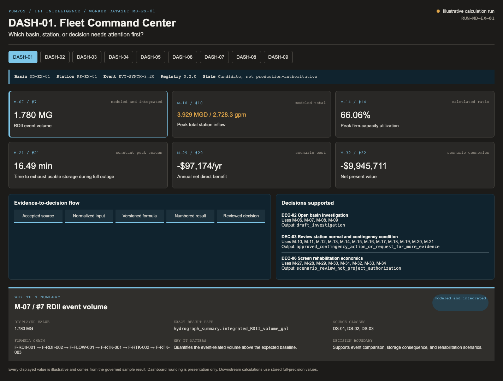

### Values displayed and their wiring

| Dashboard number | Worked value | Result path | Source class | Formula chain |
| --- | --- | --- | --- | --- |
| `M-07` / #7 RDII event volume | **1.780 MG** | `hydrograph_summary.integrated_RDII_volume_gal` | DS-01, DS-02, DS-03 | F-RDII-001 -> F-RDII-002 -> F-FLOW-001 -> F-RTK-001 -> F-RTK-002 -> F-RTK-003 |
| `M-10` / #10 Peak total station inflow | **3.929 MGD / 2,728.3 gpm** | `hydrograph_summary.peak_total_flow_gpm` | DS-01, DS-02, DS-03 | F-DWF-001 -> F-RTK-003 -> F-CONV-001 |
| `M-14` / #14 Peak firm-capacity utilization | **66.06%** | `pump_station_analysis.capacity.peak_utilization_fraction` | DS-01, DS-02, DS-03, DS-05, DS-06 | F-PUMP-002 |
| `M-21` / #21 Time to exhaust usable storage during full outage | **16.49 min** | `pump_station_analysis.storage.contingency_results.COMPLETE-OUTAGE-30-MIN.time_to_exhaust_available_storage_min` | DS-01, DS-07 | F-PUMP-003 |
| `M-29` / #29 Annual net direct benefit | **-$97,174/yr** | `rehabilitation_and_economics.annual_net_direct_benefit_USD` | DS-09 | F-COST-001 |
| `M-32` / #32 Net present value | **-$9,945,711** | `rehabilitation_and_economics.NPV_USD` | DS-09 | F-PV-001 -> F-ECON-003 |

### Decisions supported

- `DEC-02` Open basin investigation: consumes M-06, M-07, M-08, M-09; requires I_and_I_analyst, collection_system_engineer; produces `draft_investigation`.
- `DEC-03` Review station normal and contingency condition: consumes M-10, M-11, M-12, M-13, M-14, M-15, M-16, M-17, M-18, M-19, M-20, M-21; requires pump_station_engineer, operations_supervisor; produces `approved_contingency_action_or_request_for_more_evidence`.
- `DEC-06` Screen rehabilitation economics: consumes M-27, M-28, M-29, M-30, M-31, M-32, M-33, M-34; requires engineer, finance, capital_planning; produces `scenario_review_not_project_authorization`.

### What this screen does not establish

This mockup demonstrates information architecture and traceability using illustrative sample data. It does not approve the event, certify station capacity, establish regulatory compliance, authorize a project, or prove that the screen exists in the current PumpOS production build.

## DASH-02. Basin and I&I Workspace

**Decision question:** What did the event produce, and how was that conclusion calculated?

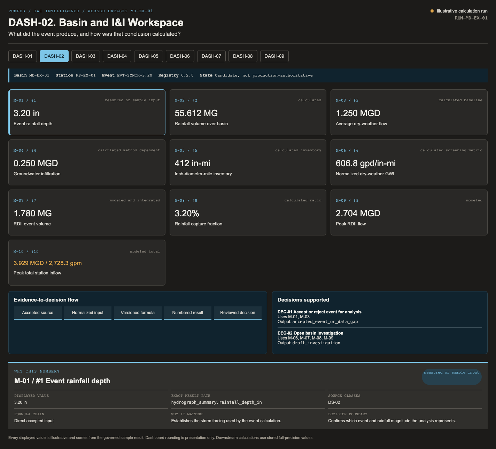

### Values displayed and their wiring

| Dashboard number | Worked value | Result path | Source class | Formula chain |
| --- | --- | --- | --- | --- |
| `M-01` / #1 Event rainfall depth | **3.20 in** | `hydrograph_summary.rainfall_depth_in` | DS-02 | Direct accepted input |
| `M-02` / #2 Rainfall volume over basin | **55.612 MG** | `hydrograph_summary.rainfall_volume_gal` | DS-02, DS-03 | F-UNIT-001 |
| `M-03` / #3 Average dry-weather flow | **1.250 MGD** | `hydrograph_summary.average_dry_weather_flow_MGD` | DS-01 | F-DWF-001 |
| `M-04` / #4 Groundwater infiltration | **0.250 MGD** | `inventory_and_dry_weather.GWI_gpd` | DS-01, DS-04 | F-GWI-001 -> F-CONV-001 |
| `M-05` / #5 Inch-diameter-mile inventory | **412 in-mi** | `inventory_and_dry_weather.inch_diameter_mile` | DS-03 | F-IDM-001 |
| `M-06` / #6 Normalized dry-weather GWI | **606.8 gpd/in-mi** | `inventory_and_dry_weather.GWI_gpd_per_inch_diameter_mile` | DS-01, DS-03, DS-04 | F-GWI-001 -> F-IDM-001 -> F-NORM-001 |
| `M-07` / #7 RDII event volume | **1.780 MG** | `hydrograph_summary.integrated_RDII_volume_gal` | DS-01, DS-02, DS-03 | F-RDII-001 -> F-RDII-002 -> F-FLOW-001 -> F-RTK-001 -> F-RTK-002 -> F-RTK-003 |
| `M-08` / #8 Rainfall capture fraction | **3.20%** | `hydrograph_summary.capture_fraction_total_R` | DS-01, DS-02, DS-03 | F-UNIT-001 -> F-RDII-002 -> F-RDII-003 |
| `M-09` / #9 Peak RDII flow | **2.704 MGD** | `hydrograph_summary.peak_RDII_MGD` | DS-01, DS-02, DS-03 | F-RTK-001 -> F-RTK-002 -> F-RTK-003 -> F-CONV-001 |
| `M-10` / #10 Peak total station inflow | **3.929 MGD / 2,728.3 gpm** | `hydrograph_summary.peak_total_flow_gpm` | DS-01, DS-02, DS-03 | F-DWF-001 -> F-RTK-003 -> F-CONV-001 |

### Decisions supported

- `DEC-01` Accept or reject event for analysis: consumes M-01, M-03; requires I_and_I_analyst; produces `accepted_event_or_data_gap`.
- `DEC-02` Open basin investigation: consumes M-06, M-07, M-08, M-09; requires I_and_I_analyst, collection_system_engineer; produces `draft_investigation`.

### What this screen does not establish

This mockup demonstrates information architecture and traceability using illustrative sample data. It does not approve the event, certify station capacity, establish regulatory compliance, authorize a project, or prove that the screen exists in the current PumpOS production build.

## DASH-03. Station Hydraulics and Resiliency

**Decision question:** Can the station convey the event under normal and contingency conditions?

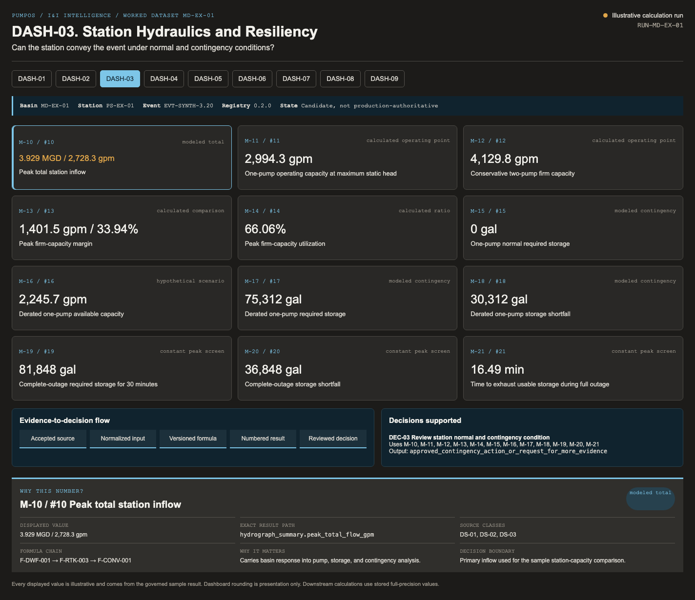

### Values displayed and their wiring

| Dashboard number | Worked value | Result path | Source class | Formula chain |
| --- | --- | --- | --- | --- |
| `M-10` / #10 Peak total station inflow | **3.929 MGD / 2,728.3 gpm** | `hydrograph_summary.peak_total_flow_gpm` | DS-01, DS-02, DS-03 | F-DWF-001 -> F-RTK-003 -> F-CONV-001 |
| `M-11` / #11 One-pump operating capacity at maximum static head | **2,994.3 gpm** | `pump_station_analysis.operating_points.1_pump_maximum_static_head.total_flow_gpm` | DS-05, DS-06 | F-HYD-001 -> F-HYD-002 -> F-HYD-003 -> F-HYD-004 -> F-HYD-005 -> F-PUMP-001 |
| `M-12` / #12 Conservative two-pump firm capacity | **4,129.8 gpm** | `pump_station_analysis.capacity.conservative_firm_capacity_gpm` | DS-05, DS-06 | F-HYD-001 -> F-HYD-002 -> F-HYD-003 -> F-HYD-004 -> F-HYD-005 -> F-PUMP-001 |
| `M-13` / #13 Peak firm-capacity margin | **1,401.5 gpm / 33.94%** | `pump_station_analysis.capacity.peak_margin_gpm` | DS-01, DS-02, DS-03, DS-05, DS-06 | F-PUMP-002 |
| `M-14` / #14 Peak firm-capacity utilization | **66.06%** | `pump_station_analysis.capacity.peak_utilization_fraction` | DS-01, DS-02, DS-03, DS-05, DS-06 | F-PUMP-002 |
| `M-15` / #15 One-pump normal required storage | **0 gal** | `pump_station_analysis.storage.contingency_results.ONE-PUMP-NORMAL.required_storage_gal` | DS-01, DS-05, DS-06, DS-07 | F-MASS-001 -> F-FLOW-001 -> F-PUMP-007 |
| `M-16` / #16 Derated one-pump available capacity | **2,245.7 gpm** | `pump_station_analysis.storage.contingency_results.ONE-PUMP-DERATED-75.available_capacity_gpm` | DS-05, DS-06 | F-PUMP-001 |
| `M-17` / #17 Derated one-pump required storage | **75,312 gal** | `pump_station_analysis.storage.contingency_results.ONE-PUMP-DERATED-75.required_storage_gal` | DS-01, DS-05, DS-06, DS-07 | F-MASS-001 -> F-FLOW-001 -> F-PUMP-007 |
| `M-18` / #18 Derated one-pump storage shortfall | **30,312 gal** | `pump_station_analysis.storage.contingency_results.ONE-PUMP-DERATED-75.storage_shortfall_gal` | DS-01, DS-05, DS-06, DS-07 | F-PUMP-007 |
| `M-19` / #19 Complete-outage required storage for 30 minutes | **81,848 gal** | `pump_station_analysis.storage.contingency_results.COMPLETE-OUTAGE-30-MIN.required_storage_gal` | DS-01, DS-07 | F-PUMP-004 |
| `M-20` / #20 Complete-outage storage shortfall | **36,848 gal** | `pump_station_analysis.storage.contingency_results.COMPLETE-OUTAGE-30-MIN.storage_shortfall_gal` | DS-01, DS-07 | F-PUMP-004 |
| `M-21` / #21 Time to exhaust usable storage during full outage | **16.49 min** | `pump_station_analysis.storage.contingency_results.COMPLETE-OUTAGE-30-MIN.time_to_exhaust_available_storage_min` | DS-01, DS-07 | F-PUMP-003 |

### Decisions supported

- `DEC-03` Review station normal and contingency condition: consumes M-10, M-11, M-12, M-13, M-14, M-15, M-16, M-17, M-18, M-19, M-20, M-21; requires pump_station_engineer, operations_supervisor; produces `approved_contingency_action_or_request_for_more_evidence`.

### What this screen does not establish

This mockup demonstrates information architecture and traceability using illustrative sample data. It does not approve the event, certify station capacity, establish regulatory compliance, authorize a project, or prove that the screen exists in the current PumpOS production build.

## DASH-04. Operations, Cycling, and Energy

**Decision question:** What operating burden did the flow create?

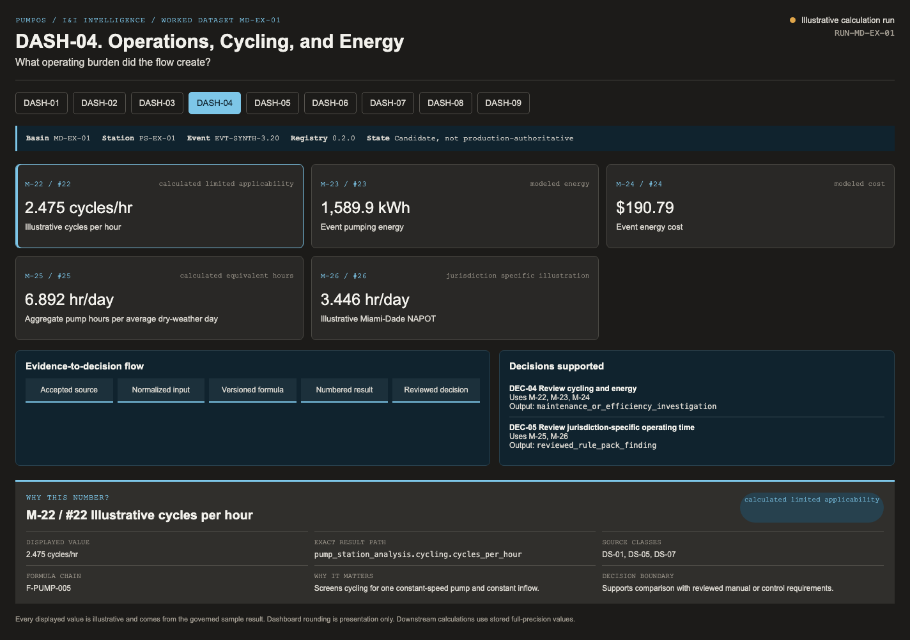

### Values displayed and their wiring

| Dashboard number | Worked value | Result path | Source class | Formula chain |
| --- | --- | --- | --- | --- |
| `M-22` / #22 Illustrative cycles per hour | **2.475 cycles/hr** | `pump_station_analysis.cycling.cycles_per_hour` | DS-01, DS-05, DS-07 | F-PUMP-005 |
| `M-23` / #23 Event pumping energy | **1,589.9 kWh** | `pump_station_analysis.energy.event_staged_control_energy_kWh` | DS-05, DS-06, DS-08 | F-ENERGY-001 -> F-ENERGY-002 |
| `M-24` / #24 Event energy cost | **$190.79** | `pump_station_analysis.energy.event_staged_control_energy_cost_USD` | DS-05, DS-06, DS-08 | F-ENERGY-001 -> F-ENERGY-002 |
| `M-25` / #25 Aggregate pump hours per average dry-weather day | **6.892 hr/day** | `pump_station_analysis.operating_time.aggregate_pump_hours_per_ADWF_day` | DS-01, DS-05 | F-PUMP-006 |
| `M-26` / #26 Illustrative Miami-Dade NAPOT | **3.446 hr/day** | `pump_station_analysis.operating_time.illustrative_Miami_Dade_NAPOT_hours_per_day` | DS-01, DS-05, DS-10 | F-PUMP-006 -> F-MDC-NAPOT-001 |

### Decisions supported

- `DEC-04` Review cycling and energy: consumes M-22, M-23, M-24; requires asset_manager, pump_station_engineer; produces `maintenance_or_efficiency_investigation`.
- `DEC-05` Review jurisdiction-specific operating time: consumes M-25, M-26; requires operations, compliance_reviewer; produces `reviewed_rule_pack_finding`.

### What this screen does not establish

This mockup demonstrates information architecture and traceability using illustrative sample data. It does not approve the event, certify station capacity, establish regulatory compliance, authorize a project, or prove that the screen exists in the current PumpOS production build.

## DASH-05. Program and Economics Workspace

**Decision question:** Does the stated rehabilitation scenario justify further development?

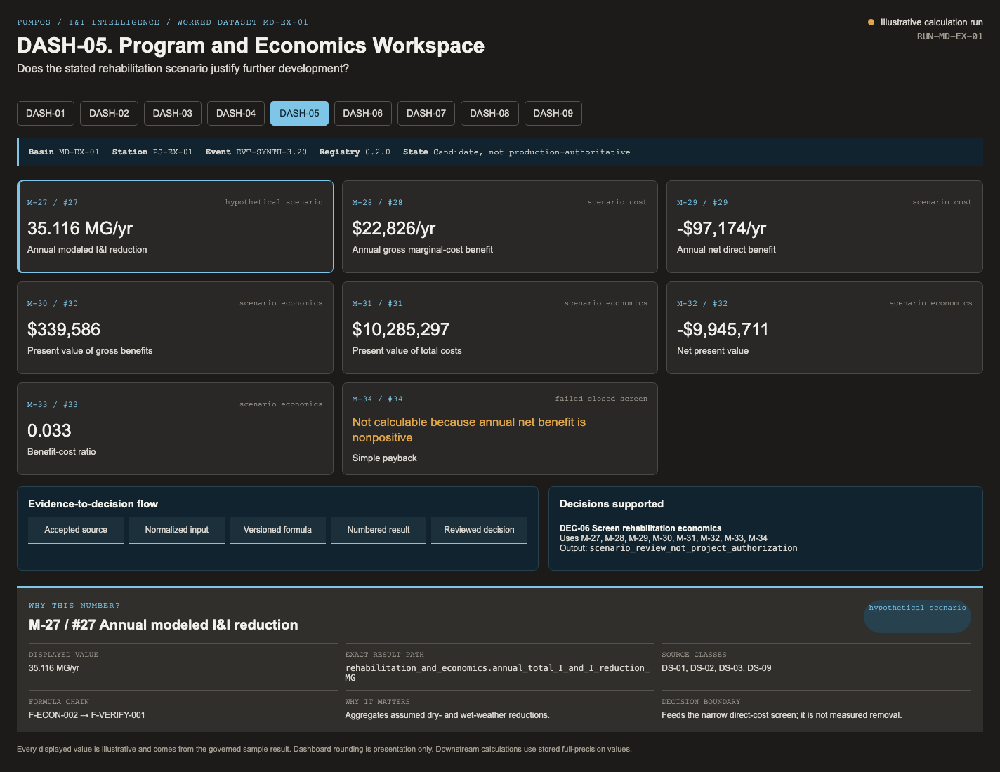

### Values displayed and their wiring

| Dashboard number | Worked value | Result path | Source class | Formula chain |
| --- | --- | --- | --- | --- |
| `M-27` / #27 Annual modeled I&I reduction | **35.116 MG/yr** | `rehabilitation_and_economics.annual_total_I_and_I_reduction_MG` | DS-01, DS-02, DS-03, DS-09 | F-ECON-002 -> F-VERIFY-001 |
| `M-28` / #28 Annual gross marginal-cost benefit | **$22,826/yr** | `rehabilitation_and_economics.annual_gross_marginal_cost_benefit_USD` | DS-09 | F-COST-001 |
| `M-29` / #29 Annual net direct benefit | **-$97,174/yr** | `rehabilitation_and_economics.annual_net_direct_benefit_USD` | DS-09 | F-COST-001 |
| `M-30` / #30 Present value of gross benefits | **$339,586** | `rehabilitation_and_economics.PV_gross_benefits_USD` | DS-09 | F-PV-001 |
| `M-31` / #31 Present value of total costs | **$10,285,297** | `rehabilitation_and_economics.PV_total_costs_USD` | DS-09 | F-PV-001 |
| `M-32` / #32 Net present value | **-$9,945,711** | `rehabilitation_and_economics.NPV_USD` | DS-09 | F-PV-001 -> F-ECON-003 |
| `M-33` / #33 Benefit-cost ratio | **0.033** | `rehabilitation_and_economics.benefit_cost_ratio` | DS-09 | F-BCR-001 |
| `M-34` / #34 Simple payback | **Not calculable because annual net benefit is nonpositive** | `rehabilitation_and_economics.simple_payback_years` | DS-09 | F-ECON-004 |

### Decisions supported

- `DEC-06` Screen rehabilitation economics: consumes M-27, M-28, M-29, M-30, M-31, M-32, M-33, M-34; requires engineer, finance, capital_planning; produces `scenario_review_not_project_authorization`.

### What this screen does not establish

This mockup demonstrates information architecture and traceability using illustrative sample data. It does not approve the event, certify station capacity, establish regulatory compliance, authorize a project, or prove that the screen exists in the current PumpOS production build.

## DASH-06. Asset and Manual Compliance

**Decision question:** Which approved requirement applies to the asset, and what evidence is due?

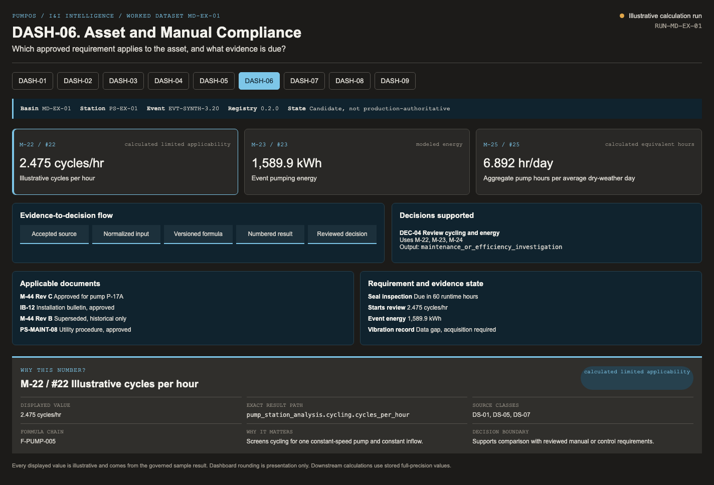

### Values displayed and their wiring

| Dashboard number | Worked value | Result path | Source class | Formula chain |
| --- | --- | --- | --- | --- |
| `M-22` / #22 Illustrative cycles per hour | **2.475 cycles/hr** | `pump_station_analysis.cycling.cycles_per_hour` | DS-01, DS-05, DS-07 | F-PUMP-005 |
| `M-23` / #23 Event pumping energy | **1,589.9 kWh** | `pump_station_analysis.energy.event_staged_control_energy_kWh` | DS-05, DS-06, DS-08 | F-ENERGY-001 -> F-ENERGY-002 |
| `M-25` / #25 Aggregate pump hours per average dry-weather day | **6.892 hr/day** | `pump_station_analysis.operating_time.aggregate_pump_hours_per_ADWF_day` | DS-01, DS-05 | F-PUMP-006 |

### Decisions supported

- `DEC-04` Review cycling and energy: consumes M-22, M-23, M-24; requires asset_manager, pump_station_engineer; produces `maintenance_or_efficiency_investigation`.

### What this screen does not establish

This mockup demonstrates information architecture and traceability using illustrative sample data. It does not approve the event, certify station capacity, establish regulatory compliance, authorize a project, or prove that the screen exists in the current PumpOS production build.

## DASH-07. Data Gap Center

**Decision question:** What missing contract prevents a result from becoming production-authoritative?

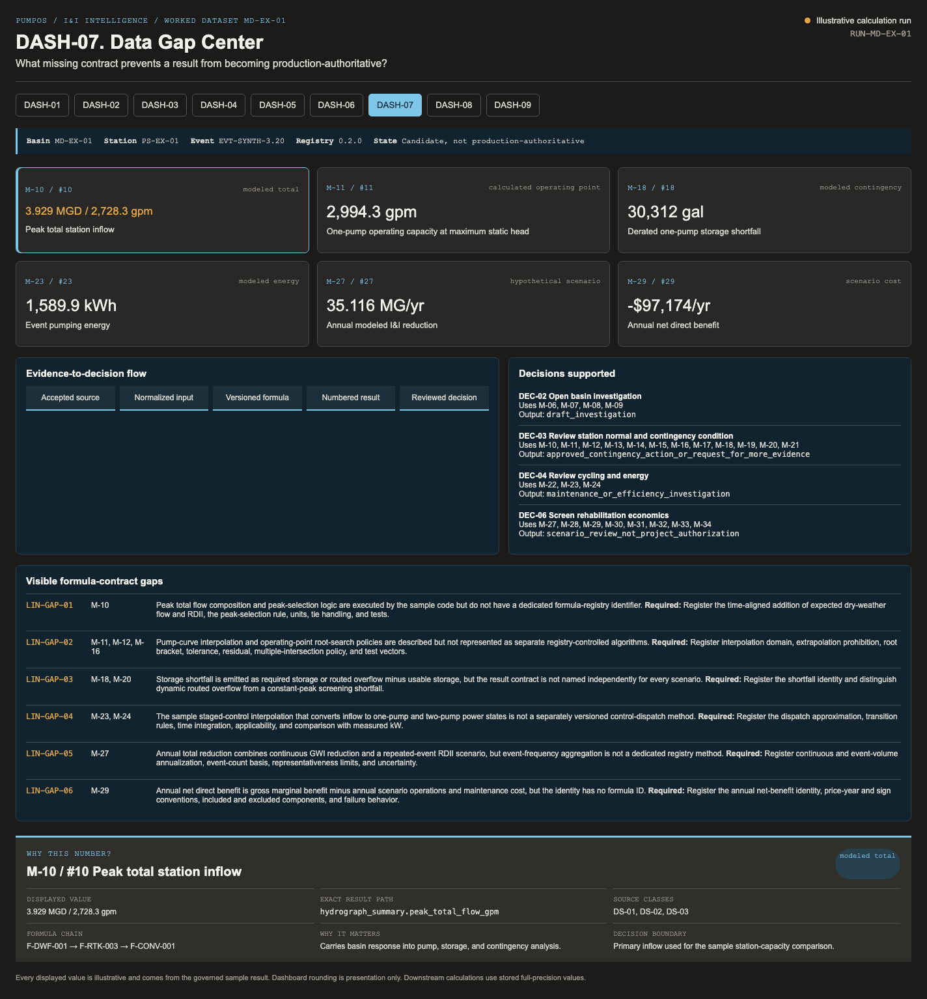

### Values displayed and their wiring

| Dashboard number | Worked value | Result path | Source class | Formula chain |
| --- | --- | --- | --- | --- |
| `M-10` / #10 Peak total station inflow | **3.929 MGD / 2,728.3 gpm** | `hydrograph_summary.peak_total_flow_gpm` | DS-01, DS-02, DS-03 | F-DWF-001 -> F-RTK-003 -> F-CONV-001 |
| `M-11` / #11 One-pump operating capacity at maximum static head | **2,994.3 gpm** | `pump_station_analysis.operating_points.1_pump_maximum_static_head.total_flow_gpm` | DS-05, DS-06 | F-HYD-001 -> F-HYD-002 -> F-HYD-003 -> F-HYD-004 -> F-HYD-005 -> F-PUMP-001 |
| `M-18` / #18 Derated one-pump storage shortfall | **30,312 gal** | `pump_station_analysis.storage.contingency_results.ONE-PUMP-DERATED-75.storage_shortfall_gal` | DS-01, DS-05, DS-06, DS-07 | F-PUMP-007 |
| `M-23` / #23 Event pumping energy | **1,589.9 kWh** | `pump_station_analysis.energy.event_staged_control_energy_kWh` | DS-05, DS-06, DS-08 | F-ENERGY-001 -> F-ENERGY-002 |
| `M-27` / #27 Annual modeled I&I reduction | **35.116 MG/yr** | `rehabilitation_and_economics.annual_total_I_and_I_reduction_MG` | DS-01, DS-02, DS-03, DS-09 | F-ECON-002 -> F-VERIFY-001 |
| `M-29` / #29 Annual net direct benefit | **-$97,174/yr** | `rehabilitation_and_economics.annual_net_direct_benefit_USD` | DS-09 | F-COST-001 |

### Decisions supported

- `DEC-02` Open basin investigation: consumes M-06, M-07, M-08, M-09; requires I_and_I_analyst, collection_system_engineer; produces `draft_investigation`.
- `DEC-03` Review station normal and contingency condition: consumes M-10, M-11, M-12, M-13, M-14, M-15, M-16, M-17, M-18, M-19, M-20, M-21; requires pump_station_engineer, operations_supervisor; produces `approved_contingency_action_or_request_for_more_evidence`.
- `DEC-04` Review cycling and energy: consumes M-22, M-23, M-24; requires asset_manager, pump_station_engineer; produces `maintenance_or_efficiency_investigation`.
- `DEC-06` Screen rehabilitation economics: consumes M-27, M-28, M-29, M-30, M-31, M-32, M-33, M-34; requires engineer, finance, capital_planning; produces `scenario_review_not_project_authorization`.

### What this screen does not establish

This mockup demonstrates information architecture and traceability using illustrative sample data. It does not approve the event, certify station capacity, establish regulatory compliance, authorize a project, or prove that the screen exists in the current PumpOS production build.

## DASH-08. Action and Approval Center

**Decision question:** What decision is proposed, who must approve it, and what evidence supports it?

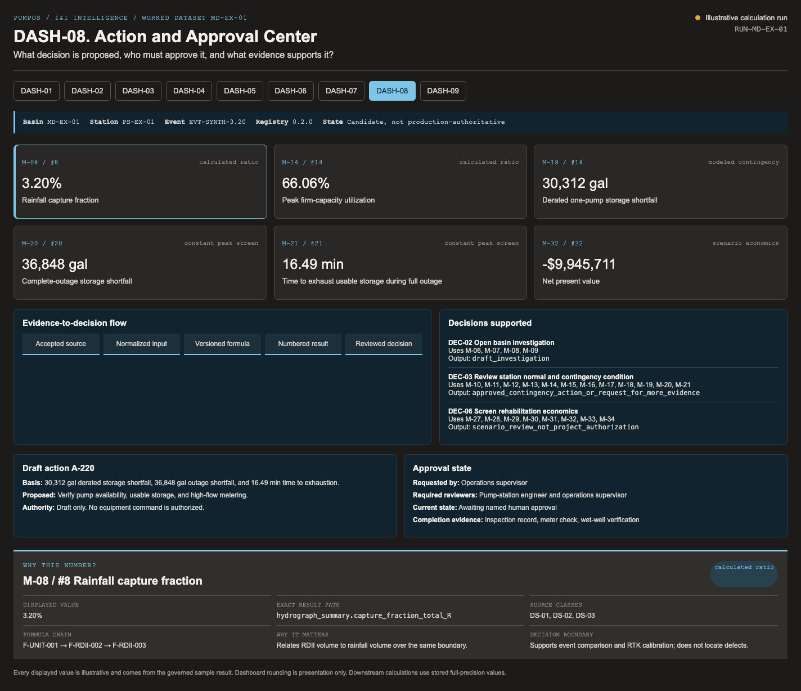

### Values displayed and their wiring

| Dashboard number | Worked value | Result path | Source class | Formula chain |
| --- | --- | --- | --- | --- |
| `M-08` / #8 Rainfall capture fraction | **3.20%** | `hydrograph_summary.capture_fraction_total_R` | DS-01, DS-02, DS-03 | F-UNIT-001 -> F-RDII-002 -> F-RDII-003 |
| `M-14` / #14 Peak firm-capacity utilization | **66.06%** | `pump_station_analysis.capacity.peak_utilization_fraction` | DS-01, DS-02, DS-03, DS-05, DS-06 | F-PUMP-002 |
| `M-18` / #18 Derated one-pump storage shortfall | **30,312 gal** | `pump_station_analysis.storage.contingency_results.ONE-PUMP-DERATED-75.storage_shortfall_gal` | DS-01, DS-05, DS-06, DS-07 | F-PUMP-007 |
| `M-20` / #20 Complete-outage storage shortfall | **36,848 gal** | `pump_station_analysis.storage.contingency_results.COMPLETE-OUTAGE-30-MIN.storage_shortfall_gal` | DS-01, DS-07 | F-PUMP-004 |
| `M-21` / #21 Time to exhaust usable storage during full outage | **16.49 min** | `pump_station_analysis.storage.contingency_results.COMPLETE-OUTAGE-30-MIN.time_to_exhaust_available_storage_min` | DS-01, DS-07 | F-PUMP-003 |
| `M-32` / #32 Net present value | **-$9,945,711** | `rehabilitation_and_economics.NPV_USD` | DS-09 | F-PV-001 -> F-ECON-003 |

### Decisions supported

- `DEC-02` Open basin investigation: consumes M-06, M-07, M-08, M-09; requires I_and_I_analyst, collection_system_engineer; produces `draft_investigation`.
- `DEC-03` Review station normal and contingency condition: consumes M-10, M-11, M-12, M-13, M-14, M-15, M-16, M-17, M-18, M-19, M-20, M-21; requires pump_station_engineer, operations_supervisor; produces `approved_contingency_action_or_request_for_more_evidence`.
- `DEC-06` Screen rehabilitation economics: consumes M-27, M-28, M-29, M-30, M-31, M-32, M-33, M-34; requires engineer, finance, capital_planning; produces `scenario_review_not_project_authorization`.

### What this screen does not establish

This mockup demonstrates information architecture and traceability using illustrative sample data. It does not approve the event, certify station capacity, establish regulatory compliance, authorize a project, or prove that the screen exists in the current PumpOS production build.

## DASH-09. Calculation Lineage Explorer

**Decision question:** Can every displayed number be traced to its accepted source and calculation?

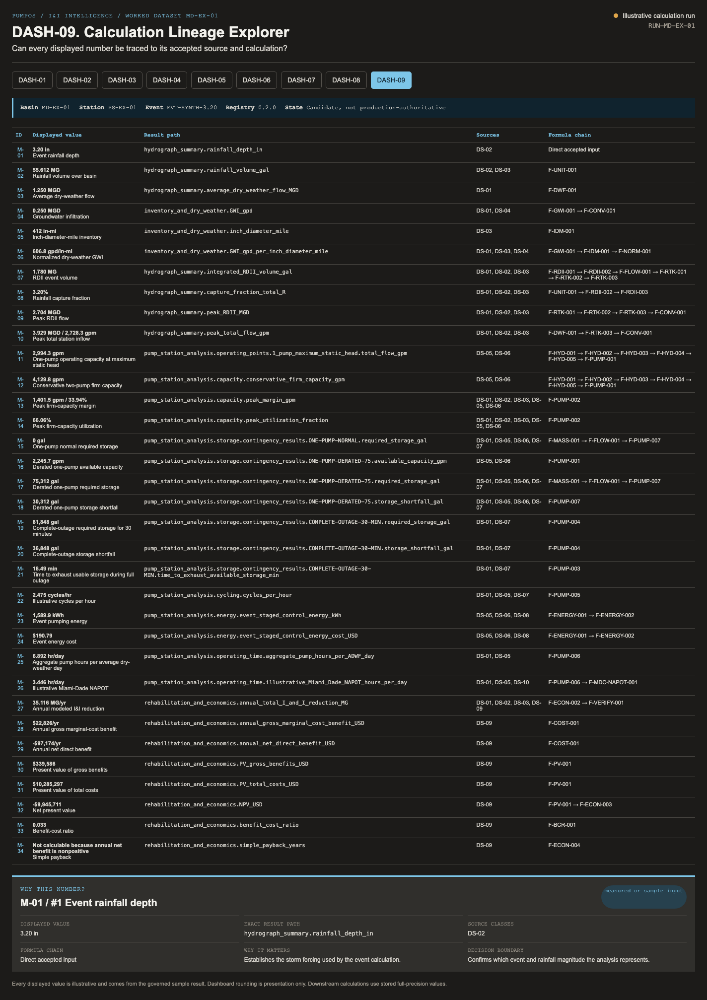

### Values displayed and their wiring

| Dashboard number | Worked value | Result path | Source class | Formula chain |
| --- | --- | --- | --- | --- |
| `M-01` / #1 Event rainfall depth | **3.20 in** | `hydrograph_summary.rainfall_depth_in` | DS-02 | Direct accepted input |
| `M-02` / #2 Rainfall volume over basin | **55.612 MG** | `hydrograph_summary.rainfall_volume_gal` | DS-02, DS-03 | F-UNIT-001 |
| `M-03` / #3 Average dry-weather flow | **1.250 MGD** | `hydrograph_summary.average_dry_weather_flow_MGD` | DS-01 | F-DWF-001 |
| `M-04` / #4 Groundwater infiltration | **0.250 MGD** | `inventory_and_dry_weather.GWI_gpd` | DS-01, DS-04 | F-GWI-001 -> F-CONV-001 |
| `M-05` / #5 Inch-diameter-mile inventory | **412 in-mi** | `inventory_and_dry_weather.inch_diameter_mile` | DS-03 | F-IDM-001 |
| `M-06` / #6 Normalized dry-weather GWI | **606.8 gpd/in-mi** | `inventory_and_dry_weather.GWI_gpd_per_inch_diameter_mile` | DS-01, DS-03, DS-04 | F-GWI-001 -> F-IDM-001 -> F-NORM-001 |
| `M-07` / #7 RDII event volume | **1.780 MG** | `hydrograph_summary.integrated_RDII_volume_gal` | DS-01, DS-02, DS-03 | F-RDII-001 -> F-RDII-002 -> F-FLOW-001 -> F-RTK-001 -> F-RTK-002 -> F-RTK-003 |
| `M-08` / #8 Rainfall capture fraction | **3.20%** | `hydrograph_summary.capture_fraction_total_R` | DS-01, DS-02, DS-03 | F-UNIT-001 -> F-RDII-002 -> F-RDII-003 |
| `M-09` / #9 Peak RDII flow | **2.704 MGD** | `hydrograph_summary.peak_RDII_MGD` | DS-01, DS-02, DS-03 | F-RTK-001 -> F-RTK-002 -> F-RTK-003 -> F-CONV-001 |
| `M-10` / #10 Peak total station inflow | **3.929 MGD / 2,728.3 gpm** | `hydrograph_summary.peak_total_flow_gpm` | DS-01, DS-02, DS-03 | F-DWF-001 -> F-RTK-003 -> F-CONV-001 |
| `M-11` / #11 One-pump operating capacity at maximum static head | **2,994.3 gpm** | `pump_station_analysis.operating_points.1_pump_maximum_static_head.total_flow_gpm` | DS-05, DS-06 | F-HYD-001 -> F-HYD-002 -> F-HYD-003 -> F-HYD-004 -> F-HYD-005 -> F-PUMP-001 |
| `M-12` / #12 Conservative two-pump firm capacity | **4,129.8 gpm** | `pump_station_analysis.capacity.conservative_firm_capacity_gpm` | DS-05, DS-06 | F-HYD-001 -> F-HYD-002 -> F-HYD-003 -> F-HYD-004 -> F-HYD-005 -> F-PUMP-001 |
| `M-13` / #13 Peak firm-capacity margin | **1,401.5 gpm / 33.94%** | `pump_station_analysis.capacity.peak_margin_gpm` | DS-01, DS-02, DS-03, DS-05, DS-06 | F-PUMP-002 |
| `M-14` / #14 Peak firm-capacity utilization | **66.06%** | `pump_station_analysis.capacity.peak_utilization_fraction` | DS-01, DS-02, DS-03, DS-05, DS-06 | F-PUMP-002 |
| `M-15` / #15 One-pump normal required storage | **0 gal** | `pump_station_analysis.storage.contingency_results.ONE-PUMP-NORMAL.required_storage_gal` | DS-01, DS-05, DS-06, DS-07 | F-MASS-001 -> F-FLOW-001 -> F-PUMP-007 |
| `M-16` / #16 Derated one-pump available capacity | **2,245.7 gpm** | `pump_station_analysis.storage.contingency_results.ONE-PUMP-DERATED-75.available_capacity_gpm` | DS-05, DS-06 | F-PUMP-001 |
| `M-17` / #17 Derated one-pump required storage | **75,312 gal** | `pump_station_analysis.storage.contingency_results.ONE-PUMP-DERATED-75.required_storage_gal` | DS-01, DS-05, DS-06, DS-07 | F-MASS-001 -> F-FLOW-001 -> F-PUMP-007 |
| `M-18` / #18 Derated one-pump storage shortfall | **30,312 gal** | `pump_station_analysis.storage.contingency_results.ONE-PUMP-DERATED-75.storage_shortfall_gal` | DS-01, DS-05, DS-06, DS-07 | F-PUMP-007 |
| `M-19` / #19 Complete-outage required storage for 30 minutes | **81,848 gal** | `pump_station_analysis.storage.contingency_results.COMPLETE-OUTAGE-30-MIN.required_storage_gal` | DS-01, DS-07 | F-PUMP-004 |
| `M-20` / #20 Complete-outage storage shortfall | **36,848 gal** | `pump_station_analysis.storage.contingency_results.COMPLETE-OUTAGE-30-MIN.storage_shortfall_gal` | DS-01, DS-07 | F-PUMP-004 |
| `M-21` / #21 Time to exhaust usable storage during full outage | **16.49 min** | `pump_station_analysis.storage.contingency_results.COMPLETE-OUTAGE-30-MIN.time_to_exhaust_available_storage_min` | DS-01, DS-07 | F-PUMP-003 |
| `M-22` / #22 Illustrative cycles per hour | **2.475 cycles/hr** | `pump_station_analysis.cycling.cycles_per_hour` | DS-01, DS-05, DS-07 | F-PUMP-005 |
| `M-23` / #23 Event pumping energy | **1,589.9 kWh** | `pump_station_analysis.energy.event_staged_control_energy_kWh` | DS-05, DS-06, DS-08 | F-ENERGY-001 -> F-ENERGY-002 |
| `M-24` / #24 Event energy cost | **$190.79** | `pump_station_analysis.energy.event_staged_control_energy_cost_USD` | DS-05, DS-06, DS-08 | F-ENERGY-001 -> F-ENERGY-002 |
| `M-25` / #25 Aggregate pump hours per average dry-weather day | **6.892 hr/day** | `pump_station_analysis.operating_time.aggregate_pump_hours_per_ADWF_day` | DS-01, DS-05 | F-PUMP-006 |
| `M-26` / #26 Illustrative Miami-Dade NAPOT | **3.446 hr/day** | `pump_station_analysis.operating_time.illustrative_Miami_Dade_NAPOT_hours_per_day` | DS-01, DS-05, DS-10 | F-PUMP-006 -> F-MDC-NAPOT-001 |
| `M-27` / #27 Annual modeled I&I reduction | **35.116 MG/yr** | `rehabilitation_and_economics.annual_total_I_and_I_reduction_MG` | DS-01, DS-02, DS-03, DS-09 | F-ECON-002 -> F-VERIFY-001 |
| `M-28` / #28 Annual gross marginal-cost benefit | **$22,826/yr** | `rehabilitation_and_economics.annual_gross_marginal_cost_benefit_USD` | DS-09 | F-COST-001 |
| `M-29` / #29 Annual net direct benefit | **-$97,174/yr** | `rehabilitation_and_economics.annual_net_direct_benefit_USD` | DS-09 | F-COST-001 |
| `M-30` / #30 Present value of gross benefits | **$339,586** | `rehabilitation_and_economics.PV_gross_benefits_USD` | DS-09 | F-PV-001 |
| `M-31` / #31 Present value of total costs | **$10,285,297** | `rehabilitation_and_economics.PV_total_costs_USD` | DS-09 | F-PV-001 |
| `M-32` / #32 Net present value | **-$9,945,711** | `rehabilitation_and_economics.NPV_USD` | DS-09 | F-PV-001 -> F-ECON-003 |
| `M-33` / #33 Benefit-cost ratio | **0.033** | `rehabilitation_and_economics.benefit_cost_ratio` | DS-09 | F-BCR-001 |
| `M-34` / #34 Simple payback | **Not calculable because annual net benefit is nonpositive** | `rehabilitation_and_economics.simple_payback_years` | DS-09 | F-ECON-004 |

### Decisions supported

- `DEC-01` Accept or reject event for analysis: consumes M-01, M-03; requires I_and_I_analyst; produces `accepted_event_or_data_gap`.
- `DEC-02` Open basin investigation: consumes M-06, M-07, M-08, M-09; requires I_and_I_analyst, collection_system_engineer; produces `draft_investigation`.
- `DEC-03` Review station normal and contingency condition: consumes M-10, M-11, M-12, M-13, M-14, M-15, M-16, M-17, M-18, M-19, M-20, M-21; requires pump_station_engineer, operations_supervisor; produces `approved_contingency_action_or_request_for_more_evidence`.
- `DEC-04` Review cycling and energy: consumes M-22, M-23, M-24; requires asset_manager, pump_station_engineer; produces `maintenance_or_efficiency_investigation`.
- `DEC-05` Review jurisdiction-specific operating time: consumes M-25, M-26; requires operations, compliance_reviewer; produces `reviewed_rule_pack_finding`.
- `DEC-06` Screen rehabilitation economics: consumes M-27, M-28, M-29, M-30, M-31, M-32, M-33, M-34; requires engineer, finance, capital_planning; produces `scenario_review_not_project_authorization`.

### What this screen does not establish

This mockup demonstrates information architecture and traceability using illustrative sample data. It does not approve the event, certify station capacity, establish regulatory compliance, authorize a project, or prove that the screen exists in the current PumpOS production build.

## Dashboard coverage statement

The nine mockups collectively display all 34 numbered metrics. The lineage explorer displays the entire set in one auditable table. The other eight screens organize the same values around the operational questions that a fleet manager, I&I analyst, station engineer, asset manager, compliance reviewer, finance reviewer, and approving authority must answer.


---

# Integrated document status

This is a governed candidate assembled from two candidate volumes and machine-readable registries. It does not change the production status of any formula, approve a jurisdiction rule, certify a facility, authorize autonomous action, or complete the unresolved independent and qualified reviews.

## Current integrated white-paper score

| Dimension | Available | Awarded | Evidence for points awarded | Deduction and next work |
| --- | ---: | ---: | --- | --- |
| Teaching thesis and importance | 15 | 15 | The engineering-to-operation thesis and reader consequences are explicit. | None for the candidate argument. |
| Complete plain-language explanation | 20 | 20 | Both full source volumes, all method chains, 39 formula explanations, 11 source classes, 34 dashboard traces, and nine populated dashboard mockups are present. | Independent novice-reader review remains required as a hard gate. |
| Utility-wide and cross-sector value | 15 | 14 | Operations, engineering, asset, compliance, executive, security, and capital decisions are connected. | PipeOS and treatment-system product-owner review remains open. |
| Research depth and source quality | 15 | 11 | The integrated paper preserves federal and technical sources from the engineering volume and internal architecture sources from the operational volume. | Active PumpOS branch, live deployment, and several formula-source gaps remain unresolved. |
| Technical accuracy and claim verification | 20 | 13 | Formula registry, test vectors, result paths, fail-closed boundaries, and six explicit lineage gaps are visible. | Candidate formulas, independent implementation, field calibration, and qualified engineering review remain blocked. |
| Diagrams and visual teaching value | 10 | 10 | Mega architecture, sub-diagrams, method chains, nine populated dashboard mockups, and numbered traceability views are included. | Independent accessibility and usability review remains unresolved. |
| Editorial quality, boundaries, and originality | 5 | 4 | Evidence classes, scope, prohibited conclusions, versioning, and release boundary are explicit. | Independent editorial and originality review remain unresolved. |
| **Total** | **100** | **87** | Complete integrated candidate with machine-tested internal wiring. | Strong but not eligible for release or production approval. |

- Previous integrated score: None
- Score change: Initial integrated score
- Decision band: 80 to 89, strong but revision and review required
- Advancement decision: Candidate for owner and multidisciplinary technical review

### Hard gates

- Owner approval of the integrated thesis: blocked.
- Complete formula contracts for six exposed lineage gaps: blocked.
- Independent source and numerical verification: blocked.
- Qualified I&I, pump-station, operations, regulatory, security, and software reviews: blocked.
- Field calibration and holdout validation: blocked.
- Rendered dashboard, accessibility, mobile, and novice review: blocked.
- Production and public release: blocked.
