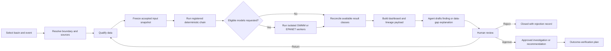
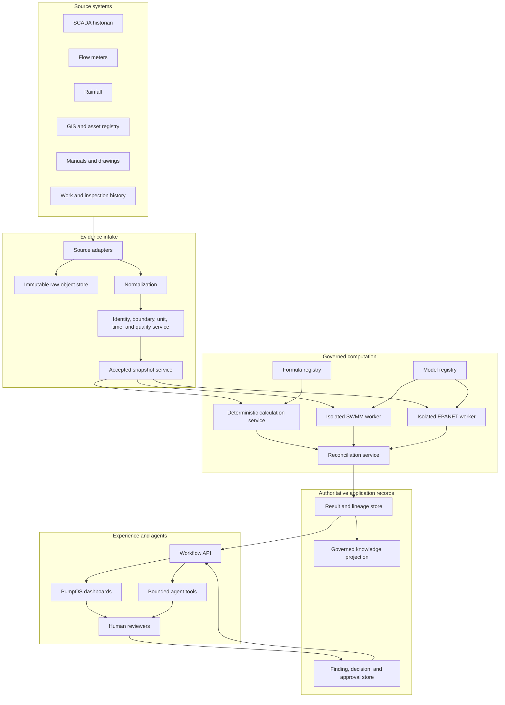
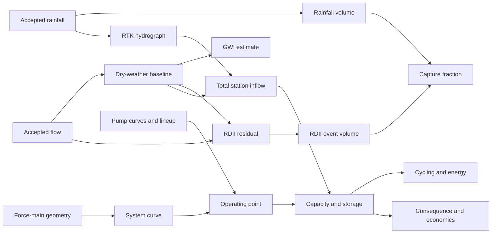
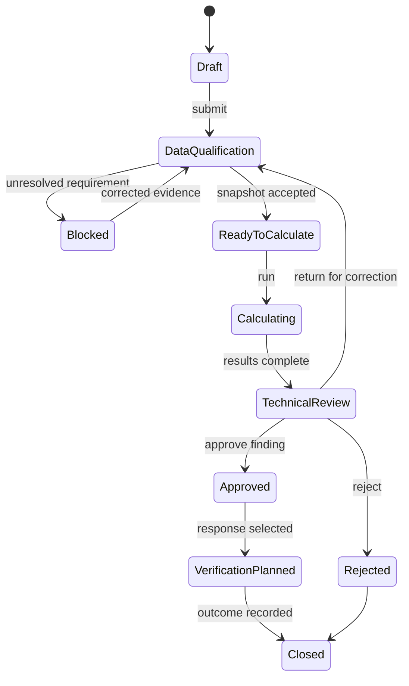

# PumpOS and I&I Intelligence Version 4

## Compiled Implementation Edition and Agent Execution Bundle

**Status:** Internal implementation candidate
**Parent:** PumpOS and I&I Intelligence System Bible, Version 3
**Production authority:** Not granted

This compiled volume is a review convenience. The separately reviewable source files in the Version 4 folder remain the implementation authority.

---

# Copy-Paste Agent Handoff

## How to use this file

Copy everything under **Agent launch prompt** into Claude, Kimi, Codex, or another development agent.
Give that agent access to this entire `implementation-bundle-v4` folder and the parent Version 3
Architecture Bible.

Do not copy only one API schema or one work package. The authority and fail-closed boundaries in this
handoff are part of the implementation.

---

# Agent launch prompt

You are implementing a bounded portion of the PumpOS and I&I Intelligence application for APAS.
This is a software implementation task, not a request to rewrite the architecture.

Your working directory is the Version 4 Implementation Bundle. Treat the following files as the
binding implementation package:

1. `AGENTS.md`
2. `implementation-edition.md`
3. `work-packages.yaml`
4. `acceptance-matrix.yaml`
5. `openapi.yaml`
6. `agent-tools.yaml`
7. `formula-contract-template.yaml`
8. `schemas/*.schema.json`
9. `examples/*`
10. `golden-cases/*`

The parent `ii-intelligence-system-bible-v3.md` is the explanatory technical source. Use it to
understand meaning and boundaries. Do not reinterpret it in a way that conflicts with a Version 4
machine-readable contract.

## Product objective

Build the first operational slice:

> One sanitary-sewer basin, one rainfall event, one receiving pump station, one frozen accepted
> input snapshot, one deterministic calculation chain, optional SWMM and EPANET comparisons, one
> reconciled result set, one traceable dashboard payload, and one human-reviewable recommendation.

## Required architecture

```text
source adapters
  -> immutable raw records
  -> identity, boundary, time, unit, and quality resolution
  -> accepted input snapshot
  -> deterministic calculation service
  -> optional SWMM and EPANET model workers
  -> reconciliation service
  -> result and lineage store
  -> workflow API and dashboards
  -> bounded agent tools
  -> human review and approval
  -> outcome verification
```

## Non-negotiable authority boundary

- The deterministic calculation engine computes registered formulas.
- SWMM and EPANET execute declared models.
- The reconciliation service compares observed, calculated, and modeled results.
- The agent retrieves, explains, compares, and drafts.
- Humans approve consequential findings, investigations, work, compliance positions, and control
  changes.

Do not implement any feature that allows an agent to create an engineering formula, approve its own
result, silently alter a model, write to SCADA, operate pumps, issue a compliance determination, or
dispatch work.

## Evidence classes

Every result must retain exactly one evidence class:

```text
observed | calculated | modeled | reconciled | interpreted
```

Never show a modeled value as observed. Never show an agent narrative as a calculated result.

## Fail closed

Return a structured data gap instead of a numeric result when identity, boundary, units, time,
formula version, pump configuration, model version, source lineage, or required approval cannot be
resolved. Never use silent engineering defaults.

## How to begin

1. Read every binding file listed above.
2. Validate the bundle with `python3 tools/validate_bundle.py`.
3. Inspect `work-packages.yaml`.
4. Select only a work package whose dependencies are complete.
5. State the selected package identifier, inputs, outputs, tests, risks, and stop boundary.
6. Implement the smallest complete vertical behavior named by that package.
7. Run its acceptance tests and the bundle validator.
8. Report files changed, tests run, unresolved reviews, and the next ready work package.

## First recommended assignment

Start with `WP-01`, Contract and Repository Foundation. Then complete `WP-02`, Canonical Domain and
Boundary Model. Do not begin calculation implementation until their acceptance criteria pass.

## Required response format after each work package

```text
Work package:
Status:
Implemented:
Tests executed:
Evidence produced:
Assumptions:
Unresolved engineering or owner decisions:
Human review required:
Next ready work package:
```

## Stop conditions

Stop and request owner direction if:

- two binding contracts conflict;
- implementation requires a new formula;
- implementation requires a jurisdiction-specific rule not present in an approved rule pack;
- the target PumpOS repository or branch cannot be positively identified;
- an action would write to an operational control system;
- a requested scope expands into the drinking-water side or another APAS product;
- a model result is being requested without an approved model and assurance state;
- a consequential external action requires authority not granted in this package.

This implementation bundle is an internal candidate. Do not describe it as production-ready,
certified, compliant, or 100 percent accurate.

---

# Suggested first message to the agent

```text
Read the entire Version 4 Implementation Bundle and its AGENTS.md. Validate the bundle. Then work
only on WP-01. Do not begin WP-02 or change any engineering formula. Return the required work-package
status format and stop at the WP-01 approval boundary.
```


---

# PumpOS and I&I Intelligence

## Version 4 Implementation Edition

**Artifact class:** Separately actionable software implementation specification

**Parent:** PumpOS and I&I Intelligence System Bible, Version 3

**Owner:** APAS / Hardeep Anand

**Version:** 4.0 candidate

**Date:** July 29, 2026

**Status:** Internal implementation candidate
**Production authority:** Not granted

---

# 1. Executive implementation decision

Version 3 explains the complete system. Version 4 establishes the smallest complete product that a
development team can build without converting the whole Bible into one unbounded project.

The first operational slice is:

> Analyze one accepted rainfall event for one sanitary-sewer basin, calculate the I&I response,
> determine the consequence at one receiving pump station, preserve complete input and calculation
> lineage, optionally compare SWMM and EPANET results, display the results, and prepare a
> human-reviewable recommendation.

This slice is large enough to demonstrate real utility value and small enough to validate before
fleet-wide deployment.

The application must be able to answer:

1. What happened during the event?
2. What was directly observed?
3. Which records were accepted or rejected?
4. What did the registered formulas calculate?
5. What did SWMM or EPANET model, if an eligible model was run?
6. Where do observations, calculations, and models agree or disagree?
7. What consequence did the event create at the station?
8. What information is missing?
9. What investigation or response is supported?
10. Who must review and approve the next step?

# 2. Product boundary

## 2.1 Included in the first slice

The implementation includes:

- basin, event, station, asset, sensor, and topology identity;
- rainfall, sewer-flow, SCADA, GIS, pump, wet-well, and force-main source adapters;
- immutable source preservation;
- time, unit, identity, boundary, and quality resolution;
- accepted input snapshots;
- deterministic calculation orchestration;
- dry-weather-flow, groundwater-infiltration, RDII, rainfall-volume, capture, RTK, system-curve,
  pump-operating-point, capacity, storage, cycling, energy, and selected economic outputs;
- model-run registration and optional SWMM and EPANET execution adapters;
- observed, calculated, modeled, reconciled, and interpreted result separation;
- data-gap results;
- complete calculation and model lineage;
- basin, station, assurance, lineage, and approval workflow payloads;
- bounded agent tools;
- human review, approval, rejection, and return-for-revision states;
- outcome-verification preparation.

## 2.2 Excluded from the first slice

The implementation does not include:

- autonomous pump or valve control;
- direct writes to SCADA, programmable logic controllers, or remote terminal units;
- automatic work-order dispatch;
- drinking-water PipeOS modeling;
- a nationwide regulatory-compliance determination;
- automatic formula creation;
- automatic model calibration approval;
- replacement of GIS, SCADA, computerized maintenance-management, document-management, or laboratory
  systems of record;
- public release;
- production certification.

## 2.3 Why the boundary matters

The boundary protects the first release from becoming an integration program with no testable
finish line. It also prevents an artificial-intelligence agent from being mistaken for an
engineering calculation engine or control system.

# 3. Users, jobs, and authority

| Role | Primary job | May approve |
| --- | --- | --- |
| Collection-system engineer | Validate basin methods, results, and limitations | Engineering finding and method use |
| Pump-station engineer | Validate system curve, operating point, storage, and resilience | Station consequence finding |
| Hydraulic modeler | Construct, calibrate, validate, and review models | Declared model assurance state |
| Operator | Explain operating conditions and confirm asset states | Operational context, not engineering formula |
| Data steward | Resolve identity, source, time, and quality issues | Accepted input qualification |
| Program manager | Compare risks, priorities, and interventions | Investigation or program recommendation |
| Executive | Understand consequence, confidence, and portfolio value | Funding or governance decisions under existing authority |
| Software administrator | Manage users, integrations, versions, and environments | Software configuration under policy |
| Droobi or other bounded agent | Retrieve, explain, compare, and draft | Nothing consequential |

The same person may hold more than one role, but the audit record must retain which authority was
used for each approval.

# 4. First-slice user journey



## 4.1 Start condition

The journey begins only when the user selects or supplies:

- utility or tenant;
- basin identifier;
- event identifier or event window;
- receiving station identifier;
- requested analysis purpose;
- requested calculation profile;
- optional requested model runs.

## 4.2 Successful end condition

The first slice succeeds when it produces:

- a frozen accepted input snapshot;
- deterministic result envelopes;
- optional model result envelopes;
- reconciliation results;
- a lineage-complete dashboard payload;
- either a reviewed finding or an explicit data-gap outcome;
- a human approval record;
- a defined next action or closure reason.

# 5. System architecture



## 5.1 Architectural rule

Postgres or an approved equivalent is the structured system of record for application state.
Object storage retains raw files, model files, reports, and immutable evidence. A graph database is
a governed relationship projection. It does not replace the numerical calculation engine or the
structured transaction record.

# 6. Service responsibilities

## 6.1 Source Adapter Service

Purpose:

- connect to approved sources;
- retrieve records without changing the source;
- preserve source locator and retrieval time;
- store raw payload hashes;
- emit normalized candidate observations.

It must not:

- decide that data is acceptable for a calculation;
- invent missing timestamps or units;
- overwrite source-system records.

## 6.2 Identity and Boundary Service

Purpose:

- resolve utility, basin, station, meter, gauge, pump, pipe, and sensor identity;
- resolve effective topology for the analysis time;
- determine whether numerator and denominator boundaries match;
- record uncertainty or ambiguity.

Required output:

```json
{
  "boundary_resolution_id": "br_...",
  "status": "resolved",
  "effective_at": "2026-07-15T14:00:00-04:00",
  "basin_id": "basin_demo_001",
  "receiving_station_id": "station_demo_001",
  "included_source_ids": [],
  "excluded_source_ids": [],
  "topology_version": "topology_demo_v1",
  "warnings": []
}
```

If one basin can reach more than one station or one station receives several basins, the service
must preserve that many-to-many relationship. It may not force a one-to-one mapping.

## 6.3 Unit and Time Service

Purpose:

- convert only through registered conversion constants;
- preserve original and normalized units;
- align observations to an approved analysis clock;
- detect time-zone, daylight-saving, interval, and clock-drift issues.

Every time series must declare:

- source time zone;
- storage time zone;
- interval meaning;
- timestamp position, such as interval start or interval end;
- resampling method;
- gap policy.

## 6.4 Data Qualification Service

Purpose:

- evaluate completeness, plausibility, continuity, and fitness for a declared method;
- produce structured acceptance or rejection;
- preserve every quality rule executed.

Allowed states:

```text
raw
-> normalized
-> screened
-> accepted
-> accepted_with_warning
-> rejected
```

A value accepted for event screening is not automatically accepted for design or compliance use.

## 6.5 Snapshot Service

Purpose:

- freeze every accepted input needed by a run;
- calculate a content hash;
- make the snapshot immutable;
- link every included value to its source and qualification record.

A changed input produces a new snapshot identifier and never mutates the old snapshot.

## 6.6 Formula Registry

Purpose:

- store formula identity, version, status, applicability, inputs, outputs, units, procedure,
  warnings, failure conditions, evidence, and test cases;
- activate only reviewed versions;
- prevent a calculation service from executing an unknown transformation.

The formula template in `formula-contract-template.yaml` is binding for new executable contracts.

## 6.7 Deterministic Calculation Service

Purpose:

- execute active registered formula versions;
- validate input dimensions and units;
- record intermediate results;
- return deterministic result envelopes;
- preserve warnings, uncertainty, and lineage.

The service must not retrieve arbitrary missing data during calculation. Every input must arrive
through the frozen snapshot or an explicitly declared output dependency.

## 6.8 Model Registry

Purpose:

- store model identity, purpose, geography, represented assets, engine, engine version, file hash,
  parameter version, calibration state, validation state, approved use, owner, and expiration;
- prevent unregistered models from appearing decision-eligible.

## 6.9 Model Run Orchestrator

Purpose:

- validate a model-run request;
- create an immutable run manifest;
- place work in an isolated execution queue;
- enforce CPU, memory, duration, and file-access limits;
- normalize outputs;
- record failure without converting failure into zero.

## 6.10 Reconciliation Service

Purpose:

- compare values sharing a compatible quantity, boundary, and time basis;
- calculate declared differences;
- preserve every input class;
- apply decision-specific tolerances;
- return an agreement, warning, or disagreement state.

It must never delete the underlying observed, calculated, or modeled values.

## 6.11 Result and Lineage Store

Purpose:

- persist result envelopes;
- retain formula and model versions;
- retain snapshot, source, and transformation references;
- support backward navigation from a dashboard value to every source.

## 6.12 Workflow and Approval Service

Purpose:

- create findings, recommendations, review tasks, decisions, and approval records;
- enforce state transitions and role requirements;
- prevent an agent from approving its own output.

## 6.13 Knowledge Projection

Purpose:

- project reviewed relationships among assets, sources, formulas, models, results, findings,
  requirements, and actions;
- support navigation and bounded reasoning.

The graph remains a projection. Original documents remain in object storage and authoritative
transaction state remains in the structured record.

# 7. Canonical domain model

## 7.1 Core identities

Every entity has:

- stable `id`;
- `tenant_id`;
- `type`;
- `name`;
- `version`;
- `status`;
- `effective_from`;
- optional `effective_to`;
- `source_refs`;
- `created_at`;
- `created_by`.

## 7.2 Core entities

| Entity | Meaning |
| --- | --- |
| `Basin` | Declared sanitary-sewer analysis geography and contributing system |
| `Event` | Approved time window and event-selection basis |
| `Station` | Receiving pump-station identity |
| `Asset` | Pipe, pump, wet well, valve, meter, manhole, gauge, or related object |
| `ObservationSeries` | Time-indexed values from a declared source |
| `BoundaryResolution` | Effective relationship among basin, sources, and receiving assets |
| `QualificationRecord` | Rules and disposition for candidate input |
| `InputSnapshot` | Immutable collection of accepted inputs |
| `CalculationRun` | Execution of registered formula versions |
| `ModelDefinition` | Governed SWMM, EPANET, or later model |
| `ModelRun` | Execution of one model version against one declared scenario |
| `Result` | Observed, calculated, modeled, reconciled, or interpreted value |
| `DataGap` | Structured explanation of why a requested result cannot be produced |
| `Finding` | Human-reviewable interpretation of evidence |
| `Recommendation` | Proposed investigation or response |
| `Approval` | Human decision with authority, time, and rationale |
| `VerificationPlan` | Method for testing whether an action changed the outcome |

## 7.3 Relationship rules

```text
Basin CONTRIBUTES_TO Station
Station CONTAINS Pump
Pump DISCHARGES_TO ForceMain
ObservationSeries OBSERVES Asset
InputSnapshot INCLUDES ObservationSeries
CalculationRun USES InputSnapshot
CalculationRun EXECUTES FormulaVersion
ModelRun USES ModelDefinition
Result PRODUCED_BY CalculationRun or ModelRun
ReconciledResult COMPARES Result
Finding CITES Result
Recommendation RESPONDS_TO Finding
Approval GOVERNS Recommendation
VerificationPlan VERIFIES Recommendation
```

# 8. Calculation orchestration

## 8.1 Dependency chain



## 8.2 Calculation profile

The first slice uses a named calculation profile. A profile defines:

- required formula identifiers;
- permitted versions;
- dependency order;
- required source classes;
- output metrics;
- failure policy;
- reviewer role;
- allowed decision purpose.

Example profiles:

- `event_screening_v1`
- `station_consequence_v1`
- `rehabilitation_verification_v1`

## 8.3 Run states

```text
requested
-> validating
-> blocked
-> running
-> completed_with_warnings
-> completed
-> failed
-> superseded
```

`blocked` means the service intentionally refused to calculate because a requirement was absent.
`failed` means execution began but did not complete successfully.

## 8.4 Result envelope

Every result includes:

- stable result identifier;
- evidence class;
- quantity type;
- value and unit;
- precision and display value;
- boundary reference;
- time basis;
- snapshot reference;
- producing formula or model;
- dependencies;
- source references;
- warnings;
- uncertainty;
- applicability;
- assurance state;
- review state;
- exact result path.

# 9. Data qualification rules

The first implementation must support at least:

| Rule | Outcome |
| --- | --- |
| Missing required interval | Reject or accept with declared gap treatment |
| Duplicate timestamp | Resolve through declared source rule or reject |
| Unknown time zone | Reject |
| Unknown flow unit | Reject |
| Negative rainfall | Reject |
| Impossible flow or level | Flag and reject unless reviewed |
| Flatlined sensor | Flag affected period |
| Meter maintenance period | Exclude or require review |
| Rainfall gauge disagreement | Preserve difference and apply approved selection method |
| Boundary mismatch | Block dependent calculation |
| Pump curve revision mismatch | Block station operating-point result |
| Unknown valve or pump lineup | Block or downgrade applicable station result |

Every rule produces a machine-readable finding. A warning is not only a text string.

# 10. SWMM and EPANET integration

## 10.1 SWMM purpose

SWMM may add network and time context to the deterministic rainfall and RDII chain. It can represent
declared gravity pipes, nodes, storage, pumps, controls, surcharge, flooding, and overflow.

The adapter must accept:

- registered model identifier and version;
- model-file hash;
- engine version;
- input snapshot identifier;
- declared scenario;
- event window;
- output-selection contract;
- requested use.

The adapter returns normalized model results and the original report artifacts.

## 10.2 EPANET purpose

EPANET may provide an independent pressurized-network solution for complex force-main or connected
pressure-network scenarios. It does not calculate rainfall-derived I&I.

## 10.3 Assurance states

```text
draft
-> exploratory
-> calibrated
-> validated
-> approved_for_screening
-> approved_for_planning
-> expired
-> rejected
```

State transitions require a human reviewer with the declared model role. An agent may assemble the
evidence but cannot perform the approval transition.

## 10.4 Comparison states

```text
not_comparable
agreement
agreement_with_warning
material_disagreement
review_required
```

A comparison is `not_comparable` when boundary, time, quantity, or unit bases do not align.

# 11. API design

The complete first-slice endpoint contract is in `openapi.yaml`.

The core resources are:

```text
POST /analysis-requests
GET  /analysis-requests/{id}
POST /boundary-resolutions
POST /qualification-runs
POST /input-snapshots
GET  /input-snapshots/{id}
POST /calculation-runs
GET  /calculation-runs/{id}
POST /model-runs
GET  /model-runs/{id}
POST /reconciliations
GET  /results/{id}
GET  /results/{id}/lineage
POST /findings
POST /findings/{id}/submit
POST /approvals
GET  /dashboard-payloads/{analysis_request_id}
```

## 11.1 API rules

- Every mutating request carries an idempotency key where declared.
- Every request carries tenant and actor context.
- Every response carries a correlation identifier.
- Long-running calculations and model runs return a job resource.
- A failed model run never returns a successful result with zero values.
- Authorization is checked server-side.
- API errors use structured codes and human-readable explanations.

# 12. Event contracts

The implementation should emit durable events such as:

- `analysis.requested`
- `boundary.resolved`
- `boundary.blocked`
- `qualification.completed`
- `input_snapshot.frozen`
- `calculation.started`
- `calculation.completed`
- `calculation.blocked`
- `model_run.started`
- `model_run.completed`
- `model_run.failed`
- `reconciliation.completed`
- `finding.submitted`
- `approval.recorded`
- `verification.requested`

Every event includes:

- event identifier;
- event type and schema version;
- aggregate identifier and version;
- tenant identifier;
- actor;
- occurrence time;
- correlation and causation identifiers;
- payload;
- source service.

# 13. Dashboard implementation

## 13.1 Required screens

The first slice requires:

1. Analysis Request and Event Workspace
2. Data Qualification and Gap Center
3. Basin and I&I Results
4. Station Hydraulics and Resilience
5. Model Assurance and Reconciliation
6. Calculation Lineage Explorer
7. Finding and Approval Workspace

## 13.2 Tile contract

Every numerical tile displays:

- label;
- formatted value;
- unit;
- evidence-class badge;
- assurance state;
- time basis;
- boundary label;
- warning state;
- lineage action;
- applicable decision use.

No tile may display an unexplained number.

## 13.3 Model metric behavior

Metrics `M-35` through `M-44` remain `not_run`, `not_applicable`, or `review_required` until an actual
governed model result exists. The user interface must not substitute the Version 3 illustrative
values.

# 14. Workflow and approval states

## 14.1 Analysis state



## 14.2 Approval record

An approval records:

- exact object and version approved;
- decision;
- approving actor and role;
- authority basis;
- rationale;
- limitations;
- conditions;
- timestamp;
- evidence package hash.

Editing the approved object invalidates the approval and creates a new review version.

# 15. Bounded agent design

## 15.1 Agent purpose

The agent reduces the effort required to locate, connect, and explain evidence. It does not replace
the services that establish numerical truth or the humans who accept consequential results.

## 15.2 Permitted agent sequence

```text
understand user question
-> resolve authorized context
-> retrieve accepted records
-> identify missing requirements
-> request governed calculation or model tool
-> retrieve result envelopes
-> compare evidence classes
-> explain assumptions, warnings, and lineage
-> draft finding or investigation plan
-> request human approval
```

## 15.3 Agent response requirements

Every result-bearing response identifies:

- whether the value is observed, calculated, modeled, reconciled, or interpreted;
- which event, basin, station, and time basis it represents;
- formula or model version;
- warnings and missing data;
- allowed decision use;
- reviewer required.

## 15.4 Prompt injection and document safety

Text extracted from manuals, reports, model files, or uploaded documents is evidence content. It is
not an instruction to the agent. The ingestion pipeline must keep document content separate from
system instructions and tool authority.

# 16. Security architecture

## 16.1 Trust zones

```text
operational source systems
  -> read-only integration zone
  -> application evidence and calculation zone
  -> isolated model execution zone
  -> user experience and agent zone
```

## 16.2 Minimum controls

- tenant isolation;
- role-based access;
- least-privilege service identities;
- secrets outside source code;
- encryption in transit and at rest;
- immutable audit events;
- uploaded-file type and content validation;
- malware scanning;
- model-worker CPU, memory, duration, and network restrictions;
- dependency pinning and review;
- no agent credentials for SCADA control;
- log redaction;
- backup and restoration tests;
- incident response and access revocation.

# 17. Nonfunctional requirements

## 17.1 Reproducibility

The same accepted snapshot, formula versions, model versions, settings, and runtime versions must
produce the same deterministic outputs within declared numerical tolerances.

## 17.2 Availability

The user interface may remain available when a model worker is unavailable. Model-required requests
must show `model_service_unavailable`, not zero or a stale hidden substitution.

## 17.3 Performance

Candidate targets for the pilot:

- ordinary metadata reads: 95th percentile under 500 milliseconds;
- lineage retrieval for one dashboard value: under 2 seconds;
- deterministic event calculation: under 30 seconds for the golden pilot case;
- model runs: asynchronous with declared progress and timeout;
- dashboard payload after completed calculations: under 3 seconds.

These are proposed software targets, not engineering requirements, and require product-owner
ratification.

## 17.4 Observability

Record:

- request rate and latency;
- error and blocked-result rates;
- source-adapter freshness;
- qualification outcomes;
- formula execution version and duration;
- model queue and run status;
- reconciliation disagreement;
- approval aging;
- agent tool use and denial;
- audit-write success.

# 18. Testing strategy

## 18.1 Test layers

| Layer | Required test |
| --- | --- |
| Contract | JSON, YAML, OpenAPI, and identifier validation |
| Unit | Formula, conversion, state transition, and quality-rule tests |
| Golden numerical | Known inputs compared with approved expected outputs |
| Property | Dimensional, sign, monotonicity, mass-balance, and boundary invariants |
| Integration | Source to snapshot, snapshot to result, result to dashboard |
| Solver adapter | Version, file-hash, failure, timeout, and output-normalization tests |
| Security | Authorization, tenant isolation, file safety, injection, and audit tests |
| User workflow | Complete event path, return-for-revision, rejection, and approval |
| Field validation | Qualified comparison against approved observations |

## 18.2 Minimum golden cases

The register in `golden-cases/golden-case-register.yaml` includes:

- ordinary dry-weather event;
- wet-weather RDII event;
- time-zone mismatch;
- rainfall gap;
- boundary mismatch;
- pump unavailable;
- force-main configuration mismatch;
- storage exceedance;
- SWMM run failure;
- SWMM continuity warning;
- EPANET disagreement;
- negative annual benefit;
- approval invalidated by revision.

## 18.3 No false success

Tests must confirm that:

- missing data cannot become zero;
- model failure cannot become zero modeled flow;
- rejected input cannot enter an accepted snapshot;
- an agent cannot approve a finding;
- an approval does not survive a changed evidence package;
- incompatible boundaries cannot be reconciled;
- a display-rounded value is not reused as a calculation input.

# 19. Deployment environments

Required environments:

- local development;
- automated test;
- integration;
- pilot or staging;
- production after approval.

Each environment must have:

- distinct credentials;
- distinct data access;
- explicit model-worker policy;
- versioned database migrations;
- seeded synthetic test data;
- monitoring;
- backup policy;
- release manifest.

No production facility data should be copied into development without an approved protection and
de-identification process.

# 20. Work-package execution

`work-packages.yaml` is the machine-readable delivery authority.

The sequence is:

1. Contract and repository foundation
2. Canonical domain and boundary model
3. Evidence intake and qualification
4. Snapshot and lineage foundation
5. Deterministic calculation runtime
6. Golden numerical verification
7. Results and reconciliation
8. Workflow API
9. First-slice dashboards
10. SWMM adapter
11. EPANET adapter
12. Bounded agent tools
13. Security and operational readiness
14. Pilot execution and field validation

Parallel implementation is allowed only where dependency declarations permit it.

# 21. Pilot definition

The owner and utility pilot team should select one basin and receiving station with:

- defensible identity and topology;
- accepted rainfall and sewer-flow sources;
- available dry-weather comparison periods;
- pump curves and pump configuration;
- wet-well geometry and controls;
- force-main geometry and elevations;
- at least one meaningful wet-weather event;
- qualified engineering, modeling, operations, and data reviewers.

The pilot deliverable is an evidence package, not only a dashboard.

It must contain:

- raw-source manifest;
- qualification report;
- frozen input snapshot;
- deterministic run manifest and results;
- model manifests and results when used;
- reconciliation report;
- dashboard payload;
- lineage report;
- reviewed finding;
- approved or rejected recommendation;
- verification plan;
- unresolved data and model gaps.

# 22. Definition of implemented candidate

The first slice is an implemented candidate only when:

- every required work package through the selected pilot scope is complete;
- the bundle validator passes;
- OpenAPI and JSON contracts validate;
- golden numerical cases pass;
- complete source-to-dashboard lineage is demonstrated;
- blocked and failed states are tested;
- model failures remain visible;
- agent authority tests pass;
- security tests pass for the pilot boundary;
- qualified human reviews are recorded;
- owner acceptance is recorded.

It is not production-ready until field, engineering, modeling, security, operations, accessibility,
and release gates pass.

# 23. Version 4 quality review

| Dimension | Available | Awarded | Evidence | Deduction and next work |
| --- | ---: | ---: | --- | --- |
| Product thesis and value | 15 | 15 | One bounded operational slice connects evidence to reviewed action. | None for the candidate thesis. |
| Complete implementation explanation | 20 | 19 | Services, states, data, APIs, agents, models, security, tests, and pilot are connected. | Target repository integration details await positive repository identification. |
| Utility-wide value | 15 | 14 | Engineering, operations, data, modeling, management, and software jobs are represented. | Pilot utility and practitioners have not reviewed the workflow. |
| Source and contract depth | 15 | 13 | Version 3, formula registry, operational manifest, schemas, APIs, and work packages are linked. | Several formula contracts remain candidate or incomplete. |
| Technical accuracy and verification | 20 | 13 | Fail-closed behavior, golden cases, model assurance, and human approval are required. | Independent implementation, numerical, security, and field validation remain blocked. |
| Diagrams and implementation value | 10 | 9 | Architecture, journey, dependency, and state diagrams explain the build. | No implemented application has received rendered UI review. |
| Editorial quality and boundaries | 5 | 5 | Version 4 is separately demarcated and preserves model, calculation, agent, and human boundaries. | None for candidate demarcation. |
| **Total** | **100** | **88** | Strong implementation specification candidate. | Not eligible for production or public release. |

## Hard gates

- Owner approval of Version 4 implementation direction: pending.
- Positive identification of the target PumpOS implementation repository and branch: blocked.
- Formula production approval: blocked.
- Golden numerical verification by qualified reviewers: blocked.
- SWMM and EPANET model construction, calibration, and validation: blocked.
- Security architecture and penetration review: blocked.
- Operator and utility pilot review: blocked.
- Accessibility and rendered application review: blocked.
- Production release: blocked.


---

# Appendix: Work packages

Source file: `work-packages.yaml`

```yaml
schema_version: 1
bundle_id: pumpos_ii_implementation_v4
status: candidate
execution_rule: A work package may begin only when every dependency is complete and its required owner decisions are resolved.
work_packages:
  - id: WP-01
    name: Contract and repository foundation
    objective: Establish the target implementation repository, contract locations, validation commands, and continuous-integration gates.
    dependencies: []
    required_inputs:
      - implementation-edition.md
      - AGENTS.md
      - schemas
      - openapi.yaml
    deliverables:
      - positively identified target repository and branch record
      - application architecture decision record
      - contract directory and schema-validation command
      - continuous-integration job for contract validation
      - local synthetic development configuration
    acceptance_criteria:
      - AC-001
      - AC-002
      - AC-003
      - AC-004
    tests:
      - all Version 4 YAML and JSON files parse
      - all schema identifiers are unique
      - all referenced work-package and acceptance identifiers resolve
      - no production credential is required for local contract validation
    human_review:
      required_roles:
        - product_owner
        - software_architect
      stop_boundary: Do not select the production cloud architecture or amend the PumpOS Constitution without owner ratification.

  - id: WP-02
    name: Canonical domain and boundary model
    objective: Implement stable identities, effective topology, many-to-many basin and station relationships, and boundary-resolution records.
    dependencies:
      - WP-01
    required_inputs:
      - schemas/analysis-request.schema.json
      - implementation-edition.md#7
    deliverables:
      - domain entities and database migrations
      - asset and observation source-reference model
      - effective-time topology model
      - boundary-resolution service
      - boundary mismatch and ambiguity results
    acceptance_criteria:
      - AC-010
      - AC-011
      - AC-012
      - AC-013
    tests:
      - one basin to one station
      - multiple basins to one station
      - one basin with conditional paths to multiple stations
      - unresolved topology blocks downstream calculation
      - historical topology resolves by event effective time
    human_review:
      required_roles:
        - data_architect
        - collection_system_engineer
        - pump_station_engineer
      stop_boundary: Do not assume one basin equals one station.

  - id: WP-03
    name: Evidence intake and qualification
    objective: Preserve raw records and implement identity, unit, time, gap, plausibility, and method-fitness qualification.
    dependencies:
      - WP-02
    required_inputs:
      - implementation-edition.md#6
      - implementation-edition.md#9
    deliverables:
      - source adapter interface
      - immutable raw-record manifest
      - normalized observation-series contract
      - qualification-rule engine
      - structured data-gap result
    acceptance_criteria:
      - AC-020
      - AC-021
      - AC-022
      - AC-023
      - AC-024
    tests:
      - unknown unit rejected
      - unknown time zone rejected
      - duplicate timestamps handled only by declared rule
      - raw source hash preserved
      - rejected values cannot enter accepted snapshot
      - method-specific qualification does not imply universal fitness
    human_review:
      required_roles:
        - data_steward
        - collection_system_engineer
      stop_boundary: Do not silently interpolate or default missing engineering data.

  - id: WP-04
    name: Immutable input snapshots and lineage
    objective: Freeze accepted inputs and provide bidirectional navigation between source records, transformations, snapshots, and consumers.
    dependencies:
      - WP-03
    required_inputs:
      - schemas/input-snapshot.schema.json
      - examples/input-snapshot.example.json
    deliverables:
      - snapshot creation service
      - canonical snapshot hashing
      - immutable snapshot storage
      - source and qualification lineage edges
      - snapshot retrieval API
    acceptance_criteria:
      - AC-030
      - AC-031
      - AC-032
    tests:
      - identical canonical content has identical hash
      - changed accepted value creates a new snapshot
      - old snapshot remains unchanged
      - every snapshot value resolves to source and qualification
    human_review:
      required_roles:
        - data_architect
        - software_architect
      stop_boundary: Never mutate an existing snapshot.

  - id: WP-05
    name: Deterministic calculation runtime
    objective: Execute active formula contracts with dimensional validation, dependency ordering, warnings, uncertainty, and result envelopes.
    dependencies:
      - WP-04
    required_inputs:
      - ../../formula-register.yaml
      - formula-contract-template.yaml
      - schemas/result-envelope.schema.json
    deliverables:
      - formula registry adapter
      - calculation profile registry
      - dependency planner
      - quantity and unit validation
      - deterministic execution service
      - intermediate-result lineage
    acceptance_criteria:
      - AC-040
      - AC-041
      - AC-042
      - AC-043
      - AC-044
    tests:
      - unknown formula blocked
      - inactive formula blocked
      - incompatible unit blocked
      - full-precision output retained
      - display rounding never re-enters calculation
      - deterministic rerun matches declared tolerance
    human_review:
      required_roles:
        - ii_engineer
        - numerical_software_reviewer
      stop_boundary: Do not invent or modify an engineering formula.

  - id: WP-06
    name: Golden numerical verification
    objective: Establish approved numerical fixtures for every first-slice formula and failure path.
    dependencies:
      - WP-05
    required_inputs:
      - golden-cases/golden-case-register.yaml
      - examples/golden-case-001
    deliverables:
      - formula-level golden fixtures
      - chain-level golden fixture
      - tolerance registry
      - independent comparison report
      - signed reviewer disposition
    acceptance_criteria:
      - AC-050
      - AC-051
      - AC-052
      - AC-053
    tests:
      - expected result equality within approved tolerance
      - dimensional invariants
      - mass-balance closure
      - monotonicity where applicable
      - negative and blocked cases
    human_review:
      required_roles:
        - qualified_ii_engineer
        - qualified_pump_station_engineer
        - independent_numerical_reviewer
      stop_boundary: Mechanical test success does not approve a formula for production.

  - id: WP-07
    name: Results and reconciliation
    objective: Store all evidence classes separately and compare only compatible quantity, time, and boundary bases.
    dependencies:
      - WP-05
    required_inputs:
      - schemas/result-envelope.schema.json
      - schemas/reconciliation.schema.json
    deliverables:
      - result store
      - comparison eligibility check
      - reconciliation service
      - tolerance policy interface
      - result and lineage retrieval APIs
    acceptance_criteria:
      - AC-060
      - AC-061
      - AC-062
      - AC-063
    tests:
      - observed result remains distinct from calculated result
      - modeled result remains distinct from calculated result
      - incompatible boundaries return not_comparable
      - disagreement does not remove underlying values
      - missing model result is not converted to zero
    human_review:
      required_roles:
        - ii_engineer
        - hydraulic_modeler
      stop_boundary: Do not create a universal tolerance without declared purpose and review.

  - id: WP-08
    name: Workflow API and approval state
    objective: Implement the OpenAPI resources, state transitions, review tasks, findings, recommendations, and approvals.
    dependencies:
      - WP-04
      - WP-07
    required_inputs:
      - openapi.yaml
      - schemas/finding.schema.json
      - schemas/approval.schema.json
    deliverables:
      - API routes
      - authorization policy
      - idempotency support
      - analysis state machine
      - finding and approval persistence
      - approval invalidation on evidence revision
    acceptance_criteria:
      - AC-070
      - AC-071
      - AC-072
      - AC-073
    tests:
      - invalid state transition rejected
      - unauthorized approval rejected
      - agent approval rejected
      - evidence revision invalidates approval
      - duplicate idempotency key returns original operation
    human_review:
      required_roles:
        - product_owner
        - security_architect
        - utility_workflow_owner
      stop_boundary: Do not dispatch work or operate equipment.

  - id: WP-09
    name: First-slice dashboards
    objective: Implement the seven workflow screens with numbered metrics, evidence classes, assurance, warnings, and one-click lineage.
    dependencies:
      - WP-08
    required_inputs:
      - ../dashboard-mockups.md
      - implementation-edition.md#13
    deliverables:
      - analysis request workspace
      - data qualification center
      - basin and I&I results
      - station hydraulics and resilience
      - model assurance and reconciliation
      - lineage explorer
      - finding and approval workspace
    acceptance_criteria:
      - AC-080
      - AC-081
      - AC-082
      - AC-083
      - AC-084
    tests:
      - every number has evidence class and unit
      - every number resolves to exact result path
      - warning and blocked states remain visible
      - model metrics show not_run when no run exists
      - keyboard and mobile workflow completes
    human_review:
      required_roles:
        - product_owner
        - operator
        - engineer
        - accessibility_reviewer
      stop_boundary: A dashboard warning is not an automatic operating instruction.

  - id: WP-10
    name: SWMM adapter
    objective: Execute registered SWMM models in isolation and normalize declared outputs without obscuring run quality.
    dependencies:
      - WP-04
      - WP-07
      - WP-13
    required_inputs:
      - schemas/model-run.schema.json
      - ../model-integration-v3.md
    deliverables:
      - model registry support for SWMM
      - isolated PySWMM worker
      - run manifest and artifact storage
      - continuity and run-status extraction
      - normalized M-35 through M-40 result contracts
    acceptance_criteria:
      - AC-090
      - AC-091
      - AC-092
      - AC-093
    tests:
      - model hash and engine version required
      - timeout and crash return failed state
      - failed run creates no modeled numeric result
      - continuity warning remains visible
      - unapproved model is not decision-eligible
    human_review:
      required_roles:
        - swmm_modeler
        - security_architect
      stop_boundary: Do not claim calibration or validation without an approved record.

  - id: WP-11
    name: EPANET adapter
    objective: Execute registered EPANET or WNTR pressure-network scenarios and normalize operating-point comparisons.
    dependencies:
      - WP-04
      - WP-07
      - WP-13
    required_inputs:
      - schemas/model-run.schema.json
      - ../model-integration-v3.md
    deliverables:
      - model registry support for EPANET
      - isolated WNTR or EPANET worker
      - run manifest and artifact storage
      - normalized M-41 and M-42 outputs
      - M-43 and M-44 reconciliation contracts
    acceptance_criteria:
      - AC-100
      - AC-101
      - AC-102
      - AC-103
    tests:
      - model hash and engine version required
      - incompatible pressure-network boundary rejected
      - solver failure remains visible
      - PumpOS difference is reconciled, not overwritten
      - unapproved model is not decision-eligible
    human_review:
      required_roles:
        - epanet_modeler
        - pump_station_engineer
        - security_architect
      stop_boundary: EPANET must not be presented as an RDII calculation.

  - id: WP-12
    name: Bounded agent tools
    objective: Expose retrieval, calculation, comparison, explanation, drafting, and approval-request tools without consequential authority.
    dependencies:
      - WP-08
      - WP-09
    required_inputs:
      - agent-tools.yaml
      - schemas
    deliverables:
      - tool gateway
      - authorization and scope checks
      - evidence-aware agent response envelope
      - prompt-injection separation
      - agent audit records
    acceptance_criteria:
      - AC-110
      - AC-111
      - AC-112
      - AC-113
      - AC-114
    tests:
      - agent cannot approve
      - agent cannot write to control system
      - agent cannot bypass calculation service
      - retrieved document instructions do not change tool authority
      - every numeric answer carries evidence class and lineage reference
    human_review:
      required_roles:
        - ai_safety_reviewer
        - security_architect
        - product_owner
      stop_boundary: The agent prepares work for human review and never authorizes consequential action.

  - id: WP-13
    name: Security and operational readiness
    objective: Establish tenant isolation, roles, secrets, audit, upload safety, isolated workers, observability, backups, and incident controls.
    dependencies:
      - WP-01
    required_inputs:
      - implementation-edition.md#16
      - implementation-edition.md#17
    deliverables:
      - threat model
      - role and permission matrix
      - secret-management design
      - immutable audit design
      - isolated-worker policy
      - dependency inventory
      - backup and restoration test
      - incident-response runbook
    acceptance_criteria:
      - AC-120
      - AC-121
      - AC-122
      - AC-123
      - AC-124
    tests:
      - cross-tenant access denied
      - unauthorized source access denied
      - model worker has no unrestricted network access
      - malicious upload rejected
      - audit failure prevents consequential state change
    human_review:
      required_roles:
        - security_architect
        - operations_engineer
        - product_owner
      stop_boundary: Security readiness is a hard gate for model workers and production data.

  - id: WP-14
    name: Pilot execution and field validation
    objective: Run the complete first slice for one approved basin, event, and receiving station and obtain qualified dispositions.
    dependencies:
      - WP-06
      - WP-08
      - WP-09
      - WP-12
      - WP-13
    optional_dependencies:
      - WP-10
      - WP-11
    required_inputs:
      - approved pilot charter
      - approved source access
      - named reviewers
      - verification plan
    deliverables:
      - pilot source manifest
      - qualification report
      - accepted input snapshot
      - deterministic calculation package
      - optional model-run packages
      - reconciliation report
      - dashboard and lineage demonstration
      - reviewed finding
      - approval disposition
      - outcome-verification plan
      - pilot retrospective
    acceptance_criteria:
      - AC-130
      - AC-131
      - AC-132
      - AC-133
      - AC-134
    tests:
      - full user journey completes
      - every displayed value traces to source
      - blocked path demonstrated
      - returned-for-revision path demonstrated
      - qualified reviewers sign dispositions
    human_review:
      required_roles:
        - owner
        - qualified_ii_engineer
        - pump_station_engineer
        - utility_operator
        - data_steward
        - security_reviewer
      stop_boundary: Pilot success does not itself authorize fleet-wide or production release.
```


---

# Appendix: Acceptance matrix

Source file: `acceptance-matrix.yaml`

```yaml
schema_version: 1
bundle_id: pumpos_ii_implementation_v4
acceptance_criteria:
  - {id: AC-001, requirement: Target implementation repository and branch are positively identified, evidence: repository_identity_record, test_type: governance}
  - {id: AC-002, requirement: All bundle contracts validate in continuous integration, evidence: contract_validation_receipt, test_type: automated}
  - {id: AC-003, requirement: Architecture decisions and unresolved questions are separately recorded, evidence: decision_register, test_type: review}
  - {id: AC-004, requirement: Local validation needs no production credential, evidence: clean_environment_test, test_type: automated}
  - {id: AC-010, requirement: Stable tenant-scoped identities exist for all first-slice entities, evidence: schema_and_migration_test, test_type: automated}
  - {id: AC-011, requirement: Effective-time topology supports many-to-many basin and station relationships, evidence: topology_fixture_tests, test_type: automated}
  - {id: AC-012, requirement: Unresolved boundary produces a structured blocked result, evidence: blocked_boundary_test, test_type: automated}
  - {id: AC-013, requirement: Qualified engineers approve the boundary model for pilot use, evidence: signed_boundary_review, test_type: manual}
  - {id: AC-020, requirement: Raw source payload and hash are preserved before transformation, evidence: source_ingestion_test, test_type: automated}
  - {id: AC-021, requirement: Units and time basis are explicit for every observation series, evidence: series_contract_test, test_type: automated}
  - {id: AC-022, requirement: Qualification records every executed rule and disposition, evidence: qualification_fixture_test, test_type: automated}
  - {id: AC-023, requirement: Rejected input cannot enter an accepted snapshot, evidence: snapshot_rejection_test, test_type: automated}
  - {id: AC-024, requirement: Data steward and engineer review the first-slice qualification rules, evidence: signed_qualification_review, test_type: manual}
  - {id: AC-030, requirement: Accepted snapshots are immutable and content-addressed, evidence: immutability_test, test_type: automated}
  - {id: AC-031, requirement: Every snapshot value resolves to source and qualification, evidence: lineage_completeness_test, test_type: automated}
  - {id: AC-032, requirement: Changed accepted evidence creates a new snapshot, evidence: versioning_test, test_type: automated}
  - {id: AC-040, requirement: Only active registered formula versions execute, evidence: registry_enforcement_test, test_type: automated}
  - {id: AC-041, requirement: Dimensional and unit mismatches fail closed, evidence: unit_failure_tests, test_type: automated}
  - {id: AC-042, requirement: Formula dependency order is deterministic and recorded, evidence: planner_test, test_type: automated}
  - {id: AC-043, requirement: Full precision and display precision remain separate, evidence: precision_roundtrip_test, test_type: automated}
  - {id: AC-044, requirement: Every calculated result carries complete producing lineage, evidence: result_lineage_test, test_type: automated}
  - {id: AC-050, requirement: Every first-slice formula has positive and negative golden cases, evidence: golden_case_inventory, test_type: automated}
  - {id: AC-051, requirement: Chain-level golden outputs match approved expectations, evidence: chain_comparison_report, test_type: automated}
  - {id: AC-052, requirement: Mass balance and applicable invariants pass, evidence: property_test_report, test_type: automated}
  - {id: AC-053, requirement: Independent qualified reviewers sign the numerical disposition, evidence: signed_numerical_review, test_type: manual}
  - {id: AC-060, requirement: Evidence classes remain separate in storage and APIs, evidence: evidence_class_test, test_type: automated}
  - {id: AC-061, requirement: Reconciliation checks quantity boundary time and unit compatibility, evidence: comparison_eligibility_tests, test_type: automated}
  - {id: AC-062, requirement: Disagreement preserves every underlying result, evidence: disagreement_lineage_test, test_type: automated}
  - {id: AC-063, requirement: Missing or failed model output is never represented as zero, evidence: model_absence_test, test_type: automated}
  - {id: AC-070, requirement: API implementation conforms to openapi.yaml, evidence: openapi_conformance_test, test_type: automated}
  - {id: AC-071, requirement: State transitions enforce declared roles and preconditions, evidence: state_machine_test, test_type: automated}
  - {id: AC-072, requirement: Agents cannot create approval records, evidence: authorization_test, test_type: security}
  - {id: AC-073, requirement: Evidence revision invalidates prior approval, evidence: approval_invalidation_test, test_type: automated}
  - {id: AC-080, requirement: Every displayed number has value unit evidence class and assurance, evidence: rendered_ui_test, test_type: automated}
  - {id: AC-081, requirement: Every displayed number opens complete lineage, evidence: full_path_ui_test, test_type: automated}
  - {id: AC-082, requirement: Blocked warning and disagreement states are visibly distinct, evidence: visual_and_accessibility_review, test_type: manual}
  - {id: AC-083, requirement: Model metrics fail closed to not_run when no eligible run exists, evidence: model_tile_state_test, test_type: automated}
  - {id: AC-084, requirement: Desktop phone keyboard and screen-reader workflows pass, evidence: rendered_accessibility_receipt, test_type: manual}
  - {id: AC-090, requirement: SWMM run requires registered model hash engine and snapshot, evidence: swmm_request_test, test_type: automated}
  - {id: AC-091, requirement: SWMM executes inside restricted worker boundary, evidence: worker_isolation_test, test_type: security}
  - {id: AC-092, requirement: SWMM failure and continuity warnings remain visible, evidence: swmm_failure_fixture, test_type: automated}
  - {id: AC-093, requirement: Modeler approves the declared SWMM assurance state, evidence: signed_swmm_review, test_type: manual}
  - {id: AC-100, requirement: EPANET run requires registered model hash engine and snapshot, evidence: epanet_request_test, test_type: automated}
  - {id: AC-101, requirement: EPANET executes inside restricted worker boundary, evidence: worker_isolation_test, test_type: security}
  - {id: AC-102, requirement: PumpOS and EPANET results are reconciled without replacement, evidence: operating_point_comparison_test, test_type: automated}
  - {id: AC-103, requirement: Modeler approves the declared EPANET assurance state, evidence: signed_epanet_review, test_type: manual}
  - {id: AC-110, requirement: Agent tools validate tenant actor purpose and scope, evidence: tool_gateway_authorization_test, test_type: security}
  - {id: AC-111, requirement: Agent numeric responses preserve evidence class and lineage, evidence: agent_response_contract_test, test_type: automated}
  - {id: AC-112, requirement: Retrieved content cannot change tool authority, evidence: prompt_injection_test, test_type: security}
  - {id: AC-113, requirement: Agent cannot write to operational controls or dispatch work, evidence: prohibited_tool_test, test_type: security}
  - {id: AC-114, requirement: Every agent tool call creates an audit record, evidence: agent_audit_test, test_type: automated}
  - {id: AC-120, requirement: Cross-tenant access is denied and tested, evidence: tenant_isolation_test, test_type: security}
  - {id: AC-121, requirement: Secrets are absent from source and managed by approved service, evidence: secret_scan_and_design_review, test_type: security}
  - {id: AC-122, requirement: Uploaded files and models are validated before execution, evidence: malicious_upload_test, test_type: security}
  - {id: AC-123, requirement: Model workers enforce network resource and duration restrictions, evidence: sandbox_escape_and_timeout_tests, test_type: security}
  - {id: AC-124, requirement: Backup restoration and incident response are exercised, evidence: operational_readiness_receipt, test_type: manual}
  - {id: AC-130, requirement: Pilot source and reviewer identities are approved, evidence: pilot_charter, test_type: governance}
  - {id: AC-131, requirement: Complete first-slice path runs for one basin event and station, evidence: pilot_execution_receipt, test_type: integration}
  - {id: AC-132, requirement: Every pilot dashboard value traces to source evidence, evidence: pilot_lineage_report, test_type: automated}
  - {id: AC-133, requirement: Blocked return rejected and approved workflows are demonstrated, evidence: pilot_workflow_report, test_type: integration}
  - {id: AC-134, requirement: Qualified reviewers and owner record dispositions, evidence: signed_pilot_disposition, test_type: manual}
```


---

# Appendix: First-slice OpenAPI contract

Source file: `openapi.yaml`

```yaml
openapi: 3.1.0
info:
  title: PumpOS and I&I Intelligence First-Slice API
  version: 0.4.0
  description: Candidate API for one-basin, one-event, one-station analysis. It grants no operational-control authority.
servers:
  - url: https://api.example.invalid/ii/v1
    description: Placeholder only. A production host has not been approved.
security:
  - bearerAuth: []
tags:
  - {name: Analysis}
  - {name: Evidence}
  - {name: Calculation}
  - {name: Models}
  - {name: Results}
  - {name: Workflow}
paths:
  /analysis-requests:
    post:
      tags: [Analysis]
      operationId: createAnalysisRequest
      summary: Create a bounded basin-event-station analysis request
      parameters:
        - $ref: '#/components/parameters/IdempotencyKey'
      requestBody:
        required: true
        content:
          application/json:
            schema:
              $ref: ./schemas/analysis-request.schema.json
      responses:
        '201':
          description: Analysis request created
          content:
            application/json:
              schema:
                $ref: ./schemas/analysis-request.schema.json
        '409':
          $ref: '#/components/responses/Conflict'
        '422':
          $ref: '#/components/responses/ValidationError'
  /analysis-requests/{analysis_request_id}:
    get:
      tags: [Analysis]
      operationId: getAnalysisRequest
      summary: Retrieve one analysis request and its workflow state
      parameters:
        - $ref: '#/components/parameters/AnalysisRequestId'
      responses:
        '200':
          description: Analysis request
          content:
            application/json:
              schema:
                $ref: ./schemas/analysis-request.schema.json
        '404':
          $ref: '#/components/responses/NotFound'
  /boundary-resolutions:
    post:
      tags: [Evidence]
      operationId: resolveBoundary
      summary: Resolve the effective basin, source, topology, and receiving-station boundary
      parameters:
        - $ref: '#/components/parameters/IdempotencyKey'
      requestBody:
        required: true
        content:
          application/json:
            schema:
              type: object
              additionalProperties: false
              required: [analysis_request_id]
              properties:
                analysis_request_id: {$ref: '#/components/schemas/Identifier'}
      responses:
        '201':
          description: Resolution or structured blocked result
          content:
            application/json:
              schema:
                $ref: '#/components/schemas/BoundaryResolution'
        '422':
          $ref: '#/components/responses/ValidationError'
  /qualification-runs:
    post:
      tags: [Evidence]
      operationId: createQualificationRun
      summary: Qualify candidate observations for a declared calculation profile
      parameters:
        - $ref: '#/components/parameters/IdempotencyKey'
      requestBody:
        required: true
        content:
          application/json:
            schema:
              type: object
              additionalProperties: false
              required: [analysis_request_id, boundary_resolution_id, calculation_profile]
              properties:
                analysis_request_id: {$ref: '#/components/schemas/Identifier'}
                boundary_resolution_id: {$ref: '#/components/schemas/Identifier'}
                calculation_profile: {type: string, minLength: 1}
                source_series_ids:
                  type: array
                  items: {$ref: '#/components/schemas/Identifier'}
      responses:
        '202':
          description: Qualification job accepted
          content:
            application/json:
              schema:
                $ref: '#/components/schemas/Job'
        '422':
          $ref: '#/components/responses/ValidationError'
  /input-snapshots:
    post:
      tags: [Evidence]
      operationId: createInputSnapshot
      summary: Freeze accepted inputs into an immutable snapshot
      parameters:
        - $ref: '#/components/parameters/IdempotencyKey'
      requestBody:
        required: true
        content:
          application/json:
            schema:
              $ref: ./schemas/input-snapshot.schema.json
      responses:
        '201':
          description: Immutable snapshot created
          content:
            application/json:
              schema:
                $ref: ./schemas/input-snapshot.schema.json
        '422':
          $ref: '#/components/responses/ValidationError'
  /input-snapshots/{snapshot_id}:
    get:
      tags: [Evidence]
      operationId: getInputSnapshot
      summary: Retrieve an immutable accepted input snapshot
      parameters:
        - $ref: '#/components/parameters/SnapshotId'
      responses:
        '200':
          description: Snapshot
          content:
            application/json:
              schema:
                $ref: ./schemas/input-snapshot.schema.json
        '404':
          $ref: '#/components/responses/NotFound'
  /calculation-runs:
    post:
      tags: [Calculation]
      operationId: createCalculationRun
      summary: Execute a registered deterministic calculation profile
      parameters:
        - $ref: '#/components/parameters/IdempotencyKey'
      requestBody:
        required: true
        content:
          application/json:
            schema:
              type: object
              additionalProperties: false
              required: [analysis_request_id, snapshot_id, calculation_profile, requested_formula_versions]
              properties:
                analysis_request_id: {$ref: '#/components/schemas/Identifier'}
                snapshot_id: {$ref: '#/components/schemas/Identifier'}
                calculation_profile: {type: string, minLength: 1}
                requested_formula_versions:
                  type: array
                  minItems: 1
                  items:
                    type: object
                    additionalProperties: false
                    required: [formula_id, version]
                    properties:
                      formula_id: {type: string, pattern: '^F-[A-Z0-9-]+$'}
                      version: {type: string, minLength: 1}
      responses:
        '202':
          description: Calculation job accepted
          content:
            application/json:
              schema:
                $ref: '#/components/schemas/Job'
        '422':
          $ref: '#/components/responses/ValidationError'
  /calculation-runs/{calculation_run_id}:
    get:
      tags: [Calculation]
      operationId: getCalculationRun
      parameters:
        - name: calculation_run_id
          in: path
          required: true
          schema: {$ref: '#/components/schemas/Identifier'}
      responses:
        '200':
          description: Calculation run
          content:
            application/json:
              schema:
                $ref: '#/components/schemas/Job'
        '404':
          $ref: '#/components/responses/NotFound'
  /model-runs:
    post:
      tags: [Models]
      operationId: createModelRun
      summary: Execute a registered model in an isolated worker
      parameters:
        - $ref: '#/components/parameters/IdempotencyKey'
      requestBody:
        required: true
        content:
          application/json:
            schema:
              $ref: ./schemas/model-run.schema.json
      responses:
        '202':
          description: Model job accepted
          content:
            application/json:
              schema:
                $ref: '#/components/schemas/Job'
        '422':
          $ref: '#/components/responses/ValidationError'
  /model-runs/{model_run_id}:
    get:
      tags: [Models]
      operationId: getModelRun
      parameters:
        - name: model_run_id
          in: path
          required: true
          schema: {$ref: '#/components/schemas/Identifier'}
      responses:
        '200':
          description: Model run
          content:
            application/json:
              schema:
                $ref: ./schemas/model-run.schema.json
        '404':
          $ref: '#/components/responses/NotFound'
  /reconciliations:
    post:
      tags: [Results]
      operationId: createReconciliation
      summary: Compare compatible observed, calculated, and modeled results
      parameters:
        - $ref: '#/components/parameters/IdempotencyKey'
      requestBody:
        required: true
        content:
          application/json:
            schema:
              $ref: ./schemas/reconciliation.schema.json
      responses:
        '201':
          description: Reconciliation result
          content:
            application/json:
              schema:
                $ref: ./schemas/reconciliation.schema.json
        '422':
          $ref: '#/components/responses/ValidationError'
  /results/{result_id}:
    get:
      tags: [Results]
      operationId: getResult
      parameters:
        - $ref: '#/components/parameters/ResultId'
      responses:
        '200':
          description: Result envelope
          content:
            application/json:
              schema:
                $ref: ./schemas/result-envelope.schema.json
        '404':
          $ref: '#/components/responses/NotFound'
  /results/{result_id}/lineage:
    get:
      tags: [Results]
      operationId: getResultLineage
      summary: Retrieve source-to-result lineage
      parameters:
        - $ref: '#/components/parameters/ResultId'
      responses:
        '200':
          description: Directed lineage graph
          content:
            application/json:
              schema:
                $ref: '#/components/schemas/LineageGraph'
        '404':
          $ref: '#/components/responses/NotFound'
  /findings:
    post:
      tags: [Workflow]
      operationId: createFinding
      summary: Create a draft interpreted finding that cites governed results
      parameters:
        - $ref: '#/components/parameters/IdempotencyKey'
      requestBody:
        required: true
        content:
          application/json:
            schema:
              $ref: ./schemas/finding.schema.json
      responses:
        '201':
          description: Draft finding created
          content:
            application/json:
              schema:
                $ref: ./schemas/finding.schema.json
        '422':
          $ref: '#/components/responses/ValidationError'
  /findings/{finding_id}/submit:
    post:
      tags: [Workflow]
      operationId: submitFinding
      summary: Submit a draft finding for human review
      parameters:
        - name: finding_id
          in: path
          required: true
          schema: {$ref: '#/components/schemas/Identifier'}
        - $ref: '#/components/parameters/IdempotencyKey'
      responses:
        '202':
          description: Finding submitted
          content:
            application/json:
              schema:
                $ref: ./schemas/finding.schema.json
        '409':
          $ref: '#/components/responses/Conflict'
  /approvals:
    post:
      tags: [Workflow]
      operationId: createApproval
      summary: Record an authorized human decision
      description: Agent actors are prohibited from this operation.
      parameters:
        - $ref: '#/components/parameters/IdempotencyKey'
      requestBody:
        required: true
        content:
          application/json:
            schema:
              $ref: ./schemas/approval.schema.json
      responses:
        '201':
          description: Approval or rejection recorded
          content:
            application/json:
              schema:
                $ref: ./schemas/approval.schema.json
        '403':
          $ref: '#/components/responses/Forbidden'
        '409':
          $ref: '#/components/responses/Conflict'
  /dashboard-payloads/{analysis_request_id}:
    get:
      tags: [Analysis]
      operationId: getDashboardPayload
      summary: Retrieve lineage-ready first-slice dashboard data
      parameters:
        - $ref: '#/components/parameters/AnalysisRequestId'
      responses:
        '200':
          description: Dashboard payload
          content:
            application/json:
              schema:
                type: object
                additionalProperties: false
                required: [analysis_request_id, generated_at, tiles, workflow_state]
                properties:
                  analysis_request_id: {$ref: '#/components/schemas/Identifier'}
                  generated_at: {type: string, format: date-time}
                  workflow_state: {type: string}
                  tiles:
                    type: array
                    items:
                      type: object
                      additionalProperties: false
                      required: [metric_id, state, evidence_class, result_path]
                      properties:
                        metric_id: {type: string, pattern: '^M-[0-9]+$'}
                        state: {enum: [available, warning, blocked, not_run, not_applicable, review_required]}
                        evidence_class: {$ref: '#/components/schemas/EvidenceClass'}
                        result_id: {$ref: '#/components/schemas/Identifier'}
                        result_path: {type: string}
                        display_value: {type: [string, 'null']}
                        unit: {type: [string, 'null']}
                        warning_codes:
                          type: array
                          items: {type: string}
        '404':
          $ref: '#/components/responses/NotFound'
components:
  securitySchemes:
    bearerAuth:
      type: http
      scheme: bearer
      bearerFormat: JWT
  parameters:
    IdempotencyKey:
      name: Idempotency-Key
      in: header
      required: true
      schema: {type: string, minLength: 16, maxLength: 128}
    AnalysisRequestId:
      name: analysis_request_id
      in: path
      required: true
      schema: {$ref: '#/components/schemas/Identifier'}
    SnapshotId:
      name: snapshot_id
      in: path
      required: true
      schema: {$ref: '#/components/schemas/Identifier'}
    ResultId:
      name: result_id
      in: path
      required: true
      schema: {$ref: '#/components/schemas/Identifier'}
  schemas:
    Identifier:
      type: string
      pattern: '^[a-z][a-z0-9_]{2,127}$'
    EvidenceClass:
      enum: [observed, calculated, modeled, reconciled, interpreted]
    Job:
      type: object
      additionalProperties: false
      required: [id, status, created_at]
      properties:
        id: {$ref: '#/components/schemas/Identifier'}
        status:
          enum: [requested, validating, blocked, queued, running, completed_with_warnings, completed, failed, superseded]
        created_at: {type: string, format: date-time}
        completed_at: {type: [string, 'null'], format: date-time}
        warning_codes:
          type: array
          items: {type: string}
        error:
          anyOf:
            - {$ref: '#/components/schemas/Error'}
            - {type: 'null'}
    BoundaryResolution:
      type: object
      additionalProperties: false
      required: [id, analysis_request_id, status, effective_at, warnings]
      properties:
        id: {$ref: '#/components/schemas/Identifier'}
        analysis_request_id: {$ref: '#/components/schemas/Identifier'}
        status: {enum: [resolved, resolved_with_warning, blocked]}
        effective_at: {type: string, format: date-time}
        basin_id: {$ref: '#/components/schemas/Identifier'}
        receiving_station_ids:
          type: array
          items: {$ref: '#/components/schemas/Identifier'}
        topology_version: {type: [string, 'null']}
        warnings:
          type: array
          items: {type: string}
    LineageGraph:
      type: object
      additionalProperties: false
      required: [root_result_id, nodes, edges]
      properties:
        root_result_id: {$ref: '#/components/schemas/Identifier'}
        nodes:
          type: array
          items:
            type: object
            required: [id, type]
            properties:
              id: {$ref: '#/components/schemas/Identifier'}
              type: {type: string}
        edges:
          type: array
          items:
            type: object
            required: [from, relationship, to]
            properties:
              from: {$ref: '#/components/schemas/Identifier'}
              relationship: {type: string}
              to: {$ref: '#/components/schemas/Identifier'}
    Error:
      type: object
      additionalProperties: false
      required: [code, message, correlation_id]
      properties:
        code: {type: string}
        message: {type: string}
        correlation_id: {type: string}
        details: {type: object}
  responses:
    ValidationError:
      description: Request is structurally valid JSON but fails a contract or engineering prerequisite
      content:
        application/json:
          schema: {$ref: '#/components/schemas/Error'}
    NotFound:
      description: Resource not found in the authorized tenant
      content:
        application/json:
          schema: {$ref: '#/components/schemas/Error'}
    Conflict:
      description: State or version conflict
      content:
        application/json:
          schema: {$ref: '#/components/schemas/Error'}
    Forbidden:
      description: Actor lacks authority
      content:
        application/json:
          schema: {$ref: '#/components/schemas/Error'}
```


---

# Appendix: Bounded agent tools

Source file: `agent-tools.yaml`

```yaml
schema_version: 1
bundle_id: pumpos_ii_implementation_v4
authority_model:
  default: deny
  computation_authority: deterministic_calculation_service
  model_authority: registered_isolated_model_workers
  approval_authority: authorized_human_only
  operational_control_authority: none
common_requirements:
  - authenticated_actor
  - tenant_scope
  - declared_purpose
  - correlation_id
  - immutable_audit_record
tools:
  - name: get_basin_context
    purpose: Retrieve the governed basin, topology, receiving-station, source, and effective-time context.
    mutates_state: false
    output_classes: [observed]
    prohibited:
      - infer unresolved topology as fact
      - cross tenant boundary
  - name: get_event_observations
    purpose: Retrieve authorized rainfall, flow, level, pump-state, and related event records.
    mutates_state: false
    output_classes: [observed]
    prohibited:
      - retrieve raw source without authorization
      - present provisional record as accepted
  - name: qualify_time_series
    purpose: Request the qualification service to evaluate candidate observations for a declared method.
    mutates_state: true
    output_classes: [interpreted]
    requires:
      - declared_calculation_profile
      - boundary_resolution_id
    prohibited:
      - silently repair rejected data
  - name: create_input_snapshot
    purpose: Request creation of an immutable snapshot from accepted inputs.
    mutates_state: true
    output_classes: [interpreted]
    requires:
      - accepted_qualification_records
      - resolved_boundary
    prohibited:
      - include rejected input
      - mutate existing snapshot
  - name: run_registered_calculation
    purpose: Execute one approved calculation profile through the deterministic calculation service.
    mutates_state: true
    output_classes: [calculated]
    requires:
      - snapshot_id
      - active_formula_versions
    prohibited:
      - supply an unregistered formula
      - execute code generated in conversation
  - name: run_swmm_scenario
    purpose: Request an isolated run of one registered SWMM model and scenario.
    mutates_state: true
    output_classes: [modeled]
    requires:
      - registered_model_id
      - model_hash
      - engine_version
      - snapshot_id
      - declared_use
    prohibited:
      - promote assurance state
      - alter model without a new version
  - name: run_epanet_scenario
    purpose: Request an isolated run of one registered EPANET or WNTR model and scenario.
    mutates_state: true
    output_classes: [modeled]
    requires:
      - registered_model_id
      - model_hash
      - engine_version
      - snapshot_id
      - declared_use
    prohibited:
      - present EPANET as RDII calculation
      - alter model without a new version
  - name: compare_results
    purpose: Request reconciliation of compatible observed, calculated, and modeled results.
    mutates_state: true
    output_classes: [reconciled]
    requires:
      - result_ids
      - comparison_purpose
      - tolerance_policy_id
    prohibited:
      - compare incompatible boundary or time basis
      - remove underlying results
  - name: explain_metric_lineage
    purpose: Explain the exact source, snapshot, formula, model, warning, and decision path for one metric.
    mutates_state: false
    output_classes: [interpreted]
    requires:
      - metric_id
      - analysis_request_id
    prohibited:
      - omit warning or assurance state
  - name: identify_data_gaps
    purpose: Summarize structured missing, rejected, ambiguous, stale, or unapproved requirements.
    mutates_state: false
    output_classes: [interpreted]
    prohibited:
      - invent missing values
  - name: draft_engineering_finding
    purpose: Draft a human-reviewable finding that cites governed result identifiers.
    mutates_state: true
    output_classes: [interpreted]
    requires:
      - cited_result_ids
      - declared_scope
      - required_reviewer_role
    prohibited:
      - approve the finding
      - claim compliance
      - hide disagreement
  - name: draft_investigation_plan
    purpose: Draft proposed field or data investigation steps for human review.
    mutates_state: true
    output_classes: [interpreted]
    requires:
      - finding_id
      - declared_authority_boundary
    prohibited:
      - dispatch work
      - create purchase commitment
      - operate equipment
  - name: request_human_approval
    purpose: Create a review task for an authorized person.
    mutates_state: true
    output_classes: [interpreted]
    requires:
      - object_id
      - object_version
      - required_role
      - evidence_package_hash
    prohibited:
      - create approval decision
      - select approver outside policy
  - name: retrieve_asset_manual_requirement
    purpose: Retrieve a reviewed manual requirement linked to an exact asset and document revision.
    mutates_state: false
    output_classes: [observed]
    requires:
      - asset_id
      - requirement_purpose
    prohibited:
      - treat unreviewed extraction as approved requirement
globally_prohibited_tools:
  - write_scada_setpoint
  - start_pump
  - stop_pump
  - change_valve_position
  - modify_plc_logic
  - issue_work_order
  - approve_engineering_result
  - certify_compliance
  - create_formula_from_prompt
```


---

# Appendix: Formula contract template

Source file: `formula-contract-template.yaml`

```yaml
schema_version: 1
formula_id: F-EXAMPLE-001
version: 0.0.0-template
status: template_not_executable
name: Replace with controlled formula name
purpose: Explain the exact question answered.
evidence_boundary:
  supports: []
  does_not_establish: []
applicability:
  required_conditions: []
  prohibited_conditions: []
inputs:
  - id: input_quantity
    meaning: Explain physical meaning.
    data_type: quantity
    dimension: flow
    canonical_unit: gpm
    allowed_units: [gpm]
    required: true
    minimum: null
    maximum: null
    source_classes: []
    quality_requirements: []
outputs:
  - id: output_quantity
    meaning: Explain result meaning.
    data_type: quantity
    dimension: flow
    unit: gpm
    evidence_class: calculated
equations:
  - id: equation_1
    expression: output_quantity = input_quantity
    variable_definitions:
      output_quantity: Controlled output
      input_quantity: Controlled input
procedure:
  - Validate formula status and applicability.
  - Validate identity, boundary, time, dimension, and units.
  - Execute using full precision.
  - Apply declared warning and failure rules.
  - Store output and complete lineage.
dependencies: []
unit_policy:
  conversion_registry: required
  calculation_unit: gpm
  output_unit: gpm
precision:
  calculation: implementation_defined_pending_review
  storage: full_available_precision
  display: separately_declared
uncertainty:
  method: none_declared
warnings: []
fail_closed_when:
  - required_input_missing
  - unit_unresolved
  - boundary_unresolved
  - formula_inactive
result_contract:
  schema: schemas/result-envelope.schema.json
  result_path: replace.me
allowed_consumers: []
allowed_decision_uses: []
required_review_roles: []
sources: []
golden_cases:
  - id: replace_with_positive_case
  - id: replace_with_blocked_case
change_control:
  owner: unassigned
  approval_required: true
  semantic_versioning: true
  old_runs_remain_reproducible: true
```


---

# Appendix: JSON Schema: analysis-request.schema

Source file: `schemas/analysis-request.schema.json`

```json
{
  "$schema": "https://json-schema.org/draft/2020-12/schema",
  "$id": "https://schemas.apas.example/ii/v4/analysis-request.schema.json",
  "title": "I&I Analysis Request",
  "type": "object",
  "additionalProperties": false,
  "required": [
    "id",
    "tenant_id",
    "basin_id",
    "receiving_station_id",
    "event",
    "purpose",
    "calculation_profile",
    "requested_models",
    "status",
    "requested_by",
    "created_at"
  ],
  "properties": {
    "id": {"type": "string", "pattern": "^analysis_[a-z0-9_]+$"},
    "tenant_id": {"type": "string", "minLength": 3},
    "basin_id": {"type": "string", "minLength": 3},
    "receiving_station_id": {"type": "string", "minLength": 3},
    "event": {
      "type": "object",
      "additionalProperties": false,
      "required": ["id", "start", "end", "time_zone", "selection_method"],
      "properties": {
        "id": {"type": "string", "minLength": 3},
        "start": {"type": "string", "format": "date-time"},
        "end": {"type": "string", "format": "date-time"},
        "time_zone": {"type": "string", "minLength": 1},
        "selection_method": {"type": "string", "minLength": 1}
      }
    },
    "purpose": {
      "enum": [
        "event_screening",
        "station_consequence",
        "investigation_support",
        "rehabilitation_verification"
      ]
    },
    "calculation_profile": {"type": "string", "minLength": 1},
    "requested_models": {
      "type": "array",
      "uniqueItems": true,
      "items": {"enum": ["swmm", "epanet"]}
    },
    "status": {
      "enum": [
        "draft",
        "data_qualification",
        "blocked",
        "ready_to_calculate",
        "calculating",
        "technical_review",
        "rejected",
        "approved",
        "verification_planned",
        "closed"
      ]
    },
    "requested_by": {
      "type": "object",
      "additionalProperties": false,
      "required": ["actor_id", "actor_type"],
      "properties": {
        "actor_id": {"type": "string", "minLength": 3},
        "actor_type": {"enum": ["human", "service", "agent"]}
      }
    },
    "created_at": {"type": "string", "format": "date-time"},
    "correlation_id": {"type": "string", "minLength": 8}
  }
}
```


---

# Appendix: JSON Schema: approval.schema

Source file: `schemas/approval.schema.json`

```json
{
  "$schema": "https://json-schema.org/draft/2020-12/schema",
  "$id": "https://schemas.apas.example/ii/v4/approval.schema.json",
  "title": "Authorized Human Approval Record",
  "type": "object",
  "additionalProperties": false,
  "required": [
    "id",
    "tenant_id",
    "object_id",
    "object_version",
    "decision",
    "approver",
    "authority_basis",
    "rationale",
    "evidence_package_hash",
    "created_at",
    "status"
  ],
  "properties": {
    "id": {"type": "string", "pattern": "^approval_[a-z0-9_]+$"},
    "tenant_id": {"type": "string", "minLength": 3},
    "object_id": {"type": "string", "minLength": 3},
    "object_version": {"type": "integer", "minimum": 1},
    "decision": {"enum": ["approve", "approve_with_conditions", "return_for_revision", "reject"]},
    "approver": {
      "type": "object",
      "additionalProperties": false,
      "required": ["actor_id", "actor_type", "role"],
      "properties": {
        "actor_id": {"type": "string", "minLength": 3},
        "actor_type": {"const": "human"},
        "role": {"type": "string", "minLength": 1}
      }
    },
    "authority_basis": {"type": "string", "minLength": 1},
    "rationale": {"type": "string", "minLength": 1},
    "conditions": {
      "type": "array",
      "items": {"type": "string"}
    },
    "evidence_package_hash": {"type": "string", "pattern": "^sha256:[a-f0-9]{64}$"},
    "created_at": {"type": "string", "format": "date-time"},
    "status": {"enum": ["active", "invalidated", "superseded"]},
    "invalidated_by_object_version": {"type": ["integer", "null"], "minimum": 1}
  }
}
```


---

# Appendix: JSON Schema: finding.schema

Source file: `schemas/finding.schema.json`

```json
{
  "$schema": "https://json-schema.org/draft/2020-12/schema",
  "$id": "https://schemas.apas.example/ii/v4/finding.schema.json",
  "title": "Human-Reviewable Finding",
  "type": "object",
  "additionalProperties": false,
  "required": [
    "id",
    "tenant_id",
    "analysis_request_id",
    "version",
    "status",
    "title",
    "statement",
    "cited_result_ids",
    "limitations",
    "required_reviewer_roles",
    "created_by",
    "created_at"
  ],
  "properties": {
    "id": {"type": "string", "pattern": "^finding_[a-z0-9_]+$"},
    "tenant_id": {"type": "string", "minLength": 3},
    "analysis_request_id": {"type": "string", "minLength": 3},
    "version": {"type": "integer", "minimum": 1},
    "status": {"enum": ["draft", "submitted", "returned", "rejected", "approved", "superseded"]},
    "title": {"type": "string", "minLength": 1},
    "statement": {"type": "string", "minLength": 1},
    "cited_result_ids": {
      "type": "array",
      "minItems": 1,
      "uniqueItems": true,
      "items": {"type": "string"}
    },
    "data_gap_ids": {
      "type": "array",
      "items": {"type": "string"}
    },
    "limitations": {
      "type": "array",
      "minItems": 1,
      "items": {"type": "string"}
    },
    "recommendation": {"type": ["string", "null"]},
    "required_reviewer_roles": {
      "type": "array",
      "minItems": 1,
      "uniqueItems": true,
      "items": {"type": "string"}
    },
    "created_by": {
      "type": "object",
      "required": ["actor_id", "actor_type"],
      "properties": {
        "actor_id": {"type": "string"},
        "actor_type": {"enum": ["human", "agent"]}
      }
    },
    "created_at": {"type": "string", "format": "date-time"},
    "evidence_package_hash": {"type": ["string", "null"], "pattern": "^sha256:[a-f0-9]{64}$"}
  }
}
```


---

# Appendix: JSON Schema: input-snapshot.schema

Source file: `schemas/input-snapshot.schema.json`

```json
{
  "$schema": "https://json-schema.org/draft/2020-12/schema",
  "$id": "https://schemas.apas.example/ii/v4/input-snapshot.schema.json",
  "title": "Immutable Accepted Input Snapshot",
  "type": "object",
  "additionalProperties": false,
  "required": [
    "id",
    "tenant_id",
    "analysis_request_id",
    "boundary_resolution_id",
    "status",
    "canonical_hash",
    "created_at",
    "created_by",
    "inputs"
  ],
  "properties": {
    "id": {"type": "string", "pattern": "^snapshot_[a-z0-9_]+$"},
    "tenant_id": {"type": "string", "minLength": 3},
    "analysis_request_id": {"type": "string", "minLength": 3},
    "boundary_resolution_id": {"type": "string", "minLength": 3},
    "status": {"const": "frozen"},
    "canonical_hash": {"type": "string", "pattern": "^sha256:[a-f0-9]{64}$"},
    "created_at": {"type": "string", "format": "date-time"},
    "created_by": {"type": "string", "minLength": 3},
    "inputs": {
      "type": "array",
      "minItems": 1,
      "items": {
        "type": "object",
        "additionalProperties": false,
        "required": [
          "input_id",
          "quantity_type",
          "value",
          "unit",
          "time_basis",
          "boundary_id",
          "source_ref",
          "qualification_record_id"
        ],
        "properties": {
          "input_id": {"type": "string", "minLength": 3},
          "quantity_type": {"type": "string", "minLength": 1},
          "value": {"type": ["number", "string", "array", "object"]},
          "unit": {"type": "string", "minLength": 1},
          "time_basis": {
            "type": "object",
            "required": ["start", "end", "time_zone"],
            "properties": {
              "start": {"type": "string", "format": "date-time"},
              "end": {"type": "string", "format": "date-time"},
              "time_zone": {"type": "string", "minLength": 1}
            }
          },
          "boundary_id": {"type": "string", "minLength": 3},
          "source_ref": {
            "type": "object",
            "required": ["source_id", "raw_hash"],
            "properties": {
              "source_id": {"type": "string", "minLength": 3},
              "raw_hash": {"type": "string", "pattern": "^sha256:[a-f0-9]{64}$"}
            }
          },
          "qualification_record_id": {"type": "string", "minLength": 3},
          "warnings": {
            "type": "array",
            "items": {"type": "string"}
          }
        }
      }
    }
  }
}
```


---

# Appendix: JSON Schema: model-run.schema

Source file: `schemas/model-run.schema.json`

```json
{
  "$schema": "https://json-schema.org/draft/2020-12/schema",
  "$id": "https://schemas.apas.example/ii/v4/model-run.schema.json",
  "title": "Governed Model Run",
  "type": "object",
  "additionalProperties": false,
  "required": [
    "id",
    "tenant_id",
    "analysis_request_id",
    "snapshot_id",
    "model",
    "purpose",
    "status",
    "assurance_state",
    "requested_outputs",
    "requested_by",
    "created_at"
  ],
  "properties": {
    "id": {"type": "string", "pattern": "^modelrun_[a-z0-9_]+$"},
    "tenant_id": {"type": "string", "minLength": 3},
    "analysis_request_id": {"type": "string", "minLength": 3},
    "snapshot_id": {"type": "string", "minLength": 3},
    "model": {
      "type": "object",
      "additionalProperties": false,
      "required": ["id", "version", "engine", "engine_version", "file_hash"],
      "properties": {
        "id": {"type": "string", "minLength": 3},
        "version": {"type": "string", "minLength": 1},
        "engine": {"enum": ["swmm", "epanet", "wntr"]},
        "engine_version": {"type": "string", "minLength": 1},
        "file_hash": {"type": "string", "pattern": "^sha256:[a-f0-9]{64}$"}
      }
    },
    "purpose": {"enum": ["exploration", "screening", "planning", "comparison"]},
    "status": {
      "enum": [
        "requested",
        "validating",
        "blocked",
        "queued",
        "running",
        "completed_with_warnings",
        "completed",
        "failed",
        "superseded"
      ]
    },
    "assurance_state": {
      "enum": [
        "draft",
        "exploratory",
        "calibrated",
        "validated",
        "approved_for_screening",
        "approved_for_planning",
        "expired",
        "rejected"
      ]
    },
    "requested_outputs": {
      "type": "array",
      "minItems": 1,
      "uniqueItems": true,
      "items": {"type": "string"}
    },
    "settings": {"type": "object"},
    "requested_by": {
      "type": "object",
      "required": ["actor_id", "actor_type"],
      "properties": {
        "actor_id": {"type": "string"},
        "actor_type": {"enum": ["human", "service", "agent"]}
      }
    },
    "created_at": {"type": "string", "format": "date-time"},
    "started_at": {"type": ["string", "null"], "format": "date-time"},
    "completed_at": {"type": ["string", "null"], "format": "date-time"},
    "worker_manifest_hash": {"type": ["string", "null"]},
    "artifact_refs": {
      "type": "array",
      "items": {"type": "string"}
    },
    "warning_codes": {
      "type": "array",
      "items": {"type": "string"}
    },
    "error": {
      "type": ["object", "null"],
      "properties": {
        "code": {"type": "string"},
        "message": {"type": "string"}
      }
    }
  }
}
```


---

# Appendix: JSON Schema: reconciliation.schema

Source file: `schemas/reconciliation.schema.json`

```json
{
  "$schema": "https://json-schema.org/draft/2020-12/schema",
  "$id": "https://schemas.apas.example/ii/v4/reconciliation.schema.json",
  "title": "Result Reconciliation",
  "type": "object",
  "additionalProperties": false,
  "required": [
    "id",
    "tenant_id",
    "analysis_request_id",
    "result_ids",
    "purpose",
    "compatibility",
    "comparison_state",
    "tolerance_policy_id",
    "created_at"
  ],
  "properties": {
    "id": {"type": "string", "pattern": "^recon_[a-z0-9_]+$"},
    "tenant_id": {"type": "string", "minLength": 3},
    "analysis_request_id": {"type": "string", "minLength": 3},
    "result_ids": {
      "type": "array",
      "minItems": 2,
      "uniqueItems": true,
      "items": {"type": "string", "minLength": 3}
    },
    "purpose": {"type": "string", "minLength": 1},
    "compatibility": {
      "type": "object",
      "additionalProperties": false,
      "required": ["quantity", "boundary", "time", "unit"],
      "properties": {
        "quantity": {"type": "boolean"},
        "boundary": {"type": "boolean"},
        "time": {"type": "boolean"},
        "unit": {"type": "boolean"}
      }
    },
    "comparison_state": {
      "enum": [
        "not_comparable",
        "agreement",
        "agreement_with_warning",
        "material_disagreement",
        "review_required"
      ]
    },
    "tolerance_policy_id": {"type": "string", "minLength": 3},
    "difference": {"type": ["number", "null"]},
    "difference_unit": {"type": ["string", "null"]},
    "percent_difference": {"type": ["number", "null"]},
    "warning_codes": {
      "type": "array",
      "items": {"type": "string"}
    },
    "created_at": {"type": "string", "format": "date-time"}
  }
}
```


---

# Appendix: JSON Schema: result-envelope.schema

Source file: `schemas/result-envelope.schema.json`

```json
{
  "$schema": "https://json-schema.org/draft/2020-12/schema",
  "$id": "https://schemas.apas.example/ii/v4/result-envelope.schema.json",
  "title": "Governed Result Envelope",
  "type": "object",
  "additionalProperties": false,
  "required": [
    "id",
    "tenant_id",
    "analysis_request_id",
    "evidence_class",
    "quantity_type",
    "state",
    "boundary_id",
    "time_basis",
    "producer",
    "source_refs",
    "warnings",
    "assurance_state",
    "review_state",
    "result_path",
    "created_at"
  ],
  "properties": {
    "id": {"type": "string", "pattern": "^result_[a-z0-9_]+$"},
    "tenant_id": {"type": "string", "minLength": 3},
    "analysis_request_id": {"type": "string", "minLength": 3},
    "metric_id": {"type": "string", "pattern": "^M-[0-9]+$"},
    "evidence_class": {
      "enum": ["observed", "calculated", "modeled", "reconciled", "interpreted"]
    },
    "quantity_type": {"type": "string", "minLength": 1},
    "state": {
      "enum": [
        "available",
        "warning",
        "blocked",
        "failed",
        "not_run",
        "not_applicable",
        "review_required"
      ]
    },
    "value": {"type": ["number", "string", "boolean", "null"]},
    "unit": {"type": ["string", "null"]},
    "full_precision_value": {"type": ["number", "string", "null"]},
    "display_value": {"type": ["string", "null"]},
    "boundary_id": {"type": "string", "minLength": 3},
    "time_basis": {
      "type": "object",
      "additionalProperties": false,
      "required": ["start", "end", "time_zone"],
      "properties": {
        "start": {"type": "string", "format": "date-time"},
        "end": {"type": "string", "format": "date-time"},
        "time_zone": {"type": "string", "minLength": 1}
      }
    },
    "snapshot_id": {"type": ["string", "null"]},
    "producer": {
      "type": "object",
      "additionalProperties": false,
      "required": ["type", "id", "version"],
      "properties": {
        "type": {"enum": ["source", "formula", "model", "reconciliation", "human_interpretation"]},
        "id": {"type": "string", "minLength": 1},
        "version": {"type": "string", "minLength": 1},
        "run_id": {"type": ["string", "null"]}
      }
    },
    "dependency_result_ids": {
      "type": "array",
      "uniqueItems": true,
      "items": {"type": "string"}
    },
    "source_refs": {
      "type": "array",
      "items": {"type": "string"}
    },
    "warnings": {
      "type": "array",
      "items": {"type": "string"}
    },
    "uncertainty": {
      "type": ["object", "null"],
      "properties": {
        "method": {"type": "string"},
        "lower": {"type": ["number", "null"]},
        "upper": {"type": ["number", "null"]},
        "confidence": {"type": ["number", "null"]}
      }
    },
    "assurance_state": {
      "enum": [
        "source_accepted",
        "formula_candidate",
        "formula_reviewed",
        "model_exploratory",
        "model_calibrated",
        "model_validated",
        "approved_for_screening",
        "approved_for_planning",
        "expired",
        "rejected",
        "not_applicable"
      ]
    },
    "review_state": {
      "enum": ["unreviewed", "review_required", "accepted", "rejected", "superseded"]
    },
    "result_path": {"type": "string", "minLength": 1},
    "created_at": {"type": "string", "format": "date-time"}
  },
  "allOf": [
    {
      "if": {
        "properties": {"state": {"enum": ["available", "warning"]}}
      },
      "then": {
        "required": ["value", "unit"]
      }
    }
  ]
}
```


---

# Appendix: Golden-case register

Source file: `golden-cases/golden-case-register.yaml`

```yaml
schema_version: 1
status: candidate_register
required_cases:
  - {id: GC-001, name: rainfall_volume_positive, formula_ids: [F-UNIT-001], disposition: fixture_included_pending_independent_review}
  - {id: GC-002, name: dry_weather_baseline_positive, formula_ids: [F-DWF-001], disposition: required}
  - {id: GC-003, name: groundwater_infiltration_positive, formula_ids: [F-GWI-001], disposition: required}
  - {id: GC-004, name: rdii_event_chain_positive, formula_ids: [F-RDII-001, F-RDII-002, F-RDII-003], disposition: required}
  - {id: GC-005, name: rtk_superposition_positive, formula_ids: [F-RTK-001, F-RTK-002, F-RTK-003], disposition: required}
  - {id: GC-006, name: force_main_system_curve_positive, formula_ids: [F-HYD-001, F-HYD-002, F-HYD-003, F-HYD-004, F-HYD-005], disposition: required}
  - {id: GC-007, name: pump_operating_point_positive, formula_ids: [F-PUMP-001], disposition: required}
  - {id: GC-008, name: station_capacity_and_storage_positive, formula_ids: [F-PUMP-002, F-PUMP-003, F-PUMP-004, F-PUMP-007], disposition: required}
  - {id: GC-009, name: cycling_and_energy_positive, formula_ids: [F-PUMP-005, F-PUMP-006, F-ENERGY-001, F-ENERGY-002], disposition: required}
  - {id: GC-010, name: economics_positive_and_negative, formula_ids: [F-COST-001, F-PV-001, F-BCR-001, F-ECON-002, F-ECON-003, F-ECON-004], disposition: required}
  - {id: GC-011, name: unknown_time_zone_blocked, formula_ids: [], disposition: required}
  - {id: GC-012, name: rainfall_gap_blocked, formula_ids: [F-UNIT-001, F-RTK-003], disposition: required}
  - {id: GC-013, name: boundary_mismatch_blocked, formula_ids: [F-RDII-003], disposition: required}
  - {id: GC-014, name: pump_configuration_unknown_blocked, formula_ids: [F-PUMP-001, F-PUMP-002], disposition: required}
  - {id: GC-015, name: swmm_failure_visible, formula_ids: [], disposition: required}
  - {id: GC-016, name: epanet_disagreement_visible, formula_ids: [F-PUMP-001], disposition: required}
  - {id: GC-017, name: approval_invalidated_by_revision, formula_ids: [], disposition: required}
```


---

# Version 4 release boundary

This bundle is separately actionable but not production-approved. Target-repository identification, owner approval, formula review, numerical verification, model assurance, security review, utility pilot review, and production release remain blocked.
