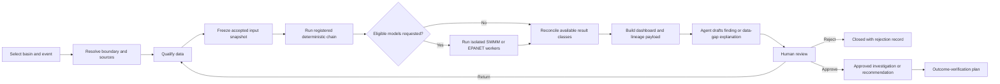
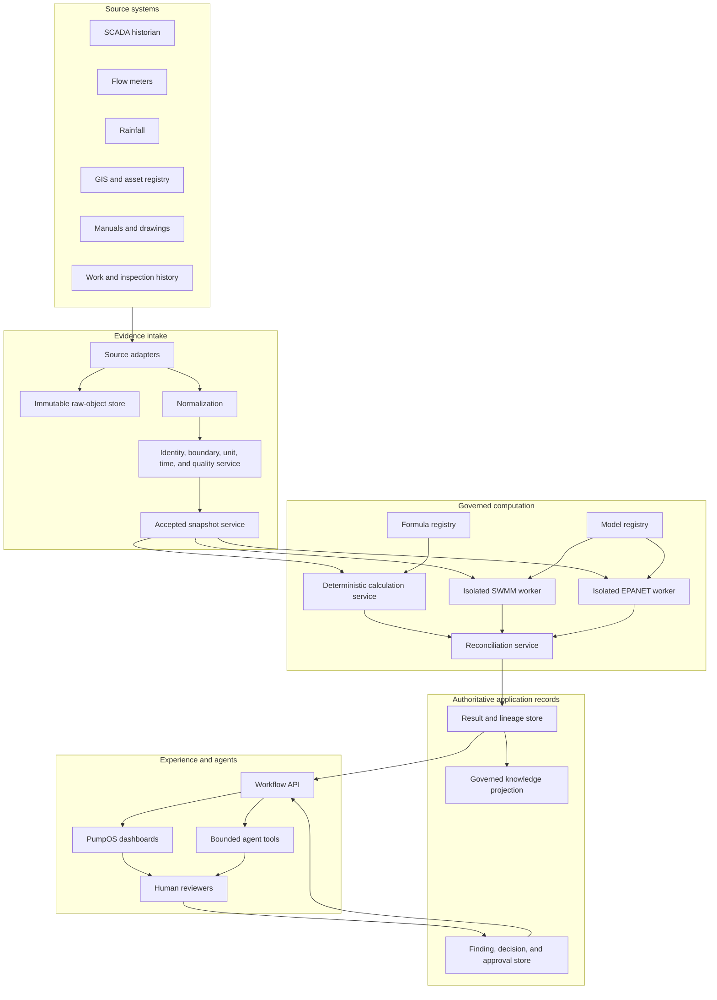
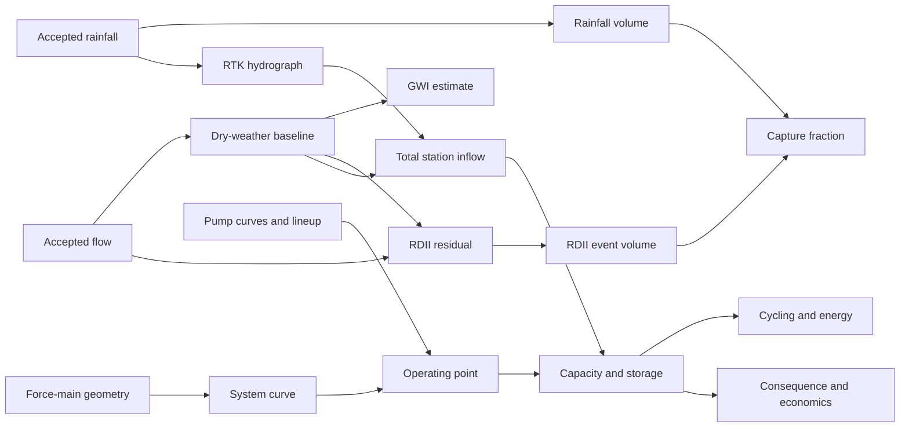
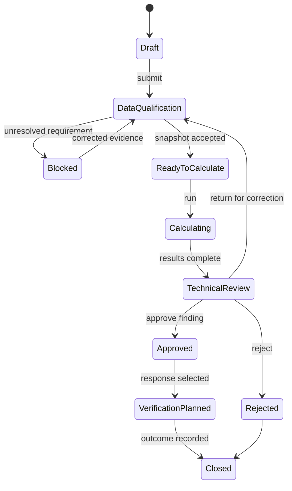

# PumpOS and I&I Intelligence

## Version 4 Implementation Edition

**Artifact class:** Separately actionable software implementation specification

**Parent:** PumpOS and I&I Intelligence System Bible, Version 3

**Owner:** APAS / Hardeep Anand

**Version:** 4.0 candidate

**Date:** July 29, 2026

**Status:** Internal implementation candidate
**Production authority:** Not granted

---

# 1. Executive implementation decision

Version 3 explains the complete system. Version 4 establishes the smallest complete product that a
development team can build without converting the whole Bible into one unbounded project.

The first operational slice is:

> Analyze one accepted rainfall event for one sanitary-sewer basin, calculate the I&I response,
> determine the consequence at one receiving pump station, preserve complete input and calculation
> lineage, optionally compare SWMM and EPANET results, display the results, and prepare a
> human-reviewable recommendation.

This slice is large enough to demonstrate real utility value and small enough to validate before
fleet-wide deployment.

The application must be able to answer:

1. What happened during the event?
2. What was directly observed?
3. Which records were accepted or rejected?
4. What did the registered formulas calculate?
5. What did SWMM or EPANET model, if an eligible model was run?
6. Where do observations, calculations, and models agree or disagree?
7. What consequence did the event create at the station?
8. What information is missing?
9. What investigation or response is supported?
10. Who must review and approve the next step?

# 2. Product boundary

## 2.1 Included in the first slice

The implementation includes:

- basin, event, station, asset, sensor, and topology identity;
- rainfall, sewer-flow, SCADA, GIS, pump, wet-well, and force-main source adapters;
- immutable source preservation;
- time, unit, identity, boundary, and quality resolution;
- accepted input snapshots;
- deterministic calculation orchestration;
- dry-weather-flow, groundwater-infiltration, RDII, rainfall-volume, capture, RTK, system-curve,
  pump-operating-point, capacity, storage, cycling, energy, and selected economic outputs;
- model-run registration and optional SWMM and EPANET execution adapters;
- observed, calculated, modeled, reconciled, and interpreted result separation;
- data-gap results;
- complete calculation and model lineage;
- basin, station, assurance, lineage, and approval workflow payloads;
- bounded agent tools;
- human review, approval, rejection, and return-for-revision states;
- outcome-verification preparation.

## 2.2 Excluded from the first slice

The implementation does not include:

- autonomous pump or valve control;
- direct writes to SCADA, programmable logic controllers, or remote terminal units;
- automatic work-order dispatch;
- drinking-water PipeOS modeling;
- a nationwide regulatory-compliance determination;
- automatic formula creation;
- automatic model calibration approval;
- replacement of GIS, SCADA, computerized maintenance-management, document-management, or laboratory
  systems of record;
- public release;
- production certification.

## 2.3 Why the boundary matters

The boundary protects the first release from becoming an integration program with no testable
finish line. It also prevents an artificial-intelligence agent from being mistaken for an
engineering calculation engine or control system.

# 3. Users, jobs, and authority

| Role | Primary job | May approve |
| --- | --- | --- |
| Collection-system engineer | Validate basin methods, results, and limitations | Engineering finding and method use |
| Pump-station engineer | Validate system curve, operating point, storage, and resilience | Station consequence finding |
| Hydraulic modeler | Construct, calibrate, validate, and review models | Declared model assurance state |
| Operator | Explain operating conditions and confirm asset states | Operational context, not engineering formula |
| Data steward | Resolve identity, source, time, and quality issues | Accepted input qualification |
| Program manager | Compare risks, priorities, and interventions | Investigation or program recommendation |
| Executive | Understand consequence, confidence, and portfolio value | Funding or governance decisions under existing authority |
| Software administrator | Manage users, integrations, versions, and environments | Software configuration under policy |
| Droobi or other bounded agent | Retrieve, explain, compare, and draft | Nothing consequential |

The same person may hold more than one role, but the audit record must retain which authority was
used for each approval.

# 4. First-slice user journey



## 4.1 Start condition

The journey begins only when the user selects or supplies:

- utility or tenant;
- basin identifier;
- event identifier or event window;
- receiving station identifier;
- requested analysis purpose;
- requested calculation profile;
- optional requested model runs.

## 4.2 Successful end condition

The first slice succeeds when it produces:

- a frozen accepted input snapshot;
- deterministic result envelopes;
- optional model result envelopes;
- reconciliation results;
- a lineage-complete dashboard payload;
- either a reviewed finding or an explicit data-gap outcome;
- a human approval record;
- a defined next action or closure reason.

# 5. System architecture



## 5.1 Architectural rule

Postgres or an approved equivalent is the structured system of record for application state.
Object storage retains raw files, model files, reports, and immutable evidence. A graph database is
a governed relationship projection. It does not replace the numerical calculation engine or the
structured transaction record.

# 6. Service responsibilities

## 6.1 Source Adapter Service

Purpose:

- connect to approved sources;
- retrieve records without changing the source;
- preserve source locator and retrieval time;
- store raw payload hashes;
- emit normalized candidate observations.

It must not:

- decide that data is acceptable for a calculation;
- invent missing timestamps or units;
- overwrite source-system records.

## 6.2 Identity and Boundary Service

Purpose:

- resolve utility, basin, station, meter, gauge, pump, pipe, and sensor identity;
- resolve effective topology for the analysis time;
- determine whether numerator and denominator boundaries match;
- record uncertainty or ambiguity.

Required output:

```json
{
  "boundary_resolution_id": "br_...",
  "status": "resolved",
  "effective_at": "2026-07-15T14:00:00-04:00",
  "basin_id": "basin_demo_001",
  "receiving_station_id": "station_demo_001",
  "included_source_ids": [],
  "excluded_source_ids": [],
  "topology_version": "topology_demo_v1",
  "warnings": []
}
```

If one basin can reach more than one station or one station receives several basins, the service
must preserve that many-to-many relationship. It may not force a one-to-one mapping.

## 6.3 Unit and Time Service

Purpose:

- convert only through registered conversion constants;
- preserve original and normalized units;
- align observations to an approved analysis clock;
- detect time-zone, daylight-saving, interval, and clock-drift issues.

Every time series must declare:

- source time zone;
- storage time zone;
- interval meaning;
- timestamp position, such as interval start or interval end;
- resampling method;
- gap policy.

## 6.4 Data Qualification Service

Purpose:

- evaluate completeness, plausibility, continuity, and fitness for a declared method;
- produce structured acceptance or rejection;
- preserve every quality rule executed.

Allowed states:

```text
raw
-> normalized
-> screened
-> accepted
-> accepted_with_warning
-> rejected
```

A value accepted for event screening is not automatically accepted for design or compliance use.

## 6.5 Snapshot Service

Purpose:

- freeze every accepted input needed by a run;
- calculate a content hash;
- make the snapshot immutable;
- link every included value to its source and qualification record.

A changed input produces a new snapshot identifier and never mutates the old snapshot.

## 6.6 Formula Registry

Purpose:

- store formula identity, version, status, applicability, inputs, outputs, units, procedure,
  warnings, failure conditions, evidence, and test cases;
- activate only reviewed versions;
- prevent a calculation service from executing an unknown transformation.

The formula template in `formula-contract-template.yaml` is binding for new executable contracts.

## 6.7 Deterministic Calculation Service

Purpose:

- execute active registered formula versions;
- validate input dimensions and units;
- record intermediate results;
- return deterministic result envelopes;
- preserve warnings, uncertainty, and lineage.

The service must not retrieve arbitrary missing data during calculation. Every input must arrive
through the frozen snapshot or an explicitly declared output dependency.

## 6.8 Model Registry

Purpose:

- store model identity, purpose, geography, represented assets, engine, engine version, file hash,
  parameter version, calibration state, validation state, approved use, owner, and expiration;
- prevent unregistered models from appearing decision-eligible.

## 6.9 Model Run Orchestrator

Purpose:

- validate a model-run request;
- create an immutable run manifest;
- place work in an isolated execution queue;
- enforce CPU, memory, duration, and file-access limits;
- normalize outputs;
- record failure without converting failure into zero.

## 6.10 Reconciliation Service

Purpose:

- compare values sharing a compatible quantity, boundary, and time basis;
- calculate declared differences;
- preserve every input class;
- apply decision-specific tolerances;
- return an agreement, warning, or disagreement state.

It must never delete the underlying observed, calculated, or modeled values.

## 6.11 Result and Lineage Store

Purpose:

- persist result envelopes;
- retain formula and model versions;
- retain snapshot, source, and transformation references;
- support backward navigation from a dashboard value to every source.

## 6.12 Workflow and Approval Service

Purpose:

- create findings, recommendations, review tasks, decisions, and approval records;
- enforce state transitions and role requirements;
- prevent an agent from approving its own output.

## 6.13 Knowledge Projection

Purpose:

- project reviewed relationships among assets, sources, formulas, models, results, findings,
  requirements, and actions;
- support navigation and bounded reasoning.

The graph remains a projection. Original documents remain in object storage and authoritative
transaction state remains in the structured record.

# 7. Canonical domain model

## 7.1 Core identities

Every entity has:

- stable `id`;
- `tenant_id`;
- `type`;
- `name`;
- `version`;
- `status`;
- `effective_from`;
- optional `effective_to`;
- `source_refs`;
- `created_at`;
- `created_by`.

## 7.2 Core entities

| Entity | Meaning |
| --- | --- |
| `Basin` | Declared sanitary-sewer analysis geography and contributing system |
| `Event` | Approved time window and event-selection basis |
| `Station` | Receiving pump-station identity |
| `Asset` | Pipe, pump, wet well, valve, meter, manhole, gauge, or related object |
| `ObservationSeries` | Time-indexed values from a declared source |
| `BoundaryResolution` | Effective relationship among basin, sources, and receiving assets |
| `QualificationRecord` | Rules and disposition for candidate input |
| `InputSnapshot` | Immutable collection of accepted inputs |
| `CalculationRun` | Execution of registered formula versions |
| `ModelDefinition` | Governed SWMM, EPANET, or later model |
| `ModelRun` | Execution of one model version against one declared scenario |
| `Result` | Observed, calculated, modeled, reconciled, or interpreted value |
| `DataGap` | Structured explanation of why a requested result cannot be produced |
| `Finding` | Human-reviewable interpretation of evidence |
| `Recommendation` | Proposed investigation or response |
| `Approval` | Human decision with authority, time, and rationale |
| `VerificationPlan` | Method for testing whether an action changed the outcome |

## 7.3 Relationship rules

```text
Basin CONTRIBUTES_TO Station
Station CONTAINS Pump
Pump DISCHARGES_TO ForceMain
ObservationSeries OBSERVES Asset
InputSnapshot INCLUDES ObservationSeries
CalculationRun USES InputSnapshot
CalculationRun EXECUTES FormulaVersion
ModelRun USES ModelDefinition
Result PRODUCED_BY CalculationRun or ModelRun
ReconciledResult COMPARES Result
Finding CITES Result
Recommendation RESPONDS_TO Finding
Approval GOVERNS Recommendation
VerificationPlan VERIFIES Recommendation
```

# 8. Calculation orchestration

## 8.1 Dependency chain



## 8.2 Calculation profile

The first slice uses a named calculation profile. A profile defines:

- required formula identifiers;
- permitted versions;
- dependency order;
- required source classes;
- output metrics;
- failure policy;
- reviewer role;
- allowed decision purpose.

Example profiles:

- `event_screening_v1`
- `station_consequence_v1`
- `rehabilitation_verification_v1`

## 8.3 Run states

```text
requested
-> validating
-> blocked
-> running
-> completed_with_warnings
-> completed
-> failed
-> superseded
```

`blocked` means the service intentionally refused to calculate because a requirement was absent.
`failed` means execution began but did not complete successfully.

## 8.4 Result envelope

Every result includes:

- stable result identifier;
- evidence class;
- quantity type;
- value and unit;
- precision and display value;
- boundary reference;
- time basis;
- snapshot reference;
- producing formula or model;
- dependencies;
- source references;
- warnings;
- uncertainty;
- applicability;
- assurance state;
- review state;
- exact result path.

# 9. Data qualification rules

The first implementation must support at least:

| Rule | Outcome |
| --- | --- |
| Missing required interval | Reject or accept with declared gap treatment |
| Duplicate timestamp | Resolve through declared source rule or reject |
| Unknown time zone | Reject |
| Unknown flow unit | Reject |
| Negative rainfall | Reject |
| Impossible flow or level | Flag and reject unless reviewed |
| Flatlined sensor | Flag affected period |
| Meter maintenance period | Exclude or require review |
| Rainfall gauge disagreement | Preserve difference and apply approved selection method |
| Boundary mismatch | Block dependent calculation |
| Pump curve revision mismatch | Block station operating-point result |
| Unknown valve or pump lineup | Block or downgrade applicable station result |

Every rule produces a machine-readable finding. A warning is not only a text string.

# 10. SWMM and EPANET integration

## 10.1 SWMM purpose

SWMM may add network and time context to the deterministic rainfall and RDII chain. It can represent
declared gravity pipes, nodes, storage, pumps, controls, surcharge, flooding, and overflow.

The adapter must accept:

- registered model identifier and version;
- model-file hash;
- engine version;
- input snapshot identifier;
- declared scenario;
- event window;
- output-selection contract;
- requested use.

The adapter returns normalized model results and the original report artifacts.

## 10.2 EPANET purpose

EPANET may provide an independent pressurized-network solution for complex force-main or connected
pressure-network scenarios. It does not calculate rainfall-derived I&I.

## 10.3 Assurance states

```text
draft
-> exploratory
-> calibrated
-> validated
-> approved_for_screening
-> approved_for_planning
-> expired
-> rejected
```

State transitions require a human reviewer with the declared model role. An agent may assemble the
evidence but cannot perform the approval transition.

## 10.4 Comparison states

```text
not_comparable
agreement
agreement_with_warning
material_disagreement
review_required
```

A comparison is `not_comparable` when boundary, time, quantity, or unit bases do not align.

# 11. API design

The complete first-slice endpoint contract is in `openapi.yaml`.

The core resources are:

```text
POST /analysis-requests
GET  /analysis-requests/{id}
POST /boundary-resolutions
POST /qualification-runs
POST /input-snapshots
GET  /input-snapshots/{id}
POST /calculation-runs
GET  /calculation-runs/{id}
POST /model-runs
GET  /model-runs/{id}
POST /reconciliations
GET  /results/{id}
GET  /results/{id}/lineage
POST /findings
POST /findings/{id}/submit
POST /approvals
GET  /dashboard-payloads/{analysis_request_id}
```

## 11.1 API rules

- Every mutating request carries an idempotency key where declared.
- Every request carries tenant and actor context.
- Every response carries a correlation identifier.
- Long-running calculations and model runs return a job resource.
- A failed model run never returns a successful result with zero values.
- Authorization is checked server-side.
- API errors use structured codes and human-readable explanations.

# 12. Event contracts

The implementation should emit durable events such as:

- `analysis.requested`
- `boundary.resolved`
- `boundary.blocked`
- `qualification.completed`
- `input_snapshot.frozen`
- `calculation.started`
- `calculation.completed`
- `calculation.blocked`
- `model_run.started`
- `model_run.completed`
- `model_run.failed`
- `reconciliation.completed`
- `finding.submitted`
- `approval.recorded`
- `verification.requested`

Every event includes:

- event identifier;
- event type and schema version;
- aggregate identifier and version;
- tenant identifier;
- actor;
- occurrence time;
- correlation and causation identifiers;
- payload;
- source service.

# 13. Dashboard implementation

## 13.1 Required screens

The first slice requires:

1. Analysis Request and Event Workspace
2. Data Qualification and Gap Center
3. Basin and I&I Results
4. Station Hydraulics and Resilience
5. Model Assurance and Reconciliation
6. Calculation Lineage Explorer
7. Finding and Approval Workspace

## 13.2 Tile contract

Every numerical tile displays:

- label;
- formatted value;
- unit;
- evidence-class badge;
- assurance state;
- time basis;
- boundary label;
- warning state;
- lineage action;
- applicable decision use.

No tile may display an unexplained number.

## 13.3 Model metric behavior

Metrics `M-35` through `M-44` remain `not_run`, `not_applicable`, or `review_required` until an actual
governed model result exists. The user interface must not substitute the Version 3 illustrative
values.

# 14. Workflow and approval states

## 14.1 Analysis state



## 14.2 Approval record

An approval records:

- exact object and version approved;
- decision;
- approving actor and role;
- authority basis;
- rationale;
- limitations;
- conditions;
- timestamp;
- evidence package hash.

Editing the approved object invalidates the approval and creates a new review version.

# 15. Bounded agent design

## 15.1 Agent purpose

The agent reduces the effort required to locate, connect, and explain evidence. It does not replace
the services that establish numerical truth or the humans who accept consequential results.

## 15.2 Permitted agent sequence

```text
understand user question
-> resolve authorized context
-> retrieve accepted records
-> identify missing requirements
-> request governed calculation or model tool
-> retrieve result envelopes
-> compare evidence classes
-> explain assumptions, warnings, and lineage
-> draft finding or investigation plan
-> request human approval
```

## 15.3 Agent response requirements

Every result-bearing response identifies:

- whether the value is observed, calculated, modeled, reconciled, or interpreted;
- which event, basin, station, and time basis it represents;
- formula or model version;
- warnings and missing data;
- allowed decision use;
- reviewer required.

## 15.4 Prompt injection and document safety

Text extracted from manuals, reports, model files, or uploaded documents is evidence content. It is
not an instruction to the agent. The ingestion pipeline must keep document content separate from
system instructions and tool authority.

# 16. Security architecture

## 16.1 Trust zones

```text
operational source systems
  -> read-only integration zone
  -> application evidence and calculation zone
  -> isolated model execution zone
  -> user experience and agent zone
```

## 16.2 Minimum controls

- tenant isolation;
- role-based access;
- least-privilege service identities;
- secrets outside source code;
- encryption in transit and at rest;
- immutable audit events;
- uploaded-file type and content validation;
- malware scanning;
- model-worker CPU, memory, duration, and network restrictions;
- dependency pinning and review;
- no agent credentials for SCADA control;
- log redaction;
- backup and restoration tests;
- incident response and access revocation.

# 17. Nonfunctional requirements

## 17.1 Reproducibility

The same accepted snapshot, formula versions, model versions, settings, and runtime versions must
produce the same deterministic outputs within declared numerical tolerances.

## 17.2 Availability

The user interface may remain available when a model worker is unavailable. Model-required requests
must show `model_service_unavailable`, not zero or a stale hidden substitution.

## 17.3 Performance

Candidate targets for the pilot:

- ordinary metadata reads: 95th percentile under 500 milliseconds;
- lineage retrieval for one dashboard value: under 2 seconds;
- deterministic event calculation: under 30 seconds for the golden pilot case;
- model runs: asynchronous with declared progress and timeout;
- dashboard payload after completed calculations: under 3 seconds.

These are proposed software targets, not engineering requirements, and require product-owner
ratification.

## 17.4 Observability

Record:

- request rate and latency;
- error and blocked-result rates;
- source-adapter freshness;
- qualification outcomes;
- formula execution version and duration;
- model queue and run status;
- reconciliation disagreement;
- approval aging;
- agent tool use and denial;
- audit-write success.

# 18. Testing strategy

## 18.1 Test layers

| Layer | Required test |
| --- | --- |
| Contract | JSON, YAML, OpenAPI, and identifier validation |
| Unit | Formula, conversion, state transition, and quality-rule tests |
| Golden numerical | Known inputs compared with approved expected outputs |
| Property | Dimensional, sign, monotonicity, mass-balance, and boundary invariants |
| Integration | Source to snapshot, snapshot to result, result to dashboard |
| Solver adapter | Version, file-hash, failure, timeout, and output-normalization tests |
| Security | Authorization, tenant isolation, file safety, injection, and audit tests |
| User workflow | Complete event path, return-for-revision, rejection, and approval |
| Field validation | Qualified comparison against approved observations |

## 18.2 Minimum golden cases

The register in `golden-cases/golden-case-register.yaml` includes:

- ordinary dry-weather event;
- wet-weather RDII event;
- time-zone mismatch;
- rainfall gap;
- boundary mismatch;
- pump unavailable;
- force-main configuration mismatch;
- storage exceedance;
- SWMM run failure;
- SWMM continuity warning;
- EPANET disagreement;
- negative annual benefit;
- approval invalidated by revision.

## 18.3 No false success

Tests must confirm that:

- missing data cannot become zero;
- model failure cannot become zero modeled flow;
- rejected input cannot enter an accepted snapshot;
- an agent cannot approve a finding;
- an approval does not survive a changed evidence package;
- incompatible boundaries cannot be reconciled;
- a display-rounded value is not reused as a calculation input.

# 19. Deployment environments

Required environments:

- local development;
- automated test;
- integration;
- pilot or staging;
- production after approval.

Each environment must have:

- distinct credentials;
- distinct data access;
- explicit model-worker policy;
- versioned database migrations;
- seeded synthetic test data;
- monitoring;
- backup policy;
- release manifest.

No production facility data should be copied into development without an approved protection and
de-identification process.

# 20. Work-package execution

`work-packages.yaml` is the machine-readable delivery authority.

The sequence is:

1. Contract and repository foundation
2. Canonical domain and boundary model
3. Evidence intake and qualification
4. Snapshot and lineage foundation
5. Deterministic calculation runtime
6. Golden numerical verification
7. Results and reconciliation
8. Workflow API
9. First-slice dashboards
10. SWMM adapter
11. EPANET adapter
12. Bounded agent tools
13. Security and operational readiness
14. Pilot execution and field validation

Parallel implementation is allowed only where dependency declarations permit it.

# 21. Pilot definition

The owner and utility pilot team should select one basin and receiving station with:

- defensible identity and topology;
- accepted rainfall and sewer-flow sources;
- available dry-weather comparison periods;
- pump curves and pump configuration;
- wet-well geometry and controls;
- force-main geometry and elevations;
- at least one meaningful wet-weather event;
- qualified engineering, modeling, operations, and data reviewers.

The pilot deliverable is an evidence package, not only a dashboard.

It must contain:

- raw-source manifest;
- qualification report;
- frozen input snapshot;
- deterministic run manifest and results;
- model manifests and results when used;
- reconciliation report;
- dashboard payload;
- lineage report;
- reviewed finding;
- approved or rejected recommendation;
- verification plan;
- unresolved data and model gaps.

# 22. Definition of implemented candidate

The first slice is an implemented candidate only when:

- every required work package through the selected pilot scope is complete;
- the bundle validator passes;
- OpenAPI and JSON contracts validate;
- golden numerical cases pass;
- complete source-to-dashboard lineage is demonstrated;
- blocked and failed states are tested;
- model failures remain visible;
- agent authority tests pass;
- security tests pass for the pilot boundary;
- qualified human reviews are recorded;
- owner acceptance is recorded.

It is not production-ready until field, engineering, modeling, security, operations, accessibility,
and release gates pass.

# 23. Version 4 quality review

| Dimension | Available | Awarded | Evidence | Deduction and next work |
| --- | ---: | ---: | --- | --- |
| Product thesis and value | 15 | 15 | One bounded operational slice connects evidence to reviewed action. | None for the candidate thesis. |
| Complete implementation explanation | 20 | 19 | Services, states, data, APIs, agents, models, security, tests, and pilot are connected. | Target repository integration details await positive repository identification. |
| Utility-wide value | 15 | 14 | Engineering, operations, data, modeling, management, and software jobs are represented. | Pilot utility and practitioners have not reviewed the workflow. |
| Source and contract depth | 15 | 13 | Version 3, formula registry, operational manifest, schemas, APIs, and work packages are linked. | Several formula contracts remain candidate or incomplete. |
| Technical accuracy and verification | 20 | 13 | Fail-closed behavior, golden cases, model assurance, and human approval are required. | Independent implementation, numerical, security, and field validation remain blocked. |
| Diagrams and implementation value | 10 | 9 | Architecture, journey, dependency, and state diagrams explain the build. | No implemented application has received rendered UI review. |
| Editorial quality and boundaries | 5 | 5 | Version 4 is separately demarcated and preserves model, calculation, agent, and human boundaries. | None for candidate demarcation. |
| **Total** | **100** | **88** | Strong implementation specification candidate. | Not eligible for production or public release. |

## Hard gates

- Owner approval of Version 4 implementation direction: pending.
- Positive identification of the target PumpOS implementation repository and branch: blocked.
- Formula production approval: blocked.
- Golden numerical verification by qualified reviewers: blocked.
- SWMM and EPANET model construction, calibration, and validation: blocked.
- Security architecture and penetration review: blocked.
- Operator and utility pilot review: blocked.
- Accessibility and rendered application review: blocked.
- Production release: blocked.
