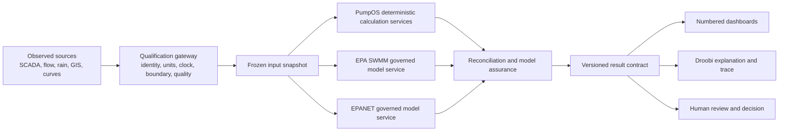
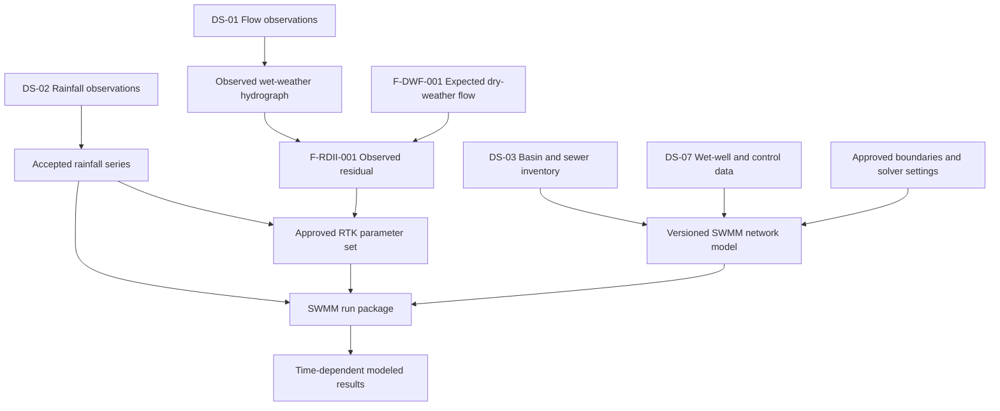
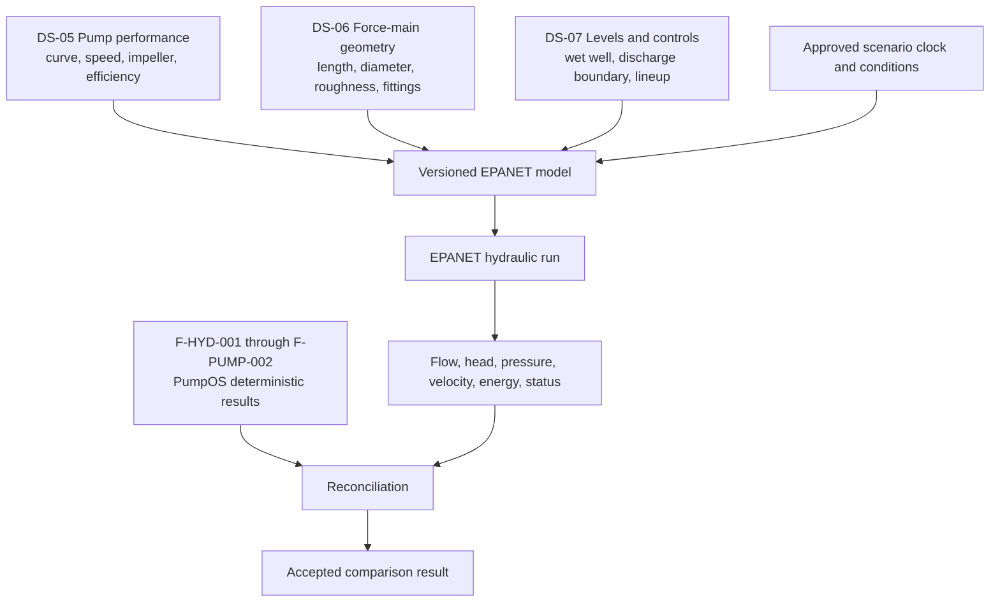
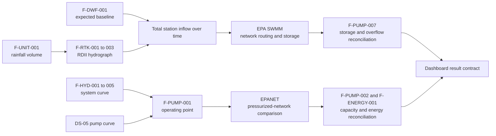
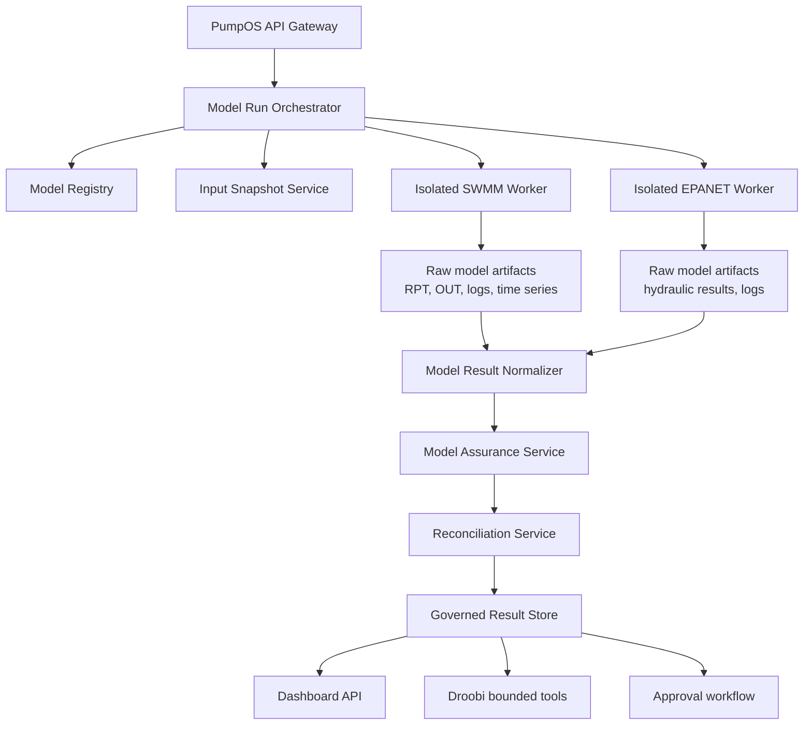

# Book II. EPA SWMM, EPANET, and the governed model layer

## 1. Reader orientation

### What this book is about

This book explains where two established open-source hydraulic engines fit inside the PumpOS and
I&I Intelligence architecture:

- **EPA SWMM**, the United States Environmental Protection Agency Storm Water Management Model;
- **EPANET**, the hydraulic and water-quality analysis toolkit originally developed by the United
  States Environmental Protection Agency and actively maintained by the Open Water Analytics
  community.

The spelling matters. “EPSWIM,” “EPA swim,” and “APA swim” in conversation are interpreted here as
**EPA SWMM**, pronounced as the letters EPA followed by the word “swim.” PySWMM is a Python package
that lets software run and interrogate SWMM.

### Who this is for

This explanation is written for executives, utility leaders, wastewater engineers, modelers,
operators, software developers, data engineers, and readers who have never installed a hydraulic
model. No prior knowledge of Python, SWMM, EPANET, or numerical simulation is assumed.

### Why it matters

PumpOS can calculate a system curve, operating point, capacity margin, storage requirement, energy
burden, and I&I event response from controlled formulas. Those calculations are essential, but a
real collection system can contain interacting pipes, manholes, storage units, pumps, controls,
changing water levels, backwater, surcharge, and time-varying rainfall. A formula that answers one
well-defined question does not automatically reproduce that complete network behavior.

EPA SWMM and EPANET add value by solving bounded network scenarios. If they are integrated without
governance, however, they can also create false confidence. A detailed model built from wrong
elevations, wrong pipe diameters, an uncalibrated RTK parameter set, or the wrong pump curve can
produce a very precise but incorrect answer. Version 3 therefore treats each model run as evidence
with a declared purpose, version, input snapshot, quality state, and review status.

### What the reader will be able to do

After this book, the reader should be able to:

1. explain in ordinary language what EPA SWMM and EPANET do;
2. distinguish a deterministic formula from a network simulation;
3. identify which I&I and pump-station questions belong to each engine;
4. follow model inputs through a run and into a dashboard;
5. compare the value of operating with and without each model;
6. understand the minimum installation and Python commands for a PySWMM run;
7. understand why model output must pass reconciliation and human review before decision use.

### Scope boundary

This book is an implementation and architecture specification. It does not approve an actual sewer
model, calibrate a Miami-Dade County basin, establish a pump-station capacity, authorize a control
change, or replace qualified engineering review. All numerical examples are illustrative unless
they explicitly reference the governed worked example in the Bible.

---

## 2. Define the terms before using the models

### 2.1 Deterministic calculation

A deterministic calculation applies a registered method to a frozen set of accepted inputs. If the
same formula version and the same full-precision inputs are used again, the same output should be
produced.

For example, `F-HYD-003` calculates Darcy-Weisbach major head loss from friction factor, pipe
length, diameter, velocity, and gravity. It answers one bounded physical question. It does not by
itself represent every changing condition in a collection system.

A deterministic calculation does not mean the input is correct. It means the transformation is
repeatable and inspectable.

### 2.2 Hydraulic model

A hydraulic model is a structured mathematical representation of connected assets and operating
conditions. A model contains nodes, links, boundaries, parameters, time settings, and solver
options. The solver uses these records together to estimate how the represented system behaves.

For example, a SWMM model might connect rainfall, subcatchments, manholes, gravity pipes, storage,
pumps, and an outfall. An EPANET model might connect a wet-well boundary, pump curves, force-main
pipes, valves, and a discharge boundary.

A model is not a digital copy of reality merely because it contains many objects. It represents
only the assets, processes, data quality, and assumptions actually encoded in it.

### 2.3 Simulation

A simulation is one execution of a model for a declared scenario. A simulation run has:

- a model version;
- an input-data snapshot;
- a start and end time;
- time-step and solver settings;
- boundary conditions;
- parameter versions;
- warnings and convergence information;
- results.

Changing one of these can create a different run and a different answer.

### 2.4 Calibration

Calibration adjusts selected model parameters so modeled results reproduce accepted observations
within approved measures and tolerances. For I&I, calibration may compare a modeled RDII
hydrograph with an observed wet-weather residual.

Calibration does not mean changing any input until the chart looks good. Parameters require
physical meaning, bounded ranges, documented objectives, training events, holdout events, and
qualified review. A model that matches one storm may fail another storm.

### 2.5 Validation

Validation tests the calibrated model against accepted information that was not used merely to fit
the model. The purpose is to determine whether the model can support its declared use beyond the
calibration events.

A validation result is specific to the represented conditions. It does not establish permanent
accuracy after assets, controls, rainfall coverage, groundwater conditions, or operating practices
change.

### 2.6 Solver

A solver is the numerical engine that evaluates the equations. EPA SWMM and EPANET contain solvers.
PySWMM and WNTR provide application-friendly ways to call or work with those engines.

The solver is not the complete application. PumpOS must still manage identity, source records,
units, approvals, model versions, execution, lineage, dashboards, security, and interpretation.

### 2.7 Observed, calculated, modeled, and reconciled

These evidence classes must remain separate:

| Evidence class | Meaning | Example |
| --- | --- | --- |
| **Observed** | Recorded by an accepted field or source system | Flow meter reports 2,650 gpm at 14:05 |
| **Calculated** | Produced by a registered deterministic formula | PumpOS calculates 31.8 feet of system head at 2,650 gpm |
| **Modeled** | Produced by a declared simulation | EPANET estimates 32.1 feet at the same flow and boundary condition |
| **Reconciled** | Compared under a governed rule and accepted for a stated use | Difference is 0.3 feet and within the approved validation tolerance |

A dashboard must never remove these labels. Agreement increases confidence in the represented
scenario. Disagreement creates a review task. It must not be hidden by selecting whichever value is
more convenient.

---

## 3. The central architecture: calculate, simulate, reconcile, decide

Before looking at either model, the reader should understand the operating pattern.



**How to read the diagram:** The same accepted source snapshot can feed more than one method. PumpOS
calculations, SWMM, and EPANET do not compete to become the truth. Their results meet in a
reconciliation layer. Only a versioned result contract can feed dashboards, the agent, or a human
decision.

**What the diagram does not prove:** It does not say all three engines are required for every
calculation. A simple, bounded decision may require only the deterministic calculation. The model
services are invoked when the declared question needs their additional physical scope or an
independent cross-check.

### 3.1 Why PumpOS remains the owner of the calculation contract

PumpOS must own:

- formula identifiers;
- method versions;
- unit and conversion rules;
- accepted input schemas;
- applicability;
- interpolation and extrapolation policy;
- numerical tolerances;
- fail-closed rules;
- output schemas;
- dashboard metric definitions;
- decision and approval policies.

EPA SWMM and EPANET become replaceable engines behind APAS-owned adapters. This matters because
engine releases, Python packages, operating systems, and community projects change. The stable
business and engineering contract must remain under APAS control.

### 3.2 The three-way comparison

The strongest architecture compares:

1. **what was observed;**
2. **what the controlled formulas calculate;**
3. **what the network model simulates.**

When all three are applicable and agree within approved tolerances, the decision packet becomes
stronger. When they disagree, the disagreement is useful. It may identify a bad meter, incorrect
asset data, a changed pump, a closed valve, an unrepresented control, a weak RTK calibration, or a
method outside its applicability.

---

## 4. EPA SWMM in detailed plain English

### 4.1 What EPA SWMM is

EPA SWMM is a dynamic hydrology, hydraulics, and water-quality simulation engine maintained by the
United States Environmental Protection Agency. It can represent single storms or long continuous
periods. It is used for stormwater, wastewater, and combined collection-system analysis.

For this application, the most important word is **dynamic**. SWMM calculates how conditions change
through time. Rain does not enter a basin as one permanent flow value. A storm begins, intensifies,
moves, and ends. Different parts of the collection system respond at different times. Storage fills
and drains. Pumps turn on and off. Pipes can surcharge. A downstream condition can influence an
upstream result. SWMM is built to solve that type of connected, time-varying problem.

### 4.2 What SWMM represents

A SWMM model can include:

- rainfall time series and rain gauges;
- subcatchments and runoff;
- groundwater and infiltration processes when the selected method requires them;
- sanitary and other external inflows;
- rainfall-derived infiltration and inflow using RDII unit hydrographs;
- junctions and manholes;
- gravity conduits;
- force mains and pumps within the limits of the SWMM representation;
- storage units such as wet wells;
- weirs, orifices, outlets, and controls;
- outfalls and downstream boundaries;
- dynamic routing, surcharge, ponding, flooding, and continuity results.

The Version 3 I&I architecture uses SWMM primarily for:

1. RTK and RDII hydrograph execution;
2. dynamic sewer routing;
3. basin-to-station event propagation;
4. wet-well and pump-control scenarios;
5. surcharge, flooding, storage, and overflow consequence;
6. comparison of rehabilitation or operating scenarios.

### 4.3 What SWMM does not provide automatically

SWMM does not automatically provide:

- a correct basin boundary;
- a correct sewer inventory;
- accepted rainfall coverage;
- an accurate flow meter;
- a dry-weather baseline;
- calibrated R, T, and K values;
- a current pump curve;
- a verified wet-well stage-storage curve;
- a defensible rehabilitation recommendation;
- a compliance determination;
- a control authorization.

Those are governed inputs, methods, reviews, or decisions outside the solver.

### 4.4 Why SWMM is important to the I&I story

The deterministic RTK formulas in the Bible explain how rainfall increments create short, medium,
and long triangular response components. SWMM can execute those unit hydrographs inside a connected
sewer model and route the resulting flow through the represented system.

That changes the question from:

> How much RDII is produced at this basin boundary?

to:

> When does that RDII reach each downstream manhole and station, what other flows are present,
> which pipes surcharge, how much storage is consumed, and whether modeled flooding or overflow
> occurs?

The first question is essential and can be answered with deterministic I&I calculations. The second
question requires a dynamic network representation.

### 4.5 The SWMM input chain



**What to notice:** Observed flow is used to establish and evaluate the I&I response. It is not
silently replaced by the model. The RTK parameter set and the sewer network have separate versions.
The run package freezes both.

### 4.6 The SWMM execution chain

The model service performs a controlled sequence:

1. accept a run request that names the basin, event, model, parameter set, and intended use;
2. verify that required source snapshots and approvals exist;
3. create or retrieve the exact SWMM input file;
4. pin the solver and PySWMM adapter versions;
5. execute in an isolated worker;
6. capture standard output, error output, report file, binary output, and return code;
7. parse continuity errors, warnings, time series, and summary results;
8. calculate model-quality metrics against observations when calibration or validation is intended;
9. write an immutable model-run result;
10. send eligible results to reconciliation and dashboard services.

### 4.7 SWMM outputs that matter to PumpOS and I&I

| SWMM output | Plain-English meaning | Downstream use |
| --- | --- | --- |
| Node inflow | Flow entering a represented manhole, junction, or storage node | Trace basin response and station loading |
| Node depth | Modeled water depth at the node | Surcharge and storage interpretation |
| Link flow | Modeled flow through a pipe, pump, or other link | Capacity, direction, and timing analysis |
| Link depth or capacity state | Modeled hydraulic use of the conduit | Identify constrained reaches for review |
| Storage volume | Modeled water held in a wet well or storage element | Compare with usable storage and controls |
| Flooding or overflow rate | Modeled flow exceeding a represented boundary | Consequence and response analysis |
| Flooding or overflow volume | Integrated modeled exceedance volume | Scenario comparison and decision packet |
| Pump state and flow | Modeled pump operation within the SWMM control representation | Runtime and storage scenario review |
| Continuity error | Numerical accounting check for represented water | Model-run acceptance gate |
| Time series | Complete modeled change through the event | Dashboard hydrographs and replay |

### 4.8 SWMM calibration and validation for I&I

An I&I calibration should not be a single “calibrated” label. PumpOS should store:

- calibration events;
- holdout validation events;
- event acceptance decisions;
- rainfall coverage and quality;
- baseline method and version;
- observed RDII hydrographs;
- calibrated parameters and permitted bounds;
- objective functions;
- time and volume error measures;
- parameter identifiability observations;
- residual plots;
- reviewer;
- approval state;
- expiration or revalidation trigger.

Possible comparison measures include peak error, volume error, timing error, and a full-hydrograph
fit measure. The exact combination and acceptance limits must be an approved model-assurance
method. No universal numeric threshold is asserted by this paper.

### 4.9 What happens if SWMM is not used

PumpOS can still perform valuable work without SWMM:

- calculate rainfall volume;
- separate an observed RDII residual;
- integrate RDII volume;
- calculate capture fraction;
- generate an RTK hydrograph;
- calculate station inflow at a defined boundary;
- compare that inflow with a pump operating point;
- screen storage and energy consequences.

What is missing is dynamic network routing and interaction. The application may not know whether a
downstream restriction delays or amplifies station loading, whether a specific manhole surcharges,
whether upstream storage shifts the peak, or whether a time-varying control changes modeled
overflow.

### 4.10 What happens when SWMM is used badly

A poor SWMM integration can be worse than no model because the interface can make unsupported
results look authoritative. Common failure patterns include:

- treating a synthetic network as an as-built network;
- using one rain gauge without checking spatial representativeness;
- applying uncalibrated RTK values;
- changing many parameters until one storm matches;
- ignoring continuity error or warnings;
- using a coarse time step that misses peaks;
- confusing modeled flooding with a documented field overflow;
- allowing a dashboard to display a model output without model version and status.

Version 3 prevents these failures by making model state and lineage visible.

---

## 5. Running EPA SWMM through Python with PySWMM

### 5.1 The simplest mental model

EPA SWMM is the numerical engine. PySWMM is a Python wrapper that lets a developer:

- open a SWMM input file;
- start the SWMM engine;
- move through the simulation;
- read node and link values;
- change supported controls or inflows in research scenarios;
- read the binary output file;
- return results to PumpOS.

Installing PySWMM is not the same as creating a sewer model. The `.inp` file contains the model.
PySWMM runs it and exposes its state to Python.

### 5.2 What must be installed

For the recommended beginner path, install:

1. Python;
2. a Python virtual environment;
3. PySWMM and a pinned SWMM engine package;
4. a reviewed SWMM `.inp` model file.

Git is needed only if the source repository is being cloned. CMake and a C compiler are needed only
for native source builds. The normal PySWMM package path is simpler.

### 5.3 Create an isolated Python environment on macOS or Linux

Open Terminal, change to a project folder, and enter:

```bash
python3 -m venv .venv
source .venv/bin/activate
python -m pip install --upgrade pip
python -m pip install "pyswmm[swmm5.2.4]"
```

What each line does:

1. `python3 -m venv .venv` creates a private Python environment in a folder named `.venv`.
2. `source .venv/bin/activate` tells the current Terminal session to use that environment.
3. `python -m pip install --upgrade pip` updates the package installer inside the environment.
4. `python -m pip install "pyswmm[swmm5.2.4]"` installs PySWMM with the specified supported SWMM
   engine extra.

The engine version shown is an explicit example supported by the current PySWMM repository
instructions at the Version 3 research cutoff. A production lock file must pin the exact accepted
PySWMM and engine versions after APAS testing.

### 5.4 Create an isolated Python environment on Windows PowerShell

```powershell
py -m venv .venv
.\.venv\Scripts\Activate.ps1
python -m pip install --upgrade pip
python -m pip install "pyswmm[swmm5.2.4]"
```

If PowerShell blocks activation, the user should follow the organization's approved PowerShell
execution policy. The application should never tell a utility employee to weaken device security
controls merely to install a package.

### 5.5 Confirm the installation

```bash
python -c "import pyswmm; print(pyswmm.__version__)"
```

This confirms that Python can import PySWMM. It does not confirm that a specific model is valid or
that the results are correct.

### 5.6 The complete beginner Python runner

Save the following as `run_swmm_model.py`:

```python
#!/usr/bin/env python3
"""Run a reviewed SWMM model and export one node and one link time series."""

from __future__ import annotations

import argparse
import csv
from pathlib import Path

from pyswmm import Links, Nodes, Simulation


def parse_args() -> argparse.Namespace:
    parser = argparse.ArgumentParser()
    parser.add_argument("model", type=Path, help="Path to the reviewed SWMM .inp file")
    parser.add_argument("--node", required=True, help="Node identifier from the model")
    parser.add_argument("--link", required=True, help="Link identifier from the model")
    parser.add_argument(
        "--output",
        type=Path,
        default=Path("swmm_timeseries.csv"),
        help="CSV output path",
    )
    return parser.parse_args()


def main() -> None:
    args = parse_args()
    model_path = args.model.resolve()
    if not model_path.is_file():
        raise SystemExit(f"Model file does not exist: {model_path}")
    if model_path.suffix.lower() != ".inp":
        raise SystemExit("The model path must end in .inp")

    rows: list[tuple[str, float, float, float]] = []

    with Simulation(str(model_path)) as simulation:
        node = Nodes(simulation)[args.node]
        link = Links(simulation)[args.link]

        for _ in simulation:
            rows.append(
                (
                    simulation.current_time.isoformat(),
                    float(node.depth),
                    float(node.total_inflow),
                    float(link.flow),
                )
            )

    args.output.parent.mkdir(parents=True, exist_ok=True)
    with args.output.open("w", newline="", encoding="utf-8") as handle:
        writer = csv.writer(handle)
        writer.writerow(
            [
                "timestamp",
                "node_depth_model_units",
                "node_total_inflow_model_units",
                "link_flow_model_units",
            ]
        )
        writer.writerows(rows)

    print(f"Completed {len(rows)} reporting steps")
    print(f"Wrote {args.output.resolve()}")


if __name__ == "__main__":
    main()
```

### 5.7 Run the Python script

Suppose the model file is named `Example1.inp`, the node is `21`, and the link is `15`:

```bash
python run_swmm_model.py Example1.inp --node 21 --link 15
```

The script:

1. checks that the input file exists;
2. opens the model with PySWMM;
3. selects the named node and link;
4. advances through the simulation;
5. records time, node depth, node inflow, and link flow;
6. writes `swmm_timeseries.csv`.

The node and link identifiers must exist in the selected model. They are not universal SWMM names.

### 5.8 What PumpOS must add around the example

The beginner script demonstrates execution, not production governance. The PumpOS model service
must additionally:

- prohibit arbitrary local file paths from untrusted users;
- retrieve model files by approved model-version identifier;
- verify input hashes;
- run in an isolated worker with memory and time limits;
- pin the PySWMM and engine versions;
- capture the SWMM report and binary output;
- parse warnings and continuity measures;
- label model units;
- store run manifests and result hashes;
- prevent an agent from altering an approved model;
- validate result schemas;
- enforce user and tenant authorization;
- compare results with observations and deterministic calculations;
- route material results for qualified review.

### 5.9 Running the native EPA SWMM executable

The official EPA repository contains source and build material. Its current Windows build
instructions use the repository's build script after the documented Visual Studio Build Tools and
CMake dependencies are installed:

```powershell
cd swmm
tools\make.cmd
```

A native source build is useful for a controlled engine image, regression testing, or development
against the C API. It is not the recommended first experience for a nondeveloper. APAS should
create and sign a reproducible container or package rather than expecting each utility user to
compile the engine.

### 5.10 The production execution contract

```yaml
model_run_request:
  run_id: RUN-SWMM-EXAMPLE-001
  engine: EPA_SWMM
  engine_version: pinned_release
  adapter: PySWMM
  adapter_version: pinned_release
  model_version_id: SWMM-BASIN-A-004
  event_id: EVENT-2026-07-ILLUSTRATIVE
  parameter_set_id: RTK-BASIN-A-003
  input_snapshot_id: SNAPSHOT-ILLUSTRATIVE-001
  intended_use: calibration_comparison
  requested_outputs:
    - station_inflow_time_series
    - node_depth_time_series
    - storage_volume_time_series
    - flooding_volume
    - continuity_summary
```

The service must reject the request if required versions, permissions, inputs, or approvals are
missing.

---

## 6. EPANET in detailed plain English

### 6.1 What EPANET is

EPANET is an open-source hydraulic and water-quality analysis engine for pressurized pipe networks.
It represents pipes, pumps, valves, junctions, reservoirs, tanks, demands, controls, and changes
through an extended simulation period. The Open Water Analytics repository maintains an active
community version of the engine and programmer toolkit.

For PumpOS, EPANET is valuable because a force main is a pressurized pipe system. Pumps add head.
Pipes, fittings, valves, and elevation consume head. The operating condition is determined by the
interaction between what the pumps can supply and what the connected system requires.

### 6.2 What EPANET represents well for this architecture

EPANET can support:

- pump head-flow curves;
- multiple pumps and controls;
- pressurized pipes;
- major and represented minor losses;
- valves;
- tanks and reservoirs used as hydraulic boundaries;
- changing demands and levels through time;
- pressure, head, flow, velocity, and energy results;
- scenario comparison.

In the I&I Intelligence System, EPANET is not the primary basin RDII engine. Its principal role is
force-main and pump-network analysis, plus an independent comparison with PumpOS's deterministic
system-curve calculations.

### 6.3 What EPANET does not automatically provide

EPANET does not automatically provide:

- rainfall-runoff transformation;
- sanitary-sewer RDII separation;
- RTK calibration from rainfall and sewer flow;
- gravity sewer dynamic-wave routing;
- wastewater solids, gas, ragging, or pump-condition effects unless separately represented;
- a correct pump curve;
- a correct force-main geometry;
- a verified operating lineup;
- a facility decision.

The fact that EPANET can represent a pump does not mean it knows the installed pump's current
condition. PumpOS must supply the approved performance curve, speed, impeller, lineup, and condition.

### 6.4 Why EPANET is important to the pump-station story

The Bible's deterministic formula chain calculates:

1. area, velocity, and Reynolds number;
2. Darcy friction factor;
3. major and minor head loss;
4. total system head at a trial flow;
5. the system curve across flows;
6. intersection with the pump curve;
7. operating point;
8. capacity, storage, energy, and economic consequences.

That chain must remain the explainable PumpOS authority. EPANET adds a second network-oriented
solution path. It can represent several pipes, branches, pumps, valves, tanks, and changing
conditions together. When a simple station-and-force-main calculation and an EPANET model represent
the same boundary, their results should be compared.

### 6.5 The EPANET input chain



**What to notice:** The PumpOS formula result and EPANET result arrive separately at reconciliation.
EPANET does not overwrite the formula output. The comparison itself becomes a governed result.

### 6.6 EPANET outputs that matter

| EPANET output | Plain-English meaning | PumpOS use |
| --- | --- | --- |
| Link flow | Modeled flow through a pipe, pump, or valve | Operating point and network distribution |
| Node head | Energy level at a node | Total-head and boundary comparison |
| Node pressure | Pressure head relative to elevation | Force-main and network review |
| Pipe velocity | Modeled mean velocity | Check against deterministic velocity |
| Pump status | Whether the represented pump is on or off | Lineup and control scenario |
| Pump energy | Modeled energy under represented conditions | Compare with `F-ENERGY-001` and `002` |
| Tank level | Time-varying represented storage boundary | Extended-period scenario |
| Warning or convergence state | Whether the engine completed normally | Run acceptance gate |

### 6.7 EPANET as a cross-check, not an unexplained oracle

Suppose PumpOS calculates a one-pump operating point of 2,150 gpm at 34.2 feet of head. The EPANET
model of the same pump and force main returns 2,132 gpm at 34.5 feet.

The application should calculate and display:

```text
flow difference = 2,132 - 2,150 = -18 gpm
absolute flow difference = 18 gpm
relative flow difference = 18 / 2,150 = 0.84 percent

head difference = 34.5 - 34.2 = 0.3 ft
relative head difference = 0.3 / 34.2 = 0.88 percent
```

These illustrative differences do not automatically pass or fail. The approved model-assurance
plan determines tolerance, purpose, and required review. The comparison helps developers find unit
errors, pump-curve interpolation differences, loss-method differences, boundary mismatches, or
implementation defects.

### 6.8 What happens if EPANET is not used

PumpOS can still calculate a station system curve and operating point with the registered formulas.
For a simple pump and one force-main path, that may be the clearest and most appropriate method.

Without EPANET, however, PumpOS has no independent network solver to compare against. More complex
branches, several pumps and valves, extended-period conditions, and interacting boundaries require
more custom deterministic code or remain outside the simple calculation's scope.

### 6.9 What happens when EPANET is used badly

Failure patterns include:

- modeling a wastewater force main as if it were a drinking-water demand network without declaring
  the adaptation;
- using a manufacturer curve for the wrong speed or impeller;
- extrapolating a pump curve beyond supplied points;
- representing minor losses differently in PumpOS and EPANET without recording the difference;
- comparing results at different wet-well or discharge levels;
- ignoring pump wear, fouling, ragging, or actual field performance;
- treating a model warning as a valid run;
- allowing an agent to choose the “better” result.

The reconciliation contract makes these differences visible.

---

## 7. Running EPANET from Python through WNTR

WNTR, the Water Network Tool for Resilience, is a United States EPA Python package compatible with
EPANET models. It can load an EPANET `.inp` file, run the EPANET hydraulic engine, and return
structured results.

### 7.1 Install WNTR

In an activated Python virtual environment:

```bash
python -m pip install wntr
```

Or with Conda:

```bash
conda install -c conda-forge wntr
```

### 7.2 Minimal Python example

```python
from pathlib import Path

import wntr


model_path = Path("force_main_model.inp").resolve()
if not model_path.is_file():
    raise SystemExit(f"Missing EPANET input file: {model_path}")

network = wntr.network.WaterNetworkModel(str(model_path))
simulator = wntr.sim.EpanetSimulator(network)
results = simulator.run_sim()

flow = results.link["flowrate"]
head = results.node["head"]
pressure = results.node["pressure"]

print(flow.head())
print(head.head())
print(pressure.head())
```

This example demonstrates model execution. A production adapter still needs version pinning,
approved model retrieval, units, run manifests, warnings, isolation, result schemas, reconciliation,
and review.

---

## 8. How the two models connect to the deterministic calculations

### 8.1 The division of responsibility

| Question | PumpOS deterministic service | EPA SWMM | EPANET |
| --- | --- | --- | --- |
| What rainfall volume fell on this basin? | Primary | Input or supporting model value | Not applicable |
| What is the observed RDII residual and volume? | Primary | Calibration comparison | Not applicable |
| What RTK hydrograph follows from an approved parameter set? | Primary transparent calculation | Network execution and routing | Not applicable |
| When does basin response reach downstream assets? | Boundary or simplified routing only | Primary dynamic network model | Not primary |
| Do gravity pipes surcharge during the event? | Limited screening | Primary | Not applicable |
| What is the force-main system curve? | Primary explainable calculation | Limited station representation | Independent network cross-check |
| Where is the pump operating point? | Primary explainable calculation | Scenario-specific station result | Independent network solution |
| How does a complex pressurized network respond? | Requires more custom formulas | Not primary | Primary |
| What is wet-well storage consequence? | Primary static and dynamic storage formulas | Dynamic network and controls | Possible boundary scenario, not primary I&I method |
| What appears on the dashboard? | Versioned result | Versioned model result | Versioned model result |

### 8.2 Formula-to-model wiring



**How to read the diagram:** Deterministic formulas establish transparent quantities. SWMM and
EPANET use controlled inputs to add network behavior or an independent calculation path. Model
output then feeds reconciliation, not an uncontrolled dashboard.

### 8.3 The result precedence rule

Version 3 adopts this rule:

1. **observations are preserved as observations;**
2. **deterministic results are preserved as calculated results;**
3. **model outputs are preserved as modeled results;**
4. **a reconciliation result records agreement, disagreement, and eligibility;**
5. **no result class silently replaces another.**

If the observed station peak is 2,710 gpm, the PumpOS calculation is 2,728 gpm, and SWMM is 2,690
gpm, all three remain accessible. The dashboard may display a selected decision value only when the
selection rule and evidence class are visible.

---

## 9. With-model and without-model scenarios

### 9.1 Scenario A: I&I event analysis without SWMM

**Available work:**

- qualify rainfall and flow;
- calculate expected dry-weather flow;
- calculate observed RDII residual;
- integrate event volume;
- calculate capture fraction;
- generate a transparent RTK hydrograph;
- add baseline and RDII at the station boundary;
- compare peak inflow with station capacity;
- screen storage and energy.

**Value:** fast, transparent, explainable analysis with a smaller data burden.

**Limitation:** no full dynamic sewer-network routing, surcharge, backwater, or asset-by-asset
consequence.

### 9.2 Scenario B: I&I event analysis with SWMM

**Additional work:**

- route the accepted event through the represented sewer network;
- compare timing and magnitude at downstream nodes;
- estimate node depth, conduit state, storage, and modeled flooding;
- replay control and rehabilitation scenarios;
- compare modeled and observed hydrographs.

**Value:** identifies where and when represented network consequences occur and how they interact.

**New risk:** model construction, calibration, solver settings, and version control become
load-bearing. The result requires model assurance.

### 9.3 Scenario C: pump-station analysis without EPANET

**Available work:**

- calculate velocity and Reynolds number;
- determine friction factor;
- calculate major and minor losses;
- build the system curve;
- intersect with one or more pump curves;
- calculate capacity margin, storage, cycling, power, and energy.

**Value:** transparent and directly traceable to the Bible's formula registry.

**Limitation:** complex network interactions and an independent solver comparison are absent.

### 9.4 Scenario D: pump-station analysis with EPANET

**Additional work:**

- represent a pressurized network of pipes, pumps, valves, tanks, and boundaries;
- solve extended-period hydraulic scenarios;
- compare flows, heads, velocities, energy, and status with PumpOS calculations;
- expose differences caused by method or boundary assumptions.

**Value:** independent verification and broader network scenario capability.

**New risk:** a drinking-water-oriented engine must be deliberately adapted and validated for the
represented wastewater force-main use.

### 9.5 Comparison table

| Capability | Deterministic only | With SWMM | With EPANET | With both |
| --- | --- | --- | --- | --- |
| Transparent formula trace | Strong | Strong if preserved | Strong if preserved | Strong if preserved |
| Observed RDII separation | Yes | Yes | No added value | Yes |
| RTK hydrograph | Yes | Yes, plus network routing | No | Yes |
| Gravity sewer dynamic routing | No | Yes | No | Yes |
| Surcharge and modeled flooding | Limited | Yes | No | Yes |
| System curve and operating point | Yes | Possible station scenario | Yes, cross-check | Yes |
| Complex force-main network | Custom code required | Limited | Yes | Yes |
| Independent hydraulic comparison | Limited | SWMM comparison | EPANET comparison | Strongest |
| Data and governance burden | Lowest | Higher | Higher | Highest |
| False-confidence risk if ungoverned | Moderate | High | High | High |

### 9.6 Why “use both everywhere” is not the recommendation

More models do not automatically create more truth. Every engine adds:

- dependencies;
- version management;
- data requirements;
- model maintenance;
- numerical settings;
- calibration and review;
- possible disagreement;
- security and operational cost.

The application should invoke the smallest method set that can answer the declared decision
question. Both models become valuable when their additional scope or independent comparison
justifies that burden.

---

## 10. Model outputs on the dashboards

### 10.1 New Version 3 metric identifiers

Version 3 adds model-assurance metrics without changing the existing 34 worked metrics.

| Number | Metric ID | Dashboard label | Evidence class | Source or engine | Why it matters |
| ---: | --- | --- | --- | --- | --- |
| 35 | `M-35` | SWMM run state | model_status | SWMM run manifest | Prevents draft, failed, or unreviewed runs from appearing authoritative |
| 36 | `M-36` | SWMM continuity summary | model_quality | SWMM report | Exposes whether represented volume accounting is acceptable for the declared use |
| 37 | `M-37` | SWMM peak station inflow | modeled | SWMM node time series | Compares routed station loading with the PumpOS boundary calculation |
| 38 | `M-38` | SWMM peak wet-well depth | modeled | SWMM storage-node time series | Connects event loading with operating and storage consequence |
| 39 | `M-39` | SWMM modeled overflow volume | modeled | SWMM flooding or overflow result | Quantifies represented exceedance for scenario comparison |
| 40 | `M-40` | SWMM calibration or validation state | model_assurance | Calibration record | Distinguishes exploratory, calibrated, validated, expired, and rejected models |
| 41 | `M-41` | EPANET operating flow | modeled | EPANET pump or link result | Provides the independent pressurized-network operating-point result |
| 42 | `M-42` | EPANET operating head | modeled | EPANET head result | Compares total head with the PumpOS system-curve intersection |
| 43 | `M-43` | PumpOS versus EPANET flow difference | reconciled | Reconciliation formula | Exposes agreement or disagreement rather than hiding it |
| 44 | `M-44` | Model eligibility for decision use | assurance_state | Model-assurance policy | Tells the reader whether the result may support screening, planning, design review, or no decision |

The sample displays for these new metrics must be populated only by a real governed sample-model
run. Until that run exists, the dashboard should show `not_run`, `not_applicable`, or
`review_required`, not invented numbers.

### 10.2 Model Assurance dashboard mockup

```text
┌──────────────────────────────────────────────────────────────────────────────────────────────┐
│ MODEL ASSURANCE AND RECONCILIATION                                         RUN: SELECTED      │
├──────────────────────────────────────────────┬───────────────────────────────────────────────┤
│ EPA SWMM                                     │ EPANET                                       │
│ [35] Run state            REVIEW REQUIRED    │ [41] Operating flow          NOT RUN          │
│ [36] Continuity summary   NOT RUN            │ [42] Operating head          NOT RUN          │
│ [37] Peak station inflow  NOT RUN            │ [43] Flow difference         NOT AVAILABLE    │
│ [38] Peak wet-well depth  NOT RUN            │                                               │
│ [39] Modeled overflow     NOT RUN            │                                               │
│ [40] Assurance state      EXPLORATORY         │ [44] Decision eligibility    SCREENING ONLY   │
├──────────────────────────────────────────────┴───────────────────────────────────────────────┤
│ COMPARE: observed | PumpOS calculated | SWMM modeled | EPANET modeled | reconciled            │
│ SELECT ANY VALUE TO OPEN SOURCE, MODEL, VERSION, SETTINGS, RESULT PATH, AND REVIEW STATE       │
└──────────────────────────────────────────────────────────────────────────────────────────────┘
```

The dashboard intentionally shows missing states. A blank value would conceal whether the model
was never run, failed, was inapplicable, or is awaiting review.

### 10.3 Basin and I&I dashboard additions

The existing Basin and I&I dashboard retains:

- rainfall depth and rainfall volume;
- expected dry-weather flow;
- observed RDII volume;
- capture fraction;
- peak RDII;
- peak total station inflow.

SWMM adds:

- modeled hydrograph overlay;
- observed-versus-modeled volume difference;
- observed-versus-modeled peak difference;
- timing difference;
- calibration or validation state;
- downstream node consequence;
- continuity summary.

### 10.4 Station Hydraulics dashboard additions

The existing Station Hydraulics dashboard retains:

- PumpOS system curve;
- one-pump and multiple-pump operating points;
- capacity margin;
- utilization;
- required storage;
- overflow and response time.

EPANET adds:

- modeled operating flow and head;
- network pressure and velocity;
- pump status and energy;
- PumpOS-versus-EPANET difference;
- model version and scenario boundary;
- eligibility state.

### 10.5 Calculation Lineage Explorer additions

Every model metric must open a trace similar to:

```text
[43] PumpOS versus EPANET flow difference
  |
  +-- reconciliation method: MR-EPANET-OPERATING-POINT-001
  |
  +-- PumpOS calculated result
  |     +-- F-HYD-001 to F-HYD-005
  |     +-- F-PUMP-001
  |     +-- DS-05 pump performance
  |     +-- DS-06 force-main geometry
  |     +-- DS-07 levels and controls
  |
  +-- EPANET modeled result
        +-- engine version and build
        +-- model version and hash
        +-- run settings and warnings
        +-- same approved DS-05, DS-06, and DS-07 snapshot
```

The two branches must resolve to the same represented boundary before the difference is meaningful.

---

## 11. Model service architecture



### 11.1 Model Registry

The registry stores:

- model identifier;
- engine type;
- semantic version;
- model file hash;
- parent version;
- represented physical boundary;
- asset and source effective dates;
- units;
- parameter-set references;
- calibration and validation state;
- intended uses;
- prohibited uses;
- reviewer and approval state.

### 11.2 Model Run Orchestrator

The orchestrator validates the request, creates the run manifest, selects the pinned worker image,
starts the execution, and captures the outcome. It does not edit engineering parameters.

### 11.3 Isolated workers

The SWMM and EPANET workers should be separate because their dependencies, file formats, outputs,
and attack surfaces differ. Each worker receives only the run package it needs and writes immutable
artifacts to a controlled location.

### 11.4 Model Result Normalizer

The normalizer maps engine-specific output into APAS contracts. It must preserve the raw output and
must not change evidence class. For example:

```yaml
model_result:
  result_id: RESULT-MODEL-ILLUSTRATIVE-001
  run_id: RUN-SWMM-EXAMPLE-001
  evidence_class: modeled
  metric_id: M-37
  value: null
  unit: gpm
  status: not_run
  raw_result_locator: null
  assurance_state: exploratory
  decision_eligibility: none
```

### 11.5 Model Assurance Service

This service checks:

- run completion;
- engine warnings;
- continuity and convergence;
- model approval state;
- calibration and validation;
- intended-use match;
- input and boundary match;
- freshness;
- required reviewer;
- result eligibility.

### 11.6 Reconciliation Service

The reconciliation service compares applicable observations, formulas, and models. Its outputs
include:

- absolute difference;
- relative difference;
- time-of-peak difference;
- volume difference;
- boundary mismatch;
- unit mismatch;
- method mismatch;
- accepted tolerance and source;
- pass, fail, not comparable, or review required;
- reviewer disposition.

---

## 12. Agent behavior around SWMM and EPANET

Droobi may:

- explain what each engine does;
- identify which model is applicable to a question;
- retrieve an approved model and event;
- prepare a model-run request;
- submit the request to the governed model service;
- monitor run state;
- explain warnings and result lineage;
- compare observed, calculated, and modeled results;
- identify missing inputs or model assurance;
- draft a recommendation for human review.

Droobi may not:

- create an unreviewed model and call it as-built;
- invent R, T, K, roughness, pump curves, K values, elevations, or controls;
- modify an approved model without a governed change request;
- ignore solver warnings;
- label a modeled overflow as an observed event;
- select a result merely because it supports a preferred project;
- write model recommendations directly to PLC or RTU controls;
- approve calibration, design, compliance, capital spending, or public release.

The deterministic service and model service calculate. The agent composes and explains. Qualified
people decide.

---

## 13. Implementation sequence

### Phase 1. Contracts and golden calculations

1. freeze the 39-formula registry and resolve the six visible formula-contract gaps;
2. build unit-safe PumpOS calculation services;
3. preserve the current worked example as a golden result set;
4. create explicit model-result and reconciliation schemas.

### Phase 2. SWMM adapter

1. pin an EPA SWMM and PySWMM version;
2. build the isolated worker;
3. ingest one reviewed SWMM example;
4. capture RPT, OUT, logs, warnings, continuity, and time series;
5. map results to `M-35` through `M-40`;
6. compare a transparent RTK hydrograph with the SWMM execution;
7. perform qualified wastewater-modeling review.

### Phase 3. EPANET adapter

1. pin an OWA EPANET and WNTR version;
2. build one force-main model from the same DS-05, DS-06, and DS-07 sample inputs;
3. compare with `F-HYD-001` through `F-PUMP-001`;
4. map results to `M-41` through `M-44`;
5. document every representational difference;
6. perform qualified pump and force-main review.

### Phase 4. Dashboard and lineage

1. add the Model Assurance dashboard;
2. add model overlays to Basin and Station workspaces;
3. add model paths to the Calculation Lineage Explorer;
4. make every missing or failed state explicit;
5. prevent dashboards from performing their own calculations.

### Phase 5. Agent tools

1. expose bounded read and run tools;
2. require approved identifiers, not arbitrary files or parameters;
3. return immutable run and result identifiers;
4. route consequential recommendations to humans;
5. prohibit operational write paths.

---

## 14. Acceptance criteria

Version 3 model integration is implementation-ready only when:

- every model has a version, hash, boundary, intended use, and approval state;
- every run has a reproducible manifest;
- the same frozen input snapshot can be traced into formulas and applicable models;
- raw model artifacts are preserved;
- warnings, continuity, and convergence are visible;
- model outputs remain labeled modeled;
- the PumpOS calculation remains labeled calculated;
- reconciliation records agreement and disagreement;
- dashboard metrics `M-35` through `M-44` have exact result paths;
- missing model results fail visibly;
- PySWMM and WNTR adapters pass golden regression tests;
- SWMM RTK output is compared with the transparent RTK implementation;
- EPANET operating points are compared with the PumpOS system-curve implementation;
- qualified wastewater and pump/force-main reviewers approve the represented uses;
- the agent cannot change models, parameters, approvals, or control settings;
- no model output can directly operate a facility.

---

## 15. Source and evidence notes

The model descriptions and installation examples in this book were checked against these primary
project sources at the Version 3 research cutoff:

1. [USEPA Stormwater Management Model repository](https://github.com/USEPA/Stormwater-Management-Model)
2. [PySWMM repository](https://github.com/pyswmm/pyswmm)
3. [Open Water Analytics EPANET repository](https://github.com/OpenWaterAnalytics/EPANET)
4. [USEPA WNTR repository](https://github.com/USEPA/WNTR)
5. [PySWMM swmmio repository](https://github.com/pyswmm/swmmio)

The repositories and their dependencies may change. Production implementation must pin and
reverify the selected releases. Repository documentation supports what the software is designed to
do. It does not verify an APAS model, a specific utility input, or an engineering decision.

