# PumpOS and I&I Intelligence Architecture Bible

## A development-grade companion to the Infiltration and Inflow Technical Manual

**Document identifier:** OWOS-AB-PUMPOS-II-001

**Version:** 0.1.0, governed internal candidate

**Date:** July 28, 2026

**Owner:** Hardeep Anand

**Product family:** APAS.AI Water Infrastructure Intelligence

**Primary application:** PumpOS

**Bounded analytical application:** I&I Intelligence

**Calculation authority:** `../formula-register.yaml`

**Evidence cutoff:** July 28, 2026

**Release state:** Not approved for production implementation or public release

---

## Document control

| Field | Current value | Meaning |
| --- | --- | --- |
| Architecture Bible version | 0.1.0 | First complete reconstruction and target-state proposal |
| PumpOS repository source | July 28, 2026 archive | Point-in-time current-state evidence |
| I&I calculation manual | Version 1.0 candidate | Companion engineering research and computational specification |
| I&I formula registry | Version 0.2.0 | Candidate machine-readable calculation authority |
| Architecture authority | Proposed | Requires formal PumpOS Constitution and specification amendment |
| AWS decision | Proposed from meeting | Not yet a ratified replacement for the pinned DigitalOcean plus RunPod architecture |
| Owner approval | Pending | Hardeep has not yet approved this exact document |
| Production use | Prohibited | Independent engineering, security, software, and operational reviews remain open |

### Versioning rule

This Bible uses semantic versioning.

- A **patch version**, such as 0.1.1, corrects wording, diagram labels, or nonbinding examples without changing a contract.
- A **minor version**, such as 0.2.0, adds a bounded context, dashboard, interface, workflow, or decision while keeping the architectural thesis intact.
- A **major version**, such as 1.0.0 or 2.0.0, changes a load-bearing boundary such as the system of record, the Line Rule, the I&I ownership model, the deployment platform, tenant isolation, or the authority granted to agents.

No change to this paper automatically changes PumpOS. A load-bearing change must also amend the PumpOS Constitution, Product Requirements, Solution Architecture, Engineering Specification, interface contracts, tests, and deployment records.

---

## Reader orientation

### What is this about?

This paper explains how PumpOS, the I&I calculation system, utility data, manuals, procedures, the knowledge graph, RegOS, dashboards, and Droobi agents should work together as one governed operating-intelligence system.

### Who is this for?

It is written for four audiences at the same time:

1. **Executives**, who need to understand the investment, product boundary, risk, and utility value.
2. **Utility professionals and nontechnical readers**, who need to understand what the system does in ordinary language.
3. **Product managers and developers**, who need bounded contexts, interfaces, workflows, states, acceptance criteria, and implementation order.
4. **Technical reviewers**, who need provenance, data authority, calculation separation, failure behavior, security boundaries, version control, and unresolved decisions.

No prior knowledge of software architecture is assumed. Technical detail is introduced after the plain-English purpose is established.

### Why does it matter?

A utility can own SCADA, rainfall data, pump records, GIS, manuals, work orders, and regulatory documents while still lacking a defensible answer to a simple question: What is happening, why does it matter, and what should we do next?

The failure is not a lack of screens. It is the broken path between evidence and decision. A sensor value lives in one place. The pump manual lives somewhere else. The upstream station relationship is known by one operator. A consent decree sits in a document library. A rainfall analysis lives in a consultant's spreadsheet. The dashboard shows a red tile, but the organization cannot reproduce why it turned red.

PumpOS and I&I Intelligence are intended to close that path without allowing an AI model to improvise engineering mathematics or regulatory conclusions.

### What will the reader be able to do?

After reading this paper, the reader should be able to:

- Explain the difference between PumpOS, I&I Intelligence, the deterministic engines, the knowledge layer, RegOS, and Droobi.
- Explain why I&I should be independently governed but natively visible inside PumpOS.
- Follow a measurement from source through validation, calculation, dashboard, agent recommendation, human approval, and audit history.
- Explain how manuals become reviewed asset requirements rather than ungoverned AI summaries.
- Explain what GraphDB adds and what it must never replace.
- Identify every proposed dashboard and the decision it supports.
- Understand the eleven implementation workstreams and why they are ordered that way.
- Identify the unresolved constitutional, deployment, formula, security, and professional-review gates.

### Reading time and scope

This is a deep architecture paper intended for staged reading. An executive can read the Executive Position and dashboard sections in about 25 minutes. A complete technical review may require several hours.

This paper does not approve an I&I formula, certify a pump station, determine compliance, replace a hydraulic model, authorize an AWS migration, or allow an agent to control equipment.

---

## In 30 seconds

PumpOS should be the unified operating experience for pump-station intelligence. I&I Intelligence should be an independent deterministic calculation service that PumpOS can call and display. Postgres remains the authority for structured operational records. GraphDB is a governed projection for relationships and multi-hop questions. Documents remain in versioned object storage and a retrieval index. RegOS supplies current, applicable regulatory evidence. Droobi sits above these systems, calls typed tools, explains verified results, and drafts actions. Humans approve consequential actions. Missing data produces a visible data gap, never a guessed number.

---

## Table of contents

1. Executive position
2. The central product thesis
3. Plain-English system model
4. Current state, meeting direction, and target state
5. Mega architecture
6. Product and bounded-context architecture
7. The Line Rule and authority model
8. Telemetry and operational-data pipeline
9. Knowledge ingestion workbench
10. Manuals and executable asset knowledge
11. GraphDB, Postgres, retrieval, and object storage
12. I&I placement and four-level analytical model
13. I&I calculation lifecycle and result contract
14. Directed topology without full hydraulic modeling
15. Agent design and human authority
16. PumpOS dashboard information architecture
17. Fleet Command Center mockup
18. Station Workspace mockup
19. Basin and I&I Workspace mockup
20. Asset and Manual Compliance mockup
21. Data Gap Center mockup
22. Action and Approval Center mockup
23. Deployment, security, and trust boundaries
24. Version control and change impact
25. The implementation program
26. Acceptance tests and definition of done
27. Risks, contradictions, and required decisions
28. Value model by role
29. Glossary and acronyms
30. Source and evidence map
31. White-paper quality score

---

# 1. Executive position

## 1.1 The decision

I&I must not become a collection of formulas hidden inside PumpOS pages. It must not become a free-standing chatbot that calculates from prompts. It must not become a disconnected engineering tool that cannot use PumpOS data or return its findings to utility operations.

The recommended product model is:

> **I&I Intelligence is an independently governed analytical application and deterministic engine. PumpOS is its primary operational host and consumer.**

This creates three usable product forms:

1. PumpOS customers receive I&I intelligence inside the PumpOS experience.
2. Utilities can license I&I Intelligence independently when they do not use PumpOS.
3. PipeOS, RegOS, planning systems, engineering applications, and approved third parties can call the same versioned I&I service through controlled APIs.

## 1.2 Why this arrangement creates value

Independent governance protects the calculation system. PumpOS can evolve its dashboards without changing formulas. The I&I team can add a verified method without modifying pump-station screens. A formula version can be tested once and used consistently across products. A failed I&I analysis can return a controlled data gap without destabilizing PumpOS operations.

Native PumpOS integration protects the user experience. Operators should not copy SCADA exports into another application, remember a second station identifier, or reconstruct a downstream relationship manually. A PumpOS user should open a station or basin and see approved I&I results in context.

## 1.3 The commercial reframe

The product is not “AI for pump stations.” The product is a controlled path from evidence to action:

```text
Trusted evidence
  -> repeatable calculation
  -> operational meaning
  -> recommended response
  -> accountable approval
  -> recorded outcome
  -> better future decision
```

The AI is useful because the evidence and calculation path already exist. It is not the authority that creates them.

## 1.4 What belongs together and what must remain separate

| Capability | User experience | Technical owner | Why |
| --- | --- | --- | --- |
| Pump operations | PumpOS | PumpOS operational domain | It owns live station context and operating findings. |
| I&I analysis | PumpOS and standalone I&I | I&I Intelligence | Methods, formulas, calibration, uncertainty, and event analysis need independent governance. |
| Regulatory context | PumpOS and I&I through citations | RegOS | Regulatory applicability and source freshness must not be embedded in formulas. |
| Documents and manuals | Shared intake workbench, consumed in PumpOS | Knowledge Intake and governance service | Curation is an administrative workflow, not an operator dashboard task. |
| Structured facts | Shared through controlled contracts | Postgres systems of record | Facts need transaction, tenancy, integrity, and audit controls. |
| Relationships | Shown throughout | GraphDB projection | Multi-hop relationships are useful, but the graph must not become an uncontrolled source of operational truth. |
| Explanations and drafts | Droobi within PumpOS and other APAS products | Bounded agent layer | Language and orchestration can vary while calculations remain fixed. |
| External action | Action Center | Accountable human and approved downstream system | Consequential work requires authority, not just model confidence. |

---

# 2. The central product thesis

## 2.1 The problem is fragmentation

The meeting described a utility reality in which:

- SCADA knows whether a pump is running.
- SmartCover knows a level or surcharge condition.
- GIS knows where assets are located.
- A manual knows the manufacturer's operating requirements.
- An SOP knows the utility's approved response.
- RegOS knows the applicable obligation or citation.
- A flow study knows rainfall response.
- A senior operator knows which downstream station will be affected.
- A work-order system knows whether anybody acted.

Each system may be correct within its own boundary. The utility still lacks a connected decision record.

## 2.2 The PumpOS answer

PumpOS should connect those records around a shared operational subject:

```text
Station
├── pumps and motors
├── wet well and controls
├── sensors and measurements
├── upstream basins and stations
├── downstream stations and facilities
├── manuals and procedures
├── permits and obligations
├── calculations and findings
├── actions and approvals
└── history and outcomes
```

The station is not the only organizing object. Basin, event, asset, document, requirement, finding, and action must also be first-class objects with stable identifiers.

## 2.3 Every dashboard value needs a job

A value earns space on a PumpOS screen only when it supports at least one of these jobs:

- Detect a developing condition.
- Diagnose likely contributors.
- Establish data sufficiency.
- Prioritize limited staff or capital.
- Compare stations, basins, events, or periods.
- Support an operating decision.
- Support a maintenance decision.
- Support a documented regulatory review.
- Trigger a controlled workflow.
- Verify whether an approved intervention worked.

A metric without a decision, consequence, or action path is a vanity metric.

## 2.4 The Decision Twin

The target is not merely a visual model of a station. A visual model shows the asset. A Decision Twin connects:

```text
current condition
+ operating context
+ design and manual limits
+ upstream and downstream consequence
+ regulatory and procedural context
+ available response
= a defensible next decision
```

The Decision Twin remains a governed decision-support record. It does not grant the system authority to operate the facility.

---

# 3. Plain-English system model

## 3.1 PumpOS

PumpOS is the utility-facing application for understanding and managing pump-station operations across one station or an entire fleet.

**Example:** An operator opens Station 17 and sees that two pumps are available, the wet-well level is rising, a sensor has questionable quality, the downstream station is already constrained, and a draft investigation is awaiting approval.

**What PumpOS does not establish:** PumpOS is not automatically the owner of every formula, regulation, document, or enterprise workflow shown inside it.

## 3.2 I&I Intelligence

I&I Intelligence is the analytical application that separates ordinary wastewater flow from unwanted groundwater and rainfall-related flow, then evaluates the operational and planning consequences.

**Example:** It compares observed flow during a storm with an accepted dry-weather baseline, calculates a rainfall-derived hydrograph, states uncertainty, and passes the result to PumpOS.

**What it does not establish:** A calculated rainfall response does not identify a physical defect or prove noncompliance.

## 3.3 Deterministic engine

A deterministic engine is tested software that gives the same result when it receives the same accepted inputs, configuration, and formula version.

**Example:** Given the same pump curve, system curve, and solver version, the engine returns the same operating point.

**What it does not establish:** Repeatability does not prove that the inputs or selected method fit the real system.

## 3.4 Agent

An agent is software that can select approved tools, gather evidence, organize a multi-step task, and write an explanation or draft.

**Example:** Droobi notices that an approved I&I finding and a downstream capacity finding affect the same station. It assembles the evidence and drafts an investigation request.

**What it does not establish:** The agent is not a licensed engineer, regulator, operator-in-charge, or autonomous control system.

## 3.5 System of record

A system of record is the controlled place where an authoritative business or operational record is maintained.

**Example:** The accepted pump asset record and its tenant ownership are stored in Postgres.

**What it does not establish:** Not every useful relationship or document paragraph belongs in the same database table.

## 3.6 Knowledge graph

A knowledge graph stores and queries relationships among identified things.

**Example:** Station A discharges to Station B, Pump P-102 is installed at Station A, Manual M-44 applies to Pump P-102, and Requirement R-9 was extracted from Manual M-44.

**What it does not establish:** A graph relationship is not trustworthy merely because it exists. It still needs provenance, review, and freshness.

## 3.7 Retrieval index

A retrieval index helps find passages by meaning or text.

**Example:** A user asks for the manual section about maximum starts per hour, and the index locates the relevant passage.

**What it does not establish:** Retrieval does not convert a passage into an approved operating requirement.

## 3.8 Bounded context

A bounded context is a part of the system with a clear job, vocabulary, owner, and set of rules.

**Example:** I&I Intelligence owns rainfall-event analysis. PumpOS owns the station operations view. Both use the same station identifier through a contract.

**What it does not establish:** A bounded context does not require a separate company, login, or visible application. It is first an ownership and software boundary.

---

# 4. Current state, meeting direction, and target state

## 4.1 Current PumpOS rules in the supplied repository

The supplied PumpOS Constitution and specifications state:

- PumpOS is the deterministic engine and system of record for pump-station data and compute.
- Droobi sits outside the engine.
- The engine computes and the agent composes.
- The API is the controlled bridge.
- Postgres is the structured system of record.
- GraphDB is a projection used for graph-shaped relationships and regulatory evidence.
- I&I is hibernated to Phase 2.
- DigitalOcean plus RunPod is the pinned infrastructure.
- A constitutional change must be explicitly ratified before subordinate specifications change.

These are current-state specification facts from the supplied archive, not recommendations in this Bible [AB-S6, AB-S7].

## 4.2 Direction expressed in the July 28 meeting

The meeting introduced or strengthened these positions:

- PumpOS was being moved to AWS first because it did not require the GPU path blocking other products.
- Secrets needed deliberate migration to AWS Secrets Manager.
- I&I was being developed deeply outside the original Phase 1 scope.
- I&I asset and station calculations could use PumpOS data.
- I&I also appeared as a layer or application above PumpOS.
- The PumpOS experience was described as the place where data, knowledge, graph relationships, deterministic findings, and agent actions come together.
- The knowledge-ingestion workbench was better treated as a separate governed environment.
- GraphDB, ontology 5.4, a company dictionary, public knowledge, and private tenant knowledge required clearer ownership.
- The system should create useful actions after deterministic findings, not stop at alerts.

These are owner and team directions captured from the meeting [AB-S1]. They are not yet all ratified in the PumpOS specification bundle.

## 4.3 Target-state proposal

This Bible reconciles those positions by separating experience from ownership:

- PumpOS is the unified operational experience.
- I&I Intelligence is a separate bounded analytical application.
- Knowledge Intake is a separate governance workbench.
- Postgres remains authoritative for structured operational records.
- GraphDB remains a governed projection for relationships.
- Object storage remains authoritative for original documents.
- The retrieval index supports passage discovery.
- RegOS owns regulatory source and applicability logic.
- Droobi operates through typed tools and never becomes a calculation authority.
- AWS may become the target platform only after formal amendment and migration design.

## 4.4 Required specification amendment

Before implementation, APAS must approve an amendment that answers:

1. Does AWS replace DigitalOcean plus RunPod, supplement it, or host only PumpOS?
2. Does I&I move from Phase 2 hibernation into an active bounded workstream?
3. Does “anything that computes lives inside PumpOS” mean inside the PumpOS codebase, or inside the broader deterministic APAS engine layer?
4. Which product owns the I&I formula registry and calculation service?
5. Which system owns document review and graph commit?
6. Which agent actions remain drafts, and which reversible actions may later be pre-authorized?
7. Which service owns the canonical concept registry and tenant dictionaries?

Until those questions are ratified, developers may prototype behind interfaces but should not silently redefine the specification.

---

# 5. Mega architecture

## 5.1 Complete target view

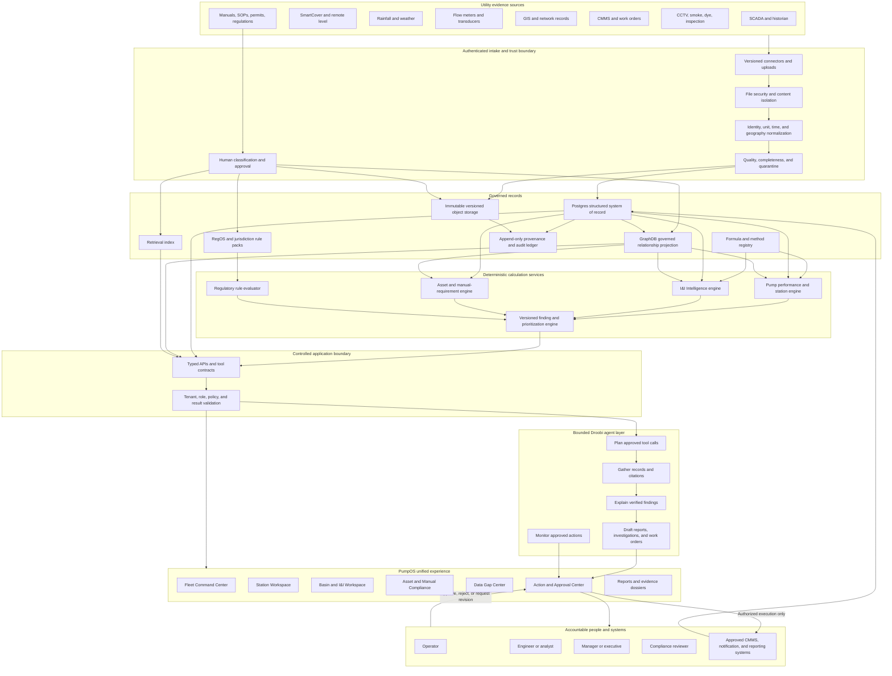

**How to read the diagram:** Start at the top. Evidence enters through controlled intake. Accepted records are stored according to their type. Deterministic engines create reproducible results. Typed APIs expose those results. PumpOS displays them. Droobi can gather and explain them. A person controls consequential action.

**What to notice:** No arrow runs directly from a raw document or language model into an external action. No agent arrow bypasses the deterministic engines to create engineering numbers.

**What this diagram does not prove:** It is a target architecture. It does not claim that every connector, dashboard, engine, review workflow, or AWS control is implemented today.

## 5.2 Executive interpretation

The upper half protects trust. The lower half produces value. If APAS skips the upper half, the agent can produce confident language without a defensible record. If APAS builds only the upper half, it creates a well-governed data platform that still leaves the user to decide what to do.

## 5.3 Developer interpretation

The diagram defines service boundaries and permitted information flow:

- Raw external data enters through adapters.
- Boundary validation occurs before domain execution.
- Structured records and documents have different authorities.
- Graph writes occur through reviewed projection or intake paths.
- Engines do not call an LLM.
- The UI does not recalculate engine outputs.
- Agents call the same typed contracts available to the application.
- External writes require a policy and approval record.

## 5.4 Technical-review interpretation

Every arrow needs a contract containing:

- Producer and consumer
- Schema and semantic version
- Tenant and subject identity
- Authentication and authorization
- Units and time basis
- Idempotency behavior
- Data-quality state
- Provenance
- Failure behavior
- Retry and dead-letter behavior where applicable
- Retention and correction policy
- Observability and service-level objective

---

# 6. Product and bounded-context architecture

## 6.1 Sub-diagram: product map

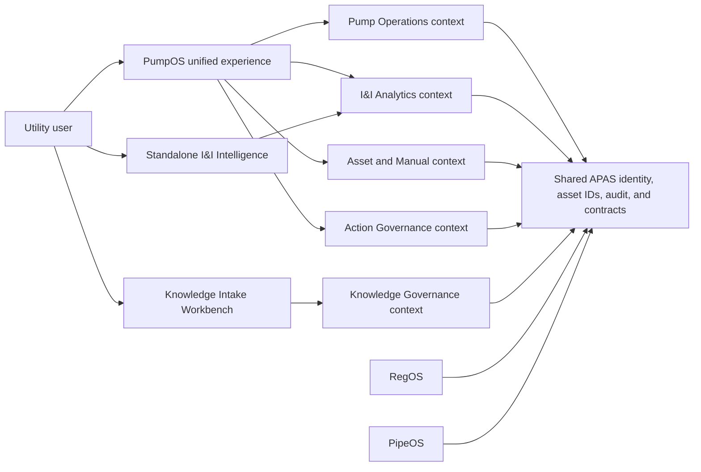

**Plain English:** The user may enter through different doors, but the rooms share the same building rules. PumpOS is the main operating door. I&I can also have its own door. Knowledge administrators use a separate workbench because reviewing documents is not the same job as running a station.

**Developer meaning:** Separate bounded contexts can be packages or services. They must not share database tables casually. They exchange stable identifiers and versioned contracts.

**Value:** APAS can sell, deploy, test, and evolve capabilities independently while still giving the customer one connected experience.

## 6.2 Context ownership matrix

| Context | Owns | Reads | Must not own |
| --- | --- | --- | --- |
| Pump Operations | Live station state, operational settings, pump findings | Asset facts, I&I results, graph topology, regulatory citations | I&I method selection or regulatory source authority |
| I&I Analytics | Events, baselines, RDII models, uncertainty, I&I results | Flow, rainfall, basin, topology, pump consequence | Raw SCADA ownership or work-order execution |
| Asset and Manual | Asset applicability, approved requirements, task schedules, compliance findings | Asset records, documents, completed work | Unreviewed AI extraction as an approved requirement |
| Knowledge Governance | Document intake, classification, entity resolution, review, supersession | Asset registry, ontology, tenant dictionary | Operational readings or calculation authority |
| RegOS | Regulatory sources, applicability, obligation evidence, freshness | Jurisdiction, facility, event facts | Engineering calculations or legal determinations without review |
| Action Governance | Recommendation, draft, approval, dispatch, completion, rejection | Findings, people, downstream systems | Creation of underlying engineering facts |
| Droobi | Tool planning, evidence assembly, explanation, drafting | Approved read tools and permitted action tools | Arithmetic, silent defaults, autonomous facility control |

## 6.3 Why not one application codebase?

A single user interface can call several services. Putting every capability into one codebase creates hidden coupling:

- A manual-parser change can break station operations.
- A dashboard release can force formula revalidation.
- A graph migration can block telemetry ingestion.
- A regulatory content update can require redeploying engineering code.
- A customer wanting only I&I must deploy the whole PumpOS stack.

The target is not maximum service count. The target is clear authority. A modular monolith can be acceptable initially if the boundaries are enforced in code, tests, schemas, and dependency rules.

## 6.4 Minimum deployment shape

For an early implementation, the bounded contexts may be deployed as:

```text
apps/web                  PumpOS user experience
apps/api                  authenticated API gateway and policy
packages/pump-engine      pure pump and station calculations
packages/ii-engine        pure I&I calculations
packages/asset-engine     pure manual and maintenance rules
packages/shared-contracts versioned identifiers and result envelopes
packages/tools            typed agent tools
workers/ingestion         telemetry and document workers
workers/projection        Postgres-to-GraphDB projection
```

The code can later separate into services when scaling, security, release cadence, or product packaging requires it.

---

# 7. The Line Rule and authority model

## 7.1 Sub-diagram: one number from evidence to action

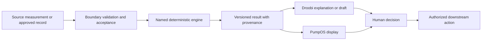

**Plain English:** The number is worked out once, in the controlled engine. The screen displays it. The agent talks about it. The person decides what to do.

**Value:** A regulator, engineer, operator, or auditor can trace a sentence back to the exact calculation and source records.

## 7.2 Authority ladder

| Layer | May do | May not do |
| --- | --- | --- |
| Source adapter | Read and normalize declared source fields | Invent missing values or reinterpret the source |
| Data-quality layer | Accept, reject, quarantine, or qualify a record | Repair a material value without a governed correction |
| Deterministic engine | Apply approved formulas and rules | Choose an unsupported method or call an LLM |
| Finding engine | Evaluate a versioned criterion | Declare legal liability or physical causation without evidence |
| User interface | Display results and collect controlled input | Recalculate values in browser code |
| Agent | Select allowed tools, compare, explain, and draft | Perform hidden arithmetic or bypass policy |
| Human approver | Accept, reject, revise, or dispatch within authority | Change the underlying result without a correction record |
| Downstream system | Execute an approved, authorized action | Treat an unapproved draft as instruction |

## 7.3 Example: storm-related station finding

1. A flow meter reports values every five minutes.
2. The ingestion layer checks units, timestamp order, gaps, range, and meter status.
3. The I&I engine applies an approved dry-weather baseline and event method.
4. The pump engine evaluates the station consequence using accepted pump and wet-well data.
5. The finding engine creates a capacity-exposure finding with method and uncertainty.
6. PumpOS displays the finding.
7. Droobi gathers the calculation, upstream topology, manual limits, open work orders, and regulatory citations.
8. Droobi drafts an investigation plan.
9. An engineer or manager approves, revises, or rejects the draft.
10. The approved plan is sent to the work-order system.
11. Completion evidence returns to PumpOS.

At no point does Droobi create a new rainfall coefficient or change the pump capacity.

---

# 8. Telemetry and operational-data pipeline

## 8.1 Sub-diagram: sensor to finding

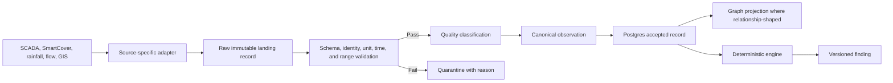

**What to notice:** The raw record is retained. Normalization does not erase what the source sent. Failed data remains visible with a reason.

**What the diagram does not establish:** A passed schema check does not prove field calibration or physical accuracy.

## 8.2 Required adapter contract

Every external adapter should declare:

- Source system and endpoint
- Tenant
- Credential reference
- Pull or push method
- Expected schema and version
- Source identifier mapping
- Unit mapping
- Time-zone and daylight-saving treatment
- Poll or event frequency
- Backfill window
- Idempotency key
- Retry limit
- Late-arrival policy
- Deletion or correction policy
- Quality checks
- Health telemetry
- Owner and support contact

## 8.3 Data-quality states

Recommended states are:

- `accepted`
- `accepted_with_warning`
- `provisional`
- `quarantined`
- `rejected`
- `superseded`
- `missing_expected`

Each state must carry a reason code. “Bad data” is not a sufficient reason.

Example reasons:

- Unit absent
- Timestamp outside allowed window
- Duplicate source event
- Sensor outside calibrated range
- Impossible rate of change
- Stuck value
- Gap exceeds method limit
- Station identity unresolved
- Meter under surcharge or backwater uncertainty
- Source correction received

## 8.4 Why the raw landing record matters

If a connector later maps gallons per minute as gallons per day, APAS must be able to:

1. Locate every affected normalized record.
2. Reproduce what the source originally sent.
3. Correct the mapping.
4. Rebuild affected calculations.
5. Supersede findings.
6. Notify reviewers of materially changed decisions.

Without the raw record, the system may know that a number is wrong but not know how it became wrong.

---

# 9. Knowledge ingestion workbench

## 9.1 Purpose

The Knowledge Intake Workbench is the controlled environment where documents and structured files become searchable, connected, and usable. It should not be the normal PumpOS operating dashboard because its users, risks, and review tasks differ.

Operators may upload or propose content. Knowledge stewards, utility subject-matter experts, engineers, and APAS reviewers govern what becomes an accepted fact, relationship, or executable rule.

## 9.2 Sub-diagram: governed document intake

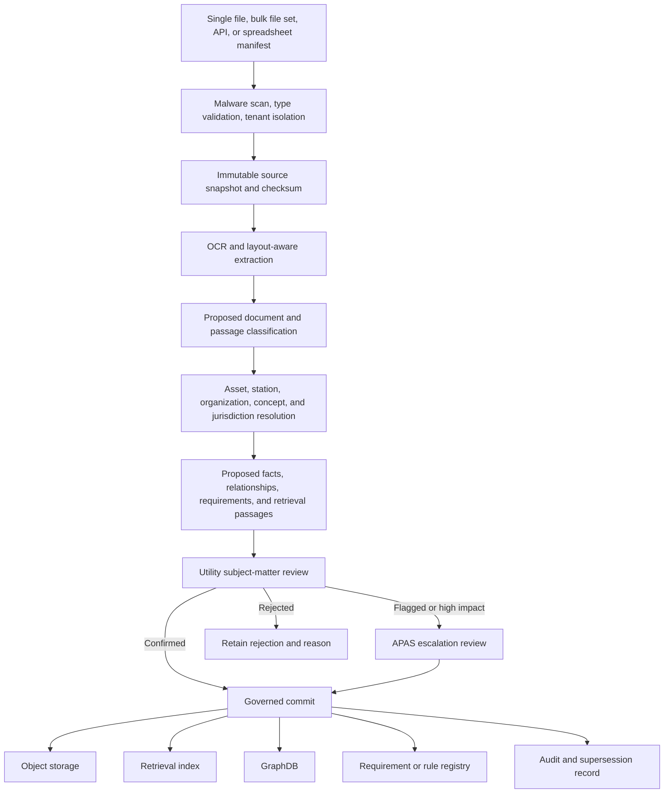

**Plain English:** AI may read and suggest. A qualified person decides what the organization accepts. The original document is always retained.

**Developer meaning:** Extraction objects and approved domain objects must use different schemas and states. A proposed relationship cannot be queried as if it were approved.

## 9.3 Classification model

A single manual or SOP can contain several passage types:

| Passage type | Example | Destination after approval |
| --- | --- | --- |
| Descriptive reference | “The pump uses a double mechanical seal.” | Retrieval index and asset fact |
| Procedure | “Close the isolation valve before removal.” | Procedure registry and retrieval |
| Maintenance requirement | “Inspect every 2,000 operating hours.” | Asset requirement registry |
| Operating limit | “Do not exceed the listed starts per hour.” | Deterministic rule candidate |
| Regulatory obligation | Permit reporting condition | RegOS governed obligation path |
| Definition | Manufacturer definition of a term | Dictionary with source scope |
| Relationship | Manual applies to models X and Y | Graph projection |
| Historical statement | Component replaced on a stated date | Asset history after verification |
| Unverified claim | Handwritten note with unknown author | Retained as unverified evidence |

## 9.4 Review-state machine

```text
uploaded
  -> extracted
  -> classified
  -> linked
  -> proposed
  -> utility_review
      -> approved
      -> rejected
      -> needs_revision
      -> escalated_to_APAS
  -> committed
  -> superseded or withdrawn
```

No state should be represented only by a user-interface label. It needs a stored event, actor, timestamp, version, and reason.

## 9.5 Customer control and APAS governance

The meeting contained both ideas:

- The customer must have the final say over its local facts and procedures.
- APAS must prevent unreviewed or contradictory content from polluting a shared graph.

The resolution is authority by evidence class:

- A utility approves its asset facts, naming, and local procedures.
- APAS administers schemas, quality rules, platform safety, and shared vocabulary.
- A qualified engineer approves extracted engineering requirements when needed.
- RegOS governance approves regulatory classification and applicability records.
- A shared public ontology or definition cannot be changed by one tenant's terminology.

## 9.6 Prompt-injection defense

Documents are untrusted content. A PDF may contain text that tells an AI to ignore its rules, reveal secrets, or perform an external action. All extracted text must enter model context as delimited data, never as instructions. File parsing should run with restricted permissions, no implicit network access, and limits on size, recursion, and embedded objects.

---

# 10. Manuals and executable asset knowledge

## 10.1 The reframe

A manual is not valuable merely because a chatbot can search it. Its deeper value is that it can describe what the utility must inspect, maintain, avoid, record, and verify for a specific asset.

## 10.2 Sub-diagram: manual to action

```mermaid
flowchart LR
    MAN["Versioned manufacturer manual"]
    MODEL["Manufacturer, model, revision, and applicability"]
    PASS["Source passage with page locator"]
    EXTRACT["Proposed requirement extraction"]
    REVIEW["Qualified human review"]
    REQ["Approved requirement object"]
    SCHED["Deterministic due-date or limit evaluation"]
    FIND["Finding when due, overdue, or violated"]
    DRAFT["Agent-drafted work order or explanation"]
    APPROVE["Human approval"]
    COMPLETE["Completion evidence"]
    HISTORY["Asset and warranty history"]

    MAN --> MODEL --> PASS --> EXTRACT --> REVIEW --> REQ --> SCHED --> FIND
    FIND --> DRAFT --> APPROVE --> COMPLETE --> HISTORY
    HISTORY --> SCHED
```

**What to notice:** The requirement includes an exact passage locator and asset applicability. The agent appears only after the deterministic finding.

**What this diagram does not prove:** A manufacturer statement is not automatically applicable to every installation or a substitute for utility procedures and professional judgment.

## 10.3 Approved requirement object

```yaml
requirement_id: stable_identifier
source_document_id: manual_identifier
source_version: manual_revision
source_locator: page_section_table_or_figure
requirement_type: inspection_maintenance_limit_safety_warranty
requirement_text: reviewed_normalized_statement
applies_to:
  manufacturer: value
  model: value
  serial_range: optional
  asset_ids: []
trigger:
  basis: calendar_runtime_starts_condition_event
  interval_or_limit: explicit_value
  unit: explicit_unit
conditions: []
exceptions: []
effective_date: date
review:
  state: approved
  reviewer: accountable_person
  reviewed_at: timestamp
supersession:
  replaces: optional_identifier
  replaced_by: optional_identifier
```

## 10.4 Asset replacement behavior

When a pump or motor is replaced, the system must:

1. End the old asset's active installation interval.
2. Preserve its manual, task, finding, and maintenance history.
3. Resolve the new asset's manufacturer and model.
4. Identify applicable manuals and revisions.
5. Propose a new maintenance schedule.
6. Require review before activating requirements.
7. Re-evaluate pump curves, controls, energy, cycling, and station capacity.
8. Record warranty terms and evidence requirements.

Reusing the old schedule without checking applicability is a data error.

## 10.5 Manual dashboard value

The dashboard converts a file cabinet into operational questions:

- Which installed assets lack an applicable manual?
- Which manuals have been superseded?
- Which required tasks are due or overdue?
- Which task was completed without required evidence?
- Which operating findings conflict with manufacturer limits?
- Which warranty may be exposed?
- Which station cannot be evaluated because model or serial data is missing?

---

# 11. GraphDB, Postgres, retrieval, and object storage

## 11.1 Four stores, four jobs

| Store | Primary job | Example | It must not become |
| --- | --- | --- | --- |
| Postgres | Authoritative structured transactions and state | Station, pump, finding, approval | A free-form document store or uncontrolled graph |
| Object storage | Preserve original files and versions | PDF manual revision C | A query engine for operational relationships |
| Retrieval index | Find relevant passages | Search “maximum starts per hour” | The authority that approves the answer |
| GraphDB | Query governed relationships | Which upstream assets and requirements affect Station B? | A replacement for Postgres or a place for unreviewed triples |

## 11.2 Sub-diagram: projection and query

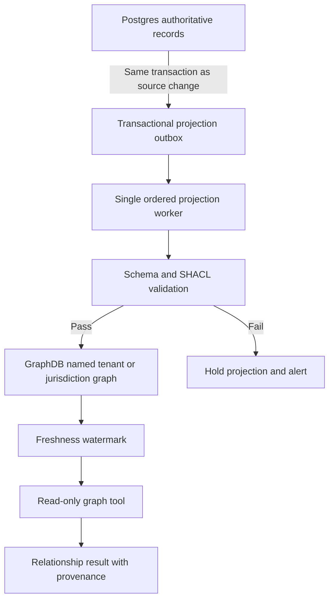

**Plain English:** Postgres keeps the official record. A controlled worker creates a relationship view in GraphDB. A query can use the graph only when the projection is current enough.

**Current PumpOS alignment:** The supplied repository already specifies a transactional outbox, a single projection writer, SHACL validation, read-only SPARQL access, and freshness watermarks [AB-S7, AB-S8].

## 11.3 What GraphDB adds

GraphDB earns its place when the question requires several connected steps:

- Which basins feed a station?
- Which stations feed a downstream facility?
- Which manual applies to the installed pump model?
- Which approved requirement came from that manual revision?
- Which findings affect assets connected to a critical facility?
- Which regulation or procedure applies to this station and action?
- Which term used by this utility maps to the canonical concept?

A relational database can answer many of these questions. GraphDB becomes valuable when relationship depth, changing schemas, shared vocabulary, and cross-domain reasoning are frequent.

## 11.4 Example graph

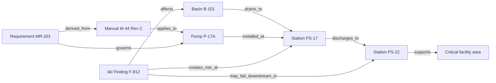

**Reading guide:** Begin with Basin B-101. Its flow reaches PS-17. The installed pump has a specific manual and requirement. PS-17 discharges to PS-22. The I&I finding therefore has an operational path beyond its source basin.

**Truth boundary:** The edge `may_fail_downstream_in` is a governed risk relationship, not proof that a downstream failure will occur.

## 11.5 Vocabulary and dictionary architecture

Internally, the technical schema should separate:

1. OneWater upper ontology
2. PumpOS and I&I domain ontology
3. Canonical concept registry
4. Tenant dictionary
5. Operational instances

Example:

```text
Canonical concept: Wastewater pump station
Preferred public label: Pump station
Accepted synonym: Lift station
Tenant A label: LS
Tenant B legacy label: SPS
Instance: OPA-LS-07
```

A tenant may add a local label without changing the canonical meaning for every other customer.

## 11.6 Graph write policy

Graph writes should come only from:

- The controlled Postgres projection worker
- The governed knowledge-intake commit process
- An approved ontology or vocabulary publication process
- A controlled correction or supersession process

Droobi and ordinary read tools should not write directly to GraphDB.

---

# 12. I&I placement and four-level analytical model

## 12.1 Why I&I sits beside PumpOS, not inside the agent

I&I calculations need:

- Approved methods
- Formula versions
- Unit control
- Event selection
- Calibration
- Uncertainty
- Test vectors
- Numerical policies
- Field validation
- Qualified review

Those are deterministic application responsibilities. An agent can select among approved methods only through a policy tool that checks applicability. It cannot create or modify the mathematics from a prompt.

## 12.2 Sub-diagram: four levels

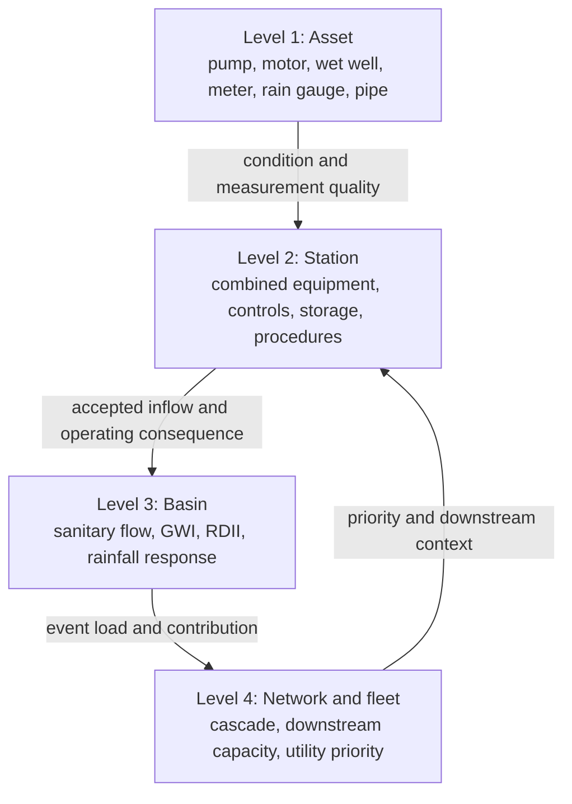

**Plain English:** A bad sensor can distort a station result. A station result affects the basin analysis. A basin response can threaten downstream stations. Fleet priority then changes which station receives attention first.

## 12.3 Level 1: asset

The asset level answers:

- Is the sensor acceptable?
- Does the pump curve exist?
- Is the pump operating inside an allowed region?
- Are start counts, runtime, cycling, or energy abnormal?
- Does the manual impose a limit?
- Is a force-main or wet-well characteristic missing?

Asset evidence prevents an I&I model from treating equipment behavior as rainfall response.

## 12.4 Level 2: station

The station level combines:

- Incoming flow
- Wet-well storage
- Pump availability
- Pump sequence
- Controls
- Power
- Discharge path
- Emergency contingency
- Applicable SOPs
- Manual requirements
- Current findings

The station is an operating boundary. It is not always a basin boundary.

## 12.5 Level 3: basin

The basin level decomposes observed flow:

\[
Q_{\mathrm{observed}}(t)
=
Q_{\mathrm{sanitary}}(t)
+
Q_{\mathrm{GWI}}(t)
+
Q_{\mathrm{RDII}}(t)
+
\epsilon(t)
\]

Where:

- \(Q_{\mathrm{sanitary}}\) is expected residential, commercial, industrial, and institutional wastewater within the declared boundary.
- \(Q_{\mathrm{GWI}}\) is groundwater infiltration under the selected method.
- \(Q_{\mathrm{RDII}}\) is rainfall-derived infiltration and inflow.
- \(\epsilon\) contains measurement error, model error, unrepresented operational effects, and other residuals.

The full definitions, formulas, applicability rules, and worked sample basin remain in the companion I&I technical manual [AB-S3, AB-S5].

## 12.6 Level 4: network and fleet

Fleet analysis asks:

- Which basin contributes the greatest verified wet-weather burden?
- Which station has the least margin under the event?
- Which upstream condition creates downstream exposure?
- Which critical service area is affected?
- Which data gap blocks the highest-value decision?
- Which intervention should receive investigation or capital priority?

The fleet layer may rank findings with a versioned policy. It must preserve the underlying dimensions so a single score does not hide uncertainty, equity, consequence, or regulatory context.

## 12.7 Many-to-many relationships

The model must not assume one basin equals one station.

Required relationships include:

- Basin contains subbasin
- Basin drains to meter
- Basin contributes to station
- Station receives from basin
- Station discharges to station, interceptor, or treatment facility
- Meter observes a boundary
- Flow transfer changes a boundary during a stated interval
- Station serves or affects a critical area

Every relationship should support effective dates because utility configurations change.

---

# 13. I&I calculation lifecycle and result contract

## 13.1 Sub-diagram: approved calculation path

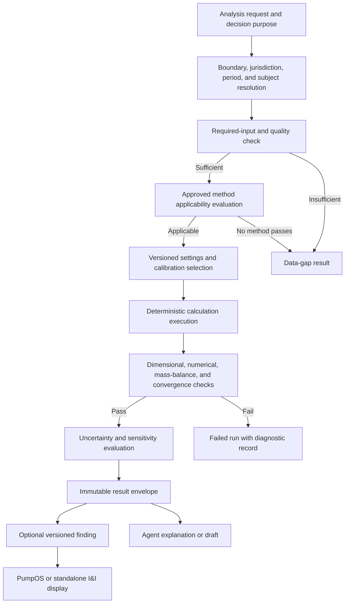

**Plain English:** Before the engine calculates, it confirms what is being analyzed, whether the necessary evidence exists, and whether an approved method fits. A failed or incomplete analysis is still a structured result.

**What to notice:** “Not calculable from the accepted record” is a valid result. It is safer and more useful than a guessed value because it tells the utility what evidence is missing.

## 13.2 Request contract

An analysis request should include:

```yaml
request_id: stable_identifier
tenant_id: utility_identifier
requested_by: actor_identifier
purpose: screening_diagnosis_planning_operations_compliance_support
subject:
  type: asset_station_basin_network
  id: canonical_identifier
period:
  start: timestamp
  end: timestamp
jurisdiction_context:
  geography: identifier
  rule_pack: optional_versioned_identifier
requested_outputs: []
prohibited_uses: []
```

Purpose matters. A method suitable for screening may not be suitable for design, compliance, or capital authorization.

## 13.3 Method-selection behavior

The selector should evaluate:

1. Whether the requested output is measured, calculated, modeled, diagnostic, or compliance-related.
2. Whether the flow, rainfall, asset, boundary, and dry-weather records are sufficient.
3. Whether the analysis is event-based or continuous.
4. Whether the method requires calibration.
5. Whether the calibration applies to the stated basin and conditions.
6. Whether groundwater, tides, canals, or antecedent moisture are material.
7. Whether the period includes operational changes.
8. Whether a local rule pack is active and applicable.
9. Whether uncertainty is adequate for the decision purpose.

The selector itself should be deterministic policy. An agent may request an evaluation and explain the result. It should not override a failed applicability check.

## 13.4 No silent defaults

The system may present a candidate default with source and consequence. It cannot silently apply one for:

- Dry-day definition
- Event separation
- Rainfall window
- Meter-gap treatment
- Time-zone handling
- Basin area
- Pipe inventory
- Groundwater baseline
- RTK parameters
- Roughness
- Pump derating
- Usable wet-well storage
- Discount rate
- Asset life
- Comparison storm
- Confidence level
- Regulatory threshold

An approved configuration can select a default for future runs. The result must retain the configuration version.

## 13.5 Sub-diagram: result and provenance envelope

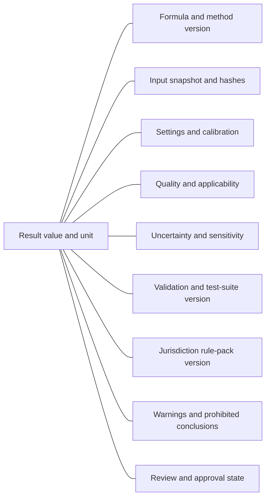

Every displayed engineering number must resolve to this envelope or to a raw accepted observation.

## 13.6 Result schema

```yaml
result_id: stable_unique_identifier
result_version: semantic_version
calculation_run_id: identifier
subject:
  type: basin_station_asset_network
  id: canonical_identifier
analysis_period: {}
method:
  formula_ids: []
  method_id: identifier
  formula_registry_version: version
  code_version: commit_or_release
inputs:
  snapshot_hash: sha256
  records: []
configuration:
  version: identifier
  assumptions: []
  calibration_record: optional_identifier
quality:
  status: accepted_provisional_failed
  applicability_checks: []
  missingness: []
outputs:
  values: []
uncertainty:
  method: identifier_or_unavailable_reason
  interval: optional
  sensitivity: []
validation:
  dimensional: pass_fail
  numerical: pass_fail
  mass_balance: optional
  convergence: optional
  suite_version: identifier
rules:
  jurisdiction_pack: optional_identifier
warnings: []
prohibited_conclusions: []
review:
  state: candidate_verified_approved_superseded
  reviewers: []
created_at: timestamp
supersedes: optional_result_identifier
```

## 13.7 Worked operational example

Illustrative sequence:

- A basin has an accepted rainfall event and flow record.
- The I&I engine calculates an RDII peak of 2,728 gallons per minute using the approved method and configuration from the synthetic sample basin.
- The pump engine evaluates a conservative two-pump operating point of 4,130 gallons per minute.
- The result does not merely state that the station “has capacity.” It records the event, assumed pump availability, maximum static-head case, operating-point solver, uncertainty, and excluded transient and cavitation analyses.
- A contingency screen shows that a derated one-pump case exceeds usable storage.
- PumpOS displays normal-condition margin and contingency shortfall separately.
- Droobi drafts an inspection and contingency-review request.

Transfer boundary: These values belong to the synthetic sample basin in the companion paper. They do not describe an actual Miami-Dade station.

---

# 14. Directed topology without full hydraulic modeling

## 14.1 The intended middle ground

The meeting rejected building a complete hydraulic-modeling platform. It still required PumpOS to understand that one station can affect another.

The minimum capability is a time-aware directed topology graph with operational capacity context.

## 14.2 Sub-diagram: arbitrary station connectivity

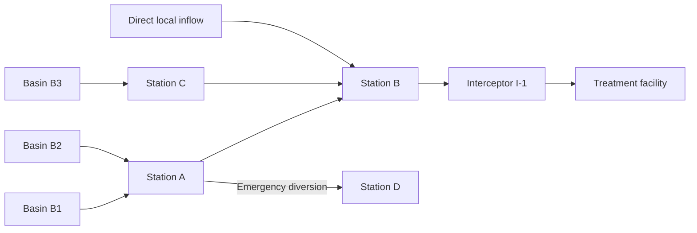

**What to notice:** Station B receives flow from more than one upstream station and from a local basin. Station A also has an emergency diversion. A compass-direction model cannot represent this safely.

**What this diagram does not prove:** The arrows do not calculate pressure, transient behavior, travel time, surcharge, or hydraulic grade line.

## 14.3 Required topology-edge fields

```yaml
edge_id: stable_identifier
from_asset_id: identifier
to_asset_id: identifier
relationship: discharges_to_receives_from_diverts_to_bypasses_to
effective_from: timestamp
effective_to: optional_timestamp
normal_or_contingency: normal_contingency
direction_basis: gis_record_drawing_operator_verified_model
capacity_context: optional_reference
travel_time_context: optional_reference
review_state: proposed_verified_superseded
provenance: []
```

## 14.4 Cascade reasoning

A cascade finding may combine:

- Upstream inflow forecast or measured event
- Upstream pump availability
- Downstream current loading
- Downstream pump availability
- Known local inflows
- Storage and contingency status
- Critical-service consequence
- Data uncertainty

The output should be framed as a risk or dependency finding unless a qualified hydraulic calculation supports a stronger conclusion.

## 14.5 When full hydraulic modeling becomes necessary

PumpOS should integrate with a hydraulic model when the decision requires:

- Pressure or hydraulic grade line
- Surcharge depth and duration
- Dynamic routing
- Travel time
- Force-main interactions
- Transients
- Control optimization
- Overflow volume and location under network dynamics
- Design certification

The architecture should accept versioned model outputs rather than reproduce every modeling capability internally.

---

# 15. Agent design and human authority

## 15.1 What makes the application agentic

A red dashboard tile is not agentic. A fixed alert is not agentic. The application becomes agentic when it can take a verified finding, assemble the right evidence across domains, propose a task plan, use approved tools, produce a reviewable work product, and monitor the approved response.

## 15.2 Sub-diagram: action ladder

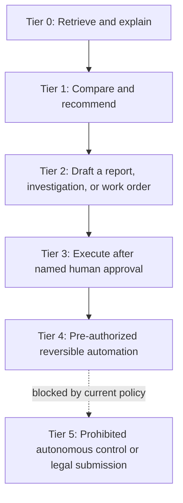

## 15.3 Recommended starting authority

| Tier | Example | Initial policy |
| --- | --- | --- |
| 0 | Explain why a station finding exists and cite its records | Allowed through read-only tools |
| 1 | Recommend checking a flow meter before accepting an event | Allowed, clearly labeled recommendation |
| 2 | Draft a work order or weekly fleet report | Allowed, remains a draft |
| 3 | Send an approved work order to CMMS after a named person approves | Controlled implementation target |
| 4 | Reopen a reversible monitoring task under pre-approved policy | Future, requires separate governance |
| 5 | Change a pump control setpoint, declare compliance, or submit to a regulator independently | Prohibited |

## 15.4 Agent tool categories

Read tools:

- Get fleet overview
- Get station snapshot
- Get I&I result
- Get data gaps
- Get asset and manual requirements
- Get topology
- Search approved documents
- Search applicable regulations
- Get open work orders
- Get calculation lineage

Draft tools:

- Draft investigation
- Draft work order
- Draft management report
- Draft evidence dossier
- Draft data-request checklist

Controlled write tools:

- Submit draft for approval
- Record approval or rejection
- Dispatch approved work order
- Record completion reference

The agent should not have a generic database-write tool, arbitrary URL access, or a tool that executes free-form SQL or SPARQL.

## 15.5 Agent runtime

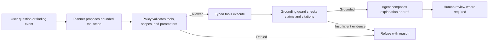

## 15.6 Required rails

1. Typed-tool allowlist
2. Tenant and role enforcement before tool execution
3. Composes, never computes
4. Cite or refuse
5. Drafts, never sends without approved workflow
6. No action on absent material data
7. Prompt-injection isolation
8. Step, time, token, and cost bounds
9. Durable, idempotent jobs for consequential tasks
10. Complete tool-run and approval audit

## 15.7 Agent response structure

An operational answer should separate:

- What was observed
- What was calculated
- What was modeled
- What was inferred
- What requirement or procedure applies
- What is missing
- What is recommended
- What the system is not claiming
- What approval is required

This prevents persuasive prose from collapsing evidence classes into one statement.

---

# 16. PumpOS dashboard information architecture

## 16.1 Sub-diagram: screen hierarchy

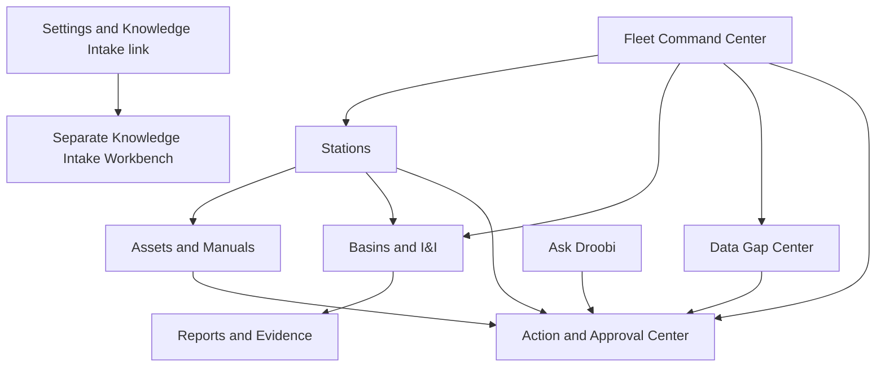

## 16.2 Shared screen contract

Every operational page should show:

- Tenant and current scope
- As-of time
- Data-freshness state
- Calculation or finding version
- Evidence links
- Quality and uncertainty state
- User role
- Allowed actions
- Open approvals
- Last material change

Every engineering result should expose a “Why this number?” control that opens:

- Source records
- Formula or method
- Configuration
- Calculation time
- Quality checks
- Assumptions
- Uncertainty
- Warnings
- Superseded results

## 16.3 Shared visual semantics

- Blue: selected context, information flow, and active analysis
- Amber: caution, missing evidence, or consequence needing attention
- Green: verified favorable or stable state
- Red: critical or blocked state
- Gray: unavailable, inactive, or not applicable

Color must not be the only signal. Every state also needs text and an icon or shape.

## 16.4 Dashboard design rule

The dashboard should not maximize the number of tiles. It should lead the user through:

```text
What needs attention?
  -> What evidence supports it?
  -> What is the consequence?
  -> What can we do?
  -> Who must approve?
  -> Did the action work?
```

---

# 17. Fleet Command Center mockup

## 17.1 Wireframe

```text
┌────────────────────────────────────────────────────────────────────────────────────────────┐
│ PumpOS  | Utility: Example Utility | Fleet | As of 14:05 | Data freshness: 97% current    │
├────────────────────────────────────────────────────────────────────────────────────────────┤
│ FLEET CONDITION                                                                             │
│ [3 Critical] [8 Needs attention] [14 Data gaps] [5 Awaiting approval] [2 Event analyses]   │
├──────────────────────────────────────┬─────────────────────────────────────────────────────┤
│ PRIORITY QUEUE                       │ SYSTEM MAP AND CASCADE                               │
│ 1 PS-22 downstream exposure          │ Basin B1 → PS-17 ─┐                                 │
│   Evidence: event + pump finding     │ Basin B2 → PS-18 ─┼→ PS-22 → Interceptor → Plant    │
│   Action: contingency review         │ Local B4 ─────────┘                                 │
│ 2 PS-17 meter quality failed         │ [Select a station to inspect its dependency path]   │
│ 3 Basin B-101 RDII above baseline    │                                                     │
├──────────────────────────────────────┼─────────────────────────────────────────────────────┤
│ WET-WEATHER AND I&I                  │ ASSET AND MANUAL                                    │
│ Event under analysis: 3              │ 7 assets without applicable manual                  │
│ Basins with increasing response: 4   │ 4 overdue reviewed requirements                     │
│ Analyses blocked by data: 6          │ 2 warranty-risk findings                            │
├──────────────────────────────────────┼─────────────────────────────────────────────────────┤
│ ACTION STATUS                        │ DROOBI                                               │
│ Draft: 4 | Approval: 5 | Sent: 2     │ Ask: "Why is PS-22 first in the queue?"              │
│ Overdue: 3 | Completed this week: 9  │ [Answer must cite findings, topology, and evidence]  │
└──────────────────────────────────────┴─────────────────────────────────────────────────────┘
```

All values and states shown above are illustrative.

## 17.2 Executive reading

The executive sees risk, decision backlog, and system consequence. The page answers whether the organization is acting, not merely whether alarms exist.

## 17.3 Operator reading

The operator sees the current priority queue, affected stations, evidence status, and approved actions. The operator does not need to interpret a utility-wide score without its operational components.

## 17.4 Developer contract

Recommended endpoint:

```text
GET /v1/fleet/snapshot?as_of={timestamp}
```

Response sections:

- Scope and freshness
- Priority findings
- Cascade summaries
- I&I event summaries
- Asset and manual summaries
- Data-gap summaries
- Action-state summaries
- Citation and lineage references

The frontend may sort or filter returned records. It must not calculate risk scores or capacity values.

## 17.5 Value

- Places limited staff on the highest-consequence work
- Reveals whether data gaps are blocking decisions
- Connects basin behavior to station and downstream impact
- Shows whether findings are turning into completed work
- Gives executives an evidence-backed portfolio view

---

# 18. Station Workspace mockup


## 18.1 Wireframe

```text
┌────────────────────────────────────────────────────────────────────────────────────────────┐
│ PS-17 | Status: Needs attention | As of 14:05 | Last accepted reading: 14:00              │
├────────────────────────────────────────────────────────────────────────────────────────────┤
│ OPERATING STATE                                                                             │
│ Wet well 8.2 ft ↑ | Inflow 2,410 gpm | Discharge 2,780 gpm | Pumps 2 of 3 available       │
│ Power normal | Sensor quality: one provisional | Current event: EVT-2026-071               │
├──────────────────────────────────────┬─────────────────────────────────────────────────────┤
│ PUMP PERFORMANCE                     │ I&I AND BASIN CONTEXT                                │
│ P-17A Running | curve status normal  │ Basin B-101 current RDII peak: calculated result    │
│ P-17B Running | efficiency warning   │ Baseline: version DWF-14 | Uncertainty: visible      │
│ P-17C Unavailable | work order open  │ [Open full Basin and I&I Workspace]                 │
├──────────────────────────────────────┼─────────────────────────────────────────────────────┤
│ UPSTREAM AND DOWNSTREAM              │ STORAGE AND CONTINGENCY                              │
│ B-101 → PS-17 → PS-22                │ Normal case: acceptable screen                      │
│ B-104 ────────┘                      │ One-pump derating: shortfall                         │
│ [Show evidence and effective dates]  │ Full outage 30 min: shortfall                        │
├──────────────────────────────────────┼─────────────────────────────────────────────────────┤
│ MANUALS AND MAINTENANCE              │ FINDINGS AND ACTIONS                                 │
│ Applicable manuals: 5                │ 1 critical | 3 caution | 2 data gap                 │
│ Requirements due: 2 | overdue: 1     │ Draft contingency inspection [Review]               │
│ Missing model/serial fields: 1       │ Open work orders: 2 | Completed this month: 4       │
├──────────────────────────────────────┴─────────────────────────────────────────────────────┤
│ WHY THIS NUMBER? [Source] [Formula] [Settings] [Quality] [Uncertainty] [History]           │
└────────────────────────────────────────────────────────────────────────────────────────────┘
```

All values and states shown above are illustrative.

## 18.2 User job

The station page should let an operator or engineer answer:

- What is the station doing now?
- Are the readings trustworthy?
- Which equipment is available?
- Does the current inflow create a normal or contingency problem?
- What is happening upstream and downstream?
- Which procedures or manual requirements matter?
- What action is open, and who owns it?

## 18.3 Developer data aggregation

The Station Workspace is an application composition, not one database query. It may combine:

- Current accepted readings
- Pump and component state
- Latest active findings
- Current station settings
- Latest I&I result
- Topology projection
- Applicable manual requirements
- Data gaps
- Work orders and approvals

The API should return an as-of-consistent snapshot identifier so the page does not mix values from materially different times without showing it.

## 18.4 Value

The station page replaces the hunt across SCADA, spreadsheets, manuals, GIS, and email with one evidence-connected operating context.

---

# 19. Basin and I&I Workspace mockup

## 19.1 Wireframe

```text
┌────────────────────────────────────────────────────────────────────────────────────────────┐
│ Basin B-101 | Event EVT-2026-071 | Method RTK-Approved-v3 | State: Candidate result       │
├────────────────────────────────────────────────────────────────────────────────────────────┤
│ RAINFALL AND FLOW                                                                            │
│ Rainfall hyetograph:       ▁▃▇█▅▂▁                                                           │
│ Observed flow:             ▁▂▃▆█▇▅▃▂▁                                                       │
│ Expected dry weather:      ─────────────                                                    │
│ Estimated RDII:            ▁▁▂▅▇▆▄▂▁                                                        │
│ [Hover or focus to see accepted point, quality, and source]                                │
├──────────────────────────────────────┬─────────────────────────────────────────────────────┤
│ EVENT RESULTS                        │ DATA AND METHOD                                      │
│ Rainfall: 3.2 in                     │ Flow coverage: accepted with warnings                │
│ RDII volume: 1.780 MG                │ Rain gauges: 2 accepted, 1 excluded                  │
│ Peak total flow: 2,728 gpm           │ Dry-weather baseline: DWF-14                         │
│ Capture fraction: 3.2%               │ Calibration: synthetic example only                  │
│ Uncertainty: [visible interval]       │ Formula registry: 0.2.0                             │
├──────────────────────────────────────┼─────────────────────────────────────────────────────┤
│ STATION CONSEQUENCE                  │ COMPARISON                                           │
│ Receiving station: PS-17             │ Similar accepted events: 8                          │
│ Normal firm margin: 33.9%            │ Seasonal baseline: [select]                         │
│ Derated one-pump storage: shortfall  │ Before/after project: [not yet verified]             │
├──────────────────────────────────────┼─────────────────────────────────────────────────────┤
│ DATA GAPS                            │ ACTION                                               │
│ Groundwater record unavailable       │ Draft field investigation                           │
│ Pipe inventory review needed         │ Request meter validation                            │
│ Recession window partially limited   │ Prepare engineering review dossier                  │
├──────────────────────────────────────┴─────────────────────────────────────────────────────┤
│ WHAT THIS ESTABLISHES | WHAT IT DOES NOT ESTABLISH | FULL CALCULATION LINEAGE              │
└────────────────────────────────────────────────────────────────────────────────────────────┘
```

Illustrative values are drawn from the synthetic sample basin and are not an actual utility result.

## 19.2 Required analytical views

- Rainfall and observed-flow overlay
- Dry-weather baseline
- Estimated GWI and RDII components
- Event selection and exclusion
- Hydrograph and integrated volume
- Normalized metrics
- Method and calibration
- Uncertainty and sensitivity
- Station and network consequence
- Event comparison
- Rehabilitation comparison
- Data gaps
- Calculation lineage

## 19.3 Truth labels

Every result should visibly identify whether it is:

- Measured
- Calculated
- Modeled
- Inferred
- Regulatory
- Illustrative
- Unresolved

The UI should never present a modeled reduction as a measured gallon removed.

## 19.4 Value

This workspace gives engineers and managers one reproducible event record. It reduces arguments caused by different spreadsheets, baselines, event windows, units, and hidden assumptions.

---

# 20. Asset and Manual Compliance mockup

## 20.1 Wireframe

```text
┌────────────────────────────────────────────────────────────────────────────────────────────┐
│ Asset P-17A | Pump | Installed at PS-17 | Identity completeness: 92%                     │
├──────────────────────────────────────┬─────────────────────────────────────────────────────┤
│ ASSET IDENTITY                       │ APPLICABLE DOCUMENTS                                │
│ Manufacturer: Example Pump Co.       │ Manual M-44 Rev C | Approved applicable             │
│ Model: X300                          │ Installation bulletin IB-12 | Approved               │
│ Serial: 17A-004                      │ Superseded manual M-44 Rev B | Historical            │
│ Installed: 2022-04-16                │ Utility SOP PS-MAINT-08 | Approved                   │
│ Warranty through: 2027-04-16         │ [Open exact source and applicability review]         │
├──────────────────────────────────────┼─────────────────────────────────────────────────────┤
│ REQUIREMENTS                         │ OPERATING EVIDENCE                                  │
│ Inspect seal every 2,000 runtime hr  │ Runtime since inspection: 1,940 hr                  │
│ Lubricate every 6 months             │ Starts in last hour: 8                              │
│ Max starts per hour: reviewed limit  │ Vibration record: unavailable                       │
│ Minimum submergence: reviewed limit  │ Curve position: within selected envelope            │
├──────────────────────────────────────┼─────────────────────────────────────────────────────┤
│ FINDINGS                             │ WORK HISTORY                                        │
│ Seal inspection due in 60 hr         │ WO-440 completed 2026-05-10                         │
│ Vibration evidence missing           │ WO-319 completed 2025-11-02                         │
│ Warranty evidence at risk: none      │ Evidence attachments: 6                             │
├──────────────────────────────────────┴─────────────────────────────────────────────────────┤
│ [Draft work order] [Request missing data] [Review requirement] [View full history]         │
└────────────────────────────────────────────────────────────────────────────────────────────┘
```

All asset names and values shown above are illustrative.

## 20.2 Required states

Manual applicability:

- Proposed
- Approved
- Rejected
- Superseded
- Withdrawn
- Applicability unknown

Requirement state:

- Upcoming
- Due
- Overdue
- Completed with evidence
- Completed without required evidence
- Not applicable
- Suspended pending review

## 20.3 Value

- Protects asset life
- Reduces missed maintenance
- Preserves warranty evidence
- Connects operating behavior to manufacturer guidance
- Reveals missing asset identity
- Gives the agent trustworthy material for a work-order draft

---

# 21. Data Gap Center mockup

## 21.1 Wireframe

```text
┌────────────────────────────────────────────────────────────────────────────────────────────┐
│ Data Gap Center | 14 active | 6 block calculations | 3 block high-value decisions          │
├────┬──────────────────────────────┬──────────────────────┬───────────────┬──────────────────┤
│ ID │ Missing or unreliable input  │ Consequence          │ Priority      │ Recommended path │
├────┼──────────────────────────────┼──────────────────────┼───────────────┼──────────────────┤
│ 01 │ PS-17 pump curve             │ No operating point   │ High          │ Obtain vendor     │
│ 02 │ B-101 groundwater record     │ GWI uncertainty      │ Medium        │ Add monitoring     │
│ 03 │ Meter calibration expired    │ Event provisional    │ High          │ Field verification │
│ 04 │ P-17C model/serial absent    │ Manual unresolved    │ Medium        │ Asset inspection   │
│ 05 │ B-104 pipe inventory stale   │ Normalization weak   │ Medium        │ GIS reconciliation │
├────┴──────────────────────────────┴──────────────────────┴───────────────┴──────────────────┤
│ Selected gap: formulas affected | accepted substitutes | required frequency | owner | due  │
│ [Draft data request] [Assign investigation] [Mark resolved with evidence]                  │
└────────────────────────────────────────────────────────────────────────────────────────────┘
```

## 21.2 Gap object

```yaml
gap_id: identifier
subject_id: asset_station_basin_or_system
missing_requirement: field_or_evidence_identifier
reason: missing_stale_failed_quality_unresolved_identity
affected_outputs: []
decision_consequence: text
acceptable_sources: []
minimum_frequency: optional
minimum_quality: optional
recommended_acquisition: text
priority_basis: versioned_policy
owner: actor_or_team
status: open_in_progress_resolved_accepted_limitation
resolution_evidence: []
```

## 21.3 Value

The Data Gap Center converts “we cannot calculate this” into a work program. It also creates commercial clarity during onboarding because APAS can state:

- What can be delivered now
- What remains screening-only
- What additional data would improve value
- Which missing item matters most
- What it will take to close the gap

---

# 22. Action and Approval Center mockup

## 22.1 Wireframe

```text
┌────────────────────────────────────────────────────────────────────────────────────────────┐
│ Action Center | Draft 4 | Awaiting approval 5 | Approved 2 | Overdue 3 | Completed 9       │
├────────────────────────────────────────────────────────────────────────────────────────────┤
│ ACTION A-220: PS-17 contingency inspection                                                 │
│ Basis: Finding F-812 + storage screen R-992 + downstream relationship E-77                 │
│ Drafted by: Droobi | Requested by: Operations Manager | Risk: High                         │
│                                                                                            │
│ Proposed steps                                                                             │
│ 1. Verify P-17C unavailability and return-to-service estimate.                             │
│ 2. Confirm wet-well usable storage measurement.                                            │
│ 3. Validate high-flow meter performance.                                                   │
│ 4. Review temporary contingency response with PS-22 operator.                              │
│                                                                                            │
│ Evidence [8] | Assumptions [2] | Missing information [1] | Prohibited conclusions [3]     │
│                                                                                            │
│ [Approve and dispatch] [Request revision] [Reject with reason] [Open calculation lineage] │
├────────────────────────────────────────────────────────────────────────────────────────────┤
│ HISTORY: Drafted → Reviewed → Revised → Awaiting named approver                            │
└────────────────────────────────────────────────────────────────────────────────────────────┘
```

All identifiers and steps shown above are illustrative.

## 22.2 State machine

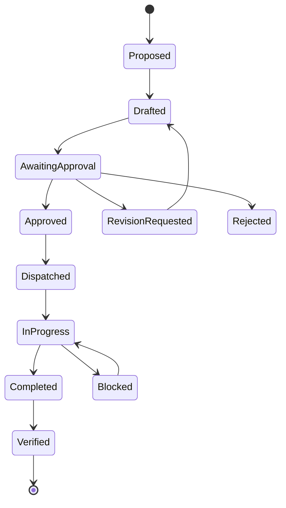

## 22.3 Approval policy fields

- Action type
- Consequence class
- Required role
- Separation-of-duty requirement
- Evidence minimum
- Expiration
- Allowed downstream destination
- Reversible or irreversible
- Required notification
- Completion evidence
- Verification requirement

## 22.4 Value

This screen is where PumpOS becomes more than a dashboard. It shows whether the organization acted, who approved the action, what evidence supported it, and whether the result was verified.

---

# 23. Deployment, security, and trust boundaries

## 23.1 The unresolved infrastructure decision

The supplied PumpOS Constitution pins DigitalOcean plus RunPod. The July 28 meeting described moving PumpOS to AWS and using AWS Secrets Manager. Those positions conflict.

This paper does not silently choose one. It proposes an AWS target pattern because that is the latest owner direction in the meeting, but implementation requires a formal architectural amendment.

## 23.2 Sub-diagram: proposed AWS target

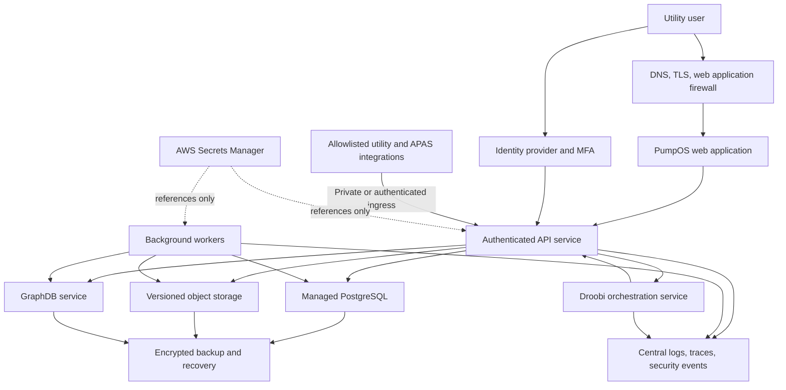

**What to notice:** Secrets are referenced at runtime. They are not stored in source code, documents, tool output, or agent prompts.

**What this diagram does not establish:** It does not select exact AWS services, network topology, regions, availability zones, instance sizes, or disaster-recovery regions.

## 23.3 Tenant isolation

Every operational record and action must be tenant-scoped. Recommended controls:

- Tenant identifier in every authoritative record key
- PostgreSQL row-level security forced for runtime roles
- Runtime roles without `BYPASSRLS`
- Tenant context established from verified identity, not request body
- Tenant-specific object-storage prefixes and policies
- Graph repository, named-graph, or equivalent isolation with explicit architecture review
- Per-tenant encryption and retention policy where required
- Cross-tenant tests that must return zero unauthorized records
- No facility-sensitive data in shared agent evaluation sets

## 23.4 Identity and access

Roles should be capability-based and deny by default.

Illustrative roles:

| Role | Primary access |
| --- | --- |
| Operator | Current operations, acknowledgement, inspections, approved action execution |
| Supervisor | Fleet priority, draft review, task assignment |
| Engineer or analyst | Calculation configuration review, event analysis, model and data-gap review |
| Asset manager | Asset identity, manuals, requirements, maintenance |
| Compliance reviewer | Regulatory evidence, reports, approval within authority |
| Executive | Read-only portfolio, risk, action, and value views |
| Knowledge steward | Intake, classification, dictionary, applicability review |
| APAS administrator | Platform administration without automatic customer factual authority |
| Regulator view | Explicitly scoped read-only access where authorized |

Role labels alone are insufficient. Every API operation must check an explicit capability.

## 23.5 Secrets

The meeting correctly identified environment-held secrets as a migration task. The production contract should require:

- Secrets stored in an approved secrets manager
- Short-lived credentials where possible
- Rotation policy
- Per-environment separation
- No secrets in repository, build artifact, browser bundle, logs, traces, screenshots, or agent context
- Secret-reference validation at boot
- Fail-closed startup for missing production secrets
- Emergency rotation procedure
- Audit of secret access

## 23.6 Network and egress controls

- Databases are not public.
- GraphDB administrative writes are not exposed through read endpoints.
- Agent tools use an allowlisted egress client.
- Callers cannot supply arbitrary URLs.
- Utility connectors use least-privilege credentials.
- Document processors run in isolated workers.
- Production and development networks remain separate.
- Direct model-provider access is controlled and logged.
- Personally identifiable and facility-sensitive content follows the approved model-hosting boundary.

## 23.7 Audit and tamper evidence

Audit events should include:

- Login and role changes
- Source ingestion
- Data rejection and correction
- Formula and configuration changes
- Calculation runs
- Finding creation and supersession
- Document review and graph commit
- Agent tool calls
- Draft creation
- Approval, rejection, dispatch, and completion
- Report generation and send
- Administrative access

Sent artifacts should retain a content hash and immutable evidence snapshot.

## 23.8 Resilience behavior

| Dependency failure | Required behavior |
| --- | --- |
| Postgres unavailable | Operational application fails safely because the system of record is unavailable |
| GraphDB unavailable | Graph-shaped features degrade; Postgres-backed operations may continue with visible limitation |
| Retrieval index unavailable | Document passage search is unavailable; no fabricated citation |
| RegOS unavailable | No regulatory claim or compliance draft requiring its evidence |
| Agent model unavailable | Deterministic dashboards and findings continue; explanation and drafting pause |
| I&I engine unavailable | Pump operations continue; I&I results show last accepted version and freshness |
| Source connector unavailable | Freshness degrades and a data-gap or connector-health finding appears |

---

# 24. Version control and change impact

## 24.1 Why product versioning is not enough

A software version such as “PumpOS 2.4” cannot by itself reproduce an engineering result. Reproduction may depend on:

- Source adapter version
- Input snapshot
- Unit mapping
- Formula registry version
- Calculation code version
- Method version
- Calibration record
- Configuration
- Jurisdiction rule pack
- Graph projection version
- Manual revision
- Agent prompt and model version
- Report template version

## 24.2 Sub-diagram: dependency chain

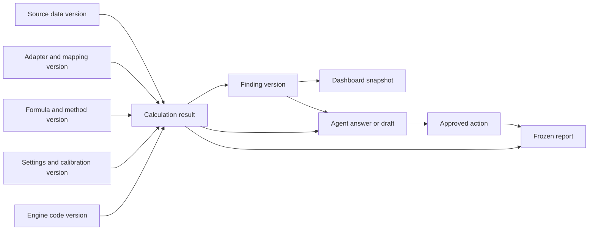

## 24.3 Change-impact rules

### Formula change

Requires:

- Formula registry version increment
- Source and derivation review
- Unit and dimensional tests
- Numerical test rerun
- Golden-basin regression rerun
- Identification of affected prior results
- Decision on recomputation and notification

### Source correction

Requires:

- Preserved original and correction
- New accepted source version
- Recalculation of affected results
- Supersession, never silent mutation, of actioned findings
- Review of reports and actions that relied on the old value

### Manual revision

Requires:

- New document version
- Applicability review
- Difference review against prior requirements
- Activation, retirement, or amendment of affected schedules
- Notification for material requirement changes

### Rule-pack change

Requires:

- Authority, jurisdiction, effective date, and applicability review
- New rule-pack version
- Separation from mathematical formulas
- Re-evaluation of affected findings
- Legal or qualified compliance review where required

### Agent-model change

Requires:

- Grounding and refusal evaluations
- Tool-routing evaluation
- Citation accuracy evaluation
- Prompt-injection evaluation
- Draft-versus-send policy test
- No change to deterministic results

## 24.4 Configuration hierarchy

Recommended precedence:

```text
Universal engine policy
  -> approved method configuration
  -> jurisdiction rule pack
  -> utility configuration
  -> station or basin setting
  -> run-specific approved override
```

Every override must retain who changed it, why, when it became effective, and what results it affects. The agent may propose an override. It does not activate one.

---

# 25. The implementation program

The prior architecture assessment produced eleven workstreams, beginning with Priority 0. They are retained here because each closes a different failure mode. The order matters.

## 25.1 Program view

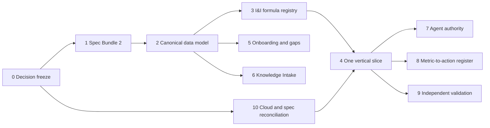

## 25.2 Workstream 0: Freeze the architectural decisions

### Purpose

Convert meeting language into explicit decisions before several developers implement different meanings.

### Required decisions

1. I&I ownership and commercial packaging
2. PumpOS experience boundary
3. Knowledge Intake Workbench boundary
4. Postgres, GraphDB, object-store, and retrieval authority
5. Agent autonomy
6. Vocabulary and ontology ownership
7. AWS versus DigitalOcean plus RunPod
8. RegOS and jurisdiction-rule ownership

### Deliverables

- Architecture Decision Records
- PumpOS Constitution amendment
- Updated phase boundary
- Named owners
- Effective date
- Superseded decisions

### Acceptance criteria

- No open contradiction among Constitution, PRD, Solution Architecture, Engineering Specification, and this Bible.
- Every bounded context has one accountable owner.
- Deployment target is explicit.
- I&I phase and product status are explicit.

### Why first

A well-written interface cannot protect a system whose ownership is disputed. Decision freeze prevents architecture by accident.

## 25.3 Workstream 1: Create PumpOS Specification Bundle No. 2

### Purpose

Translate the target architecture into contracts developers can implement and test.

### Required contents

- Product capability map
- Context diagram
- Container and service diagram
- Data-flow diagrams
- Deployment diagram
- Trust-boundary diagram
- Interface catalog
- Event catalog
- Ownership matrix
- I&I integration contract
- Knowledge-ingestion contract
- Dashboard information architecture
- Nonfunctional requirements
- Migration plan
- Test and acceptance matrix

### Acceptance criteria

- Every diagram has corresponding contracts.
- Every service has inputs, outputs, failure behavior, and owner.
- Every proposed write path has authorization and audit.
- Existing PumpOS interfaces are marked retained, amended, or superseded.

### Why

The Bible explains the system. The specification bundle turns the explanation into build authority.

## 25.4 Workstream 2: Establish the canonical data model

### Purpose

Create one shared identity and vocabulary across PumpOS, I&I Intelligence, PipeOS, RegOS, Knowledge Intake, and downstream systems.

### Required core entities

- Organization and tenant
- User, role, and capability
- Service area
- Basin and subbasin
- Station
- Pump, motor, wet well, sensor, meter, rain gauge
- Gravity sewer, force main, interceptor, connection
- Observation and quality record
- Rainfall event
- Calculation request, run, and result
- Finding
- Document, passage, manual, and requirement
- Procedure and regulatory obligation
- Data gap
- Recommendation, draft, approval, action, and work order

### Required controls

- Stable identifier
- Tenant ownership
- Effective time
- Source provenance
- Version
- Review state
- Supersession
- Privacy classification

### Acceptance criteria

- One station keeps the same canonical identifier across all bounded contexts.
- Many-to-many basin and station relationships are supported.
- Asset replacement preserves historical identity.
- Every calculation subject resolves to an approved entity and boundary.

### Why

Without shared identity, the agent can retrieve correct facts about the wrong station.

## 25.5 Workstream 3: Create and govern the I&I Formula Registry

### Purpose

Make the formula registry the machine-readable authority for every calculation available to the application.

### Required fields for each method

- Stable formula identifier
- Name and purpose
- Equation
- Symbol definitions
- Units and dimensional signature
- Required and optional inputs
- Applicability checks
- Assumptions
- Boundary conditions
- Failure conditions
- Uncertainty method
- Sources and derivation
- Test vectors
- Implementation reference
- Review and production status
- Deprecation and supersession

### Required tests

- Unit conversion
- Dimensional consistency
- Hand-calculated vectors
- Invalid-domain vectors
- Mass balance
- Solver convergence
- Golden sample basin
- Independent implementation
- Field calibration and holdout
- Qualified engineering review

### Acceptance criteria

- No production tool can call a formula lacking production status.
- Same input snapshot and version produce the same result.
- A changed formula invalidates and reruns dependent tests.
- Every result resolves to formula and source records.

### Why

The agentic application is only as trustworthy as the engine it calls.

## 25.6 Workstream 4: Build one complete vertical slice

### Purpose

Prove the full chain with one basin and one station before scaling.

### Slice scope

1. Ingest station, asset, rainfall, and flow data.
2. Ingest one applicable manual and one SOP.
3. Establish station and basin topology.
4. Establish dry-weather baseline.
5. Analyze one accepted wet-weather event.
6. Produce I&I results and uncertainty.
7. Evaluate pump and storage consequence.
8. Create one deterministic finding.
9. Display it in PumpOS.
10. Have Droobi explain it with citations.
11. Draft an investigation or work order.
12. Require approval.
13. Record completion and verification.

### Acceptance criteria

- Every dashboard number is traceable.
- Missing data creates a gap, not a default.
- The UI performs no engineering arithmetic.
- Droobi refuses unsupported conclusions.
- An approved action carries the evidence snapshot.
- Re-running the slice produces the same deterministic outputs.

### Why

Scaling incomplete contracts multiplies defects. One vertical slice exposes boundary mistakes early.

## 25.7 Workstream 5: Build onboarding and data-gap assessment

### Purpose

Turn customer onboarding into a structured analysis of what value can be delivered and what evidence is missing.

### Questionnaire domains

- Utility and jurisdiction
- Stations and basins
- Asset inventory
- SCADA and historian
- Flow monitoring
- Rainfall monitoring
- Groundwater and tidal context
- GIS and topology
- Pump curves and controls
- Manuals and procedures
- Work-order history
- Inspections and field testing
- Regulatory documents
- Data access and cybersecurity
- Time coverage, frequency, units, and quality

### Output

- Available capabilities now
- Screening-only capabilities
- Blocked calculations
- Required data
- Recommended acquisition
- Priority and consequence
- Connector plan
- Customer responsibilities
- APAS responsibilities

### Acceptance criteria

- Every question maps to a calculation, dashboard, rule, or governance need.
- The system can state why a requested field matters.
- Data gaps are imported directly into the Data Gap Center.

### Why

Onboarding becomes an evidence-based delivery plan instead of a generic data request.

## 25.8 Workstream 6: Implement the Knowledge Intake Workbench

### Purpose

Create a secure, reviewable path from files to approved knowledge.

### Minimum viable capability

- Single and bulk upload
- Spreadsheet manifest
- Checksum and immutable snapshot
- OCR and structured extraction
- Classification
- Entity and asset resolution
- Passage-level proposals
- Utility review
- APAS escalation
- Approval, rejection, and revision
- Commit to object store, retrieval, graph, or requirement registry
- Version and supersession
- Audit

### Acceptance criteria

- Unapproved proposals cannot appear as approved PumpOS knowledge.
- Every approved statement resolves to its source passage.
- A superseded document does not silently remain active.
- Tenant content cannot enter another tenant's graph or retrieval results.
- Prompt-injection tests pass.

### Why

GraphDB value depends on governed relationships. An ingestion shortcut can turn the graph into a faster source of wrong answers.

## 25.9 Workstream 7: Define and implement agent autonomy tiers

### Purpose

Make “agentic” concrete without granting uncontrolled authority.

### Deliverables

- Tool registry
- Role and capability matrix
- Action-tier policy
- Approval rules
- Draft and dispatch states
- Grounding guard
- Refusal taxonomy
- Prompt-injection controls
- Agent evaluation suite
- Incident and rollback procedure

### Acceptance criteria

- An agent cannot compute an engineering number.
- An agent cannot access a tool outside its role and tenant.
- A missing citation blocks a regulatory claim.
- A draft cannot be mistaken for a sent artifact.
- An external write requires an approval record when policy requires it.

### Why

Agent behavior must be enforced by software and policy, not by a sentence in a prompt.

## 25.10 Workstream 8: Create the Metric-to-Value-to-Action Register

### Purpose

Ensure every dashboard value supports a named decision and response.

### Required fields

```yaml
metric_id: identifier
name: plain_name
source_or_formula: identifier
user_roles: []
decision_supported: text
consequence: text
comparison_basis: identifier
threshold_basis: optional_identifier
evidence_required: []
recommended_actions: []
approval_required: role_or_none
downstream_workflow: identifier
value_hypothesis: text
prohibited_inferences: []
```

### Acceptance criteria

- Every production dashboard metric has a register entry.
- A metric without decision value is removed or justified.
- A threshold resolves to engineering, manufacturer, utility, or regulatory authority.
- Action conversion can be measured.

### Why

This is the defense against becoming a “dumb dashboard.”

## 25.11 Workstream 9: Validate independently

### Purpose

Test whether the architecture and calculations work outside the team that built them.

### Review tracks

1. Wastewater and I&I engineering
2. Pump and station operations
3. Software numerical methods
4. Data architecture and quality
5. Security and tenant isolation
6. Graph and knowledge governance
7. Regulatory applicability
8. Utility practitioner usability
9. Executive decision value

### Evidence

- Independent hand calculations
- Alternative implementation comparison
- Synthetic boundary cases
- Historical storm events
- Field observations
- Calibration and holdout events
- Before-and-after rehabilitation data
- Failure and refusal tests
- Cross-tenant security tests
- Disaster-recovery exercise

### Acceptance criteria

- Material defects are logged and resolved or accepted with visible limits.
- Qualified reviewers sign the exact versions reviewed.
- Production status remains blocked until all named gates pass.

### Why

Correct code can implement the wrong method perfectly. Independent review tests method, data, implementation, and operational transfer.

## 25.12 Workstream 10: Reconcile cloud and repository specifications

### Purpose

Make the deployment system match the approved architecture and remove the current AWS versus DigitalOcean conflict.

### Required decisions and work

- Approved cloud target
- Environment model
- Network and trust boundaries
- Managed database selection
- GraphDB deployment
- Object storage
- Secrets management
- Identity and access management
- Backup and disaster recovery
- Observability
- Container build and image provenance
- Deployment promotion
- Rollback
- Data migration
- Security review

### Acceptance criteria

- Constitution, Engineering Specification, infrastructure code, and deployed environment agree.
- Secrets are not held in source-controlled environment files.
- Production has no developer signer or public datastore.
- Restore and rollback are tested.
- Deployment identifies exact application and schema versions.

### Why

Infrastructure drift can invalidate security assumptions, support procedures, recovery plans, and system diagrams.

---

# 26. Acceptance tests and definition of done

## 26.1 Architecture acceptance

- PumpOS, I&I Intelligence, Knowledge Intake, RegOS, and Droobi have explicit boundaries.
- Each authoritative record type has one system of record.
- Every interface has a versioned contract.
- No undocumented direct database or graph access crosses a boundary.
- Current-state and target-state diagrams are not confused.

## 26.2 Calculation acceptance

- Every output resolves to the formula registry.
- Units and dimensions pass.
- Invalid domains fail closed.
- Mass and volume balances close where applicable.
- Iterative solvers record tolerance, iterations, and residual.
- Display rounding never feeds calculations.
- Independent implementation and qualified review pass before production.

## 26.3 Data acceptance

- Source identity is resolved.
- Raw records are preserved.
- Accepted and quarantined records remain distinct.
- Corrections create versions and recomputation.
- Tenant-isolation tests pass.
- Data gaps have reason, consequence, owner, and resolution path.

## 26.4 Knowledge acceptance

- Original documents are checksummed and versioned.
- Every approved extracted statement has an exact locator.
- Proposed and approved states are technically separate.
- Supersession works.
- Tenant dictionaries do not alter the shared upper model automatically.
- Graph queries expose provenance and freshness.

## 26.5 Agent acceptance

- Typed tools only
- No arithmetic in agent code or prompt
- Grounded citations
- Refusal on insufficient evidence
- No cross-tenant retrieval
- Draft and sent states distinct
- Approval required for consequential writes
- Prompt-injection suite passes
- Model change evaluation passes

## 26.6 Dashboard acceptance

- Every displayed value is raw accepted data or a versioned engine result.
- Every value has as-of and quality state.
- Every engineering result has lineage.
- Every threshold has a basis.
- Missing data is visible.
- Keyboard, touch, screen-reader, phone, tablet, desktop, reduced-motion, and high-zoom reviews pass.

## 26.7 Operational acceptance

- Connector outage is visible.
- Graph outage degrades safely.
- Model outage does not stop deterministic operations.
- Backup restore is tested.
- Audit events are complete.
- On-call and incident procedures exist.
- Action completion can return to the system.

## 26.8 Definition of done for the first vertical slice

The slice is complete only when one basin and station can be followed through:

```text
source evidence
  -> accepted record
  -> calculation
  -> finding
  -> dashboard
  -> agent explanation
  -> draft
  -> human approval
  -> downstream action
  -> completion evidence
  -> verified outcome
```

All eleven transitions must be observable and reproducible.

---

# 27. Risks, contradictions, and required decisions

## 27.1 Architecture risks

### Monolith risk

If PumpOS owns every parser, formula, graph write, regulatory rule, and agent, releases become coupled and validation becomes expensive.

**Response:** Enforce bounded contexts even if the initial deployment is a modular monolith.

### Fragmentation risk

If every APAS product builds its own station identifiers, dictionary, retrieval index, and agent rules, the original problem returns inside APAS.

**Response:** Shared contracts, stable IDs, vocabulary governance, identity, and audit services.

### Graph pollution risk

Unreviewed AI extraction can create plausible but false relationships.

**Response:** Proposal states, human review, exact provenance, SHACL validation, and controlled write paths.

### Dashboard-without-action risk

The product can accumulate visual metrics without changing utility work.

**Response:** Metric-to-Value-to-Action Register and Action Center.

### Agent-overreach risk

An impressive model may produce engineering or regulatory language beyond the evidence.

**Response:** Tool rails, evidence-class labels, cite-or-refuse, action tiers, and human authority.

## 27.2 I&I technical risks

### Night-flow oversimplification

Minimum nighttime flow can contain real sanitary, industrial, storage, and operational effects.

**Response:** Use an approved baseline method with allowances, uncertainty, and applicability checks. Do not label all night flow as I&I.

### Universal-threshold error

A local consent-decree or program criterion can be copied into a national product.

**Response:** Separate universal mathematics from versioned jurisdiction rule packs.

### One-basin-one-station assumption

Real collection systems may have nested, overlapping, transferred, or many-to-many service boundaries.

**Response:** Time-aware relationship model and explicit control volumes.

### Screening-to-design overreach

A normalized rate or simple capacity margin can be treated as design certification.

**Response:** Result-purpose labels and prohibited conclusions.

### Model-without-field-evidence risk

A hydrograph response can be treated as proof of a defect.

**Response:** Keep modeled, diagnostic, and measured claims separate.

## 27.3 Immediate decisions required from APAS

| Decision | Why it cannot remain implicit |
| --- | --- |
| Is AWS the ratified PumpOS target? | Infrastructure code, security, cost, deployment, and recovery depend on it. |
| Is I&I activated now or still hibernated? | Team scope, branch planning, product ownership, and interfaces depend on it. |
| Does I&I live in PumpOS code or an APAS analytical service? | Validation and reuse depend on the ownership line. |
| Who commits private knowledge to GraphDB? | Customer authority and graph integrity depend on it. |
| Who owns ontology 5.4 and the dictionary? | Cross-product semantic consistency depends on it. |
| Which agent actions can execute after approval? | Tool design and legal authority depend on it. |
| What is the first real vertical-slice basin and station? | Field validation and data-access work need a concrete target. |

---

# 28. Value model by role

## 28.1 Executive

The executive gains:

- Fleet-level risk and action status
- Evidence-backed capital and staffing priorities
- Visibility into unresolved data and maintenance debt
- Connection between station condition and downstream consequence
- Proof that findings become completed work
- Reproducible reports instead of slide-specific numbers

## 28.2 Operator

The operator gains:

- One current station context
- Visible data quality
- Applicable procedures and manuals
- Clear current action and approval status
- Reduced search across systems
- Better shift handoff and institutional memory

## 28.3 Engineer and I&I analyst

The engineer gains:

- Controlled baselines and events
- Versioned methods
- Reproducible calculations
- Explicit uncertainty
- Calculation lineage
- Pump and storage consequence in the same record
- Easier review and comparison

## 28.4 Asset manager

The asset manager gains:

- Manual applicability
- Reviewed maintenance requirements
- Due and overdue tasks
- Warranty evidence
- Operating-limit findings
- Asset replacement and history continuity

## 28.5 Compliance reviewer

The compliance reviewer gains:

- Regulatory sources separated from engineering thresholds
- Applicable rule-pack versions
- Evidence-linked drafts
- Human review control
- Frozen report content
- Clear distinction between a finding and a legal determination

## 28.6 Information-technology and security team

The team gains:

- Explicit data ownership
- Tenant isolation
- Controlled connectors
- Secrets management
- Auditability
- Bounded model access
- Defined failure and recovery behavior

## 28.7 APAS product and commercial team

APAS gains:

- Reusable I&I service across products
- Clear standalone and embedded packaging
- Onboarding based on data readiness
- Visible service opportunities
- Defensible product claims
- Reduced customization through shared contracts

---

# 29. Glossary and acronyms

## 29.1 Acronyms

| Acronym | Expansion | Meaning in this paper |
| --- | --- | --- |
| API | Application Programming Interface | Controlled software contract between systems |
| APAS | APAS.AI | Product and operating organization |
| AWS | Amazon Web Services | Proposed cloud target requiring ratification |
| BWF | Base Wastewater Flow | Expected sanitary and process wastewater before I&I components |
| CCTV | Closed-Circuit Television | Sewer inspection video |
| CMMS | Computerized Maintenance Management System | Work-order and maintenance system |
| DQ | Data Quality | Fitness, completeness, and trust state of data |
| DWF | Dry-Weather Flow | Flow during accepted dry-weather conditions |
| GIS | Geographic Information System | Spatial asset and network information system |
| GWI | Groundwater Infiltration | Groundwater entering the sewer system |
| HITL | Human in the Loop | Required human review or approval |
| I&I | Infiltration and Inflow | Unwanted groundwater and storm-related water entering sanitary sewers |
| IAM | Identity and Access Management | User, service, role, and permission controls |
| LLM | Large Language Model | Language model used by an agent for planning and composition |
| MCP | Model Context Protocol | Typed tool interface pattern used by agents |
| MFA | Multi-Factor Authentication | Login requiring more than one proof |
| NAPOT | Nominal Average Pump Operating Time | Local consent-decree pump operating-time concept used in the companion case |
| OCR | Optical Character Recognition | Conversion of scanned image text into machine-readable text |
| OIDC | OpenID Connect | Identity protocol |
| PRD | Product Requirements Document | Product scope and expected behavior |
| RDII | Rainfall-Derived Infiltration and Inflow | Rainfall-related flow above expected dry-weather response |
| RLS | Row-Level Security | Database policy restricting records by tenant and role |
| RTK | R, T, and K parameters | Unit-hydrograph parameters used in an RDII method |
| SCADA | Supervisory Control and Data Acquisition | Operational monitoring and control system |
| SHACL | Shapes Constraint Language | Graph-data validation rules |
| SOP | Standard Operating Procedure | Approved organization-specific procedure |
| SPARQL | SPARQL Protocol and RDF Query Language | Query language used with GraphDB |
| SSO | Sanitary Sewer Overflow | Release of untreated wastewater from a sanitary sewer |
| VFD | Variable-Frequency Drive | Motor-control equipment that changes speed |

## 29.2 Glossary

**Accepted record:** A source record that passed the defined boundary and quality checks for a stated use.

**Action:** A governed task or external operation created from an approved recommendation or decision.

**Agent:** Software that plans and performs bounded tool use, gathers evidence, and composes language. It is not the calculation authority.

**Applicability check:** A deterministic test of whether a method, rule, manual, or requirement fits the subject and decision.

**Approval:** A recorded decision by an authorized person to accept, reject, revise, or dispatch a draft.

**As-of time:** The time through which a view or result claims its underlying records are current.

**Asset:** A physical component such as a pump, motor, wet well, sensor, meter, pipe, or station.

**Audit ledger:** Append-only history of important data, calculation, review, agent, and action events.

**Baseline:** The accepted comparison condition used to identify change or residual flow.

**Basin:** A declared service area contributing wastewater to one or more collection-system boundaries.

**Bounded context:** A defined product or software responsibility with its own rules and vocabulary.

**Calculation lineage:** The complete path from a result through formulas, versions, inputs, assumptions, configuration, and sources.

**Canonical identifier:** A stable identifier shared across authorized systems.

**Canonical concept registry:** Governed list of preferred terms, synonyms, meanings, relationships, and versions.

**Cascade risk:** The possibility that a condition at one asset or station contributes to a downstream consequence.

**Configuration:** Versioned settings selected for a calculation or operating rule.

**Control volume:** The physical and time boundary around which flows or quantities are accounted.

**Data gap:** A structured record of missing, stale, unreliable, or unresolved evidence and its consequence.

**Decision Twin:** A connected decision-support representation that joins asset condition, context, rules, consequence, and available response.

**Deterministic engine:** Tested calculation software that repeats the same result for the same accepted inputs and versions.

**Effective time:** The interval during which a fact, relationship, requirement, or configuration applies.

**Evidence class:** Label distinguishing measured, calculated, modeled, inferred, regulatory, illustrative, and unresolved statements.

**Finding:** A versioned result of applying a named rule or analytical criterion to accepted evidence.

**Formula registry:** Machine-readable authority for formulas, methods, units, applicability, tests, sources, and review status.

**Graph projection:** Relationship representation generated from an authoritative record without replacing that authority.

**Grounding:** Requirement that an agent statement resolve to approved evidence or explicitly state that evidence is insufficient.

**Human in the Loop:** Human review placed at a point where authority or consequence requires it.

**Immutable:** Preserved so the original content is not silently changed.

**Infiltration:** Groundwater entering a sanitary sewer through defects or openings.

**Inflow:** Water entering more directly through connections such as drains, cross-connections, or submerged openings.

**Jurisdiction rule pack:** Versioned set of location- and instrument-specific criteria kept separate from universal mathematics.

**Knowledge Intake Workbench:** Administrative application for document upload, classification, review, approval, and governed commit.

**Knowledge graph:** Relationship store connecting identified assets, places, documents, requirements, findings, and other concepts.

**Line Rule:** PumpOS rule that the engine computes, the agent composes, the API is the bridge, and numbers are not recalculated outside the engine.

**Manual applicability:** Reviewed relationship showing that a specific document revision applies to a specific asset, model, or serial range.

**Method:** Defined analytical procedure that may contain several formulas, settings, and applicability conditions.

**Modeled result:** Output from a model under stated calibration and assumptions, distinct from a direct measurement.

**Object storage:** File store used to preserve original documents and versions.

**Postgres:** Relational database used as the PumpOS structured system of record.

**Provenance:** Evidence of where a record or statement came from, how it changed, and who reviewed it.

**Quarantine:** Controlled state preventing a failed or questionable record from entering an accepted calculation path.

**Recommendation:** Agent or human proposal that has not yet become an approved action.

**Retrieval index:** Search structure that locates relevant passages but does not approve their meaning.

**Risk score:** Versioned prioritization output. It does not replace its underlying dimensions or establish legal liability.

**Rule:** Deterministic condition that evaluates accepted facts and creates a state or finding.

**Source snapshot:** Preserved copy of the exact source used in a record or extraction.

**Supersession:** Replacement of a record while retaining the prior version and its history.

**Tenant:** A utility or organization whose data and access remain isolated from others.

**Topology:** Directed relationship model showing how basins, stations, pipes, and facilities connect.

**Typed tool:** Agent-callable function with a fixed schema, authorization, and result contract.

**Uncertainty:** Quantified or explicitly unavailable description of the range or confidence around a result.

**Versioned result:** Result that retains the precise input, formula, code, method, configuration, and rule versions needed for reproduction.

---

# 30. Source and evidence map

| Source | Use in this Bible | Evidence class |
| --- | --- | --- |
| AB-S1, July 28 meeting transcript | Owner vision, AWS direction, ingestion workflow, I&I placement discussion, dashboards, manuals, GraphDB, ontology, agent action | Hardeep position, team statement, unresolved question |
| AB-S2, PumpOS repository archive | Current code and specification inventory | Point-in-time repository evidence |
| AB-S3, I&I technical paper | I&I concepts, sample basin, calculation boundaries, result restrictions | Candidate technical research |
| AB-S4, agent contract | Fail-closed agent and calculation behavior | Internal architecture draft |
| AB-S5, formula registry | Calculation authority and formula-version model | Candidate machine-readable registry |
| AB-S6, PumpOS Constitution | Current Line Rule, phase boundary, pinned architecture, amendment rule | Ratified internal product standard at archive date |
| AB-S7, PumpOS architecture and engineering specification | Current layers, stores, GraphDB projection, Droobi, security, deployment | Internal product specification |
| AB-S8, PumpOS status and traceability | Point-in-time implementation and data-flow claims | Internal status evidence requiring active-branch confirmation |
| AB-S9, current owner direction | Required depth, audience, diagrams, dashboards, repository delivery | Owner direction |

## 30.1 Claim boundaries

- Current-state statements resolve to the supplied PumpOS archive.
- Meeting directions are identified as positions or proposed changes.
- Target architecture is a recommendation until ratified.
- All numerical I&I methods remain governed by the companion manual and formula registry.
- Regulatory application remains governed by RegOS and jurisdiction rule packs.
- Production status is blocked until independent and qualified review.

## 30.2 Unresolved verification

- Active PumpOS branch and deployed AWS state have not been independently inspected.
- The AWS migration has not been reconciled with the ratified PumpOS Constitution.
- GraphDB and ontology 5.4 runtime status require confirmation.
- Knowledge Intake security and reliability require implementation review.
- I&I formulas require the reviews listed in the companion QA record.
- Dashboard wireframes require operator, executive, accessibility, and usability review.

---

# 31. Current white-paper score

| Dimension | Available | Awarded | Evidence for points awarded | Deduction and next work |
| --- | ---: | ---: | --- | --- |
| Teaching thesis and importance | 15 | 15 | The paper states the product decision, problem, consequence, audience, and intended change. | None for the candidate argument. |
| Complete plain-language explanation | 20 | 19 | Core concepts, every architecture layer, pipelines, dashboards, implementation workstreams, glossary, and examples are explained. | Independent novice-reader review remains unresolved. |
| Utility-wide and cross-sector value | 15 | 14 | Value is explained for executives, operators, engineers, asset managers, compliance, IT, APAS, fleet, station, basin, and network. | Transfer to PipeOS and other APAS products needs product-owner review. |
| Research depth and source quality | 15 | 10 | Complete meeting transcript, PumpOS archive, I&I manual, agent contract, and formula registry are identified and bounded. | Active branch, live deployment, and independent external architecture references were not verified in this internal reconstruction. |
| Technical accuracy and claim verification | 20 | 11 | Current and target states are separated; formula claims delegate to governed sources; technical corrections and failure boundaries are visible. | Qualified software, security, graph, wastewater, regulatory, and practitioner reviews are unresolved. |
| Diagrams and visual teaching value | 10 | 10 | Twenty-two registered diagrams, flows, state models, and dashboard wireframes carry reading guides and truth boundaries. | Rendered visual-design review remains unresolved. |
| Editorial quality, boundaries, and originality | 5 | 4 | Scope, evidence classes, unresolved questions, glossary, version control, and production prohibition are explicit. | Independent editorial and originality review remain unresolved. |
| **Total** | **100** | **83** | Strong development-grade candidate with complete architecture argument. | Cannot advance to approved specification or production because hard gates remain blocked. |

- Previous score: None
- Score change: Initial score
- Decision band: 80 to 89, strong but revision and review required
- Advancement decision: Candidate for owner sparring and architecture review, not approved implementation authority

## Hard gates

| Gate | Status | Evidence | Required next work |
| --- | --- | --- | --- |
| Material claims sourced and classified | Partial | Sources and boundaries recorded | Build claim-level register if this becomes a public Concept Brief or approved specification |
| Terminology and system boundaries consistent | Candidate pass | Ownership matrix, glossary, and diagrams | PumpOS, I&I, RegOS, Graph, and product-owner review |
| Qualified technical or practitioner review | Blocked | None independent | Complete named review tracks |
| Diagram teaching job, evidence, and truth boundary | Candidate pass | `diagram-register.yaml` and captions | Render and review visual implementation |
| Scope exclusions visible | Pass | Orientation, decision boundaries, and unresolved sections | Maintain through revision |
| Owner approval of the teaching argument | Blocked | Pending | Hardeep reviews and approves or revises the architecture thesis |

---

## Final architecture statement

PumpOS should be the place where utility professionals experience connected pump-station intelligence. I&I Intelligence should be the independently governed analytical capability that turns accepted rainfall, flow, asset, station, and basin evidence into reproducible results. GraphDB should connect approved relationships without replacing authoritative records. Manuals should become reviewed asset requirements, not ungoverned summaries. RegOS should supply versioned regulatory context. Droobi should assemble, explain, compare, and draft through typed tools. Accountable people should approve consequential actions.

The governing test remains simple:

> If the same approved inputs must produce the same defensible result, the deterministic application owns it. If the task is to gather context, explain meaning, compare options, or draft a response, the bounded agent may assist. If the result changes the physical system, commits the utility, or makes a legal or professional determination, an authorized person owns the decision.
