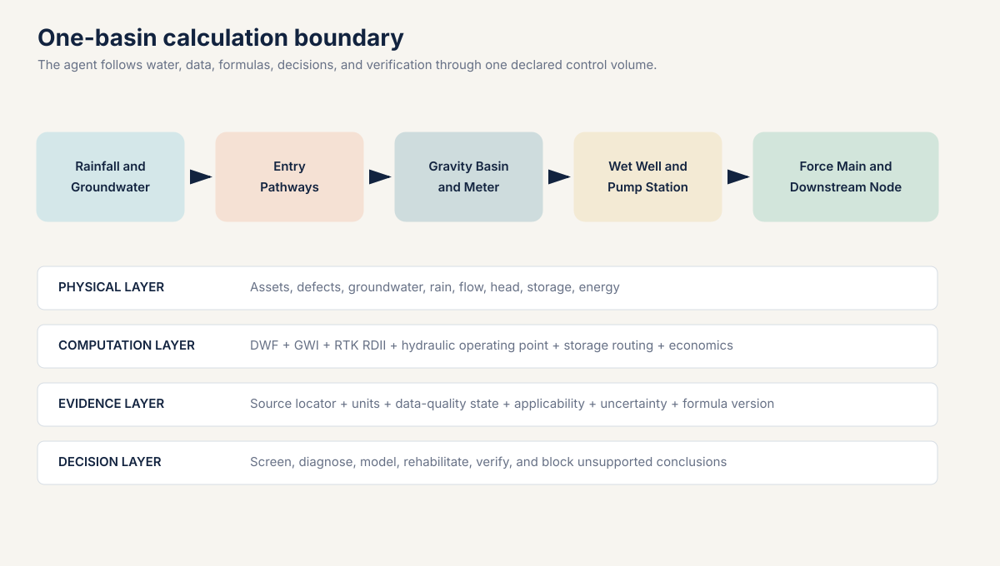
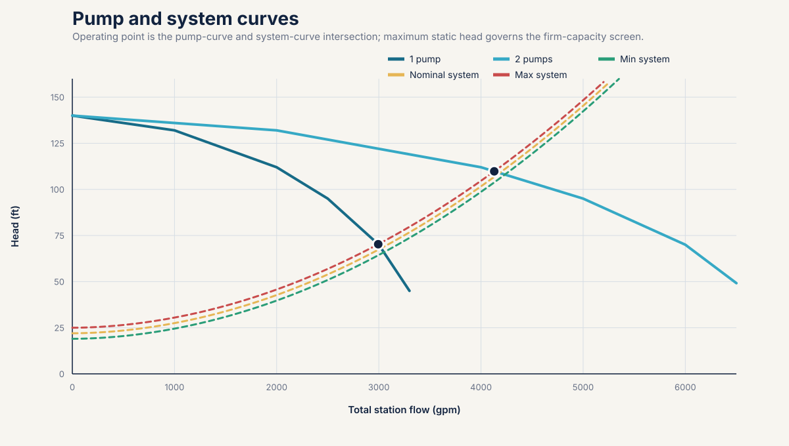
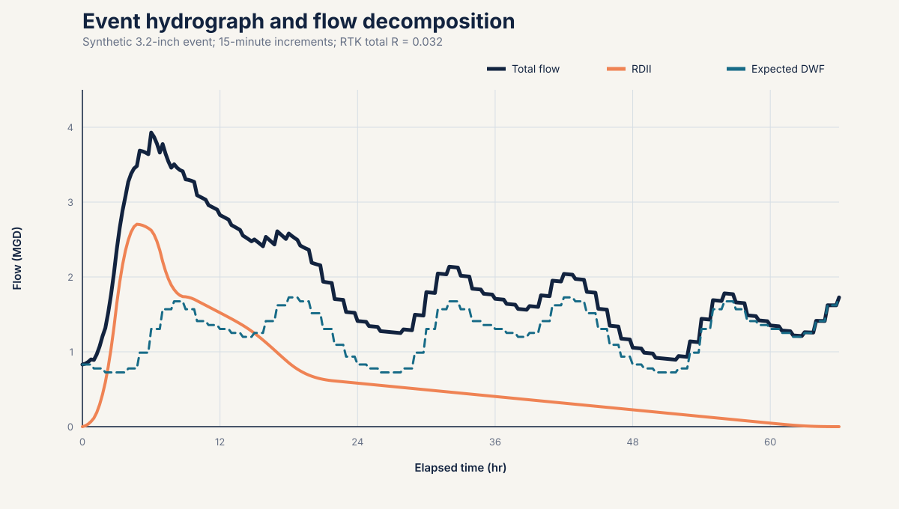
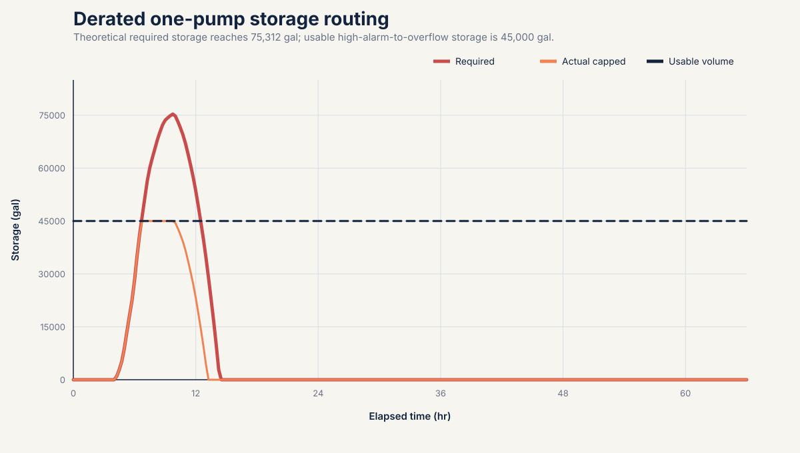
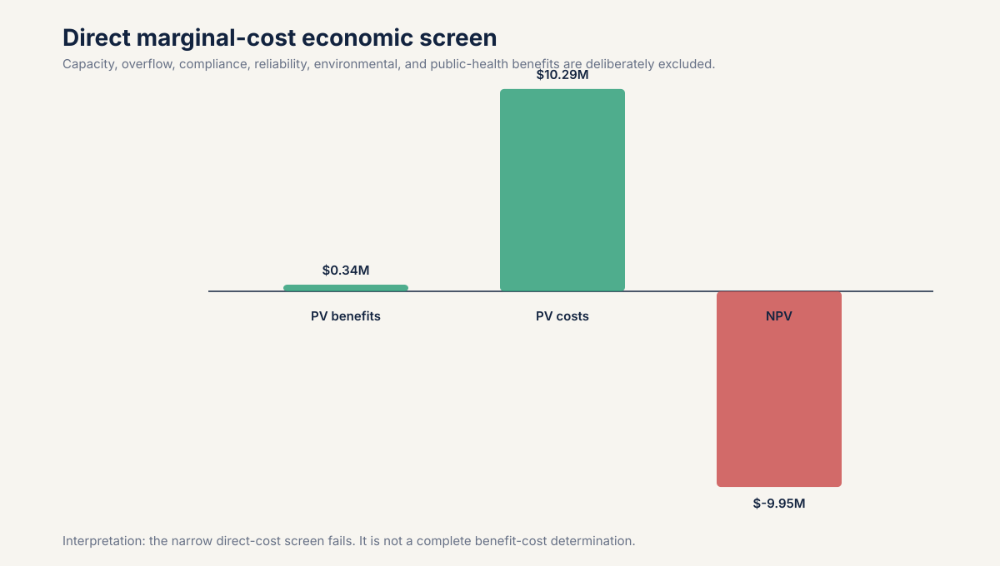
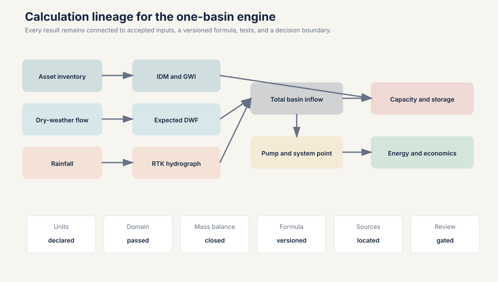

# Infiltration and Inflow

## A national engineering calculation framework with a Miami-Dade basin and pump-station case

Version: 1.0 candidate technical paper  
Date: July 27, 2026  
Computational example: MD-EX-01  
Formula registry: `formula-register.yaml` version 0.2.0  
Scope: sanitary sewer infiltration and inflow in the United States  
Case boundary: synthetic Miami-Dade-like basin, not an actual County facility  
Regulatory boundary: national methods are separated from jurisdiction-specific rules  

## Document status and engineering use

This paper is a research and computational specification. It is not a course. It defines a
reproducible calculation system suitable to become the technical basis of an agentic application.
The executable example, machine-readable inputs, formula registry, source registry, time series,
results, and tests are part of the paper.

The word "universal" has a precise meaning here. The application has a universal data contract,
unit system, formula registry, provenance model, uncertainty model, validation protocol, and
method-selection process. It does not impose one rainfall response coefficient on every sewer
system. EPA's national review found that no single rainfall-derived infiltration and inflow method
is universally applicable [R3]. Local hydrology, groundwater, assets, monitoring data, and the
decision being supported determine which validated method may run.

No formula is represented as infallible. Production use requires:

1. exact source and version traceability;
2. dimensional and numerical verification;
3. calibration against accepted field data;
4. independent hydraulic and wastewater engineering review;
5. verification of current local legal and regulatory requirements; and
6. an accountable professional's approval for the intended decision.

The application must fail closed when a material input, unit, boundary, applicability condition, or
source version is missing. It must never invent a coefficient, silently substitute a default, or
turn a screening metric into a design, operating, or compliance conclusion.

## Abstract

Infiltration and inflow, abbreviated I&I, are unwanted waters that enter a sanitary sewer. They
consume conveyance, pumping, storage, and treatment capacity, but their mechanisms and time
signatures differ. Groundwater infiltration can persist during dry weather. Direct inflow may
respond almost immediately to rainfall. Rainfall-derived infiltration may rise later and recede for
hours or days. An observed wet-weather peak is therefore a hydraulic outcome, not proof of a
particular defect or owner.

This paper establishes an end-to-end calculation framework. It begins with the sanitary flow and
asset inventory, develops a dry-weather baseline, calculates groundwater infiltration, isolates
rainfall-derived flow, builds an RTK hydrograph, and carries the resulting basin inflow through a
pump-station system curve. It then solves one-pump and parallel-pump operating points, checks firm
capacity, routes wet-well storage under contingencies, estimates cycling and energy, applies a
separate Miami-Dade NAPOT rule example, and evaluates a hypothetical rehabilitation scenario using
annual volume, present value, net present value, benefit-cost ratio, and payback.

The worked example uses a synthetic 640-acre basin, 44 miles of gravity sewer, a 3.2-inch rainfall
event, a three-component RTK response totaling \(R=0.032\), three installed pumps, and a 16-inch
force main. The event produces 1.7796 million gallons of RDII and a peak total inflow of 3.9287
million gallons per day, or 2,728.3 gallons per minute. The conservative two-pump operating point is
4,129.8 gallons per minute at maximum static head, giving 33.94 percent peak capacity margin. A
normal one-pump case requires no storage for this event. A hypothetical 25 percent one-pump
derating requires 75,312 gallons against 45,000 gallons of usable storage, creating a 30,312-gallon
shortfall. A 30-minute complete-outage screen requires 81,848 gallons and creates a 36,848-gallon
shortfall.

The example is deliberately honest economically. The narrow direct marginal-cost calculation gives
a negative net present value because it excludes avoided capacity, overflow risk, compliance,
reliability, environmental, and public-health benefits. The result demonstrates why an agent must
preserve decision boundaries and excluded benefits instead of forcing a favorable answer.

## Table of contents

1. Executive technical position
2. Terminology and water pathways
3. National architecture and Miami-Dade boundary
4. Required data model
5. Monitoring, event selection, and quality control
6. Universal calculation library
   1. Units and conversions
   2. Dry-weather flow and groundwater infiltration
   3. RDII residual and event volume
   4. Normalized metrics
   5. Rainfall capture fraction
   6. RTK unit hydrographs
   7. Force-main hydraulics
   8. Pump operating points and capacity
   9. Storage, outage, and cycling
   10. Pump operating time and Miami-Dade NAPOT
   11. Energy
   12. Rehabilitation and economics
   13. Uncertainty and verification
7. Complete worked basin and pump-station example
8. Agentic calculation architecture
9. Miami-Dade jurisdiction rule pack
10. Interpretation, limitations, and prohibited inferences
11. Formula wiring matrix
12. Acronyms
13. Glossary
14. References
15. Reproducibility package

## 1. Executive technical position

I&I is not one number. It is a set of water pathways that must be separated by source mechanism,
time response, measurement evidence, ownership, hydraulic consequence, and remedy.

The controlling analytical sequence is:

```text
Declare boundary
  -> qualify assets and meters
  -> establish expected dry-weather flow
  -> identify accepted rainfall events
  -> calculate residual wet-weather response
  -> select and calibrate an applicable RDII method
  -> route the hydrograph through the collection system
  -> solve pump and storage consequences
  -> compare interventions
  -> verify post-rehabilitation system response
```

The outcome must remain traceable in both directions. An executive finding must resolve to a
calculation. A calculation must resolve to a formula version. A formula must resolve to its inputs,
units, assumptions, source, tests, and reviewer state.



### 1.1 The five claims that must never be conflated

1. **Measurement claim:** a meter or instrument recorded a value.
2. **Calculated claim:** accepted inputs and a named formula produced a value.
3. **Modeled claim:** a calibrated or assumed model produced a value.
4. **Diagnostic claim:** field evidence supports a likely entry pathway or defect.
5. **Compliance claim:** the applicable legal instrument and facts establish a regulatory result.

A high RDII volume is a calculated or modeled hydraulic response. It is not automatically a
diagnostic claim about a roof leader, cracked main, lateral, or manhole. A local threshold is not a
national standard. A model-predicted reduction is not measured removal.

### 1.2 Universal engine, method-specific computation

The engine must support multiple methods under one contract:

- dry-weather decomposition;
- minimum-night-flow screening;
- water-use-supported base wastewater estimation;
- event residual integration;
- rainfall capture fraction;
- RTK unit hydrographs;
- regression and statistical event models;
- continuous simulation;
- normalized inventory metrics;
- hydraulic routing;
- pump and wet-well analysis; and
- pre-rehabilitation and post-rehabilitation verification.

The method selector may activate a method only when its required data and applicability checks pass.
An RTK model cannot run as a calibrated prediction merely because three triangles can be drawn.

## 2. Terminology and water pathways

### 2.1 Base wastewater flow

Base wastewater flow, abbreviated BWF, is sanitary and process wastewater expected from connected
users before groundwater infiltration and rainfall-derived response are added. Depending on the
study, it may include residential, commercial, industrial, institutional, and authorized hauled or
transferred flow. The boundary must say whether each source is included.

### 2.2 Groundwater infiltration

Groundwater infiltration, abbreviated GWI, is groundwater entering through defects, joints, cracks,
laterals, manholes, abandoned connections, or other openings. It can vary seasonally and with tides
or canals where a hydraulic connection is demonstrated. A dry-weather estimate does not by itself
locate the entry point.

### 2.3 Inflow

Inflow is water discharged more directly into the sanitary system from sources such as roof
leaders, yard drains, area drains, sump pumps, storm drain cross-connections, uncapped cleanouts,
open or submerged manholes, and other rapid pathways. Its response may be immediate, but timing
alone is not source confirmation.

### 2.4 Rainfall-derived infiltration and inflow

Rainfall-derived infiltration and inflow, abbreviated RDII, is the portion of sanitary flow
attributed to rainfall after expected dry-weather flow is removed. It combines rapid, intermediate,
and delayed responses. The abbreviation describes a relationship to rainfall, not a field-confirmed
defect class.

### 2.5 Dry-weather and wet-weather flow

For a simple decomposition:

\[
Q_{\mathrm{DWF}}(t)=Q_{\mathrm{BWF}}(t)+Q_{\mathrm{GWI}}(t)
\]

\[
Q_{\mathrm{observed}}(t)=Q_{\mathrm{DWF,expected}}(t)+Q_{\mathrm{RDII}}(t)
\]

Dry weather is not automatically zero infiltration. Wet weather is not automatically all I&I.
Wastewater generation continues through an event.

### 2.6 Exfiltration

Exfiltration is wastewater leaving the sewer through defects. It is hydraulically and
environmentally important but cannot be calculated by simply negating an I&I estimate. Direction
depends on the pressure and groundwater relationship at the defect.

### 2.7 Physical components and entry paths

| Component | Potential unwanted-water pathways | Evidence commonly needed |
|---|---|---|
| Building sewer and private lateral | cracked pipe, defective joint, sump pump, roof or foundation drain | private-side CCTV, dye, smoke, plumbing inspection |
| Public lateral | joint leakage, roots, fracture, defective cleanout | CCTV, pressure or vacuum test, work history |
| Gravity main | cracks, joints, fractures, abandoned connections | CCTV, sonar where surcharged, flow isolation |
| Manhole | lid holes, submerged cover, frame seal, chimney, wall, bench, pipe penetration | rainfall inspection, level evidence, smoke, dye |
| Pump wet well | flooded hatch, wall penetration, drain, upstream surcharge | level, rainfall, site inspection, pump records |
| Force main | leakage or exfiltration, not normally an I&I entry path while pressurized | pressure, transient, leak survey |
| Satellite connection | imported flow and I&I outside direct owner control | boundary metering and agreement records |

## 3. National architecture and Miami-Dade boundary

The national layer uses current United States federal authority, EPA guidance, transparent
engineering derivations, and jurisdiction-neutral data contracts. State and local requirements are
loaded only through a separate rule pack.

Miami-Dade is both a useful case and a jurisdiction with specific legal instruments. The 2013
federal consent decree includes pump-station operating-time definitions and criteria [R4]. A 2025
Florida Department of Environmental Protection consent order concerning the Central District
Wastewater Treatment Plant includes a dry-weather basin I&I rate of 4,600 gallons per day per
inch-diameter-mile and requires a professional engineer to establish an accepted wet-weather maximum
for the applicable system [R9]. Those provisions cannot be applied nationwide.

The synthetic example uses coastal, high-groundwater context but no real Miami-Dade basin, meter,
pump, force main, control setting, or cost. Its local NAPOT calculation is an implementation example,
not a capacity certification.

## 4. Required data model

### 4.1 Project and boundary

Required fields:

- project identifier and version;
- owner and accountable reviewer;
- jurisdiction and activated rule pack;
- upstream and downstream control-volume boundaries;
- included public, private, and satellite assets;
- time zone and daylight-saving policy;
- coordinate reference system;
- unit declarations;
- analysis purpose;
- decision class; and
- prohibited uses.

### 4.2 Asset inventory

Each pipe segment requires a stable identifier, active status, upstream and downstream nodes,
length, diameter basis, material, installation year if known, ownership, and inclusion status.
Duplicate geometry, abandoned pipe, missing diameter, and mixed diameter definitions must be
resolved before normalized metrics run.

For pump analysis, required data include:

- manufacturer or accepted field pump curves;
- speed and impeller diameter;
- pump and motor efficiency curves;
- identical or nonidentical pump status;
- available combinations;
- suction and discharge elevations;
- minimum, nominal, and maximum wet-well levels;
- downstream hydraulic grade range;
- force-main internal diameter, length, roughness, fittings, and valves;
- wet-well level-volume relationship;
- controls, setpoints, delays, and alternation;
- standby power and emergency response assumptions; and
- calibrated flow, pressure, level, power, and run-time records where available.

### 4.3 Time series

Every sample requires:

- timestamp with time zone;
- measured value;
- engineering unit;
- instrument identifier;
- calibration version;
- quality flag;
- edited or raw status;
- gap status;
- detection or rating-curve limitation; and
- provenance.

Rainfall requires gauge coordinates, interval, clock basis, cumulative or incremental status, gauge
maintenance, and spatial-assignment method. Flow requires the original depth, velocity, level, or
pump-state evidence from which flow was derived.

### 4.4 Cost and economic data

Cost inputs require a price date, constant or nominal dollar basis, analysis life, discount rate,
escalation treatment, capital and annual costs, marginal rather than average conveyance and
treatment cost where the decision calls for it, residual value policy, and benefit inclusions.

## 5. Monitoring, event selection, and quality control

### 5.1 Basin boundary confirmation

The upstream inventory must reconcile to the downstream meter. Temporary bypasses, normally closed
valves, interbasin connections, pumped transfers, and satellite flows can invalidate the boundary.
GIS topology alone is not sufficient where operating configuration differs.

### 5.2 Clock and interval control

Rain and flow must share a time basis. The application must:

1. retain raw timestamps;
2. normalize to an explicit analysis time zone;
3. identify daylight-saving changes;
4. detect duplicate and missing timestamps;
5. prohibit interpolation across gaps longer than the method limit; and
6. record every shift or correction.

A one-hour clock error can move a hydrograph peak and corrupt RTK calibration even when volumes
appear plausible.

### 5.3 Dry-weather selection

An accepted dry-weather day needs explicit rules for:

- antecedent rainfall;
- groundwater or seasonal state;
- weekday, weekend, or holiday class;
- industrial schedule;
- unusual pumping or treatment operation;
- meter quality; and
- known construction or bypasses.

The baseline should be time matched. Subtracting a single average from a diurnal wet-weather
hydrograph can bias both peak and volume.

### 5.4 Event start and end

The event window starts early enough to capture the dry-weather baseline and ends after response
returns to a declared recovery criterion. Long-tail RDII must not be truncated merely because rain
stopped. Adjacent storms may require continuous simulation or an explicit event-separation method.

### 5.5 Minimum automated checks

- rainfall increments are nonnegative unless a gauge-reset method is active;
- flow and depth are within instrument and hydraulic plausibility;
- timestamps are monotonic;
- totalized and integrated volumes reconcile;
- rainfall gauges are spatially representative;
- expected DWF is defined for every event time step;
- negative RDII residual handling is explicit;
- RTK component \(R\), \(T\), and \(K\) remain within approved domains;
- model mass balance closes to tolerance;
- pump-curve interpolation does not extrapolate;
- pump and system curves intersect within the approved curve;
- efficiency is greater than zero and no greater than one;
- friction solver convergence is recorded;
- storage and overflow conserve volume; and
- all displayed rounding occurs after computation.

## 6. Universal calculation library

### 6.1 Units and conversions

The system uses exact or declared conversion constants and stores units with every value.

One acre-inch is:

\[
43{,}560\ \frac{\mathrm{ft^2}}{\mathrm{acre}}
\times
\frac{1}{12}\ \frac{\mathrm{ft}}{\mathrm{in}}
\times
7.48051948051948\ \frac{\mathrm{gal}}{\mathrm{ft^3}}
=27{,}154.285714285714\ \frac{\mathrm{gal}}{\mathrm{acre\mathchar`-in}}
\]

Therefore, formula F-UNIT-001 is:

\[
V_{\mathrm{rain,gal}}
=P_{\mathrm{in}}A_{\mathrm{acre}}(27{,}154.285714285714)
\]

Common flow conversions in F-CONV-001 include:

\[
Q_{\mathrm{gpm}}=\frac{Q_{\mathrm{MGD}}(1{,}000{,}000)}{1{,}440}
\]

\[
Q_{\mathrm{MGD}}=Q_{\mathrm{gpm}}(0.00144)
\]

\[
Q_{\mathrm{cfs}}=\frac{Q_{\mathrm{gpm}}}{448.8311688311688}
\]

For irregular time samples, F-FLOW-001 uses trapezoidal integration:

\[
V=\sum_{i=0}^{n-1}
\left(\frac{Q_i+Q_{i+1}}{2}\right)\Delta t_i
\]

Flow and time units must be converted so the result is a volume. Intermediate rounding is
prohibited.

### 6.2 Dry-weather flow and groundwater infiltration

F-DWF-001 defines a time-weighted average:

\[
\overline{Q}_{\mathrm{DWF}}
=
\frac{\sum_i Q_i\Delta t_i}{\sum_i\Delta t_i}
\]

F-GWI-001 defines groundwater infiltration by residual:

\[
Q_{\mathrm{GWI}}
=Q_{\mathrm{DWF,measured}}-Q_{\mathrm{BWF,estimated}}
\]

This is an estimate because BWF is estimated. Acceptable BWF methods can include a calibrated
diurnal pattern, water-use and return-factor analysis, minimum-night analysis with an explicit
sanitary nighttime allowance, or statistical separation. Each method requires its own uncertainty.

If the residual is negative beyond accepted uncertainty, the application must not set GWI to zero
silently. It must flag baseline inconsistency, meter bias, export flow, timing error, or method
failure.

### 6.3 RDII residual and event volume

F-RDII-001:

\[
Q_{\mathrm{RDII}}(t)
=Q_{\mathrm{observed}}(t)-Q_{\mathrm{DWF,expected}}(t)
\]

F-RDII-002:

\[
V_{\mathrm{RDII}}
=\int_{t_0}^{t_1}Q_{\mathrm{RDII}}(t)\,dt
\]

The discrete implementation uses F-FLOW-001. The event window, baseline, data gaps, and treatment
of small negative residuals must be recorded. A modeled RTK volume is separate from an
observed-residual volume, even when both are called RDII.

### 6.4 Inventory-normalized metrics

F-IDM-001 defines the inventory denominator:

\[
\mathrm{IDM}=\sum_j D_jL_j
\]

where \(D_j\) is diameter in inches and \(L_j\) is length in miles.

F-NORM-001 defines:

\[
q_{\mathrm{IDM}}
=\frac{Q_{\mathrm{I\&I,gpd}}}{\mathrm{IDM}}
\]

Other transparent normalizations include:

\[
q_{\mathrm{gpcd}}=\frac{Q_{\mathrm{gpd}}}{\mathrm{population}}
\]

\[
q_{\mathrm{connection}}
=\frac{Q_{\mathrm{gpd}}}{N_{\mathrm{connections}}}
\]

These are comparison metrics, not universal acceptable limits. IDM is sensitive to inventory scope:
mainline only, public lateral, private lateral, active pipe, nominal diameter, and internal diameter
cannot be mixed without disclosure.

### 6.5 Rainfall capture fraction

F-RDII-003:

\[
R_{\mathrm{event}}
=\frac{V_{\mathrm{RDII}}}{V_{\mathrm{rain}}}
\]

Both volumes must use the same tributary-area boundary. \(R\) is dimensionless. It is the fraction
of rainfall volume over the declared sewer area represented as RDII, not percent imperviousness and
not the fraction of rain entering a particular defect.

### 6.6 RTK unit hydrographs

EPA SWMM represents RDII with up to three triangular unit hydrographs for short, intermediate, and
long response [R1, R2]. Each component has:

- \(R_i\): fraction of rainfall volume entering the sewer through component \(i\);
- \(T_i\): time from rainfall increment onset to component peak; and
- \(K_i\): ratio of recession time to \(T_i\).

F-RTK-001 gives component volume and base duration:

\[
V_i=R_iP A(27{,}154.285714285714)
\]

\[
B_i=T_i(1+K_i)
\]

Because a triangular hydrograph has area \(V_i\), F-RTK-002 gives peak flow:

\[
Q_{p,i}=\frac{2V_i}{B_i}
\]

For elapsed time \(\tau\) after the rainfall increment:

\[
Q_i(\tau)=
\begin{cases}
0, & \tau<0\\
Q_{p,i}\frac{\tau}{T_i}, & 0\leq\tau\leq T_i\\
Q_{p,i}\left[1-\frac{\tau-T_i}{K_iT_i}\right],
& T_i<\tau\leq T_i(1+K_i)\\
0, & \tau>T_i(1+K_i)
\end{cases}
\]

F-RTK-003 superposes responses from every rainfall increment \(m\) and component \(i\):

\[
Q_{\mathrm{RDII}}(t)=\sum_m\sum_iQ_{i,m}(t-t_m)
\]

Initial abstraction, antecedent moisture, monthly parameter sets, snowmelt, groundwater dependence,
and separate area assignment may be needed in real applications. The synthetic example sets initial
abstraction to zero only to isolate the RTK arithmetic.

### 6.7 Force-main hydraulics

#### 6.7.1 Geometry, velocity, and Reynolds number

F-HYD-001:

\[
D_{\mathrm{ft}}=\frac{D_{\mathrm{in}}}{12}
\]

\[
A=\frac{\pi D^2}{4}
\]

\[
v=\frac{Q}{A}
\]

\[
\mathrm{Re}=\frac{vD}{\nu}
\]

where \(\nu\) is kinematic viscosity. The flow and area units must be consistent.

#### 6.7.2 Darcy friction factor

F-HYD-002 uses:

\[
f=\frac{64}{\mathrm{Re}}
\quad\text{for laminar flow}
\]

For turbulent flow, the example solves the implicit Colebrook-White equation:

\[
\frac{1}{\sqrt f}
=-2\log_{10}
\left(
\frac{\epsilon}{3.7D}
+
\frac{2.51}{\mathrm{Re}\sqrt f}
\right)
\]

EPA's SWMM hydraulics reference describes Darcy-Weisbach force mains and uses a Swamee-Jain
approximation to Colebrook-White, with an interpolation policy in the transition range [R5]. This
example instead solves the implicit equation and fails closed for \(2{,}000\leq\mathrm{Re}<4{,}000\).
That implementation difference is intentional and versioned.

#### 6.7.3 Major and minor losses

F-HYD-003:

\[
h_f=f\frac{L}{D}\frac{v^2}{2g}
\]

F-HYD-004:

\[
h_m=K_{\mathrm{total}}\frac{v^2}{2g}
\]

F-HYD-005 gives the system head:

\[
H_{\mathrm{system}}(Q)
=H_{\mathrm{static}}+h_f(Q)+h_m(Q)+H_{\mathrm{other}}(Q)
\]

Static head must be evaluated across the material wet-well and downstream hydraulic-grade range.
Roughness, internal diameter, valve state, fouling, and future configuration require sensitivity
cases where they are uncertain.

### 6.8 Pump operating points and capacity

A centrifugal pump does not deliver its nameplate flow independently of the system. The operating
point is the intersection of the pump head curve and the system head curve [R6, R7].

For \(N\) identical pumps in parallel, F-PUMP-001 solves:

\[
H_{\mathrm{pump,single}}\left(\frac{Q_{\mathrm{total}}}{N}\right)
=H_{\mathrm{system}}(Q_{\mathrm{total}})
\]

The implementation linearly interpolates only between supplied pump-curve points and rejects
extrapolation. Nonidentical pumps require head-by-head composition of the individual modified
curves and cannot use the identical-pump shortcut.

F-PUMP-002 defines:

\[
Q_{\mathrm{margin}}=Q_{\mathrm{available}}-Q_{\mathrm{inflow}}
\]

\[
\mathrm{margin\ fraction}
=\frac{Q_{\mathrm{margin}}}{Q_{\mathrm{available}}}
\]

\[
\mathrm{utilization}
=\frac{Q_{\mathrm{inflow}}}{Q_{\mathrm{available}}}
\]

The result must state whether available capacity means normal, firm, emergency, tested, rated, or
modeled capacity. This example uses two duty pumps at maximum static head as conservative firm
capacity and retains one installed standby pump.



### 6.9 Storage, outage, and cycling

For constant inflow and capacity, F-PUMP-003 gives time to exhaust usable storage:

\[
t_{\mathrm{storage}}
=\frac{V_{\mathrm{usable}}}
{Q_{\mathrm{in}}-Q_{\mathrm{available}}}
\quad \text{when }Q_{\mathrm{in}}>Q_{\mathrm{available}}
\]

F-PUMP-004 gives storage needed for a response interval:

\[
V_{\mathrm{required}}
=\max(0,Q_{\mathrm{in}}-Q_{\mathrm{available}})t_{\mathrm{response}}
\]

For variable inflow, F-PUMP-007 routes storage. With trapezoidal inflow over interval \(i\):

\[
\Delta V_i=
\left[
\frac{Q_{\mathrm{in},i}+Q_{\mathrm{in},i+1}}{2}
-Q_{\mathrm{available},i}
\right]\Delta t_i
\]

The theoretical storage requirement is:

\[
S^{\mathrm{req}}_{i+1}
=\max(0,S^{\mathrm{req}}_i+\Delta V_i)
\]

Actual storage and interval overflow are:

\[
S^{\mathrm{actual}}_{i+1}
=\min[V_{\mathrm{usable}},\max(0,S^{\mathrm{actual}}_i+\Delta V_i)]
\]

\[
V_{\mathrm{overflow},i}
=\max(0,S^{\mathrm{actual}}_i+\Delta V_i-V_{\mathrm{usable}})
\]

This is a control-volume mass balance. A real station may require smaller time steps, level-volume
curves, pump start delays, multiple setpoints, variable speed, backwater, upstream sewer storage,
and dynamic hydraulic routing.

F-PUMP-005 describes a limited constant-speed cycle. For working volume \(V_w\), constant inflow
\(Q_{\mathrm{in}}\), and one-pump capacity \(Q_p>Q_{\mathrm{in}}\):

\[
t_{\mathrm{fill}}=\frac{V_w}{Q_{\mathrm{in}}}
\]

\[
t_{\mathrm{draw}}=\frac{V_w}{Q_p-Q_{\mathrm{in}}}
\]

\[
t_{\mathrm{cycle}}=t_{\mathrm{fill}}+t_{\mathrm{draw}}
\]

\[
N_{\mathrm{cycles/hr}}=\frac{60}{t_{\mathrm{cycle,min}}}
\]

USACE presents the equivalent maximum-cycle relationship \(V=tq/4\) for the stated design
conditions [R6]. Manufacturer motor-start limits and the actual control sequence govern production
use.

### 6.10 Pump operating time and Miami-Dade NAPOT

F-PUMP-006 estimates:

\[
H_{\mathrm{aggregate}}
=\frac{V_{\mathrm{pumped,gal}}}{Q_{\mathrm{single,gpm}}(60)}
\]

\[
H_{\mathrm{firm\ equivalent}}
=\frac{V_{\mathrm{pumped,gal}}}{Q_{\mathrm{firm,gpm}}(60)}
\]

These are generic operating-time metrics.

F-MDC-NAPOT-001 is jurisdiction specific. The 2013 Miami-Dade federal consent decree defines
Yearly Nominal Daily Average Pump Operating Time, or NAPOT, using the average daily average pump
operating time for months within the preceding 365 days, divided by one less than the number of
installed pumps [R4]:

\[
\mathrm{Yearly\ NAPOT}
=\frac{\mathrm{average\ monthly\ daily\ aggregate\ pump\ hours}}
{N_{\mathrm{installed}}-1}
\]

The source contains additional power-equivalence provisions for multispeed and variable-speed
stations. The 10-hour criterion in that decree is not a universal pump-station formula. Current
legal status and applicability must be verified before use.

### 6.11 Energy

For water-like specific gravity of one, F-ENERGY-001:

\[
\mathrm{water\ hp}=\frac{Q_{\mathrm{gpm}}H_{\mathrm{ft}}}{3960}
\]

\[
\mathrm{input\ hp}
=\frac{\mathrm{water\ hp}}{\eta_p\eta_m}
\]

\[
P_{\mathrm{kW}}=\mathrm{input\ hp}(0.745699872)
\]

Efficiency must match the operating point. A fixed assumed efficiency is not acceptable where the
pump operates across a material range.

F-ENERGY-002:

\[
E_{\mathrm{kWh}}=\int P_{\mathrm{kW}}(t)\,dt
\]

\[
C_{\mathrm{energy}}=E_{\mathrm{kWh}}c_{\mathrm{\$/kWh}}
\]

The tariff must include time-of-use, demand, power-factor, and other material charges when those
affect the decision. EPA identifies pumping as a major wastewater energy use and emphasizes system,
pump, motor, and control efficiency [R8].

### 6.12 Rehabilitation and economics

F-ECON-002:

\[
V_{\mathrm{annual,MG}}
=Q_{\mathrm{average,MGD}}N_{\mathrm{days}}
\]

F-COST-001:

\[
C_{\mathrm{annual}}
=V_{\mathrm{I\&I,annual,MG}}c_{\mathrm{marginal,\$/MG}}
\]

F-PV-001:

\[
\mathrm{PV}=\sum_{t=0}^{N}\frac{\mathrm{CF}_t}{(1+r)^t}
\]

F-ECON-003:

\[
\mathrm{NPV}=\mathrm{PV}_{\mathrm{benefits}}-\mathrm{PV}_{\mathrm{costs}}
\]

F-BCR-001:

\[
\mathrm{BCR}
=\frac{\mathrm{PV}_{\mathrm{benefits}}}{\mathrm{PV}_{\mathrm{costs}}}
\]

F-ECON-004:

\[
\mathrm{simple\ payback}
=\frac{C_{\mathrm{initial}}}{B_{\mathrm{annual,net}}}
\]

Simple payback is undefined when annual net benefit is zero or negative. It ignores discounting and
post-payback cash flow and cannot replace lifecycle analysis.

Benefits may include:

- marginal pumping and treatment cost;
- avoided or deferred conveyance and treatment capacity;
- avoided overflow response and damage;
- reliability and resilience;
- compliance-risk reduction;
- environmental and public-health value;
- customer and community disruption avoided; and
- residual asset value.

Each must have its own evidence and uncertainty. Avoided-capacity value cannot be claimed unless a
real capacity constraint, timing effect, and deferrable project are documented.

### 6.13 Uncertainty and verification

A scalar without uncertainty can overstate precision. At minimum, the engine carries input
uncertainties, method uncertainty, calibration error, scenario uncertainty, and output sensitivity.

For a differentiable function \(y=f(\mathbf{x})\), F-UNC-001 provides first-order covariance
propagation:

\[
\mathrm{Var}(y)\approx
\mathbf{J}\mathbf{\Sigma_x}\mathbf{J}^{T}
\]

where \(\mathbf{J}\) is the Jacobian. Monte Carlo simulation is appropriate when the model is
nonlinear, bounded, discontinuous, or driven by distributions.

Post-rehabilitation verification must compare like hydrologic and operating conditions. F-VERIFY-001
defines reduction relative to a counterfactual:

\[
\mathrm{reduction}
=\mathrm{predicted\ post\ response\ without\ rehabilitation}
-\mathrm{observed\ post\ response}
\]

The counterfactual should control for rainfall, antecedent moisture, groundwater, season, basin
changes, meter configuration, and wastewater demand. One before event and one after event rarely
support a causal conclusion.

## 7. Complete worked basin and pump-station example

### 7.1 Example boundary and inputs

MD-EX-01 is synthetic. It represents a coastal, high-groundwater context without claiming to be an
actual Miami-Dade basin.

| Input | Value |
|---|---:|
| Tributary area | 640 acres |
| Population | 12,000 persons |
| Service connections | 4,200 |
| Average BWF | 1.000 MGD |
| Average GWI | 0.250 MGD |
| Gravity main | 44 miles |
| Rainfall | 3.2 inches over 6 hours |
| Calculation interval | 15 minutes |
| Short RTK | \(R=0.006,\ T=1\) hr, \(K=2\) |
| Medium RTK | \(R=0.010,\ T=4\) hr, \(K=3\) |
| Long RTK | \(R=0.016,\ T=12\) hr, \(K=4\) |
| Installed pumps | 3 |
| Normal duty and standby | 2 duty, 1 standby |
| Force main | 16-inch internal diameter, 9,500 ft |
| Absolute roughness | 0.0005 ft |
| Sum of minor-loss coefficients | 8 |
| Static head range | 19 to 25 ft |
| Wet-well working volume | 15,000 gal |
| Usable high-alarm-to-overflow volume | 45,000 gal |

The pump curve is:

| Per-pump flow, gpm | Head, ft | Pump efficiency |
|---:|---:|---:|
| 0 | 140 | not defined at shutoff |
| 1,000 | 132 | 0.68 |
| 2,000 | 112 | 0.80 |
| 2,500 | 95 | 0.82 |
| 3,000 | 70 | 0.75 |
| 3,300 | 45 | 0.65 |

Motor efficiency is 0.94.

### 7.2 Inventory calculation

The gravity inventory is:

\[
\begin{aligned}
\mathrm{IDM}
&=(8)(28)+(10)(8)+(12)(5)+(15)(2)+(18)(1)\\
&=224+80+60+30+18\\
&=412\ \mathrm{inch\mathchar`-diameter\mathchar`-miles}
\end{aligned}
\]

Average GWI:

\[
0.250\ \mathrm{MGD}\times1{,}000{,}000
=250{,}000\ \mathrm{gpd}
\]

Normalized GWI:

\[
\frac{250{,}000\ \mathrm{gpd}}{412\ \mathrm{IDM}}
=606.796\ \mathrm{gpd/IDM}
\]

Per-capita GWI:

\[
\frac{250{,}000}{12{,}000}
=20.833\ \mathrm{gpcd}
\]

Average dry-weather flow:

\[
\mathrm{ADWF}=1.000+0.250=1.250\ \mathrm{MGD}
\]

Per-capita ADWF:

\[
\frac{1.250(1{,}000{,}000)}{12{,}000}
=104.167\ \mathrm{gpcd}
\]

### 7.3 Rainfall volume

\[
\begin{aligned}
V_{\mathrm{rain}}
&=3.2\ \mathrm{in}
\times640\ \mathrm{acre}
\times27{,}154.285714\ \frac{\mathrm{gal}}{\mathrm{acre\mathchar`-in}}\\
&=55{,}611{,}977.143\ \mathrm{gal}
\end{aligned}
\]

### 7.4 RTK component volumes

Short response:

\[
V_s=0.006(55{,}611{,}977.143)
=333{,}671.863\ \mathrm{gal}
\]

Medium response:

\[
V_m=0.010(55{,}611{,}977.143)
=556{,}119.771\ \mathrm{gal}
\]

Long response:

\[
V_l=0.016(55{,}611{,}977.143)
=889{,}791.634\ \mathrm{gal}
\]

Total:

\[
\begin{aligned}
V_{\mathrm{RDII}}
&=333{,}671.863+556{,}119.771+889{,}791.634\\
&=1{,}779{,}583.269\ \mathrm{gal}
\end{aligned}
\]

\[
R_{\mathrm{total}}=0.006+0.010+0.016=0.032
\]

Check:

\[
\frac{1{,}779{,}583.269}{55{,}611{,}977.143}=0.032
\]

The executable convolution integrates to 1,779,583.269 gallons. Relative mass-closure error is
\(2.62\times10^{-16}\), which passes the example tolerance of \(10^{-10}\).

### 7.5 Component shape example

For the total short-response volume and its \(T=1\) hour, \(K=2\) shape:

\[
B_s=1(1+2)=3\ \mathrm{hr}
\]

\[
Q_{p,s}
=\frac{2(333{,}671.863)}{3}
=222{,}447.909\ \mathrm{gal/hr}
\]

\[
Q_{p,s}
=222{,}447.909\frac{24}{1{,}000{,}000}
=5.33875\ \mathrm{MGD}
\]

That value describes one triangle built from the aggregate component volume. The implemented model
builds and superposes a triangle for every 15-minute rainfall increment, so its event peak is not
equal to the single aggregate-triangle peak.

### 7.6 Hydrograph result

The normalized hourly BWF pattern has an average of one. GWI remains 0.250 MGD in the synthetic
event. The resulting values are:

| Result | Value |
|---|---:|
| Peak RDII | 2.704132 MGD at hour 4.75 |
| Peak expected DWF | 1.726923 MGD |
| Peak total flow | 3.928701 MGD at hour 6.00 |
| Peak total flow | 2,728.264 gpm |

The peak total flow conversion is:

\[
3.928700758\ \mathrm{MGD}
\times\frac{1{,}000{,}000}{1{,}440}
=2{,}728.264\ \mathrm{gpm}
\]



### 7.7 One-pump operating point at maximum static head

The solver evaluates trial total flow, converts it to force-main velocity, solves friction, adds
major and minor loss to 25 ft static head, interpolates the pump head, and finds the zero of:

\[
F(Q)=H_{\mathrm{pump}}(Q)-H_{\mathrm{system}}(Q)
\]

The result is:

| Quantity | One pump, maximum static |
|---|---:|
| Flow | 2,994.250 gpm |
| Total dynamic head | 70.279 ft |
| Interpolated pump efficiency | 0.750805 |
| Motor efficiency | 0.94 |
| Input power | 56.147 kW |
| Specific energy | 312.526 kWh/MG |

Power expansion:

\[
\mathrm{water\ hp}
=\frac{(2{,}994.25)(70.2786)}{3960}
=53.124\ \mathrm{hp}
\]

\[
\mathrm{input\ hp}
=\frac{53.124}{(0.750805)(0.94)}
=75.293\ \mathrm{hp}
\]

\[
P=75.293(0.745699872)=56.147\ \mathrm{kW}
\]

\[
\mathrm{specific\ energy}
=\frac{56.147\ \mathrm{kWh/hr}}
{2{,}994.25(60)/1{,}000{,}000\ \mathrm{MG/hr}}
=312.526\ \mathrm{kWh/MG}
\]

### 7.8 Two-pump firm operating point

For two identical parallel pumps:

\[
H_{\mathrm{pump,single}}(Q_{\mathrm{total}}/2)
=H_{\mathrm{system}}(Q_{\mathrm{total}})
\]

At maximum static head:

| Quantity | Two pumps, maximum static |
|---|---:|
| Total flow | 4,129.750 gpm |
| Per-pump flow | 2,064.875 gpm |
| Total dynamic head | 109.790 ft |
| Pump efficiency | 0.802595 |
| Total input power | 113.170 kW |
| Specific energy | 456.727 kWh/MG |

The two-pump flow is less than twice the one-pump flow because the common force-main friction
increases strongly with total flow.

### 7.9 Capacity margin

\[
Q_{\mathrm{margin}}
=4{,}129.750-2{,}728.264
=1{,}401.486\ \mathrm{gpm}
\]

\[
\mathrm{margin\ fraction}
=\frac{1{,}401.486}{4{,}129.750}
=0.339363=33.9363\%
\]

\[
\mathrm{utilization}
=\frac{2{,}728.264}{4{,}129.750}
=0.660637=66.0637\%
\]

The example event passes the modeled two-pump firm-capacity screen. That does not certify a real
station because real curves, controls, transient conditions, NPSH, pump condition, force-main
condition, upstream surcharge, emergency power, and downstream limits are absent.

### 7.10 Storage contingency A: normal one-pump operation

Conservative one-pump capacity is 2,994.250 gpm. Peak inflow is 2,728.264 gpm:

\[
Q_{\mathrm{deficit}}
=\max(0,2{,}728.264-2{,}994.250)=0
\]

The dynamically routed event requires zero incremental storage in this case.

### 7.11 Storage contingency B: one pump derated 25 percent

\[
Q_{\mathrm{available}}
=0.75(2{,}994.250)=2{,}245.6875\ \mathrm{gpm}
\]

Peak deficit:

\[
Q_{\mathrm{deficit,peak}}
=2{,}728.264-2{,}245.6875
=482.577\ \mathrm{gpm}
\]

Constant-peak storage exhaustion screen:

\[
t_{\mathrm{exhaust}}
=\frac{45{,}000}{482.577}
=93.249\ \mathrm{min}
\]

Dynamic routing over the complete event gives:

| Storage result | Value |
|---|---:|
| Required storage | 75,311.845 gal |
| Usable storage | 45,000 gal |
| Shortfall | 30,311.845 gal |
| Calculated cumulative overflow in simplified routing | 30,311.845 gal |

The constant-peak screen and dynamic result answer different questions. The 93.249-minute screen
assumes a constant peak beginning with empty storage. The dynamic route preserves the complete
hydrograph and prior storage state.



### 7.12 Storage contingency C: complete outage for 30 minutes

At constant peak inflow:

\[
V_{\mathrm{required}}
=2{,}728.264(30)
=81{,}847.932\ \mathrm{gal}
\]

\[
V_{\mathrm{shortfall}}
=81{,}847.932-45{,}000
=36{,}847.932\ \mathrm{gal}
\]

\[
t_{\mathrm{exhaust}}
=\frac{45{,}000}{2{,}728.264}
=16.494\ \mathrm{min}
\]

This is a conservative constant-peak screen, not a transient simulation. It shows that the stated
30-minute response interval is longer than the 16.494-minute storage duration at peak inflow.

### 7.13 Simple cycling calculation

Average inflow:

\[
1.25\ \mathrm{MGD}
\times\frac{1{,}000{,}000}{1{,}440}
=868.056\ \mathrm{gpm}
\]

Using the nominal-static-head one-pump capacity of 3,022.625 gpm:

\[
t_{\mathrm{fill}}=\frac{15{,}000}{868.056}=17.280\ \mathrm{min}
\]

\[
t_{\mathrm{draw}}
=\frac{15{,}000}{3{,}022.625-868.056}
=6.962\ \mathrm{min}
\]

\[
t_{\mathrm{cycle}}=17.280+6.962=24.242\ \mathrm{min}
\]

\[
N_{\mathrm{cycles/hr}}=\frac{60}{24.242}=2.475
\]

The result applies only to the stated one-pump, constant-speed, constant-inflow simplification.

### 7.14 Illustrative operating time and NAPOT

Aggregate pump hours for one ADWF day:

\[
H_{\mathrm{aggregate}}
=\frac{1.25(1{,}000{,}000)}
{3{,}022.625(60)}
=6.892\ \mathrm{pump\mathchar`-hr/day}
\]

Illustrative constant-speed NAPOT:

\[
\mathrm{NAPOT}
=\frac{6.892}{3-1}
=3.446\ \mathrm{hr/day}
\]

This does not implement the preceding-365-day monthly averaging or variable-speed power-equivalence
rules in the source. It is therefore labeled an illustrative formula-path test, not a Miami-Dade
capacity determination.

### 7.15 Event energy

The example interpolates staged power between nominal one-pump and two-pump operating points as the
inflow changes, then trapezoidally integrates power for the full 66-hour modeled response.

\[
E_{\mathrm{event}}=1{,}589.926\ \mathrm{kWh}
\]

\[
C_{\mathrm{event}}
=1{,}589.926(0.12)
=\$190.79
\]

This control approximation is not a motor-control simulation. A production model must use actual
start-stop or VFD logic, measured wire power, and the applicable tariff.

### 7.16 Rehabilitation scenario

Hypothetical assumptions:

- 30 percent GWI reduction;
- short \(R\) reduction of 15 percent;
- medium \(R\) reduction of 35 percent;
- long \(R\) reduction of 45 percent;
- 12 annual-equivalent events;
- $8.5 million capital cost;
- $120,000 annual O&M;
- $650 per MG marginal conveyance and treatment cost;
- 20 years; and
- 3 percent real discount rate.

Post-scenario GWI:

\[
Q_{\mathrm{GWI,post}}
=0.250(1-0.30)
=0.175\ \mathrm{MGD}
\]

Post-scenario RTK fractions:

\[
R_{s,\mathrm{post}}=0.006(0.85)=0.0051
\]

\[
R_{m,\mathrm{post}}=0.010(0.65)=0.0065
\]

\[
R_{l,\mathrm{post}}=0.016(0.55)=0.0088
\]

\[
R_{\mathrm{post,total}}=0.0204
\]

Post-event RDII:

\[
V_{\mathrm{RDII,post}}
=0.0204(55{,}611{,}977.143)
=1{,}134{,}484.334\ \mathrm{gal}
\]

Annual GWI reduction:

\[
(0.250-0.175)(365)=27.375\ \mathrm{MG/yr}
\]

Annual RDII reduction:

\[
\frac{1{,}779{,}583.269-1{,}134{,}484.334}{1{,}000{,}000}(12)
=7.741\ \mathrm{MG/yr}
\]

Total annual I&I reduction:

\[
27.375+7.741=35.116\ \mathrm{MG/yr}
\]

Gross annual direct marginal-cost benefit:

\[
35.116(\$650)=\$22{,}825.52/\mathrm{yr}
\]

Annual net direct benefit:

\[
\$22{,}825.52-\$120{,}000=-\$97{,}174.48/\mathrm{yr}
\]

Present value results:

| Economic output | Value |
|---|---:|
| PV gross direct benefits | $339,586 |
| PV capital plus annual O&M | $10,285,297 |
| NPV | -$9,945,711 |
| BCR | 0.0330 |
| Simple payback | undefined because annual net benefit is negative |



The narrow direct-cost scenario fails. That answer is retained. The agent is prohibited from
changing assumptions to manufacture a favorable result. A complete decision analysis would
separately quantify or describe the omitted benefits and test uncertainty.

## 8. Agentic calculation architecture

### 8.1 Required calculation object

Every calculation instance must contain:

```yaml
calculation_id: stable_unique_identifier
formula_id: F-...
formula_version: semantic_version
method_id: optional_method_variant
inputs:
  - value: numeric_or_series_reference
    unit: explicit_unit
    source_record: evidence_identifier
    quality_state: accepted_rejected_provisional
parameters:
  - value: numeric
    unit: explicit_unit_or_dimensionless
    calibration_record: identifier
applicability:
  checks: []
  passed: boolean
assumptions: []
uncertainty:
  method: interval_covariance_or_simulation
  parameters: {}
outputs:
  value: numeric_or_series
  unit: explicit_unit
validation:
  dimensional_check: pass_or_fail
  numerical_tests: []
  mass_balance: optional
source_trace: []
review_state: candidate_verified_or_production
```

### 8.2 Directed calculation graph

The application should use a directed acyclic graph for ordinary calculations:



Iterative solvers, such as Colebrook-White and pump-curve intersection, are encapsulated nodes with
convergence records rather than cycles in the external dependency graph.

### 8.3 Method-selection logic

The selector must answer:

1. Is the intended output measured, calculated, modeled, diagnostic, or compliance related?
2. Does the record contain acceptable rainfall, flow, boundary, and dry-weather data?
3. Is the analysis event based or continuous?
4. Is calibration required and available?
5. Are groundwater and antecedent conditions material?
6. Does the selected method's domain match the data and decision?
7. Is a jurisdiction rule active?
8. Do uncertainty and sensitivity meet the decision threshold?

If no validated method passes, the correct output is "not calculable from the accepted record,"
with missing evidence listed.

### 8.4 Numeric policies

- Minimum internal type is IEEE 754 binary64.
- Decimal currency may use fixed-point decimal.
- Display rounding never feeds downstream calculations.
- Root solvers record bracket, tolerance, iterations, and residual.
- Time-series integration records interval method and missing-data policy.
- All conversions use registry constants.
- Infinity, NaN, and silent overflow are prohibited output states.
- Negative values are accepted only where the physical and formula domains allow them.

### 8.5 Version and provenance policy

Changing a formula, constant, solver, transition-flow policy, interpolation method, or source locator
requires a new formula-registry version and rerunning all dependent golden tests. Results must retain
the exact input hash, formula version, code version, and execution timestamp.

### 8.6 Required test layers

1. Unit-conversion tests.
2. Dimensional-consistency tests.
3. Hand-calculated formula vectors.
4. Failure vectors for invalid units and domains.
5. Mass-balance closure tests.
6. Pump-curve intersection residual tests.
7. Storage and overflow conservation tests.
8. Golden basin regression tests.
9. Independent implementation comparison.
10. Field calibration and holdout validation.
11. Qualified engineering review.

The current package completes layers 1 through 8 for the synthetic functions represented in its
tests. It does not complete independent implementation comparison, field calibration, or qualified
professional review.

## 9. Miami-Dade jurisdiction rule pack

### 9.1 Separation rule

Miami-Dade requirements are stored in `jurisdiction-rules/miami-dade.yaml`. The engine must reject
the pack when jurisdiction, facility, instrument, date, or facts do not match.

### 9.2 Federal consent decree pump rule

The 2013 federal consent decree is the source for the NAPOT definition and related capacity criteria
used in this paper's local example [R4]. Runtime use requires:

- current legal-status review;
- correct station inclusion;
- installed pump count;
- preceding-365-day monthly daily average data;
- meter or accepted power basis;
- special handling for multispeed or variable-speed pumps; and
- projected authorized flows where the decision requires them.

### 9.3 2025 Central District consent order

The 2025 order states that no applicable WASD basin should exceed 4,600 gpd/IDM during dry weather
under the described Central District I&I Plan and records Miami-Dade's stated facility-capacity basis
for the number [R9]. The same order requires a Florida-registered professional engineer to evaluate
the system and determine a wet-weather maximum subject to Department acceptance. It does not provide
a universal wet-weather threshold.

The synthetic example's 606.8 gpd/IDM is shown as a formula test, not a determination under that
order. The order does not fully define the inventory denominator in the excerpt. The accepted I&I
Plan and current Department records are therefore required before applying the threshold.

## 10. Interpretation, limitations, and prohibited inferences

### 10.1 What the example establishes

- All stated input units reconcile.
- The synthetic RTK convolution closes event volume to tolerance.
- The supplied pump and system curves have one-pump and two-pump intersections.
- The modeled firm-capacity point exceeds the synthetic event peak.
- The derated and outage screens exceed stated usable storage.
- The narrow direct-cost economic scenario is unfavorable.

### 10.2 What it does not establish

- Condition or capacity of any actual Miami-Dade asset.
- A calibrated RTK parameter set.
- A County compliance result.
- A national acceptable I&I rate.
- The source location of any I&I.
- A rehabilitation performance prediction.
- A complete benefit-cost determination.
- An overflow permit conclusion.
- Pump suitability, cavitation safety, transient safety, or motor-start compliance.

### 10.3 Prohibited agent outputs

The agent must not say:

- "The basin has excessive I&I" without an applicable comparison basis.
- "The defect caused the peak" without diagnostic evidence.
- "The project removes X gallons" when X is a scenario or model prediction.
- "The pump station has capacity" based only on nameplate flow or NAPOT.
- "The wet well provides 30 minutes" without the applicable inflow-capacity deficit.
- "The project pays back" when excluded benefits or negative annual net benefits make that false.
- "4,600 gpd/IDM is the national limit."
- "The calculation is 100 percent correct" before source, independent, field, and qualified reviews.

## 11. Formula wiring matrix

| Calculation output | Formula IDs | Primary source or derivation |
|---|---|---|
| Rainfall volume | F-UNIT-001 | transparent US customary unit derivation |
| Flow volume | F-FLOW-001 | trapezoidal numerical integration |
| ADWF | F-DWF-001 | time-weighted mean |
| GWI residual | F-GWI-001 | EPA flow-component framework [R3] |
| IDM | F-IDM-001 | explicit asset sum |
| Normalized I&I | F-NORM-001 | explicit numerator and denominator |
| RDII hydrograph | F-RTK-001, F-RTK-002, F-RTK-003 | EPA SWMM and SSOAP [R1, R2] |
| Force-main geometry and flow | F-HYD-001 | EPA SWMM hydraulics [R5] |
| Friction factor | F-HYD-002 | EPA SWMM hydraulics plus stated implementation difference [R5] |
| Major head loss | F-HYD-003 | EPA SWMM hydraulics [R5] |
| Minor loss | F-HYD-004 | EPA SWMM hydraulics [R5] |
| System head | F-HYD-005 | USACE pump-station analysis [R6] |
| Parallel-pump point | F-PUMP-001 | USACE equal-head parallel composition [R6] |
| Margin and utilization | F-PUMP-002 | transparent ratios |
| Constant-deficit storage | F-PUMP-003, F-PUMP-004 | control-volume derivation |
| Dynamic storage | F-PUMP-007 | F-MASS-001 plus F-FLOW-001 |
| Simple cycling | F-PUMP-005 | control-volume derivation and USACE equivalent [R6] |
| Generic operating hours | F-PUMP-006 | volume divided by capacity |
| Miami-Dade NAPOT | F-MDC-NAPOT-001 | 2013 federal consent decree [R4] |
| Pump power | F-ENERGY-001 | hydraulic power derivation, federal pump context [R6, R7] |
| Pump energy and cost | F-ENERGY-002 | power integration and tariff |
| Annual volume | F-ECON-002 | flow-times-time identity |
| Annual marginal cost | F-COST-001 | explicit marginal unit cost |
| Present value | F-PV-001 | discounted cash flow |
| Net present value | F-ECON-003 | benefits less costs |
| Benefit-cost ratio | F-BCR-001 | PV benefits divided by PV costs |
| Simple payback | F-ECON-004 | capital divided by positive annual net benefit |

## 12. Acronyms

| Acronym | Expansion |
|---|---|
| ADWF | Average Dry-Weather Flow |
| BEP | Best Efficiency Point |
| BCR | Benefit-Cost Ratio |
| BWF | Base Wastewater Flow |
| CCTV | Closed-Circuit Television |
| CFR | Code of Federal Regulations |
| DWF | Dry-Weather Flow |
| EPA | United States Environmental Protection Agency |
| FDEP | Florida Department of Environmental Protection |
| GWI | Groundwater Infiltration |
| HGL | Hydraulic Grade Line |
| I&I | Infiltration and Inflow |
| IDM | Inch-Diameter-Mile |
| kW | Kilowatt |
| kWh | Kilowatt-Hour |
| MG | Million Gallons |
| MGD | Million Gallons per Day |
| NAPOT | Nominal Average Pump Operating Time |
| NPV | Net Present Value |
| NPSH | Net Positive Suction Head |
| O&M | Operation and Maintenance |
| PE | Professional Engineer |
| PV | Present Value |
| PWWF | Peak Wet-Weather Flow |
| QA | Quality Assurance |
| QC | Quality Control |
| RDII | Rainfall-Derived Infiltration and Inflow |
| RTK | R, T, and K triangular unit-hydrograph parameters |
| SCADA | Supervisory Control and Data Acquisition |
| SSO | Sanitary Sewer Overflow |
| SSOAP | Sanitary Sewer Overflow Analysis and Planning |
| SWMM | Storm Water Management Model |
| TDH | Total Dynamic Head |
| USACE | United States Army Corps of Engineers |
| VFD | Variable Frequency Drive |
| WASD | Miami-Dade Water and Sewer Department |
| WCTS | Wastewater Collection and Transmission System |
| WWTP | Wastewater Treatment Plant |

## 13. Glossary

**Antecedent dry period:** Time since a defined prior rainfall threshold or event.

**Antecedent moisture:** Catchment wetness before an event, which can affect rainfall response.

**Base wastewater flow:** Expected sanitary and process wastewater from connected users before GWI
and RDII.

**Capacity margin:** Available capacity minus inflow, with the capacity basis explicitly named.

**Capture fraction:** RDII volume divided by rainfall volume over the declared tributary area.

**Colebrook-White equation:** Implicit relationship for turbulent Darcy friction factor as a
function of Reynolds number and relative roughness.

**Control volume:** Declared physical boundary across which flow and storage are balanced.

**Darcy friction factor:** Dimensionless factor used in Darcy-Weisbach head-loss calculation.

**Dry-weather flow:** Flow expected or observed under accepted dry-weather conditions, commonly BWF
plus GWI.

**Event window:** Start and end timestamps over which rainfall and sewer response are analyzed.

**Firm capacity:** Capacity available with the defined largest or required unit unavailable. The
definition must state governing assumptions.

**Force main:** Pressurized pipeline conveying pump discharge.

**Groundwater infiltration:** Groundwater entering the sanitary collection system through defects
or openings.

**Inch-diameter-mile:** Sum of pipe diameter in inches multiplied by segment length in miles.

**Infiltration:** Water entering through defects or openings, commonly influenced by groundwater or
soil moisture.

**Inflow:** Water entering more directly through drains, cross-connections, openings, or similar
rapid pathways.

**K parameter:** RTK ratio of recession time to time to peak.

**Mass balance:** Accounting in which change in storage equals inflow minus outflow over the control
volume.

**Method applicability:** Conditions under which a formula or model is suitable for the intended
data and decision.

**Minor loss:** Local head loss associated with fittings, valves, entrances, exits, and geometry,
often represented by \(K v^2/(2g)\).

**NAPOT:** Miami-Dade consent-decree pump operating-time metric with source-specific averaging,
denominator, and power-equivalence rules.

**Operating point:** Flow and head where the pump curve intersects the system curve.

**Peak wet-weather flow:** Maximum accepted flow during a defined wet-weather analysis window.

**Pump curve:** Relationship among pump flow, head, efficiency, and power at defined speed and
impeller conditions.

**R parameter:** RTK fraction of rainfall volume represented as RDII for one response component.

**Rainfall-derived infiltration and inflow:** Wet-weather sanitary flow attributed to rainfall after
expected dry-weather flow is removed.

**Reynolds number:** Dimensionless ratio characterizing inertial and viscous effects in flow.

**Rule pack:** Versioned set of jurisdiction-specific requirements kept separate from universal
formulas.

**Sensitivity analysis:** Evaluation of how output changes when inputs or assumptions change.

**Static head:** Elevation or hydraulic-grade difference independent of flow-dependent losses.

**System curve:** Required total head as a function of flow for a stated system configuration.

**T parameter:** RTK time from rainfall-increment onset to a component hydrograph peak.

**Total dynamic head:** Energy per unit weight the pump must supply, expressed as head.

**Uncertainty:** Quantified or structured lack of certainty associated with inputs, methods,
parameters, scenarios, and outputs.

**Usable storage:** Volume available between two explicitly defined hydraulic levels for the
intended contingency.

**Wet well:** Pump-station storage structure from which wastewater pumps take suction.

## 14. References

[R1] U.S. Environmental Protection Agency. *Storm Water Management Model User's Manual Version
5.2*. EPA-600/R-22/030, 2022. Printed page 67 and printed pages 321 to 323, 397 to 398. Preserved
copy: `research/sources/swmm-users-manual-version-5.2.pdf`.

[R2] U.S. Environmental Protection Agency. *Computer Tools for Sanitary Sewer System Capacity
Analysis and Planning*. 2007. Printed pages 2-14 to 2-16 and 5-34 onward. Preserved copy:
`research/sources/P1008BBP.pdf`.

[R3] U.S. Environmental Protection Agency. *Review of Sewer Design Criteria and RDII Prediction
Methods*. EPA-600/R-08/010, 2008. Abstract and printed pages 2-6 to 2-8, 4-15 to 4-18. Preserved
copy: `research/sources/P1008BP3.pdf`.

[R4] United States District Court for the Southern District of Florida. *United States and State of
Florida v. Miami-Dade County Consent Decree*, Case 1:12-cv-24400-FAM, 2013. Document 25-1,
Document 25-2 Appendix A. Preserved copy: `research/sources/consent-decree-signed.pdf`.

[R5] U.S. Environmental Protection Agency. *Storm Water Management Model Reference Manual Volume
II - Hydraulics*. EPA-600/R-17/111, 2017. Printed pages 136 to 141. Preserved copy:
`research/sources/swmm-reference-manual-volume-ii-hydraulics.pdf`.

[R6] U.S. Army Corps of Engineers. *Engineering and Design: Wastewater Pumping Stations*.
EM 1110-3-173, April 9, 1984. PDF pages 18 to 23. Official locator:
<https://www.publications.usace.army.mil/Portals/76/Publications/EngineerManuals/EM_1110-3-173.pdf>.

[R7] U.S. Environmental Protection Agency. *Wastewater Technology Fact Sheet: In-Plant Pump
Stations*. EPA-832-F-00-069, September 2000. Official text locator:
<https://nepis.epa.gov/Exe/ZyPURL.cgi?Dockey=P100IL4W.TXT>.

[R8] U.S. Environmental Protection Agency. *Evaluation of Energy Conservation Measures for
Wastewater Treatment Facilities*. September 2010, Chapters 2 and 3. Preserved copy:
`research/sources/p1008sbm.pdf`.

[R9] Florida Department of Environmental Protection and Miami-Dade County. *Consent Order,
OGC No. 22-1805*, included in Miami-Dade legislative matter 250122, 2025. Consent-order pages 5
and 6. Preserved copy: `research/sources/miami-dade-fdep-consent-order-2025.pdf`.

[R10] Electronic Code of Federal Regulations. *40 CFR 35.2005, Definitions* and *40 CFR 35.2120,
Infiltration/Inflow*. Current applicability must be checked at use time:
<https://www.ecfr.gov/current/title-40/chapter-I/subchapter-B/part-35/subpart-I/section-35.2005> and
<https://www.ecfr.gov/current/title-40/chapter-I/subchapter-B/part-35/subpart-I/section-35.2120>.

## 15. Reproducibility package

| Artifact | Purpose |
|---|---|
| `sample-basin.yaml` | complete synthetic input record |
| `formula-register.yaml` | machine-readable formula definitions, domains, and source traces |
| `sources.yaml` | primary-source registry, locators, checksums, and status |
| `jurisdiction-rules/miami-dade.yaml` | isolated Miami-Dade rule pack |
| `tools/run_sample_basin.py` | executable reference calculation |
| `generated/sample-basin-results.json` | machine-readable scalar outputs and lineage |
| `generated/sample-basin-timeseries.csv` | rainfall, DWF, RTK, total flow, and storage series |
| `tools/validate_seed_formulas.py` | formula-level test vectors |
| `tools/test_sample_basin.py` | end-to-end golden tests |
| `tools/check_formula_wiring.py` | formula, source, result, and paper linkage check |
| `tools/generate_figures.py` | dependency-free SVG generation from verified outputs |
| `figures/*.svg` | diagrams and engineering plots used in this paper |

To reproduce:

```text
python3 tools/run_sample_basin.py
python3 tools/validate_seed_formulas.py
python3 tools/test_sample_basin.py
python3 tools/generate_figures.py
python3 tools/check_formula_wiring.py
```

The synthetic package is computationally reproducible. Production authorization remains blocked
until independent implementation, field calibration, current jurisdiction review, and qualified
professional approval are complete.
