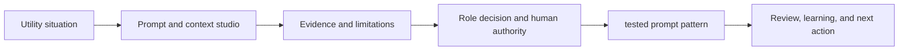

# RS-F49: M49 Prompt and context studio

## Control record

- Research starter ID: `RS-F49`
- Curriculum ID: `fellowship:M49`
- Course: 7. Applied AI Studios
- Status: proposed research starter
- Repository path: `curriculum/research-starters/fellowship-m49-prompt-and-context-studio.md`
- Source authority: `SYLLABUS.md`
- Owner: unassigned
- Contributor: Hardeep Anand direction, structured by APAS Academy Studio
- Reviewer: unassigned
- Revision: 1
- Release boundary: This is a research blueprint, not approved learner-facing instruction.

## Why this module exists

The learner's job is to improve an unclear utility task through role, context, constraints, output, and evaluation. The practical result is a usable
**tested prompt pattern**. This matters because the demonstration works once in a clean room, then fails when the source is stale, the tool times out, or the user asks an unexpected question.

## The scene

The demonstration works once in a clean room, then fails when the source is stale, the tool times out, or the user asks an unexpected question.

The research should follow the decision from the first question through the records, systems,
people, review, and resulting work product. It should show what changes when the same question moves
from a drinking-water plant to a wastewater facility, a stormwater program, or a One Water planning
table.

## The analogy

A studio is the wet test of the system. A drawing can look perfect, but the water still has to move through the pipe under pressure.

The analogy is an opening bridge. The final lesson must return to actual utility work and must not
let the analogy replace technical explanation.

## Four water-sector frames

### Drinking water

A drinking-water studio tests a bounded source-grounded task with approved documents and human review.

### Wastewater

A wastewater studio tests tool use, failure, retry, and escalation against a realistic shift or maintenance task.

### Stormwater

A stormwater studio tests mixed documents, maps, event data, and field evidence without overstating prediction quality.

### One Water

The studio rewards visible evidence, failure, correction, and a useful work product rather than a theatrical demo.

## Connections the research must make

- **Data and knowledge:** Which records, definitions, identifiers, sources, dates, and limitations
  determine whether the answer can be trusted?
- **Operations:** What is happening in the physical system, and which qualified person retains
  operating authority?
- **Planning and engineering:** What requirements, assets, assumptions, models, alternatives, and
  decision history shape the work?
- **Finance and procurement:** What baseline, full cost, contract, funding, lock-in, and exit
  questions matter?
- **Governance and security:** Who may ask, read, recommend, approve, write, administer, stop, and
  investigate?
- **Products and adoption:** Who is the user, what problem is being solved, what must fit existing
  work, and what evidence would justify continued investment?
- **People and professional growth:** What can the learner show in a portfolio that proves judgment,
  collaboration, technical fluency, and responsibility?

## Role questions

- **Foundation:** What does the term mean, what does it not mean, and what simple utility example
  makes the distinction clear?
- **Practitioner:** How would someone use this in a real task, check the result, record the evidence,
  and respond when it fails?
- **Leader:** What decision, investment, authority, risk, workforce, and public-accountability
  questions must be settled before scaling?
- **Cross-role:** What does the operator need the engineer, finance lead, administrator, technology
  lead, vendor, and executive to understand, and what does each need in return?

## Proposed work product

Build a **tested prompt pattern** that names the problem, user, approved evidence, assumptions,
roles, limits, review steps, decision, and next accountable action. The artifact should be useful in
a real meeting after the course.

## Diagram direction

| Teaching job | Candidate | Learner conclusion | Interaction |
| --- | --- | --- | --- |
| Show the core mechanism | test stepper | Explain how prompt and context studio changes a utility decision. | Step, select, or reveal the mechanism. |
| Show the handoffs | before and after comparison | Identify where evidence, authority, or meaning can be lost between roles. | Highlight one role or handoff at a time. |
| Show the tradeoff | failure fishbone | Compare value, readiness, consequence, and control without hiding uncertainty. | Change one input and observe the decision effect. |
| Show operating status | evaluation dashboard | State what is ready, what is weak, and what must happen next. | Filter by drinking water, wastewater, stormwater, or One Water. |



The final design brief must run the Visual Arsenal selection process and may replace these candidates
when the research reveals a better natural shape.

## Research prompt

```text
You are the research team for One Water AI Academy. Prepare the governed research brief for M49: Prompt and context studio.

The learner must be able to improve an unclear utility task through role, context, constraints, output, and evaluation. The professional work product is: tested prompt pattern.

Research this module in the context of United States drinking water, wastewater, stormwater, and cross-functional One Water work. Begin with the real decisions people make, the records they use, the systems they touch, the people affected, and the consequence of getting the answer wrong. Do not begin with technology.

Deliver:
1. A plain-English explanation for an intelligent learner who is new to the topic.
2. One drinking-water case, one wastewater case, and one stormwater case. Label invented cases as instructional scenarios.
3. The Foundation, Practitioner, and Leader views. Show how the question and responsibility change by role.
4. A relationship map connecting data, knowledge, operations, planning, engineering, finance, governance, security, procurement, workforce, products, and public accountability where applicable.
5. A source table using current United States primary authorities, official guidance, standards adopted for the course, and qualified research. Give exact locators, dates, applicability, and limitations.
6. A claim register separating sourced fact, expert interpretation, Hardeep Anand position, instructional scenario, and unresolved question.
7. Four diagram candidates selected by the natural shape of the idea. For each, state what the learner should be able to explain after reading it, the interaction, accessible text, and mobile behavior.
8. At least six likely novice questions and direct plain-English answers to research further.
9. Failure cases, counterexamples, edge conditions, and what the system must refuse or send to a human.
10. A proposed applied exercise that produces the tested prompt pattern and can be assessed deterministically.
11. Open questions for a utility practitioner, technical reviewer, evidence reviewer, and novice learner.
12. A short recommendation explaining what belongs in this module, what belongs elsewhere, and what should be left out.

Evidence boundaries:
- Use United States governing authorities for water-sector requirements.
- Do not treat a vendor page as independent proof of performance.
- Do not copy confidential utility data into research tools.
- Do not claim that artificial intelligence operates or decides autonomously.
- Keep named product features, prices, regulations, and standards dated and verified.
- If a claim cannot be supported, label it unresolved instead of filling the gap.

Use this framing while researching:
- Drinking water: A drinking-water studio tests a bounded source-grounded task with approved documents and human review.
- Wastewater: A wastewater studio tests tool use, failure, retry, and escalation against a realistic shift or maintenance task.
- Stormwater: A stormwater studio tests mixed documents, maps, event data, and field evidence without overstating prediction quality.
- One Water: The studio rewards visible evidence, failure, correction, and a useful work product rather than a theatrical demo.
```

## Required review

- Evidence reviewer verifies source quality, exact locators, dates, and applicability.
- Utility practitioner checks the scenes, decisions, artifacts, and professional consequences.
- Technical reviewer checks architecture, data, security, evaluation, and failure claims.
- Novice learner identifies unexplained terms, missing steps, and confusing assumptions.
- Hardeep Anand approves the blueprint before learner-facing production begins.
