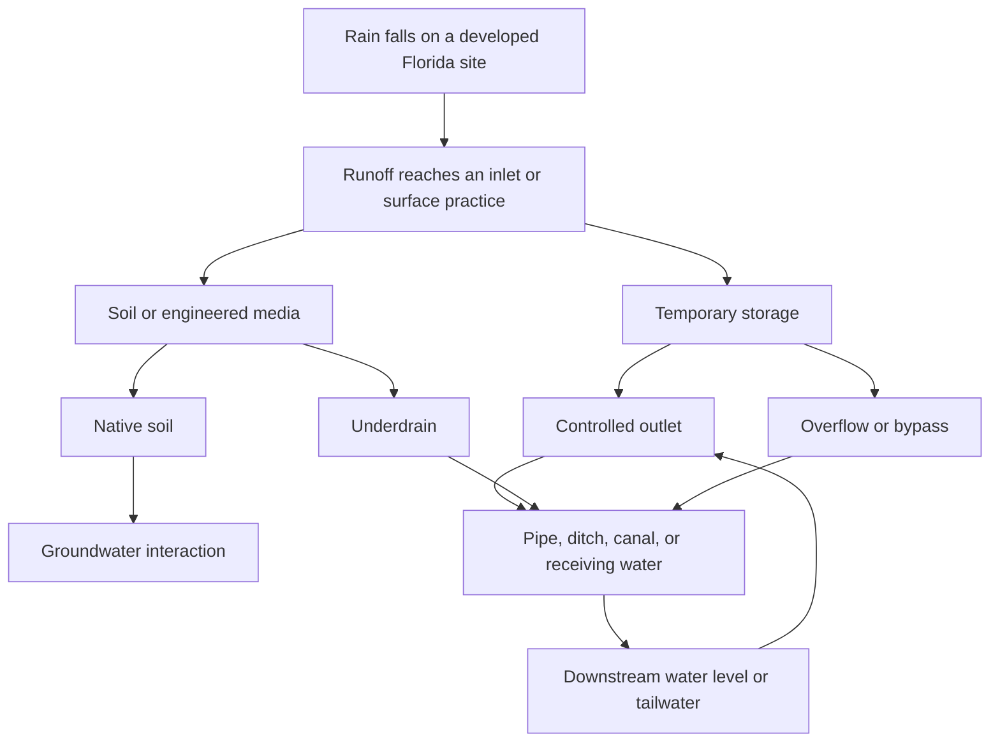
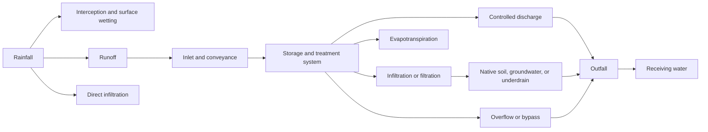
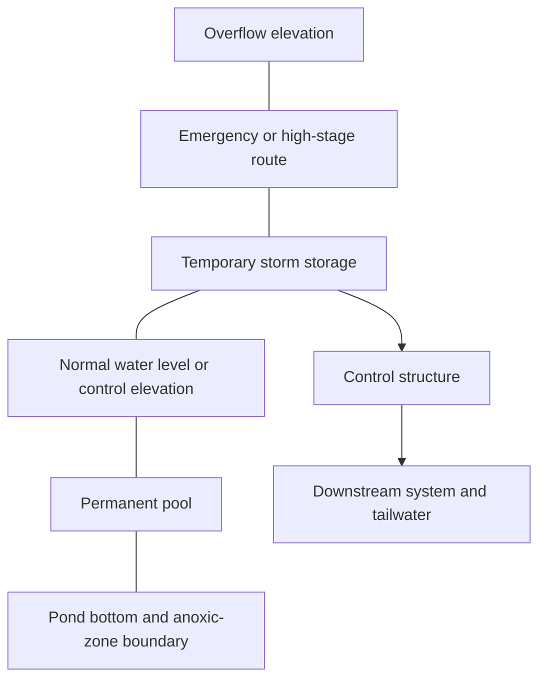
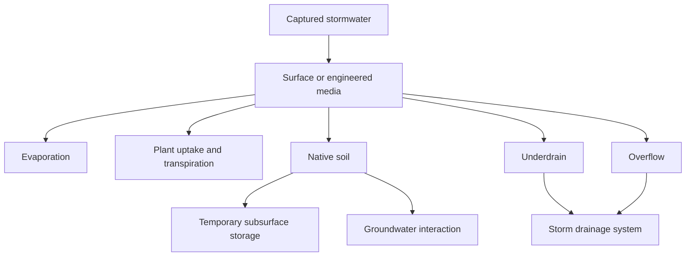
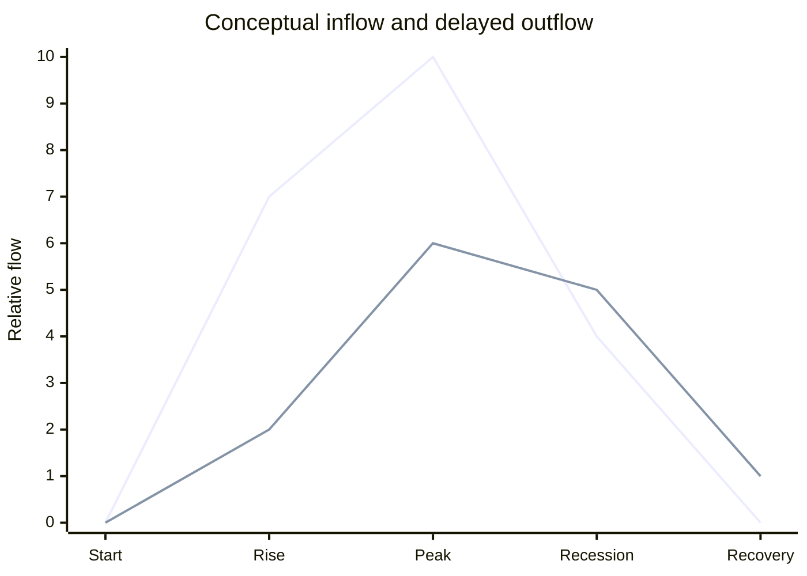
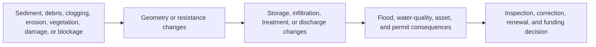
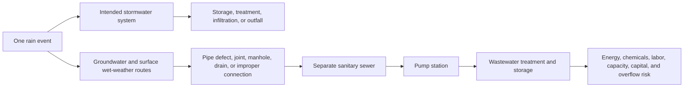

# Detention, Retention, and Infiltration in Florida

## Purpose and governance

This white paper explains detention, retention, and infiltration through a Florida lens. It is
written for people who make, fund, explain, inspect, operate, regulate, or live with utility
decisions. That includes engineers, operators, inspectors, asset managers, finance professionals,
utility executives, elected officials, developers, community educators, and members of the public.

This is a concept paper. It is not a design manual, permit interpretation, compliance
determination, operating procedure, or site recommendation. Florida requirements are kept in this
separate jurisdiction-specific work product because a state rule or regional criterion must not be
presented as a universal United States rule.

The research is current through July 26, 2026. The Florida Department of Environmental Protection,
Florida Legislature, Water Management Districts, U.S. Environmental Protection Agency, and U.S.
Geological Survey are the principal authorities. Material regulatory and technical claims still
require independent verification and qualified Florida practitioner review before release.

## Executive answer

Detention, retention, and infiltration are three ways of describing what happens to stormwater.
They are not interchangeable.

- **Detention** holds stormwater temporarily and releases it gradually.
- **Retention** is a word that must be unpacked. It may describe water kept from a later surface
  discharge, or it may appear in the name of a wet pond that has a permanent pool.
- **Infiltration** is a movement. Water crosses from the surface into soil or subsurface material.
  The word does not prove where the water ends up, how quickly it moves, or whether the route is
  suitable.

Florida makes these concepts especially important. Much of the state is flat. Groundwater can be
shallow. Soils and geology vary. Carbonate aquifers and karst features matter in many areas. Coastal
and canal water levels can restrict outfalls. Development adds impervious surface and direct
drainage pathways. Rain falling on one property can become a storage, discharge, water-quality,
groundwater, wastewater, maintenance, and finance question before it leaves the larger system.

The central lesson is:

> Follow the water, identify the control, and name the responsible party before trusting the asset
> label.

That one habit prevents several common errors. It stops us from calling every permanent pond
retention. It stops us from assuming disappearing water reached groundwater safely. It stops us
from treating a permit as construction paperwork. It also connects visible stormwater assets to
the budgets, records, inspections, and maintenance that preserve their performance.

## What are we teaching?

We are teaching a shared way to read a stormwater system.

A learner should be able to look at a dry basin, wet pond, swale, bioretention cell, infiltration
trench, permeable pavement system, underground chamber, pipe, canal, or outfall and ask:

1. What drainage area sends water here?
2. How does water enter?
3. What volume can be stored?
4. What water is normally present before a storm?
5. What controls the release?
6. Can water enter soil, an underdrain, a pipe, a canal, groundwater, or more than one route?
7. What happens when the intended route is full, clogged, blocked, submerged, or bypassed?
8. Where is the receiving water?
9. Who owns, operates, inspects, maintains, and pays for the system?
10. What permit, plan, record, model, or observation supports the explanation?

The teaching job is not to turn every learner into a stormwater designer. It is to give every
learner enough system understanding to ask a sound question, interpret an explanation, challenge a
weak assumption, and connect an asset decision to public value.

## Why this matters in Florida

Florida law reflects a connected-system view. Its stormwater-management definitions extend beyond
a single pond. They include ways to collect, convey, store, absorb, inhibit, treat, use, or reuse
stormwater so that flooding, overdrainage, water quantity, and water quality can be managed. The
asset is therefore the connected system, not merely the most visible waterbody.

### Florida is not one hydraulic setting

Florida uses a statewide Environmental Resource Permit framework, but its Water Management
Districts also use regional handbooks. That structure reflects a physical fact: rainfall,
groundwater, soils, geology, surface-water networks, flood behavior, and receiving waters are not
the same everywhere.

A practice that appears simple in plan view may operate within a complicated boundary:

The arrow from downstream water level back to the outlet is important. Water does not leave only
because an opening exists. It leaves when the hydraulic conditions allow it. If a canal, tide,
river, lake, or connected system is high, the difference that drives discharge may be smaller. The
system may drain more slowly or behave differently than it does under a lower downstream level.
The actual effect requires site-specific hydraulic analysis.

### Florida's water is above and below us

Florida's aquifer systems are major water resources. Carbonate rock and karst features can create
highly connected subsurface routes in some locations. In other places, confining layers,
groundwater depth, soil conditions, contamination, or nearby structures may limit or change an
infiltration concept.

This leads to a vital distinction:

> Infiltration is an entry into the subsurface. Recharge is a possible result. They are not
> synonyms.

Water that enters a practice can remain in engineered media, move laterally, leave through an
underdrain, evaporate, be used by plants, enter native soil, interact with groundwater, or return to
the surface or drainage system. A statewide map cannot settle a site question.

### Florida's drainage systems are connected

In low and flat areas, small elevation differences and connected canals, ditches, pipes, control
structures, ponds, pumps, and outfalls can govern large areas. A blockage or downstream condition
may matter beyond the property where it is visible. That is why a pond cannot be understood only
from its shoreline. The upstream drainage area, outlet, downstream system, and operating condition
all matter.

## The complete Florida water story

Every arrow represents a question. How much water uses the route? When? Under what conditions? What
controls it? What evidence supports the answer? What failure could redirect it?

The answer may change during one storm. Early rainfall can wet surfaces and fill small
depressions. Runoff can then rise quickly. A pond can occupy temporary storage. An outlet can
release water while inflow continues. Soil can accept water at a changing rate. An underdrain can
begin flowing. A high downstream water level can slow the outlet. A larger event can reach an
overflow. After rainfall stops, storage can continue draining for hours or days.

## Detention: hold now, release later

Florida's statewide Applicant's Handbook defines detention as collection and temporary storage of
stormwater followed by gradual downstream release. In simple English, water arrives faster than it
leaves, so it occupies storage for a while.

### Dry detention

A dry detention area is generally intended to return toward a dry between-storm condition.
During a storm, runoff enters, water rises, and temporary storage fills. A control structure or
outlet releases water. The basin then draws down.

What the learner should notice:

- The basin's empty appearance can represent available storage, not unused land.
- The outlet is part of the detention function.
- Sediment or vegetation can reduce storage or obstruct flow.
- Downstream water level can affect discharge.
- A dry-looking basin may still have groundwater or localized wetness.
- “Dry” does not prove that water will disappear by a required time.

### Extended detention

Extended detention holds some stormwater longer to support additional settling or treatment.
The concept is still temporary storage and later release. The word “extended” does not supply a
universal duration. The applicable permit and regional criteria must establish the actual
requirement.

### What detention can change

Detention can change the timing and rate of discharge. It may lower and delay an outflow peak for
the conditions the system was designed to manage. It does not automatically eliminate runoff
volume. It does not guarantee that downstream flooding will never occur. Larger storms, coincident
flows, downstream restrictions, maintenance condition, and the accuracy of design assumptions still
matter.

## Retention: a term that must be opened up

Retention causes confusion because people use the word in different ways.

One usage means captured water is not released later through a surface outlet for the design event.
Water may infiltrate, evaporate, be used by plants, or be reused. Another usage appears in names
such as retention pond, where the speaker may simply mean a pond that normally contains water.
Florida technical materials also use specific terms such as wet detention and dry retention.

The correct response is not to argue from the label. Ask:

> What water is normally here, what additional stormwater is stored, and what are every possible
> exit route?

### Wet detention pond

A wet detention pond normally has water between storms. That normal water is the permanent pool.
Storm runoff enters above or displaces water within the system. Additional temporary storage can
occur above the normal water level. An outlet releases water according to the permitted
configuration and the hydraulic conditions.

This is a conceptual section, not a design detail. The important ideas are:

- The permanent pool is the normally wet part of the system.
- Temporary storm storage can sit above the normal water level.
- The control elevation helps describe the normal managed water level.
- The overflow elevation marks another release boundary.
- The outlet and downstream tailwater influence drawdown.
- The pond bottom is not the same thing as the normal water level.

### What is a permanent pool?

A permanent pool is the water intended to remain in a wet pond during ordinary between-storm
conditions. Florida's statewide technical definition is more precise, but the learner first needs
the physical picture.

Imagine a glass already holding water. A storm adds more. Some of the added water occupies space
above the normal level, and some water leaves through the outlet. When the temporary storm storage
has drawn down, the original working level remains.

That pool can support settling and other treatment processes. It can also create habitat,
vegetation, safety, nuisance, bank-stability, and maintenance questions. It is not proof of flood
protection by itself. Its visible surface says little about the available temporary storage above
it or the condition of the outlet.

### Why so many Florida developments have visible ponds

A Florida pond often does more than improve the view. It may be part of the permitted stormwater
system serving roads, roofs, parking areas, and other development. It may provide treatment,
temporary storage, controlled discharge, or several functions together.

The right explanation is:

> This waterbody may be working infrastructure. Its actual purpose and permitted configuration
> must be confirmed from the plans, permit, and operating records.

Calling every man-made lake a retention pond teaches the wrong habit. Appearance cannot tell us
whether the system is wet detention, whether it has an outlet, what storm it manages, how it was
permitted, or who must maintain it.

## Infiltration: the surface is only the doorway

Infiltration occurs when water crosses into soil or another porous material. It is a process, not a
complete destination.

### Infiltration rate and capacity

An infiltration rate describes how quickly water enters soil under stated conditions. Infiltration
capacity is the soil or system's ability to accept water at a given time. These are not permanent
numbers written into the ground. Soil texture, compaction, antecedent wetness, groundwater,
sediment, clogging, construction disturbance, and maintenance can change performance.

This is why a field test, design value, or model input must be understood as evidence within a
method and time, not as a universal property.

### Groundwater and karst

Infiltration can be valuable where it is suitable. It can reduce surface runoff and may support
recharge. It can also create risk if contaminated water is given a rapid subsurface route or if
the groundwater, soil, geology, structures, or nearby features do not support the intended
function.

Florida's carbonate aquifers make subsurface thinking unavoidable. Karst does not mean that every
site has an open conduit or that infiltration is never appropriate. It means that generalizations
are unsafe. The designer must investigate the actual site and the permitting authority must apply
the appropriate criteria.

### Exfiltration trench

South Florida materials use **exfiltration trench** for a subsurface retention system that
typically includes perforated pipe and aggregate. The system temporarily stores water below ground
and allows movement into surrounding soil.

The name can sound like the opposite of infiltration. The teaching distinction is:

- Infiltration describes water entering soil or subsurface material.
- Exfiltration trench is the regional name for a constructed system intended to promote that
  outward movement from stored water into surrounding soil.

The system still needs pretreatment, suitable soil and groundwater conditions, overflow or bypass
logic, maintenance access, and protection from sediment. A hidden asset can fail quietly.

## Common Florida practice families

### Bioretention cell or rain garden

A bioretention cell receives runoff in a shallow planted depression. Water can pond temporarily,
move through mulch and engineered soil, support plant uptake, infiltrate into native soil, leave
through an underdrain, or use an overflow.

The “bio” does not mean plants do all the work. The inlet, surface grading, media, roots,
underdrain, native soil, overflow, and downstream connection form one system.

### Bioswale or vegetated swale

A swale is a broad, shallow vegetated conveyance. It can slow water, filter sediment, provide some
storage, and allow infiltration where conditions support it. It still conveys water. A swale that
is eroded, filled, blocked, or cut off from its intended route may no longer provide the planned
function.

### Infiltration trench

An infiltration trench is commonly a stone-filled excavation that receives runoff, provides
temporary void storage, and allows water to enter surrounding soil. Pretreatment is important
because sediment can fill the voids and seal the soil interface.

### Permeable pavement

Permeable pavement lets water pass through openings or porous surface material into a stone
reservoir. From there, water may infiltrate, leave through an underdrain, or use an overflow.

The visible pavement is one layer. The subsurface reservoir and its outlets are the hydraulic
asset. Vacuuming or other approved surface maintenance may matter because clogged pores can turn a
permeable surface into an ordinary runoff surface.

### Underground detention

Underground chambers, vaults, or large pipes can store water and release it through a control.
They preserve usable surface area, but they hide condition from casual view. Access, sediment
management, confined-space safety, structural condition, and outlet inspection become important.

### Wet pond

A wet pond has a permanent pool and additional treatment or storage functions defined by its
design and permit. Inlets, flow path, forebay or pretreatment area, littoral vegetation where
applicable, side slopes, control structure, overflow, access, and receiving system all matter.

### Dry basin

A dry basin provides temporary storage and drawdown. The surface may also be used as open space
where compatible with the system's purpose and permit. That secondary use must not obstruct
storage, flow, access, or safety.

## The terms that explain the system

| Term | Simple meaning | Value question |
| --- | --- | --- |
| Drainage area | Land that can send water to a selected point | Has development changed how much water arrives or how quickly? |
| Inlet | Place where water enters a drainage feature | Is it open, stable, and connected to the intended route? |
| Conveyance | Pipe, ditch, swale, canal, or channel that moves water | What limits its capacity and where does it lead? |
| Stage | Water-surface elevation at a time and place | What does the level say about storage and downstream conditions? |
| Control elevation | Managed elevation associated with the control system | What establishes the normal working level? |
| Permanent pool | Normally wet portion of a wet detention pond | What treatment, storage, habitat, safety, and maintenance functions depend on it? |
| Detention volume | Temporary surface storage between defined elevations | Is the required space still available? |
| Overflow elevation | Level where another release route begins | Where does water go after this level is reached? |
| Outlet or control device | Feature that regulates release | Is it clear, intact, accessible, and influenced by tailwater? |
| Drawdown or recovery | Return toward the intended between-storm condition | Is storage becoming available for the next storm? |
| Tailwater | Downstream water level or pressure affecting discharge | Can high downstream water slow or reverse the expected route? |
| Underdrain | Perforated pipe that collects water below a practice | Does infiltrated water reach soil, the pipe, or both? |
| Forebay | Pretreatment area near an inlet | Is sediment being captured where it can be removed? |
| Littoral zone | Shallow planted edge area in a wet system | Is vegetation supporting the intended treatment and stability? |
| Bypass | Route that avoids some intended treatment or storage | Under what condition does it activate? |
| Emergency spillway | Protected route for water beyond ordinary control capacity | Is the route clear, stable, and safe? |
| Outfall | Point where a conveyance discharges | What receives the water and what evidence exists there? |
| Receiving water | Waterbody or system receiving discharge | What flow and pollutant consequences matter downstream? |

## Hydrographs, routing, and water balance

### Hydrograph

A hydrograph is a graph of flow or water level over time. It turns a storm into a story.

The example is qualitative, not a model result. It shows three ideas:

- Inflow can rise before outflow.
- Storage can lower and delay the outflow peak.
- The area under the curve represents volume, so a lower peak does not automatically mean less
  total water.

### Routing

Routing follows an inflow through storage and controls to estimate outflow over time. In plain
English:

> What entered, what was held, what left, and when?

The storage changes while inflow and outflow differ. The outlet relationship can also change with
stage and tailwater. Routing therefore connects the storm, pond geometry, controls, and downstream
condition.

### Water balance

A water balance accounts for inputs, outputs, and change in storage:

> Inflow equals outflow plus losses or other pathways plus change in storage.

For a stormwater practice, the terms can include rainfall, runoff inflow, controlled discharge,
overflow, infiltration, evapotranspiration, underdrain flow, and storage change. If an important
route is missing from the balance, the explanation is incomplete.

### Model

A model is a structured representation of the system. It can estimate runoff, pipe and channel
flow, storage, water levels, outlet discharge, overflow, and other responses. The model does not
prove the future. Its value depends on input data, assumptions, calibration, boundary conditions,
and the question it was built to answer.

For a Florida review, a non-designer can ask:

- What rainfall was used?
- What was assumed about initial water level and groundwater?
- What downstream or tailwater condition was used?
- How were soils and infiltration represented?
- What outlets, pumps, gates, canals, or overflows were included?
- Was the model compared with observed events?
- What happens outside the modeled storm?

## Flood management and pollutant management

Flood management and water-quality management overlap, but they are not the same claim.

Storage and controlled release can reduce a peak or delay discharge. Treatment can settle
particles, filter water, support biological processes, or reduce surface-discharge volume.
Infiltration can reduce surface flow where suitable. None of these statements proves that every
pollutant is controlled or every flood is prevented.

Pollutant performance should separate:

- **Concentration:** amount of a constituent in a unit of water.
- **Volume:** amount of water discharged.
- **Load:** total constituent mass moved over a period, which is related to concentration and
  volume.

A lower concentration does not always mean a lower load if much more water is discharged. A
similar concentration can still produce a lower load if discharge volume is reduced. The
monitoring question must match the claimed benefit.

## Why permits matter

### A permit in simple English

A permit converts public law and program rules into a defined set of responsibilities for a named
activity and responsible party. It can establish what was authorized, what plans and controls apply,
who must operate and maintain them, what records or reports are required, and what happens when the
system deviates from the authorized condition.

The permit is valuable because it connects intention to accountability.

### ERP and NPDES are different layers

Florida's Environmental Resource Permit program addresses activities involving stormwater systems,
surface-water management, dredging and filling, and related resources under state law. The
statewide handbook works with regional Water Management District handbooks because physical
conditions and criteria vary.

The National Pollutant Discharge Elimination System is a separate federal Clean Water Act permit
program administered in Florida by the Department of Environmental Protection. Municipal,
construction, and industrial stormwater may have NPDES responsibilities. A project may need both
ERP and NPDES authorization. One does not silently replace the other.

The simple lesson is:

> One site can sit inside more than one responsibility system.

### Why the 2024 Florida changes add value to the teaching

Florida's current statewide framework gives operation and maintenance a visible lifecycle role.
It connects the permit to:

- a responsible operation and maintenance entity;
- legal and physical access;
- a written operation and maintenance plan;
- an inventory of components and connections;
- inspection and maintenance tasks;
- schedules and checklists;
- plans and records;
- future capital and replacement needs;
- cost estimates;
- financial capability;
- periodic inspection and reporting; and
- correction when the system fails or deviates.

This matters because a stormwater system does not stay effective merely because it was once
designed and built. The permit framework recognizes that performance must be preserved and funded.

Exact effective dates, applicability, exceptions, frequencies, forms, and qualifications must be
checked in the current rule, handbook, and permit. This paper teaches the value chain, not legal
advice.

## Maintenance is hydraulic work

Maintenance is not landscaping beside the stormwater system. Maintenance protects the water route.

Examples:

- Sediment in a basin occupies storage that water was expected to use.
- A blocked control opening can keep water high and reduce storage for the next storm.
- An eroded bank can move sediment downstream and threaten stability.
- A clogged permeable surface can increase runoff.
- A failed underdrain can change ponding and recovery.
- Unmanaged vegetation can block an inlet, outlet, access route, or intended flow path.
- A submerged outfall can change drawdown even when the local structure looks clear.

Condition evidence can include photographs, survey elevations, water levels, rainfall, flow
records, inspection reports, sediment measurements, maintenance history, as-built plans, permit
records, complaints, and model comparisons. A photograph alone can show a condition. It usually
cannot prove the cause.

## The financial and governance value

Stormwater is a balance-sheet issue even when the water is not shown on the balance sheet.

Florida's needs-analysis framework makes the connection visible by asking qualifying public
entities to consider facilities, projects, service, costs, useful life, funding sources, and
funding gaps over a long horizon. Florida's operation and maintenance framework also links
perpetual performance to cost estimates and financial capability.

A finance professional does not need to calculate an outlet structure. The finance professional
should understand:

- what service the asset is expected to provide;
- which components preserve that service;
- who owns and maintains them;
- what routine, deferred, rehabilitation, and replacement costs exist;
- what evidence supports the requested expenditure;
- what risk grows if work is delayed;
- what permit or public commitment depends on the work; and
- whether the budget covers the complete route, including hidden and downstream components.

The cheap asset is not always the low-cost system. A practice with inaccessible sediment, unclear
ownership, no renewal reserve, or a neglected outlet can create a lifecycle liability.

## The wastewater connection: infiltration and inflow

Stormwater infiltration and wastewater infiltration are related by the same rain but describe
different systems.

In stormwater work, infiltration is often an intended route into soil. In wastewater collection,
**infiltration and inflow**, or **I&I**, means water that enters the sanitary sewer even though it
is not sanitary wastewater that the system was intended to carry.

- **Infiltration** in wastewater commonly enters through cracked pipes, defective joints, service
  connections, or other below-ground defects.
- **Inflow** commonly enters more directly through roof drains, area drains, cross-connections,
  open or leaky manhole covers, and other surface-connected routes.

In a separate sanitary sewer, that wet-weather water should not be there. Once it enters, the
utility must convey, pump, store, and treat it or manage the consequences. The effects compound:

1. Pipes and pump stations carry water that was not part of the intended wastewater load.
2. Available wet-weather capacity falls.
3. Pumping energy and operating attention can rise.
4. Treatment and storage systems receive greater hydraulic flow.
5. Overflow or bypass risk can increase when capacity is exceeded.
6. Capital projects may be advanced or enlarged if the source problem is not understood.
7. Lifecycle cost grows across collection, pumping, treatment, maintenance, and renewal.

This does not mean all wet-weather flow is one problem with one remedy. The utility needs mapping,
monitoring, inspection, testing, condition assessment, and repair evidence to distinguish sources
and choose the right capital response.

## What an elected official or leader should be able to say

A sound public explanation is:

> The pond is part of a connected stormwater system. It normally holds water, and it also has space
> and controls that manage additional runoff. The permit and plans define its intended function.
> Its performance depends on the inlet, storage, outlet, downstream condition, access, inspection,
> maintenance, and long-term funding. It reduces risk for defined conditions, but it does not make
> flooding impossible.

That statement is honest, useful, and understandable. It avoids both false certainty and technical
fog.

## The Florida conversation tool

Use this sequence in a project, budget, inspection, permit, or public meeting:

1. **Name the water.** Is it rainfall, runoff, groundwater, stormwater discharge, wastewater, or
   wet-weather I&I?
2. **Draw the route.** Show every inlet, storage area, soil path, underdrain, outlet, overflow,
   outfall, and receiving water.
3. **Mark normal conditions.** Show normal water level, groundwater, downstream level, and available
   storage.
4. **Mark storm conditions.** Show temporary storage, flow controls, recovery, and overflow.
5. **State the objective.** Is the purpose peak control, volume reduction, treatment, recharge,
   conveyance, flood protection, reuse, or a combination?
6. **Identify the authority.** Which ERP, NPDES, local, utility, or property responsibility applies?
7. **Name the responsible entity.** Who owns, operates, inspects, maintains, reports, and pays?
8. **Ask for evidence.** Which plan, permit, model, inspection, monitoring record, survey, or
   observed event supports the claim?
9. **Test failure paths.** What changes if the surface clogs, outlet blocks, tailwater rises,
   groundwater rises, a pump fails, or rainfall exceeds the analyzed condition?
10. **Connect the budget.** What routine, deferred, rehabilitation, replacement, and emergency work
    preserves the result?
11. **State the boundary.** What is known, estimated, assumed, and still unresolved?

## Curriculum architecture

The eventual learner experience should open with one Florida storm and follow it through time.

### Scene 1: The first drop

Show rain reaching a roof, road, lawn, swale, and pond. Let the learner trace direct runoff,
surface storage, infiltration, and inlet capture.

### Scene 2: The dry basin

Animate storage filling while the outlet releases more slowly. Show the basin returning toward its
between-storm condition. Then block the outlet and compare the result.

### Scene 3: The familiar Florida pond

Show a permanent pool, temporary storage above it, control elevation, outlet, overflow, and
tailwater. Use questions on the image so the learner does not infer function from appearance.

### Scene 4: Below the surface

Cut through bioretention, an infiltration trench, exfiltration trench, permeable pavement, native
soil, groundwater, underdrain, and overflow. Let the learner see that “infiltrated” is not the end
of the route.

### Scene 5: The hydrograph

Show inflow, storage, and outflow through time. Let the learner compare peak, timing, and volume
without doing a design calculation.

### Scene 6: The permit and money

Connect the approved plan to the constructed asset, responsible entity, access, maintenance plan,
inspection, cost estimate, reserve or funding, record, and correction.

### Scene 7: The wrong pipe

Split the stormwater route from unintended I&I entry into a separate sanitary sewer. Carry the
extra water through pump stations and treatment to show capacity, energy, operating, and capital
effects.

### Scene 8: The meeting

Give the learner a pond, a blocked outlet, high canal water, a budget request, and incomplete
evidence. Require the learner to use the 11-question tool before making a claim.

## Misconceptions the brief must repair

### “Detention is dry and retention is wet”

That shortcut is too weak. Dry and wet describe between-storm condition. Detention describes
temporary storage and later release. Retention has varying usage. Trace the actual routes.

### “The pond keeps street runoff off the road”

The pond may help manage runoff, but streets, inlets, pipes, elevations, downstream conditions,
storm size, and maintenance all matter. A pond cannot receive water that the upstream system does
not deliver.

### “A permanent pool is wasted flood storage”

The permanent pool can serve treatment and ecological functions. Temporary storage may exist above
it. The approved design defines the relationship.

### “Water that goes into the ground is gone”

It can remain in media, move laterally, reach an underdrain, interact with groundwater, or return to
a drainage system.

### “If the pond looks good, it works”

Appearance cannot confirm storage elevation, outlet condition, sediment volume, downstream
tailwater, subsurface performance, permit status, or inspection history.

### “A permit means the system works”

A permit establishes authorization and responsibility. Actual performance still depends on
construction, operation, maintenance, condition, boundary conditions, and evidence.

### “Stormwater and wastewater are completely separate”

They are intended to be separate in a separate sanitary sewer system, but rainfall and groundwater
can enter through defects and improper connections. That is the I&I connection.

## Scope and truth boundary

This paper does not provide:

- design storms, sizing methods, or routing calculations;
- drawdown, recovery, separation, or infiltration criteria;
- a statewide rule for calling a pond detention or retention;
- a determination of ERP, NPDES, local, or other permit applicability;
- a site-specific groundwater, karst, flood, or tailwater conclusion;
- an inspection procedure or maintenance authorization;
- a pollutant-removal guarantee;
- a determination of wastewater capacity;
- legal, engineering, geological, or financial advice; or
- authorization to construct, alter, operate, inspect, or repair a system.

The applicable current law, permit, approved plans, Water Management District handbook, local
requirements, site data, and qualified professionals control real decisions.

## Quality score

### Final research-white-paper score: 97/100

Decision: **The Florida research paper exceeds the 95-point content threshold. Hardeep approved its
teaching direction on July 26, 2026, so it may advance into qualified review and private curriculum
planning. It is not cleared for public release or HTML production.**

| Dimension | Available | Awarded | Evidence | Deduction |
| --- | ---: | ---: | --- | --- |
| Teaching thesis and importance | 15 | 15 | “Follow the water, identify the control, and name the responsible party” organizes the complete paper. | None. |
| Complete plain-language explanation | 20 | 20 | Detention, retention, infiltration, permanent pool, control elevation, detention volume, overflow, recovery, tailwater, exfiltration, practices, hydrographs, routing, water balance, models, permits, and I&I are explained at first use. | None at the content stage. |
| Utility-wide and cross-sector value | 15 | 15 | Engineering, operations, maintenance, leadership, public communication, asset management, finance, permitting, stormwater, and wastewater are connected through one storm. | None. |
| Research depth and source quality | 15 | 15 | The paper uses current Florida statutes, Chapter 62-330, statewide and South Florida handbooks, FDEP program material, SFWMD technical context, EPA, and USGS. State material is isolated in a governed private companion. | None. |
| Technical accuracy and claim verification | 20 | 18 | Definitions are tied to their jurisdiction, regional variability and uncertainty are explicit, and no prescriptive design value is generalized. | Deduct 2 because independent legal-source verification and qualified Florida stormwater, hydrogeology, wastewater, and permitting reviews are not recorded. |
| Diagrams and visual teaching value | 10 | 9 | Nine diagrams and an eight-scene curriculum plan explain pathways, wet-pond elevations, time, hydrographs, permits, maintenance, and I&I. | Deduct 1 because the diagrams have not been rendered, accessibility-tested, or reviewed by learners and practitioners. |
| Editorial quality, boundaries, and originality | 5 | 5 | The paper uses direct language, a Florida system lens, an 11-question conversation tool, misconception repair, and explicit limits. | None. |
| **Total** | **100** | **97** |  |  |

### Why the score is not 100

A perfect content score would be false precision. The remaining three points represent real work:

1. An independent reviewer must verify each material Florida legal and regulatory statement against
   the current original source.
2. Qualified Florida stormwater, hydrogeology, wastewater collection, and permitting practitioners
   must review the technical synthesis and resolve comments.
3. The diagrams must be converted into governed visual specifications, traced to verified claims,
   rendered, accessibility-tested, and checked with novice learners.

No numeric score overrides those gates.

## References

Florida Department of Environmental Protection. (n.d.-a). *ERP stormwater*.
https://floridadep.gov/water/submerged-lands-environmental-resources-coordination/content/erp-stormwater

Florida Department of Environmental Protection. (n.d.-b). *ERP stormwater resource center*.
https://floridadep.gov/water/engineering-hydrology-geology/content/erp-stormwater-resource-center

Florida Department of Environmental Protection. (n.d.-c). *Frequently asked ERP stormwater
questions*.
https://floridadep.gov/water/engineering-hydrology-geology/content/frequently-asked-erp-stormwater-questions

Florida Department of Environmental Protection. (n.d.-d). *Municipal separate storm sewer systems*.
https://floridadep.gov/water/stormwater/content/municipal-separate-storm-sewer-systems-ms4

Florida Department of Environmental Protection. (n.d.-e). *What is green stormwater
infrastructure?* https://gsi.floridadep.gov/gsi-basics/what-is-gsi/

Florida Department of Environmental Protection. (n.d.-f). *Collection system action plans*.
https://floridadep.gov/water/domestic-wastewater/content/collection-system-action-plans

Florida Department of Environmental Protection. (n.d.-g). *Capacity vs. flow*.
https://floridadep.gov/water/domestic-wastewater/content/capacity-vs-flow

Florida Department of Environmental Protection. (2024). *Environmental Resource Permit
Applicant's Handbook Volume I*.
https://flrules.org/gateway/readRefFile.asp?filename=AH_I_thru_Appendix_D_June+28+2024.pdf&refId=15342

Florida Department of State. (2026). *Chapter 62-330, Florida Administrative Code: Environmental
resource permitting*. https://flrules.org/gateway/ChapterHome.asp?Chapter=62-330

Florida Legislature. (2026a). *Florida Statutes, section 373.403: Definitions*.
https://leg.state.fl.us/Statutes/index.cfm/Ch0460/index.cfm?App_mode=Display_Statute&Search_String=&URL=0300-0399%2F0373%2FSections%2F0373.403.html

Florida Legislature. (2026b). *Florida Statutes, section 403.031: Definitions*.
https://leg.state.fl.us/Statutes/index.cfm?App_mode=Display_Statute&Search_String=&URL=0400-0499%2F0403%2FSections%2F0403.031.html

Florida Legislature. (2026c). *Florida Statutes, section 403.0891: State, regional, and local
stormwater management plans and programs*.
https://www.leg.state.fl.us/statutes/index.cfm/Sections/index.cfm?App_mode=Display_Statute&URL=0400-0499%2F0403%2FSections%2F0403.0891.html

Florida Legislature. (2026d). *Florida Statutes, section 403.9302: Stormwater management
projections*.
https://www.leg.state.fl.us/statutes./index.cfm?App_mode=Display_Statute&Search_String=&URL=0400-0499%2F0403%2FSections%2F0403.9302.html

South Florida Water Management District. (2022). *2022 South Florida Environmental Report, Volume
I, Chapter 2B*. https://sfer-docs.sfwmd.gov/2022_sfer_final/v1/chapters/v1_ch2b.pdf

South Florida Water Management District. (2024). *Environmental Resource Permit Applicant's
Handbook Volume II*.
https://www.sfwmd.gov/sites/default/files/documents/swerp_applicants_handbook_vol_ii.pdf

U.S. Geological Survey. (n.d.-a). *Carbonate-rock aquifers*.
https://www.usgs.gov/mission-areas/water-resources/science/carbonate-rock-aquifers

U.S. Geological Survey. (n.d.-b). *Karst aquifers: Upper Floridan and Biscayne aquifers*.
https://www.usgs.gov/mission-areas/water-resources/science/karst-aquifers-upper-floridan-and-biscayne-aquifers
