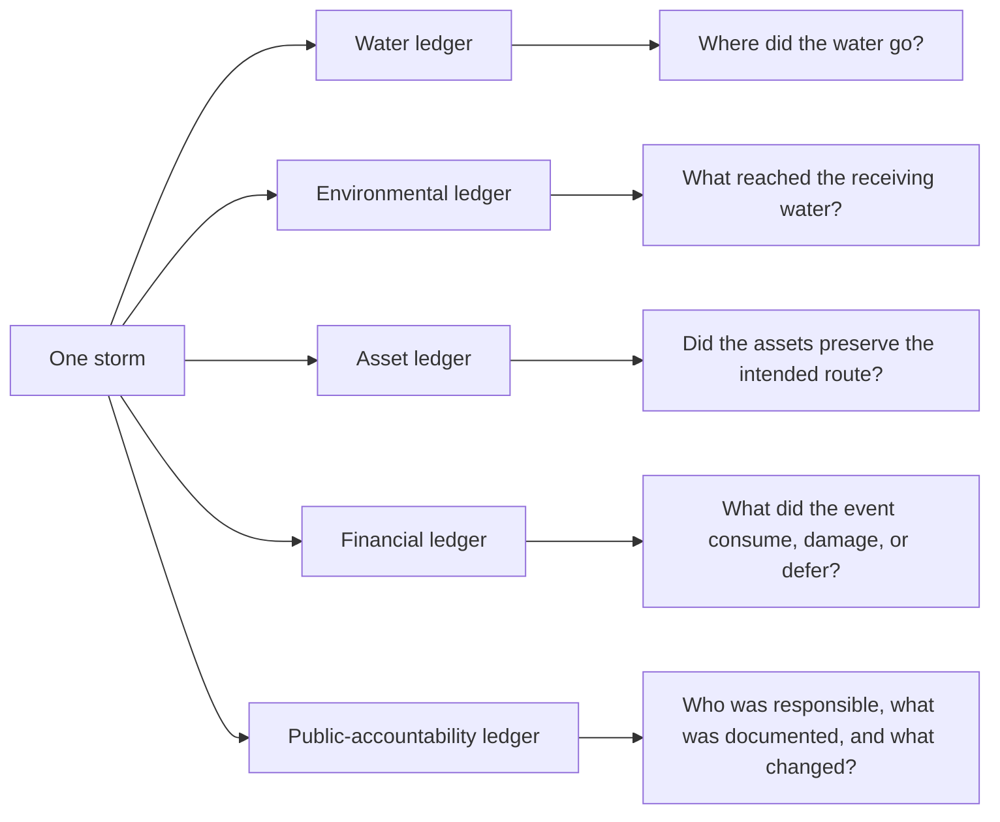
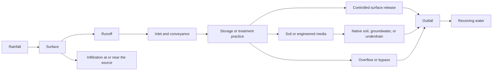
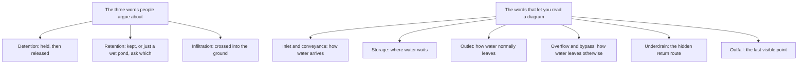
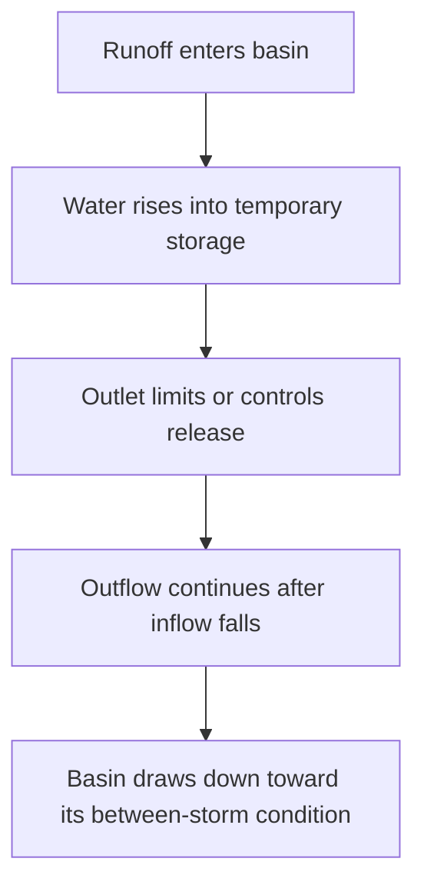
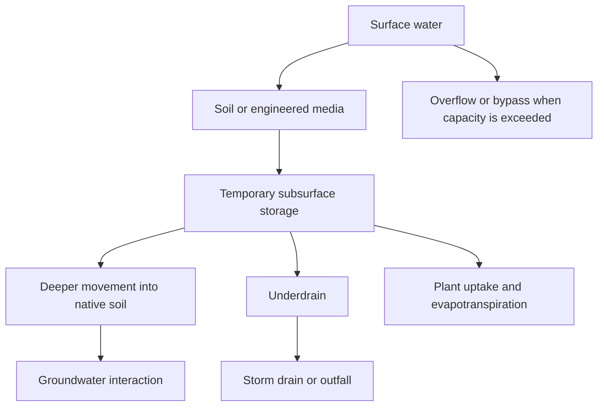
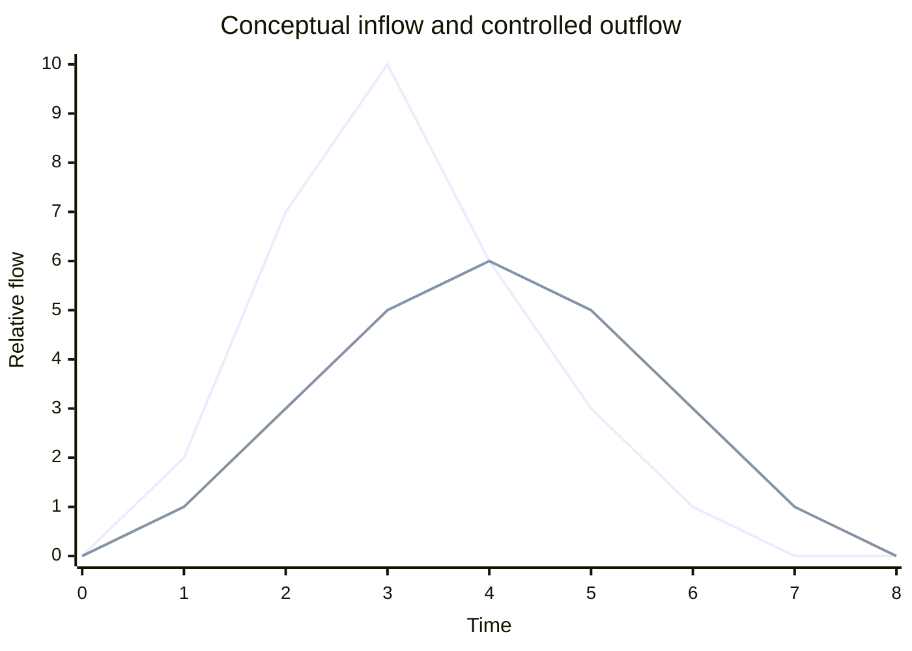
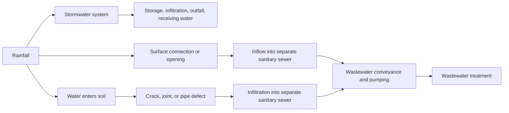

# Detention, Retention, and Infiltration

## Working status

This is the national research-expanded teaching paper for owner sparring. It replaces the earlier
outline with a complete plain-language explanation, an instructional sequence, conceptual diagrams,
source-supported claims, visible limitations, and a scored quality review.

Revision 0.6 added the reader orientation, the foundation definition set, worked examples, and
several terms and mechanisms the earlier draft used without defining. Revision 0.7 completed a
federal source search over those additions, recorded in
`research/added-terminology-source-dossier.md`. Nine of twelve anchored to a retrieved federal
source, and three were corrected rather than confirmed. Section 19 records every verdict and the
remaining evidence gaps. All records stay `verification_status: pending` until independent
verification and qualified review are complete.

It is not a design manual, operating procedure, permit interpretation, or jurisdiction-specific
standard. Qualified practitioner review, final claim verification, diagram review, and owner
approval for the teaching argument was recorded on July 26, 2026. Qualified practitioner review,
final claim verification, diagram review, storyboard approval, and HTML authorization remain open.
No replacement learner-facing HTML is authorized from this paper alone.

A separate Florida research paper now tests this national teaching thesis against Florida's
hydrology, aquifers, regional permitting structure, wet-pond terminology, downstream tailwater,
operation and maintenance responsibilities, long-term financial capability, and wastewater I&I.
That state material is intentionally isolated in
`research/florida-jurisdictional-white-paper.md`. It can inform owner sparring and a future private
Florida product, but it does not enter this public national narrative as universal authority.

## Start here

This section exists so that a reader who knows nothing about stormwater can decide, in under a
minute, whether this paper is written for them and what they will be able to do at the end of it.

### What this is about

Every time it rains on a developed place, the water has to go somewhere. Some of it sits in a pond.
Some of it soaks into the ground. Some of it runs down a pipe and into a creek. Some of it ends up
in a sewer where nobody wanted it. The words the water industry uses for those different fates are
**detention**, **retention**, and **infiltration**, and those three words are used loosely enough
that two professionals can use the same word to mean different things in the same meeting.

This paper is about what actually happens to the water, and why the name on the drawing is a weaker
piece of evidence than most people assume.

### Who this is for

This is written for anyone who has to talk about, pay for, inspect, approve, explain, or answer for
a stormwater asset without necessarily being the person who designed it. That includes utility
operators and inspectors, engineers working outside their specialty, asset managers, finance and
budget staff, utility executives, elected officials, developers, regulators, educators, and members
of the public who have been told a pond protects their neighborhood.

The only thing assumed is that you know rain runs off streets and roofs and goes into drains. No
hydrology, no hydraulics, and no regulatory background is required. Every term is defined before it
is used.

### Where and when this shows up

The concept becomes consequential in ordinary moments, not unusual ones:

- a design review where someone writes "provide retention" and nobody asks what that means;
- a neighborhood meeting after a street floods and a resident points at a pond;
- a budget cycle where a maintenance line and a capital line are competing;
- an inspection where a basin holds water it was not supposed to hold;
- a handoff where a developer transfers a stormwater practice to a utility;
- a wet-weather night when flow at the wastewater plant climbs and nobody can say why; and
- a permit report that has to describe what the program actually did.

### Why it matters

Getting this wrong is expensive in ways that are easy to miss. A utility can approve an asset that
does not do what its name implies. It can spend capital adding capacity when the real problem was a
blocked outlet. It can carry and treat rainwater in a sanitary sewer for years without attributing
the cost. It can tell the public that a pond prevents flooding and then lose credibility during the
storm that proves otherwise. It can inherit an asset with no record of what it was for, and
discover the gap only when performance is questioned.

None of those failures require anyone to be careless. They require only that people trust a familiar
word instead of tracing the water.

### What you will be able to do

After working through this paper you should be able to:

1. Explain detention, retention, and infiltration in ordinary language, and say why the words are
   used inconsistently.
2. Trace water through a dry basin, wet pond, bioretention cell, infiltration trench, permeable
   pavement system, and underground storage system.
3. Explain a permanent pool and the temporary storage above it.
4. Tell an inlet, outlet, overflow, bypass, outfall, and receiving water apart.
5. Read the basic story in a hydrograph without performing a design calculation.
6. Separate flow timing, runoff volume, pollutant concentration, and pollutant load.
7. Recognize how maintenance condition changes the intended water route.
8. Explain how rain becomes infiltration and inflow in a separate sanitary sewer, and why that costs
   money.
9. Explain in plain English what a permit does and what it cannot prove.
10. Ask the eleven questions that let you interrogate any stormwater asset you have never seen
    before.

### How long this takes

The full paper is a sustained read of roughly ninety minutes. The Concept Brief compiled from it
targets eighteen to twenty five minutes including the interactive checks.

### What this does not cover

This paper will not size, design, model, permit, inspect, operate, or certify anything. It does not
give you a drawdown time, an infiltration rate, a separation distance, a removal percentage, or a
compliance determination. It uses United States federal and EPA authority only. State requirements,
including Florida's, are handled separately and deliberately kept out of this national argument. The
complete boundary is in section 18.

## Executive teaching thesis

Detention, retention, and infiltration are not three labels for the same hole in the ground. They
describe different ways stormwater can be held, delayed, released, absorbed, treated, or routed.
The words matter because the route matters.

A utility professional does not need to be a stormwater designer to ask intelligent questions:

- Where did the water come from?
- Where can it wait?
- What controls how it leaves?
- Does it leave at the surface, below ground, or through both routes?
- What remains after the storm?
- What can block, bypass, or redirect the intended route?
- What evidence would show how the asset actually performed?

The paper's central teaching move is therefore simple:

> Follow the water before trusting the name.

A pond may hold a permanent pool and still detain additional stormwater above that pool. A
bioretention cell may infiltrate some water while an underdrain returns some water to the drainage
system. Permeable pavement may pass water into a stone reservoir without proving that all of it
reaches groundwater. A dry basin may look like an empty field between storms while still serving as
temporary storage during a storm. Appearance and name are clues. They are not the complete
hydraulic story.

## In 30 seconds

- **Detention** holds runoff for a while and releases it later.
- **Retention** can mean water kept from a later surface discharge, but the word is also commonly
  used for a wet pond with a permanent pool. Ask what the speaker means.
- **Infiltration** means water crosses from the surface into soil or other material below ground.
  It does not tell you where the water finally goes.
- **A permit** is the written set of conditions that turns water-protection law into responsibilities
  a named organization must carry out, document, and report.
- **The value** is not the pond, pipe, or pavement by itself. The value is the result the complete
  system preserves: fewer harmful discharges, usable drainage capacity, protected receiving waters,
  dependable assets, defensible spending, and public trust.

If the learner remembers one question, it should be this:

> Show me the complete water route, the intended result, the permit or program responsibility, and
> the evidence that the route still works.

## The value: one storm writes into five ledgers

The same rainfall event appears differently depending on who is looking at it. None of those views
is complete alone.



### Water value

The water value is controlled movement. Runoff arrives somewhere, occupies space, and leaves
somewhere. Detention, retention, infiltration, conveyance, and overflow are different ways of
managing that movement. Understanding them helps a utility see whether a problem is caused by too
much inflow, too little storage, a restricted outlet, a hidden bypass, downstream capacity, or an
incorrect assumption about where the water went.

### Environmental value

The environmental value is reducing the amount, rate, or pollutant load that can harm a receiving
water. A practice may slow flow, settle particles, filter water, support biological treatment,
reduce surface-discharge volume, or prevent polluted runoff from taking a direct route. These are
different benefits and require different evidence.

### Asset value

The asset value is preserved function over time. A basin is valuable because storage remains
available and its outlet works. Permeable pavement is valuable because water can still enter the
surface and use the storage below. A bioretention cell is valuable because its inlet, surface,
media, vegetation, underdrain, and overflow still work as a connected route.

The purchase price buys the asset. Inspection, maintenance, records, and renewal preserve the
service.

### Financial value

The financial value is spending for a known result. Shared concept knowledge helps a finance team
distinguish:

- a new-capacity request from a maintenance backlog;
- a flood-storage objective from a pollutant-control objective;
- a visible landscape feature from a functioning stormwater asset;
- routine work from rehabilitation or replacement;
- stormwater spending from wastewater costs caused by I&I; and
- a low first cost from a lower lifecycle cost.

A utility can otherwise pay three times: once to build the asset, again to recover performance
after neglected maintenance, and a third time for downstream damage or added capacity that earlier
action might have reduced.

### Public-accountability value

The public-accountability value is a visible chain from responsibility to evidence. The public
should be able to understand who manages the system, what outcome is intended, what the permit or
program requires, how progress is measured, and how problems are corrected.

This is where permits become important. A permit is not paperwork sitting beside the real system.
It is one of the ways the public system says who must do what, how they must show it, and what
happens when the obligation is not met.

## What are we teaching, and why?

We are teaching a shared mental model for stormwater. The learner should see a rainfall event as a
connected sequence rather than a collection of isolated assets:



This shared picture is important because stormwater crosses organizational boundaries. Engineers
may discuss rainfall distributions, hydrographs, routing, storage, and model assumptions. Operators
and inspectors may see sediment, erosion, vegetation, blocked openings, standing water, or a damaged
outlet. Finance teams may see rehabilitation, inspection, energy, lifecycle cost, and constrained
capacity. Executives and elected officials may see flooding, neighborhood complaints, development,
water quality, and long-term risk. Wastewater professionals may see rainfall appear in a separate
sanitary sewer as infiltration and inflow.

The brief should allow all of these people to hold the same conversation without pretending they
perform the same job.

## Learning outcomes recorded in the package

These are the same outcomes stated in "What you will be able to do" above, written in the form
carried by `learning.yaml` and rendered on the compiled brief. The paper and the package make one
promise, not two.

After the eventual Concept Brief, a learner should be able to:

1. Explain detention, retention, and infiltration in ordinary language.
2. Trace water through a dry basin, wet pond, bioretention cell, infiltration trench, permeable
   pavement system, and underground storage system at a conceptual level.
3. Explain a permanent pool and temporary storage above that pool.
4. Distinguish an inlet, outlet, overflow, bypass, outfall, and receiving water.
5. Read the basic story in a hydrograph without performing a design calculation.
6. Explain why water balance, routing, and models are used.
7. Separate flow timing, runoff volume, pollutant concentration, and pollutant load.
8. Recognize how maintenance condition can change the intended water route.
9. Explain how stormwater and groundwater become infiltration and inflow in a separate sanitary
   sewer.
10. Explain in simple English why NPDES permits, MS4 programs, monitoring, reporting, and long-term
    maintenance responsibilities matter.
11. Connect the concept to environmental, asset, financial, compliance, and public-accountability
    value.
12. Ask design, maintenance, budget, permit, and policy questions that match the evidence available.

## The words this paper depends on

Nothing below this point assumes you already know these words. Each one is given a plain meaning,
something concrete to picture, and an explicit statement of what the word does **not** establish.
That third part matters most. Almost every expensive misunderstanding in this subject comes from a
word being asked to prove more than it can.

These entries carry the same four-part structure the compiled Concept Brief uses, so the paper and
the rendered page teach the same definitions in the same shape.

**Stormwater runoff.** Rain that does not soak in, evaporate, or get caught on a surface, and
instead flows across the ground toward somewhere lower. *Picture it:* water sheeting across a
parking lot toward a grate in the corner. *What it does not tell you:* how clean it is, where it
ends up, or whether anything is managing it.

**Storage.** Space where water is allowed to collect and sit for a while instead of continuing
downstream. *Picture it:* the empty bowl of a grassy basin behind a shopping center that fills
during a storm. *What it does not tell you:* how much space is actually available today, since
sediment and debris consume storage over time.

**Detention.** Holding water temporarily and letting it out afterward. *Picture it:* a crowd leaving
a stadium through one gate. Everyone gets out, but it takes longer, and the street outside is never
as crowded as the stadium was. *What it does not tell you:* how much water leaves in total.
Detention changes the timing far more than it changes the amount.

**Retention.** In the strict sense, water that is kept and does not leave later through a surface
outlet during that event. In everyday use, the phrase "retention pond" usually just means a pond
with water in it all the time. *Picture it:* a neighborhood pond that always looks full. *What it
does not tell you:* which of those two meanings the speaker intends. This is the single most
reliable source of confusion in the subject, so ask.

**Infiltration.** Water crossing from the surface down into soil or engineered material. *Picture
it:* rain vanishing into a lawn while the driveway beside it runs. *What it does not tell you:*
where the water finally goes. Crossing into the ground is a boundary crossing, not a destination.

**Permanent pool.** The water a wet pond is designed to keep between storms. *Picture it:* the
normal water line you see on an ordinary dry day, with a ring of vegetation around it. *What it does
not tell you:* that the pond is full or that no storage remains. Storm storage is normally provided
*above* the permanent pool.

**Outlet.** The structure that controls how water leaves a storage practice under ordinary
conditions. *Picture it:* a concrete riser standing in a basin with a small hole near its base and a
grate on top. *What it does not tell you:* that it is clear. A blocked outlet changes everything
downstream of it and is invisible from the road.

**Overflow.** The route water uses when it rises higher than the ordinary outlet can handle.
*Picture it:* a broad low notch in the earthen bank of a pond, usually dry, mowed, and easy to
mistake for landscaping. *What it does not tell you:* that it has ever been used, or that it is
sized for the storm you are worried about.

**Bypass.** Water that skips some or all of the intended storage or treatment path. *Picture it:*
runoff sliding past a clogged inlet and continuing down the gutter instead of entering the practice
it was supposed to enter. *What it does not tell you:* that anything is broken. Some bypass is
designed. Some is accidental. The two look identical from a distance.

**Underdrain.** A buried pipe or drainage layer that collects water after it has passed through
soil or engineered media, and carries it away. *Picture it:* a perforated pipe in a stone bed under
a rain garden, connected back to the storm drain. *What it does not tell you:* nothing about
recharge. If a practice has an underdrain, much of the water may return to the pipe network rather
than reaching groundwater.

**Outfall.** The point where flow leaves a drainage or sewer system and enters another system or
the environment. *Picture it:* a pipe end in a creek bank. *What it does not tell you:* what
happened upstream. An outfall is the last visible link in a long chain.

Two more words appear constantly and are worth fixing now.

**Impervious surface.** Ground covered by something water cannot readily pass through. *Picture it:*
asphalt, a roof, a concrete slab. *What it does not tell you:* that no water enters the ground
anywhere nearby, or how much runoff results, which also depends on the storm, the slope, and where
the water is directed.

**Evapotranspiration.** The combined return of water to the air by evaporation from surfaces and by
plants drawing water up and releasing it. *Picture it:* a planted bioretention cell that is visibly
drier three days after a storm than the bare gravel strip beside it. *What it does not tell you:*
a quantity. It is a real exit from the system, but it is slow and it varies with season, weather,
and vegetation.



**How to read this diagram:** the top group is the vocabulary people disagree about. The bottom
group is the vocabulary that settles the disagreement, because those words describe physical routes
rather than categories. **This does not prove:** that any particular asset has all of these parts.

## 1. Begin with the storm

### Rainfall is an input, not yet runoff

Rainfall is described by more than a total depth. The intensity tells us how quickly rain is
falling. Duration tells us how long it lasts. Distribution tells us how rainfall varies through the
event and across an area. These differences matter because two storms with the same total depth can
produce different peak flows, runoff volumes, storage needs, and downstream responses.

When rain reaches a surface, several things can happen. Water can wet and collect on the surface,
evaporate, enter vegetation, soak into the ground, or begin moving downhill as runoff. The share
that becomes runoff depends on the storm, the soil, slope, vegetation, existing wetness, drainage
area, and land cover. Roofs, roads, and other impervious surfaces generally reduce the area where
water can enter the soil and provide direct routes into drainage systems. The U.S. Geological
Survey identifies rainfall characteristics, soils, land use, drainage area, slope, and vegetation
among the factors affecting runoff (U.S. Geological Survey, n.d.-a).

### Runoff

**Runoff** is the water that flows over the land surface or through drainage pathways after
precipitation. In developed areas, runoff can move across pavement, enter a curb inlet or catch
basin, travel through a pipe or channel, and reach a stormwater control or receiving water. Along
the way it can pick up sediment, trash, nutrients, oils, chemicals, and other material from the
surfaces it crosses (U.S. Environmental Protection Agency [EPA], 2026a).

### Drainage area

A **drainage area** is the land area contributing water to a selected point. That point might be an
inlet, basin, pipe, stream, or outfall. The boundary depends on the question being asked. A small
inlet has a local drainage area. A stream has a larger watershed. The phrase does not mean that
every drop follows the same route, only that the defined area can contribute water to the point
under the conditions being studied.

### The first system question

The first useful question is not, “Is that pond detention or retention?” It is:

> What enters this place, what can happen while water is here, and where can the water go next?

That question works for every practice in this paper.

## 2. Detention: hold now, release later

### Plain-language meaning

**Detention** means temporary storage followed by release. In stormwater, the practice accepts
runoff faster than it releases it for at least part of the event. The difference between inflow and
outflow causes water to occupy available storage. An outlet controls or influences the release.

The everyday analogy is a doorway. If people enter a room faster than they can leave through a
single door, the room temporarily fills. The room is storage. The door is the outlet. Widening,
narrowing, blocking, or changing the door changes how quickly the room empties. Stormwater systems
are more complex, but the relationship is the same.

EPA describes detention basins as systems that collect runoff and reduce the rate of flow to
surface waters. A typical detention basin has no permanent pool, has a low outlet, and drains
between storms (EPA, n.d.-a). The word “typical” is important. It is a general concept, not a
universal design definition.

### Dry detention basin

A **dry detention basin** is normally dry between storms, except for groundwater, small wet areas,
or water that has not yet drawn down. During a storm, water enters and rises into temporary storage.
The outlet releases water over time. After the event, the basin is intended to drain toward its
between-storm condition.



What a dry basin can teach visually:

- The basin floor and side slopes define part of the storage space.
- The inlet defines where runoff arrives.
- The outlet helps define how water leaves under ordinary conditions.
- A higher overflow or emergency route provides another path when water reaches a different level.
- Sediment, debris, erosion, or damage can change the route.

What a dry appearance cannot prove:

- that the basin has its intended storage volume;
- that it releases water at the intended rate;
- that the outlet is clear;
- that it provides a particular level of flood control or pollutant removal;
- that it complies with a permit or local standard; or
- that water did not bypass the basin during a larger event.

### Extended detention

**Extended detention** means that a selected portion of captured runoff is released over a longer
period than an immediate pass-through. The concept is additional time, not a universal number of
hours. The applicable duration depends on the design objective and governing requirements. This
brief should teach why delayed release matters without supplying a sizing criterion.

Additional time can support settling of some particles and can change the timing of downstream
flow. It does not prove that every pollutant is removed or that downstream flooding is prevented.

### Detention time and residence time

These two terms both describe how long water stays in a practice, and the honest position is that
they are not cleanly separated in federal usage.

EPA's stormwater design guide defines **detention time** as "the theoretical time required to
displace the contents of a stormwater treatment facility at a given rate of discharge (volume
divided by rate of discharge)" (EPA, 2004). EPA's SWMM reference defines **hydraulic residence
time** as "the average time that water has spent within a completely mixed storage node" (EPA,
2016). Those are close to the same quantity under two names.

So do not carry a confident distinction into a meeting. What is worth carrying is the underlying
idea and one question. The idea: a bigger stored volume, or a slower release, means water stays
longer. The question: when a document gives you a detention or residence time, ask how it was
computed and whether it is a theoretical displacement time or a measured one, because a theoretical
number assumes complete mixing that a real basin with short-circuiting may not deliver.

Longer detention time gives settling more opportunity to occur. It also means storage is still
occupied if a second storm arrives, which is why back-to-back storms behave differently from a
single storm of the same total depth.

### What detention changes

Detention is often intended to reduce the peak rate of discharge by spreading release over time. It
can create a lower, later outflow peak than the inflow peak. Whether that benefit reaches a
particular downstream location depends on the storm, basin, outlet, other tributary flows, and
timing across the system.

Detention does not necessarily reduce the total runoff volume by much. A basin can release nearly
all captured water later. That is why peak flow and runoff volume must be kept separate.

> **Worked example: the basin that "did not work"**
>
> **The situation.** A utility receives complaints that a detention basin serving a commercial
> development "is not working." Residents downstream report that the creek still rises after storms.
> The basin was inspected and found to be in reasonable condition. The outlet is clear. The basin
> filled during the storm and drained afterward, as intended.
>
> **Working it through.** Ask what the basin was intended to change. Detention holds water and
> releases it later. Total volume leaving the site over the full event is close to the volume that
> entered, because a basin with a surface outlet is a delay device, not a disposal device. If the
> complaint is that water still arrives in the creek, the basin was never going to prevent that. If
> the complaint is that the creek rises as fast and as high as it did before the development, that
> is a different claim, and it would need the inflow and outflow behavior, the contributing area,
> and what else drains to the same reach.
>
> **What you conclude.** "Not working" is not yet a finding. The basin may be doing exactly what
> detention does while failing to deliver what the community was told it would deliver. Those are
> different problems: one is an asset problem, the other is an explanation problem. The investigation
> and the fix are not the same in each case.
>
> **Where this stops.** This reasoning identifies which question to ask. It does not establish
> whether this basin meets its design basis, whether the design basis was appropriate, or whether
> anything downstream requires a capital response. That takes site records, monitoring, and
> qualified engineering review.

## 3. Retention and the language problem

### Why the term requires care

**Retention** is used in more than one way in stormwater practice. In a strict water-routing sense,
retained water is not discharged later through a surface outlet as part of the same runoff event.
It may infiltrate, evaporate, be reused, or remain in storage. In common asset naming, however,
“retention pond” often refers to a constructed wet pond with a permanent pool. EPA itself notes that
wet ponds are also called stormwater ponds, wet retention ponds, or wet extended detention ponds
(EPA, 2021a).

This is not a reason to abandon the word. It is a reason to ask what the speaker means.

### Wet pond or wet detention pond

A **wet pond** is a constructed basin with a pool of water that remains between storms for all or
part of the year. Incoming runoff raises the water level above the normal pool. Water stored above
the pool can be released through an outlet over time. Sediment settling and biological processes
within the pond may contribute to pollutant removal, especially for pollutants associated with
settleable solids (EPA, 2021a).

This configuration can combine functions:

- a permanent pool below the normal water level;
- temporary detention storage above that pool;
- a controlled outlet;
- an overflow or emergency route;
- pretreatment, such as a forebay;
- a shoreline and vegetated edge; and
- a downstream outfall or receiving-water connection.

That is why “wet detention” is a useful teaching phrase. The asset can remain wet and still detain
additional stormwater.

### Permanent pool

A **permanent pool** is the water intended to remain in a wet pond between storm events, subject to
seasonal and site conditions. It is the pond's normal stored water, not unused empty space.

During a storm, new runoff enters. The water surface rises above the normal pool and occupies
temporary storage. Outflow may occur through an outlet. The incoming water does not simply sit on
top as a separate layer. It mixes, moves through, and displaces water already in the pond.


The permanent pool can support settling and biological activity, but it also creates management
questions. Sediment accumulates. Shorelines can erode. Vegetation changes. Debris can reach the
outlet. Water can stratify by temperature and oxygen condition. A pond can warm runoff. These are
reasons to avoid the simplistic claim that permanent water automatically means better treatment.

### The Florida visual lens

Many Florida communities contain man-made lakes or ponds beside roads, neighborhoods, and
commercial development. For a broad audience, these are powerful visual examples because the water
is familiar and visible.

The correct lesson is not that every Florida pond is the same. From appearance alone, a viewer
cannot know:

- the contributing drainage area;
- the normal pool elevation;
- the available temporary storage;
- whether the pool is connected to groundwater;
- where the outlet or overflow is;
- whether pumps, control structures, or interconnected ponds are involved;
- the intended flood or water-quality objective;
- the maintenance responsibility; or
- the applicable permit and design basis.

The pond should be read as a system. Where does water enter? Where is the normal pool? How high can
the water rise? What controls release? Where is the overflow? What receiving system lies
downstream? The familiar landscape becomes an invitation to ask better questions, not permission to
infer a design.

### What sets the normal water level, and the littoral zone

Two more things belong to the wet pond, and both are commonly misread from the roadside.

The first is the mechanism that sets the normal water level. The outlet arrangement establishes it.
EPA's wet ponds guidance describes one common example: a reverse-slope pipe drawing from below the
permanent pool, angled up to the riser, which "establishes the water elevation of the permanent
pool" (EPA, 2021a). The pond has a normal appearance because a structure decided it would.

Some jurisdictions call that level the **control elevation**. That phrase is state regulatory
vocabulary rather than a federally defined term, so this paper does not adopt it as national
language. Learners will meet it in permits and plans in some places and should recognize it, while
knowing it carries whatever definition its own governing document assigns.

The instructional point survives either way. When people say a pond "looks low" or "looks high,"
they are making an unstated comparison against a normal water elevation they have not actually seen
documented.

The **littoral zone** is the shallow, vegetated margin around the edge of a pond. It is sometimes
provided deliberately for habitat, shoreline stability, or treatment. From a distance it can look
like a maintenance failure, and a well-intentioned decision to clear it can remove a designed
feature. This is a good example of why appearance is weak evidence in both directions: neglect can
look intentional, and intent can look like neglect.

### Forebay and pretreatment

A **forebay** is a smaller zone near an inlet where coarse sediment and debris can settle before
water reaches the main pool or treatment area. **Pretreatment** is the broader idea of removing or
managing material before it reaches a component that would be harder to clean or protect.

The instructional point is lifecycle logic. Capturing coarse material where it is accessible can
reduce the burden elsewhere. It does not eliminate the need to inspect or maintain the rest of the
system.

## 4. Infiltration: water enters the ground, but then what?

### Hydrologic meaning

In stormwater, **infiltration** is the movement of water from the surface into soil or other
subsurface material. It is a boundary crossing. Water was at the surface; now it has entered pore
spaces below.

The word does not identify the final destination. After entering a practice, water may:

- remain temporarily in soil or engineered media;
- move deeper into native soil;
- contribute to groundwater recharge where conditions permit;
- move laterally;
- enter an underdrain;
- return to a pipe, channel, or outfall;
- be taken up by vegetation and later evapotranspired; or
- encounter a limiting layer and cause longer ponding or overflow.



The aha factor is that water disappearing from view is not the same as water disappearing from the
system.

### Infiltration rate and infiltration capacity

These two terms are often used interchangeably, and the difference is worth holding onto.

**Infiltration rate** is the rate at which water is actually entering the surface right now. It can
be limited by how much water is available. A light drizzle on dry sand produces a low infiltration
rate simply because little water is arriving.

**Infiltration capacity** is the maximum rate the surface and the material below it *could* accept
at that moment if enough water were available. It is a property of the ground and its current
condition, not of the storm.

The relationship is the useful part. When rainfall intensity is below the infiltration capacity,
essentially everything can enter the ground and little runoff forms. When rainfall intensity exceeds
the infiltration capacity, the surplus becomes runoff. That single comparison explains why the same
soil can behave completely differently in a gentle rain and a downpour.

Infiltration capacity is not a fixed label for a site. It generally declines during a storm as the
soil wets up, and it changes over months and years with soil texture, structure, compaction,
antecedent moisture, sediment accumulation, construction disturbance, groundwater level, vegetation,
and maintenance. A practice that infiltrated readily on the day it was accepted may not do so after
several years of sediment loading.

A related term appears in reports. **Hydraulic conductivity** describes how readily a saturated
material transmits water through itself. It is a property of the material rather than a description
of a surface accepting water, so it is not a synonym for infiltration capacity even though the two
are related and are often measured to support the same decision.

This paper will not provide a universal acceptable rate. A number has meaning only when the test
method, location, depth, season, antecedent condition, and design use are known alongside it.

### Groundwater and contamination

Infiltration may support recharge, but it is not suitable everywhere or for every runoff source.
EPA advises that soil, groundwater, land use, runoff quality, contaminated soil, and pretreatment
can affect whether and how infiltration should be used (EPA, n.d.-b).

This creates an important evidence boundary. A learner may identify the questions, but cannot
declare a site suitable from a photograph or a general concept brief.

### Underdrain

An **underdrain** is a subsurface pipe or drainage layer that collects water after it passes through
soil, stone, or engineered media. It provides a designed exit when complete infiltration into native
soil is not expected or not intended.

An underdrained practice can still use soil and media for storage or treatment. It should not be
described as if all captured water becomes groundwater recharge. The correct route may be:

> runoff to surface storage, through media, into an underdrain, back to a storm pipe, through an
> outfall, and then to a receiving water.

## 5. Common configurations

### Bioretention cell

A **bioretention cell** is a shallow, engineered, vegetated depression that receives stormwater.
Water may pond temporarily at the surface, pass through planted soil or engineered media, enter
native soil, and leave through an underdrain or overflow. EPA distinguishes this engineered practice
from a less engineered residential rain garden (EPA, n.d.-c).

What enters: runoff from a defined drainage area.

Where water waits: surface ponding and pore space within soil or media.

Where treatment may occur: pretreatment, filtration, settling, sorption, plant uptake, and
biological processes, depending on design and conditions.

Normal exits: infiltration into native soil, underdrain discharge, and evapotranspiration.

Other exits: overflow or bypass during events or conditions beyond available capacity.

Questions that matter: What is the drainage area? Is there pretreatment? Is there an underdrain?
Where does it discharge? What is the intended ponding and drawdown behavior? Has sediment sealed the
surface? Is vegetation helping or blocking the intended route?

### Infiltration trench

An **infiltration trench** is an excavated trench filled with stone or other porous material that
creates temporary storage and contact with surrounding soil. Runoff commonly receives pretreatment
before entering because sediment can clog the void space and soil interface. Stored water is
intended to infiltrate into adjacent native soil where the site is suitable (EPA, 2021b).

The visible top may be stone, vegetation, or another surface. Much of the functional asset is below
ground. That makes records, inspection points, pretreatment condition, and knowledge of the
subsurface layout especially important.

### Permeable pavement

**Permeable pavement** is a pavement system designed to allow water through openings or porous
material into an underlying stone reservoir. The surface may use porous asphalt, pervious concrete,
or permeable interlocking pavers. Water can be stored below the traffic surface, infiltrate into
native soil, or leave through an underdrain (EPA, n.d.-c).

Permeable does not mean maintenance-free. Sediment can reduce surface permeability. The pavement
also has a structural job, so drainage and load-bearing performance must coexist. A parking surface
that looks ordinary may contain an entire storage layer below it.

### Vegetated swale

A **vegetated swale** is a shallow, planted channel that conveys runoff more slowly than a smooth
pipe or paved channel. It may support settling, filtration, infiltration, and treatment while
moving water downstream. Some swales include engineered soil, check dams, or underdrains. Others are
primarily conveyance.

The name “swale” therefore does not prove infiltration or treatment. Slope, vegetation, soil,
geometry, flow depth, and downstream connection matter.

### Underground detention

**Underground detention** stores stormwater in buried chambers, vaults, large pipes, or stone voids
and releases it through an outlet. It can preserve usable surface space, but the principal water
path is hidden.

The same questions still apply: What enters? How much storage remains available? What controls
outflow? Where is the overflow? Can sediment be removed? How is the structure accessed and
inspected? Is it detention only, or can water also infiltrate?

### Practice family comparison

| Configuration | Between storms | Temporary storage | Possible ordinary exits | What the name does not prove |
| --- | --- | --- | --- | --- |
| Dry detention basin | Generally dry | Above the basin floor | Controlled surface outlet, possible infiltration | Actual capacity, release rate, or pollutant performance |
| Wet pond | Permanent pool remains | Above normal pool | Controlled outlet, evaporation, limited infiltration | That every wet pond works the same way |
| Bioretention cell | Usually no permanent open-water pool | Surface and media pore space | Native soil, underdrain, evapotranspiration | That all water recharges groundwater |
| Infiltration trench | Storage is mostly below ground | Stone or porous void space | Surrounding native soil, sometimes underdrain | Suitability, remaining void space, or actual infiltration rate |
| Permeable pavement | Traffic surface remains in use | Stone reservoir below | Native soil, underdrain | That the surface is unclogged or that all water infiltrates |
| Underground detention | Hidden and usually empty | Chambers, vault, pipe, or stone | Controlled outlet, sometimes soil | Accessible condition or available volume |

## 6. The pieces that control the route

### Inlet

An **inlet** is a point where water enters a drainage component. It may be a curb opening, grate,
pipe, flume, channel, or surface edge. Inlet condition matters because blockage or erosion can
redirect water before it reaches the intended practice.

### Conveyance

**Conveyance** means the pipes, channels, gutters, swales, and other features that move water from
one place to another. Storage and conveyance are related. Water can occupy volume within a pipe or
channel, but the primary teaching distinction is that conveyance moves water while a storage
practice deliberately holds a changing volume.

### Outlet structure

An **outlet structure** controls or directs water leaving a storage practice. It may include an
orifice, weir, riser, pipe, valve, grate, trash rack, or combination of components.

An **orifice** is an opening through which water flows. A **weir** is an edge or crest over which
water flows. Different openings can become active at different water levels. That means a pond or
basin may have one release behavior at a lower stage and another at a higher stage.

### Stage

**Stage** is the water-surface elevation at a location. In a basin, stage is the height of the water
surface relative to a reference. As stage rises, available storage, wetted area, and active outlet
openings can change.

### Drawdown

**Drawdown** is the decline in stored water level or volume after inflow decreases. Watching
drawdown can reveal whether water is leaving, but not necessarily through which route. Controlled
outflow, infiltration, evaporation, leakage, or pumping may all contribute.

### Overflow, emergency spillway, and bypass

An **overflow** is a route used when water reaches a higher level than the ordinary outlet can
manage. An **emergency spillway** is a deliberately provided route for safely conveying high water
around or through an embankment system. A **bypass** is water that avoids some or all of the intended
storage or treatment path.

These terms are not interchangeable in every design, but they share one lesson: the ordinary route
is not the only route.

### Freeboard

**Freeboard** is the vertical distance between the highest water surface expected under a stated
condition and the top of a containing structure such as an embankment or wall. It is deliberate
margin. Its purpose is to absorb the difference between what was analyzed and what actually happens:
wave action, settlement, debris at an outlet, a storm larger than the one evaluated, or an
assumption that turned out to be optimistic.

Freeboard is worth naming in a concept brief because it is one of the few places where the design
process openly admits uncertainty. When freeboard is consumed by accumulated sediment or by a
raised embankment path, a margin that someone chose on purpose has been quietly spent.

### Tailwater

**Tailwater** is the water level in the receiving system just downstream of an outlet. It matters
because an outlet does not discharge into empty air. It discharges into whatever is already there.

When the downstream water level rises, the difference in level across the outlet shrinks, and the
outlet releases water more slowly than it would into a low downstream condition. This is one of the
most important and least intuitive ideas in the subject. A basin can behave exactly as expected
during a small storm and behave very differently during a large regional storm, not because anything
about the basin changed, but because the creek it drains into came up.

Tailwater is also why a practice can be in good condition and still hold water longer than expected.
Before concluding that an outlet is blocked, it is worth asking what the receiving water was doing
at the same time.

### Outfall

An **outfall** is the discharge point where flow leaves a drainage or sewer conveyance and enters
another system or the environment. It may be a pipe end, channel discharge, or another defined
release point. In regulatory programs, the exact definition depends on the program and permit.

An outfall is not the whole stormwater system. It is the visible end of an upstream network and the
beginning of a downstream consequence.

### Receiving water

A **receiving water** is the stream, river, lake, estuary, wetland, coastal water, or other water
body receiving a discharge. The same outflow may have different consequences depending on the
receiving water's condition, capacity, temperature sensitivity, erosion susceptibility, and other
inflows.

## 7. Read a hydrograph without doing the design

### Hydrograph

A **hydrograph** is a graph showing how flow or water level changes over time. The horizontal axis
is time. The vertical axis commonly shows flow or stage. Rainfall may be plotted with it to show the
relationship between the storm and the response (U.S. Geological Survey, n.d.-b).



This is a qualitative teaching graphic, not a modeled storm. It illustrates four ideas:

1. **Rising limb:** flow increases as runoff reaches the point.
2. **Peak flow:** the highest plotted rate during the event.
3. **Falling limb:** flow decreases as the system drains.
4. **Timing or lag:** the outflow response may peak later than inflow.

The area under a flow-versus-time curve represents volume. A lower peak does not automatically mean
less total volume. The curve may simply be spread over a longer time.

> **Worked example: reading a paired hydrograph without doing the math**
>
> **The situation.** You are handed a chart with two curves. One is labeled inflow and one outflow.
> The outflow curve is lower and its high point sits to the right of the inflow high point. Someone
> asks whether this proves the basin reduced runoff.
>
> **Working it through.** Take the two claims separately. The outflow peak is lower, so the highest
> rate leaving is less than the highest rate arriving. That is a timing and rate statement, and the
> chart supports it. The second claim is about amount, and amount on this kind of chart is the area
> underneath a curve, not the height of it. A curve that is lower but stretched further to the right
> can enclose nearly the same area. Nothing about a lower peak by itself tells you the area shrank.
>
> **What you conclude.** The chart supports "the peak rate was reduced and delayed." It does not
> support "less water left the site." To say anything about volume you would have to compare the
> areas, and to say anything about pollutants you would need concentration data as well.
>
> **Where this stops.** This is how to read the shape of a graph. It does not tell you whether the
> graph is right. The curves came from measurement or from a model, and either one carries
> assumptions that have to be examined separately.

### Time of concentration

**Time of concentration** is the time it takes for water to travel from the most hydraulically
distant part of a drainage area to the point being studied. It is the reason a hydrograph has a
shape at all rather than being a single spike.

The concept explains something that surprises people. Development often shortens this travel time,
because water moves faster over pavement and through smooth pipes than across grass and soil. When
water from the whole area arrives at the outlet in a shorter window, it arrives more concentrated in
time, and the peak rises even if the total amount of water had not changed. Detention works partly
by pushing that timing back out again.

### Routing

**Routing** is the calculation or reasoning used to move an inflow hydrograph through storage or a
conveyance system and estimate the resulting outflow hydrograph. In a storage practice, routing
connects:

- how much water enters over time;
- how storage changes as water accumulates;
- how outlet flow changes with stage; and
- how much water leaves over time.

The plain-language rule is:

> When inflow exceeds all exits, storage rises. When exits exceed inflow, storage falls.

### Design storm

A **design storm** is a defined rainfall input used for analysis or design. It can specify depth,
duration, temporal distribution, and recurrence characteristics. It is a selected analytical event,
not a promise that nature will reproduce the same pattern or that no larger event will occur.

This paper does not prescribe a design storm. It teaches why asking “Which storm, with what
distribution, for what objective?” is more useful than asking only, “Was it designed?”

### Water balance

A **water balance** accounts for water entering, leaving, and remaining in a defined system over a
defined period.

```text
Inflow = surface outflow + infiltration + underdrain flow
       + evapotranspiration + other losses + change in storage
```

This is a conceptual accounting identity, not a sizing equation for this brief. The time period and
system boundary must be stated. If the boundary changes, the terms change. Water entering an
underdrain is an exit from the media but may still be inside the larger stormwater system.

### Model

A **model** is a simplified representation used to estimate how a real system may behave. EPA's
Storm Water Management Model can simulate runoff quantity and quality and the performance of
drainage systems for single events or continuous periods (EPA, 2025a).

A model needs inputs, assumptions, equations, and a defined purpose. Results can be useful without
being certain. The correct question is not “Did the model give a number?” It is:

- What system and storm were represented?
- Which processes and routes were included?
- What data supported the inputs?
- Was the model checked against observations?
- Which assumptions most affect the result?
- What uncertainty remains?

**Calibration** is the process of adjusting reasonable model parameters so modeled results better
match observed data. **Validation** tests performance against other observations. Neither makes a
model perfect. **Uncertainty** is the range of what is not known exactly, including rainfall,
conditions, measurements, parameters, and future change.

## 8. Flood management and water quality are related, not identical

### Peak flow, timing, and flood risk

Detention can reduce and delay a discharge peak at an outlet. Infiltration and evapotranspiration
can reduce the volume reaching a surface outlet. These changes may support flood management, but no
individual practice can be assumed to prevent flooding everywhere downstream.

Flooding depends on the whole system: rainfall, antecedent wetness, drainage area, conveyance,
storage, outlet behavior, tailwater, other tributaries, receiving-system capacity, blockages, and
event timing. A local improvement can still meet a downstream bottleneck.

### When delay is not a benefit

There is a consequence of detention that deserves to be taught rather than discovered, because it
runs against the intuition the rest of this section builds.

Detention delays a discharge. Downstream, flows from many contributing areas combine, and each one
arrives on its own schedule. If a site's release is delayed into the moment when flow from the rest
of the watershed is already passing, the delayed release can add to a peak instead of missing it.
Each individual basin can meet its own release condition at its own outlet while the combined effect
at a downstream point is no better, and in some arrangements worse, than it would have been without
the delay.

This is not speculation. EPA's stormwater design guide states it as a generalization drawn from a
body of studies: some watershed-wide systems of detention basins do keep downstream peaks lower,
while "other individual basins do the opposite of lessening the discharge; they actually increase
downstream peak discharges as a result of the overlapping of their detained volumes with mainstream
peaks." The same chapter puts the mechanism plainly: detention does not eliminate runoff, it delays
it, the volume leaving equals the volume entering, and "when the post development volumes from
different tributaries join downstream, there is nothing to prevent them from combining to produce
inadvertently high peak rates" (EPA, 2004).

EPA also notes the other side, that selectively located basins can reduce flood peaks. The point is
not that detention fails. It is that the outcome depends on placement and timing across a watershed
and cannot be read off a single site.

This is therefore an argument against evaluating detention only at the outlet of the site that
contains it. The right question is not "does this basin lower its own peak," but "what does this
basin do to flow at the place people actually care about, given everything else that drains there."

That question is answered with watershed-scale analysis, not by inspecting a basin. The instructional
point for a non-designer is narrower and still valuable: a row of individually compliant basins is
not automatically a watershed solution, and asking how the timing was evaluated across the whole
system is a legitimate and often unasked question.

### Velocity and erosion

Flow rate, depth, slope, channel condition, and outlet geometry affect velocity and erosive force.
Reducing a peak or stabilizing an outfall may reduce erosion potential at a location. That does not
prove that erosion cannot occur elsewhere or during a larger event.

### Concentration, volume, and load

**Pollutant concentration** is the amount of a substance in a given volume of water. **Discharged
volume** is the amount of water leaving. **Pollutant load** is the mass of pollutant transported over
a period or event.

At a simple conceptual level, for a single storm:

```text
Pollutant load = discharged water volume x event mean concentration
```

The qualifier matters. Concentration is not constant during a storm, so a single number multiplied
by a volume has to be a concentration that represents the event as a whole. That flow-weighted
average is what practitioners call an **event mean concentration**, usually shortened to EMC. A
single grab sample taken at one moment is not an EMC, and using one as though it were is a common
way to reach a confident and wrong conclusion about load.

EPA warns that concentration, volume, and total load should be evaluated separately because a
percentage concentration reduction alone can give an incomplete picture (EPA, 2025b). A practice
that reduces discharged volume through infiltration or evapotranspiration may reduce load even
when outlet concentration changes little. A practice that reduces concentration but releases a
large volume may still discharge a meaningful load.

> **Worked example: the improvement that was not an improvement**
>
> **The situation.** A report states that a practice reduced the concentration of a pollutant at its
> outlet by half, and concludes that the practice cut pollutant discharge in half. Separately, and
> further down the same report, the discharged volume at that outlet is noted as having roughly
> doubled after an upstream area was connected to it.
>
> **Working it through.** Load is volume multiplied by concentration. Halving one term while
> doubling the other leaves the product about where it started. The concentration statement is true
> and the volume statement is true, and the conclusion drawn from the first one alone is still
> wrong, because it silently assumed volume held constant.
>
> **What you conclude.** The report supports "the water leaving is less concentrated." It does not
> support "less pollutant is leaving." Those need to be stated as separate findings with separate
> evidence. This is exactly the failure EPA describes when it warns against evaluating concentration
> on its own.
>
> **Where this stops.** The arithmetic here is illustrative and is used to show the structure of the
> error, not to characterize any real site. Actual load estimation requires flow measurement,
> flow-weighted sampling, a defined period, and qualified interpretation.

### First flush

**First flush** describes the idea that the earlier part of runoff from a storm can carry a higher
concentration of accumulated material than the later part, because the first water across a surface
picks up what has built up since the last rain.

The idea is intuitive and it is genuinely useful for explaining why capturing early runoff can be
valuable. It is also frequently overstated. Whether a meaningful first flush occurs depends on the
pollutant, the surface, the drainage area size, the antecedent dry period, and the storm itself.
Some sites and some pollutants show it clearly. Others do not. Treat it as a phenomenon that may be
present rather than a rule that always applies.

Performance depends on location, design, rainfall, land use, monitoring, and condition. This white
paper therefore avoids universal removal percentages.

### Treatment mechanisms

Stormwater practices may use several mechanisms:

- **settling:** particles fall out of slower-moving water;
- **filtration:** water passes through material that captures particles;
- **sorption:** dissolved substances attach to soil or media surfaces;
- **biological uptake or transformation:** plants and microorganisms take up or transform
  substances;
- **infiltration and volume reduction:** less water leaves through a surface outlet;
- **temperature moderation or change:** shading, storage, pavement, and pond exposure can affect
  temperature; and
- **physical capture:** screens, forebays, and other features intercept debris or coarse sediment.

No single mechanism treats every pollutant equally. Pollutants attached to particles behave
differently from dissolved pollutants. Maintenance can preserve, diminish, or redirect these
mechanisms.

## 9. Maintenance changes the pathway

Maintenance is not merely about whether an asset looks neat. It protects the space, openings,
surfaces, vegetation, and structures that create the intended route.

EPA's federal maintenance guidance identifies recurring needs such as inspecting inlets and
outlets, removing sediment and debris, managing vegetation, repairing erosion, addressing clogging,
keeping records, and providing reliable maintenance funding (EPA, 2026b).

### Condition-to-consequence chain

| Observed condition | Possible pathway change | Evidence still needed |
| --- | --- | --- |
| Sediment at an inlet or forebay | Less storage, redirected inflow, more sediment reaching the main practice | Survey, inspection history, sediment depth, design records |
| Blocked outlet | Slower drawdown, higher stage, greater overflow use | Outlet inspection, water-level record, blockage cause |
| Clogged bioretention or pavement surface | Less entry into media, more surface runoff or bypass | Infiltration testing, maintenance record, surface condition |
| Eroded bank or channel | Sediment generation, altered route, structural concern | Extent, cause, survey, qualified inspection |
| Damaged underdrain | Changed subsurface drainage or unexpected ponding | Cleanout inspection, camera or testing, plans |
| Unexpected permanent water in a dry practice | Outlet blockage, groundwater influence, compaction, or other cause | Timing, rainfall, groundwater, outlet and soil evidence |
| Rapid loss of water from a wet pond | Outlet change, leakage, groundwater relation, pumping, or seasonal balance | Stage record, outlet condition, water balance |

The wording “possible” matters. Observation supports a question. It does not always diagnose the
cause.

### Maintenance is a finance issue

If a practice loses storage, clogs, erodes, or bypasses, the utility can lose performance from an
asset it already paid to build. Deferred maintenance can become rehabilitation or replacement.
Conversely, a maintainable design needs safe access, inspection points, records, responsible
ownership, and recurring funding.

Finance professionals should understand the chain:

> design intent to maintainable asset to recurring work to preserved performance to lifecycle
> value.

They do not need to prescribe the work. They need to understand why the cost exists and what risk
is being managed.

## 10. The wastewater connection: infiltration and inflow

### Same rain, wrong system

The word **infiltration** has another important utility meaning. In a separate sanitary sewer,
infiltration is groundwater or subsurface water entering through cracks, leaking joints, defective
connections, or other openings. **Inflow** is stormwater entering more directly through openings or
connections such as roof leaders, area drains, foundation drains, sump pumps, or covers. Together
they are called **infiltration and inflow**, or **I&I** (EPA, n.d.-d).



The hydrologic and wastewater meanings are connected by the water's path. Stormwater infiltrates
into the ground in the ordinary hydrologic sense. If that water later enters a defective sanitary
pipe, it becomes infiltration in the collection-system sense.

### Separate sanitary sewer

A **separate sanitary sewer** is intended to carry domestic, commercial, and industrial wastewater
to treatment in pipes separate from the stormwater drainage system. When stormwater or groundwater
enters that sanitary system, the utility must still convey, pump, and often treat the added water
(EPA, n.d.-e).

### Combined sewer boundary

A **combined sewer** is designed to carry both sanitary wastewater and stormwater in the same pipe.
That is a different system boundary. During wet weather, combined systems may discharge through
combined sewer overflow points when flows exceed capacity (EPA, 2026c).

This paper does not compare combined and separate systems as competing designs. It names the
boundary so the learner understands why stormwater in a separate sanitary sewer is unwanted.

### The capacity and cost chain

I&I can create a compound consequence:

1. Extra water occupies pipe capacity.
2. Pump stations may run longer or at higher flow.
3. Wet-weather flow can consume storage and treatment capacity.
4. High flow can contribute to backups, overflows, or treatment challenges when system capacity is
   exceeded.
5. Additional pumping and treatment can increase energy and operating costs.
6. Persistent wet-weather constraints can influence rehabilitation, expansion, and capital timing.
7. Those choices affect lifecycle cost, rates, affordability, and risk.

EPA identifies I&I as a frequent cause of high wet-weather influent at sewage treatment plants and
notes that peak flows can exceed treatment-unit capacity and increase the potential for overflows
and backups (EPA, 2025c).

> **Worked example: what the shape of the response can and cannot tell you**
>
> **The situation.** A collection system shows elevated flow during and after wet weather. Someone
> proposes reading the flow record against rainfall to decide whether the problem is inflow or
> infiltration, because the two have different remedies and neither is cheap.
>
> **Working it through.** Start with what the terms actually mean, because federal regulation defines
> them and it defines them by route, not by timing. Infiltration is water entering "from the ground
> through such means as defective pipes, pipe joints, connections, or manholes," and the regulation
> adds that it "does not include, and is distinguished from, inflow." Inflow is water entering from
> "roof leaders, cellar drains, yard drains, area drains, drains from springs and swampy areas,
> manhole covers, cross connections between storm sewers and sanitary sewers," and it likewise "does
> not include, and is distinguished from, infiltration" (40 C.F.R. § 35.2005(b)(20) and (21), 2025).
>
> So as definitions they are cleanly separate. The difficulty is not in the vocabulary. It is that
> the flow record does not carry the route.
>
> The tempting shortcut is that a sharp response which ends with the storm means inflow, and a slow
> response that decays over days means infiltration. EPA's own research reporting removes the second
> half of that. Rainfall-derived infiltration "typically extend[s] beyond the end of rainfall and
> takes some time to recede," and then: "A system may experience a fast RDI response, a slow RDI
> response, or both" (EPA, 2007). Infiltration is not confined to the slow signature, so a fast
> response does not prove inflow.
>
> Notice also how EPA handles the quantity in practice. Its stormwater model reference treats
> rainfall-derived inflow and infiltration as one combined term and states that estimates of it "are
> almost always derived from actual wastewater flow records as opposed to attempting to model the
> distributed set of small scale physical processes directly responsible" (EPA, 2016). The rainfall
> driven portion gets measured as an aggregate, not resolved into its two mechanisms.
>
> **What you conclude.** The response shape narrows the question rather than answering it. It tells
> you something about how fast water is arriving. It does not tell you the route it took, and the
> route is what determines the remedy. Sealing pipe defects does nothing about a roof leader plumbed
> into the wrong pipe, and disconnecting downspouts does nothing about a cracked lateral.
>
> **Where this stops.** This does not locate a defect, size a rehabilitation program, or apportion
> flow between the two mechanisms. Doing that takes flow monitoring, field investigation such as
> smoke and dye testing and camera inspection, and qualified collection-system assessment. Note also
> that EPA technical references and the regulation classify foundation drains differently, which is a
> live inconsistency a qualified reviewer should resolve rather than an editorial choice.

The brief will not attach a universal dollar value to I&I. Cost depends on the amount, timing,
location, system configuration, energy, treatment process, capacity, and capital alternatives. The
teaching purpose is to show why “it is only rainwater” is a costly misconception.

## 11. Before, during, and after one storm

### Before

- The dry basin has available temporary storage.
- The wet pond is at or near its normal permanent-pool level.
- Bioretention and permeable pavement have available surface or subsurface capacity, subject to
  condition.
- The sanitary sewer carries normal wastewater flow plus any background groundwater infiltration.

### During

- Rain falls with a particular intensity and distribution.
- Runoff forms and reaches inlets.
- Storage fills where inflow exceeds exits.
- Outlets release water according to stage and configuration.
- Infiltration practices route water into media or soil.
- Underdrains may carry filtered water back to the drainage system.
- Overflow or bypass may activate.
- Stormwater and groundwater may enter sanitary pipes through inflow and infiltration pathways.

### After

- Inflow falls.
- Detained water continues to leave.
- Dry practices draw down.
- Wet ponds return toward the normal pool.
- Infiltrated water continues moving through soil, media, groundwater, or underdrains.
- Receiving waters continue responding to upstream releases and other watershed flow.
- Sanitary sewer flow may remain high after rainfall where groundwater-related infiltration
  persists.
- Inspection, stage, flow, rainfall, maintenance, and model records help explain what happened.

This timeline gives every role an entry point. An elected official can understand the public
consequence. An operator can understand the pathway. An engineer can locate the analysis. A finance
professional can see why condition, capacity, and cost are connected.

## 12. Misconceptions this brief must repair

### “Detention means dry, retention means wet”

Sometimes that shortcut matches local usage, but it is not reliable enough for system
understanding. A wet pond can detain water above a permanent pool. Retention can refer to runoff
that does not leave through a surface discharge. Ask for the pathway and the local definition.

### “If water disappears, it reached groundwater”

Water may be stored in media, taken up by plants, move laterally, enter an underdrain, or return to a
surface outlet. The downstream route must be traced.

### “A lower peak means less water”

Detention can lower and delay a peak while releasing a similar total volume over a longer period.
Peak rate and event volume are different measures.

### “A permanent pool is unused storage”

The permanent pool is part of the wet pond. Temporary storm storage is commonly provided above it.
The pool can support settling and biological processes but also introduces sediment, temperature,
shoreline, oxygen, safety, and maintenance considerations.

### “A green-looking practice is working”

Appearance can conceal clogging, bypass, lost storage, a blocked outlet, or a failed underdrain.
Performance evidence comes from design records, condition, rainfall, stage, flow, inspection,
maintenance, sampling, and appropriate analysis.

### “Stormwater is clean because it is rain”

Runoff contacts developed surfaces and can transport sediment, nutrients, trash, oil, chemicals,
and other pollutants. Rainfall entering a sanitary sewer also consumes capacity and may require
pumping and treatment.

### “Every basin that meets its own limit adds up to a protected watershed”

Each site can satisfy a release condition at its own outlet while the combined timing of many
delayed releases produces no improvement, or a worse result, at a downstream point. Site-level
compliance and watershed-level outcome are different claims requiring different analysis.

### “The pond is holding water, so the outlet must be blocked”

A high downstream water level reduces the difference in level across an outlet and slows release
without anything being obstructed. Before diagnosing a blockage, ask what the receiving water was
doing at the same time.

### “Concentration went down, so we are discharging less pollution”

Load is volume multiplied by a flow-weighted event mean concentration. A concentration improvement
paired with a volume increase can leave load unchanged. A single grab sample is not an event mean
concentration.

### “The model proves what will happen”

A model estimates behavior within its data, assumptions, equations, boundary conditions, and
purpose. It supports decisions; it does not remove uncertainty.

## 13. The repeatable conversation tool

For any stormwater asset, ask:

1. **Source:** What drainage area and rainfall create the inflow?
2. **Entry:** Where and how does water enter?
3. **Storage:** Where can water wait, and which storage is permanent or temporary?
4. **Treatment:** Which physical, chemical, or biological mechanisms are intended?
5. **Ordinary exits:** Where does water normally leave?
6. **Other exits:** Where can it overflow, bypass, leak, or enter an underdrain?
7. **Destination:** What outfall, sewer, groundwater system, or receiving water comes next?
8. **Analysis:** Which storm, hydrograph, routing method, water balance, or model supports the
   intended behavior?
9. **Condition:** What inspection and maintenance evidence shows the route remains open?
10. **Consequence:** Which peak-flow, volume, water-quality, capacity, cost, or community outcome is
    actually being discussed?
11. **Boundary:** What cannot be concluded without site-specific engineering, monitoring, permit,
    or jurisdictional review?

This question set is the practical work product of the Concept Brief.

## 14. Why permits matter

### Permit, in simple English

A **permit** is written authorization to conduct a regulated discharge or activity under stated
conditions. It is not permission to pollute without limits. It identifies the conditions that must
be met for the discharge to be authorized.

EPA explains that a National Pollutant Discharge Elimination System permit, commonly called an
**NPDES permit**, translates the broad requirements of the Clean Water Act into provisions that
apply to the covered discharger. Depending on the permit, those provisions can include discharge
limits, required practices, monitoring, reporting, records, and notification when requirements are
not met (EPA, 2026d).

The simplest analogy is a driver's license paired with traffic rules. The license does not mean the
driver may go anywhere at any speed. It identifies who is authorized to drive, under which rules,
with consequences when the rules are ignored. A water permit does more technical work, but the
accountability logic is similar.

### The permit vocabulary

- **Permittee:** The person, utility, municipality, agency, or organization responsible for
  complying with the permit.
- **Permitting authority:** EPA or an authorized state agency that issues and administers the
  applicable NPDES permit.
- **Point source:** In general federal Clean Water Act language, a discernible, confined, and
  discrete conveyance, such as a pipe, ditch, channel, or conduit, from which pollutants are or may
  be discharged.
- **Permit condition:** A requirement written into the permit, such as an action, limit, schedule,
  monitoring activity, record, or report.
- **Monitoring:** Collecting observations, measurements, samples, or other information required to
  understand a discharge or program.
- **Reporting:** Giving required information to the permitting authority in the required form and
  time.
- **Compliance:** Meeting the requirements that apply. It is a legal determination, not a synonym
  for “the pond looks fine.”
- **Enforcement:** Action by the responsible authority, or in some circumstances citizens, to
  address violations.

These definitions are introductory. Applicability and exact requirements come from the current
permit, governing law, and the responsible permitting authority.

### Why the permit has value

The permit performs six jobs that an asset name cannot perform.

1. **It names responsibility.** Someone owns the obligation. “The pond exists” becomes “this
   organization must implement, maintain, document, or report the required program.”
2. **It turns a broad law into specific work.** General water-protection duties become conditions,
   schedules, practices, monitoring, and reporting.
3. **It creates continuity.** Staff, elected leaders, contractors, and budgets can change. The
   obligation and its records continue.
4. **It creates evidence.** Monitoring, inspections, reports, and records allow a utility,
   regulator, and public to ask whether the required work happened.
5. **It creates a correction path.** A missed condition can trigger corrective action and, where
   applicable, enforcement.
6. **It creates public accountability.** Draft-permit participation and public records make the
   obligation more than a private promise (EPA, 2026d).

### The permit-to-value chain


This chain is the practical value. A permit connects law to daily work and daily work to evidence.
If any link is missing, the utility may own an asset without being able to show that the required
program is working.

### Municipal stormwater permits and MS4s

An **MS4** is a municipal separate storm sewer system. It is a publicly owned system of storm
drains, pipes, ditches, and related conveyances that is separate from the sanitary sewer and
discharges to waters.

A regulated MS4 owner or operator must develop, implement, and enforce a **stormwater management
program**, often shortened to **SWMP**. EPA describes program areas that include public education,
public participation, illicit-discharge detection and elimination, construction runoff control,
post-construction runoff control, municipal pollution prevention, and program-effectiveness
evaluation (EPA, 2026e).

The concept matters here because detention basins, wet ponds, bioretention cells, infiltration
trenches, permeable pavement, inlets, outfalls, and maintenance records can all sit inside the work
of a larger stormwater program. The permit does not make every asset identical. It establishes the
program responsibility and the applicable conditions.

For regulated small MS4 permits, 40 CFR 122.34 requires the post-construction program to address
stormwater from qualifying new development and redevelopment, use appropriate controls, and ensure
adequate long-term operation and maintenance of best management practices (40 C.F.R. § 122.34,
2026).

### Construction stormwater permits

Construction exposes soil and stores materials where rain can carry sediment, debris, and chemicals
into storm drains or receiving waters. Construction-stormwater permits address the active period
when land is being disturbed and controls are being installed, maintained, inspected, and
documented. EPA's federal overview explains that covered construction activities require permit
coverage and stormwater controls to protect surrounding water (EPA, 2026f).

This creates a handoff question with long-term value:

> Was the permanent stormwater practice merely shown on a plan, or was it installed, stabilized,
> documented, accepted, and transferred to an owner who can maintain it?

A beautifully designed infiltration surface can lose value before opening day if construction
sediment compacts or clogs it. The construction permit period and the post-construction operating
life are connected.

### Industrial stormwater permits

At industrial sites, rainfall can contact material handling, storage, equipment maintenance, waste,
or exposed products and transport pollutants to a storm sewer or receiving water. Industrial
stormwater permit coverage, where applicable, addresses the site's pollutant sources, controls,
inspections, monitoring, records, and corrective actions (EPA, 2026g).

The same detention or infiltration term can therefore sit in a different risk context. Runoff from
a low-risk roof is not automatically equivalent to runoff contacting industrial material. The
water source and pollutants matter before selecting or describing the route.

### Wastewater permits and I&I

A wastewater treatment plant's NPDES permit governs its authorized discharge under stated
conditions. I&I enters upstream in the collection system, but its consequence can reach the plant.
Additional wet-weather water can consume conveyance, pumping, storage, and treatment capacity.

The permit value is not that it labels every gallon as infiltration or inflow. The value is that it
makes the final discharge and required performance accountable. Collection-system flow, plant
records, rainfall, overflows, bypasses, and treatment performance can then be understood as one
connected evidence chain.

### A permit does not prove asset performance

A permit can require a program, control, inspection, maintenance, measurement, report, or outcome.
It cannot make a clogged outlet unclog itself. It cannot make an incomplete asset inventory
complete. It cannot replace competent design, construction, operation, maintenance, or verification.

That distinction matters:

| Question | Evidence needed |
| --- | --- |
| Is a permit required? | Current law, permit framework, activity, discharge, location, and permitting-authority determination |
| What does the permit require? | The current permit, incorporated documents, schedules, and official interpretation where needed |
| Was the asset designed for the requirement? | Approved design basis, calculations, plans, specifications, and review |
| Was it built as intended? | Construction records, testing, survey, inspection, and acceptance |
| Is it working now? | Current condition, maintenance, rainfall, stage, flow, sampling, and other performance evidence |
| Is the organization in compliance? | The complete applicable legal and factual record reviewed by authorized and qualified parties |

The paper teaches the questions. It does not make the legal determination.

## 15. Where the value appears in utility work

### At the design table

Shared language prevents a team from approving a label instead of a pathway. “Provide retention”
is incomplete. The useful discussion asks what water must be stored, where it can leave, what
receiving system follows, what permit or program objective applies, and how the design will be
verified.

### During development and construction

The value is continuity from the promised design to the installed asset. Plans, field changes,
construction sediment, elevations, outlets, underdrains, stabilization, access, acceptance, and
ownership all affect future performance.

### At operational handoff

The value is knowing what the utility has inherited. The receiving team needs the asset location,
purpose, drainage area, components, expected behavior, inspection points, maintenance needs,
records, responsible owner, and downstream route. Without that information, the organization owns
a shape in the ground, not a manageable asset.

### In maintenance planning

The value is preserving the least expensive intervention window. Removing sediment from an
accessible forebay is different from dredging an entire pond. Restoring a clogged surface is
different from rebuilding a failed subsurface system. Inspection creates time to choose.

### In the capital plan

The value is separating cause from symptom. A flooding complaint may point to insufficient
capacity, but it may also involve a blocked inlet, lost storage, an altered outlet, downstream
tailwater, development, or an unmapped connection. Better concept knowledge leads to better
investigation before money is committed.

### In the finance office

The value is connecting every budget line to a service result or controlled risk:

- inspection buys evidence;
- maintenance preserves available capacity and treatment pathways;
- monitoring tests an assumption;
- rehabilitation recovers lost performance;
- replacement addresses an asset that can no longer provide its intended service;
- additional capacity addresses a remaining system need; and
- I&I reduction avoids carrying and treating water that does not belong in a separate sanitary
  sewer.

Finance should be able to ask, “Which permit, service level, risk, or asset outcome does this
expenditure protect?”

### In an elected-official or public meeting

The value is a truthful explanation people can see. “This pond prevents flooding” is usually too
absolute. A better explanation is:

> This pond provides temporary storage above its normal water level. Its outlet releases water over
> time. That can reduce the local discharge peak for the storms and conditions it was designed to
> manage. Larger storms, downstream restrictions, maintenance condition, and other inflows still
> matter.

That answer respects the public without burying them in equations.

### After a storm

The value is learning rather than guessing. Rainfall, high-water marks, stage, flow, overflow,
complaints, photographs, inspections, maintenance records, model results, and receiving-water
observations can be compared. The event becomes evidence for the next maintenance, operating,
design, permit, or capital decision.

### The value statement

The concept family creates value when it helps the utility:

- put water in the right system;
- preserve space and pathways for the next storm;
- reduce harmful flow and pollutant consequences;
- find weak points before failure becomes expensive;
- connect permit duties to owned assets and funded work;
- distinguish evidence from assumption;
- spend capital on the cause rather than the symptom; and
- explain decisions honestly to the public.

## 16. Curriculum and visual design implications

The future learner experience should follow one storm through multiple routes. It should not begin
with a glossary wall.

Recommended sequence:

1. Orient the learner before the topic: what this is about, who it is for, why it matters, what they
   will be able to do, how long it takes, and what it does not cover.
2. Define the words the brief depends on, each with a plain meaning, a concrete example, and what
   the word does not establish.
3. Open with one visible storm and the question, “Where can this water go?”
4. Establish runoff, drainage area, inlet, conveyance, outfall, and receiving water.
3. Animate dry detention as temporary filling and controlled drawdown.
4. Animate a wet pond before, during, and after the storm, including the permanent pool.
5. Cut below ground to show bioretention, infiltration trench, permeable pavement, native soil,
   groundwater, and underdrain routes.
6. Overlay a qualitative hydrograph to connect storage with a lower, later outflow peak.
7. Separate peak, volume, concentration, and pollutant load.
8. Change asset condition and let the learner see sediment, clogging, erosion, or outlet blockage
   redirect the route.
9. Split the rainfall into the intended stormwater system and unintended I&I entry into a separate
   sanitary sewer.
10. End with the 11-question conversation tool and connected Concept Briefs.

### Required visual teaching set

1. **One storm, two utility systems:** Intended stormwater route beside unintended I&I entry.
2. **Dry versus wet storage cross-section:** Normal condition, storm storage, outlet, and overflow.
3. **Permanent pool time sequence:** Before, during, and after a storm.
4. **Subsurface cutaway:** Bioretention, trench, pavement, native soil, groundwater, and underdrain.
5. **Hydrograph animation:** Inflow, storage, delayed outflow, peak, and volume.
6. **Water-balance map:** Every entry, exit, and change in storage.
7. **Maintenance state comparison:** Intended route versus clogged, eroded, or blocked route.
8. **Practice family pathway matrix:** Same questions applied to six configurations.
9. **Florida visual explainer:** A familiar man-made pond with labels phrased as questions, not
   inferred facts.
10. **Capacity-and-cost chain:** I&I to conveyance, pumping, treatment, operations, capital, and
    lifecycle effects.
11. **One storm, five ledgers:** Water, environmental, asset, financial, and public-accountability
    consequences from the same event.
12. **Permit-to-value chain:** Law to permit condition to responsible party to funded work to
    evidence to correction.
13. **Design-to-operations handoff:** Planned control, constructed asset, accepted record, assigned
    owner, inspection, maintenance, and verified performance.
14. **Definition map:** The three contested words separated from the route words that settle the
    argument, used in the opening foundation before any mechanism appears.
15. **Rainfall intensity against infiltration capacity:** Two curves over one storm, showing that
    runoff begins where intensity exceeds capacity and that capacity declines as the soil wets.
16. **Time of concentration before and after development:** The same drainage area with slower and
    faster travel paths, producing a broad low response and a narrow high one.
17. **Tailwater effect on outlet release:** One outlet discharging into a low receiving level and
    into a high one, with the resulting difference in release and drawdown.
18. **Downstream peak coincidence:** Several site hydrographs combining at a downstream point,
    showing that individually compliant releases can arrive together.
19. **Load as an area, not a height:** Volume and concentration shown as two dimensions of one
    rectangle, so that halving one and doubling the other is visibly a null result.

Every production visual needs an instructional job, a source or declared illustrative basis, a
caption explaining what to notice, accessible text, mobile behavior, and a reduced-motion
equivalent. No diagram may display an invented quantitative result as if it came from a model.

Visuals 15 through 19 carry a higher misreading risk than the rest of the set, because each one
could be mistaken for a quantitative prediction. Every one of them must be labeled as a qualitative
teaching graphic, must avoid axis values that could be read as design quantities, and must carry an
explicit statement of what it does not prove.

## 17. Connected Concept Brief family

This paper intentionally introduces concepts that deserve their own briefs:

- Rainfall, Design Storms, and Runoff
- Drainage Areas and Watersheds
- Reading a Storm Hydrograph
- Storage Routing
- Water Balance
- Pollutant Concentration and Load
- Soil, Infiltration, and Groundwater
- Bioretention
- Infiltration Trenches
- Permeable Pavement
- Underdrains
- Inlets, Outlets, Overflows, and Outfalls
- Receiving-Water Response
- Stormwater Modeling, Calibration, and Uncertainty
- Stormwater Inspection and Maintenance
- Infiltration and Inflow in Sanitary Sewers
- Wet-Weather Wastewater Capacity
- Asset Lifecycle Cost and Capital Planning
- NPDES Permits in Plain English
- Municipal Stormwater Programs and MS4s
- Construction-to-Operations Stormwater Handoff
- Monitoring, Reporting, and Compliance Evidence

The present brief should make these terms understandable and clickable without trying to replace
their deeper lessons.

## 18. Explicit scope and truth boundary

This paper explains concepts. It does not provide:

- design or sizing guidance;
- universal detention, drawdown, infiltration, or separation criteria;
- operating instructions;
- a maintenance procedure for a specific asset;
- a performance guarantee;
- a flood determination;
- a groundwater-suitability determination;
- a permit or compliance interpretation;
- state or local requirements;
- a jurisdiction-specific definition; or
- authority to alter, operate, inspect, or repair an asset.

Public technical claims in the eventual brief will rely on current United States federal primary
authority and EPA or USGS sources. State-specific material, including Florida requirements, must be
handled in a separately governed jurisdiction-specific work product.

## 19. Research notes and unresolved review

The federal research pass supports the central mechanisms and terminology in this paper. The
separate Florida research pass also confirmed that the route-first teaching thesis holds under a
state system with regional hydrologic and regulatory differences.

### Source anchoring for terminology added in this revision

The instructional expansion introduced material that was standard water-sector practice knowledge
with no entry in this paper's reference list. A federal source search has now been completed and is
recorded in `research/added-terminology-source-dossier.md`, with retrieved URLs, quoted supporting
passages, scope limits, and a rejected-source log.

Nine of twelve items are anchored to a federal source that was actually retrieved and read. Three
are partial. None were left with an invented citation.

| Added material | Verdict | Claim type | Note |
| --- | --- | --- | --- |
| Detention time and residence time | Partial | technical_standard | **Corrected.** The original text assigned the two meanings in the opposite direction from EPA's own glossary. Rewritten to present the terms as not cleanly separated. |
| What sets the normal water level | Partial | technical_standard | **Corrected.** "Control elevation" is state regulatory vocabulary, not federal. The mechanism is now taught in EPA's words and the phrase is named only as a term learners may encounter. |
| Littoral zone | Found | technical_standard | EPA guidance. |
| Infiltration rate against infiltration capacity | Found | sourced_fact | EPA technical reference. |
| Hydraulic conductivity as distinct from infiltration capacity | Found | sourced_fact | EPA technical reference. |
| Freeboard | Found | technical_standard | Federal primary authority plus EPA technical reference. One definition needs direct confirmation at the CFR section. |
| Tailwater and its effect on outlet release | Found | sourced_fact | EPA technical reference. |
| Time of concentration and the effect of development | Found | sourced_fact | USDA NRCS technical standard. |
| Downstream peak coincidence | Found | sourced_fact | **Upgraded** from expert interpretation. EPA states it near-verbatim as a generalization drawn from studies. |
| Event mean concentration in the load relationship | Found | sourced_fact | EPA technical reference. |
| First flush as variable rather than a rule | Found | sourced_fact | EPA technical reference. |
| Wet-weather response shape | Found, and **reversed** | sourced_fact for the definitions, expert_interpretation for the reading | **Corrected twice.** The archived regional source is dropped. Definitions now rest on 40 CFR 35.2005(b)(20) and (21), which state that infiltration and inflow are distinguished from each other, the opposite of what the previous draft implied. The reason shape cannot separate them is now EPA's own: a system may experience a fast infiltration response, a slow one, or both. |

Three corrections came out of this search rather than three confirmations. That is the quarantine
working as intended: the two items flagged as highest review priority were exactly the two that
needed rewriting, and a third turned out to be state vocabulary in a national brief.

Remaining evidence gaps that a verifier must close:

1. **Resolved.** The archived regional source is dropped entirely. The I&I material now rests on
   40 CFR 35.2005 for the definitions and on live EPA Office of Research and Development reports
   for why the flow record cannot separate the two. Recorded in
   `research/ii-authority-verification.md`.
2. Three large federal documents could not be retrieved and nothing from them is cited: HEC-22
   fourth edition, HDS-5 third edition, and NRCS Conservation Practice Standard 378. The HEC-22
   edition that was read is stamped as superseded.
3. The freeboard definition resolved through a govinfo copy rather than eCFR, and only its first
   sentence returned verbatim. A verifier must open the section directly before the full definition
   is quoted.
4. EPA technical references place foundation drains under inflow while the regulation's own
   parenthetical places them under infiltration. This is a genuine conflict in the federal record. A
   qualified collection-system reviewer must resolve it; it is not an editorial choice.
5. Every record remains `verification_status: pending`. Independent verification and qualified
   stormwater, wastewater, and permitting review are unchanged as hard gates.

Important remaining work:

1. A qualified stormwater practitioner must review detention, wet-pond, infiltration, outlet,
   routing, and maintenance explanations.
2. A qualified wastewater collection-system practitioner must review I&I terminology and the
   capacity-and-cost chain.
3. A qualified federal stormwater permitting reviewer must review the permit explanations and legal
   boundaries.
4. Material claims must receive independent verification status in `claims.yaml`.
5. Proposed diagrams must be checked against the final verified claims and reviewed for misleading
   visual implications.
6. Florida imagery must be used only as a familiar visual context in the national product. The
   separately governed Florida research white paper must complete its own verification and
   qualified-review gates before becoming a Florida learner product.
7. Hardeep must approve the teaching argument before curriculum design and HTML resume.

## 20. White-paper quality score

### Current score: 94/100

Decision: **The national white paper remains above the 90-point threshold and remains eligible for
owner approval into curriculum design.** Revision 0.6 dropped to 93 when the instructional expansion
outran its evidence. Revision 0.7 recovers one point: a federal source search anchored nine of the
twelve outstanding items, and, more importantly, corrected three of them. Two statements in 0.6 were
wrong and one used state vocabulary in a national brief. Finding that is worth more than the point.

The separately governed Florida research white paper scores **97/100**. That higher score reflects
its additional state, regional, hydrogeologic, maintenance, finance, and I&I synthesis. It does not
replace this national score and does not override either product's hard gates.

| Dimension | Available | Awarded | Evidence | Deduction |
| --- | ---: | ---: | --- | --- |
| Teaching thesis and importance | 15 | 15 | “Follow the water before trusting the name” governs the full paper. A reader orientation now names the subject, audience, assumed prior knowledge, situations where the concept becomes consequential, cost of misunderstanding, learner outcomes, time, and boundary before the topic begins. | None. |
| Complete plain-language explanation | 20 | 20 | Thirteen foundation terms are defined with a plain meaning, a concrete example, and an explicit statement of what the term does not establish, before any mechanism appears. Nine further terms are defined at the point of first use. Ten misconceptions are repaired. Four worked examples show reasoning from situation to conclusion to boundary. | None at the white-paper content stage. Practitioner review remains a hard gate. |
| Utility-wide and cross-sector value | 15 | 15 | The one-storm, five-ledger model connects water movement to environmental, asset, financial, public-accountability, stormwater, wastewater, development, maintenance, capital, finance, elected-leader, and public value. | None. |
| Research depth and source quality | 15 | 14 | Current eCFR, EPA, and USGS sources support federal permit framing, MS4 programs, construction and industrial stormwater, BMP mechanisms, maintenance, modeling, runoff, hydrographs, receiving-water effects, and I&I. State and non-U.S. governing sources remain excluded. | Deduct 1 because twelve terms and explanations added this round are standard practice knowledge with no entry yet in the reference list. They are itemized in section 19. |
| Technical accuracy and claim verification | 20 | 15 | Material technical and regulatory statements are classified, bounded, and traced to current federal sources; terminology variation, system boundaries, model limits, permit limits, and site-specific uncertainty are explicit. Newly added material is quarantined in a visible table rather than presented as verified. | Deduct 4 because an independent verifier and qualified stormwater, wastewater, and permitting reviewers have not signed the claim set. Deduct 1 further because the peak-coincidence and I&I-signature explanations are expert interpretation awaiting qualified review. |
| Diagrams and visual teaching value | 10 | 9 | Nine conceptual diagrams and nineteen production visual briefs explain pathways, time, subsurface movement, hydrographs, load structure, value, permits, maintenance, I&I, definitions, and handoff. Each carries an instructional purpose or truth boundary, and the six highest-misreading-risk visuals are named as such. | Deduct 1 because production diagrams have not yet received evidence, accessibility, and rendered learner review. |
| Editorial quality, boundaries, and originality | 5 | 5 | The paper uses one connected storm, five value ledgers, a permit-to-value chain, role-based utility scenes, a repeatable conversation tool, a four-part definition structure shared with the compiled brief, direct headings, simple language, and explicit scope. | None at the white-paper stage. |
| **Total** | **100** | **94** |  |  |

### Score change

Previous version: **93/100** (revision 0.6).

Current version: **94/100** (revision 0.7).

Change this round: **plus 1 point**.

Cumulative change from the pre-research scaffold: **+43 points**.

Revision 0.6 added the reader orientation, the foundation definition set, four worked examples, and
twelve terms and mechanisms the earlier draft used without defining. It scored 93 because the
verification obligation grew faster than the evidence.

Revision 0.7 closed that gap with a documented federal source search and acted on what the search
returned. Nine items anchored. Three corrected:

- the detention and residence time distinction was assigned in the opposite direction from EPA's own
  glossary, and is now presented as two names for nearly the same quantity;
- "control elevation" is state regulatory vocabulary rather than federal, and the mechanism is now
  taught in EPA's words with the phrase named only as something learners will encounter; and
- the wet-weather worked example separated inflow from infiltration, when EPA states that
  rainfall-induced infiltration cannot be distinguished from delayed inflow. It now separates direct
  from delayed response and names the delayed inflow sources that sit in the middle.

Downstream peak coincidence moved from expert interpretation to sourced fact on near-verbatim EPA
language. The remaining deduction is not writing debt. It is independent verification, qualified
review, and one open question about relying on an archived regional document.

### Hard-gate status

| Gate | Status | Evidence | Required next work |
| --- | --- | --- | --- |
| Material claims sourced and classified | Blocked for this draft | Twenty-three source records and twenty-two classified claims are present and all claim source IDs resolve, but twelve terms and explanations added in this revision have no source record or claim entry. | Create source and claim records for every item in the section 19 table before curriculum design consumes this material. |
| Terminology and system boundaries consistent | Provisionally passed | Detention, retention, infiltration, I&I, separate and combined sewers, NPDES permits, MS4s, permittees, authorities, monitoring, reporting, compliance, and enforcement are explicitly distinguished. | Confirm through the three qualified reviews. |
| Qualified technical or practitioner review | Blocked | No completed stormwater, wastewater, or federal permitting review is recorded. | Obtain and resolve all three reviews. |
| Diagram teaching job, evidence, and truth boundary | In progress | Eight conceptual diagrams and thirteen production visual briefs state teaching jobs; quantitative graphics are labeled illustrative. | Trace every visual statement to verified claims and complete accessibility and learner review. |
| Scope exclusions visible | Passed for this draft | Section 18 excludes design, sizing, operations, compliance determinations, state requirements, and site determinations. | Recheck after every revision. |
| Owner approval of the teaching argument | Passed | Hardeep approved the national and Florida white-paper teaching direction on July 26, 2026. | Preserve this scope through evidence verification and curriculum design. |

### Work required to reach the next gate

- Create source records and classified claims for the twelve items in the section 19 table.
- Complete independent claim verification.
- Obtain qualified stormwater, wastewater, and federal permitting review, with explicit attention to
  the downstream peak-coincidence explanation and the wet-weather I&I signature.
- Resolve review comments in the narrative and terminology.
- Convert the visual briefs into evidence-checked diagram specifications, treating visuals 15
  through 19 as elevated misreading risk.
- Rescore after review changes. The present 93 keeps the paper eligible for owner approval into
  curriculum design, and that approval is recorded. The remaining blocked hard gates prevent
  automatic HTML production or release.

## References

U.S. Environmental Protection Agency. (n.d.-a). *Stormwater management technologies: Flow control
devices*. https://www.epa.gov/emergency-response-research/stormwater-management-technologies-flow-control-devices

U.S. Environmental Protection Agency. (n.d.-b). *Green infrastructure and groundwater protection*.
https://www.epa.gov/green-infrastructure/green-infrastructure-and-groundwater-protection

U.S. Environmental Protection Agency. (n.d.-c). *Types of green infrastructure*.
https://www.epa.gov/green-infrastructure/types-green-infrastructure

U.S. Environmental Protection Agency. (n.d.-d). *Sanitary sewer overflow frequently asked
questions*. https://www.epa.gov/npdes/sanitary-sewer-overflow-sso-frequent-questions

U.S. Environmental Protection Agency. (n.d.-e). *Sanitary sewer overflows*.
https://www.epa.gov/npdes/sanitary-sewer-overflows-ssos

U.S. Environmental Protection Agency. (2004). *Stormwater best management practice design guide,
Volume 1: General considerations* (EPA/600/R-04/121).
https://nepis.epa.gov/Exe/ZyPDF.cgi/901X0A00.PDF?Dockey=901X0A00.PDF

U.S. Environmental Protection Agency. (2007). *Computer tools for sanitary sewer system capacity
analysis and planning* (EPA/600/R-07/111). https://nepis.epa.gov/Adobe/PDF/P1008BBP.pdf

U.S. Environmental Protection Agency. (2016). *Storm Water Management Model reference manual,
Volume I: Hydrology (revised)* (EPA/600/R-15/162A).
https://nepis.epa.gov/Exe/ZyPDF.cgi/P100NYRA.PDF?Dockey=P100NYRA.PDF

U.S. Environmental Protection Agency. (2016). *Storm Water Management Model reference manual,
Volume III: Water quality* (EPA/600/R-16/093).
https://nepis.epa.gov/Exe/ZyPDF.cgi/P100P2NY.PDF?Dockey=P100P2NY.PDF

U.S. Environmental Protection Agency. (2021a). *NPDES: Stormwater best management practice, wet
ponds*. https://www.epa.gov/system/files/documents/2021-11/bmp-wet-ponds.pdf

U.S. Environmental Protection Agency. (2021b). *NPDES: Stormwater best management practices,
infiltration trench*. https://www.epa.gov/system/files/documents/2021-11/bmp-infiltration-trench.pdf

U.S. Environmental Protection Agency. (2025a). *Storm Water Management Model (SWMM)*.
https://www.epa.gov/water-research/storm-water-management-model-swmm

U.S. Environmental Protection Agency. (2025b). *Three keys to BMP performance: Concentration,
volume, and total load*.
https://www.epa.gov/npdes/three-keys-bmp-performance-concentration-volume-and-total-load

U.S. Environmental Protection Agency. (2025c). *Peak flows at sewage treatment plants*.
https://www.epa.gov/npdes/peak-flows-sewage-treatment-plants

U.S. Environmental Protection Agency. (2026a). *NPDES stormwater program*.
https://www.epa.gov/npdes/npdes-stormwater-program

U.S. Environmental Protection Agency. (2026b). *Green infrastructure installation, operation, and
maintenance*.
https://www.epa.gov/green-infrastructure/green-infrastructure-installation-operation-and-maintenance

U.S. Environmental Protection Agency. (2026c). *Combined sewer overflow basics*.
https://www.epa.gov/npdes/combined-sewer-overflow-basics

U.S. Environmental Protection Agency. (2026d). *NPDES permit basics*.
https://www.epa.gov/npdes/npdes-permit-basics

U.S. Environmental Protection Agency. (2026e). *Stormwater discharges from municipal sources:
Developing an MS4 program*.
https://www.epa.gov/npdes/stormwater-discharges-municipal-sources-developing-ms4-program

U.S. Environmental Protection Agency. (2026f). *Stormwater discharges from construction
activities*. https://www.epa.gov/npdes/stormwater-discharges-construction-activities

U.S. Environmental Protection Agency. (2026g). *Stormwater discharges from industrial activities*.
https://www.epa.gov/npdes/stormwater-discharges-industrial-activities

U.S. Geological Survey. (n.d.-a). *Runoff: Surface and overland water runoff*.
https://www.usgs.gov/water-science-school/science/runoff-surface-and-overland-water-runoff

U.S. Geological Survey. (n.d.-b). *Streamflow and the water cycle*.
https://www.usgs.gov/water-science-school/science/streamflow-and-water-cycle

Definitions, 40 C.F.R. § 35.2005 (2025).
https://www.govinfo.gov/content/pkg/CFR-2025-title40-vol1/xml/CFR-2025-title40-vol1-sec35-2005.xml

Permit Requirements for Regulated Small MS4 Permits, 40 C.F.R. § 122.34 (2026).
https://www.ecfr.gov/current/title-40/chapter-I/subchapter-D/part-122/subpart-B/section-122.34
