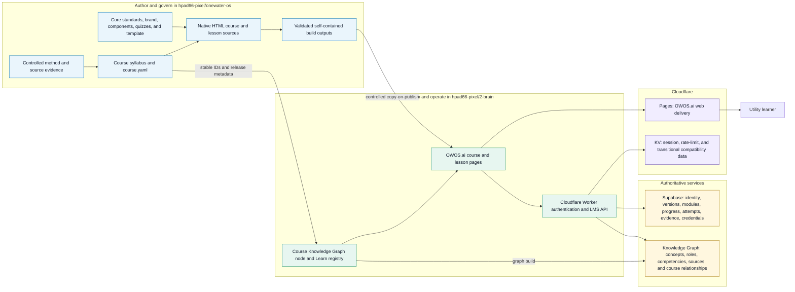
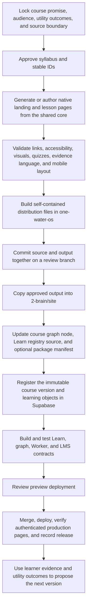

# OWOS Course-to-Learn Architecture

**Document owner:** One Water Operating System  
**Canonical repository:** `hpad66-pixel/onewater-os`  
**Applies to:** every OWOS course, Master Class, lesson, quiz, assessment, and credential  
**Status:** governed implementation contract  
**Version:** 1.0  
**Last updated:** 2026-07-19

## Purpose

This document is the durable map for building an OWOS course and delivering it through the Learn
module on [OWOS.ai](https://owos.ai/learn). It tells a future author or developer where each kind of
information belongs, how it moves, and which system is authoritative.

The central rule is simple:

> `onewater-os` owns what OWOS teaches. `2-brain` operates how OWOS.ai delivers and connects it.
> Supabase records learner and release state. The Knowledge Graph records meaning and relationships.
> Cloudflare serves and protects the experience.

No runtime copy, database record, or generated package silently becomes the curriculum source of
truth.

## The complete system



## System-of-record matrix

| Information or artifact | System of record | Runtime or derived copy | Rule |
| --- | --- | --- | --- |
| Course promise, syllabus, chapter sequence, examples, and assessment design | `onewater-os/apps/<course>/` | OWOS Learn registry and pages | Change the source first, then rebuild |
| Writing, visual, quiz, component, and brand rules | `onewater-os/core/` | Inlined into deployed HTML | Reuse the core; do not fork visual behavior per course |
| Stable course and chapter identifiers | `course.yaml` and governed source files | Knowledge Graph, Supabase, Worker registry | IDs survive title and URL changes |
| Deployable native HTML | `onewater-os/apps/<course>/dist/site/` | `2-brain/site/` | Runtime copy must be reproducible from source |
| Learn catalog card and graph relationships | `2-brain/wiki/courses/` | `2-brain/site/learn.json` and public graph | Build from the graph node; do not hand-edit `learn.json` |
| Course versions, module structure, learner enrollment, progress, attempts, evidence, and credentials | Supabase | Worker API responses | Server-side writes only; Row Level Security remains enabled |
| Concepts, roles, competencies, sources, contributors, and semantic links | OWOS Knowledge Graph | Public graph projection and Learn links | Course nodes link to concepts; they do not duplicate the curriculum |
| Web delivery, authentication gateway, caching, and rate limiting | Cloudflare Pages and Worker | Browser experience | No Supabase service key or GraphDB credential reaches the browser |
| Sessions, rate limits, and transitional compatibility records | Cloudflare KV | Worker lookups | KV is not the LMS or curriculum authority |

## The executable course core

Every course uses the same foundation. The five files below determine how authors assemble modules,
quizzes, and branded learning pages:

1. `core/standards/WRITING-STANDARD.md` defines voice, lesson depth, evidence, checks, and acceptance.
2. `core/standards/VISUAL-ARSENAL.md` defines how to choose diagrams, simulations, and interactions.
3. `core/components/component-gallery.html` is the reference catalog for learning components.
4. `core/components/quiz-gallery.html` is the reference catalog for quiz patterns and feedback.
5. `core/components/module-template.html` provides the required page structure and OWOS chrome.

`core/components/academy.css` and `core/components/academy.js` are the shared implementation library.
`core/brand/` contains the governed identity, Droobi assets, and brand rules. A build may inline these
assets for portability, but the inlined copy remains derived.

## Repository responsibilities

### `hpad66-pixel/onewater-os`: canonical curriculum

This monorepo contains the governed teaching source. Each application folder owns its syllabus,
machine-readable course record, native lesson sources, and reproducible distribution build. Git history
records why the curriculum changed and which source and method versions it used.

For Data and Artificial Intelligence Governance, the canonical folder is:

```text
apps/data-ai-governance/
  README.md
  course.yaml
  curriculum/
    SYLLABUS.md
    masterclass-data-governance.html
    module-00-*.html through module-24-*.html
  dist/site/
    course-data-governance.html
    lesson-dg-00-*.html through lesson-dg-24-*.html
```

### `hpad66-pixel/2-brain`: OWOS.ai operating repository

This repository owns the Learn catalog, public Knowledge Graph projection, Cloudflare Worker, and
deployed site copy. It receives validated course outputs and connects their stable identifiers to the
platform. It must not become an alternate editing location for curriculum content.

The important runtime locations are:

```text
wiki/courses/                         governed course catalog nodes
site/learn.html                       Learn experience
site/learn.json                       generated Learn registry
site/_worker.js                       authentication and LMS transaction gateway
site/course-*.html                    published course landing copies
site/lesson-*.html                    published lesson copies
supabase/migrations/                  immutable release and LMS schema changes
learning-packages/<course>/           optional external-LMS exports and manifests
```

### Supabase: transactional learning authority

Supabase stores identities, course versions, module and learning-object structure, enrollments,
append-only activity events, assessment attempts, evidence, outcomes, alignments, and credentials.
Released versions are immutable. A curriculum change creates a new version instead of rewriting the
learner's history.

### Knowledge Graph: meaning and discovery authority

The graph connects a course or lesson to the concepts it teaches, the roles it serves, the
competencies it develops, and the sources that support it. The graph improves discovery and grounded
explanation. It does not store learner scores or replace the full lesson body.

### Cloudflare: protected delivery edge

Cloudflare Pages serves OWOS.ai. The Worker validates the user, enforces access and rate controls,
and makes server-side calls to Supabase and the graph gateway. Cloudflare KV supports sessions,
rate-limit counters, and compatibility needs only. Course completion and credentials never depend on
KV as their authority.

## Course build and release flow



### Release gates

A course is not labeled published merely because its pages exist. The release owner confirms:

- the source method and citations are pinned;
- the syllabus, section count, stable IDs, and runtime registry agree;
- every released lesson meets the writing, visual, quiz, and accessibility standards;
- quizzes, attempts, completion rules, evidence, and credential claims behave as documented;
- Supabase migrations and Row Level Security tests pass;
- graph and Learn builds pass without orphaned targets;
- desktop and phone layouts are visually reviewed;
- the authenticated OWOS.ai production page is verified after deployment.

Shells may be visible during development, but they must say that lesson content is pending and must
not emit completion, assessment, or credential events.

## Data Governance course contract

The first implementation of this architecture is the Data Before AI Master Class.

| Field | Governed value |
| --- | --- |
| Course ID | `owos-master-data-governance-001` |
| Runtime store key | `dga001` |
| Slug | `data-before-ai-governance` |
| Canonical title | Data Before AI: Data and Artificial Intelligence Governance for Utilities |
| Structure | 25 chapters, numbered 00 through 24; 75 sections; applied capstone |
| Primary format | Native OWOS HTML |
| Curriculum authority | `apps/data-ai-governance/` in `onewater-os` |
| Runtime landing | `/course-data-governance` on OWOS.ai |
| Catalog and graph node | `wiki/courses/course-data-before-ai-governance.md` in `2-brain` |
| Guided effort | 45-hour planning estimate pending pilot |
| Credential | Proposed completion credential only; not certification or assurance |

The course shell exposes all 25 chapter destinations while lesson development is pending. That is a
structural release, not a content release. `available_modules` stays zero until a lesson passes its
acceptance gate.

## Catalog preservation rule

The seven entries currently visible in OWOS Learn are separate governed programs, not seven draft
chapters of this course. Adding the 25 Data Governance chapters replaces the existing zero-module Data
Governance placeholder only. It does not delete or renumber the other six programs. Removing another
program requires its exact course ID, an owner decision, and a migration or archive record.

## Change and version control

1. Make curriculum changes in `onewater-os` on a review branch.
2. Update `course.yaml`, `VERSION`, and `CHANGELOG.md` when the governed contract or build changes.
3. Regenerate outputs; do not patch distribution files by hand.
4. Commit source and reproducible output together.
5. In `2-brain`, register the source repository, source ref, checksum, and immutable course version.
6. Use a second review branch for runtime copies, catalog metadata, migrations, and Worker changes.
7. Merge and deploy only after both sides pass their tests and the release owner approves the preview.
8. Record the production verification. If production differs from the approved commit, stop and repair
   provenance before issuing completion records.

## What must never happen

- Do not edit `site/learn.json` by hand; rebuild it from governed graph records.
- Do not make a runtime HTML copy the only copy of a lesson.
- Do not expose database service credentials or GraphDB credentials to browser code.
- Do not store authoritative progress or credentials in Cloudflare KV.
- Do not silently change stable course or lesson IDs when a title changes.
- Do not claim a placeholder shell is an available lesson.
- Do not delete unrelated catalog courses while expanding one course.
- Do not overwrite a released course version; issue the next version.

## Definition of done for a new OWOS course

A new course is fully wired when a reviewer can start from its `course.yaml`, reproduce its landing and
lesson files, find the same stable IDs in the Learn catalog and Supabase migration, follow its Knowledge
Graph relationships, use the authenticated OWOS.ai experience, and trace the production page back to a
reviewed Git commit. That trace is the architecture's proof that OWOS has one curriculum truth and one
operating path.
